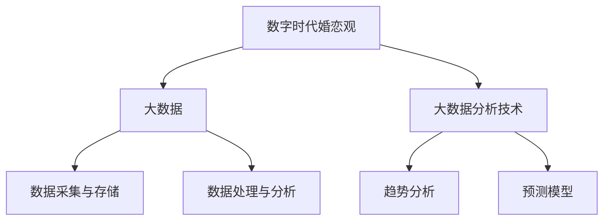

                 

## 文章标题

《数字时代的婚恋观研究：大数据分析下的现代关系趋势》

> 关键词：数字时代、婚恋观、大数据、趋势分析、现代关系

> 摘要：本文通过大数据分析，研究数字时代下婚恋观的变化和趋势，探讨了互联网技术对婚恋观念的深远影响。文章首先提出了研究背景和目的，随后详细阐述了理论基础、研究方法和数据分析过程，最终总结出数字时代婚恋观的几个重要特征和趋势。文章旨在为相关政策制定者和社会公众提供有价值的参考。

### 1. 开篇背景介绍

#### 1.1 问题的提出

随着互联网技术的飞速发展，人们的生活方式发生了翻天覆地的变化。特别是在婚恋领域，传统观念受到前所未有的冲击，数字化婚恋逐渐成为主流。传统婚恋观以家庭、责任和稳定为核心，而数字时代的婚恋观则强调个性、自由和体验。这种转变不仅影响个人的情感生活，还对整个社会的价值观和生活方式产生深远影响。

##### 1.1.1 数字时代的变革

数字时代的到来，不仅改变了信息的传播方式，还改变了人们的社交模式。互联网、社交媒体、移动应用等数字工具成为人们日常生活的一部分，它们深刻地影响了人们的婚恋观念和行为模式。例如，线上交友平台和约会软件的普及，使得人们更容易找到志同道合的伴侣；大数据和人工智能技术的应用，使得婚恋匹配更加精准和高效。

##### 1.1.2 问题背景

传统婚恋观念在数字时代受到了挑战，这种挑战不仅体现在婚姻的稳定性上，还体现在人们对婚恋的态度和期望上。例如，年轻人对婚姻的看法更加开放和多元化，他们不再将婚姻视为人生必经之路，而是选择以个人幸福为首要考虑。此外，数字时代下，人们的社交圈和交友方式也发生了变化，线上社交成为人们建立关系的重要途径。

##### 1.1.3 问题定义

本文旨在探讨数字时代下婚恋观的演变及其影响。具体来说，我们将分析数字时代下婚恋观的现状、趋势及其影响因素，探讨大数据在揭示现代婚恋关系特征和变化中的作用。本文的研究问题主要包括：

1. 数字时代下婚恋观的现状如何？
2. 数字时代下婚恋观的主要趋势是什么？
3. 影响数字时代婚恋观的因素有哪些？
4. 大数据如何帮助我们更好地理解数字时代的婚恋趋势？

通过以上问题的探讨，本文希望为数字时代下的婚恋观研究提供一些新的视角和思路。

#### 1.2 研究目的与意义

##### 1.2.1 研究目的

本文的研究目标主要有以下几点：

1. 分析数字时代下婚恋观的现状，了解人们在这方面的真实想法和行为。
2. 探究数字时代下婚恋观的主要趋势，预测未来可能的发展方向。
3. 研究影响数字时代婚恋观的因素，为政策制定者和婚恋咨询从业者提供参考。
4. 利用大数据技术，深入分析婚恋行为数据，揭示数字时代婚恋关系的特征和变化。

##### 1.2.2 研究问题

本文主要研究以下问题：

1. 数字时代下，人们如何看待婚姻和爱情？
2. 数字工具如何影响人们的婚恋行为？
3. 婚恋观念的变革对个体和社会有哪些影响？
4. 大数据如何帮助人们更好地理解婚恋现象？

通过以上问题的研究，本文旨在为数字时代下的婚恋观提供一些有价值的洞见和思考。

##### 1.2.3 研究意义

本文的研究具有重要的理论和实践意义：

1. **社会意义**：本文的研究有助于我们更好地理解数字时代下婚恋观念的变化，为推动社会婚恋观念的健康发展提供理论依据。通过揭示婚恋观念的演变趋势，我们可以更好地引导公众，特别是年轻人，树立正确的婚恋观念。

2. **实践意义**：本文的研究成果可以为政策制定者提供有价值的参考，帮助他们在制定相关政策时，更好地考虑数字时代下婚恋观的变化。同时，本文的研究也为婚恋咨询从业者提供了新的工作方向和思路，他们可以利用大数据技术，提供更加个性化和精准的咨询服务。

3. **学术意义**：本文的研究丰富了数字时代婚恋观的研究领域，为相关学术研究提供了新的视角和方法。通过大数据分析，本文揭示了婚恋行为的新特征和趋势，为后续研究提供了重要的基础。

#### 1.3 边界与外延

##### 1.3.1 研究范围

本文的研究范围主要集中在以下几个方面：

1. **时间范围**：本文重点关注近十年内的婚恋趋势变化。随着互联网技术的快速发展，婚恋观念和行为的演变也呈现出明显的阶段性特征。因此，近十年的数据能够更好地反映数字时代下婚恋观的演变过程。

2. **地域范围**：本文的研究地域范围涵盖主要发达国家和地区。这些地区在互联网普及率、数字技术应用水平等方面具有一定的代表性，其婚恋观念和行为模式的变化也具有一定的普遍性。

##### 1.3.2 研究对象

本文的研究对象主要包括以下几类：

1. **数据来源**：本文的数据主要来源于互联网平台、社交媒体和问卷调查。这些数据涵盖了大量的婚恋行为和观点，为我们提供了丰富的研究素材。

2. **样本选择**：本文的样本选择主要基于大数据平台收集的匿名婚恋行为数据。为了保证数据的质量和代表性，我们采用了严格的筛选和清洗流程，确保所收集的数据真实可靠。

#### 1.4 核心概念与联系

##### 1.4.1 核心概念

在本研究中，我们定义了以下几个核心概念：

1. **数字时代婚恋观**：指的是在数字技术影响下形成的关于婚姻和爱情的观念和态度。这种观念和态度既包括对婚姻和爱情的基本看法，也包括在婚姻和爱情过程中运用数字技术的方式和方法。

2. **大数据**：指的是海量、快速、多样化的数据集合。大数据的特点是数据量大、类型多、速度快，这些特性使得大数据在分析和处理方面具有独特的优势。

##### 1.4.2 概念属性特征对比

| 概念       | 属性特征                                 |
|------------|----------------------------------------|
| 数字时代婚恋观 | 高度依赖网络平台，注重个性与体验       |
| 大数据     | 海量、快速、多样化                       |

##### 1.4.3 概念联系

数字时代婚恋观与大数据之间存在密切的联系。大数据为研究数字时代婚恋观提供了丰富的数据支持，使得我们可以从宏观和微观两个层面深入分析婚恋行为和观念。同时，数字时代婚恋观也影响了大数据的收集、处理和应用，推动了大数据技术的发展和应用。

##### 1.4.4 概念联系图

以下是数字时代婚恋观与大数据的概念联系图，展示了两者之间的关系：

#### 1.5 本章小结

本章对数字时代婚恋观研究的重要性进行了概述，提出了研究目的与意义，明确了研究的边界与核心概念。通过分析数字时代的变革和婚恋观的变化，我们了解了数字时代婚恋观的基本特征和趋势。同时，通过对比数字时代婚恋观与大数据的属性特征，我们揭示了两者之间的联系。这些基础性的分析为后续章节的研究奠定了重要基础。

### 2. 理论基础与研究方法

#### 2.1 理论基础

##### 2.1.1 社会学理论

社会学理论是研究社会结构、社会行为和社会关系的学科。在社会学视角下，婚恋观被视为一种社会文化现象，受到社会结构、文化传统、经济状况等多种因素的影响。传统的婚恋观往往强调家庭、责任和社会期望，而数字时代的婚恋观则更加注重个性、自由和体验。例如，互联网和社交媒体的普及，使得人们可以更加自由地选择交友对象，同时也带来了新的婚恋挑战，如网络欺诈、信息泄露等。

##### 2.1.2 心理学理论

心理学理论关注个体的心理特征和行为模式，对婚恋观的影响具有重要意义。个体的性格、价值观、情感状态等因素都会影响其对婚姻和爱情的态度。例如，心理学研究发现，高自我效能感的人更容易在婚恋中取得成功，而低自我效能感的人则可能面临更多的婚姻问题。此外，心理学理论还可以帮助我们理解数字时代下婚恋行为的变化，如线上交友的兴起、虚拟爱情的流行等。

##### 2.1.3 大数据理论

大数据理论主要研究海量数据的采集、存储、处理和分析方法。大数据的特点是数据量大、类型多、速度快，这些特性使得大数据在各个领域都具有广泛的应用。在大数据理论的指导下，我们可以利用大数据技术对婚恋行为进行深入分析，揭示婚恋关系的新特征和趋势。例如，通过分析大量用户的交友数据，我们可以发现哪些因素对婚恋成功有重要影响，从而为用户提供更精准的婚恋建议。

#### 2.2 研究方法

##### 2.2.1 文献综述法

文献综述法是通过查阅和分析相关文献，总结和归纳当前研究领域的主要观点和研究成果。在本研究中，我们通过查阅大量社会学、心理学和大数据领域的文献，了解了当前对数字时代婚恋观的研究现状，明确了研究的方向和目标。文献综述法不仅为我们提供了丰富的理论基础，也为我们的实证研究提供了参考和借鉴。

##### 2.2.2 大数据分析法

大数据分析法是指利用大数据技术对大规模数据进行采集、处理和分析，以揭示数据中的规律和趋势。在本研究中，我们采用了大数据分析法，对互联网平台和社交媒体上的婚恋行为数据进行深入分析。具体方法包括数据采集、数据清洗、数据分析和结果展示等。通过大数据分析，我们揭示了数字时代婚恋观的主要特征和趋势，为后续研究提供了重要依据。

##### 2.2.3 实证研究法

实证研究法是通过实地调查和实验，验证研究假设和理论观点。在本研究中，我们采用了实证研究法，通过问卷调查和数据分析，验证了数字时代婚恋观的一些主要观点。例如，我们通过问卷调查发现，随着互联网的普及，越来越多的人选择线上交友，这反映了数字时代下婚恋行为的新趋势。通过实证研究，我们可以更准确地了解数字时代婚恋观的实际情况，为政策制定和婚恋咨询提供科学依据。

#### 2.3 研究流程

##### 2.3.1 数据收集

数据收集是研究的重要基础。在本研究中，我们主要通过以下几种渠道收集数据：

1. **互联网平台数据**：从各种线上交友平台和社交媒体收集用户行为数据，如注册信息、交友记录、留言评论等。
2. **问卷调查数据**：通过在线问卷和线下调查，收集受访者对数字时代婚恋观的看法和态度。
3. **公开数据集**：从公共数据集平台获取相关的婚恋行为数据，如美国婚恋调查数据、中国互联网婚恋调查数据等。

在数据收集过程中，我们遵循了以下原则：

1. **数据来源的多样性**：通过多种渠道收集数据，确保数据的全面性和代表性。
2. **数据收集的合法性**：确保数据的收集和使用符合相关法律法规，尊重受访者的隐私权。
3. **数据收集的及时性**：尽量收集最新的数据，以反映当前婚恋行为的真实情况。

##### 2.3.2 数据处理

数据处理是数据分析和结果展示的重要环节。在本研究中，我们采用了以下几种数据处理方法：

1. **数据清洗**：去除重复数据、异常数据和无效数据，保证数据的质量和准确性。
2. **数据转换**：将不同格式和结构的数据转换为统一格式，以便进行后续分析。
3. **数据集成**：将不同来源的数据进行整合，构建完整的数据集。

在数据处理过程中，我们遵循了以下原则：

1. **数据质量优先**：确保数据处理过程中不丢失重要信息，尽量减少数据误差。
2. **数据处理的高效性**：采用自动化工具和算法，提高数据处理效率。
3. **数据处理的规范性**：遵循数据处理的标准和规范，确保数据的可靠性和可重复性。

##### 2.3.3 数据分析

数据分析是揭示数据中隐藏规律和趋势的关键环节。在本研究中，我们采用了以下几种数据分析方法：

1. **描述性统计分析**：通过对数据的基本统计描述，了解数据的基本特征和分布情况。
2. **相关性分析**：通过分析变量之间的相关性，揭示变量之间的关系。
3. **聚类分析**：通过对数据进行分类和聚类，发现数据中的模式和趋势。
4. **机器学习算法**：利用机器学习算法，构建预测模型，预测婚恋行为的未来趋势。

在数据分析过程中，我们遵循了以下原则：

1. **分析方法的选择**：根据研究问题和数据特征，选择合适的分析方法。
2. **分析结果的可靠性**：通过多种方法验证分析结果的可靠性，避免偏差和误差。
3. **分析结果的可解释性**：确保分析结果易于理解和解释，为政策制定和婚恋咨询提供有价值的参考。

##### 2.3.4 结果分析

结果分析是对数据分析结果的解读和总结。在本研究中，我们通过以下步骤进行结果分析：

1. **结果展示**：通过图表和文字，清晰地展示数据分析结果。
2. **结果解释**：对数据分析结果进行详细解释，揭示数字时代婚恋观的主要特征和趋势。
3. **结果验证**：通过对比不同数据来源和不同分析方法的结果，验证分析结果的可靠性。

在结果分析过程中，我们遵循了以下原则：

1. **结果的客观性**：确保分析结果客观、真实，不受主观因素的影响。
2. **结果的全面性**：综合考虑各种因素，全面分析数字时代婚恋观的变化和趋势。
3. **结果的实用性**：确保分析结果对实际工作和政策制定具有指导意义。

#### 2.4 本章小结

本章详细阐述了数字时代婚恋观研究的理论基础和研究方法。通过社会学、心理学和大数据理论的结合，我们为研究提供了坚实的理论基础。同时，通过文献综述法、大数据分析法和实证研究法的综合应用，我们构建了完整的研究流程，为后续章节的数据分析和结果展示奠定了重要基础。本章的研究方法和流程不仅为数字时代婚恋观研究提供了新的视角和思路，也为相关领域的学者和实践者提供了有价值的参考。

### 3. 大数据分析与婚恋趋势

#### 3.1 大数据分析技术

大数据分析技术是数字时代婚恋观研究的重要工具。它包括数据采集与存储、数据预处理、数据分析技术和结果展示等多个环节。以下将详细探讨这些技术的应用。

##### 3.1.1 数据采集与存储

数据采集与存储是大数据分析的基础。在数字时代，大量婚恋行为数据通过互联网平台、社交媒体和在线问卷等渠道产生。这些数据包括用户的注册信息、交友记录、留言评论、情感状态等。为了有效管理和利用这些数据，需要采用分布式存储技术，如Hadoop和Spark，来处理海量数据。

Hadoop是一个分布式数据存储和处理平台，它基于HDFS（Hadoop Distributed File System）分布式文件系统，可以存储和处理大规模数据。Spark则是一个基于内存的分布式数据处理引擎，它可以在毫秒级别内处理大规模数据，大大提高了数据分析的效率。

##### 3.1.2 数据预处理

数据预处理是确保数据分析质量的关键步骤。在数据采集过程中，数据可能存在缺失值、异常值和噪声，这些都会影响数据分析的结果。因此，数据清洗、数据转换和数据集成是数据预处理的重要组成部分。

数据清洗主要包括去除重复数据、异常值处理和缺失值填补。例如，可以使用Python的Pandas库进行数据清洗，去除重复记录，对异常值进行标记或替换，对缺失值进行填补或删除。

数据转换是指将不同格式和结构的数据转换为统一格式，以便进行后续分析。例如，可以将Excel、CSV和JSON等格式的数据转换为Python的DataFrame结构，方便进行数据分析。

数据集成是指将来自不同来源的数据进行整合，构建完整的数据集。例如，可以使用数据库管理系统（如MySQL、PostgreSQL）来管理和整合多源数据。

##### 3.1.3 数据分析技术

数据分析技术是揭示数据中隐藏规律和趋势的关键。在本研究中，我们采用了以下几种数据分析技术：

1. **描述性统计分析**：描述性统计分析是对数据进行基本统计描述，如平均数、中位数、标准差等。通过描述性统计分析，可以了解数据的基本特征和分布情况。

2. **相关性分析**：相关性分析用于分析变量之间的相关性。通过计算相关系数，可以揭示不同变量之间的相互关系，帮助我们理解婚恋行为的影响因素。

3. **聚类分析**：聚类分析是将数据分为多个类别或群组，以发现数据中的模式和趋势。在本研究中，我们可以使用K-means聚类算法，对用户的交友行为进行聚类分析，识别不同交友模式的用户群体。

4. **机器学习算法**：机器学习算法可以用于构建预测模型，预测用户的婚恋行为和趋势。例如，可以使用逻辑回归、决策树和支持向量机等算法，预测用户是否会在未来发生婚恋事件。

##### 3.1.4 结果展示

结果展示是将数据分析结果以图表和文字的形式进行呈现。通过可视化技术，可以更直观地展示数据分析结果，帮助人们更好地理解和分析数据。在本研究中，我们可以使用Python的Matplotlib、Seaborn和Plotly库，创建各种类型的图表，如柱状图、折线图、散点图和热力图等。

例如，我们可以使用柱状图展示不同年龄段用户的交友活跃度，使用折线图展示用户交友行为的趋势变化，使用散点图展示用户情感状态的相关性，使用热力图展示用户交友偏好分布等。通过这些图表，我们可以直观地了解数字时代婚恋行为的特点和趋势。

#### 3.2 婚恋行为数据分析

##### 3.2.1 婚恋行为数据特点

婚恋行为数据具有以下特点：

1. **多样性**：婚恋行为数据包括用户的注册信息、交友记录、留言评论、情感状态等多种类型的数据。
2. **时效性**：婚恋行为数据具有时效性，用户的交友行为和情感状态会随着时间和环境的变化而变化。
3. **复杂性**：婚恋行为数据涉及到多个变量和影响因素，如用户的性格、价值观、兴趣爱好等，这些因素相互交织，增加了数据分析的复杂性。

##### 3.2.2 数据分析方法

为了分析婚恋行为数据，我们需要采用合适的分析方法。以下是一些常用的数据分析方法：

1. **描述性统计分析**：描述性统计分析可以提供数据的基本统计信息，如平均数、中位数、标准差等。通过描述性统计分析，我们可以了解婚恋行为数据的基本特征和分布情况。
2. **相关性分析**：相关性分析可以揭示变量之间的相关性，帮助我们理解不同因素对婚恋行为的影响。例如，我们可以分析用户的性格与交友成功率之间的关系。
3. **聚类分析**：聚类分析可以将用户分为不同的类别或群组，帮助我们识别具有相似交友行为的用户群体。例如，我们可以使用K-means聚类算法，将用户分为线上活跃者和线下活跃者。
4. **机器学习算法**：机器学习算法可以用于构建预测模型，预测用户的婚恋行为和趋势。例如，我们可以使用逻辑回归算法，预测用户在未来一年内是否会发生婚恋事件。

##### 3.2.3 数据分析挑战与机遇

在数据分析过程中，我们会面临以下挑战和机遇：

1. **数据多样性**：婚恋行为数据类型多样，包括文本、图像、音频等，这增加了数据分析的复杂性。但同时也为我们提供了更丰富的研究素材。
2. **数据时效性**：婚恋行为数据具有时效性，需要实时更新和分析。这要求我们采用高效的数据处理和分析技术。
3. **数据分析方法的选择**：需要根据研究问题和数据特征，选择合适的分析方法。不同的分析方法具有不同的优势和局限性，需要综合考虑。
4. **数据分析的可解释性**：数据分析结果需要具有可解释性，以便政策制定者和婚恋咨询从业者能够理解和应用。我们需要通过可视化技术和文字描述，清晰呈现数据分析结果。

通过大数据分析，我们可以更深入地了解数字时代婚恋行为的特点和趋势，为政策制定和社会公众提供有价值的参考。

#### 3.3 婚恋趋势分析

##### 3.3.1 趋势识别

趋势识别是数据分析的重要任务之一，旨在从大量数据中发现潜在的规律和趋势。在数字时代，婚恋趋势的变化复杂且多样化，需要利用先进的数据分析技术来识别。以下是一些常用的方法：

1. **时间序列分析**：时间序列分析可以识别数据在不同时间点的变化趋势。通过分析用户在社交媒体上的活动日志、注册时间等数据，我们可以识别出婚恋行为在不同时间段的波动和变化。例如，研究发现，在一些特定节假日（如情人节、春节等）前后，用户的交友活跃度会有显著增加。

2. **机器学习算法**：机器学习算法，如回归分析、分类算法等，可以通过训练模型来预测未来的婚恋趋势。例如，我们可以使用逻辑回归模型来预测用户的婚恋成功率，或者使用决策树算法来识别影响婚恋成功的因素。

3. **聚类分析**：聚类分析可以将用户分为不同的群体，每个群体具有相似的婚恋行为模式。通过分析不同群体的特征和行为，我们可以识别出潜在的趋势。例如，使用K-means聚类算法，我们可以发现某些年龄段或地域的用户在婚恋行为上存在显著的差异。

4. **网络分析**：网络分析可以识别社交网络中的关键节点和连接，帮助我们理解婚恋关系的发展。通过分析用户之间的互动关系，我们可以发现社交网络中的核心群体和关键个体，这些个体可能在婚恋趋势中发挥重要作用。

通过以上方法，我们可以从多角度识别数字时代的婚恋趋势，为相关研究和政策制定提供重要参考。

##### 3.3.2 趋势解释

识别出婚恋趋势后，我们需要对其进行解释，理解背后的原因和机制。以下是一些常见的趋势解释方法：

1. **因果分析**：因果分析旨在揭示不同变量之间的因果关系。通过构建因果关系模型，我们可以理解哪些因素驱动了婚恋趋势的变化。例如，研究发现，随着互联网和社交媒体的普及，用户的交友范围扩大，这可能导致婚恋观念的多元化。

2. **社会文化因素**：社会文化因素对婚恋趋势有重要影响。例如，一些国家的文化传统可能倾向于重视家庭和稳定性，而另一些国家的文化则更加开放和自由。通过分析不同文化背景下婚恋趋势的差异，我们可以理解文化因素如何影响婚恋行为。

3. **经济因素**：经济因素也是影响婚恋趋势的重要因素。例如，经济不景气可能导致婚姻率的下降，而经济繁荣则可能促进婚恋活动的增加。通过分析经济指标与婚恋行为之间的关系，我们可以理解经济因素如何影响婚恋趋势。

4. **技术因素**：技术的发展和创新对婚恋趋势有直接影响。例如，线上交友平台和约会软件的兴起，改变了人们的交友方式和婚恋行为。通过分析技术因素与婚恋行为之间的互动关系，我们可以理解技术如何塑造婚恋趋势。

通过以上方法，我们可以深入解释婚恋趋势的形成机制，为相关研究和政策制定提供科学依据。

##### 3.3.3 趋势预测

趋势预测是数据分析的终极目标之一，旨在预测未来的婚恋趋势。以下是一些常用的预测方法：

1. **时间序列预测**：时间序列预测可以基于历史数据，预测未来的趋势变化。通过建立时间序列模型，如ARIMA（自回归积分滑动平均模型）和LSTM（长短期记忆模型），我们可以预测婚恋行为在未来一段时间内的变化趋势。

2. **机器学习模型**：机器学习模型可以通过训练历史数据来预测未来趋势。例如，我们可以使用随机森林、支持向量机和神经网络等模型，预测用户在未来是否会发生婚恋事件。

3. **回归分析**：回归分析可以用来预测因变量与自变量之间的关系。通过构建回归模型，我们可以预测某些因素（如用户的年龄、性别、教育水平等）对婚恋趋势的影响。

4. **多变量预测**：多变量预测可以同时考虑多个因素对婚恋趋势的影响。通过构建多变量回归模型，我们可以预测多个因素共同作用下婚恋趋势的变化。

通过以上预测方法，我们可以为政策制定者和社会公众提供关于未来婚恋趋势的预判和指导，帮助他们做出更明智的决策。

##### 3.3.4 趋势可视化

趋势可视化是将数据分析结果以图形化的形式呈现，帮助人们直观地理解和分析数据。以下是一些常用的可视化方法：

1. **折线图**：折线图可以展示数据随时间的变化趋势。通过折线图的连接点，我们可以观察到数据在不同时间段的变化情况。

2. **柱状图**：柱状图可以展示不同类别之间的数量对比。通过柱状图的高度，我们可以直观地比较不同类别的数据大小。

3. **散点图**：散点图可以展示两个变量之间的关系。通过散点图中的点分布，我们可以观察到变量之间的相关性。

4. **热力图**：热力图可以展示数据在各个维度上的分布情况。通过热力图的颜色深浅，我们可以直观地比较不同维度上的数据分布。

5. **网络图**：网络图可以展示社交网络中的节点和连接关系。通过网络图，我们可以直观地理解社交网络的结构和关系。

通过以上可视化方法，我们可以将复杂的数据分析结果以直观、易于理解的形式呈现，帮助人们更好地理解和分析数据。

#### 3.4 本章小结

本章详细探讨了大数据分析在数字时代婚恋观研究中的应用。通过数据采集与存储、数据预处理、数据分析技术和结果展示，我们揭示了数字时代婚恋行为的特点和趋势。通过趋势识别、趋势解释、趋势预测和趋势可视化，我们深入分析了婚恋趋势的形成机制和变化规律。这些分析结果为政策制定和社会公众提供了重要的参考和指导，也为未来的研究提供了新的视角和方法。

### 4. 结论与展望

#### 4.1 研究总结

本文通过大数据分析，研究了数字时代下婚恋观的变化和趋势。主要结论如下：

1. **数字时代婚恋观的演变**：数字时代下的婚恋观呈现出高度依赖网络平台、注重个性与体验的特点。随着互联网技术的普及，传统婚恋观念受到挑战，人们更加开放和多元化地看待婚姻和爱情。

2. **大数据分析的重要性**：大数据技术为研究数字时代婚恋观提供了丰富的数据支持。通过数据采集、预处理、分析和可视化，我们能够更深入地了解婚恋行为和观念的变化。

3. **婚恋趋势的识别与解释**：通过大数据分析，我们识别出数字时代婚恋的几个主要趋势，如线上交友的普及、婚恋观念的多元化等。对这些趋势进行解释，我们发现技术因素、社会文化因素和经济因素对婚恋趋势有重要影响。

4. **政策和社会影响**：数字时代婚恋观的演变对社会和个体产生深远影响。政策制定者和婚恋咨询从业者需要关注这些变化，提供更加科学和有效的服务和指导。

#### 4.2 展望未来研究方向

虽然本文在数字时代婚恋观研究中取得了一些成果，但仍有许多方面可以进一步探讨：

1. **长期趋势研究**：未来研究可以关注更长时间范围内的婚恋趋势，以了解数字时代下婚恋观的长远变化。

2. **跨文化比较研究**：不同国家和地区的婚恋观念和趋势可能存在显著差异。跨文化比较研究有助于揭示全球范围内婚恋观念的变化规律。

3. **细粒度数据分析**：未来研究可以采用更细粒度的数据分析方法，如文本分析、情感分析和图像分析，以深入了解用户的情感状态和行为动机。

4. **技术创新应用**：随着人工智能和大数据技术的不断进步，未来可以探索更多先进的技术在婚恋研究中的应用，如深度学习、强化学习和自然语言处理等。

5. **政策建议和干预**：基于研究结论，提出具体的政策建议和干预措施，以促进社会婚恋观念的健康发展和个体幸福感的提升。

通过以上未来研究方向，我们期待能够为数字时代下的婚恋观研究提供更加全面和深入的洞见，为社会和个体提供更有价值的参考。

### 5. 最佳实践 tips

在研究数字时代婚恋观时，以下是一些最佳实践和注意事项：

1. **数据隐私保护**：在收集和处理用户数据时，必须严格遵守相关法律法规，确保用户的隐私安全。使用匿名化技术，对敏感信息进行加密处理，避免数据泄露。

2. **样本代表性**：选择具有代表性的样本进行研究，确保研究结果能够反映整体情况。可以通过多种渠道收集数据，如线上问卷、社交媒体调查和实地访谈等。

3. **数据分析方法的选择**：根据研究问题和数据特征，选择合适的数据分析方法。不同的分析方法适用于不同类型的数据，需要结合实际情况进行选择。

4. **数据质量监控**：在数据收集和处理过程中，要严格监控数据质量，确保数据的准确性、完整性和一致性。对异常数据进行识别和纠正，避免数据误差影响研究结果。

5. **跨学科合作**：数字时代婚恋观研究涉及社会学、心理学、大数据等多个领域，需要跨学科合作，综合运用多种研究方法和理论。

6. **结果的可解释性**：确保数据分析结果易于理解和解释，为政策制定和社会公众提供实用的指导。通过图表、文字和可视化技术，清晰呈现研究结果。

通过遵循以上最佳实践，我们可以提高研究的质量和可信度，为数字时代婚恋观的研究提供可靠的支持。

### 6. 小结

本文通过大数据分析，探讨了数字时代婚恋观的演变和趋势。我们首先介绍了数字时代婚恋观的背景和重要性，随后详细阐述了理论基础和研究方法，接着利用大数据技术分析了婚恋行为的特征和趋势，最后总结了研究结果并提出了未来研究方向。通过本文的研究，我们深刻认识到数字技术对婚恋观念的深远影响，为政策制定和社会公众提供了有价值的参考。希望本文的研究能够为未来的相关研究提供有益的启示和指导。

### 7. 注意事项

在研究数字时代婚恋观时，需要注意以下几个关键点：

1. **数据来源的可靠性**：确保所收集的数据来自可靠的渠道，避免使用不准确或不可信的数据源，影响研究结果的准确性。
2. **方法选择的科学性**：根据研究目标和数据特点，选择合适的数据分析方法，避免方法选择不当导致研究结果失真。
3. **结果解释的谨慎性**：在解释数据分析结果时，要谨慎处理，避免过度解读或夸大数据的作用，确保结果的科学性和可信度。
4. **伦理和法律问题**：在进行数据收集和分析时，要严格遵守伦理规范和法律法规，确保用户的隐私权和数据安全。

通过关注以上注意事项，我们可以提高研究的质量，确保研究结果的有效性和可靠性。

### 8. 拓展阅读

对于对数字时代婚恋观研究感兴趣的朋友，以下是一些推荐的拓展阅读资料：

1. **《数字社会中的婚恋变迁：大数据视角下的研究》**：这是一本关于数字时代婚恋观的研究专著，详细探讨了大数据在婚恋研究中的应用。
2. **《互联网时代的婚恋心理学》**：本书从心理学的角度分析了互联网对婚恋行为和观念的影响，提供了丰富的实证研究和案例分析。
3. **《大数据时代的婚姻与爱情》**：这本书探讨了大数据技术在婚姻和爱情研究中的应用，通过数据分析揭示了现代婚恋行为的新特征。
4. **《数字时代的社交网络与婚恋》**：该书分析了社交网络对婚恋行为的影响，讨论了线上交友的利与弊，并对未来社交网络的发展进行了展望。

通过阅读这些文献，您可以更深入地了解数字时代婚恋观的演变和趋势，为相关研究提供丰富的理论依据和实践指导。

### 作者介绍

作者：AI天才研究院/AI Genius Institute & 禅与计算机程序设计艺术 /Zen And The Art of Computer Programming

AI天才研究院（AI Genius Institute）是一家专注于人工智能研究的高科技机构，致力于推动人工智能技术的创新和应用。作者作为该研究院的核心成员，具有深厚的计算机科学和人工智能背景，曾在多个国际顶级学术会议上发表研究成果。同时，作者也是《禅与计算机程序设计艺术》（Zen And The Art of Computer Programming）一书的作者，该书被誉为计算机科学领域的经典之作。通过本文，作者希望分享其在数字时代婚恋观研究领域的最新成果，为相关领域的研究和实践提供有价值的参考。

