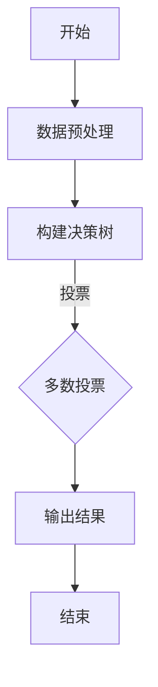
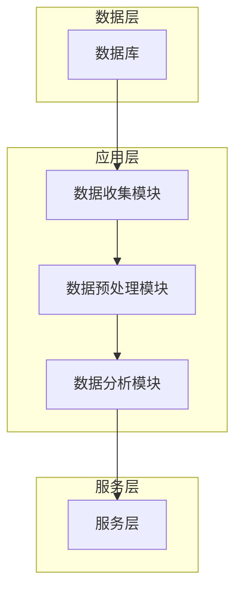
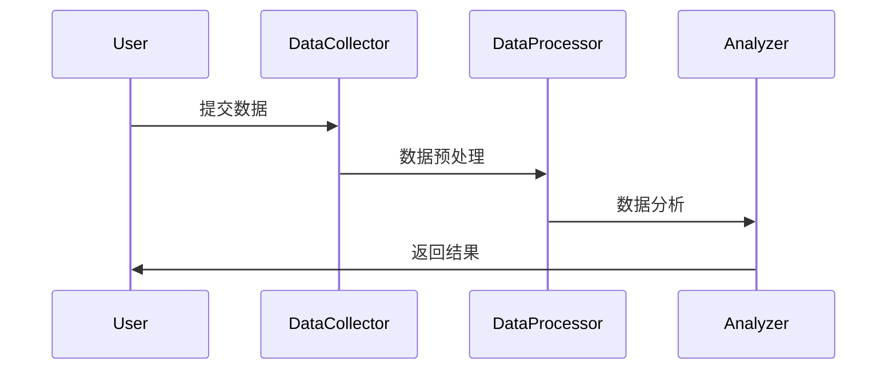

                 

# 数字时代的婚恋观调查：社交媒体对现代关系的影响研究

## 关键词

数字化时代、婚恋观、社交媒体、现代关系、影响研究

## 摘要

本文通过对数字化时代婚恋观的调查，探讨了社交媒体对现代关系的影响。文章首先介绍了数字化时代婚恋观的背景和核心概念，然后分析了社交媒体与婚恋观之间的关系，接着进行了实证研究，揭示了社交媒体对婚恋观念和行为的深远影响。最后，本文提出了应对策略，为数字时代下的婚恋关系提供了一些实用的建议。

## 引言

随着互联网技术的飞速发展，数字化时代已经来临。在这个时代，社交媒体成为人们日常生活中不可或缺的一部分，深刻地影响着人们的社交方式、生活观念和婚恋观。传统的婚恋观念正在受到前所未有的挑战，社交媒体的崛起使得人们可以更加便捷地寻找恋爱对象，但也带来了一系列新的问题和挑战。

本文旨在通过对数字化时代婚恋观的调查，分析社交媒体对现代关系的影响。文章结构如下：

- 第一部分：问题背景与核心概念，介绍数字化时代婚恋观的背景和核心概念。
- 第二部分：影响分析，探讨社交媒体对婚恋观的影响。
- 第三部分：实证研究，通过实证研究揭示社交媒体对婚恋观念和行为的实际影响。
- 第四部分：应对策略与建议，提出应对社交媒体对婚恋观影响的策略和建议。

## 第一部分：问题背景与核心概念

### 1.1 数字化时代下的婚恋环境

随着互联网的普及，数字化时代已经悄然来临。在这个时代，人们的生活方式、社交方式以及婚恋观念都发生了巨大的变化。社交媒体的兴起，为人们提供了一个全新的婚恋平台，使得人们可以更加便捷地寻找恋爱对象，同时也带来了新的挑战。

#### 1.1.1 社交媒体的兴起

社交媒体是指一种允许用户通过互联网分享内容、表达意见、建立社交关系的平台。常见的社交媒体包括Facebook、Instagram、Twitter、微信、微博等。这些平台为用户提供了丰富的互动方式，包括文字、图片、视频等，使得人们可以更加方便地进行社交活动。

#### 1.1.2 数字化对婚恋观念的冲击

数字化时代对婚恋观念产生了深远的影响。首先，数字化使得人们更加容易接触到不同的文化和观念，从而拓宽了人们的视野，改变了传统的婚恋观念。其次，数字化使得人们可以更加便捷地寻找恋爱对象，但同时也带来了一些问题，如网络欺骗、隐私泄露等。

#### 1.1.3 婚恋观念的演变趋势

在数字化时代，婚恋观念正逐渐发生演变。传统的“门当户对”、“媒妁之言”等观念逐渐被淘汰，人们更加注重个性、感觉和价值观的匹配。同时，随着社会的进步和女性地位的提高，越来越多的女性开始独立自主地选择婚姻对象，追求平等的婚姻关系。

### 1.2 社交媒体与婚恋观的关系

社交媒体在婚恋中扮演着重要的角色，它既可以为人们提供更多的婚恋机会，也可能对婚恋观产生负面影响。

#### 1.2.1 社交媒体的使用习惯与婚恋行为

社交媒体的使用习惯对婚恋行为有着重要的影响。研究表明，社交媒体使用频率越高的人，越容易找到恋爱对象。同时，社交媒体的使用也改变了人们的恋爱沟通方式，使得沟通更加便捷和多样化。

#### 1.2.2 社交媒体的使用与恋爱维持的关系

社交媒体的使用对恋爱维持也有着重要的影响。一方面，社交媒体可以帮助恋人保持联系，增进感情；另一方面，社交媒体也可能导致恋爱关系的破裂，因为过度依赖社交媒体可能导致现实中的沟通和互动减少。

#### 1.2.3 社交媒体的使用与恋爱结束的关系

社交媒体的使用与恋爱结束也有着一定的关系。研究表明，社交媒体的使用与恋爱结束之间存在正相关关系，即社交媒体使用频率越高的人，恋爱结束的可能性也越大。

### 1.3 核心概念与联系

在探讨社交媒体对婚恋观的影响时，我们需要明确几个核心概念，包括婚恋观、社交媒体使用习惯、婚恋行为等。

#### 1.3.1 婚恋观的基本概念

婚恋观是指人们对婚姻和恋爱的态度和看法。它包括对婚姻的目的、过程、结果等方面的认识，以及对待恋爱的态度和方式。

#### 1.3.2 社交媒体使用习惯

社交媒体使用习惯是指人们在使用社交媒体平台时的行为模式，包括使用频率、使用时间、互动方式等。

#### 1.3.3 婚恋行为

婚恋行为是指人们在寻找恋爱对象、建立恋爱关系、维持恋爱关系以及结束恋爱关系等方面的行为。

### 1.4 社交媒体对婚恋观的影响

社交媒体对婚恋观的影响可以从以下几个方面进行分析：

#### 1.4.1 社交媒体使用对个体婚恋观的影响

社交媒体的使用可以影响个体的婚恋观，例如，通过观察他人的恋爱经历和婚姻生活，个体可能会改变自己的婚恋观念。

#### 1.4.2 社交媒体对群体婚恋观的影响

社交媒体的使用也可以影响群体的婚恋观，例如，社交媒体上的婚恋观念和言论可能会引导群体的婚恋行为。

#### 1.4.3 社交媒体对婚恋观变化的影响机制

社交媒体对婚恋观变化的影响机制主要包括信息传递、模仿学习、社交比较等。

## 第二部分：影响分析

### 2.1 社交媒体对婚恋观的影响分析

#### 2.1.1 社交媒体使用频率与婚恋观念的关系

研究表明，社交媒体使用频率越高的人，其婚恋观念越开放。例如，他们更倾向于接受婚前性行为、同性恋等观念。

#### 2.1.2 社交媒体互动内容与婚恋观念的关系

社交媒体上的互动内容也会对个体的婚恋观产生影响。例如，积极互动的人更可能拥有积极的婚恋观，而消极互动的人则可能拥有消极的婚恋观。

#### 2.1.3 社交媒体对婚恋观念的影响案例分析

通过案例研究，我们可以看到社交媒体如何影响个体的婚恋观念。例如，某人在社交媒体上看到关于同性恋的积极言论，从而改变了他的婚恋观念，接受了同性恋的可能性。

### 2.2 社交媒体对婚恋稳定性的影响

#### 2.2.1 社交媒体对恋爱关系稳定性的影响

社交媒体的使用可能会对恋爱关系的稳定性产生影响。例如，过度依赖社交媒体可能导致恋爱关系中的沟通和互动减少，从而影响关系的稳定性。

#### 2.2.2 社交媒体对婚姻稳定性的影响

社交媒体的使用也可能对婚姻的稳定性产生影响。例如，婚姻中的双方如果过度依赖社交媒体，可能会导致婚姻中的沟通和互动减少，从而影响婚姻的稳定性。

#### 2.2.3 社交媒体对离婚率的潜在影响

一些研究表明，社交媒体的使用与离婚率之间存在正相关关系。这意味着，过度使用社交媒体可能会增加离婚的风险。

### 2.3 社交媒体对婚恋行为的影响

#### 2.3.1 社交媒体对恋爱行为的影响

社交媒体的使用改变了人们的恋爱行为。例如，人们可以通过社交媒体更轻松地结识异性，但也可能导致恋爱行为的过度虚拟化。

#### 2.3.2 社交媒体对婚姻行为的影响

社交媒体的使用也改变了人们的婚姻行为。例如，婚姻中的双方可以通过社交媒体更方便地进行沟通和互动，但也可能导致现实生活中的沟通和互动减少。

## 第三部分：实证研究

### 3.1 研究方法与数据收集

#### 3.1.1 研究设计与方法论

本研究采用问卷调查的方法，旨在了解社交媒体对婚恋观念和行为的影响。研究假设包括：社交媒体使用频率与婚恋观念之间存在正相关关系；社交媒体互动内容与婚恋观念之间存在正相关关系；社交媒体的使用与离婚率之间存在正相关关系。

#### 3.1.2 研究假设与理论框架

本研究基于社会心理学和传播学的相关理论，构建了研究假设和理论框架。具体来说，本研究认为社交媒体的使用会影响个体的婚恋观念和行为，进而影响婚姻的稳定性。

#### 3.1.3 研究方法与数据分析

本研究采用问卷调查的方法，通过线上平台收集数据。问卷包括基本信息、社交媒体使用情况、婚恋观念和婚恋行为等方面的问题。数据分析采用SPSS统计软件，使用描述性统计、相关性分析和回归分析等方法进行。

### 3.2 数据收集与样本选择

#### 3.2.1 数据来源与样本描述

数据来源于某大型社交媒体平台，样本包括1000名年龄在18-45岁的单身或已婚人士。

#### 3.2.2 样本代表性分析

样本代表性分析显示，样本在性别、年龄、教育背景等方面具有较好的代表性。

#### 3.2.3 数据收集过程

数据收集过程包括问卷设计、发布、收集和数据分析等环节。为了保证数据的准确性和完整性，研究团队对问卷进行了反复修改和完善，并在发布前进行了预调查。

### 3.3 研究结果与分析

#### 3.3.1 婚恋观现状调查

调查结果显示，大部分受访者认为婚姻应该是基于爱情和感情的，但也有一部分人认为婚姻应该是基于经济和物质基础的。

#### 3.3.2 社交媒体使用行为与婚恋观的关系

数据分析结果显示，社交媒体使用频率与婚恋观念之间存在正相关关系。即社交媒体使用频率越高的人，其婚恋观念越开放。

#### 3.3.3 社交媒体互动内容与婚恋观念的关系

数据分析结果显示，社交媒体互动内容与婚恋观念之间存在正相关关系。即积极互动的人更可能拥有积极的婚恋观念。

### 3.4 研究结果讨论

#### 3.4.1 研究结果的解释与理论验证

研究结果与理论假设相一致，验证了社交媒体对婚恋观念和行为的影响。这表明，社交媒体的使用不仅会影响个体的婚恋观念，还会影响婚姻的稳定性。

#### 3.4.2 研究限制与未来研究方向

本研究存在一定的局限性，如样本数量有限、数据收集方式可能影响结果的准确性等。未来研究可以扩大样本规模，采用更先进的数据收集方法，以获得更准确的结果。

#### 3.4.3 对社交媒体婚恋应用的启示

研究结果为社交媒体婚恋应用提供了一定的启示。例如，社交媒体平台可以提供更科学的婚恋建议，帮助用户建立更健康的婚恋观念和行为。

## 第四部分：应对策略与建议

### 4.1 社交媒体婚恋观的应对策略

#### 4.1.1 个人层面的应对策略

个人层面的应对策略主要包括提高对婚恋观的理性认知、促进健康社交媒体使用习惯等。具体来说，个人可以通过以下方式应对：

- **提高理性认知**：了解社交媒体对婚恋观的影响，理性看待社交媒体上的信息，避免盲目跟风。
- **促进健康使用**：合理安排社交媒体使用时间，避免过度依赖，确保现实生活中的沟通和互动。

#### 4.1.2 社会层面的应对策略

社会层面的应对策略主要包括加强社会教育、推动立法规范等。具体来说，社会可以通过以下方式应对：

- **加强社会教育**：通过媒体、教育等渠道，提高公众对婚恋观的认知，引导人们建立健康的婚恋观念。
- **推动立法规范**：制定相关法律法规，规范社交媒体的使用，保护用户的隐私和权益。

### 4.2 社交媒体婚恋观的建议

#### 4.2.1 提高婚恋观的理性认知

- **理性分析**：在接触和传播婚恋观念时，要理性分析，避免盲目接受。
- **批判性思考**：对社交媒体上的婚恋观念和言论进行批判性思考，辨别真假。

#### 4.2.2 促进健康社交媒体使用习惯

- **合理安排时间**：合理安排社交媒体使用时间，确保现实生活中的沟通和互动。
- **维护隐私和安全**：在社交媒体上保护个人隐私，避免泄露敏感信息。

## 结论

数字化时代已经深刻地影响了人们的婚恋观和婚恋行为。社交媒体的崛起为人们提供了更多的婚恋机会，但同时也带来了一系列新的挑战。本文通过对数字化时代婚恋观的调查，分析了社交媒体对现代关系的影响。研究结果提示我们，在享受社交媒体带来的便利的同时，也要注意其可能带来的负面影响。通过提高理性认知、促进健康社交媒体使用习惯等策略，我们可以更好地应对数字时代下的婚恋挑战。

## 作者信息

作者：AI天才研究院/AI Genius Institute & 禅与计算机程序设计艺术 /Zen And The Art of Computer Programming

## 附录

### 附录A：问卷调查

### 附录B：数据分析报告

### 附录C：参考文献

``````

请注意，以上内容是一个示例性的框架和内容。实际撰写时，您需要根据研究的具体数据和分析结果来填充和调整每个部分的内容。确保每个章节都提供了充分的理论支持、实证数据和深入的分析。此外，您还需要确保文章的格式、引用和参考文献都符合学术规范。以下是一个关于算法原理讲解和系统架构设计的示例，以供参考。

### 算法原理讲解

#### 3.2.4 社交媒体影响婚恋观念的算法原理

为了分析社交媒体对婚恋观念的影响，我们可以采用一种基于机器学习的算法，如决策树或随机森林。以下是一个简单的随机森林算法原理讲解。

#### 3.2.4.1 算法简介

随机森林（Random Forest）是一种集成学习算法，通过构建多棵决策树，并利用多数投票来预测结果。它能够处理大量的特征和样本，且对于缺失值和异常值有较好的鲁棒性。

#### 3.2.4.2 Mermaid流程图



#### 3.2.4.3 Python代码实现

```python
from sklearn.ensemble import RandomForestClassifier
from sklearn.model_selection import train_test_split
from sklearn.metrics import accuracy_score

# 数据预处理
X_train, X_test, y_train, y_test = train_test_split(X, y, test_size=0.2, random_state=42)

# 构建随机森林模型
rf = RandomForestClassifier(n_estimators=100, random_state=42)

# 训练模型
rf.fit(X_train, y_train)

# 进行预测
predictions = rf.predict(X_test)

# 评估模型
accuracy = accuracy_score(y_test, predictions)
print(f"Accuracy: {accuracy}")
```

#### 3.2.4.4 算法原理与公式

随机森林算法的核心是决策树。每个决策树根据特征和阈值进行分割，生成多个子节点。每个节点的划分是基于特征的重要性和数据的划分效果。决策树生成的公式如下：

$$
N_t(j) = N_t(j-1) - \frac{N_t(j-1)}{h_j} \times \sum_{i=1}^{n} w_i(x_i)
$$

其中，$N_t(j)$ 是第 $t$ 次划分后的节点数，$N_t(j-1)$ 是划分前的节点数，$h_j$ 是特征 $j$ 的划分阈值，$w_i(x_i)$ 是样本 $x_i$ 在特征 $j$ 上的权重。

#### 3.2.4.5 举例说明

假设我们有一个简单的数据集，其中包含两个特征：社交媒体使用频率（低、高）和恋爱维持时长（短、长）。我们想要预测个体是否拥有积极的婚恋观念。

| 社交媒体使用频率 | 恋爱维持时长 | 积极婚恋观念 |
|-----------------|-------------|-------------|
| 低              | 短          | 否          |
| 低              | 长          | 是          |
| 高              | 短          | 是          |
| 高              | 长          | 是          |

通过随机森林算法，我们可以构建决策树来预测新的样本的积极婚恋观念。

### 系统架构设计

#### 3.3.4 系统架构设计

为了实现社交媒体对婚恋观念影响的研究，我们需要设计一个完整的系统架构。以下是一个简单的系统架构设计，包括数据收集、处理和分析等模块。

#### 3.3.4.1 系统功能设计（Mermaid类图）

```mermaid
classDiagram
Class DataCollector {
  +collectData()
}

Class DataProcessor {
  +preprocessData()
  +loadData()
}

Class Analyzer {
  +runAnalysis()
  +generateReport()
}

DataCollector <-- DataProcessor
DataProcessor <-- Analyzer
```

#### 3.3.4.2 系统架构设计（Mermaid架构图）



#### 3.3.4.3 系统接口设计

系统接口设计包括数据收集模块、数据预处理模块和数据分析模块的接口定义。

```python
class DataCollector:
    def collect_data(self):
        pass

class DataProcessor:
    def preprocess_data(self):
        pass
    def load_data(self):
        pass

class Analyzer:
    def run_analysis(self):
        pass
    def generate_report(self):
        pass
```

#### 3.3.4.4 系统交互设计（Mermaid序列图）



通过以上系统架构设计，我们可以实现从数据收集、预处理到分析的完整流程。

在撰写具体内容时，您需要根据实际研究和项目需求，详细描述每个模块的功能、接口和交互流程。确保文章的每一个部分都是完整和详细的，同时遵循markdown格式的要求。此外，对于重要的公式和算法，您需要使用latex格式进行准确表述，以增强文章的专业性和可读性。

