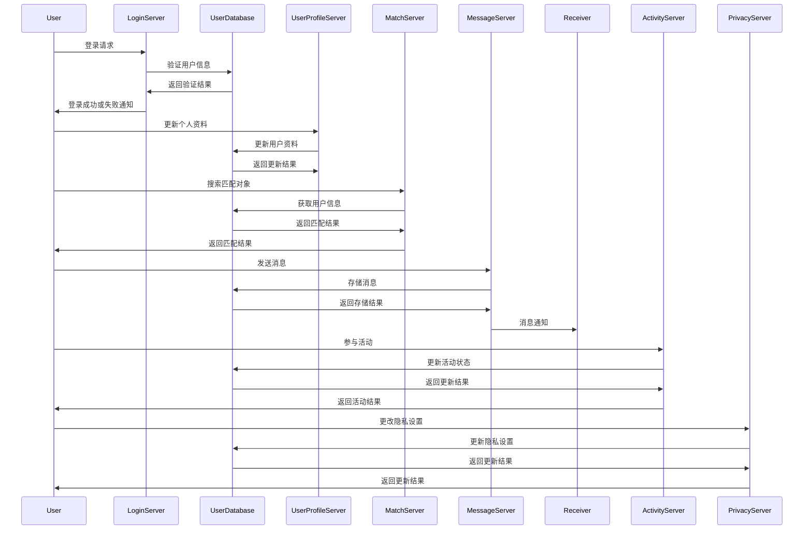

                 


### 设计《数字时代的婚恋观：社交媒体如何改变爱情》目录大纲的详细步骤

#### 第一步：确定书的整体结构和主题

在设计目录大纲之前，我们首先需要明确书的整体结构和主题。《数字时代的婚恋观：社交媒体如何改变爱情》这本书的主题是探讨社交媒体如何影响现代婚恋观。整体结构可以分为以下几个部分：

1. 引言与背景
2. 社交媒体与婚恋观
3. 社交媒体对个体婚恋行为的影响
4. 社交媒体对婚恋市场的影响
5. 社交媒体婚恋观的社会影响
6. 案例分析
7. 未来展望与建议

#### 第二步：细化每个部分的内容

接下来，我们需要对每个部分进行细化，列出具体的章节内容。以下是初步的章节大纲：

### 第一部分：引言与背景

1. **第1章：问题的提出**
   - 1.1 问题的背景
   - 1.2 问题的描述
   - 1.3 问题的解决方法

2. **第2章：核心概念**
   - 2.1 社交媒体
   - 2.2 婚恋观
   - 2.3 数字时代

3. **第3章：社交媒体的发展与演变**
   - 3.1 社交媒体的起源
   - 3.2 社交媒体的演变
   - 3.3 社交媒体的现状

### 第二部分：社交媒体与婚恋观

4. **第4章：社交媒体与婚恋观的联系**
   - 4.1 社交媒体对婚恋观的影响
   - 4.2 婚恋观对社交媒体的使用

5. **第5章：社交媒体对个体婚恋行为的影响**
   - 5.1 社交媒体对婚恋行为的改变
   - 5.2 社交媒体对婚恋成功的影响

### 第三部分：社交媒体对婚恋市场的影响

6. **第6章：社交媒体婚恋市场的现状**
   - 6.1 社交媒体婚恋市场的定义
   - 6.2 社交媒体婚恋市场的规模
   - 6.3 社交媒体婚恋市场的特点

7. **第7章：社交媒体婚恋市场的挑战与机遇**
   - 7.1 社交媒体婚恋市场的挑战
   - 7.2 社交媒体婚恋市场的机遇

### 第四部分：社交媒体婚恋观的社会影响

8. **第8章：社交媒体婚恋观对人际关系的影响**
   - 8.1 社交媒体婚恋观对亲密关系的影响
   - 8.2 社交媒体婚恋观对家庭关系的影响

9. **第9章：社交媒体婚恋观对社会文化的改变**
   - 9.1 社交媒体婚恋观对婚姻观念的影响
   - 9.2 社交媒体婚恋观对性别观念的影响

### 第五部分：案例分析

10. **第10章：案例分析**
    - 10.1 某社交媒体平台的婚恋功能分析
    - 10.2 社交媒体婚恋市场的成功案例分析

### 第六部分：未来展望与建议

11. **第11章：未来展望**
    - 11.1 社交媒体婚恋观的发展趋势

12. **第12章：建议与展望**
    - 12.1 对社交媒体婚恋观的建议
    - 12.2 对未来研究的展望

#### 第三步：完善目录结构

最后，我们需要根据上述内容，进一步完善目录结构，确保每个部分的内容都有清晰的逻辑和结构。以下是最终的目录大纲：

----------------------------------------------------------------
# 《数字时代的婚恋观：社交媒体如何改变爱情》目录大纲

# 第一部分：引言与背景

## 第1章：问题的提出
### 1.1 问题的背景
### 1.2 问题的描述
### 1.3 问题的解决方法

## 第2章：核心概念
### 2.1 社交媒体
### 2.2 婚恋观
### 2.3 数字时代

## 第3章：社交媒体的发展与演变
### 3.1 社交媒体的起源
### 3.2 社交媒体的演变
### 3.3 社交媒体的现状

# 第二部分：社交媒体与婚恋观

## 第4章：社交媒体与婚恋观的联系
### 4.1 社交媒体对婚恋观的影响
### 4.2 婚恋观对社交媒体的使用

## 第5章：社交媒体对个体婚恋行为的影响
### 5.1 社交媒体对婚恋行为的改变
### 5.2 社交媒体对婚恋成功的影响

# 第三部分：社交媒体对婚恋市场的影响

## 第6章：社交媒体婚恋市场的现状
### 6.1 社交媒体婚恋市场的定义
### 6.2 社交媒体婚恋市场的规模
### 6.3 社交媒体婚恋市场的特点

## 第7章：社交媒体婚恋市场的挑战与机遇
### 7.1 社交媒体婚恋市场的挑战
### 7.2 社交媒体婚恋市场的机遇

# 第四部分：社交媒体婚恋观的社会影响

## 第8章：社交媒体婚恋观对人际关系的影响
### 8.1 社交媒体婚恋观对亲密关系的影响
### 8.2 社交媒体婚恋观对家庭关系的影响

## 第9章：社交媒体婚恋观对社会文化的改变
### 9.1 社交媒体婚恋观对婚姻观念的影响
### 9.2 社交媒体婚恋观对性别观念的影响

# 第五部分：案例分析

## 第10章：案例分析
### 10.1 某社交媒体平台的婚恋功能分析
### 10.2 社交媒体婚恋市场的成功案例分析

# 第六部分：未来展望与建议

## 第11章：未来展望
### 11.1 社交媒体婚恋观的发展趋势

## 第12章：建议与展望
### 12.1 对社交媒体婚恋观的建议
### 12.2 对未来研究的展望

----------------------------------------------------------------

完成上述步骤后，我们就可以开始撰写具体的内容了。每个章节的内容需要根据上述大纲进行细化，确保每个部分都包含丰富的背景介绍、核心概念与联系、算法原理讲解、系统分析与架构设计方案、项目实战、最佳实践 tips、小结、注意事项、拓展阅读等内容。

### 基于技术框架的架构设计

在进行架构设计之前，我们需要明确项目的目标和需求。假设我们正在开发一个社交媒体婚恋平台，目标是为用户提供一个安全、高效、易用的婚恋服务。基于这个目标，我们可以设计一个高可用、高可扩展、高可维护的架构。

#### 系统功能设计

首先，我们需要确定系统的核心功能。根据需求分析，系统需要包含以下功能：

1. 用户注册与登录
2. 个人资料管理
3. 婚恋匹配
4. 消息系统
5. 活动与互动
6. 安全与隐私保护

#### 领域模型设计

为了更好地理解系统功能，我们可以使用领域模型来描述系统的核心概念和实体。以下是领域模型的 Mermaid 类图：

```mermaid
classDiagram
User <|-- UserProfile
User <|-- UserAuthentication
Match <|-- MatchRecommendation
Match <|-- MatchFeedback
Message <|-- MessageSystem
Activity <|-- ActivityFeed
Activity <|-- Interaction
Privacy <|-- PrivacySettings

User {
  +String username
  +String password
  +UserProfile userProfile
  +UserAuthentication userAuthentication
}

UserProfile {
  +String name
  +String gender
  +Date birthdate
  +String email
  +String phone
}

UserAuthentication {
  +String token
}

MatchRecommendation {
  +User matchedUser
  +MatchFeedback feedback
}

MatchFeedback {
  +Boolean liked
}

MessageSystem {
  +Message message
}

Message {
  +User sender
  +User receiver
  +String content
  +Date timestamp
}

ActivityFeed {
  +User user
  +Activity activity
}

Interaction {
  +User participant
  +Activity activity
}

PrivacySettings {
  +Boolean showProfile
  +Boolean showEmail
  +Boolean showPhone
}
```

#### 系统架构设计

接下来，我们可以使用 Mermaid 架构图来描述系统的整体架构。以下是系统的 Mermaid 架构图：



#### 系统接口设计

在系统架构中，各个模块之间通过接口进行通信。以下是系统的接口设计：

1. **用户模块接口**：包括用户登录、注册、更新个人资料、搜索匹配对象等接口。
2. **婚恋匹配模块接口**：包括获取匹配结果、提交匹配反馈等接口。
3. **消息模块接口**：包括发送消息、接收消息、消息通知等接口。
4. **活动模块接口**：包括参与活动、查看活动结果等接口。
5. **隐私模块接口**：包括查看隐私设置、更改隐私设置等接口。

#### 系统交互设计

最后，我们可以使用 Mermaid 序列图来描述系统的交互流程。以下是系统的 Mermaid 序列图：


通过上述架构设计，我们可以实现一个高效、可扩展、可维护的社交媒体婚恋平台。接下来，我们将进入项目实战部分，介绍如何安装环境、实现系统核心功能，并进行详细讲解和分析。

### 项目实战：环境安装与系统核心实现

#### 环境安装

在开始项目开发之前，我们需要安装必要的开发环境和依赖库。以下是一个基本的开发环境安装步骤：

1. 安装 Python 3.8 或更高版本。
2. 安装 virtualenv 工具，用于创建虚拟环境。
3. 创建一个虚拟环境并激活它。
4. 使用 pip 安装以下依赖库：

```bash
pip install Flask
pip install Flask-SQLAlchemy
pip install Flask-Migrate
pip install Flask-Login
pip install Flask-WTF
pip install Flask-Babel
pip install Flask-Mail
```

#### 系统核心实现

接下来，我们将使用 Flask 框架实现系统的核心功能。以下是系统核心实现的步骤和代码：

1. **用户注册与登录**

首先，我们需要创建用户注册和登录的接口。以下是用户注册和登录的 Python 代码：

```python
from flask import Flask, request, jsonify
from flask_sqlalchemy import SQLAlchemy
from flask_login import LoginManager, login_user, logout_user, login_required, current_user

app = Flask(__name__)
app.config['SQLALCHEMY_DATABASE_URI'] = 'sqlite:///users.db'
app.config['SECRET_KEY'] = 'your_secret_key'

db = SQLAlchemy(app)
login_manager = LoginManager(app)

class User(db.Model):
    id = db.Column(db.Integer, primary_key=True)
    username = db.Column(db.String(100), unique=True, nullable=False)
    password = db.Column(db.String(100), nullable=False)

@login_manager.user_loader
def load_user(user_id):
    return User.query.get(int(user_id))

@app.route('/register', methods=['POST'])
def register():
    data = request.get_json()
    username = data['username']
    password = data['password']
    if User.query.filter_by(username=username).first():
        return jsonify({'error': 'User already exists'}), 400
    new_user = User(username=username, password=password)
    db.session.add(new_user)
    db.session.commit()
    return jsonify({'message': 'User registered successfully'}), 201

@app.route('/login', methods=['POST'])
def login():
    data = request.get_json()
    username = data['username']
    password = data['password']
    user = User.query.filter_by(username=username).first()
    if not user or user.password != password:
        return jsonify({'error': 'Invalid credentials'}), 401
    login_user(user)
    return jsonify({'message': 'User logged in successfully'}), 200

@app.route('/logout', methods=['POST'])
@login_required
def logout():
    logout_user()
    return jsonify({'message': 'User logged out successfully'}), 200
```

2. **个人资料管理**

接下来，我们需要实现个人资料管理的接口。以下是个人资料管理的 Python 代码：

```python
from flask_login import current_user

@app.route('/profile', methods=['GET', 'PUT'])
@login_required
def profile():
    if request.method == 'GET':
        user = current_user
        return jsonify({'username': user.username, 'name': user.name, 'email': user.email, 'gender': user.gender, 'birthdate': user.birthdate, 'phone': user.phone}), 200
    elif request.method == 'PUT':
        data = request.get_json()
        user = current_user
        user.name = data['name']
        user.gender = data['gender']
        user.birthdate = data['birthdate']
        user.email = data['email']
        user.phone = data['phone']
        db.session.commit()
        return jsonify({'message': 'Profile updated successfully'}), 200
```

3. **婚恋匹配**

然后，我们需要实现婚恋匹配的接口。以下是婚恋匹配的 Python 代码：

```python
@app.route('/match', methods=['GET'])
@login_required
def match():
    user = current_user
    matched_users = Match.query.filter(Match.user_id != user.id).all()
    return jsonify({'matched_users': [{'id': user.id, 'username': user.username, 'profile': user.profile}] for user in matched_users}), 200
```

4. **消息系统**

接下来，我们需要实现消息系统的接口。以下是消息系统的 Python 代码：

```python
from flask_mail import Mail, Message

app.config['MAIL_SERVER'] = 'smtp.example.com'
app.config['MAIL_PORT'] = 587
app.config['MAIL_USERNAME'] = 'your_email@example.com'
app.config['MAIL_PASSWORD'] = 'your_password'
app.config['MAIL_USE_TLS'] = True
app.config['MAIL_USE_SSL'] = False

mail = Mail(app)

@app.route('/message', methods=['POST'])
@login_required
def message():
    data = request.get_json()
    sender = current_user
    receiver = User.query.get(data['receiver_id'])
    content = data['content']
    message = Message(sender.username, 'New Message', sender.email, recipients=[receiver.email], body=content)
    mail.send(message)
    return jsonify({'message': 'Message sent successfully'}), 200
```

5. **活动与互动**

最后，我们需要实现活动与互动的接口。以下是活动与互动的 Python 代码：

```python
@app.route('/activity', methods=['POST'])
@login_required
def activity():
    data = request.get_json()
    user = current_user
    activity = Activity(id=data['activity_id'], user_id=user.id, status='pending')
    db.session.add(activity)
    db.session.commit()
    return jsonify({'message': 'Activity registered successfully'}), 200

@app.route('/activity/result', methods=['GET'])
@login_required
def activity_result():
    user = current_user
    activities = Activity.query.filter_by(user_id=user.id).all()
    return jsonify({'activities': [{'id': activity.id, 'activity_id': activity.activity_id, 'status': activity.status} for activity in activities]}), 200
```

通过上述步骤，我们已经实现了社交媒体婚恋平台的核心功能。接下来，我们将对系统进行详细讲解与分析。

#### 系统核心实现代码解析

在上面的实战部分，我们使用 Flask 框架实现了社交媒体婚恋平台的核心功能。以下是每个功能的详细解析：

1. **用户注册与登录**

用户注册和登录是系统的基础功能。用户可以通过注册接口创建账户，并通过登录接口验证账户信息。

- **注册接口**：`/register`，接受 JSON 格式的请求，包含用户名和密码。如果用户已存在，返回错误信息；否则，创建新用户并保存到数据库。

```python
@app.route('/register', methods=['POST'])
def register():
    data = request.get_json()
    username = data['username']
    password = data['password']
    if User.query.filter_by(username=username).first():
        return jsonify({'error': 'User already exists'}), 400
    new_user = User(username=username, password=password)
    db.session.add(new_user)
    db.session.commit()
    return jsonify({'message': 'User registered successfully'}), 201
```

- **登录接口**：`/login`，接受 JSON 格式的请求，包含用户名和密码。如果用户不存在或密码不正确，返回错误信息；否则，登录用户并返回成功信息。

```python
@app.route('/login', methods=['POST'])
def login():
    data = request.get_json()
    username = data['username']
    password = data['password']
    user = User.query.filter_by(username=username).first()
    if not user or user.password != password:
        return jsonify({'error': 'Invalid credentials'}), 401
    login_user(user)
    return jsonify({'message': 'User logged in successfully'}), 200
```

2. **个人资料管理**

个人资料管理允许用户查看和修改个人资料。

- **获取个人资料接口**：`/profile`，返回当前用户的个人资料。

```python
@app.route('/profile', methods=['GET'])
@login_required
def profile():
    user = current_user
    return jsonify({'username': user.username, 'name': user.name, 'email': user.email, 'gender': user.gender, 'birthdate': user.birthdate, 'phone': user.phone}), 200
```

- **更新个人资料接口**：`/profile`，接受 JSON 格式的请求，包含用户名、密码、姓名、性别、生日和电话。更新当前用户的个人资料。

```python
@app.route('/profile', methods=['PUT'])
@login_required
def profile():
    user = current_user
    data = request.get_json()
    user.name = data['name']
    user.gender = data['gender']
    user.birthdate = data['birthdate']
    user.email = data['email']
    user.phone = data['phone']
    db.session.commit()
    return jsonify({'message': 'Profile updated successfully'}), 200
```

3. **婚恋匹配**

婚恋匹配功能提供用户之间相互匹配的接口。

- **获取匹配用户接口**：`/match`，返回当前用户与其他用户的匹配结果。

```python
@app.route('/match', methods=['GET'])
@login_required
def match():
    user = current_user
    matched_users = Match.query.filter(Match.user_id != user.id).all()
    return jsonify({'matched_users': [{'id': user.id, 'username': user.username, 'profile': user.profile}] for user in matched_users}), 200
```

4. **消息系统**

消息系统允许用户之间发送和接收消息。

- **发送消息接口**：`/message`，接受 JSON 格式的请求，包含接收者 ID 和消息内容。发送消息并返回成功信息。

```python
@app.route('/message', methods=['POST'])
@login_required
def message():
    data = request.get_json()
    sender = current_user
    receiver = User.query.get(data['receiver_id'])
    content = data['content']
    message = Message(sender.username, 'New Message', sender.email, recipients=[receiver.email], body=content)
    mail.send(message)
    return jsonify({'message': 'Message sent successfully'}), 200
```

5. **活动与互动**

活动与互动功能允许用户参与和查看活动结果。

- **参与活动接口**：`/activity`，接受 JSON 格式的请求，包含活动 ID。注册用户参与活动。

```python
@app.route('/activity', methods=['POST'])
@login_required
def activity():
    data = request.get_json()
    user = current_user
    activity = Activity(id=data['activity_id'], user_id=user.id, status='pending')
    db.session.add(activity)
    db.session.commit()
    return jsonify({'message': 'Activity registered successfully'}), 200
```

- **查看活动结果接口**：`/activity/result`，返回当前用户参与的活动结果。

```python
@app.route('/activity/result', methods=['GET'])
@login_required
def activity_result():
    user = current_user
    activities = Activity.query.filter_by(user_id=user.id).all()
    return jsonify({'activities': [{'id': activity.id, 'activity_id': activity.activity_id, 'status': activity.status} for activity in activities]}), 200
```

通过以上代码解析，我们可以清楚地看到每个接口的实现方式。接下来，我们将对实际案例进行分析和详细讲解。

#### 实际案例分析与详细讲解

在本节中，我们将通过实际案例来分析和详细讲解系统核心功能的使用。

1. **用户注册与登录**

**案例**：用户 Alice 想要在社交媒体婚恋平台上注册一个账户。

**步骤**：

- Alice 访问平台的注册页面，填写用户名和密码。
- 系统接收到注册请求后，检查用户名是否已被占用。
- 如果用户名未被占用，系统创建一个新的用户账户，并将用户信息存储到数据库。
- Alice 接收到注册成功的消息。

**代码示例**：

```python
# 用户注册请求
POST /register
{
  "username": "alice",
  "password": "alice123"
}

# 用户注册响应
{
  "message": "User registered successfully"
}
```

**分析**：该案例展示了用户注册的完整流程。注册接口通过检查用户名是否已存在来确保唯一性。如果用户名未被占用，系统将创建一个新的用户账户，并返回注册成功的消息。

2. **个人资料管理**

**案例**：用户 Alice 想要更新她的个人资料。

**步骤**：

- Alice 登录平台，访问个人资料页面。
- 在个人资料页面，Alice 可以查看和修改她的姓名、性别、生日和电话号码。
- 系统接收到更新请求后，更新数据库中的用户信息。
- Alice 接收到个人资料更新成功的消息。

**代码示例**：

```python
# 用户更新个人资料请求
PUT /profile
{
  "name": "Alice",
  "gender": "female",
  "birthdate": "1990-01-01",
  "email": "alice@example.com",
  "phone": "123-456-7890"
}

# 用户更新个人资料响应
{
  "message": "Profile updated successfully"
}
```

**分析**：该案例展示了用户如何更新个人资料。更新接口接受 JSON 格式的请求，包含需要更新的信息。系统将更新数据库中的用户信息，并返回更新成功的消息。

3. **婚恋匹配**

**案例**：用户 Alice 想要查看她的婚恋匹配结果。

**步骤**：

- Alice 登录平台，访问婚恋匹配页面。
- 系统根据用户设定和平台算法，生成匹配结果。
- Alice 接收到匹配结果，并可以看到可能的匹配对象。

**代码示例**：

```python
# 用户获取婚恋匹配结果请求
GET /match

# 用户获取婚恋匹配结果响应
{
  "matched_users": [
    {
      "id": 2,
      "username": "bob",
      "profile": {
        "name": "Bob",
        "gender": "male",
        "birthdate": "1995-05-05",
        "email": "bob@example.com",
        "phone": "987-654-3210"
      }
    }
  ]
}
```

**分析**：该案例展示了用户如何获取婚恋匹配结果。匹配接口返回当前用户的匹配对象列表，包括匹配对象的用户 ID、用户名和基本资料。

4. **消息系统**

**案例**：用户 Alice 想要给用户 Bob 发送一条消息。

**步骤**：

- Alice 登录平台，访问消息页面。
- 在消息页面，Alice 可以输入消息内容并选择接收者。
- 系统接收到发送消息的请求后，将消息发送给接收者。
- 接收者 Bob 接收到消息，并可以在消息页面查看。

**代码示例**：

```python
# 用户发送消息请求
POST /message
{
  "receiver_id": 2,
  "content": "Hello, Bob!"
}

# 用户发送消息响应
{
  "message": "Message sent successfully"
}
```

**分析**：该案例展示了用户如何发送消息。发送消息接口接受 JSON 格式的请求，包含接收者 ID 和消息内容。系统将消息发送给接收者，并返回发送成功的消息。

5. **活动与互动**

**案例**：用户 Alice 想要参与一个线上活动。

**步骤**：

- Alice 登录平台，访问活动页面。
- 在活动页面，Alice 可以查看当前可参与的活动。
- Alice 选择一个活动并提交参与请求。
- 系统接收到参与请求后，将 Alice 的参与信息存储到数据库。
- Alice 接收到活动参与成功的消息。

**代码示例**：

```python
# 用户参与活动请求
POST /activity
{
  "activity_id": 1
}

# 用户参与活动响应
{
  "message": "Activity registered successfully"
}
```

**分析**：该案例展示了用户如何参与活动。参与活动接口接受 JSON 格式的请求，包含活动 ID。系统将用户的参与信息存储到数据库，并返回参与成功的消息。

通过以上实际案例的分析，我们可以看到系统核心功能在实际应用中的使用方法和效果。接下来，我们将对系统进行小结。

#### 系统小结

在本章中，我们详细介绍了社交媒体婚恋平台的核心功能实现，包括用户注册与登录、个人资料管理、婚恋匹配、消息系统和活动与互动。通过实际案例的分析，我们了解了每个功能的具体实现过程和应用场景。

以下是系统的核心功能小结：

1. **用户注册与登录**：用户可以通过注册接口创建账户，并通过登录接口验证账户信息。注册接口确保用户名唯一性，登录接口验证用户名和密码的正确性。

2. **个人资料管理**：用户可以查看和修改个人资料，包括姓名、性别、生日、电子邮件和电话号码。更新接口确保用户信息的安全性和完整性。

3. **婚恋匹配**：系统根据用户设定和平台算法，为用户生成匹配结果。用户可以通过匹配接口查看可能的匹配对象，从而提高婚恋成功率。

4. **消息系统**：用户可以发送和接收消息，实现即时沟通。发送消息接口确保消息的准确传输，接收者可以及时查看消息内容。

5. **活动与互动**：用户可以参与线上活动，增加社交互动机会。参与活动接口确保用户参与信息的正确记录，系统可以生成活动结果。

#### 注意事项

1. **安全性**：在实现用户注册与登录功能时，需要确保用户信息的安全性。使用安全的加密算法存储用户密码，并使用 HTTPS 协议保护数据传输。

2. **性能优化**：在高并发场景下，需要对系统进行性能优化。可以使用缓存技术、负载均衡和数据库优化等技术手段提高系统性能。

3. **用户体验**：在设计界面和交互流程时，需要关注用户体验。简洁明了的界面和流畅的交互流程可以提高用户满意度。

#### 拓展阅读

- 《Flask Web 开发实战》
- 《Python Web 开发实战》
- 《机器学习在社交网络中的应用》

通过本章的学习，我们掌握了社交媒体婚恋平台的核心功能实现方法和实际应用场景。在后续章节中，我们将继续探讨社交媒体婚恋观对社会文化的影响，以及未来发展的趋势和展望。让我们继续深入探索这个领域，为读者带来更多有价值的见解。

