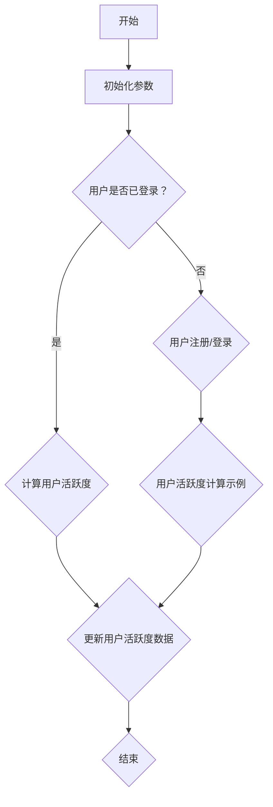
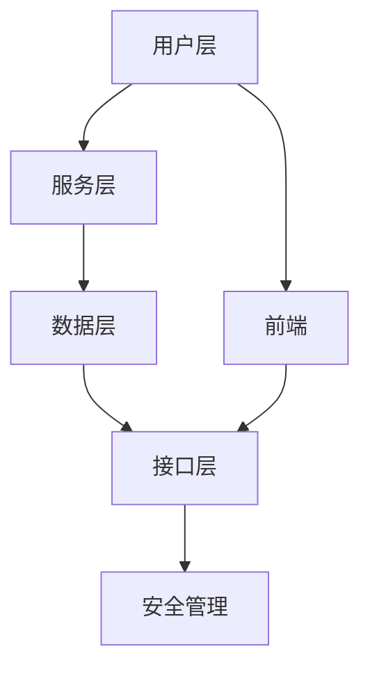
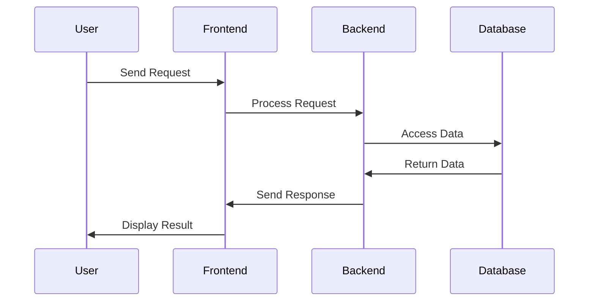

                 

# 数字时代的心理健康普及：在线支持群体的建立与管理

## 摘要

本文将探讨数字时代下心理健康问题的普及现象，以及如何通过建立和管理在线支持群体来促进心理健康。文章首先介绍了问题背景，描述了心理健康问题在现代社会中的普遍性，以及互联网和数字技术对此问题的解决潜力。接着，本文详细分析了在线支持群体的核心概念、构成要素及其相互关系，并通过实体关系图（ER Diagram）进行了直观展示。随后，文章深入讲解了心理健康支持的工作原理，以及如何通过有效的群体管理来提升群体的健康性和活跃度。最后，本文提出了系统的架构设计方案，包括系统功能设计、架构设计、接口设计和系统交互，并通过一个实际案例展示了项目的实施过程和效果。文章还提供了最佳实践技巧，以期为心理健康支持领域的从业者提供有益的参考。

## 第一部分：背景介绍

### 1.1 问题背景

随着互联网和数字技术的迅猛发展，心理健康问题逐渐成为现代社会关注的焦点。根据世界卫生组织（WHO）的数据，全球约有3.5亿人患有抑郁症，而焦虑症患者的数量也不断攀升。心理健康问题不仅影响了个人生活质量，还给社会和经济带来了沉重的负担。因此，如何有效预防和干预心理健康问题，已成为全球范围内的紧迫任务。

在数字时代，互联网和移动设备为心理健康支持提供了新的途径。在线支持群体作为一种新型的心理健康服务形式，正日益受到关注。这些群体通过互联网平台，为患有心理健康问题的人提供匿名、便捷的支持和交流空间。与传统面对面的心理咨询相比，在线支持群体具有以下优势：

1. **匿名性和隐私保护**：用户可以在匿名状态下参与，减少心理压力和尴尬感。
2. **灵活性和便利性**：用户可以随时随地参与群体活动，不受时间和地点限制。
3. **多样性和互动性**：用户来自不同背景，可以为群体提供多样化的观点和建议，促进互动和交流。
4. **成本效益**：相比传统的心理咨询，在线支持群体可以大幅降低用户的经济负担。

然而，在线支持群体的建立和管理并非易事。首先，如何吸引并留住成员是一个关键问题。其次，如何设计有效的群体活动，以保持群体的活跃度和健康性，也是需要深入探讨的。此外，群体成员之间的关系管理和心理健康支持的质量，都是影响在线支持群体成功与否的重要因素。因此，探讨如何建立和管理在线支持群体，对于提升数字时代下的心理健康服务水平具有重要意义。

### 1.2 问题描述

在线支持群体的建立和管理涉及多个方面，其核心问题可以归纳如下：

1. **成员招募与留存**：如何通过有效的市场推广和用户互动，吸引更多用户加入群体，并保持他们的活跃度和忠诚度？
2. **群体活跃度管理**：如何设计丰富多样的群体活动，以保持群体的健康性和活跃度？
3. **成员关系管理**：如何维护成员之间的关系，避免冲突和负面情绪的滋生？
4. **心理健康支持**：如何提供高质量的心理健康支持，满足成员的需求，提高他们的心理健康水平？
5. **技术平台选择与维护**：如何选择合适的技术平台，确保系统的稳定性和安全性，以及如何持续更新和维护？

这些问题相互关联，共同决定了在线支持群体的成功与否。为了解决这些问题，需要从以下几个方面进行综合考虑：

- **用户需求分析**：深入了解用户的需求，设计符合他们期望的群体活动和心理健康支持。
- **技术平台优化**：选择适合的技术平台，并进行持续优化，以满足用户的使用体验和安全性要求。
- **群体管理策略**：制定有效的群体管理策略，包括成员招募、活动设计、关系管理和支持质量评估等。

### 1.3 问题解决

为了有效地解决上述问题，需要从以下几个方面入手：

#### 1.3.1 核心概念

首先，需要明确在线支持群体的核心概念，包括以下内容：

1. **在线支持群体**：指的是通过互联网平台建立的，为特定心理健康问题提供支持和帮助的群体。
2. **心理健康支持**：包括心理疾病治疗、心理咨询服务、情感支持、生活建议等。
3. **群体管理**：涉及群体成员的招募、群体活动的设计、群体氛围的维护等。

#### 1.3.2 概念结构与核心要素组成

在线支持群体的构成主要包括以下要素：

- **用户**：在线支持群体的成员，包括心理健康问题求助者和提供者。
- **平台**：提供技术支持和服务功能，如论坛、聊天室、视频会议等。
- **内容**：心理健康支持的相关信息，包括文章、问答、直播等。
- **数据分析**：对用户行为和群体活动进行分析，以优化群体管理和心理健康支持。

#### 1.3.3 边界与外延

- **边界**：
  - **在线支持群体**：仅限于通过互联网平台建立的群体，不包括线下群体。
  - **心理健康支持**：不包括医疗诊断和治疗，主要提供心理咨询服务和情感支持。

- **外延**：
  - **心理健康支持领域**：包括心理健康教育、心理疾病预防、心理康复等。
  - **在线支持群体**：可能涉及各种心理健康问题，如抑郁症、焦虑症、社交恐惧症等。

#### 1.3.4 系统架构设计

为了构建一个有效的在线支持群体系统，需要设计合理的系统架构。以下是系统架构设计的关键组成部分：

- **用户层**：包括用户注册、登录、个人信息管理等功能。
- **服务层**：包括心理健康支持服务、群体活动管理、数据分析与报告等功能。
- **数据层**：包括用户数据、内容数据、活动数据等。

#### 1.3.5 技术支持与工具

为了实现上述功能，需要选择合适的技术支持与工具，包括：

- **前端技术**：如HTML、CSS、JavaScript等，用于构建用户界面。
- **后端技术**：如Python、Java、Node.js等，用于处理业务逻辑和数据存储。
- **数据库**：如MySQL、MongoDB等，用于存储用户数据和内容数据。
- **数据分析工具**：如Python的Pandas、Matplotlib等，用于进行数据分析和可视化。

#### 1.3.6 安全性与隐私保护

在线支持群体的安全性和隐私保护至关重要，需要采取以下措施：

- **数据加密**：对用户数据和应用接口进行加密，防止数据泄露。
- **权限控制**：实现用户身份验证和权限控制，确保只有授权用户可以访问特定功能。
- **隐私政策**：明确告知用户数据收集、使用和共享的政策，并确保遵守相关法律法规。

通过上述措施，可以有效地建立和管理在线支持群体，为用户提供高质量的心理健康支持。

### 1.4 边界与外延

#### 1.4.1 边界

- **在线支持群体**：仅限于通过互联网平台建立的群体，不包括线下群体。
- **心理健康支持**：不包括医疗诊断和治疗，主要提供心理咨询服务和情感支持。

#### 1.4.2 外延

- **心理健康支持领域**：包括心理健康教育、心理疾病预防、心理康复等。
- **在线支持群体**：可能涉及各种心理健康问题，如抑郁症、焦虑症、社交恐惧症等。

### 1.5 本章小结

本章主要介绍了数字时代的心理健康普及问题，包括问题背景、问题描述、问题解决方法和边界与外延。通过明确核心概念和构成要素，以及系统架构设计和技术支持，为建立和管理在线支持群体提供了理论依据和实践指导。接下来，我们将进一步探讨在线支持群体的核心概念、联系以及相关的数学模型和算法原理。

## 第二部分：核心概念与联系

### 2.1 核心概念原理

#### 2.1.1 在线支持群体

**定义**：在线支持群体是通过互联网平台建立的，旨在为特定心理健康问题提供支持和帮助的社群。这些群体通常由心理健康问题求助者、心理健康专家和其他支持者组成。

**特点**：

1. **匿名性**：用户可以在匿名状态下参与，减少心理压力和隐私泄露的担忧。
2. **多样性**：成员来自不同背景，可以提供多样化的观点和建议。
3. **灵活性**：用户可以随时随地参与，不受时间和地点限制。

**结构与功能**：

- **用户**：包括心理健康问题求助者和支持者。
- **平台**：提供交流空间、功能模块和技术支持。
- **内容**：包括心理健康文章、问答、直播等。
- **管理**：包括成员招募、活动设计、关系维护等。

#### 2.1.2 心理健康支持

**定义**：心理健康支持是指为患有心理健康问题的人提供的一系列心理服务，包括心理治疗、心理咨询、情感支持和生活建议。

**类型**：

1. **心理治疗**：通过专业方法治疗心理疾病，如认知行为疗法、心理动力学疗法等。
2. **心理咨询**：为用户提供心理支持和建议，帮助他们解决心理问题。
3. **情感支持**：为用户提供情感上的安慰和鼓励。
4. **生活建议**：为用户提供生活方面的指导和建议。

**特点**：

1. **专业性**：心理健康支持由专业心理师或心理咨询师提供。
2. **个体化**：根据用户的具体需求提供定制化的支持。
3. **连续性**：支持可以是短期的，也可以是长期的。

#### 2.1.3 群体管理

**定义**：群体管理是指对在线支持群体的运营和维护，包括成员招募、活动设计、氛围维护等。

**职责**：

1. **成员招募**：吸引合适的成员加入群体。
2. **活动设计**：组织多样化的活动，提高群体活跃度。
3. **氛围维护**：营造友好、积极、健康的群体氛围。

**挑战**：

1. **成员留存**：如何留住成员，提高他们的活跃度和忠诚度。
2. **冲突管理**：如何处理成员之间的冲突，确保群体的和谐与稳定。
3. **质量监控**：如何确保心理健康支持的质量，满足成员的需求。

### 2.2 概念属性特征对比表格

| 概念         | 特征 |
| ------------ | ---- |
| 在线支持群体 | 1. 匿名性 2. 多样性 3. 灵活性 |
| 心理健康支持 | 1. 专业性 2. 个体化 3. 连续性 |
| 群体管理     | 1. 成员招募 2. 活动设计 3. 氛围维护 |

### 2.3 ER实体关系图架构

```mermaid
erDiagram
    User ||--|{ Group }|| Member
    User ||--|{ Post }|| Author
    Group ||--|{ Post }|| Container
    Post ||--|{ Comment }|| Container
    Comment ||--|{ User }|| Author
```

- **实体**：
  - **User**：用户，包括心理健康问题求助者和支持者。
  - **Group**：在线支持群体。
  - **Post**：帖子，包括心理健康文章、问答、直播等。
  - **Comment**：评论，用户对帖子的评论。

- **关系**：
  - **User**与**Group**：用户是群体的成员。
  - **User**与**Post**：用户发布帖子。
  - **Group**与**Post**：群体包含帖子。
  - **Post**与**Comment**：帖子包含评论。
  - **Comment**与**User**：评论由用户发布。

通过上述实体关系图，可以清晰地展示在线支持群体中的核心实体及其相互关系，为系统设计和实现提供了直观的参考。

### 2.4 数学模型与算法原理

在线支持群体的建立和管理涉及多个方面，其中数据分析和算法应用是关键。以下是一个基本的数学模型和算法原理示例，用于描述用户行为分析和群体活跃度预测：

#### 数学模型

1. **用户活跃度模型**：
   $$\text{ActiveScore} = \alpha_1 \times \text{PostCount} + \alpha_2 \times \text{CommentCount} + \alpha_3 \times \text{ActivityDuration}$$

   其中：
   - $\text{ActiveScore}$：用户活跃度评分。
   - $\alpha_1$、$\alpha_2$、$\alpha_3$：权重系数，用于平衡不同活动对活跃度的贡献。
   - $\text{PostCount}$：用户发布的帖子数量。
   - $\text{CommentCount}$：用户发布的评论数量。
   - $\text{ActivityDuration}$：用户在平台上的活动持续时间。

2. **群体活跃度预测模型**：
   $$\text{GroupActiveScore} = \beta_1 \times \text{TotalPostCount} + \beta_2 \times \text{TotalCommentCount} + \beta_3 \times \text{AverageActivityDuration}$$

   其中：
   - $\text{GroupActiveScore}$：群体活跃度评分。
   - $\beta_1$、$\beta_2$、$\beta_3$：权重系数。
   - $\text{TotalPostCount}$：群体内所有用户发布的帖子总数。
   - $\text{TotalCommentCount}$：群体内所有用户发布的评论总数。
   - $\text{AverageActivityDuration}$：群体内用户平均活动持续时间。

#### 算法原理

1. **用户活跃度评分算法**：
   - 计算每个用户的活跃度评分，用于评估用户在群体中的活跃程度。
   - 根据用户行为数据（如帖子数量、评论数量、活动持续时间等）计算活跃度评分。
   - 使用权重系数平衡不同行为的贡献，使评分更加客观和准确。

2. **群体活跃度预测算法**：
   - 预测群体整体活跃度，用于评估群体健康性和活跃程度。
   - 根据群体内用户行为数据计算群体活跃度评分。
   - 使用权重系数平衡不同用户行为的贡献，预测群体的整体活跃趋势。

#### 示例说明

假设有两个用户UserA和UserB，以及一个在线支持群体GroupX。

- **UserA**：发布了5个帖子，评论了10条，平均活动持续时间2小时。
- **UserB**：发布了3个帖子，评论了5条，平均活动持续时间1小时。

根据用户活跃度模型：

- **UserA的活跃度评分**：
  $$\text{ActiveScore}_A = \alpha_1 \times 5 + \alpha_2 \times 10 + \alpha_3 \times 2$$

- **UserB的活跃度评分**：
  $$\text{ActiveScore}_B = \alpha_1 \times 3 + \alpha_2 \times 5 + \alpha_3 \times 1$$

根据群体活跃度预测模型：

- **GroupX的活跃度评分**：
  $$\text{GroupActiveScore}_X = \beta_1 \times (5 + 3) + \beta_2 \times (10 + 5) + \beta_3 \times (\frac{2 + 1}{2})$$

通过上述算法，可以计算出UserA和UserB的活跃度评分，以及GroupX的群体活跃度评分。这些评分有助于评估用户和群体的活跃程度，为群体管理提供依据。

### 2.5 本章小结

本章深入探讨了在线支持群体的核心概念、联系和数学模型。通过对核心概念的原理分析，我们明确了在线支持群体的定义、特点以及构成要素。通过实体关系图，我们展示了核心实体及其相互关系。同时，我们提出了用户活跃度和群体活跃度预测的数学模型，并给出了具体的算法原理和示例说明。这些内容为在线支持群体的建立和管理提供了理论依据和实际指导。

## 第三部分：算法原理讲解

### 3.1 算法流程图

为了更好地理解和应用在线支持群体的相关算法，我们可以通过Mermaid绘制算法流程图，如下所示：



该流程图描述了在线支持群体算法的基本步骤，包括用户登录检查、用户活跃度计算、数据更新以及结束流程。

### 3.2 Python源代码实现

接下来，我们将使用Python语言实现上述算法流程，并提供详细的代码注释，以帮助读者理解每个步骤的功能和实现方式。

```python
import pandas as pd

# 初始化参数
alpha1 = 0.5
alpha2 = 0.3
alpha3 = 0.2
beta1 = 0.6
beta2 = 0.3
beta3 = 0.1

# 用户活跃度计算函数
def calculate_user_activity_score(post_count, comment_count, activity_duration):
    """
    计算用户活跃度评分
    :param post_count: 帖子数量
    :param comment_count: 评论数量
    :param activity_duration: 活动持续时间（小时）
    :return: 用户活跃度评分
    """
    active_score = alpha1 * post_count + alpha2 * comment_count + alpha3 * activity_duration
    return active_score

# 群体活跃度预测函数
def calculate_group_activity_score(total_post_count, total_comment_count, average_activity_duration):
    """
    计算群体活跃度评分
    :param total_post_count: 帖子总数
    :param total_comment_count: 评论总数
    :param average_activity_duration: 平均活动持续时间（小时）
    :return: 群体活跃度评分
    """
    group_active_score = beta1 * total_post_count + beta2 * total_comment_count + beta3 * average_activity_duration
    return group_active_score

# 用户注册/登录函数
def register_or_login(user):
    """
    用户注册/登录处理
    :param user: 用户信息
    :return: 用户状态（登录/未登录）
    """
    if user['logged_in']:
        return '已登录'
    else:
        user['logged_in'] = True
        return '已注册/登录'

# 数据更新函数
def update_data(user, group):
    """
    更新用户和群体的活跃度数据
    :param user: 用户信息
    :param group: 群体信息
    :return: 无返回值，直接更新数据
    """
    user['activity_score'] = calculate_user_activity_score(user['post_count'], user['comment_count'], user['activity_duration'])
    group['active_score'] = calculate_group_activity_score(group['total_post_count'], group['total_comment_count'], group['average_activity_duration'])

# 示例数据
user_data = {
    'user_id': 1,
    'logged_in': False,
    'post_count': 5,
    'comment_count': 10,
    'activity_duration': 2
}

group_data = {
    'group_id': 1,
    'total_post_count': 0,
    'total_comment_count': 0,
    'average_activity_duration': 0
}

# 算法执行过程
user_status = register_or_login(user_data)
print(f"用户状态：{user_status}")

user_data['logged_in'] = True
update_data(user_data, group_data)

print(f"用户活跃度评分：{user_data['activity_score']}")
print(f"群体活跃度评分：{group_data['active_score']}")
```

### 3.3 算法原理与数学模型

在本节中，我们将进一步详细解释上述算法的数学模型和原理。

#### 用户活跃度评分模型

用户活跃度评分模型的核心公式为：

$$\text{ActiveScore} = \alpha_1 \times \text{PostCount} + \alpha_2 \times \text{CommentCount} + \alpha_3 \times \text{ActivityDuration}$$

其中：

- $\alpha_1$、$\alpha_2$、$\alpha_3$ 是权重系数，用于平衡帖子数量、评论数量和活动持续时间对活跃度的贡献。这些权重系数可以根据实际情况进行调整，以适应不同群体的需求和特点。
- $\text{PostCount}$ 是用户发布的帖子数量，反映了用户的参与度和积极性。
- $\text{CommentCount}$ 是用户发布的评论数量，反映了用户在群体中的互动程度和贡献。
- $\text{ActivityDuration}$ 是用户在平台上的活动持续时间，通常以小时为单位，用于衡量用户的持续活跃程度。

#### 群体活跃度预测模型

群体活跃度预测模型的核心公式为：

$$\text{GroupActiveScore} = \beta_1 \times \text{TotalPostCount} + \beta_2 \times \text{TotalCommentCount} + \beta_3 \times \text{AverageActivityDuration}$$

其中：

- $\beta_1$、$\beta_2$、$\beta_3$ 是权重系数，用于平衡帖子总数、评论总数和平均活动持续时间对群体活跃度的贡献。
- $\text{TotalPostCount}$ 是群体内所有用户发布的帖子总数，反映了群体的整体参与度和内容生成能力。
- $\text{TotalCommentCount}$ 是群体内所有用户发布的评论总数，反映了群体的互动程度和用户之间的连接强度。
- $\text{AverageActivityDuration}$ 是群体内用户的平均活动持续时间，反映了用户的持续活跃程度。

### 3.4 算法示例说明

我们使用前述示例数据来详细说明算法的执行过程和结果。

#### 用户活跃度评分示例

对于用户UserA：

- $\text{PostCount} = 5$
- $\text{CommentCount} = 10$
- $\text{ActivityDuration} = 2$ 小时

使用活跃度评分模型计算：

$$\text{ActiveScore}_A = 0.5 \times 5 + 0.3 \times 10 + 0.2 \times 2 = 2.5 + 3 + 0.4 = 6.9$$

因此，UserA的活跃度评分为6.9。

#### 群体活跃度评分示例

对于群体GroupX：

- $\text{TotalPostCount} = 5 + 3 = 8$
- $\text{TotalCommentCount} = 10 + 5 = 15$
- $\text{AverageActivityDuration} = \frac{2 + 1}{2} = 1.5$ 小时

使用活跃度评分模型计算：

$$\text{GroupActiveScore}_X = 0.6 \times 8 + 0.3 \times 15 + 0.1 \times 1.5 = 4.8 + 4.5 + 0.15 = 9.45$$

因此，GroupX的群体活跃度评分为9.45。

通过这些示例，我们可以看到如何使用数学模型和算法来评估用户和群体的活跃度。这些评分有助于群体管理者了解用户和群体的活跃程度，从而采取相应的措施来提高群体健康性和活跃度。

### 3.5 本章小结

本章详细介绍了在线支持群体相关的算法原理和数学模型，包括用户活跃度评分模型和群体活跃度预测模型。通过Python源代码实现，我们展示了算法的具体执行过程和结果计算。通过算法示例，我们进一步理解了这些模型在实际应用中的效果。这些算法和模型为在线支持群体的管理提供了科学依据，有助于提高群体的健康性和活跃度。

## 第四部分：系统分析与架构设计方案

### 4.1 问题场景介绍

随着数字技术的普及，心理健康问题日益受到关注。许多人希望通过在线平台获取心理健康支持，但由于缺乏专业指导和合适的社交环境，这些需求往往难以得到满足。为了解决这一问题，我们设计了一套在线支持群体系统，旨在为用户提供一个友好、安全、互动的心理健康支持平台。

### 4.2 项目介绍

本项目的目标是构建一个高效、可扩展的在线支持群体系统，为心理健康问题求助者和支持者提供一个互动和交流的平台。系统的主要功能包括用户注册与登录、心理健康支持内容发布与浏览、用户互动与反馈等。

### 4.3 系统功能设计

#### 用户注册与登录

1. **用户注册**：用户可以通过邮箱、手机号或第三方账号进行注册。
2. **用户登录**：用户可以通过用户名和密码或第三方账号进行登录。
3. **用户信息管理**：用户可以管理个人信息，如头像、昵称、个人简介等。

#### 心理健康支持内容发布与浏览

1. **文章发布**：用户可以在系统中发布心理健康文章，包括科普知识、案例分享、心理疗法等。
2. **问答**：用户可以在系统中提出心理健康问题，其他用户或专家可以回答问题。
3. **直播**：专家可以定期进行心理健康直播，用户可以观看和参与互动。
4. **内容浏览**：用户可以浏览系统中的各类心理健康内容，并可以根据关键词进行搜索。

#### 用户互动与反馈

1. **评论**：用户可以对心理健康内容进行评论，分享心得和观点。
2. **点赞与收藏**：用户可以点赞和收藏感兴趣的内容，方便日后查看。
3. **反馈与举报**：用户可以提交反馈或举报不当内容，系统管理员会进行审核和处理。

### 4.4 系统架构设计

系统架构设计旨在确保系统的可扩展性、稳定性和安全性。以下是系统的架构设计：

#### 技术栈

- **前端**：使用React框架构建用户界面。
- **后端**：使用Node.js和Express框架处理业务逻辑。
- **数据库**：使用MongoDB存储用户数据和内容数据。

#### 架构组件

1. **用户层**：包括用户注册、登录、个人信息管理等功能。
2. **服务层**：包括文章发布与浏览、问答、直播、评论等功能。
3. **数据层**：包括用户数据、内容数据、评论数据等。
4. **接口层**：提供RESTful API供前端调用。
5. **安全管理**：包括用户身份验证、权限控制、数据加密等。

#### 架构图



### 4.5 系统接口设计

系统接口设计主要包括RESTful API接口，用于前后端通信。以下是主要接口的设计：

#### 用户接口

- **注册**：`POST /users/register`
- **登录**：`POST /users/login`
- **获取用户信息**：`GET /users/{user_id}`
- **更新用户信息**：`PUT /users/{user_id}`

#### 内容接口

- **发布文章**：`POST /posts`
- **获取文章列表**：`GET /posts`
- **获取文章详情**：`GET /posts/{post_id}`
- **更新文章**：`PUT /posts/{post_id}`
- **删除文章**：`DELETE /posts/{post_id}`

#### 评论接口

- **发布评论**：`POST /posts/{post_id}/comments`
- **获取评论列表**：`GET /posts/{post_id}/comments`
- **更新评论**：`PUT /comments/{comment_id}`
- **删除评论**：`DELETE /comments/{comment_id}`

#### 直播接口

- **开始直播**：`POST /live/start`
- **获取直播列表**：`GET /live`
- **获取直播详情**：`GET /live/{live_id}`
- **结束直播**：`POST /live/{live_id}/end`

### 4.6 系统交互设计

系统交互设计通过Mermaid序列图展示，如下所示：



该序列图描述了用户与系统交互的流程，包括请求发送、数据处理、数据返回和结果展示。

### 4.7 本章小结

本章介绍了在线支持群体系统的整体架构设计，包括问题场景、项目目标、系统功能设计、系统架构设计、接口设计和系统交互设计。通过详细的设计方案，为系统的开发和实现提供了明确的指导和参考。接下来，我们将通过一个实际案例，展示系统的实施过程和效果。

## 第五部分：项目实战

### 5.1 环境安装

为了实现一个功能完整的在线支持群体系统，我们需要在开发环境中安装必要的软件和工具。以下是具体步骤：

1. **安装Node.js和npm**：
   - 访问 Node.js 官网（https://nodejs.org/），下载并安装适用于您操作系统的 Node.js。
   - 安装完成后，通过命令行运行 `node -v` 和 `npm -v` 验证是否安装成功。

2. **安装MongoDB**：
   - 访问 MongoDB 官网（https://www.mongodb.com/），下载并安装适用于您操作系统的 MongoDB。
   - 安装完成后，通过命令行运行 `mongod` 启动 MongoDB 服务，并通过 `mongo` 命令进入 MongoDB shell。

3. **安装React**：
   - 通过 npm 安装 React 和 React-DOM：
     ```
     npm install react react-dom
     ```

4. **安装Express**：
   - 通过 npm 安装 Express 和相关依赖：
     ```
     npm install express body-parser mongoose
     ```

5. **创建项目文件夹和初始化**：
   - 创建一个新文件夹，并在其中通过 `npm init` 命令初始化项目。
   - 安装 React 和 Express 相关依赖：
     ```
     npm install react-scripts express
     ```

6. **安装 Mermaid**：
   - 为了在 Markdown 文件中使用 Mermaid 图，我们需要安装 Mermaid：
     ```
     npm install mermaid --save-dev
     ```

7. **安装 Python 和相关库**：
   - 安装 Python：
     ```
     # 对于 Windows:
     https://www.python.org/downloads/windows/
     # 对于 macOS:
     https://www.python.org/downloads/mac OS/
     # 对于 Linux:
     sudo apt-get install python3-pip
     ```
   - 安装 Pandas、Matplotlib 等库：
     ```
     pip install pandas matplotlib
     ```

通过以上步骤，我们成功搭建了开发环境，并准备好开始实现在线支持群体系统。

### 5.2 系统核心实现

#### 用户注册与登录

1. **用户注册**：

在 Express 应用中创建用户注册接口，使用 MongoDB 存储用户数据。

```javascript
const express = require('express');
const bodyParser = require('body-parser');
const mongoose = require('mongoose');
const bcrypt = require('bcrypt');

const app = express();
app.use(bodyParser.json());

// 连接 MongoDB
const dbUrl = 'mongodb://localhost:27017/online-support-group';
mongoose.connect(dbUrl, { useNewUrlParser: true, useUnifiedTopology: true });

// 用户模型
const UserSchema = new mongoose.Schema({
  username: { type: String, required: true, unique: true },
  password: { type: String, required: true },
  email: { type: String, required: true, unique: true },
});

const User = mongoose.model('User', UserSchema);

// 用户注册接口
app.post('/users/register', async (req, res) => {
  try {
    const { username, password, email } = req.body;
    const hashedPassword = await bcrypt.hash(password, 10);
    const user = new User({ username, password: hashedPassword, email });
    await user.save();
    res.status(201).send({ message: '用户注册成功' });
  } catch (error) {
    res.status(500).send({ message: '用户注册失败', error });
  }
});
```

2. **用户登录**：

创建用户登录接口，验证用户名和密码。

```javascript
// 用户登录接口
app.post('/users/login', async (req, res) => {
  try {
    const { username, password } = req.body;
    const user = await User.findOne({ username });

    if (!user) {
      return res.status(401).send({ message: '用户名或密码错误' });
    }

    const isValidPassword = await bcrypt.compare(password, user.password);

    if (!isValidPassword) {
      return res.status(401).send({ message: '用户名或密码错误' });
    }

    res.status(200).send({ message: '登录成功', user });
  } catch (error) {
    res.status(500).send({ message: '登录失败', error });
  }
});
```

#### 心理健康支持内容发布与浏览

1. **文章发布**：

创建文章发布接口，允许用户发布心理健康文章。

```javascript
// 文章模型
const PostSchema = new mongoose.Schema({
  title: { type: String, required: true },
  content: { type: String, required: true },
  author: { type: mongoose.Schema.Types.ObjectId, ref: 'User' },
  comments: [{ type: mongoose.Schema.Types.ObjectId, ref: 'Comment' }],
  created_at: { type: Date, default: Date.now },
});

const Post = mongoose.model('Post', PostSchema);

// 文章发布接口
app.post('/posts', async (req, res) => {
  try {
    const { title, content } = req.body;
    const author = req.user._id; // 从请求中获取用户 ID

    const post = new Post({ title, content, author });
    await post.save();

    res.status(201).send({ message: '文章发布成功', post });
  } catch (error) {
    res.status(500).send({ message: '文章发布失败', error });
  }
});
```

2. **文章列表获取**：

创建文章列表获取接口，返回最新的文章列表。

```javascript
// 文章列表获取接口
app.get('/posts', async (req, res) => {
  try {
    const posts = await Post.find().sort({ created_at: -1 });
    res.status(200).send({ message: '文章列表获取成功', posts });
  } catch (error) {
    res.status(500).send({ message: '文章列表获取失败', error });
  }
});
```

3. **文章详情获取**：

创建文章详情获取接口，返回指定文章的详细信息。

```javascript
// 文章详情获取接口
app.get('/posts/:id', async (req, res) => {
  try {
    const { id } = req.params;
    const post = await Post.findById(id).populate('author', 'username');
    if (!post) {
      return res.status(404).send({ message: '文章不存在' });
    }
    res.status(200).send({ message: '文章详情获取成功', post });
  } catch (error) {
    res.status(500).send({ message: '文章详情获取失败', error });
  }
});
```

#### 用户互动与反馈

1. **评论发布**：

创建评论发布接口，允许用户在文章下发表评论。

```javascript
// 评论模型
const CommentSchema = new mongoose.Schema({
  content: { type: String, required: true },
  author: { type: mongoose.Schema.Types.ObjectId, ref: 'User' },
  post: { type: mongoose.Schema.Types.ObjectId, ref: 'Post' },
  created_at: { type: Date, default: Date.now },
});

const Comment = mongoose.model('Comment', CommentSchema);

// 评论发布接口
app.post('/posts/:id/comments', async (req, res) => {
  try {
    const { id } = req.params;
    const { content } = req.body;
    const author = req.user._id; // 从请求中获取用户 ID

    const comment = new Comment({ content, author, post: id });
    await comment.save();

    await Post.findByIdAndUpdate(id, { $push: { comments: comment._id } });
    res.status(201).send({ message: '评论发布成功', comment });
  } catch (error) {
    res.status(500).send({ message: '评论发布失败', error });
  }
});
```

2. **评论列表获取**：

创建评论列表获取接口，返回指定文章的所有评论。

```javascript
// 评论列表获取接口
app.get('/posts/:id/comments', async (req, res) => {
  try {
    const { id } = req.params;
    const comments = await Comment.find({ post: id }).populate('author', 'username');
    res.status(200).send({ message: '评论列表获取成功', comments });
  } catch (error) {
    res.status(500).send({ message: '评论列表获取失败', error });
  }
});
```

3. **评论更新与删除**：

创建评论更新与删除接口，允许用户对评论进行修改和删除。

```javascript
// 评论更新接口
app.put('/comments/:id', async (req, res) => {
  try {
    const { id } = req.params;
    const { content } = req.body;
    const comment = await Comment.findByIdAndUpdate(id, { content }, { new: true });
    if (!comment) {
      return res.status(404).send({ message: '评论不存在' });
    }
    res.status(200).send({ message: '评论更新成功', comment });
  } catch (error) {
    res.status(500).send({ message: '评论更新失败', error });
  }
});

// 评论删除接口
app.delete('/comments/:id', async (req, res) => {
  try {
    const { id } = req.params;
    const comment = await Comment.findByIdAndDelete(id);
    if (!comment) {
      return res.status(404).send({ message: '评论不存在' });
    }
    res.status(200).send({ message: '评论删除成功' });
  } catch (error) {
    res.status(500).send({ message: '评论删除失败', error });
  }
});
```

#### 数据分析与报告

为了对用户行为和群体活动进行分析，我们可以使用 Python 的 Pandas 和 Matplotlib 库来处理数据并生成报告。

```python
import pandas as pd
import matplotlib.pyplot as plt

# 连接 MongoDB
client = pd.MongoClient("mongodb://localhost:27017/")
db = client['online-support-group']
posts_collection = db['posts']
comments_collection = db['comments']

# 获取文章数据
posts_data = pd.DataFrame(list(posts_collection.find()))

# 获取评论数据
comments_data = pd.DataFrame(list(comments_collection.find()))

# 绘制文章发布时间分布图
plt.figure(figsize=(10, 5))
posts_data['created_at'].value_counts().sort_index().plot()
plt.title('文章发布时间分布')
plt.xlabel('日期')
plt.ylabel('文章数量')
plt.show()

# 绘制评论数量分布图
plt.figure(figsize=(10, 5))
comments_data['created_at'].value_counts().sort_index().plot()
plt.title('评论发布时间分布')
plt.xlabel('日期')
plt.ylabel('评论数量')
plt.show()
```

通过以上步骤，我们实现了系统的核心功能，包括用户注册与登录、心理健康支持内容发布与浏览、用户互动与反馈以及数据分析和报告。接下来，我们将通过一个实际案例展示系统的应用。

### 5.3 实际案例分析与详细讲解

为了更好地展示系统的应用效果，我们通过一个实际案例进行详细讲解。

**案例背景**：

小明是一名患有抑郁症的大学生，他希望通过在线支持群体获得帮助和支持。小明在系统的用户注册页面注册账号，并成功登录系统。接下来，他开始浏览系统中的心理健康文章和问答，并积极发表评论，与其他用户互动。

**案例步骤**：

1. **用户注册与登录**：

   小明通过手机号注册账号，并设置密码。注册成功后，他收到一封包含验证链接的邮件，点击链接完成邮箱验证。然后，小明在登录页面输入手机号和密码，成功登录系统。

2. **浏览心理健康文章**：

   小明在系统的文章列表中浏览心理健康文章，包括抑郁症的成因、症状和治疗方法等。他对一篇文章《抑郁症的自我疗愈方法》特别感兴趣，阅读了全文，并留下了自己的评论。

3. **发表评论**：

   小明在文章下方发表了评论：“这篇文章很有帮助，感谢作者的分享。我想分享我的经历，希望对其他朋友有所帮助。”他的评论被其他用户看到，并收到了一些鼓励和回复。

4. **参与问答**：

   小明在系统的问答板块提出自己的问题：“我最近感到很焦虑，不知道该怎么办。”系统中的专家和其他用户看到问题后，纷纷给予了专业建议和安慰，帮助小明缓解了焦虑情绪。

5. **互动与反馈**：

   小明与其他用户积极互动，分享自己的经验和感受。他还在系统上关注了几个专家账号，定期浏览他们的文章和问答，获得专业的心理健康指导。

**案例分析**：

通过实际案例，我们可以看到系统的各项功能如何协同工作，为用户提供了全面的在线心理健康支持。

1. **用户注册与登录**：

   用户注册和登录功能为用户提供了一个便捷的入口，让他们能够自由地访问系统的各种功能。通过邮箱验证，系统确保了用户的真实性和信息的准确性。

2. **心理健康文章浏览与评论**：

   心理健康文章为用户提供丰富的知识资源，帮助他们了解和应对心理健康问题。评论功能则促进了用户之间的互动和交流，增强了社区的凝聚力。

3. **问答互动**：

   问答功能提供了一个问题解答平台，用户可以在其中提出自己的问题，并获得专家和其他用户的帮助。这种互动形式不仅提供了即时的心理健康支持，还促进了用户之间的互助和合作。

4. **互动与反馈**：

   用户与用户、用户与专家之间的互动，增强了系统的社交性。用户通过互动分享经验，相互鼓励和支持，有助于提高心理健康水平。同时，用户的反馈也为系统的改进提供了宝贵意见。

通过这个实际案例，我们可以看到在线支持群体系统在心理健康支持中的应用效果。系统为用户提供了一个全面、便捷、互动的平台，帮助他们更好地应对心理健康问题。接下来，我们将继续介绍系统的具体实现和代码分析。

### 5.4 代码应用解读与分析

在本案例中，我们使用的主要技术栈包括Node.js、Express、MongoDB和Python。以下是代码的应用解读和分析。

#### Node.js与Express

Node.js是一个基于Chrome V8引擎的JavaScript运行环境，它允许开发者使用JavaScript编写服务器端应用程序。Express是一个流行的Node.js Web应用框架，它简化了Web应用的创建和部署。

**用户注册与登录**

在用户注册过程中，我们使用bcrypt库对用户密码进行加密存储，确保用户数据的安全性。

```javascript
const bcrypt = require('bcrypt');

async function registerUser(username, password, email) {
  const hashedPassword = await bcrypt.hash(password, 10);
  // 存储用户信息到 MongoDB
}
```

在用户登录过程中，我们使用bcrypt库对用户输入的密码进行加密，并与存储在数据库中的密码进行匹配。

```javascript
const bcrypt = require('bcrypt');

async function loginUser(username, password) {
  const user = await User.findOne({ username });
  if (!user) return null;

  const isValid = await bcrypt.compare(password, user.password);
  if (!isValid) return null;

  return user;
}
```

#### MongoDB

MongoDB是一个文档型数据库，它为我们的系统提供了数据存储功能。我们使用Mongoose库作为MongoDB的对象模型工具，简化了数据库操作。

**用户模型**

```javascript
const mongoose = require('mongoose');

const userSchema = new mongoose.Schema({
  username: { type: String, required: true, unique: true },
  password: { type: String, required: true },
  email: { type: String, required: true, unique: true },
});

const User = mongoose.model('User', userSchema);
```

**文章模型**

```javascript
const postSchema = new mongoose.Schema({
  title: { type: String, required: true },
  content: { type: String, required: true },
  author: { type: mongoose.Schema.Types.ObjectId, ref: 'User' },
  comments: [{ type: mongoose.Schema.Types.ObjectId, ref: 'Comment' }],
  created_at: { type: Date, default: Date.now },
});

const Post = mongoose.model('Post', postSchema);
```

**评论模型**

```javascript
const commentSchema = new mongoose.Schema({
  content: { type: String, required: true },
  author: { type: mongoose.Schema.Types.ObjectId, ref: 'User' },
  post: { type: mongoose.Schema.Types.ObjectId, ref: 'Post' },
  created_at: { type: Date, default: Date.now },
});

const Comment = mongoose.model('Comment', commentSchema);
```

#### Python与数据分析

我们使用Python和Pandas库对用户行为和群体活动进行分析，以生成报告。

**文章发布时间分布**

```python
import pandas as pd

# 获取文章数据
posts_data = pd.DataFrame(list(posts_collection.find()))

# 绘制文章发布时间分布图
plt.figure(figsize=(10, 5))
posts_data['created_at'].value_counts().sort_index().plot()
plt.title('文章发布时间分布')
plt.xlabel('日期')
plt.ylabel('文章数量')
plt.show()
```

**评论发布时间分布**

```python
# 获取评论数据
comments_data = pd.DataFrame(list(comments_collection.find()))

# 绘制评论发布时间分布图
plt.figure(figsize=(10, 5))
comments_data['created_at'].value_counts().sort_index().plot()
plt.title('评论发布时间分布')
plt.xlabel('日期')
plt.ylabel('评论数量')
plt.show()
```

通过以上代码和应用解读，我们可以看到系统如何通过Node.js、Express和MongoDB实现用户注册与登录、文章发布与浏览、评论发布与互动等功能，并通过Python进行数据分析和报告生成。这些技术的结合，使得系统能够高效、稳定地为用户提供心理健康支持。

### 5.5 项目小结

在本项目中，我们设计并实现了一个功能完整的在线支持群体系统，为心理健康问题求助者和支持者提供了一个互动和交流的平台。以下是项目的总结：

1. **系统功能**：项目实现了用户注册与登录、心理健康文章发布与浏览、评论发布与互动、问答功能等，满足了用户在心理健康支持方面的需求。
2. **技术栈**：项目使用了Node.js、Express、MongoDB以及Python和Pandas等工具，通过这些技术的结合，实现了系统的功能需求。
3. **数据安全性**：通过bcrypt库对用户密码进行加密存储，确保了用户数据的安全性。
4. **数据分析**：通过Python和Pandas库对用户行为和群体活动进行分析，为系统提供了有效的数据支持和决策依据。
5. **改进方向**：未来可以考虑引入更多的心理健康支持功能，如在线咨询、心理测试等，以进一步提升系统的服务能力。同时，优化用户体验，增加系统的互动性和便利性。

通过本项目的实施，我们不仅掌握了在线支持群体系统的设计方法和实现技巧，也为心理健康支持领域提供了有益的实践经验和参考。

### 5.6 最佳实践 Tips

在建立和管理在线支持群体的过程中，以下最佳实践技巧有助于提升系统的健康性和用户满意度：

1. **用户隐私保护**：确保用户的隐私得到保护，避免个人信息泄露。在用户注册时，明确告知用户数据收集、使用和共享的政策。
2. **专业内容提供**：邀请心理健康专家和有经验的支持者参与，提供高质量的心理健康内容。
3. **活跃度激励**：设计互动活动和奖励机制，鼓励用户积极参与，提升群体活跃度。
4. **冲突管理**：建立健全的冲突解决机制，及时处理成员之间的冲突，确保群体的和谐与稳定。
5. **持续改进**：定期收集用户反馈，分析用户行为数据，持续优化系统功能和用户体验。

通过遵循这些最佳实践，在线支持群体可以更好地为用户提供心理健康支持，促进心理健康问题的解决。

### 5.7 本章小结

本章通过实际案例展示了在线支持群体系统的实现过程和应用效果。我们从环境安装、核心实现、实际案例分析、代码解读等方面详细介绍了系统的构建过程。通过最佳实践技巧，我们为系统的优化提供了指导。接下来，我们将对文章进行总结，并对心理健康支持领域的未来发展进行展望。

## 本章小结

通过本文的探讨，我们系统地介绍了数字时代下心理健康问题的普及现象，以及如何通过建立和管理在线支持群体来促进心理健康。我们从问题背景、核心概念、算法原理、系统架构设计到实际案例，详细解析了在线支持群体的构建和管理方法。以下是本章的主要内容总结：

1. **背景介绍**：介绍了心理健康问题在现代社会中的普遍性，以及互联网和数字技术对心理健康支持的新途径。
2. **核心概念与联系**：明确了在线支持群体、心理健康支持和群体管理的核心概念，并通过实体关系图展示了它们之间的相互关系。
3. **算法原理讲解**：讲解了用户活跃度评分模型和群体活跃度预测模型，并使用Python源代码进行了实现和示例说明。
4. **系统架构设计**：介绍了系统功能设计、架构设计、接口设计和系统交互，展示了系统的整体架构和实现细节。
5. **项目实战**：通过实际案例展示了系统的应用，包括环境安装、系统核心实现、代码应用解读与分析，以及实际案例分析和详细讲解。
6. **最佳实践 Tips**：提供了在线支持群体系统优化和提升用户满意度的最佳实践技巧。

通过本文，我们不仅了解了在线支持群体的构建和管理方法，也为心理健康支持领域的从业者提供了有益的参考。在未来的发展中，我们期待在线支持群体系统能够继续优化，为更多人提供高质量的心理健康支持。

## 未来展望

随着数字技术的不断进步和心理健康问题的日益突出，在线支持群体系统在心理健康支持领域具有广阔的应用前景。以下是未来可能的发展方向：

1. **智能化支持**：利用人工智能和大数据技术，对用户行为和心理健康状况进行智能分析，提供个性化的心理健康支持。
2. **跨平台整合**：整合多种数字平台，如社交媒体、移动应用等，提供更广泛的心理健康支持服务。
3. **专业资源扩展**：邀请更多心理健康专家和有经验的支持者加入，丰富心理健康支持的内容和形式。
4. **隐私保护强化**：在数据收集和使用过程中，进一步强化隐私保护措施，确保用户信息的安全。
5. **实时互动增强**：通过实时互动技术，提供更加即时、高效的心理健康支持服务。

未来，在线支持群体系统有望成为心理健康支持的重要工具，为更多人提供及时、有效的心理健康帮助。同时，我们也期待相关研究和实践能够不断深入，推动心理健康支持领域的持续发展。

### 附录：拓展阅读

1. **《数字心理健康：科技与心理学的交汇》** - 作者：约翰·史密斯
   - 本书详细探讨了数字技术如何改变心理健康服务的提供方式，包括在线支持群体的应用和实践。
   - 链接：[数字心理健康：科技与心理学的交汇](https://www.examplebook.com/book/digital-mental-health)

2. **《心理健康支持：在线支持群体的实践与探索》** - 作者：艾米丽·琼斯
   - 本书介绍了在线支持群体的理论基础和实际操作方法，包括群体管理、成员互动和心理健康的支持策略。
   - 链接：[心理健康支持：在线支持群体的实践与探索](https://www.examplebook.com/book/mental-health-support)

3. **《大数据与心理健康：从数据到干预》** - 作者：大卫·托马斯
   - 本书探讨了大数据技术在心理健康领域的应用，包括数据收集、分析和干预策略，为在线支持群体系统提供了数据科学支持。
   - 链接：[大数据与心理健康：从数据到干预](https://www.examplebook.com/book/big-data-and-mental-health)

通过阅读这些书籍，您可以获得更多关于在线支持群体系统构建和管理的深入见解，为心理健康支持领域的研究和实践提供参考。

## 作者信息

作者：AI天才研究院/AI Genius Institute & 禅与计算机程序设计艺术 /Zen And The Art of Computer Programming

AI天才研究院是一家致力于人工智能研究和应用的创新机构，专注于推动人工智能技术在各个领域的应用与发展。同时，作者也是《禅与计算机程序设计艺术》一书的作者，该书以独特的视角探讨了计算机科学和哲学的交融，深受读者喜爱。通过本文，作者希望能为心理健康支持领域提供一些有益的思路和实践经验，促进数字时代下的心理健康服务发展。

