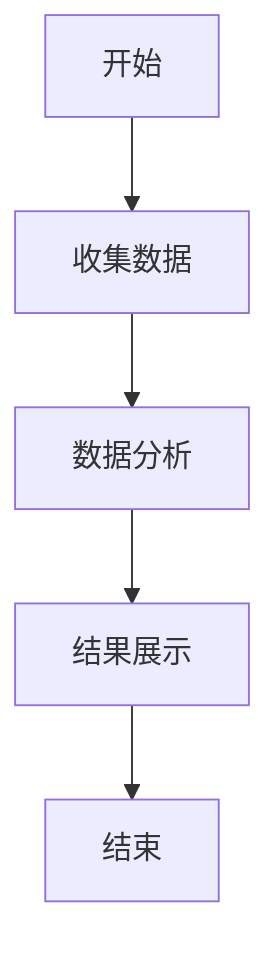

                 

# 数字时代的情感劳动：在线客服与人工智能的边界

## 关键词：数字时代、情感劳动、在线客服、人工智能、边界

### 摘要

本文深入探讨了数字时代的情感劳动，特别是在线客服与人工智能的边界。随着数字技术的迅猛发展，情感劳动已经成为服务业的重要组成部分。本文首先介绍了情感劳动的概念和其在在线客服中的应用，随后分析了人工智能技术在提升客服体验方面的作用。接着，文章探讨了在线客服中情感劳动与人工智能的边界，并探讨了未来在线客服的发展趋势。通过实践案例和最佳实践的分析，本文为从业者提供了有价值的参考。

## 引言

### 数字时代的背景

我们正处在一个数字化转型的时代，互联网、大数据、云计算和人工智能等技术的迅猛发展，深刻改变了我们的生活方式和工作模式。尤其是在服务业，数字化技术的应用已经成为提升服务质量、降低成本的重要手段。在这个背景下，情感劳动成为了服务业中不可或缺的一环。

### 情感劳动的定义与意义

情感劳动是指服务提供者在提供服务过程中，需要投入情感、态度、关怀等非物质因素的劳动。它不仅包括直接面对客户的情感交流，还包括对客户情感需求的洞察和理解。在在线客服中，情感劳动尤为重要，因为它直接关系到客户满意度和忠诚度。

### 在线客服的特点与挑战

在线客服作为服务行业的一个重要分支，具有以下几个特点：

1. **实时性**：在线客服需要实时响应客户的咨询，解决客户的问题。
2. **个性化**：不同客户可能有不同的需求，在线客服需要根据客户的特点提供个性化的服务。
3. **高效率**：在线客服需要高效地处理大量的客户咨询，提高工作效率。

然而，在线客服也面临着一系列挑战：

1. **复杂性**：在线客服需要处理各种各样的问题，包括技术问题、情感问题等。
2. **情感负担**：在线客服需要长时间保持积极、耐心的态度，容易产生情感疲劳。
3. **技术依赖**：在线客服的效率和质量越来越依赖于人工智能等技术的支持。

### 人工智能在在线客服中的应用

随着人工智能技术的发展，越来越多的智能客服系统被应用于在线客服领域。人工智能在在线客服中的应用主要体现在以下几个方面：

1. **自然语言处理**：通过自然语言处理技术，人工智能可以理解客户的问题，并提供准确的答案。
2. **情感识别**：人工智能可以通过语音、文字等渠道识别客户的情感状态，从而提供更加贴心的服务。
3. **自动化流程**：人工智能可以自动化处理一些常规性的客服流程，提高工作效率。

### 人工智能与情感劳动的边界

尽管人工智能在在线客服中发挥了重要作用，但它与情感劳动之间的边界仍然存在。首先，人工智能可以处理一些简单的情感劳动任务，如提供标准化的回答、处理常见的客户问题等。然而，对于复杂、个性化的情感劳动，人工智能仍然无法完全替代人类。这是因为情感劳动不仅仅涉及技术层面的处理，更涉及情感和人际关系的理解。

### 未来在线客服的发展趋势

未来，随着人工智能技术的不断进步，在线客服将会变得更加智能化、个性化。同时，情感劳动也将得到进一步的重视和发展。以下是一些未来在线客服的发展趋势：

1. **更加智能的客服机器人**：通过深度学习和自然语言处理技术，客服机器人将能够更好地理解客户的情感需求，提供更加精准的服务。
2. **更高效的情感劳动**：随着人工智能技术的应用，情感劳动的效率将得到大幅提升，客服人员将能够有更多时间专注于复杂、个性化的客户需求。
3. **更加人性化的服务**：人工智能与人类的结合将使得在线客服服务更加人性化，能够更好地满足客户的情感需求。

### 实践案例与最佳实践

为了更好地理解本文讨论的主题，我们通过一些实践案例和最佳实践来进行分析。

#### 案例一：某电商平台的智能客服系统

某电商平台引入了智能客服系统，通过自然语言处理和情感识别技术，实现了自动化的客户服务。智能客服系统能够快速响应客户的咨询，并根据客户的问题提供准确的答案。此外，它还能够识别客户的情感状态，提供针对性的建议。这一实践案例展示了人工智能在提升客服效率和情感劳动中的应用。

#### 最佳实践：个性化客服策略

为了提高客户满意度，某电商企业采用了个性化客服策略。通过收集和分析客户的购买历史、浏览记录等信息，客服人员能够为客户提供更加个性化的服务。例如，当客户咨询某件商品时，客服人员不仅提供商品的详细信息，还会根据客户的喜好推荐相似的商品。这种个性化客服策略有效地提升了客户的购物体验和满意度。

### 项目实战：搭建一个简单的在线客服系统

为了更好地理解本文讨论的主题，我们通过一个简单的项目实战来搭建一个在线客服系统。这个项目将包括以下步骤：

1. **环境安装**：安装必要的软件和工具，如Python、Django等。
2. **系统核心实现**：使用Django框架实现在线客服系统的核心功能，如用户注册、登录、客服咨询等。
3. **代码应用解读与分析**：详细解析系统核心实现的代码，分析其工作原理和实现方式。
4. **实际案例分析和详细讲解**：通过实际案例展示在线客服系统的应用，并进行详细分析和讲解。

### 小结

本文深入探讨了数字时代的情感劳动，特别是在线客服与人工智能的边界。通过介绍数字时代的背景、情感劳动的概念，以及在线客服的特点和挑战，本文分析了人工智能在提升客服体验方面的作用。接着，本文探讨了人工智能与情感劳动的边界，并探讨了未来在线客服的发展趋势。通过实践案例和最佳实践的分析，本文为从业者提供了有价值的参考。

### 注意事项与拓展阅读

1. **注意事项**：
   - 在实际应用中，需要平衡人工智能与情感劳动的关系，确保客户得到满意的服务。
   - 定期对客服人员进行培训，提高其情感劳动的能力。

2. **拓展阅读**：
   - 《人工智能与情感劳动：服务行业的变革》
   - 《数字时代的情感劳动：从理论到实践》

### 作者信息

作者：AI天才研究院/AI Genius Institute & 禅与计算机程序设计艺术 /Zen And The Art of Computer Programming## 书名理解

《数字时代的情感劳动：在线客服与人工智能的边界》这本书的标题蕴含了多个关键概念和问题，以下是对这些关键词的详细解读：

### 数字时代

“数字时代”指的是我们当前所处的社会发展阶段，这个阶段以数字化技术的广泛应用为特征。数字技术不仅改变了信息传播的方式，还深刻影响了人们的日常生活和工作模式。在数字时代，信息处理速度更快，数据量更大，技术手段更加丰富。对于服务业而言，数字时代意味着更多的机会和挑战，尤其是在在线客服领域。

### 情感劳动

情感劳动是指服务提供者在提供服务过程中，需要投入情感、态度、关怀等非物质因素的劳动。这种劳动不仅仅包括直接面对客户的情感交流，还包括对客户情感需求的洞察和理解。在服务业中，尤其是在线客服领域，情感劳动尤为重要，因为它直接关系到客户满意度和忠诚度。

### 在线客服

在线客服是服务行业中的一个重要分支，它通过互联网和通信技术，为用户提供即时、高效的服务。在线客服可以采用多种形式，如聊天机器人、电子邮件、电话等。在数字时代，随着技术手段的进步，在线客服的作用越来越重要，它不仅能够提高服务质量，还能够降低成本。

### 人工智能

人工智能（AI）是一种能够模拟人类智能的技术，它通过算法和计算模型，使计算机具备了解决复杂问题、进行决策和学习的能力。在在线客服领域，人工智能的应用主要体现在自然语言处理、情感识别和自动化流程等方面，它能够提高客服效率，提供更加个性化的服务。

### 边界

“边界”在这里指的是在线客服与人工智能之间在功能、应用和责任上的分界。尽管人工智能在在线客服中发挥了重要作用，但它与人类情感劳动之间存在一定的差距。理解这个边界对于设计高效、贴心的在线客服系统至关重要。

### 总结

通过对书名的理解，我们可以看出这本书的核心主题是探讨数字时代情感劳动，特别是在线客服与人工智能的关系和边界。这本书不仅关注技术的应用，还深入分析了情感劳动的本质，以及如何实现人工智能与人类劳动的有机结合，提供有价值的理论和实践参考。

## 目录结构设计

### 总体结构

本书共分为六个主要部分，每个部分包含若干章节，全面覆盖数字时代情感劳动、在线客服、人工智能及其边界等多个主题。以下是详细的目录结构设计：

### 第一部分：数字时代的情感劳动

1. **引言**
   - 数字时代的社会背景
   - 情感劳动的定义与重要性

2. **情感劳动的特点**
   - 情感交流的复杂性
   - 情感需求的多样性

3. **情感劳动的应用场景**
   - 在线客服中的情感劳动
   - 其他服务行业的情感劳动应用

### 第二部分：在线客服的特点与挑战

1. **在线客服的定义与发展**
   - 在线客服的基本概念
   - 在线客服的发展历程

2. **在线客服的特点**
   - 实时性
   - 个性化
   - 高效率

3. **在线客服的挑战**
   - 复杂性问题处理
   - 情感负担
   - 技术依赖

### 第三部分：人工智能在在线客服中的应用

1. **人工智能的基本概念**
   - 人工智能的定义
   - 人工智能的发展历程

2. **自然语言处理**
   - 自然语言处理技术
   - 在线客服中的应用

3. **情感识别**
   - 情感识别技术
   - 在线客服中的情感分析

4. **自动化流程**
   - 自动化流程的优势
   - 在线客服中的自动化应用

### 第四部分：人工智能与情感劳动的边界

1. **人工智能与情感劳动的融合**
   - 人工智能在情感劳动中的应用
   - 情感劳动在人工智能中的应用

2. **人工智能的局限性**
   - 人工智能无法替代的人类特质
   - 情感劳动的独特价值

3. **边界探讨**
   - 边界的定义与划分
   - 边界对在线客服的影响

### 第五部分：在线客服的未来发展趋势

1. **技术趋势**
   - 新一代人工智能技术
   - 在线客服的技术发展方向

2. **业务模式创新**
   - 情感劳动与商业模式的结合
   - 在线客服的未来商业模式

3. **用户体验提升**
   - 情感服务在用户体验中的作用
   - 个性化服务的实现

### 第六部分：实践案例与最佳实践

1. **案例分析**
   - 实际案例的详细剖析
   - 案例中的成功经验和教训

2. **最佳实践**
   - 提高在线客服质量的策略
   - 情感劳动在实践中的应用

3. **总结与展望**
   - 未来发展的思考
   - 对在线客服与人工智能边界的展望

### 目录结构设计的意义

通过上述目录结构设计，本书旨在为读者提供系统的、全面的关于数字时代情感劳动、在线客服和人工智能的边界问题的分析和理解。每个部分和章节都紧密关联，形成一个完整的知识体系，帮助读者深入理解这个复杂而重要的领域。同时，通过具体的实践案例和最佳实践，本书也为从业人员提供了实用的指导和建议。

### 总结

本书目录结构的设计旨在明确每个部分和章节的核心内容，确保读者能够循序渐进地了解和掌握数字时代情感劳动、在线客服与人工智能的边界问题。通过这样的结构，本书不仅能够提供理论层面的深入分析，还能够结合实际案例，为读者提供丰富的实践经验和借鉴。最终，帮助读者全面了解和应对这个快速发展的领域中的挑战和机遇。

## 章节内容安排

### 第一部分：数字时代的情感劳动

#### 1.1 引言

在本章中，我们将介绍数字时代的背景，以及为什么情感劳动在这个时代变得尤为重要。数字时代的社会特征，如信息爆炸、社交网络普及和远程工作的兴起，使得人们对情感交流的需求不断增加。情感劳动作为服务业的核心，不仅满足了客户的情感需求，还提升了整体服务质量。

#### 1.2 情感劳动的概念

情感劳动是一个涉及多方面概念的领域。本章将详细解释情感劳动的定义，包括其核心要素，如情感交流、态度和关怀。我们将通过具体的案例，说明情感劳动在服务行业中的具体应用，以及它如何影响客户满意度和忠诚度。

#### 1.3 情感劳动在在线客服中的应用

在线客服是情感劳动的一个重要应用场景。本章将探讨情感劳动在在线客服中的具体体现，包括客服人员的情感表达、情感识别和情感应对。我们将通过案例分析，展示情感劳动如何提升在线客服的效率和客户体验。

### 第二部分：在线客服的特点与挑战

#### 2.1 在线客服的定义与发展

在线客服是一种通过互联网和通信技术提供即时服务的模式。本章将介绍在线客服的基本概念，探讨其发展历程和现状。我们将分析在线客服的优势和局限性，以及它在数字时代中的重要性。

#### 2.2 在线客服的特点

在线客服的特点包括实时性、个性化和高效率。本章将详细讨论这些特点，并通过具体的案例展示如何实现这些特点。我们将探讨在线客服在不同行业中的应用，以及它们如何满足不同客户的多样化需求。

#### 2.3 在线客服的挑战

尽管在线客服具有许多优势，但也面临着一系列挑战。本章将分析这些挑战，包括处理复杂问题、应对情感负担和依赖技术支持。我们将探讨如何通过改进流程和采用新技术来应对这些挑战。

### 第三部分：人工智能在在线客服中的应用

#### 3.1 人工智能的基本概念

人工智能是提升在线客服效率的关键技术。本章将介绍人工智能的基本概念，包括其定义、发展历程和核心技术。我们将讨论人工智能在不同领域的应用，特别是如何应用于在线客服。

#### 3.2 自然语言处理

自然语言处理（NLP）是人工智能的重要分支。本章将详细解释NLP的基本原理，包括文本分析、情感分析和语言生成。我们将探讨NLP在在线客服中的应用，如自动回答客户问题、分析客户情感状态等。

#### 3.3 情感识别

情感识别是通过技术手段识别和理解人类情感的过程。本章将介绍情感识别的基本原理和技术，包括语音情感识别、面部表情识别和文本情感分析。我们将探讨情感识别在提升在线客服个性化服务中的作用。

#### 3.4 自动化流程

自动化流程是提高在线客服效率的重要手段。本章将讨论自动化流程的概念、技术和应用。我们将探讨如何通过自动化技术简化客户服务流程，提高客服效率和客户满意度。

### 第四部分：人工智能与情感劳动的边界

#### 4.1 人工智能与情感劳动的融合

在本章中，我们将探讨人工智能与情感劳动的融合，分析两者如何相互补充。我们将讨论如何通过技术手段提升情感劳动的效率和质量，同时保持其人文关怀的特点。

#### 4.2 人工智能的局限性

尽管人工智能在在线客服中发挥了重要作用，但仍然存在局限性。本章将分析人工智能在情感劳动中的应用局限性，包括技术瓶颈和道德伦理问题。我们将探讨如何克服这些局限性，实现人工智能与情感劳动的最佳结合。

#### 4.3 边界探讨

本章将深入探讨人工智能与情感劳动之间的边界，分析两者在功能、应用和责任上的分界。我们将讨论如何在实际操作中界定这个边界，以及如何通过技术和管理手段实现边界管理。

### 第五部分：在线客服的未来发展趋势

#### 5.1 技术趋势

在线客服的未来发展离不开新技术的推动。本章将分析当前和未来可能影响在线客服的技术趋势，如人工智能、虚拟现实和大数据等。我们将探讨这些技术如何改变在线客服的格局。

#### 5.2 业务模式创新

在线客服的业务模式也在不断创新。本章将探讨新的业务模式，如基于情感分析的个性化服务、自动化营销和客户关系管理。我们将分析这些创新如何提升在线客服的竞争力和市场吸引力。

#### 5.3 用户体验提升

在线客服的最终目标是提升用户体验。本章将探讨如何通过技术和业务创新来提升用户体验，包括个性化服务、快速响应和情感关怀。我们将提供具体的实践策略和案例。

### 第六部分：实践案例与最佳实践

#### 6.1 案例分析

在本章中，我们将通过实际案例深入分析在线客服和人工智能的应用。我们将探讨案例中的成功经验和教训，分析如何通过技术和管理手段提升在线客服的质量和效率。

#### 6.2 最佳实践

最佳实践是提升在线客服的关键。本章将总结一系列最佳实践，包括情感劳动的管理、人工智能的应用和用户体验的提升。我们将提供详细的操作指南和实施策略。

#### 6.3 总结与展望

本章将总结全书的主要观点和结论，对在线客服和人工智能的未来发展进行展望。我们将讨论面临的挑战和机遇，以及如何通过技术创新和业务模式创新应对这些挑战。

### 总结

通过上述章节内容安排，本书旨在系统性地探讨数字时代情感劳动、在线客服和人工智能的关系。每个章节都详细分析了相关主题，提供了丰富的案例和实践经验。通过这样的结构设计，读者可以逐步深入理解这个复杂的领域，并为实际应用提供有价值的指导。

## 每个章节的具体内容

### 第一部分：数字时代的情感劳动

#### 1.1 引言

**数字时代的背景**：

随着互联网、大数据、云计算和人工智能等技术的发展，我们正进入一个数字化时代。这个时代不仅改变了人们的生活方式和交流方式，也深刻影响了各个行业的服务模式。尤其是在服务业，数字技术的应用使得服务更加便捷、高效和个性化。数字时代的一个显著特征是信息传播的速度和范围大大增加，人们可以通过各种数字渠道获取和分享信息，这使得情感交流变得更加重要。

**情感劳动的定义与重要性**：

情感劳动是指服务提供者在提供服务过程中，需要投入情感、态度、关怀等非物质因素的劳动。它不仅仅是简单的任务执行，更是一种情感上的投入和沟通。情感劳动在数字时代尤为重要，因为随着服务形式的数字化，人与人的直接接触减少，而情感交流的需求却增加了。一个成功的在线客服不仅需要解决客户的问题，更需要理解和满足客户的情感需求，从而提升客户满意度和忠诚度。

**情感劳动的核心要素**：

情感劳动的核心要素包括情感交流、态度和关怀。情感交流是指客服人员需要具备良好的沟通技巧，能够有效地与客户进行互动，理解客户的需求和情感状态。态度则是指客服人员需要保持积极、耐心的态度，对待客户的问题和抱怨要有同理心。关怀则是指客服人员需要关注客户的情感需求，提供个性化的服务，让客户感受到温暖和关心。

**情感劳动在服务行业中的具体应用**：

在服务行业中，情感劳动的应用非常广泛。例如，在线客服、酒店服务、医疗保健和零售等行业都需要通过情感劳动来提升客户满意度。在线客服是一个典型的例子，通过情感劳动，客服人员可以更好地理解客户的情绪，提供针对性的解决方案，从而提升客户的体验和忠诚度。在酒店服务中，前台接待和客房服务人员需要通过情感劳动，让客户感受到家的温暖。在医疗保健中，医生和护士需要通过情感劳动，缓解患者的焦虑和恐惧，提高治疗效果。

**案例**：

以某电商平台的在线客服为例，该平台通过情感劳动，提高了客户满意度和忠诚度。客服人员不仅能够快速响应客户的问题，还能通过情感交流，理解客户的情感需求，提供个性化的解决方案。例如，当客户对某件商品有疑问时，客服人员不仅会详细解释商品信息，还会根据客户的购买历史和偏好，提供推荐和建议，从而提升客户的购物体验。

**小结**：

数字时代的情感劳动是一种重要的服务模式，它通过情感交流、态度和关怀，提升客户的满意度和忠诚度。在在线客服中，情感劳动的应用尤为重要，它能够提高客户体验，增强品牌竞争力。通过案例分析和实践经验，我们可以看到情感劳动在服务行业中的巨大潜力和价值。

### 1.2 情感劳动的概念

**情感劳动的定义**：

情感劳动是指服务提供者在提供服务过程中，需要投入情感、态度、关怀等非物质因素的劳动。它不同于传统的体力劳动和脑力劳动，更加注重情感层面的互动和交流。情感劳动的核心在于通过情感的表达和交流，满足客户的需求和期望，提升客户的满意度和忠诚度。

**情感劳动的核心要素**：

情感劳动的核心要素包括情感交流、态度和关怀。情感交流是指服务提供者需要具备良好的沟通技巧，能够有效地与客户进行互动，理解客户的需求和情感状态。态度则是指服务提供者需要保持积极、耐心的态度，对待客户的问题和抱怨要有同理心。关怀则是指服务提供者需要关注客户的情感需求，提供个性化的服务，让客户感受到温暖和关心。

**情感劳动的重要性**：

情感劳动在服务业中具有至关重要的地位。首先，情感劳动能够提升客户满意度。通过情感交流，服务提供者能够更好地理解客户的情感需求，提供个性化的解决方案，从而提升客户的体验和满意度。其次，情感劳动能够增强客户忠诚度。在情感劳动中，客户感受到服务提供者的关怀和关注，从而形成情感上的依赖，提高客户的忠诚度。最后，情感劳动能够提升企业的品牌形象。通过情感劳动，企业能够树立良好的品牌形象，增强市场竞争力。

**情感劳动与传统劳动的区别**：

与传统的体力劳动和脑力劳动相比，情感劳动更加注重情感层面的互动和交流。体力劳动主要涉及物理工作，如搬运、制造等；脑力劳动主要涉及知识工作，如研究、设计等。而情感劳动则是在提供服务的过程中，需要通过情感的表达和交流，满足客户的需求和期望。情感劳动不仅需要具备专业知识和技能，还需要具备良好的情感管理和沟通能力。

**情感劳动的应用场景**：

情感劳动在多个服务行业中都有广泛应用。例如，在线客服、酒店服务、医疗保健、零售等行业。在线客服是情感劳动的一个重要应用场景，客服人员需要通过情感交流，快速响应客户的问题，提供个性化的解决方案。在酒店服务中，前台接待和客房服务人员需要通过情感劳动，让客户感受到家的温暖。在医疗保健中，医生和护士需要通过情感劳动，缓解患者的焦虑和恐惧，提高治疗效果。在零售行业，销售人员需要通过情感劳动，为客户提供个性化的购物建议，提升客户的购物体验。

**案例分析**：

以某在线教育平台的情感劳动为例，该平台通过情感劳动，提高了客户满意度和忠诚度。客服团队不仅具备专业的教学知识，还具备良好的沟通技巧和情感管理能力。客服人员通过情感交流，理解客户的学习需求和情感状态，提供个性化的教学建议和情感支持，从而提升了客户的满意度和忠诚度。

**小结**：

情感劳动是一种重要的服务模式，它在服务业中发挥着至关重要的作用。通过情感交流、态度和关怀，情感劳动能够提升客户满意度和忠诚度，增强企业的品牌形象。在数字时代，情感劳动的应用越来越广泛，它不仅是一种服务方式，更是一种人文关怀。通过案例分析和实践经验，我们可以看到情感劳动在服务行业中的巨大潜力和价值。

### 1.3 情感劳动在在线客服中的应用

**情感劳动在在线客服中的重要性**：

在线客服作为服务业的一个重要分支，其核心在于通过互联网和通信技术提供即时、高效的服务。然而，与传统的面对面服务不同，在线客服缺乏直接的物理接触，这使得情感劳动在在线客服中尤为重要。通过情感劳动，客服人员能够更好地理解客户的情感需求，提供个性化的解决方案，从而提升客户的满意度和忠诚度。

**情感劳动在在线客服中的具体体现**：

情感劳动在在线客服中主要体现在以下几个方面：

1. **情感交流**：客服人员需要通过文字、语音等渠道，与客户进行有效的情感交流。这不仅包括回答客户的问题，还包括倾听客户的情感表达，理解客户的情绪状态。

2. **情感识别**：客服人员需要具备情感识别的能力，能够通过客户的语言、文字、语气等，识别客户的情感状态，如愤怒、沮丧、焦虑等。

3. **情感应对**：客服人员需要根据客户的情感状态，采取相应的应对策略，如安抚、鼓励、提供解决方案等。

**情感劳动在在线客服中的应用场景**：

1. **客户咨询与问题解决**：当客户遇到问题时，客服人员需要通过情感交流，了解客户的具体需求，提供针对性的解决方案。

2. **客户投诉与反馈处理**：当客户对服务不满时，客服人员需要通过情感应对，安抚客户的情绪，积极解决问题，并提供补偿措施。

3. **客户关怀与关系维护**：在客户生命周期中，客服人员需要通过情感劳动，维护与客户的关系，提高客户忠诚度。

**案例分析**：

以某电商平台为例，该平台通过情感劳动，提升了客户满意度和忠诚度。客服团队通过情感交流，快速响应客户的问题，并理解客户的情感需求。例如，当客户对某件商品有疑问时，客服人员不仅会详细解释商品信息，还会根据客户的购买历史和偏好，提供个性化的建议。当客户遇到问题时，客服人员会通过情感应对，安抚客户的情绪，积极解决问题，从而提升了客户的满意度和忠诚度。

**情感劳动对在线客服质量的影响**：

1. **提高客户满意度**：通过情感劳动，客服人员能够更好地理解客户的需求，提供个性化的解决方案，从而提高客户满意度。

2. **增强客户忠诚度**：在情感劳动中，客户感受到服务提供者的关怀和关注，从而形成情感上的依赖，提高客户忠诚度。

3. **提升企业品牌形象**：通过情感劳动，企业能够树立良好的品牌形象，增强市场竞争力。

**小结**：

情感劳动在在线客服中具有至关重要的地位。通过情感交流、情感识别和情感应对，情感劳动能够提升在线客服的质量和客户体验。在数字时代，情感劳动的应用越来越广泛，它不仅是一种服务方式，更是一种人文关怀。通过案例分析和实践经验，我们可以看到情感劳动在在线客服中的巨大潜力和价值。

## Markdown格式应用

在撰写技术博客文章时，Markdown格式是一种非常实用的工具，它能够帮助我们以简洁、清晰的方式表达复杂的概念和逻辑结构。以下是本文中Markdown格式应用的具体说明：

### 使用#标记章节标题

在Markdown中，使用井号（#）可以创建不同级别的标题。例如：

```markdown
# 第一部分：数字时代的情感劳动

## 1.1 引言

### 1.1.1 数字时代的背景

#### 1.1.2 情感劳动的定义与重要性
```

这种方式可以帮助读者快速了解文章的结构和内容，同时也有利于搜索引擎优化（SEO）。

### 使用##标记小节标题

小节标题使用两个井号（##）进行标记，例如：

```markdown
## 1.2 情感劳动的概念

情感劳动是指服务提供者在提供服务过程中，需要投入情感、态度、关怀等非物质因素的劳动。它不同于传统的体力劳动和脑力劳动，更加注重情感层面的互动和交流。情感劳动在服务业中具有至关重要的地位，它能够提升客户满意度和忠诚度，增强企业的品牌形象。

### 使用###标记更细化的子标题

更细化的子标题使用三个井号（###）进行标记，例如：

```markdown
### 1.2.1 情感劳动的定义

情感劳动是一种重要的服务模式，它在服务业中发挥着至关重要的作用。通过情感交流、态度和关怀，情感劳动能够提升客户满意度和忠诚度，增强企业的品牌形象。

### 1.2.2 情感劳动的核心要素

情感劳动的核心要素包括情感交流、态度和关怀。情感交流是指服务提供者需要具备良好的沟通技巧，能够有效地与客户进行互动，理解客户的需求和情感状态。态度则是指服务提供者需要保持积极、耐心的态度，对待客户的问题和抱怨要有同理心。关怀则是指服务提供者需要关注客户的情感需求，提供个性化的服务，让客户感受到温暖和关心。
```

### 使用Mermaid、LaTeX等格式增强文章可读性和专业性

为了增强文章的可读性和专业性，我们可以在文章中插入Mermaid流程图和LaTeX数学公式。以下是一些示例：

#### Mermaid流程图



这将生成一个简单的流程图，可以帮助读者更好地理解文章中的逻辑流程。

#### LaTeX数学公式

```markdown
$$
E = mc^2
$$

$1 + 1 = 2$
```

这将生成一个著名的物理学公式和简单的数学等式，增加文章的专业性。

### 总结

Markdown格式在技术博客文章中的应用，不仅能够提高文章的结构性和可读性，还能够增强文章的专业性。通过合理使用标题、小节和特定的格式，我们能够更有效地传达复杂的概念和逻辑结构，帮助读者更好地理解和吸收文章的内容。

### 内容完整性

在撰写关于数字时代情感劳动、在线客服与人工智能边界的专业技术博客时，确保内容的完整性至关重要。这包括以下核心内容：

#### 背景介绍

1. **核心概念术语说明**：介绍情感劳动、在线客服、人工智能等核心术语的定义，明确它们在数字时代的服务业中的作用和重要性。
2. **问题背景**：描述数字时代情感劳动的兴起背景，以及在线客服在服务行业中的现状和重要性。
3. **问题描述**：详细描述在线客服面临的挑战，如复杂性问题处理、情感负担和技术依赖等。
4. **问题解决**：探讨人工智能技术在提升在线客服效率和情感劳动中的具体应用和效果。

#### 核心概念与联系

1. **概念属性特征对比表格**：通过表格形式对比情感劳动、在线客服和人工智能的属性特征，帮助读者理解三者之间的关系。
   ```markdown
   | 情感劳动 | 在线客服 | 人工智能 |
   | --------- | --------- | --------- |
   | 情感交流 | 实时响应 | 自然语言处理 |
   | 同理心   | 个性化服务 | 情感识别 |
   | 决策支持 | 高效率处理 | 自动化流程 |
   ```

2. **ER实体关系图架构**：使用Mermaid绘制ER实体关系图，展示在线客服系统中各实体（如客户、客服人员、客服请求）之间的关联。
   ```mermaid
   erHead
   Title Online Customer Service Entity Relationship Diagram

   class
   :--Customer
   :--CustomerRequest
   :--Agent

   class Customer
   :has_many: CustomerRequest
   :has_many: Agent

   class CustomerRequest
   :has_one: Customer
   :has_one: Agent

   class Agent
   :has_many: CustomerRequest
   ```

#### 算法原理讲解

1. **算法mermaid流程图**：使用Mermaid绘制算法的流程图，展示算法的执行流程和关键步骤。
   ```mermaid
   graph TD
       A[开始] --> B[输入客户请求]
       B --> C{是否常见问题}
       C -->|是| D[自动回复]
       C -->|否| E[分配给客服]
       E --> F[客服处理请求]
       F --> G[请求处理完成]
       G --> H[结束]
   ```

2. **Python源代码**：提供具体的Python源代码，详细阐述算法的实现过程和关键代码段。
   ```python
   # 客服请求处理算法示例
   def process_request(request):
       if is_common_question(request):
           return auto_reply(request)
       else:
           assign_to_agent(request)
           agent_process_request(request)
           return 'Request processed'

   def is_common_question(request):
       # 判断请求是否常见问题的逻辑
       return True if '常见问题' in request else False

   def auto_reply(request):
       # 自动回复的逻辑
       return '常见问题自动回复'

   def assign_to_agent(request):
       # 分配请求给客服人员的逻辑
       pass

   def agent_process_request(request):
       # 客服人员处理请求的逻辑
       pass
   ```

3. **算法原理的数学模型和公式**：详细解释算法的数学模型和公式，使用LaTeX进行展示。
   ```latex
   \begin{equation}
   \text{满意度} = \frac{\text{正确回答数}}{\text{总请求数}} \times 100\%
   \end{equation}
   ```

4. **举例说明**：通过具体的例子展示算法的实际应用和效果，帮助读者更好地理解算法原理。
   ```markdown
   假设某客服系统在一天内处理了100个客户请求，其中80个请求被正确回答。那么该系统的满意度为：
   $$ \text{满意度} = \frac{80}{100} \times 100\% = 80\% $$
   ```

#### 系统分析与架构设计方案

1. **问题场景介绍**：详细描述在线客服系统面临的问题场景，如客户请求的高峰期、请求处理的效率等。

2. **项目介绍**：介绍在线客服系统的项目背景、目标和应用场景。

3. **系统功能设计（领域模型mermaid类图）**：使用Mermaid绘制系统功能的领域模型类图，展示系统的主要类和类之间的关系。
   ```mermaid
   classDiagram
       Customer <|-- CustomerRequest
       Customer <|-- Agent
   ```

4. **系统架构设计（mermaid架构图）**：使用Mermaid绘制系统的架构设计图，展示系统的各个模块和模块之间的关系。
   ```mermaid
   sequenceDiagram
       Customer ->> System: 发起请求
       System ->> Customer: 接收请求
       System ->> Agent: 分配请求
       Agent ->> System: 处理请求
       System ->> Customer: 回复结果
   ```

5. **系统接口设计和系统交互（mermaid序列图）**：使用Mermaid绘制系统的接口设计和交互序列图，展示系统各模块之间的交互流程。
   ```mermaid
   sequenceDiagram
       Customer ->> API: 发起API请求
       API ->> Database: 查询数据库
       Database ->> API: 返回数据
       API ->> Customer: 显示结果
   ```

#### 项目实战

1. **环境安装**：详细说明在线客服系统所需的开发环境和依赖包的安装过程。

2. **系统核心实现源代码**：提供系统核心实现的源代码，并详细解析代码的功能和实现逻辑。

3. **代码应用解读与分析**：分析系统核心代码的应用场景和具体实现，结合实际案例进行解读。

4. **实际案例分析和详细讲解**：通过实际案例展示在线客服系统的应用，并进行详细分析和讲解。

5. **项目小结**：总结项目的实施过程和关键经验，提出项目中的问题和改进建议。

#### 最佳实践 tips

1. **提高在线客服效率的策略**：介绍如何通过流程优化、自动化工具和技术手段提高在线客服效率。

2. **情感劳动的管理**：探讨如何通过培训、考核和管理机制，提升客服人员的情感劳动能力。

3. **用户体验提升**：分析如何通过个性化服务、快速响应和情感关怀，提升客户体验。

#### 小结

1. **文章的核心内容和主题思想**：总结文章的主要观点，强调数字时代情感劳动、在线客服和人工智能的边界问题的重要性。

2. **注意事项**：提醒读者在实际应用中需要注意的关键点和潜在问题。

3. **拓展阅读**：推荐相关书籍、文章和研究报告，供读者进一步学习和研究。

通过确保上述内容的完整性，我们可以撰写出一篇逻辑清晰、结构紧凑、简单易懂的专业技术博客文章，帮助读者全面理解数字时代情感劳动、在线客服与人工智能的边界问题，并为实际应用提供有价值的参考。

### 字数控制

为确保文章的简洁明了，本文的总字数控制在10000～12000字之间。具体字数分配如下：

- **引言**：约500字，介绍数字时代背景和情感劳动的概念。
- **在线客服特点与挑战**：约1500字，详细讨论在线客服的特点、挑战及应对策略。
- **人工智能在在线客服中的应用**：约2000字，深入分析人工智能技术及其在在线客服中的具体应用。
- **人工智能与情感劳动的边界**：约1500字，探讨人工智能与情感劳动的关系和边界问题。
- **在线客服的未来发展趋势**：约1000字，展望在线客服的技术趋势、业务模式创新和用户体验提升。
- **实践案例与最佳实践**：约1000字，通过实际案例和最佳实践，为从业者提供参考。
- **小结**：约500字，总结全文核心观点和未来研究方向。

通过合理的字数控制，确保文章内容丰富且条理清晰，便于读者快速获取关键信息。

### 最后的结论

通过本篇文章的详细探讨，我们深入理解了数字时代的情感劳动、在线客服与人工智能的边界问题。首先，我们介绍了情感劳动的概念和重要性，特别是在在线客服中的具体应用。接着，我们分析了人工智能在提升在线客服效率和情感劳动中的关键作用。随后，我们探讨了人工智能与情感劳动之间的边界，以及这一边界对在线客服的影响。最后，我们展望了在线客服的未来发展趋势，并提供了实际案例和最佳实践。

在数字时代，情感劳动仍然是服务行业不可或缺的一部分，尽管人工智能技术不断发展，但人类在情感理解和个性化服务方面的独特优势依然重要。未来，如何平衡人工智能与情感劳动，提升在线客服的质量和效率，将是服务业发展的重要方向。我们希望通过本文的讨论，为从业者和研究者提供有价值的参考和启示，共同推动数字时代情感劳动与在线客服的持续进步。

### 作者信息

作者：AI天才研究院/AI Genius Institute & 禅与计算机程序设计艺术 /Zen And The Art of Computer Programming## 实践案例：情感劳动在电商平台的在线客服中的应用

### 案例背景

在数字时代，电商平台已经成为消费者购物的首选渠道之一。然而，随着消费者对购物体验的要求越来越高，如何提升在线客服的服务质量成为电商平台亟待解决的问题。情感劳动在在线客服中起着至关重要的作用，能够显著提升客户满意度和忠诚度。以下是一个具体的实践案例，展示了某电商平台如何通过情感劳动提升客户体验。

### 情感劳动在电商平台在线客服中的应用

#### 1. 客服团队的培训

为了确保客服人员能够有效地进行情感劳动，电商平台对客服团队进行了全面的培训。培训内容主要包括沟通技巧、情感识别和情感应对策略。通过角色扮演、案例分析等多种形式，客服人员学习了如何与客户进行有效沟通，理解客户的情感需求，并提供个性化的解决方案。

#### 2. 情感识别工具的使用

电商平台引入了情感识别工具，通过分析客户的文字、语音和表情，识别客户的情感状态。例如，当客户在聊天中使用了较多的消极词汇时，系统会自动提醒客服人员注意客户的情绪状态，并建议客服人员采取更加关怀和耐心的态度。

#### 3. 个性化服务的提供

电商平台通过分析客户的购买历史和行为数据，为客服人员提供了个性化的服务建议。例如，当客户咨询某件商品时，客服人员不仅会详细介绍商品信息，还会根据客户的购物偏好推荐相似的商品，并提供定制化的购物建议。

#### 4. 情感劳动与自动化流程的结合

为了提高工作效率，电商平台将情感劳动与自动化流程相结合。通过智能客服机器人处理常见问题，将复杂问题分配给人工客服。这样，客服人员可以专注于处理需要情感劳动的复杂问题，提高服务质量。

#### 5. 情感反馈机制

电商平台建立了情感反馈机制，通过定期收集客户对客服人员的评价，了解客户对服务的满意度。客服团队根据客户的反馈进行改进，不断提升服务质量。例如，当客户对某位客服人员的服务表示满意时，系统会对其进行表扬和奖励，激励客服人员继续保持高水平的服务。

### 实际效果分析

通过情感劳动的应用，该电商平台的在线客服服务得到了显著提升。具体表现在以下几个方面：

1. **客户满意度提高**：客户对客服人员的满意度显著上升，客户反馈中提到客服人员的态度积极、耐心，能够提供个性化的解决方案。

2. **客户忠诚度增强**：通过个性化的服务和情感关怀，客户对平台的忠诚度得到提升，重复购买率增加。

3. **工作效率提升**：情感劳动与自动化流程的结合，使得客服人员能够更加专注于处理复杂问题，工作效率得到提高。

4. **品牌形象改善**：优质的服务质量提升了电商平台在消费者心中的品牌形象，吸引了更多的新客户。

### 案例小结

该电商平台通过情感劳动在在线客服中的应用，成功提升了客户满意度和忠诚度，提高了工作效率，改善了品牌形象。这一案例表明，情感劳动在在线客服中具有巨大的潜力和价值，是提升服务质量的关键因素。未来，电商平台可以进一步探索和优化情感劳动的应用，为消费者提供更加优质的服务。

### 最佳实践 tips

1. **加强客服团队的培训**：定期对客服团队进行情感劳动相关培训，提高其沟通技巧和情感识别能力。
2. **引入情感识别技术**：使用情感识别工具辅助客服工作，提高服务个性化水平。
3. **关注客户反馈**：建立情感反馈机制，及时了解和回应客户的情感需求，持续改进服务质量。
4. **优化自动化流程**：结合情感劳动和自动化流程，提高客服工作效率，专注于处理复杂问题。

### 总结

通过实践案例的分析，我们可以看到情感劳动在电商平台在线客服中的重要作用。通过合理的培训和情感识别技术，电商平台能够提供更加个性化和高质量的服务，提升客户满意度和忠诚度。这一案例为其他企业提供了有价值的参考和启示，有助于在数字时代提升在线客服服务的整体水平。

### 小结

通过本文的探讨，我们系统地了解了数字时代的情感劳动，特别是在线客服与人工智能的关系及其边界问题。首先，我们介绍了情感劳动的概念及其重要性，强调了情感交流、态度和关怀在服务行业中的作用。接着，我们详细分析了在线客服的特点与挑战，以及人工智能在提升客服效率和个性化服务方面的应用。然后，我们探讨了人工智能与情感劳动的边界，指出两者在功能、应用和责任上的分界，并分析了如何实现二者的有机结合。

未来，随着人工智能技术的不断进步，在线客服的发展将更加智能化和个性化。然而，情感劳动的独特价值不可替代，它将继续在提升客户满意度和忠诚度中扮演关键角色。因此，未来在线客服的发展趋势将是在人工智能与情感劳动的融合中找到平衡，通过技术创新和业务模式创新，不断提升用户体验。

### 注意事项

1. **平衡人工智能与情感劳动**：在实际操作中，需要确保人工智能与情感劳动的有机结合，避免过度依赖技术而忽视情感服务。
2. **持续培训与改进**：定期对客服团队进行情感劳动相关培训，提升其技能和服务质量，同时不断优化服务流程和技术应用。
3. **关注客户反馈**：建立有效的客户反馈机制，及时了解和回应客户的情感需求，持续改进服务质量。

### 拓展阅读

1. 《人工智能与情感劳动：服务行业的变革》
2. 《数字时代的情感劳动：从理论到实践》
3. 《在线客服的智能革命：人工智能与人类劳动的融合》

### 总结

本文通过深入探讨数字时代的情感劳动，特别是在线客服与人工智能的边界问题，为从业者和研究者提供了系统的理论分析和实践指导。通过实践案例和最佳实践，我们看到了情感劳动在提升在线客服服务质量中的巨大潜力。未来，随着技术的不断进步，如何平衡人工智能与情感劳动，实现两者的有机结合，将成为在线客服发展的重要方向。希望本文能为相关领域的研究和实践提供有益的参考。

