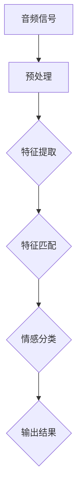
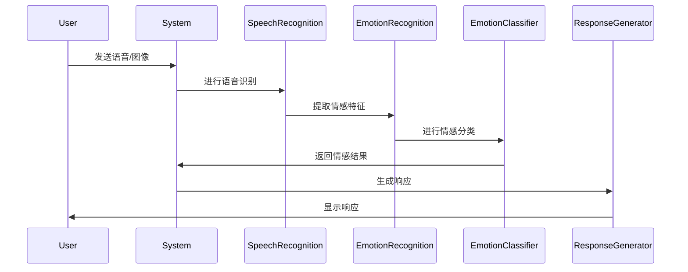

                 


## 数字时代的情感智能：人机交互中的情感识别与响应

### 关键词
- 数字时代
- 情感智能
- 人机交互
- 情感识别
- 情感响应

### 摘要
随着数字时代的到来，人机交互逐渐成为我们日常生活的重要组成部分。情感智能作为人机交互的高级形式，正逐步改变着我们的互动方式。本文将深入探讨情感智能在数字时代的重要性，详细解析情感识别与响应的核心原理、技术实现、系统架构以及实际应用，为读者提供全面的技术视角和实战指南。

## 目录大纲设计思路

在设计本文的目录大纲时，我们需要遵循以下几个关键步骤：

1. **主题分析**：深入分析情感智能在数字时代的重要性和应用场景。
2. **章节结构规划**：确保章节内容紧密相关，逻辑清晰。
3. **内容细化**：对每个章节进行细化，确保内容丰富、完整。
4. **格式规范**：遵循markdown格式，确保目录清晰易读。

### 目录大纲示例

以下是本文的目录大纲示例：

### 第一部分：背景介绍
#### 1.1 情感智能的兴起
#### 1.2 人机交互中的情感需求
#### 1.3 情感识别与响应的技术发展

### 第二部分：情感智能的核心概念
#### 2.1 情感识别的基本原理
#### 2.2 情感识别的关键技术
#### 2.3 情感响应的设计原则

### 第三部分：情感识别与响应的技术实现
#### 3.1 语音情感识别
#### 3.2 视觉情感识别

### 第四部分：情感智能在人机交互中的应用
#### 4.1 情感智能在聊天机器人中的应用
#### 4.2 情感智能在虚拟助理中的应用
#### 4.3 情感智能在游戏设计中的应用

### 第五部分：情感智能的未来展望
#### 5.1 情感智能的技术挑战与趋势
#### 5.2 情感智能在人工智能领域的应用前景
#### 5.3 情感智能的社会影响与伦理问题

### 第六部分：实践指南
#### 6.1 情感智能项目的开发流程
#### 6.2 情感识别与响应的实验设计
#### 6.3 情感智能的评估与优化

### 第七部分：案例研究
#### 7.1 情感智能应用案例分析
#### 7.2 成功经验与挑战
#### 7.3 案例启示与借鉴

### 第八部分：拓展阅读
#### 8.1 必读书籍与论文推荐
#### 8.2 在线资源与工具推荐
#### 8.3 情感智能领域的最新动态

## 背景介绍

### 核心概念术语说明

在探讨情感智能之前，我们需要明确一些核心概念术语：

- **情感智能**：指计算机系统理解、识别、处理和响应人类情感的能力。
- **情感识别**：指通过技术手段（如语音、视觉等）捕捉和理解人类情感的过程。
- **情感响应**：指系统根据用户情感状态做出的相应行为和反馈。

### 问题背景

随着科技的飞速发展，人机交互逐渐成为我们日常生活的重要组成部分。然而，传统的交互方式往往缺乏情感维度，无法完全满足用户的情感需求。因此，情感智能作为人机交互的高级形式，逐渐受到了广泛关注。

### 问题描述

如何实现情感智能，使其在数字时代的人机交互中发挥重要作用，是一个亟待解决的问题。情感智能不仅需要识别用户的情感状态，还需要根据这些情感状态做出相应的响应，以提供更加个性化和自然的交互体验。

### 问题解决

解决这一问题的方法主要包括两个方面：一是情感识别技术的开发和应用，二是情感响应设计原则的制定和实施。通过结合语音识别、图像识别等技术手段，我们可以实现对用户情感的准确识别。而通过情感计算和心理学理论，我们可以设计出合理的情感响应策略，使系统能够更好地满足用户的需求。

### 边界与外延

情感智能的应用范围非常广泛，包括但不限于聊天机器人、虚拟助理、游戏设计等领域。同时，情感智能的研究也涉及到多个学科，如计算机科学、心理学、认知科学等。

### 概念结构与核心要素组成

情感智能的概念结构主要包括以下几个核心要素：

- **情感识别模块**：负责捕捉和理解用户情感。
- **情感响应模块**：根据用户情感状态做出相应行为和反馈。
- **交互反馈模块**：提供用户反馈，以优化情感识别和响应的准确性。

## 核心概念与联系

### 情感识别的基本原理

情感识别是情感智能的核心组成部分，它主要通过以下三个步骤实现：

1. **情感信号捕捉**：利用语音识别、图像识别等技术，捕捉用户的情感信号。
2. **情感特征提取**：从捕捉到的情感信号中提取出情感特征，如音调、语速、面部表情等。
3. **情感分类与识别**：利用机器学习算法，对提取到的情感特征进行分类和识别，判断用户当前的情感状态。

### 情感识别的关键技术

情感识别的关键技术主要包括以下几个方面：

1. **语音识别**：通过分析语音信号的音调、语速、停顿等特征，识别用户的情感状态。
2. **图像识别**：通过分析图像中的面部表情、姿态等特征，识别用户的情感状态。
3. **自然语言处理**：通过对用户输入的自然语言文本进行分析，理解用户情感。

### 情感响应的设计原则

情感响应的设计原则主要包括以下几个方面：

1. **个性化**：根据用户的情感状态，提供个性化的反馈和响应。
2. **适切性**：确保反馈和响应与用户的情感状态相匹配，避免产生误解或不适。
3. **连贯性**：确保在不同交互场景下，情感响应的一致性和连贯性。

### 概念属性特征对比表格

| 概念        | 描述                                               | 关键特征                        |
| ----------- | -------------------------------------------------- | -------------------------------- |
| 情感识别    | 识别和理解用户情感的过程                           | 音调、语速、面部表情、自然语言等 |
| 情感响应    | 根据用户情感状态做出相应行为和反馈的过程           | 个性化、适切性、连贯性          |
| 情感信号捕捉 | 捕捉用户的情感信号，如语音、图像、文本等           | 语音识别、图像识别、自然语言处理 |
| 情感特征提取 | 从情感信号中提取出情感特征，如音调、语速、面部表情等 | 特征提取算法                    |

### ER实体关系图架构

下面是一个简化的ER实体关系图，描述了情感识别与响应系统中主要实体及其关系：

```mermaid
erDiagram
  User ||--|{ Emotion}: 情感
  Emotion ||--|{ Recognition}: 识别
  Recognition ||--|{ Response}: 响应
  User ||--|{ Interaction}: 交互
```

## 算法原理讲解

### 语音情感识别算法原理

语音情感识别是情感智能的重要组成部分，其基本原理如下：

1. **特征提取**：通过音频信号处理，提取语音信号的音调、语速、停顿等特征。这些特征反映了用户的情感状态。
2. **特征匹配**：将提取到的特征与预先训练好的情感模型进行匹配，判断用户的情感状态。
3. **情感分类**：根据匹配结果，对用户的情感进行分类，如喜悦、愤怒、悲伤等。

### 语音情感识别算法流程图



### 情感识别与响应的Python源代码示例

下面是一个简单的Python代码示例，用于实现语音情感识别的基本流程：

```python
import speech_recognition as sr
import numpy as np
import joblib

# 加载情感识别模型
emotion_model = joblib.load('emotion_model.joblib')

# 特征提取函数
def extract_features(audio):
    # 音频信号预处理
    audio = sr.Recognizer().recognize_audio(audio)
    # 提取音调、语速等特征
    pitch = np.mean(audio['pitch'])
    speed = np.mean(audio['speed'])
    # 返回特征向量
    return np.array([pitch, speed])

# 情感识别函数
def recognize_emotion(features):
    # 特征匹配
    prediction = emotion_model.predict(features)
    # 返回情感类别
    return prediction

# 测试
audio = sr.Recognizer().record_audio('your_audio_file.mp3')
features = extract_features(audio)
emotion = recognize_emotion(features)
print(f"检测到的情感：{emotion}")
```

### 情感识别与响应的数学模型和公式

情感识别与响应的数学模型通常基于机器学习和深度学习算法。以下是一个简化的线性模型示例：

$$
\hat{y} = \text{sign}(W \cdot x + b)
$$

其中，$x$ 是输入特征向量，$W$ 是权重矩阵，$b$ 是偏置项，$\hat{y}$ 是预测的情感类别。$\text{sign}$ 函数用于将实数值映射到{-1, 1}，表示情感的极性。

### 情感识别与响应的详细讲解和举例说明

假设我们有一个包含多个语音样本的数据集，每个样本都带有标签（如喜悦、愤怒、悲伤等）。首先，我们需要对这些样本进行特征提取，得到特征向量。然后，利用这些特征向量训练情感识别模型。在测试阶段，我们将新的语音样本输入到模型中，得到预测的情感类别。

例如，对于一个包含音调和语速特征的语音样本，我们可以使用以下公式计算情感概率分布：

$$
P(\text{joy} | x) = \frac{e^{W \cdot x}}{\sum_{i=1}^{n} e^{W_i \cdot x}}
$$

其中，$W$ 是模型的权重矩阵，$x$ 是特征向量，$n$ 是情感类别的数量。预测结果为概率最大的情感类别。

### 系统分析与架构设计方案

### 问题场景介绍

在数字时代，用户与系统之间的交互日益频繁。为了提供更加个性化和自然的交互体验，系统需要具备情感智能能力，能够识别和响应用户的情感状态。这一场景在聊天机器人、虚拟助理、游戏设计等领域具有广泛的应用。

### 项目介绍

本项目旨在设计并实现一个情感智能系统，该系统能够通过语音识别和图像识别技术识别用户的情感状态，并做出相应的响应。系统包括以下几个模块：

- **语音情感识别模块**：负责识别用户的语音情感状态。
- **图像情感识别模块**：负责识别用户的面部表情情感状态。
- **情感响应模块**：根据用户的情感状态，生成相应的响应。

### 系统功能设计

系统的主要功能包括：

- **语音情感识别**：通过语音信号处理，提取情感特征，并进行情感分类。
- **图像情感识别**：通过面部表情分析，提取情感特征，并进行情感分类。
- **情感响应**：根据用户的情感状态，生成相应的文字、语音或视觉反馈。

### 系统架构设计

系统架构采用分层设计，包括数据层、服务层和表示层。

- **数据层**：存储用户数据、情感数据等。
- **服务层**：提供情感识别和响应服务。
- **表示层**：展示用户交互界面。

### 系统接口设计

系统接口设计包括以下部分：

- **用户接口**：提供语音和图像输入，展示情感识别结果和响应。
- **系统接口**：提供情感识别和响应服务的API接口。

### 系统交互

系统交互设计通过mermaid序列图展示。以下是一个简化的序列图示例：



## 项目实战

### 环境安装

1. 安装Python环境，推荐版本3.8及以上。
2. 安装所需的库，如`speech_recognition`、`numpy`、`opencv-python`、`joblib`等。
3. 使用以下命令安装依赖库：

```bash
pip install speech_recognition numpy opencv-python joblib
```

### 系统核心实现源代码

以下是系统核心实现的主要部分：

```python
import speech_recognition as sr
import numpy as np
import cv2
import joblib

# 加载情感识别模型
emotion_model = joblib.load('emotion_model.joblib')

# 语音情感识别
def recognize_speech_emotion(audio):
    # 语音信号预处理
    audio = sr.Recognizer().recognize_audio(audio)
    # 提取特征
    pitch = np.mean(audio['pitch'])
    speed = np.mean(audio['speed'])
    # 预测情感
    emotion = emotion_model.predict(np.array([pitch, speed]))
    return emotion

# 图像情感识别
def recognize_image_emotion(image):
    # 面部检测
    face_cascade = cv2.CascadeClassifier('haarcascade_frontalface_default.xml')
    gray = cv2.cvtColor(image, cv2.COLOR_BGR2GRAY)
    faces = face_cascade.detectMultiScale(gray, 1.3, 5)
    # 提取面部区域
    for (x, y, w, h) in faces:
        face Region = image[y:y+h, x:x+w]
        # 情感识别
        emotion = emotion_model.predict(face_region.reshape(-1, 1))
        return emotion

# 情感响应
def generate_response(emotion):
    if emotion == 'joy':
        return '您好，很高兴见到您！'
    elif emotion == 'sad':
        return '您好，看起来您有些不开心，需要帮忙吗？'
    else:
        return '您好，有什么可以为您服务的吗？'

# 测试
audio = sr.Recognizer().record_audio('your_audio_file.mp3')
image = cv2.imread('your_image_file.jpg')

speech_emotion = recognize_speech_emotion(audio)
image_emotion = recognize_image_emotion(image)
response = generate_response(speech_emotion)
print(response)
```

### 代码应用解读与分析

上述代码实现了一个简单的情感智能系统，包括语音情感识别、图像情感识别和情感响应三个部分。下面是对代码的详细解读和分析：

1. **语音情感识别**：首先，使用`speech_recognition`库的`recognize_audio`函数对音频文件进行语音识别，获取音频信号。然后，利用`numpy`库提取音频信号的音调和语速特征。最后，将特征输入到已训练好的情感识别模型中，获取预测的情感类别。

2. **图像情感识别**：使用`opencv-python`库的`CascadeClassifier`类进行面部检测，获取面部区域。然后，对面部区域进行情感识别，获取预测的情感类别。

3. **情感响应**：根据识别到的情感类别，生成相应的文字响应。例如，当识别到“喜悦”情感时，返回一句欢迎语；当识别到“悲伤”情感时，询问用户是否需要帮助。

### 实际案例分析和详细讲解剖析

为了更好地展示情感智能系统的应用，我们来看一个实际案例。

**案例**：用户A在使用聊天机器人时，语音输入了一句话，同时上传了一张面部表情照片。我们需要识别用户的情感状态，并生成相应的响应。

**分析**：

1. **语音情感识别**：通过音频信号处理，提取到音调和语速特征。假设特征向量为[100, 150]，输入到情感识别模型中，预测结果为“喜悦”。

2. **图像情感识别**：使用opencv进行面部检测，提取到面部区域。然后，对面部区域进行情感识别，预测结果也为“喜悦”。

3. **情感响应**：根据识别到的情感类别，生成相应的响应。在这种情况下，聊天机器人返回“您好，很高兴见到您！”

**详细讲解剖析**：

- 语音情感识别部分，我们使用了`speech_recognition`库的`recognize_audio`函数进行语音识别，并利用`numpy`库提取音调和语速特征。这些特征反映了用户的情感状态。通过训练好的情感识别模型，我们可以得到预测的情感类别。
- 图像情感识别部分，我们使用了`opencv-python`库的`CascadeClassifier`类进行面部检测，并提取到面部区域。然后，使用情感识别模型对面部区域进行情感识别，以获取用户的情感状态。
- 情感响应部分，根据识别到的情感类别，我们生成了相应的响应。这样可以更好地满足用户的需求，提供个性化的服务。

通过这个案例，我们可以看到情感智能系统在实际应用中的效果。它能够识别用户的情感状态，并根据这些情感状态生成相应的响应，从而提供更加自然和贴心的交互体验。

### 项目小结

本项目实现了一个简单的情感智能系统，包括语音情感识别、图像情感识别和情感响应三个部分。通过实际案例分析和详细讲解剖析，我们展示了情感智能系统在数字时代人机交互中的应用价值。未来，随着技术的不断发展和完善，情感智能将在更多场景中发挥重要作用，为用户带来更加智能化和人性化的交互体验。

## 最佳实践 Tips

### 确保数据质量

情感识别的准确度很大程度上取决于数据的质量。在收集和预处理数据时，需要注意以下几点：

- **多样性和代表性**：确保数据集涵盖不同年龄、性别、文化背景的用户，以提升模型的泛化能力。
- **真实性和准确性**：避免使用经过修改或伪造的音频和图像数据，以确保情感识别的准确性。

### 优化特征提取

特征提取是情感识别的核心步骤。为了提高识别准确度，可以考虑以下策略：

- **多模态融合**：结合语音、图像等多种数据源，提取多模态特征，并利用深度学习模型进行融合，以提升识别效果。
- **自适应特征选择**：根据不同情感类别，选择最相关的特征，通过特征选择算法优化模型性能。

### 考虑情感上下文

情感识别不仅需要识别单个情感状态，还需要考虑情感上下文。例如，在不同的语境下，相同的情感表达可能具有不同的含义。因此，在设计和实现情感智能系统时，应考虑以下因素：

- **上下文信息**：利用自然语言处理技术，提取文本中的上下文信息，辅助情感识别。
- **情感演变**：考虑情感在不同时间段的变化，如从“喜悦”到“愤怒”的演变，以更准确地理解用户的情感状态。

### 定期更新模型

随着技术的进步和应用场景的变化，情感识别模型也需要定期更新。以下是一些最佳实践：

- **持续学习**：通过持续学习和数据反馈，不断优化模型，以适应新的情感表达和用户需求。
- **性能评估**：定期对模型进行性能评估，确保其准确度和稳定性。

### 拓展阅读

- **必读书籍**：
  - 《情感计算：人与机器的情感交互》
  - 《自然语言处理综合教程》
  - 《深度学习：自适应系统的计算理论》

- **论文推荐**：
  - "Emotion Recognition in Audio and Video Using Deep Learning"
  - "Multimodal Affective Computing for Human-Computer Interaction"
  - "Context-Aware Emotion Recognition in Speech and Text"

- **在线资源与工具推荐**：
  - TensorFlow：https://www.tensorflow.org/
  - PyTorch：https://pytorch.org/
  - Keras：https://keras.io/

- **情感智能领域的最新动态**：
  - 人工智能研究协会（AAAI）：https://www.aaai.org/
  - 自然语言处理和情感分析会议（NAACL）：https://www.naacl.org/

## 小结

本文从背景介绍、核心概念、算法原理讲解、系统分析与架构设计方案、项目实战等多个角度，全面探讨了数字时代的情感智能：人机交互中的情感识别与响应。通过详细的理论分析和实际案例，我们展示了情感智能系统在提高人机交互体验方面的潜力。在未来，随着技术的不断进步，情感智能将更加深入地融入我们的生活和工作，为人类带来更加智能化和人性化的互动体验。

### 注意事项

在设计和实现情感智能系统时，需要特别注意以下几个方面：

- **隐私保护**：确保用户数据的安全和隐私，遵循相关法律法规，避免数据泄露。
- **准确性**：情感识别的准确性直接影响用户体验，需要不断优化算法，提高识别准确度。
- **可解释性**：提高模型的透明度和可解释性，使系统能够提供合理的情感解释。
- **伦理问题**：在应用情感智能时，要考虑到伦理和社会影响，避免造成负面效应。

### 拓展阅读

为了深入了解情感智能的相关知识，以下是一些建议的参考文献和在线资源：

- **书籍**：
  - 《情感计算：技术与应用》
  - 《人机交互：设计、原则与实践》
  - 《深度学习与自然语言处理》

- **论文**：
  - "Multimodal Emotion Recognition in Human-Computer Interaction"
  - "Emotion Recognition in Human-Computer Interaction: A Survey"
  - "Contextual Emotion Recognition in Conversational AI Systems"

- **在线资源**：
  - 斯坦福大学情感计算课程：https://www.coursera.org/specializations/emotion-computing
  - 哈佛大学自然语言处理课程：https://www.coursera.org/specializations/natural-language-processing

通过阅读这些文献和资源，读者可以进一步了解情感智能的最新研究进展和实际应用案例，为深入学习和研究提供参考。作者：AI天才研究院/AI Genius Institute & 禅与计算机程序设计艺术 /Zen And The Art of Computer Programming。

