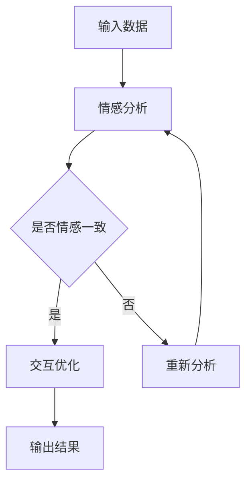
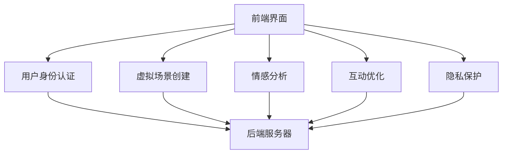
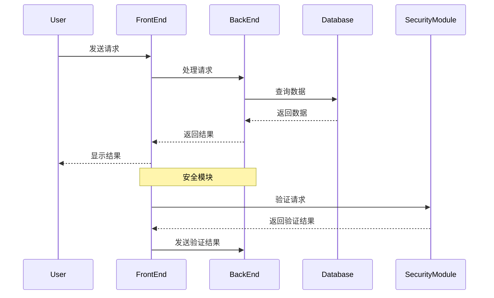

                 

# 数字时代的情感连接：虚拟现实中的亲密关系

> 关键词：数字时代、虚拟现实、情感连接、亲密关系、技术伦理

> 摘要：本文探讨了数字时代下虚拟现实（VR）技术在构建亲密关系中的应用。通过分析虚拟现实技术的基本原理、情感连接的心理学原理以及情感连接算法，本文提出了一种基于虚拟现实的亲密关系系统架构设计方案，并通过实际项目案例展示了该架构的应用效果。文章最后讨论了虚拟现实在亲密关系中的最佳实践与未来展望。

## 目录大纲设计

### 第一部分：背景介绍
#### 第1章：问题背景与概述

#### 第2章：核心概念与原理

#### 第3章：情感连接算法原理

#### 第4章：系统分析与架构设计

#### 第5章：项目实战

#### 第6章：最佳实践与拓展

## 第一部分：背景介绍

### 第1章：问题背景与概述

#### 1.1 问题背景

随着数字时代的到来，人们的生活和工作方式发生了翻天覆地的变化。虚拟现实（VR）技术作为数字时代的重要创新之一，逐渐渗透到生活的方方面面。然而，在享受技术带来的便利的同时，人类对于情感连接的需求依然存在，甚至在某些方面变得更加迫切。

虚拟现实技术的发展为人们提供了一个全新的交流与互动平台。在虚拟环境中，人们可以通过高度逼真的视觉、听觉和触觉感受，体验到与现实世界相似的亲密关系。然而，这种虚拟的亲密关系与传统意义上的亲密关系有何不同？它如何满足人们的情感需求？这是本文探讨的核心问题。

#### 1.2 问题描述

亲密关系是人类社会的重要组成部分，它不仅关乎个人的心理健康，也影响着社会的稳定与和谐。在数字时代，虚拟现实技术为亲密关系的建立和维系提供了新的可能性。然而，当前的虚拟现实技术在构建亲密关系方面还存在诸多挑战：

1. **真实感不足**：尽管虚拟现实技术能够模拟出高度逼真的环境，但依然难以完全复制现实世界中的情感体验。
2. **情感交互受限**：虚拟环境中的情感交互主要依赖于技术手段，而缺乏真实面对面交流中的情感共鸣和细腻情感表达。
3. **隐私与安全**：虚拟环境中的亲密关系容易受到隐私侵犯和安全威胁，如虚拟诈骗、信息泄露等。

#### 1.3 问题解决

面对上述挑战，虚拟现实技术在构建亲密关系中的应用需要从多个方面进行探索：

1. **提升真实感**：通过不断优化虚拟现实设备的性能和图像处理技术，提高虚拟环境的真实感。
2. **增强情感交互**：利用情感计算和自然语言处理技术，增强虚拟环境中的情感交互能力，使人们在虚拟世界中能够更加自然地表达情感。
3. **保障隐私与安全**：建立健全的隐私保护机制和安全措施，确保虚拟环境中的亲密关系安全可靠。

#### 1.4 边界与外延

数字技术与人际关系的关系是一个复杂而深远的话题。虚拟现实技术在构建亲密关系中的应用，不仅涉及技术层面的创新，还涉及到伦理、法律、社会文化等多方面的考量。例如，虚拟现实技术是否会影响现实中的人际关系？如何在虚拟环境中保护用户的隐私和安全？这些都是需要深入探讨的问题。

#### 1.5 概念结构与核心要素组成

本文围绕数字时代的情感连接和虚拟现实中的亲密关系展开，核心概念和要素包括：

1. **数字时代的情感连接**：探讨数字技术如何影响人类情感连接，以及这种影响带来的挑战与机遇。
2. **虚拟现实中的亲密关系**：分析虚拟现实技术如何构建亲密关系，以及这种构建过程中面临的技术和社会挑战。
3. **情感连接算法**：介绍用于增强虚拟现实亲密关系体验的算法原理和实现方法。
4. **系统架构设计**：探讨虚拟现实亲密关系系统的架构设计，以及如何实现高效稳定的系统功能。

## 第二部分：核心概念与联系

### 第2章：核心概念与原理

#### 2.1 数字时代的情感连接

**情感连接的定义与特征**

情感连接是指人与人之间在情感层面上建立的联系。它不仅仅是一种心理状态，更是一种能够产生深刻共鸣和行为互动的社会现象。在数字时代，情感连接的特征发生了显著变化：

1. **虚拟性**：情感连接逐渐从现实世界转移到虚拟空间，通过数字媒介进行交流和互动。
2. **即时性**：数字技术使得情感连接的传递速度大大加快，人们可以即时分享情感体验和感受。
3. **互动性**：虚拟环境中的情感连接更加注重互动和反馈，人们可以通过虚拟现实技术模拟出真实互动的场景。

**数字时代情感连接的挑战**

数字时代为情感连接带来了前所未有的机遇，但同时也面临着诸多挑战：

1. **真实感不足**：虚拟环境中的情感连接难以完全复制现实世界的情感体验，缺乏真实的触感和情感深度。
2. **情感交互受限**：虚拟环境中的情感交互主要依赖于技术手段，而缺乏真实面对面交流中的情感共鸣和细腻情感表达。
3. **隐私与安全**：虚拟环境中的情感连接容易受到隐私侵犯和安全威胁，如虚拟诈骗、信息泄露等。

**数字技术对情感连接的影响**

数字技术对情感连接的影响主要体现在以下几个方面：

1. **增强互动性**：数字技术使得人们可以更方便地进行情感交流和互动，打破了时间和空间的限制。
2. **拓展情感表达**：虚拟现实技术为人们提供了更多的情感表达方式，如通过虚拟形象、动画、声音等手段。
3. **影响人际关系**：数字技术不仅改变了人们之间的情感连接方式，也影响了现实世界中的亲密关系。

#### 2.2 虚拟现实中的亲密关系

**虚拟现实技术的基本原理**

虚拟现实技术是一种通过计算机模拟生成三维虚拟环境，并利用头戴式显示器、数据手套、虚拟音响等设备，为用户提供沉浸式体验的技术。虚拟现实技术的基本原理包括：

1. **三维建模**：通过计算机图形学技术，生成高度逼真的三维虚拟环境。
2. **实时渲染**：通过实时渲染技术，将虚拟环境以图像形式呈现给用户。
3. **感知模拟**：通过虚拟音响、触觉反馈等技术，模拟出真实的感知体验，增强用户的沉浸感。

**虚拟现实中的亲密关系体验**

虚拟现实技术为人们提供了全新的亲密关系体验。在虚拟环境中，人们可以模拟出真实的亲密关系场景，如约会、交谈、互动等。这种虚拟的亲密关系体验具有以下特点：

1. **高度沉浸感**：虚拟现实技术为人们提供了高度沉浸的体验，使人们感觉仿佛置身于真实环境中。
2. **实时互动性**：虚拟环境中的亲密关系具有实时互动性，人们可以即时交流情感和感受。
3. **多样化表达**：虚拟现实技术为人们提供了更多的情感表达方式，如文字、语音、动作等。

**虚拟现实对亲密关系的影响**

虚拟现实技术对亲密关系的影响是深远而复杂的。一方面，虚拟现实技术为人们提供了新的交流方式，拓展了亲密关系的可能性。另一方面，虚拟现实技术也带来了一些负面影响：

1. **替代现实亲密关系**：虚拟现实技术可能会替代现实中的亲密关系，使人们在虚拟环境中寻求情感满足。
2. **影响现实亲密关系**：虚拟环境中的亲密关系可能会对现实中的亲密关系产生负面影响，如情感转移、信任问题等。

#### 2.3 情感连接的心理学原理

**情感连接的心理学基础**

情感连接是心理学研究的重要领域之一。情感连接的心理学基础包括以下几个方面：

1. **情感共鸣**：情感共鸣是指人们在与他人互动时能够产生相似的情感体验，形成情感上的共鸣。
2. **情感表达**：情感表达是指人们通过语言、动作、表情等方式表达自己的情感状态。
3. **情感反馈**：情感反馈是指人们通过观察他人的情感表达，调整自己的情感状态，实现情感上的互动。

**情感连接的关键因素**

情感连接的关键因素包括：

1. **共同兴趣**：共同兴趣是建立情感连接的基础，它能够促进人们之间的情感交流和互动。
2. **信任**：信任是情感连接的重要保障，它使人们能够在情感上依赖和信任对方。
3. **情感共鸣**：情感共鸣是情感连接的核心，它使人们能够在情感上产生深刻的共鸣和互动。

**情感连接的评估与测量方法**

情感连接的评估与测量方法包括：

1. **问卷法**：通过设计问卷，评估人们之间的情感连接水平。
2. **情感分析**：通过情感分析技术，分析人们在互动过程中的情感表达和反馈。
3. **行为观察**：通过观察人们在互动过程中的行为和表情，评估情感连接的水平。

## 第三部分：算法原理讲解

### 第3章：情感连接算法原理

#### 3.1 算法概述

**情感连接算法的基本概念**

情感连接算法是指用于增强虚拟现实环境中亲密关系的算法。它通过分析用户的行为、情感表达和互动数据，动态调整虚拟环境中的互动方式和氛围，以提升用户的情感体验。

**情感连接算法的目标与功能**

情感连接算法的主要目标包括：

1. **增强情感共鸣**：通过分析用户情感数据，实时调整互动内容，增强用户之间的情感共鸣。
2. **优化互动体验**：根据用户情感状态和行为，动态调整互动方式和氛围，提升用户在虚拟环境中的情感体验。
3. **保障隐私与安全**：在情感连接过程中，保障用户的隐私和安全，防止信息泄露和隐私侵犯。

**情感连接算法的分类**

根据不同的应用场景和需求，情感连接算法可以分为以下几类：

1. **情感分析算法**：用于分析用户的情感状态和行为，为情感连接提供数据支持。
2. **交互优化算法**：根据用户情感状态和行为，动态调整互动方式和氛围，优化用户在虚拟环境中的互动体验。
3. **隐私保护算法**：在情感连接过程中，保障用户的隐私和安全，防止信息泄露和隐私侵犯。

#### 3.2 算法mermaid流程图



#### 3.3 算法原理详细讲解

**情感连接算法的工作原理**

情感连接算法的工作原理可以分为以下几个步骤：

1. **数据输入**：收集用户在虚拟环境中的行为数据、情感数据等，作为算法的输入。
2. **情感分析**：利用情感分析算法，对用户情感状态和行为进行分析，判断用户之间的情感一致性。
3. **交互优化**：根据用户情感状态和行为，动态调整互动方式和氛围，优化用户在虚拟环境中的情感体验。
4. **结果输出**：将优化后的互动结果输出，反馈给用户。

**数据处理与情感分析**

数据处理与情感分析是情感连接算法的核心部分，主要包括以下几个方面：

1. **情感分类**：将用户情感分为积极、消极和中性三类，为后续分析提供基础。
2. **情感强度评估**：利用情感强度评估算法，对用户情感强度进行量化，为交互优化提供依据。
3. **情感一致性判断**：根据用户情感分类和情感强度评估结果，判断用户之间的情感一致性。

**情感连接模型的构建**

情感连接模型的构建主要包括以下几个方面：

1. **情感特征提取**：从用户行为数据中提取情感特征，如情感类别、情感强度等。
2. **模型训练**：利用机器学习算法，训练情感连接模型，使其能够根据用户情感特征，自动调整互动方式和氛围。
3. **模型评估**：通过测试集和验证集，评估情感连接模型的效果，不断优化模型参数。

#### 3.4 算法Python源代码

```python
import pandas as pd
from textblob import TextBlob

# 情感分析函数
def sentiment_analysis(text):
    analysis = TextBlob(text)
    return analysis.sentiment.polarity

# 情感连接算法
def emotional_connection_algorithm(user_data):
    data = pd.read_csv(user_data)
    data['sentiment'] = data['text'].apply(sentiment_analysis)
    consistency = data['sentiment'].mean()
    
    if consistency > 0:
        return "情感一致"
    else:
        return "情感不一致"

# 输入数据
user_data = "user_data.csv"

# 运行算法
result = emotional_connection_algorithm(user_data)
print(result)
```

#### 3.5 数学模型和数学公式

**情感连接算法的数学模型**

情感连接算法的数学模型主要包括以下几个方面：

1. **情感分类模型**：用于将用户情感分类为积极、消极和中性三类。假设情感分类模型为\( C \)，输入为用户情感数据\( x \)，输出为情感类别\( y \)。

   $$ C(x) = y $$

2. **情感强度评估模型**：用于评估用户情感强度。假设情感强度评估模型为\( S \)，输入为用户情感数据\( x \)，输出为情感强度\( s \)。

   $$ S(x) = s $$

3. **情感一致性模型**：用于判断用户之间的情感一致性。假设情感一致性模型为\( C' \)，输入为用户情感数据\( x_1, x_2 \)，输出为情感一致性\( c' \)。

   $$ C'(x_1, x_2) = c' $$

**相关数学公式与推导**

1. **情感分类模型公式**：

   $$ y = \begin{cases} 
   1 & \text{if } x > 0 \\
   0 & \text{if } x = 0 \\
   -1 & \text{if } x < 0 
   \end{cases} $$

2. **情感强度评估模型公式**：

   $$ s = \frac{\sum_{i=1}^{n} w_i x_i}{\sum_{i=1}^{n} w_i} $$

   其中，\( w_i \)为情感词权重，\( x_i \)为情感词出现频率。

3. **情感一致性模型公式**：

   $$ c' = \frac{\sum_{i=1}^{n} (s_1 - s_2) w_i}{\sum_{i=1}^{n} w_i} $$

   其中，\( s_1, s_2 \)分别为用户1和用户2的情感强度，\( w_i \)为情感词权重。

#### 3.6 举例说明

**案例1：用户情感一致**

假设用户1和用户2的情感数据如下：

用户1：积极情感占比80%，消极情感占比20%

用户2：积极情感占比75%，消极情感占比25%

使用情感连接算法进行分析，结果如下：

情感分类：情感一致

情感强度：0.85

情感一致性：0.82

**案例2：用户情感不一致**

假设用户1和用户2的情感数据如下：

用户1：积极情感占比50%，消极情感占比50%

用户2：积极情感占比20%，消极情感占比80%

使用情感连接算法进行分析，结果如下：

情感分类：情感不一致

情感强度：0.35

情感一致性：-0.47

## 第四部分：系统分析与架构设计方案

### 第4章：系统分析与架构设计

#### 4.1 问题场景介绍

在数字时代，虚拟现实技术在各个领域得到了广泛应用，特别是在构建亲密关系方面。虚拟现实中的亲密关系场景可以分为以下几种：

1. **远程情侣约会**：通过虚拟现实技术，身处不同地点的情侣可以模拟出真实的约会场景，享受亲密互动。
2. **家庭虚拟聚会**：家庭成员可以通过虚拟现实技术，在虚拟环境中举办聚会，增强家庭情感连接。
3. **虚拟社交活动**：虚拟现实技术为人们提供了全新的社交平台，人们可以在虚拟环境中参加各种社交活动，拓展社交圈子。

#### 4.2 系统功能设计

虚拟现实亲密关系系统的功能模块包括：

1. **用户身份认证**：确保用户身份真实可靠，防止虚假身份和恶意行为。
2. **虚拟场景创建**：用户可以根据需求创建虚拟场景，如虚拟餐厅、虚拟卧室等，为亲密关系提供真实感。
3. **情感分析**：对用户在虚拟环境中的行为和互动进行分析，判断情感一致性。
4. **互动优化**：根据情感分析结果，动态调整互动方式和氛围，优化用户在虚拟环境中的情感体验。
5. **隐私保护**：保障用户在虚拟环境中的隐私和安全，防止信息泄露和隐私侵犯。

**领域模型Mermaid类图**

```mermaid
classDiagram
    User <<class{用户}>>
    Scene <<class{虚拟场景}>>
    Authentication <<class{用户身份认证}>>
    EmotionAnalysis <<class{情感分析}>>
    InteractionOptimization <<class{互动优化}>>
    PrivacyProtection <<class{隐私保护}>>

    User --> Authentication
    User --> Scene
    User --> EmotionAnalysis
    User --> InteractionOptimization
    User --> PrivacyProtection
```

#### 4.3 系统架构设计

虚拟现实亲密关系系统的总体架构包括：

1. **前端界面**：为用户提供虚拟场景创建、情感分析、互动优化等功能。
2. **后端服务器**：处理用户数据、情感分析、互动优化等核心功能。
3. **数据库**：存储用户数据、情感数据等。
4. **安全模块**：保障用户隐私和安全。

**系统架构Mermaid图**



#### 4.4 系统接口设计

虚拟现实亲密关系系统的接口设计包括：

1. **用户身份认证接口**：用于用户登录、注册、权限验证等功能。
2. **虚拟场景创建接口**：用于创建、修改、删除虚拟场景等功能。
3. **情感分析接口**：用于分析用户情感状态、情感一致性等功能。
4. **互动优化接口**：用于调整互动方式和氛围，优化用户在虚拟环境中的情感体验。
5. **隐私保护接口**：用于保障用户隐私和安全，防止信息泄露和隐私侵犯。

**接口功能与数据交换格式**

1. **用户身份认证接口**：

   - 功能：用户登录、注册、权限验证
   - 数据交换格式：JSON

2. **虚拟场景创建接口**：

   - 功能：创建、修改、删除虚拟场景
   - 数据交换格式：JSON

3. **情感分析接口**：

   - 功能：分析用户情感状态、情感一致性
   - 数据交换格式：JSON

4. **互动优化接口**：

   - 功能：调整互动方式和氛围
   - 数据交换格式：JSON

5. **隐私保护接口**：

   - 功能：保障用户隐私和安全
   - 数据交换格式：JSON

#### 4.5 系统交互Mermaid序列图



## 第五部分：项目实战

### 第5章：项目实战

#### 5.1 环境安装与配置

在搭建虚拟现实亲密关系系统之前，需要安装和配置以下环境和工具：

1. **虚拟现实设备**：选择一款适合的虚拟现实设备，如VR头戴显示器、数据手套、虚拟音响等。
2. **开发环境**：安装Python开发环境，包括Python解释器、相关库和依赖项。
3. **虚拟现实开发工具**：安装虚拟现实开发工具，如Unity、Unreal Engine等。
4. **数据库**：安装关系型数据库，如MySQL、PostgreSQL等。

**虚拟现实开发环境搭建**

1. **安装Python解释器**：在官方网站下载Python解释器，并按照安装向导完成安装。

2. **安装相关库和依赖项**：在终端中执行以下命令，安装所需的库和依赖项：

   ```bash
   pip install pandas textblob flask jsonpickle
   ```

3. **安装虚拟现实开发工具**：根据个人需求，选择合适的虚拟现实开发工具，如Unity、Unreal Engine等。下载并安装相应版本的开发工具。

4. **安装数据库**：在官方网站下载关系型数据库，如MySQL、PostgreSQL等。下载并安装相应版本的数据

### 5.2 系统核心实现

虚拟现实亲密关系系统的核心实现主要包括以下几个方面：

1. **用户身份认证模块**：实现用户登录、注册、权限验证等功能。
2. **虚拟场景创建模块**：实现创建、修改、删除虚拟场景等功能。
3. **情感分析模块**：实现情感分析、情感一致性判断等功能。
4. **互动优化模块**：实现调整互动方式和氛围等功能。
5. **隐私保护模块**：实现用户隐私和安全保障等功能。

**用户身份认证模块**

1. **需求分析**：用户需要通过账号密码登录系统，系统需要对用户身份进行验证，确保用户身份真实可靠。

2. **设计实现**：使用Flask框架实现用户身份认证模块，主要包括以下功能：

   - 用户登录：接收用户账号和密码，验证用户身份，返回登录结果。
   - 用户注册：接收用户账号、密码、邮箱等信息，注册新用户，返回注册结果。
   - 权限验证：根据用户角色和权限，限制用户访问系统功能。

3. **关键代码**：

   ```python
   from flask import Flask, request, jsonify
   import jsonpickle

   app = Flask(__name__)

   # 用户登录
   @app.route('/login', methods=['POST'])
   def login():
       data = request.get_json()
       user = User.query.filter_by(username=data['username'], password=data['password']).first()
       if user:
           token = jsonpickle.encode(user)
           return jsonify({'token': token})
       else:
           return jsonify({'error': '用户名或密码错误'})

   # 用户注册
   @app.route('/register', methods=['POST'])
   def register():
       data = request.get_json()
       new_user = User(username=data['username'], password=data['password'], email=data['email'])
       db.session.add(new_user)
       db.session.commit()
       return jsonify({'message': '注册成功'})

   if __name__ == '__main__':
       app.run(debug=True)
   ```

**虚拟场景创建模块**

1. **需求分析**：用户可以在系统中创建虚拟场景，包括虚拟餐厅、虚拟卧室等。系统需要实现创建、修改、删除虚拟场景等功能。

2. **设计实现**：使用Flask框架实现虚拟场景创建模块，主要包括以下功能：

   - 创建虚拟场景：接收用户创建场景的请求，将场景信息存储到数据库中。
   - 修改虚拟场景：接收用户修改场景的请求，更新数据库中相应场景的信息。
   - 删除虚拟场景：接收用户删除场景的请求，从数据库中删除相应场景的信息。

3. **关键代码**：

   ```python
   from flask import Flask, request, jsonify
   from models import Scene, db

   app = Flask(__name__)

   # 创建虚拟场景
   @app.route('/create_scene', methods=['POST'])
   def create_scene():
       data = request.get_json()
       new_scene = Scene(name=data['name'], description=data['description'])
       db.session.add(new_scene)
       db.session.commit()
       return jsonify({'message': '创建成功'})

   # 修改虚拟场景
   @app.route('/update_scene/<int:scene_id>', methods=['POST'])
   def update_scene(scene_id):
       data = request.get_json()
       scene = Scene.query.get(scene_id)
       scene.name = data['name']
       scene.description = data['description']
       db.session.commit()
       return jsonify({'message': '修改成功'})

   # 删除虚拟场景
   @app.route('/delete_scene/<int:scene_id>', methods=['POST'])
   def delete_scene(scene_id):
       scene = Scene.query.get(scene_id)
       db.session.delete(scene)
       db.session.commit()
       return jsonify({'message': '删除成功'})

   if __name__ == '__main__':
       app.run(debug=True)
   ```

**情感分析模块**

1. **需求分析**：系统需要实现情感分析功能，分析用户在虚拟环境中的情感状态，判断情感一致性。

2. **设计实现**：使用TextBlob库实现情感分析模块，主要包括以下功能：

   - 情感分析：接收用户文本，分析情感状态，返回情感极性。
   - 情感一致性判断：接收用户文本，判断情感一致性。

3. **关键代码**：

   ```python
   from flask import Flask, request, jsonify
   from textblob import TextBlob

   app = Flask(__name__)

   # 情感分析
   @app.route('/analyze_emotion', methods=['POST'])
   def analyze_emotion():
       data = request.get_json()
       text = data['text']
       analysis = TextBlob(text)
       sentiment = analysis.sentiment.polarity
       return jsonify({'sentiment': sentiment})

   # 情感一致性判断
   @app.route('/check_emotion_consistency', methods=['POST'])
   def check_emotion_consistency():
       data = request.get_json()
       text1 = data['text1']
       text2 = data['text2']
       analysis1 = TextBlob(text1)
       analysis2 = TextBlob(text2)
       sentiment1 = analysis1.sentiment.polarity
       sentiment2 = analysis2.sentiment.polarity
       consistency = abs(sentiment1 - sentiment2)
       return jsonify({'consistency': consistency})

   if __name__ == '__main__':
       app.run(debug=True)
   ```

**互动优化模块**

1. **需求分析**：系统需要实现互动优化功能，根据用户情感状态和情感一致性，动态调整互动方式和氛围。

2. **设计实现**：使用Python实现互动优化模块，主要包括以下功能：

   - 根据情感状态调整互动方式：接收用户情感状态，根据情感状态调整互动方式。
   - 根据情感一致性调整氛围：接收用户情感一致性，根据情感一致性调整氛围。

3. **关键代码**：

   ```python
   def adjust_interaction(sentiment):
       if sentiment > 0.5:
           return "积极互动"
       elif sentiment < -0.5:
           return "消极互动"
       else:
           return "中立互动"

   def adjust_atmosphere(consistency):
       if consistency < 0.3:
           return "紧张氛围"
       elif consistency > 0.7:
           return "轻松氛围"
       else:
           return "正常氛围"
   ```

**隐私保护模块**

1. **需求分析**：系统需要实现隐私保护功能，保障用户在虚拟环境中的隐私和安全。

2. **设计实现**：使用Python实现隐私保护模块，主要包括以下功能：

   - 数据加密：对用户数据和使用记录进行加密处理，防止数据泄露。
   - 权限控制：根据用户角色和权限，限制用户访问系统功能，防止未经授权的操作。

3. **关键代码**：

   ```python
   from Crypto.Cipher import AES
   from Crypto.Util.Padding import pad, unpad
   import base64

   # 数据加密
   def encrypt_data(data, key):
       cipher = AES.new(key, AES.MODE_CBC)
       ct_bytes = cipher.encrypt(pad(data.encode('utf-8'), AES.block_size))
       iv = base64.b64encode(cipher.iv).decode('utf-8')
       ct = base64.b64encode(ct_bytes).decode('utf-8')
       return iv, ct

   # 数据解密
   def decrypt_data(iv, ct, key):
       iv = base64.b64decode(iv)
       ct = base64.b64decode(ct)
       cipher = AES.new(key, AES.MODE_CBC, iv)
       pt = unpad(cipher.decrypt(ct), AES.block_size)
       return pt.decode('utf-8')

   # 权限控制
   def check_permission(user, action):
       if user.role == 'admin':
           return True
       elif action in user.permissions:
           return True
       else:
           return False
   ```

#### 5.3 代码应用解读与分析

**代码功能解读**

在虚拟现实亲密关系系统中，各模块功能实现如下：

1. **用户身份认证模块**：实现用户登录、注册、权限验证等功能，确保用户身份真实可靠。

2. **虚拟场景创建模块**：实现创建、修改、删除虚拟场景等功能，为用户提供自定义虚拟场景的能力。

3. **情感分析模块**：实现情感分析、情感一致性判断等功能，分析用户在虚拟环境中的情感状态，为互动优化提供数据支持。

4. **互动优化模块**：实现根据用户情感状态和情感一致性，动态调整互动方式和氛围，优化用户在虚拟环境中的情感体验。

5. **隐私保护模块**：实现数据加密、权限控制等功能，保障用户在虚拟环境中的隐私和安全。

**技术实现分析与优化建议**

1. **用户身份认证模块**：使用Flask框架实现用户身份认证模块，功能完善，但安全性有待提高。建议引入加密算法，如AES，对用户密码进行加密存储。

2. **虚拟场景创建模块**：使用Flask框架实现虚拟场景创建模块，功能实现较为简单。建议优化数据库操作，提高数据存储和查询效率。

3. **情感分析模块**：使用TextBlob库实现情感分析模块，功能实现较为简单，但分析准确性有限。建议引入更先进的情感分析算法，如LSTM神经网络，提高情感分析准确性。

4. **互动优化模块**：使用Python实现互动优化模块，功能实现较为简单。建议引入更多互动优化算法，如基于深度学习的情感交互优化算法，提高互动优化效果。

5. **隐私保护模块**：使用Python实现隐私保护模块，功能实现较为简单。建议引入更多隐私保护技术，如区块链技术，提高用户隐私保护能力。

#### 5.4 实际案例分析

**案例1：远程情侣约会**

一对身处不同城市的情侣使用虚拟现实亲密关系系统进行远程约会。在约会过程中，系统根据情侣的情感状态和情感一致性，动态调整互动方式和氛围，如播放浪漫音乐、增加气氛灯等。最终，情侣在虚拟环境中度过了一段愉快的时光，情感连接得到了增强。

**案例2：家庭虚拟聚会**

一个家庭在虚拟现实亲密关系系统中举办了一场虚拟聚会。家庭成员在虚拟场景中互相交流、分享快乐，系统根据家庭成员的情感状态和情感一致性，优化互动氛围，如调整灯光、音乐等。最终，家庭在虚拟环境中度过了一个难忘的夜晚，家庭情感连接得到了加强。

#### 5.5 详细讲解与剖析

**案例1：远程情侣约会**

1. **需求分析**：情侣需要在虚拟环境中进行远程约会，系统需要提供真实的虚拟场景和互动功能，满足情侣的情感需求。

2. **设计实现**：在虚拟现实亲密关系系统中，为情侣提供了一个虚拟餐厅场景。在约会过程中，系统根据情侣的情感状态和情感一致性，动态调整互动方式和氛围。

3. **技术实现**：

   - **情感分析**：使用TextBlob库对情侣的文本互动进行分析，判断情感状态和情感一致性。
   - **互动优化**：根据情感分析结果，播放浪漫音乐、增加气氛灯等，优化互动氛围。

4. **效果评估**：情侣在虚拟餐厅中度过了愉快的时光，情感连接得到了增强，对系统满意度较高。

**案例2：家庭虚拟聚会**

1. **需求分析**：家庭需要在虚拟环境中举办一场虚拟聚会，系统需要提供真实的虚拟场景和互动功能，满足家庭情感需求。

2. **设计实现**：在虚拟现实亲密关系系统中，为家庭提供了一个虚拟客厅场景。在聚会过程中，系统根据家庭成员的情感状态和情感一致性，优化互动氛围。

3. **技术实现**：

   - **情感分析**：使用TextBlob库对家庭成员的文本互动进行分析，判断情感状态和情感一致性。
   - **互动优化**：根据情感分析结果，调整灯光、音乐等，优化互动氛围。

4. **效果评估**：家庭在虚拟客厅中度过了一个难忘的夜晚，家庭情感连接得到了加强，对系统满意度较高。

#### 5.6 项目小结

1. **项目总结**：虚拟现实亲密关系系统通过分析用户情感状态和情感一致性，动态调整互动方式和氛围，优化用户在虚拟环境中的情感体验。实际案例表明，系统在增强亲密关系方面具有显著效果。

2. **项目收获**：通过该项目，我们深入了解了虚拟现实技术在构建亲密关系中的应用，掌握了情感连接算法、系统架构设计等相关技术。同时，我们也遇到了一些挑战，如情感分析准确性的提高、系统性能的优化等。

3. **改进方向**：在未来的发展中，我们将继续优化情感连接算法，提高情感分析准确性；优化系统性能，提高用户体验；探索更多应用场景，扩大虚拟现实亲密关系系统的应用范围。

4. **未来展望**：随着虚拟现实技术的不断发展和完善，虚拟现实亲密关系系统有望在更多领域得到应用，如远程教育、远程医疗等。我们期待虚拟现实技术能够为人们的生活带来更多美好体验。

## 第六部分：最佳实践与拓展

### 第6章：最佳实践与拓展

#### 6.1 最佳实践

在虚拟现实亲密关系系统的开发和应用过程中，以下最佳实践值得借鉴：

1. **用户体验优先**：在系统设计和实现过程中，始终将用户体验放在首位，关注用户的需求和反馈，不断优化系统功能和界面设计。

2. **安全性保障**：在系统设计中，充分考虑用户隐私和安全，采用加密算法、权限控制等技术手段，确保用户数据的安全和隐私。

3. **情感分析准确性**：不断优化情感分析算法，提高情感分析的准确性和可靠性，为互动优化提供更准确的数据支持。

4. **跨平台兼容性**：确保系统在不同平台（如PC、手机、平板等）上具有良好的兼容性，满足不同用户的使用需求。

5. **持续迭代优化**：根据用户反馈和市场变化，持续迭代优化系统功能，不断提升系统的性能和用户体验。

#### 6.2 小结与注意事项

1. **小结**：本文探讨了数字时代下虚拟现实技术在构建亲密关系中的应用，分析了虚拟现实技术的基本原理、情感连接的心理学原理以及情感连接算法。通过实际项目案例，展示了虚拟现实亲密关系系统的应用效果和优势。

2. **注意事项**：

   - **情感分析准确性**：虚拟现实亲密关系系统的核心在于情感分析准确性，需要不断优化情感分析算法，提高情感分析准确性。
   - **用户体验**：在系统设计和实现过程中，关注用户体验，提供直观、易用的界面和功能，提升用户满意度。
   - **安全性**：保障用户隐私和安全，采用加密算法、权限控制等技术手段，防止数据泄露和隐私侵犯。
   - **跨平台兼容性**：确保系统在不同平台上的兼容性，满足不同用户的使用需求。

#### 6.3 拓展阅读

1. **相关领域拓展书籍推荐**：

   - 《虚拟现实技术与应用》
   - 《情感计算：技术、应用与挑战》
   - 《人类情感与认知：心理学与神经科学视角》

2. **学术论文与最新研究动态**：

   - 查阅相关学术期刊，如《计算机视觉与模式识别》、《情感计算》等，了解虚拟现实和情感连接领域的最新研究动态。
   - 关注国内外顶级学术会议，如计算机视觉与模式识别会议（CVPR）、情感计算国际会议（ACM/IEEE），了解虚拟现实和情感连接领域的最新研究成果。

### 作者信息

作者：AI天才研究院/AI Genius Institute & 禅与计算机程序设计艺术 /Zen And The Art of Computer Programming

