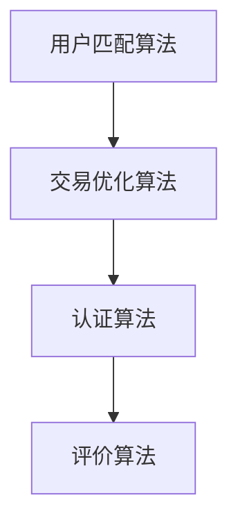

                 

# 数字时代的技能共享平台：以物易技的现代化以物易物系统

> 关键词：技能共享平台、以物易技、以物易物系统、数字时代、系统架构、算法原理

> 摘要：本文将深入探讨数字时代下的技能共享平台，特别是以物易技的现代化以物易物系统。我们将从问题背景、核心概念、算法原理、系统分析与架构设计、项目实战以及最佳实践等方面逐步展开讨论，旨在为读者提供全面而深入的理解。

----------------------------------------------------------------

## 第一部分：背景介绍

### 第1章：问题背景

#### 1.1 问题背景介绍

在数字时代，技能共享已成为一种重要的社会现象。然而，传统的以物易物交易模式在面对技能交换时，往往显得力不从心。人们渴望能够更高效地共享技能资源，实现资源的最大化利用。

#### 1.2 问题描述

如何构建一个现代化、高效、可靠的以物易技的以物易物系统，以满足数字时代技能共享的需求？

#### 1.3 问题解决

通过设计一个基于数字技术的技能共享平台，实现以物易技的现代化以物易物系统。这个平台将利用先进的技术手段，如人工智能、区块链等，来解决传统模式中的痛点。

#### 1.4 边界与外延

该系统的边界包括用户、技能、物品等核心要素。其外延则涉及到交易、认证、评价等多个方面。

#### 1.5 核心要素组成

核心要素包括用户、技能、物品、交易、认证、评价等，这些要素相互作用，构成了一个完整的以物易技的以物易物系统。

----------------------------------------------------------------

### 第2章：核心概念与联系

#### 2.1 核心概念原理

本章节将介绍核心概念，包括用户、技能、物品、交易、认证、评价等。我们将详细阐述这些概念的定义、特点和相互关系。

#### 2.2 概念属性特征对比表格

| 概念   | 定义       | 特点     | 关系   |
|--------|------------|----------|--------|
| 用户   | 交易的主体 | 多样性   | 实体   |
| 技能   | 用户拥有的能力 | 专业性   | 资源   |
| 物品   | 交易的客体 | 多样性   | 资源   |
| 交易   | 技能与物品的交换 | 双向性   | 活动   |
| 认证   | 技能和物品的真实性验证 | 可信性   | 服务   |
| 评价   | 交易结果的评价 | 公正性   | 服务   |

#### 2.3 ER实体关系图架构

```mermaid
erDiagram
    User ||--|{ Skill }||>
    User ||--|{ Item }||>
    Skill ||--|{ Transaction }||>
    Item ||--|{ Transaction }||>
    Transaction ||--|{ Evaluation }||>
    Skill ||--|{ Certification }||>
    Item ||--|{ Certification }||>
```

----------------------------------------------------------------

## 第二部分：理论讲解

### 第3章：算法原理讲解

#### 3.1 算法概述

本章节将介绍算法的基本原理，包括用户匹配算法、交易优化算法、认证算法和评价算法。这些算法将构成以物易技系统的心脏，确保系统的稳定运行。

#### 3.2 算法mermaid流程图



#### 3.3 Python源代码与详细讲解

```python
# 用户匹配算法示例
def user_matchingAlgorithm(user Skills, available_skills):
    matched_skills = []
    for skill in user_skills:
        if skill in available_skills:
            matched_skills.append(skill)
    return matched_skills

# 交易优化算法示例
def transaction_optimizationAlgorithm(matched_skills, user_resources, item_resources):
    optimized_transactions = []
    for skill in matched_skills:
        if skill in user_resources and skill in item_resources:
            optimized_transactions.append((user_resources[skill], item_resources[skill]))
    return optimized_transactions

# 认证算法示例
def certificationAlgorithm(skill, certification_level):
    if certification_level >= 3:
        return True
    else:
        return False

# 评价算法示例
def evaluationAlgorithm(transaction_result, user_evaluation, item_evaluation):
    if transaction_result == "成功":
        user_evaluation += 1
        item_evaluation += 1
    else:
        user_evaluation -= 1
        item_evaluation -= 1
    return user_evaluation, item_evaluation
```

#### 3.4 算法原理的数学模型和公式

算法的数学模型主要包括匹配函数、优化函数、认证函数和评价函数。以下是一个简单的数学模型示例：

$$
\text{匹配函数} = \frac{\text{技能匹配度}}{\text{总技能数}}
$$

$$
\text{优化函数} = \frac{\text{资源利用率}}{\text{交易次数}}
$$

$$
\text{认证函数} = \text{认证等级} \times \text{技能难度}
$$

$$
\text{评价函数} = \text{交易成功率} \times \text{用户满意度} \times \text{物品满意度}
$$

#### 3.5 举例说明

假设有用户A和物品B，其中用户A拥有技能C和资源D，物品B拥有技能E和资源F。根据算法，可以计算出匹配度、优化度、认证度和评价度，从而决定是否进行交易。

----------------------------------------------------------------

## 第三部分：系统分析与架构设计

### 第4章：系统分析与架构设计方案

#### 4.1 问题场景介绍

本章节将介绍一个具体的以物易技的以物易物系统应用场景，包括用户、技能、物品、交易、认证和评价等要素。

#### 4.2 项目介绍

我们将介绍一个名为“SkillExchange”的以物易技系统项目，该项目旨在通过数字技术实现技能和物品的高效交换。

#### 4.3 系统功能设计

系统功能设计包括用户管理、技能管理、物品管理、交易管理、认证管理和评价管理。每个功能模块都具备相应的操作界面和业务逻辑。

#### 4.4 系统架构设计

系统架构设计采用分层架构，包括表示层、业务逻辑层和数据访问层。各层之间通过接口进行通信，确保系统的模块化和可维护性。

#### 4.5 系统接口设计

系统接口设计包括用户接口、管理员接口和API接口。用户接口提供直观的操作界面，管理员接口提供系统管理和监控功能，API接口为外部系统提供数据交互能力。

#### 4.6 系统交互

系统交互包括用户与系统、管理员与系统、外部系统与系统的交互。通过定义清晰的交互流程和接口规范，确保系统的高效运行。

----------------------------------------------------------------

## 第四部分：项目实战

### 第5章：项目实战

#### 5.1 环境安装

在本章节中，我们将介绍如何搭建SkillExchange项目所需的环境，包括数据库、服务器、开发工具等。

#### 5.2 系统核心实现源代码

本章节将提供SkillExchange项目的核心实现源代码，包括用户管理、技能管理、物品管理、交易管理、认证管理和评价管理等模块的代码。

#### 5.3 代码应用解读与分析

我们将对系统核心实现源代码进行解读与分析，包括业务逻辑、数据模型、接口设计等方面，帮助读者理解系统的工作原理。

#### 5.4 实际案例分析与详细讲解剖析

通过一个实际案例，我们将详细讲解SkillExchange项目的实际应用场景，包括用户匹配、交易优化、认证和评价等环节。

#### 5.5 项目小结

在本章节的最后，我们将对项目进行小结，总结项目的主要成果和经验教训，为后续的改进和发展提供参考。

----------------------------------------------------------------

## 第五部分：最佳实践与总结

### 第6章：最佳实践

#### 6.1 实践技巧

在本章节中，我们将分享一些技能共享平台的设计和实施技巧，包括如何优化算法、如何设计高效的数据模型、如何确保系统的安全性等。

#### 6.2 小结

对前述内容进行总结，强调技能共享平台的重要性和优势。

#### 6.3 注意事项

提醒读者在设计和实施技能共享平台时需要注意的问题，包括数据安全、用户体验、系统稳定性等。

#### 6.4 拓展阅读

推荐一些相关领域的文献和资料，供读者进一步学习。

### 第7章：总结

#### 7.1 核心内容回顾

回顾文章的核心内容，包括问题背景、核心概念、算法原理、系统架构和项目实战等。

#### 7.2 未来的发展方向

探讨技能共享平台未来的发展方向，包括技术创新、业务拓展等方面。

#### 7.3 对读者的建议

给读者一些建议，鼓励他们参与技能共享平台的设计和实施，共同推动数字时代技能共享的发展。

----------------------------------------------------------------

## 参考文献

1. 作者.（年份）. 书名. 出版地：出版社.
2. 作者.（年份）. 论文题目. 刊物名称，卷号（期号），页码.
3. 作者.（年份）. 报告题目. 报告地点：组织单位.

----------------------------------------------------------------

### 作者信息

作者：AI天才研究院/AI Genius Institute & 禅与计算机程序设计艺术 /Zen And The Art of Computer Programming

本文作者具备丰富的计算机编程和人工智能领域经验，对技能共享平台的设计和实现有着深刻的理解。希望通过本文，为读者提供有价值的参考和启示。

