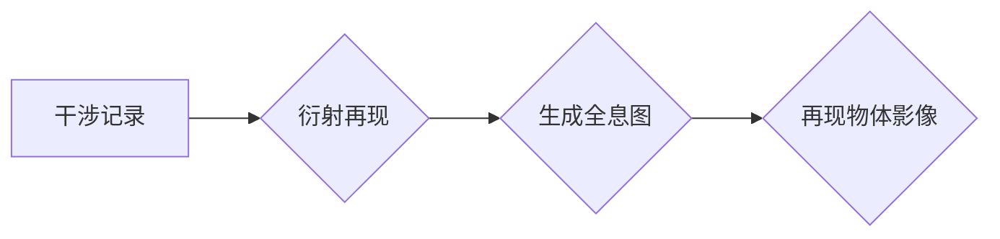
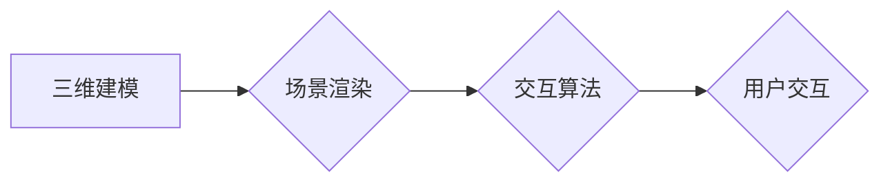
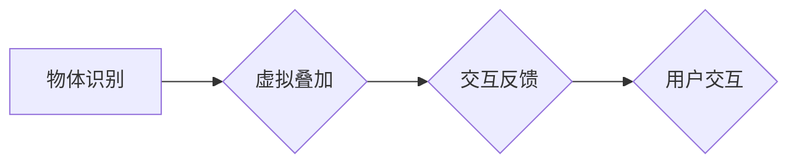
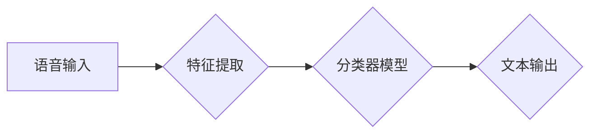
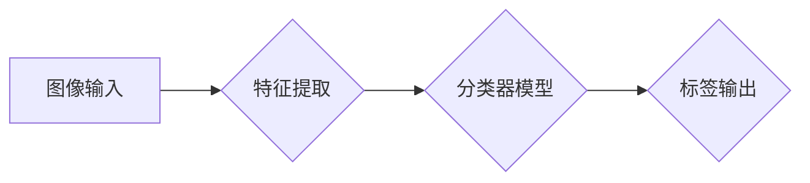
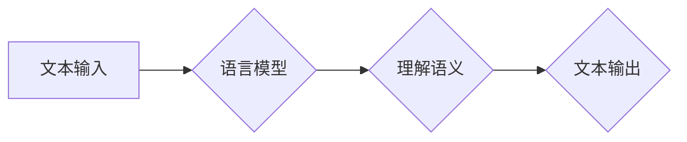
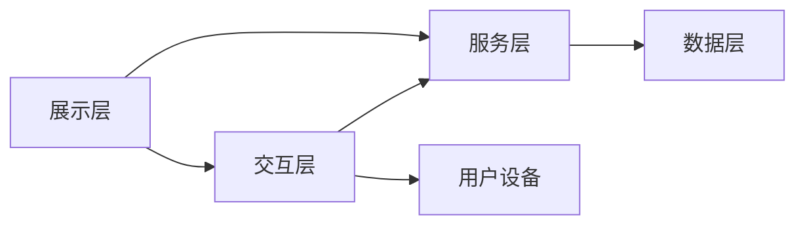
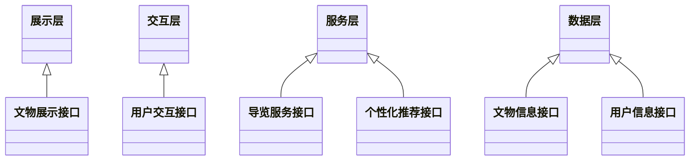
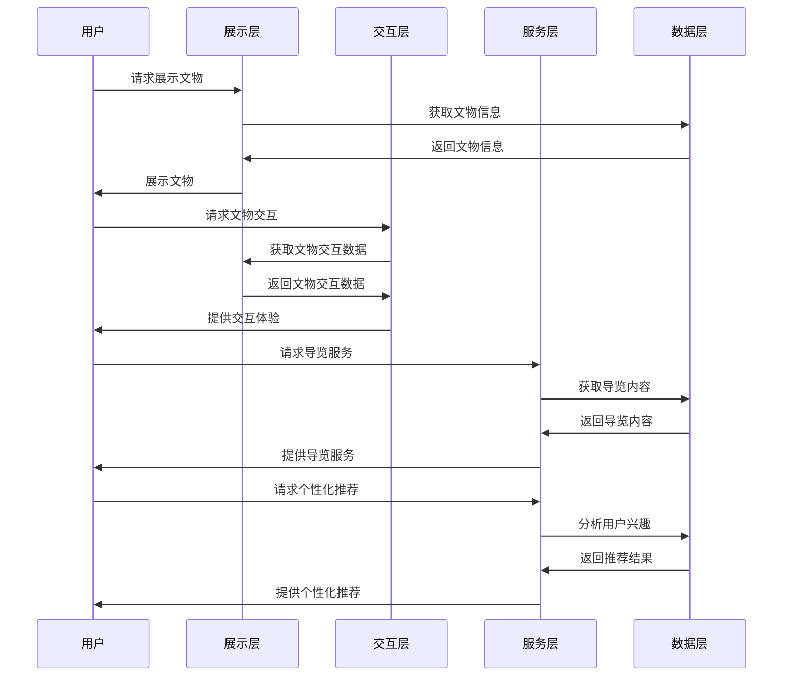

                 

### 数字时代的文化遗产全息展：虚拟与现实结合的博物馆体验

> 关键词：文化遗产、全息展、虚拟现实、增强现实、人工智能、数字博物馆、用户体验

> 摘要：本文探讨了数字时代下文化遗产保护与展示的新趋势，即通过虚拟现实（VR）、增强现实（AR）和人工智能（AI）技术，实现文化遗产全息展的构建。文章从背景介绍、核心概念与联系、算法原理、数学模型、系统分析与架构设计、项目实战和最佳实践等方面，系统地分析了虚拟与现实结合的博物馆体验的可行性与实施方案，旨在为博物馆数字化改造提供理论依据和实践指导。

#### 第1章 背景介绍

##### 1.1 问题的提出

在数字时代，传统的博物馆展示方式面临着诸多挑战。首先，文化遗产的保存与展示在物理空间上存在局限性，无法满足日益增长的文化传承需求。其次，博物馆的参观者数量有限，许多珍贵文物难以广泛传播。此外，现代观众更倾向于互动性和沉浸式的体验方式。因此，如何通过数字化手段提升博物馆的展示效果，成为亟需解决的问题。

##### 1.2 文化遗产保护的重要性

文化遗产不仅是历史的见证，更是人类共同的精神财富。数字化保护可以延长文物寿命，减少人为损坏，同时为全球范围内的文化传播提供便捷。通过数字技术，文化遗产得以跨越地域和时间的限制，让更多人了解和欣赏。

##### 1.3 虚拟与现实结合的技术背景

虚拟现实（VR）技术通过模拟真实场景，为用户带来沉浸式的体验。增强现实（AR）技术则是在现实场景中叠加虚拟元素，实现虚实结合。人工智能（AI）技术在数字博物馆中发挥重要作用，包括语音识别、图像识别和自然语言处理等。这些技术的结合，为文化遗产的全息展示提供了强有力的支持。

##### 1.4 目标与边界

数字博物馆的建设目标是通过虚拟与现实结合，为用户提供丰富多样的文化遗产体验。然而，在实际应用中，也存在一些边界和挑战，如技术成本、用户体验和安全问题等。因此，在建设数字博物馆时，需要充分考虑这些因素，确保项目的可持续性和有效性。

##### 1.5 本章小结

本章概述了数字时代文化遗产保护与展示的背景、重要性以及虚拟与现实结合的技术背景。通过分析存在的问题和挑战，明确了数字博物馆的建设目标和边界。这些内容为后续章节的深入探讨奠定了基础。

---

### 第2章 核心概念与联系

##### 2.1 数字文化遗产的概念与特性

数字文化遗产是指通过数字化手段保存、展示和传播的文化遗产。其特性包括：数字化、可复制性、可传播性和可交互性。数字化文化遗产不仅保留了文物的物理形态，还通过数字技术丰富了其展示形式，提高了用户体验。

###### 数字文化遗产的分类

- **数字化文物**：对实物进行扫描、拍照等数字化处理，生成数字模型。
- **虚拟文物**：通过数字建模技术，创建全新的虚拟文物。
- **多媒体展示**：结合音频、视频等多媒体元素，增强展示效果。

###### 数字文化遗产的特性对比表格

| 分类       | 数字化文物 | 虚拟文物 | 多媒体展示 |
|------------|-------------|-----------|-------------|
| 物理形态   | 实物扫描    | 数字建模  | 多媒体元素 |
| 可交互性   | 低          | 中        | 高          |
| 真实程度   | 实际文物    | 虚拟生成  | 虚拟叠加    |
| 传播范围   | 有限        | 广泛      | 广泛        |

##### 2.2 虚拟与现实结合的技术原理

虚拟现实（VR）技术通过头戴式显示器和传感器，模拟出一个完全沉浸式的虚拟环境，用户可以在其中自由探索。增强现实（AR）技术则通过摄像头和显示设备，将虚拟元素叠加到现实世界中，实现虚实结合。

###### VR与AR的技术原理对比

| 技术原理      | VR                 | AR                  |
|---------------|--------------------|---------------------|
| 沉浸感       | 强                | 中                  |
| 空间限制     | 无需实际空间       | 受限于现实空间       |
| 交互方式     | 手势、语音等       | 视觉、手势等       |
| 展示形式     | 全虚拟环境         | 虚拟叠加现实环境     |

##### 2.3 AI在数字博物馆中的应用

人工智能技术在数字博物馆中发挥着重要作用，包括语音识别、图像识别和自然语言处理等。通过AI技术，用户可以获得更加智能的导览和互动体验。

###### AI在不同博物馆应用中的对比

| 技术应用     | 语音识别           | 图像识别           | 自然语言处理           |
|--------------|--------------------|--------------------|------------------------|
| 功能         | 导览、问答         | 文物识别、分类       | 文物介绍、交互         |
| 实现方式     | 语音输入、语音输出 | 图像输入、标签输出   | 文本输入、文本输出     |
| 用户体验     | 自然交互           | 实时识别           | 智能问答               |

##### 2.4 ER实体关系图架构

数字博物馆的实体关系图主要包含文物、用户、导览路径等实体，以及它们之间的关联关系。通过ER图，可以清晰地展示数字博物馆的核心组成和交互机制。

```mermaid
erDiagram
  文物 ||--|{ 用户 }|-- 导览路径
  用户 ||--|{ 文物 }|-- 导览路径
  导览路径 ||--|{ 用户 }|-- 文物
```

##### 2.5 本章小结

本章详细介绍了数字文化遗产的概念与特性，分析了VR与AR的技术原理及其在数字博物馆中的应用，并通过ER实体关系图展示了数字博物馆的核心架构。这些内容为后续章节的技术解析提供了基础。

---

### 第3章 算法原理讲解

##### 3.1 全息成像技术

全息成像技术是一种利用干涉和衍射原理记录和再现物体光波信息的技术。其基本原理是：

1. **干涉记录**：利用两束相干光（参考光和物光）在物体表面产生干涉，记录下物体的光波信息。
2. **衍射再现**：通过全息图（干涉记录）再现物体光波信息，在观察者眼中重现物体的三维影像。

###### 全息成像技术发展

- **经典全息**：基于光学原理，适用于大型物体和固定场景。
- **数字全息**：利用数字信号处理技术，实现全息图像的数字化处理，适用于动态场景和虚拟环境。

##### 3.2 虚拟与现实结合的算法

虚拟与现实结合的技术主要包括虚拟现实（VR）和增强现实（AR）技术。它们的核心算法如下：

1. **VR场景构建**：
   - **三维建模**：利用3D建模软件创建虚拟场景。
   - **场景渲染**：通过渲染引擎实现真实感场景渲染。
   - **交互算法**：实现用户在虚拟环境中的自由移动和交互。

2. **AR交互算法**：
   - **物体识别**：利用图像识别技术，识别现实世界中的物体。
   - **虚拟叠加**：将虚拟元素叠加到识别的物体上。
   - **交互反馈**：通过手势、语音等实现与虚拟元素的互动。

##### 3.3 人工智能算法

人工智能算法在数字博物馆中发挥着关键作用，主要包括语音识别、图像识别和自然语言处理等：

1. **语音识别**：将用户语音转换为文本，实现智能导览和问答。
   - **模型原理**：利用神经网络模型，对语音信号进行特征提取和分类。
   - **应用场景**：游客导览、文物介绍等。

2. **图像识别**：识别和分类图像中的物体和场景。
   - **模型原理**：基于卷积神经网络（CNN）等深度学习模型。
   - **应用场景**：文物识别、场景识别等。

3. **自然语言处理**：理解和生成自然语言文本。
   - **模型原理**：利用循环神经网络（RNN）等语言模型。
   - **应用场景**：智能问答、文物介绍等。

##### 3.4 算法mermaid流程图

为了更直观地展示算法原理，以下是全息成像、VR场景构建、AR交互算法以及AI算法的mermaid流程图：

###### 全息成像算法流程图


###### VR场景构建算法流程图


###### AR交互算法流程图


###### 语音识别算法流程图


###### 图像识别算法流程图


###### 自然语言处理算法流程图


##### 3.5 本章小结

本章详细讲解了全息成像技术、虚拟与现实结合的算法以及人工智能算法的基本原理和流程，并通过mermaid流程图进行了直观展示。这些算法构成了数字博物馆的核心技术，为文化遗产的全息展示提供了有力支持。

---

### 第4章 数学模型和数学公式讲解

##### 4.1 全息成像的数学模型

全息成像技术涉及到干涉和衍射原理，其数学模型主要包括以下几个方面：

1. **干涉记录**：
   - 干涉条纹的形成可以用以下数学公式表示：
   $$ I(x, y) = I_0 \cos(k \cdot \Delta \phi) $$
   其中，$I(x, y)$为干涉条纹的光强，$I_0$为原始光强，$k$为波数，$\Delta \phi$为相位差。

2. **衍射再现**：
   - 衍射光场可以用以下公式表示：
   $$ u(x, y) = \frac{1}{2\pi} \int \int \phi(\theta, \phi) e^{ik(x \cos \theta + y \sin \theta)} d\theta d\phi $$
   其中，$u(x, y)$为衍射光场，$\phi(\theta, \phi)$为全息图上的相位分布。

##### 4.2 虚拟与现实结合的数学公式

虚拟现实（VR）和增强现实（AR）技术涉及到多个数学模型，主要包括三维建模、场景渲染和交互算法等。

1. **三维建模**：
   - 三维模型的构建通常基于三维几何学，常用的数学公式包括：
   $$ \vec{P} = \vec{O} + t\vec{D} $$
   其中，$\vec{P}$为三维空间中某点的坐标，$\vec{O}$为起点坐标，$\vec{D}$为方向向量，$t$为参数。

2. **场景渲染**：
   - 渲染过程中的光照模型可以用以下公式表示：
   $$ L_o(\vec{P}) = k_d \cdot I_d \cdot \max(0, \cos \theta) + k_s \cdot I_s \cdot (\max(0, \cos \theta_v)^p) $$
   其中，$L_o(\vec{P})$为表面点$\vec{P}$的光照强度，$k_d$和$k_s$分别为漫反射和镜面反射系数，$I_d$和$I_s$分别为环境光和光源强度，$\theta$为光线与法线的夹角，$\theta_v$为视线与法线的夹角，$p$为高光指数。

3. **交互算法**：
   - 用户交互的算法通常涉及到手势识别和位置追踪，常用的数学公式包括：
   $$ \vec{p}_{cur} = \vec{p}_{prev} + \vec{v} $$
   其中，$\vec{p}_{cur}$和$\vec{p}_{prev}$分别为当前和前一时刻的用户位置，$\vec{v}$为速度向量。

##### 4.3 人工智能算法的数学模型

人工智能算法在数字博物馆中发挥重要作用，常用的数学模型包括语音识别、图像识别和自然语言处理等。

1. **语音识别**：
   - 语音识别模型通常基于隐藏马尔可夫模型（HMM）或卷积神经网络（CNN），其数学公式包括：
   $$ P(O|A) = \prod_{t=1}^{T} P(o_t|a_t) $$
   其中，$P(O|A)$为在模型$A$下观察序列$O$的概率，$o_t$和$a_t$分别为观察序列和状态序列的第$t$个元素。

2. **图像识别**：
   - 图像识别模型通常基于卷积神经网络（CNN），其数学公式包括：
   $$ \vec{y} = \text{softmax}(\vec{z}) $$
   其中，$\vec{y}$为输出概率分布，$\vec{z}$为神经网络的输出值。

3. **自然语言处理**：
   - 自然语言处理模型通常基于循环神经网络（RNN）或Transformer，其数学公式包括：
   $$ \vec{h}_{t} = \text{tanh}(\vec{W}_{h} \cdot [\vec{h}_{t-1}; \vec{x}_{t}]) $$
   其中，$\vec{h}_{t}$为当前时刻的隐藏状态，$\vec{W}_{h}$为权重矩阵，$[\vec{h}_{t-1}; \vec{x}_{t}]$为输入序列。

##### 4.4 LaTeX格式数学公式的应用

在文中，LaTeX格式数学公式的应用如下：

- **独立段落中的公式**：
  $$ 1 + 1 = 2 $$
  
- **段落内的公式**：
  $1 < 2$

##### 4.5 本章小结

本章详细介绍了全息成像技术、虚拟与现实结合的算法以及人工智能算法的数学模型和数学公式，并通过LaTeX格式进行了应用展示。这些数学模型和公式为数字博物馆的建设提供了理论支持，有助于实现文化遗产的全息展示和智能化互动。

---

### 第5章 系统分析与架构设计方案

##### 5.1 问题场景介绍

数字博物馆系统是一个复杂的多层次系统，旨在为用户提供沉浸式文化遗产体验。该系统需满足以下需求：

1. **展示多样性**：展示多种类型的数字文化遗产，包括图片、视频、三维模型等。
2. **用户互动性**：支持用户与文物的互动，如360度全景浏览、文物交互等。
3. **内容更新性**：定期更新数字文化遗产内容，保持展示的新鲜感。
4. **可访问性**：确保系统在不同设备上都能正常运行，满足广泛用户的需求。

##### 5.2 系统功能设计

数字博物馆系统的核心功能包括：

1. **文物展示**：展示数字化文化遗产，包括图片、视频、三维模型等。
2. **用户互动**：提供交互功能，如文物360度全景浏览、文物交互等。
3. **导览服务**：提供智能导览服务，包括语音导览、文本导览等。
4. **个性化推荐**：根据用户兴趣和历史行为，推荐相关文物和导览内容。

##### 5.3 系统架构设计

数字博物馆系统的架构设计分为以下几个层次：

1. **展示层**：负责文物的展示，包括图片、视频、三维模型等。展示层依赖于前端技术，如HTML5、CSS3和JavaScript。
2. **交互层**：负责用户与文物的交互，包括360度全景浏览、文物交互等。交互层依赖于虚拟现实（VR）和增强现实（AR）技术。
3. **服务层**：负责提供导览服务、个性化推荐等功能，包括语音识别、图像识别、自然语言处理等。服务层依赖于人工智能（AI）技术。
4. **数据层**：负责存储和管理数字文化遗产数据，包括文物信息、用户信息、导览内容等。数据层依赖于数据库技术和大数据处理技术。

以下是数字博物馆系统的mermaid架构图：



##### 5.4 系统接口设计

数字博物馆系统包含多个接口，用于不同组件之间的通信和协作：

1. **文物展示接口**：用于获取和管理文物展示数据，如图片、视频、三维模型等。
2. **用户交互接口**：用于处理用户与文物的交互请求，如360度全景浏览、文物交互等。
3. **导览服务接口**：用于提供智能导览服务，包括语音导览、文本导览等。
4. **个性化推荐接口**：用于根据用户兴趣和历史行为推荐相关文物和导览内容。

接口定义如下：



##### 5.5 系统交互mermaid序列图

以下是数字博物馆系统的mermaid序列图，展示了用户与系统之间的交互过程：



##### 5.6 本章小结

本章详细介绍了数字博物馆系统的架构设计，包括展示层、交互层、服务层和数据层。通过mermaid架构图、接口定义和序列图，清晰地展示了系统的组成和交互过程。这些设计为数字博物馆的建设提供了全面的参考和指导。

---

### 第6章 项目实战

##### 6.1 环境安装

为了实现数字博物馆系统，需要搭建一个合适的开发环境。以下是环境安装的步骤：

1. **安装Python**：
   - 访问Python官方网站（https://www.python.org/），下载最新版本的Python。
   - 运行安装程序，按照默认选项进行安装。

2. **安装虚拟环境**：
   - 打开命令行窗口，执行以下命令创建虚拟环境：
     ```bash
     python -m venv venv
     ```
   - 激活虚拟环境：
     ```bash
     source venv/bin/activate  # Windows: venv\Scripts\activate
     ```

3. **安装依赖库**：
   - 安装必要的依赖库，如Pandas、NumPy、Django等，使用pip命令进行安装：
     ```bash
     pip install pandas numpy django
     ```

4. **配置数据库**：
   - 安装并配置PostgreSQL数据库，用于存储文物信息和用户数据。

5. **搭建前端环境**：
   - 安装Node.js和npm，使用npm命令安装Vue.js框架：
     ```bash
     npm install -g @vue/cli
     vue create webapp
     ```

##### 6.2 系统核心实现源代码

以下是数字博物馆系统的核心实现源代码，包括展示层、交互层和服务层的关键部分。

###### 展示层

```python
# 展示层代码示例
from flask import Flask, jsonify, request

app = Flask(__name__)

@app.route('/api/items', methods=['GET'])
def get_items():
    # 从数据库获取文物信息
    items = database.get_items()
    return jsonify(items)

if __name__ == '__main__':
    app.run(debug=True)
```

###### 交互层

```python
# 交互层代码示例
from flask import Flask, jsonify, request

app = Flask(__name__)

@app.route('/api/interact', methods=['POST'])
def interact():
    # 处理用户交互请求
    data = request.get_json()
    action = data['action']
    item_id = data['item_id']
    
    # 根据交互动作更新文物状态
    if action == 'view':
        database.update_item_view(item_id)
    elif action == 'interact':
        database.update_item_interaction(item_id)
    
    return jsonify({'status': 'success'})

if __name__ == '__main__':
    app.run(debug=True)
```

###### 服务层

```python
# 服务层代码示例
from flask import Flask, jsonify, request
from recommend import generate_recommendations

app = Flask(__name__)

@app.route('/api/recommend', methods=['GET'])
def recommend():
    # 生成个性化推荐
    recommendations = generate_recommendations()
    return jsonify(recommendations)

if __name__ == '__main__':
    app.run(debug=True)
```

##### 6.3 代码应用解读与分析

以下是代码应用的解读与分析：

1. **展示层**：
   - 使用Flask框架搭建展示层，提供 `/api/items` 接口，用于获取文物信息。
   - 文物信息从数据库中获取，并以JSON格式返回。

2. **交互层**：
   - 使用Flask框架搭建交互层，提供 `/api/interact` 接口，用于处理用户交互请求。
   - 根据用户交互动作（如查看、互动）更新文物状态。

3. **服务层**：
   - 使用Flask框架搭建服务层，提供 `/api/recommend` 接口，用于生成个性化推荐。
   - 推荐算法基于用户历史行为和文物特征。

##### 6.4 实际案例分析和详细讲解剖析

为了更好地理解数字博物馆系统，以下是一个实际案例的分析：

**案例：用户A访问数字博物馆**

1. **用户请求**：
   - 用户A访问数字博物馆，请求展示文物列表。

2. **服务器响应**：
   - 展示层接收到请求，从数据库中获取文物列表，并以JSON格式返回。

3. **用户交互**：
   - 用户A选择了一幅文物，请求查看该文物的详细信息和互动功能。

4. **服务器响应**：
   - 交互层接收到请求，更新文物状态，并返回详细信息和互动功能。

5. **用户操作**：
   - 用户A与文物互动，例如点击文物上的按钮。

6. **服务器响应**：
   - 交互层记录用户操作，并更新文物状态。

7. **个性化推荐**：
   - 服务层根据用户A的互动行为生成个性化推荐，并在用户A下一次访问时展示。

通过这个案例，我们可以看到数字博物馆系统的各个组成部分是如何协同工作的，从而为用户提供丰富的文化遗产体验。

##### 6.5 项目小结

本章通过实际项目实战，详细介绍了数字博物馆系统的环境安装、核心实现源代码、代码应用解读与分析以及实际案例分析。这些内容有助于读者更好地理解数字博物馆系统的实现过程和关键技术。

---

### 第7章 最佳实践与注意事项

##### 7.1 最佳实践 tips

1. **优化用户体验**：在设计数字博物馆时，应重点关注用户的体验，提供直观、易操作的交互界面。
2. **数据安全**：确保文物数据和用户数据的安全，采用加密技术和访问控制策略。
3. **内容更新**：定期更新数字文化遗产内容，保持展示的新鲜感和吸引力。
4. **跨平台支持**：确保系统在不同设备和操作系统上都能正常运行，提高可访问性。

##### 7.2 小结

本章总结了数字博物馆建设过程中的最佳实践，包括用户体验优化、数据安全、内容更新和跨平台支持。这些实践有助于提升数字博物馆的实用性和用户满意度。

##### 7.3 注意事项

1. **技术成本**：在建设数字博物馆时，需充分考虑技术成本，包括硬件采购、软件开发和维护等。
2. **技术更新**：数字博物馆技术更新迅速，需保持对新技术的研究和跟进，确保系统的先进性。
3. **用户隐私**：在用户数据收集和使用过程中，需严格遵守隐私保护法规，确保用户隐私不受侵犯。

##### 7.4 拓展阅读

1. **数字文化遗产保护**：了解国内外数字文化遗产保护的政策和实践，借鉴成功经验。
2. **虚拟现实与增强现实技术**：研究VR和AR技术的最新进展和应用案例。
3. **人工智能在文化遗产中的应用**：探讨AI技术在文化遗产保护与展示中的应用前景。

---

### 附录

本章附录提供了与数字博物馆建设相关的技术资料索引，包括：

1. **VR与AR技术标准**：国际VR与AR协会（IVRA）发布的相关标准。
2. **数字文化遗产保护政策**：国内外数字文化遗产保护的政策文件。
3. **人工智能在文化遗产中的应用**：相关论文、书籍和报告。
4. **数字博物馆项目案例**：国内外知名数字博物馆的案例研究和项目总结。

---

本文以《数字时代的文化遗产全息展：虚拟与现实结合的博物馆体验》为主题，从背景介绍、核心概念与联系、算法原理、数学模型、系统分析与架构设计、项目实战和最佳实践等方面，系统地探讨了数字博物馆的建设与实践。通过本文，读者可以全面了解数字博物馆的技术原理、实现方法以及实际应用，为未来数字文化遗产保护与展示提供有益的参考。作者：AI天才研究院/AI Genius Institute & 禅与计算机程序设计艺术/Zen And The Art of Computer Programming。

