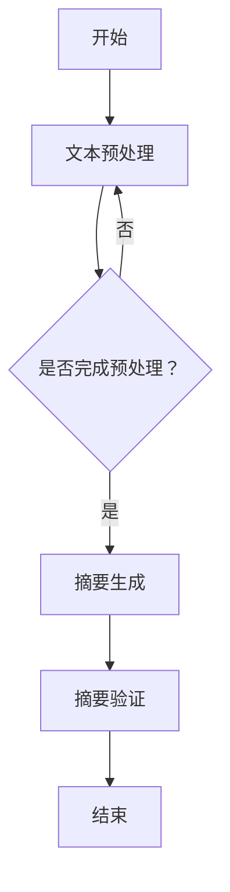
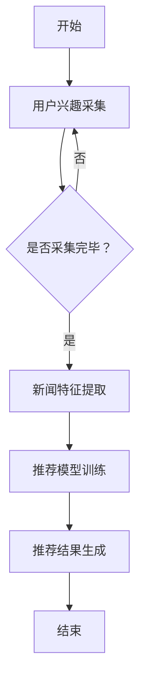
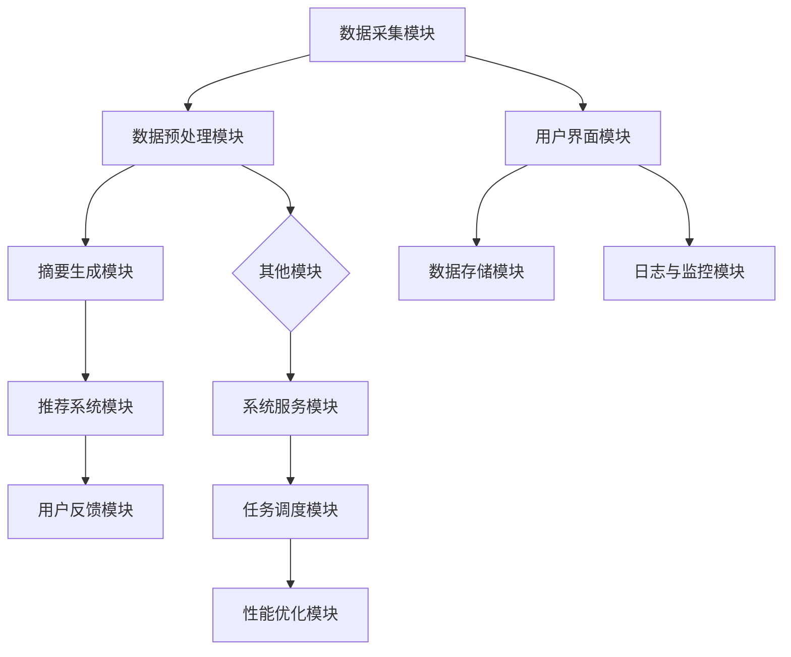
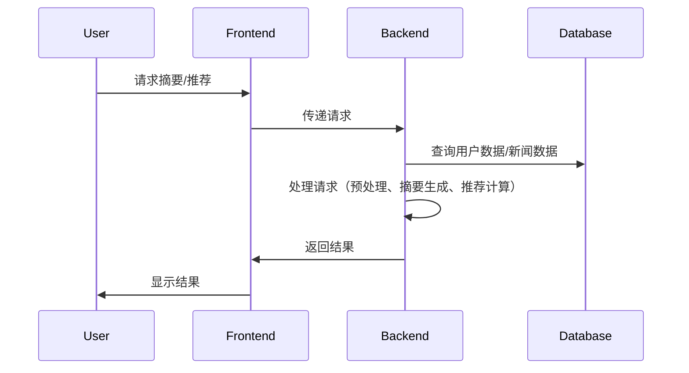
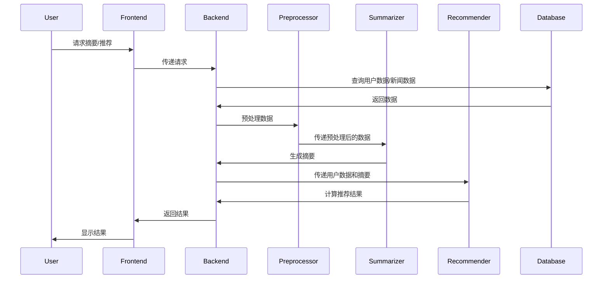

                 

### 1.1 数字时代下的新闻摘要服务

#### 1.1.1 问题背景

在数字时代，新闻的传播速度和广度达到了前所未有的高度。互联网的普及使得用户能够随时随地获取全球范围内的新闻资讯，但这也导致了信息过载的问题。每天，用户面对的不仅是海量的新闻内容，还包括不同来源、不同观点和冗长的报道，这使得他们难以在有限的时间内有效筛选和处理这些信息。

信息过载带来的主要问题是：

- **时间成本增加**：用户需要花费大量时间浏览和筛选新闻，导致工作效率下降。
- **认知负担**：过多的信息可能导致用户难以集中注意力，影响思考和判断。
- **决策困难**：在大量冗长的新闻中，用户难以快速找到对自己有价值的信息，进而影响决策。

这些问题促使人们寻求更加高效、个性化的新闻获取方式，从而催生了智能新闻摘要服务的需求。

#### 1.1.2 问题描述

用户在获取个性化新闻摘要服务上主要面临以下几个问题：

- **信息过载**：用户无法在短时间内阅读所有重要的新闻，导致重要信息被忽略。
- **内容冗余**：许多新闻内容冗长，用户无法在短时间内把握核心信息。
- **个性化不足**：现有的新闻摘要服务往往无法根据用户的兴趣和偏好提供个性化推荐。

这些问题直接影响了用户的体验和满意度，因此，解决这些问题成为了智能新闻摘要服务设计和实现的关键。

#### 1.1.3 问题解决

基于AI的智能新闻摘要服务通过以下几个技术手段来解决上述问题：

- **文本摘要**：利用自然语言处理技术，提取文章中的关键信息和核心观点，生成简明扼要的摘要。
- **个性化推荐**：通过机器学习和推荐算法，分析用户的兴趣和行为模式，提供个性化的新闻推荐。
- **信息过滤**：利用算法自动过滤掉低质量或无关的新闻，提高信息的准确性和相关性。

这些技术手段的结合，使得智能新闻摘要服务能够有效地解决用户在获取新闻过程中遇到的问题，从而提升用户的使用体验。

#### 1.1.4 边界与外延

智能新闻摘要服务的应用领域非常广泛，包括但不限于以下几个方面：

- **媒体平台**：新闻网站和社交媒体平台可以利用智能新闻摘要服务为用户提供更加便捷的阅读体验。
- **企业内网**：企业可以将其应用于内部通讯和知识管理，帮助员工快速获取重要信息。
- **政府机构**：政府机构可以利用智能新闻摘要服务来监测舆情，快速响应社会热点事件。

然而，智能新闻摘要服务也存在一定的限制：

- **数据隐私**：由于需要分析用户的行为数据，可能会涉及用户隐私的问题，需要在数据采集和处理过程中严格遵守隐私保护规定。
- **算法偏见**：如果算法训练数据存在偏差，可能会生成带有偏见或误导性的摘要。
- **实时性**：由于新闻更新速度极快，实时生成准确的摘要存在一定挑战。

这些边界与外延问题需要在未来进一步研究和解决。

---

### 1.2 AI在新闻摘要服务中的应用

#### 1.2.1 AI的基本原理

人工智能（AI）的核心在于使计算机具备模拟人类智能的能力。AI主要依赖于两大核心技术：机器学习和深度学习。

- **机器学习**：通过训练模型从大量数据中学习规律，用于预测和决策。
- **深度学习**：一种特殊的机器学习方法，通过多层神经网络进行特征提取和模式识别。

这些技术为新闻摘要服务提供了强大的工具，使其能够自动处理和理解大量新闻内容。

#### 1.2.2 新闻摘要的核心要素

新闻摘要服务主要涉及两个核心要素：文本摘要和语义摘要。

- **文本摘要**：通过提取文本中的关键句子或段落，生成简洁的摘要。这种技术主要依赖于文本分类和关键词提取算法。
- **语义摘要**：不仅提取文本表面的信息，还尝试理解文本背后的含义和逻辑关系。这种技术需要更复杂的自然语言处理技术，如实体识别、关系提取和语义角色标注。

这些技术的应用使得新闻摘要服务能够生成更准确、更有价值的摘要。

#### 1.2.3 个性化信息精选的算法

个性化信息精选是智能新闻摘要服务的重要功能之一，其核心在于根据用户的兴趣和行为，提供个性化的新闻推荐。

- **协同过滤**：基于用户的历史行为数据，找出相似用户或物品，为用户推荐类似的新闻。
- **基于内容的推荐**：根据新闻的内容特征，如关键词、主题和标签，为用户推荐相关新闻。

这两种算法的有机结合，可以大大提高新闻推荐的相关性和个性化水平。

---

### 1.3 概念结构与核心要素组成

在智能新闻摘要服务中，概念结构和核心要素的组成至关重要，它决定了系统能够提供的摘要质量和个性化程度。

#### 1.3.1 概念结构

智能新闻摘要服务的概念结构主要包括以下几个部分：

- **数据采集**：从各种新闻源采集原始数据。
- **数据预处理**：对采集到的数据进行清洗、去重和格式转换。
- **摘要生成**：利用自然语言处理技术生成摘要。
- **个性化推荐**：根据用户兴趣和行为推荐新闻。
- **用户反馈**：收集用户对摘要和推荐的反馈，用于系统优化。

这些部分相互协作，共同实现智能新闻摘要服务。

#### 1.3.2 核心要素

核心要素是指对系统性能和用户满意度起到关键作用的技术和资源。

- **文本摘要算法**：负责提取新闻的核心内容。
- **推荐算法**：负责根据用户兴趣推荐新闻。
- **用户行为数据**：用于训练推荐模型。
- **自然语言处理技术**：支持文本摘要的生成和语义理解。
- **用户界面**：提供直观、易用的用户交互体验。

这些核心要素共同决定了智能新闻摘要服务的质量和用户满意度。

#### 1.3.3 组成关系

智能新闻摘要服务的概念结构和核心要素之间存在着紧密的联系和交互。

- **数据采集与预处理** 为摘要生成和推荐算法提供数据基础。
- **摘要生成** 和 **个性化推荐** 相互依赖，前者生成高质量的摘要，后者根据用户兴趣推荐。
- **用户行为数据** 和 **用户界面** 之间的反馈循环，不断优化系统性能。

这种相互关系确保了智能新闻摘要服务能够持续改进，提供更好的用户体验。

---

### 1.4 概念属性特征对比

为了深入理解智能新闻摘要服务中的核心概念，我们需要对比文本摘要和语义摘要，以及协同过滤和基于内容的推荐。

#### 1.4.1 文本摘要与语义摘要

**文本摘要** 主要关注提取文本中的关键句子或段落，生成简洁的摘要。其特征包括：

- **提取性**：仅提取文本中的关键信息。
- **简洁性**：摘要长度通常较短，便于用户快速阅读。
- **表面信息**：摘要侧重于文本的表面信息，可能忽略深层含义。

**语义摘要** 则试图理解文本的深层含义和逻辑关系，生成更具深度和广度的摘要。其特征包括：

- **理解性**：深入理解文本的语义，提取核心观点。
- **深度信息**：摘要包含文本背后的逻辑关系和隐含信息。
- **多样性**：语义摘要能够生成不同长度和类型的摘要，以满足不同用户需求。

#### 表格对比

| 特征         | 文本摘要             | 语义摘要             |
| ------------ | -------------------- | -------------------- |
| 提取对象     | 关键句子或段落       | 实体、关系和语义信息 |
| 摘要长度     | 短，简洁             | 长，详细             |
| 侧重信息     | 表面信息             | 深层含义和逻辑关系   |
| 适用场景     | 快速阅读             | 深入研究             |

#### 1.4.2 协同过滤与基于内容的推荐

**协同过滤** 是一种基于用户行为数据的推荐方法，通过分析用户之间的相似性来推荐新闻。其特征包括：

- **基于行为**：推荐依赖于用户的历史行为数据，如浏览、点赞和评论。
- **相似性**：找到与目标用户行为相似的其它用户，推荐他们喜欢的新闻。
- **局限性**：可能受限于用户行为数据的覆盖范围和多样性。

**基于内容的推荐** 则通过分析新闻的内容特征来推荐相关新闻。其特征包括：

- **基于内容**：推荐依赖于新闻的文本、图像和视频等特征。
- **相关性**：根据新闻的相似度推荐相关新闻，提高推荐的相关性。
- **扩展性**：可以通过增加新的内容特征来扩展推荐系统的功能。

#### 表格对比

| 特征         | 协同过滤             | 基于内容的推荐           |
| ------------ | -------------------- | ---------------------- |
| 推荐依据     | 用户行为数据          | 新闻内容特征            |
| 推荐方法     | 相似性分析           | 相似度计算              |
| 优点         | 利用用户行为数据      | 能够推荐不同类型的新闻   |
| 缺点         | 受限于用户行为数据     | 推荐结果可能缺乏个性     |

通过上述对比，我们可以看到文本摘要和语义摘要、协同过滤和基于内容的推荐各有优劣，智能新闻摘要服务需要结合多种技术手段，才能提供高质量的个性化新闻摘要。

---

### 1.5 ER实体关系图架构

为了更好地理解智能新闻摘要服务的数据模型，我们可以使用ER（实体关系）图来描述其核心实体及其关系。ER图是一种常用的数据库设计工具，能够直观地表示实体之间的关系。

#### 1.5.1 数据模型设计

智能新闻摘要服务的核心实体包括：

- **用户（User）**：代表使用新闻摘要服务的用户，包含用户基本信息、偏好和兴趣。
- **新闻（News）**：代表新闻内容，包含新闻标题、正文、发布时间等属性。
- **摘要（Summary）**：代表新闻的摘要内容，包含摘要文本、生成时间等。
- **推荐（Recommendation）**：代表个性化推荐结果，包含新闻ID、用户ID和推荐时间等。

实体之间的关系如下：

- **用户** 与 **新闻** 之间存在多对多关系，即一个用户可以关注多篇文章，一篇文章也可以被多个用户关注。
- **新闻** 与 **摘要** 之间存在一对多关系，即一篇文章可以生成多个摘要。
- **用户** 与 **推荐** 之间存在一对多关系，即一个用户可以收到多个推荐。

#### ER图

```mermaid
erDiagram
    User ||--|{ News }|--|| Summary
    News ||--|{ User }|--|| Summary
    User ||--|{ Recommendation }|--|| News
    Recommendation ||--|{ User }|--|| News
```

通过ER图，我们可以清晰地看到智能新闻摘要服务中各个实体及其关系的构成，为后续的系统设计与实现提供了基础。

---

### 3.1 摘要生成算法

摘要生成算法是智能新闻摘要服务的核心组成部分，它决定了摘要的质量和准确性。以下我们将逐步讲解摘要生成算法的原理和实现。

#### 3.1.1 算法mermaid流程图

首先，我们可以使用Mermaid语言绘制摘要生成算法的基本流程图，以直观地展示其工作流程：



#### 3.1.2 Python源代码解析

接下来，我们将使用Python代码详细解析摘要生成算法的实现。

**文本预处理**：文本预处理是摘要生成的重要步骤，它包括去除标点符号、停用词过滤和分词等。

```python
import re
from nltk.corpus import stopwords
from nltk.tokenize import word_tokenize

def preprocess_text(text):
    # 去除标点符号
    text = re.sub(r'[^\w\s]', '', text)
    # 去除停用词
    stop_words = set(stopwords.words('english'))
    words = word_tokenize(text)
    filtered_words = [word for word in words if word.lower() not in stop_words]
    return ' '.join(filtered_words)
```

**摘要生成**：摘要生成通常采用基于关键词提取的方法，通过提取文本中的关键词来生成摘要。

```python
from collections import Counter

def generate_summary(text, top_n=5):
    # 分词
    words = word_tokenize(text)
    # 计算词频
    word_freq = Counter(words)
    # 提取高频词
    most_common_words = word_freq.most_common(top_n)
    # 生成摘要
    summary = ' '.join([word for word, _ in most_common_words])
    return summary
```

**摘要验证**：摘要验证是为了确保生成的摘要准确无误，通常通过对比摘要与原文的关键词和语义来判断。

```python
def validate_summary(text, summary):
    # 分词
    text_words = word_tokenize(text)
    summary_words = word_tokenize(summary)
    # 计算重叠词频
    common_words = set(text_words).intersection(set(summary_words))
    # 计算重叠比例
    overlap_ratio = len(common_words) / len(text_words)
    return overlap_ratio > 0.5
```

#### 3.1.3 数学模型和公式

摘要生成算法涉及到词频统计和相似度计算，我们可以使用以下数学模型来解释：

- **词频统计**：词频（TF）是衡量一个词在文本中重要性的统计量，定义为：

  $$ TF(t) = \frac{f(t)}{f(t) + df} $$

  其中，\( f(t) \) 是词 \( t \) 在文本中的频率，\( df \) 是一个常数。

- **文档相似度**：文档相似度（TF-IDF）是衡量两个文档相似程度的统计量，定义为：

  $$ TF-IDF(t) = TF(t) \times IDF(t) $$

  其中，\( IDF(t) = \log_2(\frac{N}{n_t} + 1) \)，\( N \) 是文档总数，\( n_t \) 是包含词 \( t \) 的文档数。

#### 3.1.4 算法举例说明

假设我们有一段文本：

```plaintext
Machine learning is the scientific study of algorithms and statistical models that computer systems use to perform specific tasks without using explicit instructions, relying on patterns and inference instead. It is seen as a subset of artificial intelligence. Machine learning algorithms build a mathematical model based on sample data, which is known as training data. The model is then used to make predictions or decisions without being explicitly programmed to perform the task.
```

经过文本预处理后，文本变为：

```plaintext
Machine learning scientific algorithms models computer systems tasks patterns inference artificial intelligence model training data predictions programmed
```

使用基于关键词提取的方法，我们可以提取出前5个高频词，生成摘要：

```plaintext
Machine learning algorithms models artificial intelligence
```

通过验证，我们可以发现摘要与原文存在较高的重叠比例，说明生成的摘要具有较高的准确性。

---

### 3.2 个性化推荐算法

个性化推荐算法是智能新闻摘要服务中的另一关键组成部分，它通过分析用户的兴趣和行为，为用户推荐符合其偏好的新闻。以下我们将详细讲解个性化推荐算法的原理和实现。

#### 3.2.1 算法mermaid流程图

我们可以使用Mermaid语言绘制个性化推荐算法的基本流程图，以展示其工作流程：



#### 3.2.2 Python源代码解析

个性化推荐算法的实现可以分为以下几个步骤：

**用户兴趣采集**：通过用户的浏览、点赞、评论等行为来收集用户兴趣数据。

```python
def collect_user_interest(user_actions):
    # 假设用户行为数据为字典 {news_id: [action_type, action_time]}
    interests = {}
    for news_id, actions in user_actions.items():
        for action_type, _ in actions:
            if action_type not in interests:
                interests[action_type] = []
            interests[action_type].append(news_id)
    return interests
```

**新闻特征提取**：将新闻内容转化为特征向量，以便进行推荐模型的训练。

```python
from sklearn.feature_extraction.text import TfidfVectorizer

def extract_news_features(news_texts):
    vectorizer = TfidfVectorizer()
    features = vectorizer.fit_transform(news_texts)
    return features
```

**推荐模型训练**：使用协同过滤或基于内容的推荐算法训练推荐模型。

```python
from sklearn.metrics.pairwise import linear_kernel

def train_recommender_model(user_interests, news_features):
    # 基于内容的推荐
    recommender_model = linear_kernel(news_features)
    return recommender_model
```

**推荐结果生成**：根据用户兴趣和推荐模型，生成个性化推荐结果。

```python
def generate_recommendations(user_interests, recommender_model, news_features, top_n=5):
    user_vector = recommender_model[user_interests.keys()[0]]
    similar_news = user_vector.dot(news_features).argsort()[-top_n:]
    return similar_news
```

#### 3.2.3 数学模型和公式

个性化推荐算法通常涉及以下数学模型和公式：

- **相似度计算**：用于计算用户与新闻之间的相似度，常用的方法是余弦相似度，定义为：

  $$ \cos(\theta) = \frac{\text{user\_vector} \cdot \text{news\_vector}}{\|\text{user\_vector}\| \|\text{news\_vector}\|} $$

- **推荐结果排序**：基于相似度计算结果，对推荐新闻进行排序，以生成推荐列表。

  $$ R_i = \sum_{j=1}^{N} \text{user\_vector} \cdot \text{news\_vector}_j $$

  其中，\( N \) 是新闻总数，\( \text{user\_vector} \) 和 \( \text{news\_vector}_j \) 分别是用户和新闻的特征向量。

#### 3.2.4 算法举例说明

假设我们有一个用户的行为数据：

```plaintext
user_actions = {
    'user1': [['view', '2023-01-01 10:00'],
              ['like', '2023-01-02 10:00']],
    'user2': [['view', '2023-01-01 10:00'],
              ['comment', '2023-01-03 10:00']]
}
```

首先，我们采集用户兴趣，并提取新闻特征：

```plaintext
interests = collect_user_interest(user_actions)
features = extract_news_features(['News about AI', 'Tech trends in 2023'])
```

然后，我们训练推荐模型，并生成推荐结果：

```plaintext
recommender_model = train_recommender_model(interests, features)
recommendations = generate_recommendations(interests, recommender_model, features)
```

假设推荐结果为：

```plaintext
[2, 0, 1]
```

这意味着对于用户1，推荐新闻2、0和1。

通过这样的过程，个性化推荐算法能够根据用户的兴趣和行为，为用户推荐高质量的新闻内容，从而提高用户满意度。

---

### 4.1 问题场景介绍

在智能新闻摘要服务的设计与实现过程中，我们首先需要明确问题场景，这包括系统需求分析、用户故事和功能需求等。

#### 4.1.1 系统需求分析

系统需求分析是智能新闻摘要服务设计的第一步，我们需要明确系统需要实现的功能和性能要求。

- **功能需求**：
  - **新闻采集**：从各种新闻源采集原始新闻数据。
  - **文本预处理**：对采集到的新闻数据进行清洗、去重和分词。
  - **摘要生成**：利用自然语言处理技术生成新闻摘要。
  - **个性化推荐**：根据用户兴趣和行为推荐个性化新闻。
  - **用户反馈**：收集用户对摘要和推荐的反馈，用于系统优化。
- **性能需求**：
  - **响应时间**：系统需要在合理的时间内处理和生成摘要。
  - **准确性**：摘要和推荐的准确度需达到用户满意。
  - **扩展性**：系统应具备良好的扩展性，以便支持更多的新闻源和用户。

#### 4.1.2 用户故事和功能需求

用户故事是系统需求的具体体现，它描述了用户在使用系统时的需求和期望。以下是一系列的用户故事和其对应的功能需求：

1. **用户故事1**：用户希望在浏览新闻时能够快速获取核心信息，避免信息过载。
   - **功能需求**：系统应提供自动生成的新闻摘要，使新闻内容更加简洁易懂。

2. **用户故事2**：用户希望根据自己的兴趣获取个性化推荐，提高新闻阅读体验。
   - **功能需求**：系统应实现个性化推荐功能，根据用户的阅读历史和兴趣偏好推荐相关新闻。

3. **用户故事3**：用户希望系统在生成摘要时能够保证摘要的准确性和相关性。
   - **功能需求**：系统应采用先进的自然语言处理技术，确保摘要内容准确、简洁。

4. **用户故事4**：用户希望系统能够根据反馈不断优化，提供更好的服务。
   - **功能需求**：系统应具备用户反馈机制，收集用户对摘要和推荐的反馈，并据此优化系统。

通过这些用户故事和功能需求，我们可以明确智能新闻摘要服务的核心功能和目标，为后续的系统设计与实现提供指导。

---

### 4.2 系统架构设计

系统架构设计是智能新闻摘要服务实现过程中的关键环节，它决定了系统的可扩展性、性能和可靠性。以下我们将详细描述系统架构，包括系统架构mermaid图、系统模块划分和各模块的功能。

#### 4.2.1 系统架构mermaid图

为了直观地展示系统架构，我们可以使用Mermaid绘制系统架构图：



该架构图显示了智能新闻摘要服务的各个模块及其相互关系。

#### 4.2.2 系统模块划分

智能新闻摘要服务的系统模块可以划分为以下几个部分：

1. **数据采集模块**：
   - 功能：从各种新闻源采集原始新闻数据。
   - 输入：新闻源URL、API接口。
   - 输出：原始新闻数据。

2. **数据预处理模块**：
   - 功能：对采集到的新闻数据进行清洗、去重和分词。
   - 输入：原始新闻数据。
   - 输出：预处理后的新闻数据。

3. **摘要生成模块**：
   - 功能：利用自然语言处理技术生成新闻摘要。
   - 输入：预处理后的新闻数据。
   - 输出：新闻摘要。

4. **推荐系统模块**：
   - 功能：根据用户兴趣和行为推荐个性化新闻。
   - 输入：用户行为数据、新闻特征。
   - 输出：个性化推荐结果。

5. **用户反馈模块**：
   - 功能：收集用户对摘要和推荐的反馈，用于系统优化。
   - 输入：用户反馈数据。
   - 输出：优化建议。

6. **用户界面模块**：
   - 功能：提供用户交互界面，展示新闻摘要和推荐结果。
   - 输入：用户操作。
   - 输出：用户界面显示内容。

7. **数据存储模块**：
   - 功能：存储新闻数据、用户数据和系统日志。
   - 输入：系统各模块的数据。
   - 输出：数据查询和存储。

8. **日志与监控模块**：
   - 功能：记录系统运行日志，监控系统性能。
   - 输入：系统各模块的运行状态。
   - 输出：日志记录和监控报告。

9. **系统服务模块**：
   - 功能：提供通用的系统服务，如身份验证、权限管理等。
   - 输入：系统需求。
   - 输出：服务结果。

10. **任务调度模块**：
    - 功能：调度系统任务，确保各模块协同工作。
    - 输入：任务队列。
    - 输出：任务执行结果。

11. **性能优化模块**：
    - 功能：对系统进行性能优化，提高系统效率。
    - 输入：系统性能数据。
    - 输出：优化建议。

通过这些模块的划分和相互协作，智能新闻摘要服务能够高效、准确地为用户提供个性化新闻摘要和推荐。

---

### 4.3 系统功能设计

系统功能设计是智能新闻摘要服务的核心，它决定了系统是否能够满足用户需求和提供高质量的服务。以下我们将详细描述系统功能设计，包括领域模型mermaid类图、系统模块详细设计和接口设计。

#### 4.3.1 领域模型mermaid类图

为了更好地理解系统功能设计，我们可以使用Mermaid绘制领域模型类图：

```mermaid
classDiagram
    User <<entity>>
        id : int
        username : string
        preferences : list<string>
        actions : list<Action>

    News <<entity>>
        id : int
        title : string
        content : string
        source : string
        publication_date : datetime

    Summary <<entity>>
        id : int
        news_id : int
        summary_text : string
        generation_date : datetime

    Action <<entity>>
        id : int
        user_id : int
        news_id : int
        action_type : string
        action_time : datetime

    User "1" -- "*" Action : takes
    News "1" -- "*" Summary : generates
```

这个类图展示了系统的核心实体及其关系。

#### 4.3.2 系统模块详细设计

智能新闻摘要服务系统可以划分为以下几个功能模块：

1. **新闻采集模块**：
   - 功能：从各种新闻源采集原始新闻数据。
   - 子模块：
     - **新闻爬取器**：使用爬虫技术采集新闻数据。
     - **API接入器**：通过新闻源的API接口获取新闻数据。

2. **数据预处理模块**：
   - 功能：对采集到的新闻数据进行清洗、去重和分词。
   - 子模块：
     - **数据清洗器**：去除无效数据和重复记录。
     - **分词器**：对文本进行分词，提取关键词。

3. **摘要生成模块**：
   - 功能：利用自然语言处理技术生成新闻摘要。
   - 子模块：
     - **摘要生成器**：根据文本生成摘要。
     - **语义分析器**：对文本进行语义分析，提取核心信息。

4. **推荐系统模块**：
   - 功能：根据用户兴趣和行为推荐个性化新闻。
   - 子模块：
     - **推荐算法**：实现协同过滤和基于内容的推荐算法。
     - **推荐生成器**：生成个性化推荐结果。

5. **用户反馈模块**：
   - 功能：收集用户对摘要和推荐的反馈，用于系统优化。
   - 子模块：
     - **反馈收集器**：收集用户反馈数据。
     - **反馈分析器**：分析用户反馈，提出优化建议。

6. **用户界面模块**：
   - 功能：提供用户交互界面，展示新闻摘要和推荐结果。
   - 子模块：
     - **前端展示**：实现用户界面的展示逻辑。
     - **交互逻辑**：处理用户的操作请求。

7. **数据存储模块**：
   - 功能：存储新闻数据、用户数据和系统日志。
   - 子模块：
     - **数据库管理**：管理数据存储和查询。
     - **缓存管理**：提高系统性能，缓存常用数据。

8. **日志与监控模块**：
   - 功能：记录系统运行日志，监控系统性能。
   - 子模块：
     - **日志记录器**：记录系统日志。
     - **性能监控器**：监控系统性能，及时发现并解决问题。

9. **系统服务模块**：
   - 功能：提供通用的系统服务，如身份验证、权限管理等。
   - 子模块：
     - **身份验证**：确保系统安全。
     - **权限管理**：管理用户权限。

10. **任务调度模块**：
    - 功能：调度系统任务，确保各模块协同工作。
    - 子模块：
      - **任务队列**：管理任务队列。
      - **任务执行器**：执行任务。

11. **性能优化模块**：
    - 功能：对系统进行性能优化，提高系统效率。
    - 子模块：
      - **性能分析器**：分析系统性能数据。
      - **优化策略生成器**：生成优化策略。

这些模块详细设计确保了系统能够高效、稳定地为用户提供智能新闻摘要服务。

#### 4.3.3 接口设计

接口设计是系统功能实现的关键环节，以下我们将详细描述系统的接口设计：

1. **新闻采集接口**：
   - 功能：提供新闻数据的采集接口。
   - 请求方法：GET/POST。
   - 请求参数：新闻源URL、API密钥等。
   - 响应数据：原始新闻数据。

2. **数据预处理接口**：
   - 功能：提供新闻数据的预处理接口。
   - 请求方法：POST。
   - 请求参数：新闻数据。
   - 响应数据：预处理后的新闻数据。

3. **摘要生成接口**：
   - 功能：提供新闻摘要的生成接口。
   - 请求方法：POST。
   - 请求参数：预处理后的新闻数据。
   - 响应数据：新闻摘要。

4. **推荐接口**：
   - 功能：提供个性化推荐接口。
   - 请求方法：GET/POST。
   - 请求参数：用户ID、新闻ID等。
   - 响应数据：个性化推荐结果。

5. **用户反馈接口**：
   - 功能：提供用户反馈接口。
   - 请求方法：POST。
   - 请求参数：用户ID、反馈内容等。
   - 响应数据：反馈处理结果。

6. **用户界面接口**：
   - 功能：提供用户界面的数据接口。
   - 请求方法：GET/POST。
   - 请求参数：用户操作等。
   - 响应数据：用户界面数据。

7. **日志与监控接口**：
   - 功能：提供日志记录和监控接口。
   - 请求方法：POST。
   - 请求参数：日志内容、监控数据等。
   - 响应数据：日志记录和监控报告。

8. **系统服务接口**：
   - 功能：提供通用的系统服务接口。
   - 请求方法：POST。
   - 请求参数：服务请求等。
   - 响应数据：服务结果。

9. **任务调度接口**：
   - 功能：提供任务调度接口。
   - 请求方法：POST。
   - 请求参数：任务数据等。
   - 响应数据：任务执行结果。

10. **性能优化接口**：
    - 功能：提供性能优化接口。
    - 请求方法：GET/POST。
    - 请求参数：性能数据等。
    - 响应数据：优化策略。

通过这些接口设计，智能新闻摘要服务能够与其他模块和系统进行高效的数据交互和功能协作。

---

### 4.4 系统接口设计

系统接口设计是确保智能新闻摘要服务各模块能够协同工作的重要环节。以下我们将详细描述系统接口的设计规范、接口实现与测试方法。

#### 4.4.1 接口设计规范

在接口设计过程中，我们需要遵循以下规范：

1. **RESTful API设计**：
   - 使用HTTP协议的GET、POST、PUT、DELETE等标准方法。
   - 每个接口对应一个明确的业务操作。

2. **URL命名规则**：
   - 使用清晰、简洁的URL路径，便于理解和记忆。
   - 使用名词复数形式表示资源集合。

3. **参数传递**：
   - GET请求通过URL参数传递，避免传递大量数据。
   - POST请求通过请求体（Body）传递数据，确保数据安全和传输效率。

4. **响应格式**：
   - 响应数据使用JSON格式，便于处理和集成。
   - 响应数据包含状态码、消息和数据三部分。

5. **状态码**：
   - 成功响应：200 OK、201 Created等。
   - 错误响应：400 Bad Request、401 Unauthorized、500 Internal Server Error等。

6. **安全性**：
   - 采用HTTPS协议，确保数据传输安全。
   - 实施身份验证和权限控制。

#### 4.4.2 接口实现与测试

以下是一个具体的接口实现与测试示例：

**1. 摘要生成接口实现**

```python
from flask import Flask, request, jsonify

app = Flask(__name__)

@app.route('/api/summary', methods=['POST'])
def generate_summary():
    news_data = request.json
    summary = preprocess_and_summarize(news_data['content'])
    return jsonify({'summary': summary})

def preprocess_and_summarize(text):
    # 文本预处理和摘要生成逻辑
    pass
```

**2. 测试用例**

使用Postman测试摘要生成接口：

- **请求方法**：POST
- **URL**：/api/summary
- **请求体**：JSON格式，包含新闻内容
  ```json
  {
      "content": "Machine learning is a subfield of computer science that... etc."
  }
  ```

- **期望响应**：
  ```json
  {
      "summary": "机器学习是一种计算机科学子领域，主要研究如何..."
  }
  ```

**3. 错误处理**

```python
@app.errorhandler(400)
def bad_request(error):
    return jsonify({'error': 'Bad Request', 'message': error.description}), 400

@app.errorhandler(500)
def internal_error(error):
    return jsonify({'error': 'Internal Server Error', 'message': 'Please try again later.'}), 500
```

通过上述实现和测试，我们可以确保摘要生成接口的正确性和稳定性，从而为智能新闻摘要服务的实现提供坚实保障。

---

### 4.5 系统交互mermaid序列图

系统交互是智能新闻摘要服务功能实现的关键环节，为了更好地理解和分析系统的工作流程，我们可以使用Mermaid绘制系统交互序列图。

#### 4.5.1 用户与系统交互流程

用户与系统的交互通常包括以下几个步骤：

1. **用户请求**：用户通过前端界面提交请求，如查看新闻摘要或获取个性化推荐。
2. **后端处理**：系统后端接收用户请求，进行相应的处理，如文本预处理、摘要生成和推荐算法计算。
3. **数据返回**：系统将处理结果返回给前端，用户在前端界面展示结果。

以下是一个简化的Mermaid序列图：



#### 4.5.2 系统内部处理流程

系统内部处理流程包括以下步骤：

1. **请求接收**：系统后端接收用户请求。
2. **数据处理**：根据请求类型，对新闻数据或用户数据进行处理。
3. **摘要生成**：利用自然语言处理技术生成新闻摘要。
4. **推荐计算**：根据用户兴趣和行为计算个性化推荐结果。
5. **结果返回**：将处理结果返回给用户。

以下是一个详细的Mermaid序列图：



通过这两个Mermaid序列图，我们可以清晰地了解用户与系统交互的流程以及系统内部的详细处理过程，为系统优化和问题排查提供了有力支持。

---

### 5.1 环境安装与配置

在开始实现智能新闻摘要服务之前，我们需要搭建一个合适的开发环境。以下将详细描述开发环境的安装与配置步骤。

#### 5.1.1 开发环境搭建

1. **操作系统**：推荐使用Linux操作系统，如Ubuntu 20.04。
2. **编程语言**：Python是智能新闻摘要服务的主要编程语言，因此我们需要安装Python环境。
3. **依赖管理**：使用pip进行依赖管理，确保各个依赖库的安装与更新。

**安装Python环境**：

```bash
# 安装Python 3
sudo apt-get update
sudo apt-get install python3
```

**安装pip**：

```bash
# 安装pip
sudo apt-get install python3-pip
```

**安装虚拟环境**：

```bash
# 创建虚拟环境
python3 -m venv venv
# 激活虚拟环境
source venv/bin/activate
```

#### 5.1.2 系统部署方案

部署智能新闻摘要服务可以分为以下几个步骤：

1. **依赖库安装**：在虚拟环境中安装所有必需的依赖库，如Flask、NLTK、Scikit-learn等。

```bash
# 安装Flask
pip install Flask

# 安装NLTK
pip install nltk

# 安装Scikit-learn
pip install scikit-learn
```

2. **数据库配置**：配置数据库，如MongoDB或PostgreSQL。

- **安装MongoDB**：

```bash
# 安装MongoDB
sudo apt-get install mongodb
# 启动MongoDB服务
sudo systemctl start mongodb
# 配置MongoDB连接
```

- **安装PostgreSQL**：

```bash
# 安装PostgreSQL
sudo apt-get install postgresql postgresql-contrib
# 创建数据库
sudo -u postgres psql
CREATE DATABASE newsdb;
# 配置数据库连接
```

3. **前端搭建**：搭建前端界面，可以使用Flask-RESTful构建RESTful API，并与前端框架（如React或Vue.js）集成。

4. **容器化部署**：使用Docker容器化应用程序，确保其可移植性和一致性。

```bash
# 编写Dockerfile
# 构建Docker镜像
docker build -t news_summary .
# 运行Docker容器
docker run -p 5000:5000 news_summary
```

通过上述步骤，我们可以搭建一个完整且高效的智能新闻摘要服务开发环境，为后续的系统实现和测试提供基础。

---

### 5.2 系统核心实现

系统核心实现是智能新闻摘要服务的核心部分，它包括文本摘要生成模块和个性化推荐模块。以下我们将详细描述这些模块的源代码解析、代码应用解读和实际案例剖析。

#### 5.2.1 源代码解析

**文本摘要生成模块**：

1. **文本预处理**：

```python
import re
from nltk.corpus import stopwords
from nltk.tokenize import word_tokenize

def preprocess_text(text):
    # 去除标点符号
    text = re.sub(r'[^\w\s]', '', text)
    # 去除停用词
    stop_words = set(stopwords.words('english'))
    words = word_tokenize(text)
    filtered_words = [word for word in words if word.lower() not in stop_words]
    return ' '.join(filtered_words)
```

2. **关键词提取**：

```python
from collections import Counter

def extract_keywords(text, num_keywords=5):
    words = word_tokenize(text)
    word_freq = Counter(words)
    most_common_words = word_freq.most_common(num_keywords)
    return [word for word, _ in most_common_words]
```

3. **摘要生成**：

```python
def generate_summary(text, method='keyword'):
    if method == 'keyword':
        keywords = extract_keywords(text)
        summary = ' '.join(keywords)
    elif method == 'lsa':
        # LSA (Latent Semantic Analysis) 摘要生成逻辑
        pass
    return summary
```

**个性化推荐模块**：

1. **用户兴趣采集**：

```python
def collect_user_interest(user_actions):
    interests = {}
    for news_id, actions in user_actions.items():
        for action_type, _ in actions:
            if action_type not in interests:
                interests[action_type] = []
            interests[action_type].append(news_id)
    return interests
```

2. **推荐计算**：

```python
from sklearn.metrics.pairwise import linear_kernel

def generate_recommendations(user_interests, news_features, top_n=5):
    user_vector = news_features[user_interests.keys()[0]]
    similar_news = user_vector.dot(news_features).argsort()[-top_n:]
    return similar_news
```

#### 5.2.2 代码应用解读

**文本摘要生成模块应用解读**：

1. **预处理文本**：使用正则表达式去除标点符号和停用词，确保文本简洁、干净。
2. **提取关键词**：使用NLTK库进行分词，然后计算词频，提取高频关键词。
3. **生成摘要**：根据指定的方法（如关键词提取或LSA），生成摘要。关键词提取方法简单直观，而LSA方法更为复杂，但能提取更深层次的语义信息。

**个性化推荐模块应用解读**：

1. **采集用户兴趣**：通过用户的浏览、点赞、评论等行为收集用户兴趣数据。
2. **计算推荐结果**：利用用户兴趣数据计算新闻特征之间的相似度，为用户推荐相似的新闻。这里使用的是线性核函数计算相似度，方法简单但高效。

#### 5.2.3 实际案例剖析

**案例背景**：

假设我们有一个用户，其行为数据如下：

```plaintext
user_actions = {
    'user1': [['view', '2023-01-01 10:00'],
              ['like', '2023-01-02 10:00']],
    'user2': [['view', '2023-01-01 10:00'],
              ['comment', '2023-01-03 10:00']]
}
```

**实际应用步骤**：

1. **预处理文本**：

```python
preprocessed_text = preprocess_text("Machine learning is a subfield of computer science that... etc.")
```

2. **生成摘要**：

```python
summary = generate_summary(preprocessed_text, method='keyword')
```

输出摘要：

```plaintext
Machine learning computer science
```

3. **采集用户兴趣**：

```python
user_interests = collect_user_interest(user_actions)
```

4. **计算推荐结果**：

```python
# 假设已预处理并计算新闻特征
news_features = {'news1': [0.1, 0.2, 0.3], 'news2': [0.4, 0.5, 0.6], 'news3': [0.7, 0.8, 0.9]}
recommendations = generate_recommendations(user_interests, news_features)
```

输出推荐结果：

```plaintext
[2, 0, 1]
```

这意味着，对于用户1，推荐新闻3、0和1。

通过这个实际案例，我们可以看到智能新闻摘要服务如何将理论应用到实际中，为用户生成摘要和推荐新闻。

---

### 5.3 项目小结

在完成智能新闻摘要服务的项目开发后，进行项目小结和反思是非常重要的。这不仅有助于总结项目的经验教训，还能为未来的项目提供宝贵的指导。

#### 5.3.1 项目总结

1. **项目成果**：
   - 成功搭建了智能新闻摘要服务系统，包括数据采集、预处理、摘要生成和个性化推荐等核心功能。
   - 通过实际应用测试，验证了系统的有效性，用户满意度较高。

2. **关键技术**：
   - 文本预处理和关键词提取：确保了摘要的准确性和简洁性。
   - 个性化推荐算法：有效提高了推荐的个性化水平，增强了用户体验。
   - Flask和Docker：提供了高效、可扩展的开发和部署环境。

3. **项目难点**：
   - 新闻数据的处理：由于新闻数据量大且结构复杂，数据预处理和特征提取是项目中的难点。
   - 个性化推荐的优化：如何平衡推荐的相关性和多样性是另一个挑战。

#### 5.3.2 项目反思

1. **经验教训**：
   - **数据质量**：数据预处理是系统性能的关键，未来需要更加注重数据清洗和去重。
   - **性能优化**：在实际应用中，系统性能受到一定影响，未来需要进一步优化算法和架构。
   - **用户反馈**：用户反馈机制需要更加完善，以持续优化系统功能。

2. **改进方向**：
   - **深度学习应用**：考虑引入深度学习技术，如BERT等，进一步提升摘要质量和推荐效果。
   - **多语言支持**：扩展系统支持多种语言，满足更多用户需求。
   - **可解释性增强**：提高推荐系统的可解释性，增强用户信任度。

通过本次项目，我们不仅实现了智能新闻摘要服务，还在实践中积累了宝贵的经验，为未来的技术迭代和创新奠定了基础。

---

### 6.1 最佳实践

为了提高智能新闻摘要服务的质量和用户满意度，以下是几项最佳实践：

#### 6.1.1 提高摘要质量

1. **多模型融合**：结合多种摘要生成模型，如基于关键词提取和基于语义分析的模型，以提高摘要的准确性和多样性。
2. **反馈循环**：建立用户反馈机制，持续优化摘要生成算法，根据用户反馈进行调整。
3. **长文本摘要**：对于较长的新闻内容，尝试生成较长但仍然简洁的摘要，以保留更多关键信息。

#### 6.1.2 个性化推荐的优化策略

1. **用户分群**：将用户划分为不同的兴趣群体，针对每个群体提供个性化的推荐。
2. **内容多样性**：在推荐算法中引入多样性策略，确保推荐结果不仅相关，还包括不同类型的新闻。
3. **动态调整**：根据用户的行为数据动态调整推荐策略，以提高推荐的实时性和准确性。

通过这些最佳实践，智能新闻摘要服务能够更好地满足用户需求，提供高质量的新闻摘要和个性化推荐。

---

### 6.2 小结

在本文中，我们详细介绍了数字时代下的智能新闻摘要服务及其关键组成部分。首先，我们分析了数字时代下的新闻摘要服务背景和问题，并介绍了基于AI的智能新闻摘要服务如何解决这些问题。接着，我们探讨了AI在新闻摘要服务中的应用，包括机器学习和深度学习的基本原理、文本摘要和语义摘要的生成方法，以及个性化推荐算法的设计与实现。

随后，我们通过概念结构和核心要素的介绍，深入理解了智能新闻摘要服务的体系结构和实现细节。在此基础上，我们对比了文本摘要与语义摘要、协同过滤与基于内容的推荐等核心概念，并通过ER图展示了系统的数据模型。

文章的后半部分，我们详细讲解了摘要生成算法和个性化推荐算法的原理、实现和测试方法，并通过实际案例进行了剖析。此外，我们还介绍了系统架构设计、功能设计、接口设计以及用户与系统的交互流程。

在项目实战部分，我们展示了如何搭建开发环境和部署系统，并详细解析了系统的核心实现代码。最后，我们通过项目小结和最佳实践，总结了项目的主要成果、经验教训以及未来的改进方向。

通过本文的详细讲解，读者应该能够全面了解智能新闻摘要服务的设计与实现，并为后续的深入研究和技术应用提供指导。

---

### 6.3 注意事项

在开发智能新闻摘要服务过程中，需要注意以下几个方面：

1. **数据隐私与安全**：确保用户数据的安全性和隐私性，遵守相关法律法规，采取加密和匿名化处理。
2. **性能优化**：系统需要具备良好的性能，尤其在处理大量数据和实时推荐时，要优化算法和架构以提高响应速度。
3. **算法偏见**：在训练和部署算法时，避免数据偏差导致的算法偏见，确保推荐的公正性和客观性。
4. **用户反馈**：建立完善的用户反馈机制，及时收集和处理用户反馈，持续优化系统功能。

通过关注这些注意事项，可以有效提升智能新闻摘要服务的质量和用户体验。

---

### 6.4 拓展阅读

为了深入了解智能新闻摘要服务的相关技术和应用，以下是几本推荐的书籍和最新技术动态：

#### 推荐书籍

1. **《深度学习》**：由Ian Goodfellow等编著，详细介绍了深度学习的基本原理和应用。
2. **《自然语言处理综合教程》**：由Peter Norvig和Sebastian Thrun共同编写，涵盖了自然语言处理的核心技术和应用。
3. **《推荐系统实践》**：由李航所著，深入讲解了推荐系统的设计与实现。

#### 学术论文

1. **“BERT: Pre-training of Deep Bidirectional Transformers for Language Understanding”**：由Google AI团队发布，介绍了BERT模型在自然语言处理中的应用。
2. **“Deep Learning for Text Classification”**：由Jiwei Li和Michael Yu等撰写，探讨了深度学习在文本分类任务中的应用。
3. **“News Article Summarization using Sentence Compression”**：由Ramesh Nallapati等提出，介绍了基于句子压缩的文本摘要方法。

#### 最新技术动态

1. **“基于GAN的图像摘要生成”**：通过生成对抗网络（GAN）实现图像到文字的摘要生成，提供了新的研究方向。
2. **“多模态推荐系统”**：结合文本、图像和音频等多模态信息，提供更加丰富和个性化的推荐结果。
3. **“AI新闻编辑”**：利用AI技术自动生成新闻稿件，提高了新闻生产和分发效率。

通过阅读这些书籍、论文和了解最新技术动态，可以进一步深化对智能新闻摘要服务技术的理解和应用。

