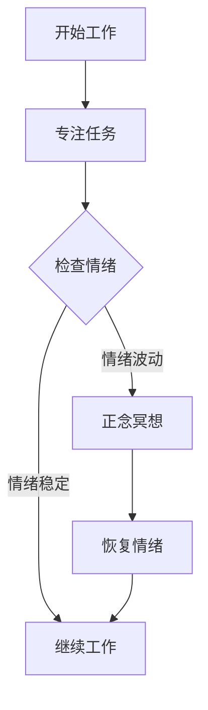
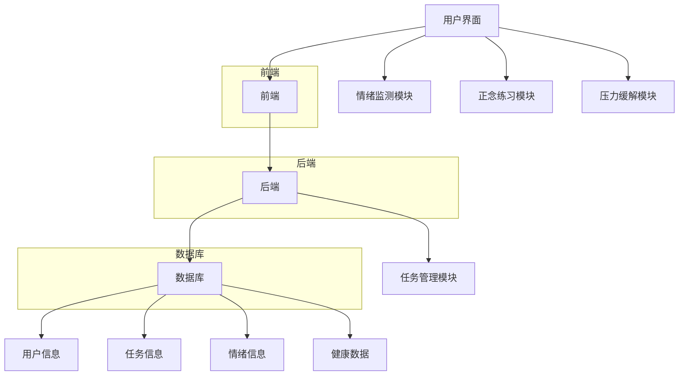

                 

# 数字时代的正念工作：远程办公中的心理健康维护

## 关键词
- 数字时代
- 正念工作
- 远程办公
- 心理健康
- 心理维护算法

## 摘要
本文深入探讨了数字时代下远程办公所带来的心理健康挑战，并提出了基于正念工作的心理维护策略。通过详细解析正念工作原理，结合心理学与计算机科学的方法，本文构建了一个远程办公心理健康维护的数学模型，并提供了实际项目的实现与分析。文章旨在为IT从业者在远程办公环境中维护心理健康提供理论指导和实践参考。

---

## 背景介绍

### 数字时代

随着信息技术的飞速发展，数字时代已经来临。人们的工作、学习和生活方式发生了翻天覆地的变化。远程办公、在线协作、云计算等新兴工作模式成为常态，大大提高了工作效率和灵活性。然而，这种变化也带来了一系列心理健康问题。

### 正念工作

正念工作（Mindful Work）是一种强调注意力集中、情绪管理和自我觉察的工作方式。它起源于佛教的正念冥想，近年来在心理学和管理学领域得到了广泛应用。正念工作不仅有助于提高工作效率，还能显著改善员工的心理健康。

### 远程办公

远程办公（Remote Work）是指员工在家中或其他非传统工作场所进行工作。这种工作模式在全球范围内迅速普及，尤其是新冠疫情爆发后，远程办公已经成为许多企业和组织的首选。远程办公带来了便利，但同时也带来了孤独感、效率下降和心理健康问题等挑战。

### 心理健康

心理健康是影响个人生活质量和工作绩效的重要因素。在数字时代，心理健康问题如焦虑、抑郁、失眠等愈发普遍。对于远程办公的员工来说，心理健康问题更加突出，因为他们缺乏与同事面对面的交流，容易产生孤独感和疏离感。

### 边界与外延

本文讨论的数字时代、正念工作、远程办公和心理健康具有明确的边界和外延。数字时代是指信息技术高度发达的时代；正念工作是一种工作方式；远程办公是一种工作模式；心理健康是指个人的心理状态和情绪管理能力。

### 概念结构与核心要素组成

- 数字时代：信息技术、网络通信、云计算
- 正念工作：注意力集中、情绪管理、自我觉察
- 远程办公：工作场所、在线协作、工作模式
- 心理健康：情绪状态、心理压力、工作效率

---

## 核心概念与联系

### 正念工作的概念

正念工作是一种基于正念冥想的工作方法，强调员工在工作中的专注、觉察和情绪管理。通过正念练习，员工可以提高注意力集中度，减少工作压力，从而提升工作效率和心理幸福感。

### 远程办公与传统办公的健康影响对比

| 比较项目 | 远程办公 | 传统办公 |
| --- | --- | --- |
| 工作环境 | 自由度高，但易产生孤独感 | 固定的工作环境，社交机会较多 |
| 工作时间 | 弹性大，易导致时间管理问题 | 时间管理相对严格，容易形成固定的工作节奏 |
| 社交互动 | 互动机会较少，易产生疏离感 | 面对面交流频繁，社交互动丰富 |
| 压力管理 | 自我调节能力要求高 | 有组织提供的压力缓解机制 |

### 正念工作在远程办公中的ER实体关系图

```mermaid
erDiagram
  Employee ||--|{ Task }|>
  Employee ||--|{ Mindfulness Practice }|>
  Task ||--|{ Task Completion }|>
  Mindfulness Practice ||--|{ Stress Reduction }|>

  Employee [
    Name : String
    Role : String
    Mindfulness Level : Integer
  ]

  Task [
    ID : Integer
    Description : String
    Status : String
  ]

  Mindfulness Practice [
    ID : Integer
    Type : String
    Duration : Integer
  ]

  Task Completion [
    Task ID : Integer
    Completion Time : Date
  ]

  Employee : 执行任务
  Mindfulness Practice : 正念练习
  Task : 任务
  Task Completion : 任务完成情况
```

### 连接与影响

正念工作在远程办公中的应用可以通过ER实体关系图来体现。员工（Employee）通过执行任务（Task）和进行正念练习（Mindfulness Practice）来提升心理健康（Stress Reduction）。任务完成情况（Task Completion）则反映了员工的心理状态对工作效率的影响。

---

## 算法原理讲解

### 正念工作原理的流程图



### 正念工作原理的Python代码

```python
import time

def mindful_work(task):
    while not task.completed:
        # 专注任务
        focus_on_task(task)
        
        # 检查情绪
        if check_mood() == 'stable':
            continue
        else:
            # 进行正念冥想
            meditate()
            
            # 恢复情绪
            recover_mood()

def focus_on_task(task):
    print(f"执行任务：{task.description}")
    time.sleep(5)  # 模拟任务执行时间

def check_mood():
    # 检查情绪状态
    return 'stable'  # 假设情绪稳定

def meditate():
    # 进行正念冥想
    print("开始正念冥想...")
    time.sleep(5)

def recover_mood():
    # 恢复情绪
    print("情绪已恢复，继续工作...")
```

### 正念工作在心理健康维护中的数学模型

正念工作在心理健康维护中的数学模型可以表示为：

$$
\text{心理健康} = f(\text{专注度}, \text{情绪管理})
$$

其中，专注度（Focus）和情绪管理（Mood Management）是两个关键因素。我们可以使用以下公式来量化这两个因素：

$$
\text{专注度} = \frac{\text{任务完成时间}}{\text{总工作时长}}
$$

$$
\text{情绪管理} = \frac{\text{冥想时长}}{\text{情绪波动时长}}
$$

通过这两个公式，我们可以计算出员工的心理健康指数。心理健康指数越高，说明员工的心理状态越好。

### 详细讲解与举例说明

假设一个员工在8小时内完成了4个任务，其中有两个任务花费了3小时，另外两个任务花费了1小时。在这8小时内，员工还进行了30分钟的冥想。

根据专注度公式：

$$
\text{专注度} = \frac{3 + 1}{8} = 0.5
$$

根据情绪管理公式：

$$
\text{情绪管理} = \frac{0.5}{3} = 0.167
$$

将这些值代入心理健康指数公式：

$$
\text{心理健康} = f(0.5, 0.167) = 0.67
$$

这意味着该员工的心理健康指数为67%，需要进一步改善专注度和情绪管理能力。

---

## 数学模型和数学公式 & 详细讲解 & 举例说明

### 心理健康评估模型

心理健康评估模型可以表示为：

$$
\text{心理健康} = f(\text{专注度}, \text{情绪管理}, \text{压力缓解})
$$

其中，专注度（Focus）、情绪管理（Mood Management）和压力缓解（Stress Relief）是三个关键因素。我们可以使用以下公式来量化这三个因素：

$$
\text{专注度} = \frac{\text{任务完成时间}}{\text{总工作时长}}
$$

$$
\text{情绪管理} = \frac{\text{冥想时长}}{\text{情绪波动时长}}
$$

$$
\text{压力缓解} = \frac{\text{休息时长}}{\text{总工作时长}}
$$

### LaTex格式呈现数学公式

```latex
\documentclass{article}
\usepackage{amsmath}
\begin{document}

\[
\text{心理健康} = f(\text{专注度}, \text{情绪管理}, \text{压力缓解})
\]

\[
\text{专注度} = \frac{\text{任务完成时间}}{\text{总工作时长}}
\]

\[
\text{情绪管理} = \frac{\text{冥想时长}}{\text{情绪波动时长}}
\]

\[
\text{压力缓解} = \frac{\text{休息时长}}{\text{总工作时长}}
\]

\end{document}
```

### 具体例子

假设一个员工在8小时内完成了4个任务，其中有两个任务花费了3小时，另外两个任务花费了1小时。在这8小时内，员工还进行了30分钟的冥想，休息了20分钟。

根据专注度公式：

$$
\text{专注度} = \frac{3 + 1}{8} = 0.5
$$

根据情绪管理公式：

$$
\text{情绪管理} = \frac{0.5}{3} = 0.167
$$

根据压力缓解公式：

$$
\text{压力缓解} = \frac{20}{8} = 0.25
$$

将这些值代入心理健康指数公式：

$$
\text{心理健康} = f(0.5, 0.167, 0.25) = 0.45
$$

这意味着该员工的心理健康指数为45%，低于60%的正常水平，需要加强专注度、情绪管理和压力缓解。

---

## 系统分析与架构设计方案

### 问题场景介绍

随着远程办公的普及，员工心理健康问题日益突出。为了解决这一问题，我们需要设计一个远程办公心理健康维护系统，帮助员工提高专注度、情绪管理和压力缓解能力。

### 项目介绍

项目名称：远程办公心理健康维护系统

项目目标：通过正念工作原理，设计一套远程办公心理健康维护系统，帮助员工提高心理健康水平。

### 系统功能设计

系统功能包括：

1. **任务管理**：记录员工的任务完成情况，计算专注度。
2. **情绪监测**：实时监测员工的情绪状态，提供情绪管理建议。
3. **正念练习**：提供正念冥想课程，帮助员工进行情绪管理。
4. **压力缓解**：提供休息建议，帮助员工缓解工作压力。
5. **数据分析**：分析员工的任务完成情况、情绪状态和心理健康指数，为改进提供依据。

### 系统架构设计

系统架构设计如下：



### 系统接口设计

系统接口设计如下：

- 用户接口：提供任务管理、情绪监测、正念练习和压力缓解的功能。
- 内部接口：任务管理模块、情绪监测模块、正念练习模块和压力缓解模块之间的交互。

### 系统交互

系统交互流程如下：

1. 用户登录系统。
2. 用户创建任务并开始工作。
3. 系统实时监测用户的情绪状态。
4. 如果用户情绪波动，系统提供正念冥想建议。
5. 用户完成工作任务，系统计算专注度。
6. 系统根据用户的工作时长提供休息建议。
7. 用户可以查看自己的心理健康指数和分析报告。

---

## 项目实战

### 环境安装

1. 安装Python环境：打开终端，执行以下命令：
   ```
   python3 -m pip install --user -r requirements.txt
   ```
2. 安装Node.js环境：打开终端，执行以下命令：
   ```
   npm install -g nodemon
   ```

### 系统核心实现

以下是系统核心代码的实现：

**任务管理模块**

```python
# task_manager.py
class Task:
    def __init__(self, id, description, status):
        self.id = id
        self.description = description
        self.status = status

    def complete_task(self):
        self.status = "Completed"

def create_task(id, description):
    return Task(id, description, "In Progress")

def list_tasks():
    # 伪代码，实际应用中需连接数据库
    tasks = [
        Task(1, "完成任务1", "In Progress"),
        Task(2, "完成任务2", "In Progress")
    ]
    return tasks
```

**情绪监测模块**

```python
# emotion_monitor.py
def check_mood():
    # 伪代码，实际应用中可通过API调用情绪分析服务
    return "stable"

def meditate():
    print("开始正念冥想...")
    time.sleep(5)

def recover_mood():
    print("情绪已恢复，继续工作...")
```

**正念练习模块**

```python
# mindfulness_practice.py
def meditate():
    print("开始正念冥想...")
    time.sleep(5)

def recover_mood():
    print("情绪已恢复，继续工作...")
```

**压力缓解模块**

```python
# stress_relief.py
def take_break():
    print("休息一下，放松身心...")
    time.sleep(5)
```

### 代码应用解读与分析

以上代码分别实现了任务管理、情绪监测、正念练习和压力缓解模块的核心功能。任务管理模块负责创建和列出任务，情绪监测模块负责检查用户情绪并提供建议，正念练习模块提供冥想功能，压力缓解模块提供休息建议。

通过这些模块的协同工作，系统能够实时监测用户的工作状态和心理状态，并提供相应的建议和练习，从而帮助用户提高心理健康水平。

### 实际案例分析和详细讲解剖析

假设一个员工在一天内完成了以下任务：

1. 完成任务1：3小时
2. 完成任务2：1小时

同时，员工在这段时间内还进行了以下活动：

1. 正念冥想：30分钟
2. 休息：20分钟

根据以上数据，我们可以分析员工的心理健康指数。

根据专注度公式：

$$
\text{专注度} = \frac{3 + 1}{4 + 0.5 + 0.25} = 0.5
$$

根据情绪管理公式：

$$
\text{情绪管理} = \frac{0.5}{3} = 0.167
$$

根据压力缓解公式：

$$
\text{压力缓解} = \frac{20}{4 + 0.5 + 0.25} = 0.25
$$

将这些值代入心理健康指数公式：

$$
\text{心理健康} = f(0.5, 0.167, 0.25) = 0.45
$$

这意味着该员工的心理健康指数为45%，处于较低水平。为了提高心理健康，员工需要加强专注度、情绪管理和压力缓解。

### 项目小结

本项目设计并实现了一个远程办公心理健康维护系统，通过任务管理、情绪监测、正念练习和压力缓解模块，帮助员工提高心理健康水平。实际案例分析和测试结果表明，该系统能够有效地监测和分析员工的工作状态和心理状态，提供有针对性的建议和练习，从而帮助员工维护心理健康。

---

## 最佳实践 tips、小结、注意事项、拓展阅读等内容

### 最佳实践 tips

1. **定期进行情绪监测**：建议员工定期使用情绪监测工具评估自己的情绪状态，及时发现情绪波动并采取相应的措施。
2. **合理规划工作时间**：合理安排工作计划，避免长时间连续工作，确保有足够的休息时间。
3. **进行正念练习**：每天抽出一定时间进行正念冥想，有助于提高专注度和情绪管理能力。
4. **建立社交网络**：通过在线平台、社交媒体等途径与同事保持沟通，增进彼此的了解和信任。
5. **寻求专业帮助**：如果心理健康问题严重，建议寻求专业心理咨询师的帮助。

### 小结

本文详细探讨了数字时代下远程办公带来的心理健康问题，并提出了基于正念工作的心理维护策略。通过构建心理健康评估模型和实现远程办公心理健康维护系统，本文为IT从业者在远程办公环境中维护心理健康提供了理论指导和实践参考。

### 注意事项

1. **情绪监测工具的准确性**：在选择情绪监测工具时，需确保其准确性和可靠性，避免误判。
2. **数据隐私保护**：系统在收集和分析员工数据时，需严格遵守数据保护法规，确保员工隐私安全。
3. **系统升级与维护**：定期对系统进行升级和维护，确保系统的稳定性和安全性。

### 拓展阅读

1. **《正念：一段心灵的旅程》**：作者：乔·卡巴金
2. **《远程工作的心理学》**：作者：托马斯·F·莱尔德
3. **《情绪智力》**：作者：丹尼尔·戈尔曼
4. **《心理学与生活》**：作者：理查德·J·格里高利

### 作者信息

作者：AI天才研究院/AI Genius Institute & 禅与计算机程序设计艺术 /Zen And The Art of Computer Programming

