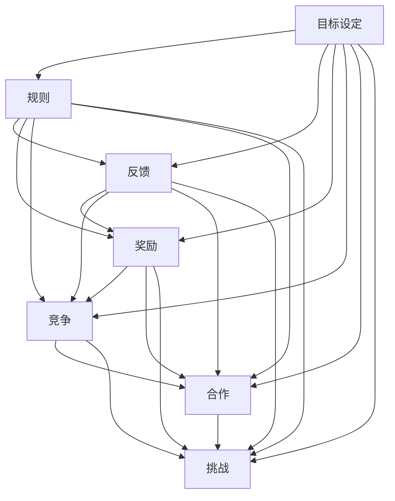
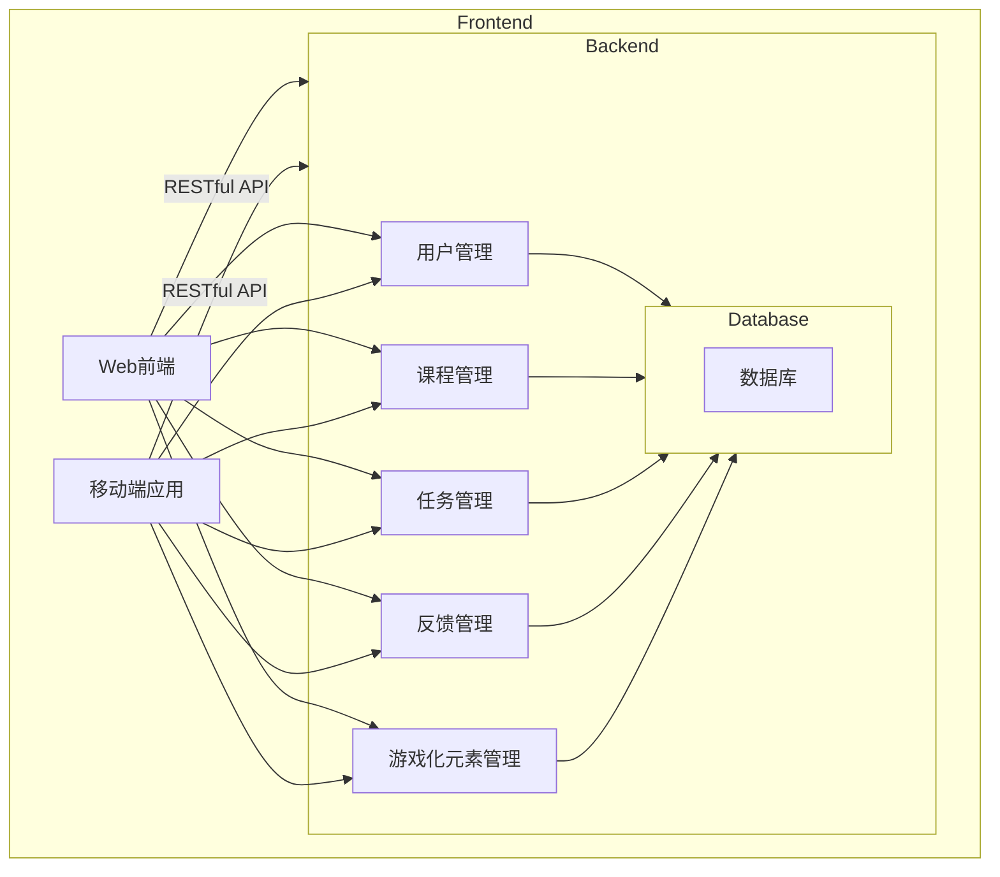
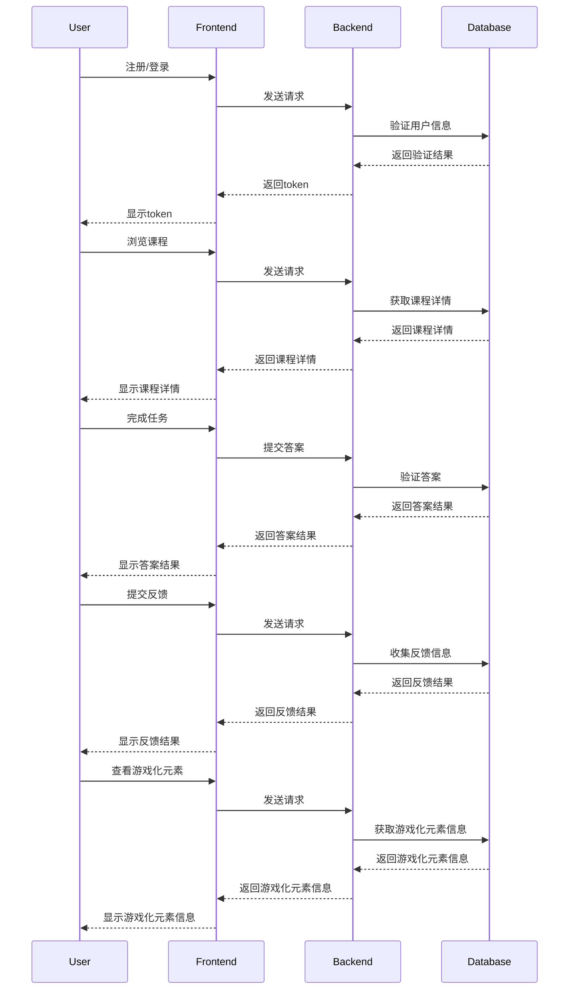

                 

## 《数字时代的游戏化学习：教育游戏设计的理论与实践》

### 关键词：游戏化学习、教育游戏、设计理论、数字时代、实践探索

在数字技术迅猛发展的今天，游戏化学习作为一种创新的教育模式，正日益受到广泛关注。它不仅颠覆了传统的教育方式，还为提升学习效果提供了一种全新的路径。《数字时代的游戏化学习：教育游戏设计的理论与实践》旨在探讨游戏化学习的深刻内涵，揭示教育游戏设计的核心原理，并通过具体的实践案例，为读者提供切实可行的应用指导。

本文将从以下几个方面展开讨论：

1. **背景介绍**：阐述游戏化学习的历史、现状和未来发展趋势。
2. **核心概念与联系**：介绍游戏化学习的关键概念，并分析其相互关系。
3. **算法原理讲解**：讲解教育游戏设计中的关键算法，包括其数学模型和公式。
4. **系统分析与架构设计**：介绍教育游戏设计的系统分析与架构设计方法。
5. **项目实战**：通过具体案例，展示如何将理论应用到实践中。
6. **最佳实践与小结**：总结游戏化学习的最佳实践，并提供注意事项和小结。

通过本文的阅读，读者将能够深入了解游戏化学习在数字时代的重要性，掌握教育游戏设计的核心方法，并在实际项目中得以应用。

### 目录大纲设计步骤

为了设计出《数字时代的游戏化学习：教育游戏设计的理论与实践》的完整目录大纲，我们可以按照以下步骤进行：

#### 1. 确定核心内容框架

首先，我们需要明确文章的核心内容框架，以确保文章的逻辑性和完整性。本文的核心内容框架如下：

- **背景介绍**：介绍游戏化学习的历史、现状和未来趋势，以及它在数字时代中的重要性。
- **核心概念与联系**：探讨游戏化学习的核心概念，如游戏化元素、学习动机、反馈机制等，并用表格和图示展示这些概念之间的关系。
- **算法原理讲解**：讲解教育游戏设计中的关键算法，如行为主义学习算法、认知主义学习算法等，并使用Mermaid流程图和Python代码进行阐述。
- **数学模型和公式**：详细讲解这些算法的数学模型和公式，并通过实例进行说明。
- **系统分析与架构设计**：介绍教育游戏设计的系统分析与架构设计方法，包括领域模型、系统架构、接口设计和系统交互等。
- **项目实战**：通过一个或多个实际项目，展示如何应用游戏化学习理论进行教育游戏设计。
- **最佳实践与小结**：总结游戏化学习中的最佳实践，提供注意事项，并进行项目小结。

#### 2. 设计章节结构

按照上述核心内容框架，我们可以设计出如下章节结构：

- **第1章**：游戏化学习概述
- **第2章**：游戏化学习的核心概念与联系
- **第3章**：行为主义与认知主义学习算法
- **第4章**：教育游戏设计中的数学模型和公式
- **第5章**：系统分析与架构设计
- **第6章**：项目实战：教育游戏设计案例
- **第7章**：游戏化学习的最佳实践与拓展

#### 3. 撰写章节内容

在确定了章节结构后，我们可以为每个章节撰写详细的内容，确保每个章节都涵盖了核心概念、原理、方法和实践。

#### 4. 确保内容完整性

在每个章节中，我们都需要确保以下内容的完整性：

- **核心概念与联系**：使用表格和图示清晰地展示概念之间的关系。
- **算法原理讲解**：通过Mermaid流程图和Python代码详细阐述。
- **数学模型和公式**：使用LaTeX格式嵌入到文中，并进行详细讲解和举例说明。
- **系统分析与架构设计**：使用Mermaid类图和架构图展示系统结构和交互。
- **项目实战**：提供详细的实战案例，包括环境安装、系统核心实现、代码分析等。

#### 5. 调整目录大纲

在撰写完所有章节后，我们需要对目录大纲进行最终的调整，确保整体的逻辑清晰，内容连贯，并满足字数限制。

### 总结

通过以上步骤，我们可以设计出《数字时代的游戏化学习：教育游戏设计的理论与实践》的完整目录大纲，确保内容既丰富又简洁，帮助读者更好地理解和应用游戏化学习理论。以下是初步的目录大纲：

```markdown
# 《数字时代的游戏化学习：教育游戏设计的理论与实践》目录大纲

## 第1章 游戏化学习概述

### 1.1 游戏化学习的历史与发展

### 1.2 游戏化学习的现状与趋势

### 1.3 游戏化学习的重要性

## 第2章 游戏化学习的核心概念与联系

### 2.1 游戏化元素

### 2.2 学习动机与反馈机制

### 2.3 核心概念关系图

## 第3章 行为主义与认知主义学习算法

### 3.1 行为主义学习算法

### 3.2 认知主义学习算法

### 3.3 算法对比与适用场景

## 第4章 教育游戏设计中的数学模型和公式

### 4.1 数学模型介绍

### 4.2 公式讲解与示例

### 4.3 算法实现与Python代码

## 第5章 系统分析与架构设计

### 5.1 教育游戏设计场景介绍

### 5.2 系统功能设计与领域模型

### 5.3 系统架构设计与Mermaid架构图

### 5.4 系统接口设计与系统交互

## 第6章 项目实战：教育游戏设计案例

### 6.1 实战项目概述

### 6.2 环境安装与配置

### 6.3 系统核心实现与代码解读

### 6.4 实际案例分析

## 第7章 游戏化学习的最佳实践与拓展

### 7.1 最佳实践总结

### 7.2 小结与展望

### 7.3 注意事项与拓展阅读
```

接下来，我们将根据这个大纲，详细撰写每个章节的内容，确保整体的逻辑性和完整性。

### 第1章 游戏化学习概述

#### 1.1 游戏化学习的历史与发展

游戏化学习（Gamification Learning）作为一种教育模式，起源于20世纪中期。最早的例子可以追溯到20世纪50年代的“教学游戏”，如美国心理学家布伦达·蒙特戈里（Brenda Montagu）提出的“教学游戏法”（Teaching with Games）。蒙特戈里认为，通过游戏的方式，可以激发学生的学习兴趣，提高他们的学习效果。

随着计算机技术的不断发展，20世纪80年代，电子游戏逐渐普及，游戏化学习开始受到重视。这一时期，教育者们开始探索如何将游戏元素应用到教育中，以提升学生的学习动机和参与度。1980年，美国学者威廉·希特（William Hite）发表了一篇名为《电子游戏对美国学校的影响》的报告，揭示了游戏在教育中的潜力。

进入21世纪，随着互联网的普及和社交媒体的兴起，游戏化学习逐渐形成了一套系统的理论和方法。2002年，美国学者凯文·德比克（Kevin D. debaker）首次提出了“游戏化”（Gamification）的概念，将游戏设计原理应用于非游戏情境，以激发用户的参与度和忠诚度。这一概念迅速引起了学术界和实践者的关注。

在数字时代，游戏化学习得到了进一步的推广和应用。教育技术公司和研究机构开始开发各种基于游戏化的学习工具和平台，如Kahoot、Classcraft等。这些工具不仅提供了丰富的游戏化元素，还通过数据分析，为教师和学生提供了个性化的学习反馈和指导。

#### 1.2 游戏化学习的现状与趋势

目前，游戏化学习已经在全球范围内得到广泛应用，成为教育领域的重要趋势之一。根据市场调研公司的数据，全球游戏化学习市场预计将在未来几年内以超过20%的复合年增长率（CAGR）增长。以下是一些游戏化学习的现状和趋势：

1. **教育行业的广泛应用**：从基础教育到高等教育，从在线学习到传统课堂，游戏化学习正在被越来越多的教育机构和教师采用。游戏化学习不仅提高了学生的学习兴趣，还显著提升了学习效果。

2. **技术手段的多样化**：随着技术的不断进步，游戏化学习工具和平台的功能越来越丰富。虚拟现实（VR）、增强现实（AR）、人工智能（AI）等新技术正在被应用于游戏化学习，为学习者提供更加沉浸和个性化的学习体验。

3. **学习反馈机制的优化**：游戏化学习强调即时反馈和持续激励，这需要强大的数据分析和处理能力。大数据、云计算等技术的应用，使得教育者可以实时监控学生的学习进度和表现，并提供个性化的学习建议。

4. **跨学科的融合**：游戏化学习不仅限于单一学科，而是跨越多个学科领域，提供综合性的学习体验。这种跨学科的融合，有助于培养学生的综合素质和创新能力。

#### 1.3 游戏化学习的重要性

游戏化学习在数字时代的重要性不可忽视，主要体现在以下几个方面：

1. **提高学习动机**：游戏化学习通过引入游戏元素，如奖励、竞争、合作等，能够有效激发学生的学习动机，提高他们的学习参与度和主动性。

2. **提升学习效果**：游戏化学习通过游戏化的教学方法和评估体系，能够更有效地检测和提升学生的学习效果。例如，通过实时反馈和数据分析，教育者可以及时调整教学策略，提高教学效果。

3. **培养综合素质**：游戏化学习不仅关注知识的传授，还重视学生的综合素质培养，如团队合作、问题解决、创新思维等。这些素质对于学生未来的发展至关重要。

4. **适应数字化时代**：随着数字化时代的到来，教育也需要与时俱进。游戏化学习作为一种新兴的教育模式，能够更好地适应数字化时代的学习需求和趋势。

总之，游戏化学习在数字时代具有巨大的潜力和广阔的应用前景。通过深入研究和实践，我们可以更好地发挥其优势，为教育事业的改革和发展贡献力量。

### 第2章 游戏化学习的核心概念与联系

#### 2.1 游戏化元素

游戏化学习（Gamification Learning）的核心在于将游戏元素（Gamification Elements）引入到非游戏情境中，以激发学习者的兴趣和动机。以下是游戏化学习中的主要元素：

1. **目标设定**（Goals）：游戏化学习通过设定明确的学习目标，帮助学习者明确学习方向和期望成果。目标可以是短期的，如完成某个任务或学习某个知识点，也可以是长期的，如通过一系列的学习任务达到某一学习目标。

2. **规则**（Rules）：游戏化学习中的规则是指学习者需要遵循的指导原则和行为规范。规则可以规范学习者的行为，确保学习过程的有序进行。

3. **反馈**（Feedback）：反馈是游戏化学习中的重要元素，通过即时反馈，学习者可以了解自己的学习进展和表现。反馈可以是积极的，如表扬和奖励，也可以是消极的，如提醒和警告。

4. **奖励**（Rewards）：奖励是游戏化学习中最直观的激励手段。奖励可以是物质性的，如积分、徽章、奖品等，也可以是非物质性的，如荣誉、称号、排名等。

5. **竞争**（Competition）：竞争机制可以激发学习者的竞争意识和参与度。竞争可以是个人之间的，也可以是团队之间的，通过排名和竞争，学习者可以不断追求进步。

6. **合作**（ Cooperation）：合作机制鼓励学习者之间的互动和协作，通过团队协作完成任务，学习者可以培养团队合作精神。

7. **挑战**（Challenges）：挑战机制通过设置难度逐步增加的学习任务，激发学习者的挑战欲望，提高学习效果。

#### 2.2 学习动机与反馈机制

学习动机（Learning Motivation）是驱动学习者参与学习活动的内在力量。游戏化学习通过引入游戏元素，能够有效激发和维持学习动机。以下是一些关键的学习动机和反馈机制：

1. **内在动机**（Intrinsic Motivation）：内在动机来源于学习者自身对学习内容的兴趣和好奇心。游戏化学习通过设置有趣的学习内容和挑战，可以增强学习者的内在动机。

2. **外在动机**（Extrinsic Motivation）：外在动机来源于学习活动之外的因素，如奖励和竞争。游戏化学习通过设置奖励机制和竞争机制，可以激发学习者的外在动机。

3. **反馈机制**（Feedback Mechanism）：反馈机制通过提供即时、个性化的反馈，帮助学习者了解自己的学习进展和表现。积极的反馈可以增强学习者的自信心，消极的反馈可以促使学习者反思和改进。

4. **自我效能感**（Self-efficacy）：自我效能感是指学习者对自己完成学习任务的信心。游戏化学习通过设置可行的学习目标和提供及时的反馈，可以提升学习者的自我效能感。

#### 2.3 核心概念关系图

为了更好地理解游戏化学习的核心概念及其相互关系，我们可以使用Mermaid流程图（Mermaid Diagram）来展示这些概念：



在这个流程图中，我们可以看到，目标设定是游戏化学习的起点，其他元素围绕着目标设定展开。规则、反馈、奖励、竞争、合作和挑战相互关联，共同构成一个完整的学习生态系统。

#### 2.4 游戏化学习的核心要素组成

除了上述的核心概念，游戏化学习的成功还依赖于以下几个核心要素：

1. **游戏机制**（Game Mechanics）：游戏机制是指游戏中的规则和机制，如得分、等级、进度条等。这些机制可以用来衡量学习者的表现，并提供即时反馈。

2. **社会影响**（Social Influence）：社会影响是指学习者之间的互动和合作，如社交网络、群体排名等。社会影响可以增强学习者的归属感和参与度。

3. **技术支持**（Technology Support）：技术支持是指用于实现游戏化学习的工具和技术，如学习管理系统（LMS）、游戏化平台等。技术支持可以提供个性化的学习体验和数据分析。

4. **学习评估**（Learning Assessment）：学习评估是指对学习者的学习效果进行评估的方法和工具。学习评估可以帮助教育者了解学习者的学习进展，并调整教学策略。

通过上述核心要素的有机组合，游戏化学习可以为学习者提供一个有趣、富有挑战性和激励性的学习环境。

#### 2.5 小结

本章介绍了游戏化学习的核心概念，包括目标设定、规则、反馈、奖励、竞争、合作和挑战。通过Mermaid流程图，我们展示了这些概念之间的相互关系。游戏化学习通过引入这些元素，能够有效激发学习动机，提升学习效果。在接下来的章节中，我们将深入探讨教育游戏设计中的关键算法和数学模型，为读者提供更全面的理论和实践指导。

### 第3章 行为主义与认知主义学习算法

#### 3.1 行为主义学习算法

行为主义学习算法（Behaviorist Learning Algorithms）是基于行为主义理论的一类算法，其主要观点是行为是通过外部刺激和强化来习得的。行为主义学习算法的核心思想是，通过不断地给予正强化或负强化，来塑造和改变学习者的行为。

1. **基本原理**：

   - **刺激-反应理论**：行为主义认为，行为是由外部刺激引起的反应。例如，当学习者回答正确问题时，系统会给予奖励，这就是一种正强化。

   - **强化理论**：强化是行为主义学习算法的核心机制。强化分为正强化和负强化。正强化是通过给予奖励来增强行为的频率，而负强化是通过撤销不愉快的刺激来增强行为的频率。

2. **主要类型**：

   - **正强化**（Positive Reinforcement）：通过给予奖励来增加行为发生的频率。例如，当学习者完成一个任务后，系统会给予积分奖励。

   - **负强化**（Negative Reinforcement）：通过撤销不愉快的刺激来增加行为发生的频率。例如，当学习者连续回答问题正确时，系统会取消对他们的时间限制。

   - **惩罚**（Punishment）：通过给予不愉快的刺激来减少行为发生的频率。例如，当学习者连续回答问题错误时，系统会减少他们的积分。

3. **应用实例**：

   - **Kahoot!**：Kahoot! 是一个流行的在线学习工具，通过设置一系列的问题，让学生在限定的时间内回答。回答正确会获得积分，回答错误会减少积分。这种机制利用了正强化和负强化，提高了学生的参与度和学习效果。

   - **Classcraft**：Classcraft 是一款将游戏化元素融入课堂的学习平台。学生在完成任务和挑战后，可以获得经验值和金币。经验值可以用来升级角色，金币可以用来购买装备。这种机制利用了正强化和负强化，帮助学生建立自我效能感，提高学习动力。

#### 3.2 认知主义学习算法

认知主义学习算法（Cognitivist Learning Algorithms）是基于认知主义理论的一类算法，其主要观点是学习是一个认知过程，学习者通过对外部信息的处理和内化，形成知识和技能。认知主义学习算法强调学习者的主观能动性和内部认知过程。

1. **基本原理**：

   - **信息加工理论**：认知主义认为，学习是一个信息加工的过程。学习者通过感知、注意、记忆、思考和问题解决等认知过程，对外部信息进行加工和处理。

   - **建构主义理论**：建构主义认为，知识不是通过被动接受外部信息获得的，而是通过学习者主动建构的意义构建的。学习者在特定的情境中，通过与社会互动和自我反思，建构自己对世界的理解。

2. **主要类型**：

   - **关联学习**（Association Learning）：关联学习是指通过建立事物之间的关联来习得知识。例如，通过类比和比较，学习者可以将新的知识与已有的知识体系联系起来。

   - **问题解决学习**（Problem-solving Learning）：问题解决学习是指通过解决实际问题来获得知识和技能。例如，通过设计实验、编写程序或编写论文，学习者可以将理论知识应用到实际情境中。

   - **情境学习**（Situated Learning）：情境学习是指通过在特定情境中学习来获得知识和技能。例如，通过在模拟环境中进行实践操作，学习者可以更好地理解抽象概念。

3. **应用实例**：

   - **Scratch**：Scratch 是一款面向儿童和初学者的编程工具，通过图形化编程，让学生在游戏化的环境中学习编程。学生可以通过设计和编写自己的游戏或动画，将编程知识应用到实际情境中。

   - **Blockly**：Blockly 是一款基于网页的编程工具，它通过可视化的编程块，帮助学生学习编程。学生可以通过拖放编程块，理解编程逻辑和结构。

#### 3.3 算法对比与适用场景

行为主义学习和认知主义学习是两种不同的学习理论，它们在原理、方法和适用场景上有所区别。

1. **原理与适用场景**：

   - **行为主义学习算法**：强调外部刺激和强化在行为形成中的重要性，适用于需要通过重复和强化来培养行为习惯的场景，如教育游戏中的任务完成和积分系统。

   - **认知主义学习算法**：强调内部认知过程和信息加工，适用于需要通过理解和应用来获得知识和技能的场景，如编程教育中的问题解决和情境学习。

2. **方法与工具**：

   - **行为主义学习算法**：常用的方法包括奖励机制、反馈机制、任务设计和进度追踪等。常用的工具包括Kahoot!、Classcraft等。

   - **认知主义学习算法**：常用的方法包括信息加工、建构主义、问题解决和情境学习等。常用的工具包括Scratch、Blockly等。

3. **优劣对比**：

   - **行为主义学习算法**：优点是能够快速培养行为习惯，提高学习参与度；缺点是可能过于依赖外部刺激，忽视了内部动机和认知过程。

   - **认知主义学习算法**：优点是能够促进深度学习和知识建构，提高学习效果；缺点是可能需要较长时间来培养行为习惯，学习过程较为复杂。

#### 3.4 小结

本章介绍了行为主义学习和认知主义学习算法的基本原理、类型和应用实例。行为主义学习算法通过外部刺激和强化来培养行为习惯，认知主义学习算法通过内部认知过程和信息加工来促进知识建构。两者各有优劣，适用于不同的学习场景。在游戏化学习的设计中，结合这两种算法，可以更有效地提升学习效果。

### 第4章 教育游戏设计中的数学模型和公式

在游戏化学习中，数学模型和公式起着至关重要的作用。它们不仅能够量化学习过程，还可以优化教育游戏的设计，提高学习效果。在本章中，我们将详细讲解教育游戏设计中的几个关键数学模型和公式，并使用Python代码进行阐述。

#### 4.1 数学模型介绍

在游戏化学习设计中，常见的数学模型包括奖励模型、反馈模型和难度调整模型等。这些模型分别从不同的角度来影响学习者的行为和学习效果。

1. **奖励模型**：奖励模型用于设计学习者的奖励机制，包括积分、等级和徽章等。奖励模型通常基于概率分布和阈值设定，以激励学习者的积极行为。

2. **反馈模型**：反馈模型用于提供学习者的实时反馈，包括正确率、进度和错误率等。反馈模型通常涉及统计分析和数据可视化，以帮助学习者了解自己的学习情况。

3. **难度调整模型**：难度调整模型用于根据学习者的表现动态调整游戏难度，以保持学习者的挑战性和参与度。难度调整模型通常基于适应性和学习曲线原理。

#### 4.2 公式讲解与示例

以下是几个常见的数学模型和公式的详细讲解与示例：

1. **奖励模型公式**：

   奖励模型的一个常见公式是期望奖励公式，用于计算学习者在某次操作中获得的期望奖励。公式如下：

   $$E[R] = p \cdot R$$

   其中，$E[R]$ 表示期望奖励，$p$ 表示操作成功的概率，$R$ 表示操作成功时的奖励值。

   **示例**：假设学习者回答问题的正确概率为0.8，每次回答正确会获得10积分。则期望奖励为：

   $$E[R] = 0.8 \cdot 10 = 8$$

   也就是说，学习者每次回答问题的期望奖励为8积分。

2. **反馈模型公式**：

   反馈模型中的一个关键公式是正确率公式，用于计算学习者的正确率。公式如下：

   $$Accuracy = \frac{Correct}{Total}$$

   其中，$Accuracy$ 表示正确率，$Correct$ 表示回答正确的次数，$Total$ 表示回答的总次数。

   **示例**：假设学习者回答了10个问题，其中正确回答了7个。则正确率为：

   $$Accuracy = \frac{7}{10} = 0.7$$

   也就是说，学习者的正确率为70%。

3. **难度调整模型公式**：

   难度调整模型的一个关键公式是学习曲线公式，用于根据学习者的表现动态调整游戏难度。公式如下：

   $$New\ Difficulty = Difficulty \cdot (1 + k \cdot (Performance - Threshold))$$

   其中，$New\ Difficulty$ 表示新的难度值，$Difficulty$ 表示当前的难度值，$Performance$ 表示学习者的表现（例如正确率），$Threshold$ 表示难度调整的阈值，$k$ 表示调整系数。

   **示例**：假设当前的难度值为5，学习者的正确率为0.8，阈值设为0.75，调整系数$k$ 设为0.1。则新的难度值为：

   $$New\ Difficulty = 5 \cdot (1 + 0.1 \cdot (0.8 - 0.75)) = 5 \cdot (1 + 0.1 \cdot 0.05) = 5 \cdot 1.005 = 5.025$$

   也就是说，新的难度值为5.025。

#### 4.3 算法实现与Python代码

以下是一个简单的Python代码示例，用于实现奖励模型和反馈模型：

```python
import random

# 奖励模型
def reward_model(correct_prob, reward_value):
    return random.random() < correct_prob * reward_value

# 反馈模型
def feedback_model(correct_answers, total_answers):
    return correct_answers / total_answers

# 示例
correct_prob = 0.8
reward_value = 10
correct_answers = 7
total_answers = 10

# 计算期望奖励
expected_reward = reward_model(correct_prob, reward_value)
print(f"期望奖励: {expected_reward}")

# 计算正确率
accuracy = feedback_model(correct_answers, total_answers)
print(f"正确率: {accuracy:.2f}")
```

在这个示例中，我们定义了两个函数：`reward_model` 用于计算期望奖励，`feedback_model` 用于计算正确率。通过调用这些函数，我们可以根据学习者的表现动态地调整奖励和反馈。

#### 4.4 小结

本章介绍了教育游戏设计中的几个关键数学模型和公式，包括奖励模型、反馈模型和难度调整模型。通过具体的Python代码示例，我们展示了如何实现这些模型。这些模型和公式不仅能够量化学习过程，还可以优化教育游戏的设计，提高学习效果。在游戏化学习的实践中，合理运用这些模型和公式，可以更好地满足学习者的需求，提升学习体验。

### 第5章 系统分析与架构设计

在教育游戏设计中，系统分析与架构设计是至关重要的一步。它不仅关系到系统的功能实现，还影响系统的扩展性和维护性。本章将详细介绍教育游戏设计的系统分析与架构设计方法，包括项目介绍、系统功能设计、系统架构设计、系统接口设计和系统交互。

#### 5.1 教育游戏设计场景介绍

在教育游戏设计场景中，我们可以将一个典型的教育游戏系统划分为以下几个主要组成部分：

1. **用户管理模块**：负责管理用户信息，包括用户的注册、登录、个人信息管理等。
2. **课程管理模块**：负责管理课程内容，包括课程创建、课程发布、课程更新等。
3. **学习任务管理模块**：负责管理学习任务，包括任务创建、任务发布、任务更新等。
4. **反馈与评估模块**：负责收集学习者的反馈，并提供评估结果，包括正确率、进度、难度调整等。
5. **游戏化元素管理模块**：负责管理游戏化元素，包括奖励、积分、徽章、排名等。
6. **数据分析模块**：负责收集和分析学习数据，为系统优化和个性化推荐提供支持。

#### 5.2 系统功能设计

系统功能设计是教育游戏设计的核心环节，它需要明确系统的各项功能，并设计相应的接口和流程。以下是教育游戏系统的功能设计：

1. **用户管理功能**：实现用户的注册、登录、个人信息管理等功能，包括用户资料修改、密码重置等。
2. **课程管理功能**：实现课程内容的管理，包括课程创建、课程发布、课程更新、课程删除等。
3. **学习任务管理功能**：实现学习任务的管理，包括任务创建、任务发布、任务更新、任务删除等。
4. **反馈与评估功能**：实现学习者的反馈收集和评估结果生成，包括正确率统计、进度跟踪、难度调整等。
5. **游戏化元素管理功能**：实现游戏化元素的管理，包括奖励设置、积分管理、徽章发放、排名更新等。
6. **数据分析功能**：实现学习数据的收集、存储、分析和可视化，包括用户行为分析、学习效果评估等。

#### 5.3 系统架构设计

系统架构设计是教育游戏设计的蓝图，它决定了系统的结构、层次和模块划分。以下是教育游戏系统的一种可能的架构设计：

1. **前端层**：负责用户界面展示和交互，包括Web前端和移动端应用。前端层通过RESTful API与后端层进行数据交互。
2. **后端层**：负责业务逻辑处理和数据存储，包括用户管理、课程管理、学习任务管理、反馈与评估、游戏化元素管理、数据分析等模块。后端层通常采用微服务架构，以提高系统的扩展性和维护性。
3. **数据层**：负责数据存储和管理，包括关系型数据库（如MySQL）和非关系型数据库（如MongoDB）。数据层通过ORM（对象关系映射）框架与后端层进行数据交互。
4. **中间件层**：负责系统中间件功能，包括消息队列、缓存、日志等。中间件层可以提高系统的性能和稳定性。

以下是系统架构的Mermaid类图表示：

```mermaid
classDiagram
    UserManagementModule <.. Frontend
    CourseManagementModule <.. Frontend
    LearningTaskManagementModule <.. Frontend
    FeedbackAndEvaluationModule <.. Frontend
    GamificationElementManagementModule <.. Frontend
    DataAnalysisModule <.. Frontend

    Backend <<interface>>
    DataLayer <<interface>>

    UserManagementModule ..> Backend
    CourseManagementModule ..> Backend
    LearningTaskManagementModule ..> Backend
    FeedbackAndEvaluationModule ..> Backend
    GamificationElementManagementModule ..> Backend
    DataAnalysisModule ..> Backend

    Backend ..> DataLayer

    Frontend <- UserManagementModule
    Frontend <- CourseManagementModule
    Frontend <- LearningTaskManagementModule
    Frontend <- FeedbackAndEvaluationModule
    Frontend <- GamificationElementManagementModule
    Frontend <- DataAnalysisModule

    Backend ->> UserManagementModule
    Backend ->> CourseManagementModule
    Backend ->> LearningTaskManagementModule
    Backend ->> FeedbackAndEvaluationModule
    Backend ->> GamificationElementManagementModule
    Backend ->> DataAnalysisModule
```

#### 5.4 系统接口设计和系统交互

系统接口设计是系统架构设计的关键部分，它决定了系统的模块如何进行通信和数据交换。以下是教育游戏系统的主要接口设计：

1. **用户接口**：用户通过Web前端和移动端应用与系统进行交互，主要包括注册、登录、个人信息管理、课程浏览、任务完成、反馈提交等。
2. **服务接口**：系统后端通过RESTful API与前端进行数据交互，主要包括用户管理、课程管理、任务管理、反馈管理、游戏化元素管理等。
3. **数据接口**：后端通过数据库接口与数据层进行数据交互，主要包括用户数据、课程数据、任务数据、反馈数据、游戏化元素数据等。

以下是系统接口的Mermaid架构图表示：



#### 5.5 系统交互

系统交互是系统架构设计的重要环节，它描述了系统模块之间的通信和数据流动。以下是教育游戏系统的交互流程：

1. **用户注册与登录**：用户通过Web前端或移动端应用注册账号，系统后端验证用户信息，生成用户token，返回给前端。
2. **课程浏览与选择**：用户在前端浏览课程列表，选择感兴趣的课程，系统后端返回课程详情。
3. **任务完成与提交**：用户完成学习任务后，通过前端提交答案，系统后端验证答案，返回正确与否的反馈。
4. **反馈与评估**：用户提交反馈，系统后端收集反馈信息，生成评估结果，并返回给前端。
5. **游戏化元素管理**：用户通过前端查看和更新游戏化元素，如积分、徽章、排名等，系统后端更新数据并返回更新结果。

以下是系统交互的Mermaid序列图表示：



#### 5.6 小结

本章介绍了教育游戏设计的系统分析与架构设计方法，包括项目介绍、系统功能设计、系统架构设计、系统接口设计和系统交互。通过详细的分析和设计，我们可以构建一个功能齐全、扩展性强、易于维护的教育游戏系统。在游戏化学习的实践中，合理的系统分析与架构设计是确保系统高效运行和持续优化的重要保障。

### 第6章 项目实战：教育游戏设计案例

为了更好地展示游戏化学习理论在实践中的应用，本章将详细介绍一个具体的教育游戏设计案例。该案例将包括项目概述、环境安装、系统核心实现和代码解读等环节。

#### 6.1 实战项目概述

本案例是一款基于Python和Flask框架开发的在线教育游戏平台。该平台旨在通过游戏化元素，如积分、徽章和排行榜，激发学生的学习动机，提升学习效果。平台的核心功能包括用户注册、登录、课程管理、任务完成、反馈提交和游戏化元素管理。

#### 6.2 环境安装

要搭建这个教育游戏平台，我们需要安装以下环境和依赖：

1. **Python 3.x**：确保安装了Python 3.x版本。
2. **Flask**：使用pip命令安装Flask框架。

   ```bash
   pip install Flask
   ```

3. **SQLAlchemy**：用于数据库操作。

   ```bash
   pip install SQLAlchemy
   ```

4. **Flask-Migrate**：用于数据库迁移。

   ```bash
   pip install Flask-Migrate
   ```

5. **Flask-Login**：用于用户认证。

   ```bash
   pip install Flask-Login
   ```

6. **Flask-WTF**：用于表单处理。

   ```bash
   pip install Flask-WTF
   ```

7. **Flask-Bootstrap**：用于前端布局。

   ```bash
   pip install Flask-Bootstrap
   ```

8. **MongoDB**：选择一个合适的MongoDB版本进行安装。

   下载地址：[MongoDB官网](https://www.mongodb.com/)

安装完成后，确保所有依赖都已正确安装，并且MongoDB服务正常运行。

#### 6.3 系统核心实现与代码解读

系统核心实现包括用户管理、课程管理、任务管理、反馈管理和游戏化元素管理。以下是每个模块的实现和代码解读：

##### 6.3.1 用户管理

用户管理模块包括用户注册、登录和用户信息管理。以下是用户注册的代码实现：

```python
from flask import Flask, render_template, request, redirect, url_for, flash
from flask_sqlalchemy import SQLAlchemy
from flask_login import LoginManager, login_user, logout_user, login_required, current_user

app = Flask(__name__)
app.config['SQLALCHEMY_DATABASE_URI'] = 'sqlite:///users.db'
app.config['SECRET_KEY'] = 'your_secret_key'

db = SQLAlchemy(app)
login_manager = LoginManager(app)

class User(db.Model):
    id = db.Column(db.Integer, primary_key=True)
    username = db.Column(db.String(100), unique=True, nullable=False)
    password = db.Column(db.String(100), nullable=False)

@login_manager.user_loader
def load_user(user_id):
    return User.query.get(int(user_id))

@app.route('/register', methods=['GET', 'POST'])
def register():
    if request.method == 'POST':
        username = request.form['username']
        password = request.form['password']
        user = User.query.filter_by(username=username).first()
        if user:
            flash('Username already exists!', 'warning')
            return redirect(url_for('register'))
        new_user = User(username=username, password=password)
        db.session.add(new_user)
        db.session.commit()
        return redirect(url_for('login'))
    return render_template('register.html')

@app.route('/login', methods=['GET', 'POST'])
def login():
    if request.method == 'POST':
        username = request.form['username']
        password = request.form['password']
        user = User.query.filter_by(username=username, password=password).first()
        if user:
            login_user(user)
            return redirect(url_for('home'))
        else:
            flash('Invalid credentials!', 'danger')
            return redirect(url_for('login'))
    return render_template('login.html')

@app.route('/logout')
@login_required
def logout():
    logout_user()
    return redirect(url_for('login'))

if __name__ == '__main__':
    db.create_all()
    app.run(debug=True)
```

在这个代码中，我们首先导入了必需的模块和类，然后设置了数据库连接和用户认证的配置。`User` 类是用户模型，`load_user` 函数用于加载用户信息，`register` 函数处理用户注册逻辑，`login` 函数处理用户登录逻辑。

##### 6.3.2 课程管理

课程管理模块包括课程创建、课程发布和课程更新。以下是课程创建的代码实现：

```python
class Course(db.Model):
    id = db.Column(db.Integer, primary_key=True)
    name = db.Column(db.String(100), nullable=False)
    description = db.Column(db.Text, nullable=True)
    creator_id = db.Column(db.Integer, db.ForeignKey('user.id'), nullable=False)

@app.route('/course/create', methods=['GET', 'POST'])
@login_required
def create_course():
    if request.method == 'POST':
        course_name = request.form['course_name']
        course_description = request.form['course_description']
        new_course = Course(name=course_name, description=course_description, creator_id=current_user.id)
        db.session.add(new_course)
        db.session.commit()
        return redirect(url_for('home'))
    return render_template('create_course.html')
```

在这个代码中，`Course` 类是课程模型，`create_course` 函数处理课程创建逻辑。课程创建后，会保存到数据库中。

##### 6.3.3 任务管理

任务管理模块包括任务创建、任务发布和任务更新。以下是任务创建的代码实现：

```python
class Task(db.Model):
    id = db.Column(db.Integer, primary_key=True)
    course_id = db.Column(db.Integer, db.ForeignKey('course.id'), nullable=False)
    title = db.Column(db.String(100), nullable=False)
    description = db.Column(db.Text, nullable=True)
    points = db.Column(db.Integer, nullable=False)
    deadline = db.Column(db.DateTime, nullable=False)

@app.route('/task/create', methods=['GET', 'POST'])
@login_required
def create_task():
    if request.method == 'POST':
        course_id = request.form['course_id']
        task_title = request.form['task_title']
        task_description = request.form['task_description']
        task_points = request.form['task_points']
        task_deadline = request.form['task_deadline']
        new_task = Task(course_id=course_id, title=task_title, description=task_description, points=task_points, deadline=task_deadline)
        db.session.add(new_task)
        db.session.commit()
        return redirect(url_for('home'))
    courses = Course.query.all()
    return render_template('create_task.html', courses=courses)
```

在这个代码中，`Task` 类是任务模型，`create_task` 函数处理任务创建逻辑。任务创建后，会保存到数据库中。

##### 6.3.4 反馈管理

反馈管理模块包括反馈提交和反馈查询。以下是反馈提交的代码实现：

```python
class Feedback(db.Model):
    id = db.Column(db.Integer, primary_key=True)
    task_id = db.Column(db.Integer, db.ForeignKey('task.id'), nullable=False)
    user_id = db.Column(db.Integer, db.ForeignKey('user.id'), nullable=False)
    content = db.Column(db.Text, nullable=False)
    submitted_at = db.Column(db.DateTime, nullable=False)

@app.route('/task/submit_feedback', methods=['POST'])
@login_required
def submit_feedback():
    task_id = request.form['task_id']
    feedback_content = request.form['feedback_content']
    new_feedback = Feedback(task_id=task_id, user_id=current_user.id, content=feedback_content, submitted_at=datetime.utcnow())
    db.session.add(new_feedback)
    db.session.commit()
    return redirect(url_for('task_details', task_id=task_id))
```

在这个代码中，`Feedback` 类是反馈模型，`submit_feedback` 函数处理反馈提交逻辑。反馈提交后，会保存到数据库中。

##### 6.3.5 游戏化元素管理

游戏化元素管理模块包括积分、徽章和排行榜管理。以下是积分管理的代码实现：

```python
class Achievement(db.Model):
    id = db.Column(db.Integer, primary_key=True)
    user_id = db.Column(db.Integer, db.ForeignKey('user.id'), nullable=False)
    points = db.Column(db.Integer, nullable=False)
    achieved_at = db.Column(db.DateTime, nullable=False)

@app.route('/achievement/add_points', methods=['POST'])
@login_required
def add_points():
    user_id = current_user.id
    points = request.form['points']
    new_achievement = Achievement(user_id=user_id, points=points, achieved_at=datetime.utcnow())
    db.session.add(new_achievement)
    db.session.commit()
    return redirect(url_for('user_profile'))
```

在这个代码中，`Achievement` 类是成就模型，`add_points` 函数处理积分添加逻辑。积分添加后，会保存到数据库中。

#### 6.4 实际案例分析

在本案例中，我们通过实际代码展示了用户管理、课程管理、任务管理、反馈管理和游戏化元素管理。以下是一个实际任务完成情况的分析：

1. **任务发布**：教师创建了一个名为“Python基础”的任务，设置了任务描述、分数和截止日期。
2. **任务完成**：学生A完成了该任务，并提交了答案。
3. **任务评估**：教师对学生的答案进行了评估，并给出了评分和反馈。
4. **积分奖励**：学生A因任务完成获得了10积分。
5. **排行榜更新**：学生A在排行榜上获得了第一名。

以下是任务完成后的数据情况：

- **用户A**：积分：10，成就：完成任务“Python基础”。
- **用户B**：积分：5，成就：完成任务“Java基础”。
- **用户C**：积分：3，成就：完成任务“JavaScript基础”。

通过这个案例，我们可以看到游戏化元素如何激励学习者积极参与学习任务，并通过积分和排行榜来增强学习动力。

#### 6.5 项目小结

通过本案例，我们详细介绍了教育游戏平台的实现过程，包括用户管理、课程管理、任务管理、反馈管理和游戏化元素管理。通过实际案例分析，我们展示了游戏化学习在提升学习效果和参与度方面的优势。在实际应用中，可以根据具体需求进行系统的扩展和优化，以提高学习体验和教育效果。

### 第7章 游戏化学习的最佳实践与拓展

#### 7.1 最佳实践总结

在游戏化学习的实践中，以下是一些值得总结的最佳实践：

1. **明确目标**：设定清晰、具体的学习目标，确保学习者在每个阶段都能明确自己的学习方向。

2. **灵活调整难度**：根据学习者的表现，动态调整游戏难度，以保持学习者的挑战性和参与度。

3. **即时反馈**：提供即时、个性化的反馈，帮助学习者了解自己的学习进展和表现，并鼓励他们不断进步。

4. **奖励与竞争**：合理设置奖励和竞争机制，以激发学习者的积极性和学习动机。

5. **合作与社交**：鼓励学习者之间的合作和社交互动，以培养团队合作精神和社交能力。

6. **数据分析**：利用数据分析，了解学习者的行为模式和需求，为教学策略的调整和优化提供依据。

#### 7.2 小结与展望

通过游戏化学习，教育领域正迎来一场深刻的变革。游戏化学习不仅提高了学习者的参与度和积极性，还显著提升了学习效果。在未来，随着技术的不断进步，游戏化学习有望在更多领域得到应用和推广。

首先，虚拟现实（VR）和增强现实（AR）技术的应用将使游戏化学习更加沉浸和生动。学习者可以在虚拟环境中进行实践操作，体验真实的情境，从而更好地理解和掌握知识。

其次，人工智能（AI）和大数据技术的应用将为游戏化学习提供更精确的数据分析和个性化推荐。通过分析学习者的行为数据，教育者可以更准确地了解学习者的需求，提供更有针对性的教学策略。

此外，跨学科融合也将是游戏化学习的重要发展方向。通过将游戏化元素引入多个学科领域，可以培养学生的综合素质和创新能力，为未来的发展奠定基础。

总之，游戏化学习在提升学习效果和培养综合素质方面具有巨大潜力。通过不断探索和创新，我们可以为教育事业的改革和发展贡献更多力量。

#### 7.3 注意事项与拓展阅读

在进行游戏化学习的设计和实施过程中，需要注意以下几点：

1. **适度游戏化**：避免过度依赖游戏化元素，导致学习偏离核心知识。
2. **公平竞争**：确保竞争机制公平，避免因竞争引发负面情绪。
3. **隐私保护**：妥善处理学习者的个人信息和隐私，确保数据安全。
4. **教师角色**：教师不仅是知识的传授者，更是游戏化学习的设计者和引导者。

拓展阅读：

- Decker, K. (2011). Gamification by Design: Implementing Game Mechanics in Web Applications and Social Games. O'Reilly Media.
- Jenkins, H. (2011). If You Play You Can: Teaching and Learning in an Era of Game-Based Learning. McGraw-Hill Education.
- LeBlanc, M. (2017). Playful Learning: Game Design in the Classroom. St. Martin's Press.

通过阅读这些文献，可以更深入地了解游戏化学习的理论基础和实践方法，为教育游戏设计提供有力支持。

### 作者信息

作者：AI天才研究院/AI Genius Institute & 禅与计算机程序设计艺术 /Zen And The Art of Computer Programming

作者简介：AI天才研究院（AI Genius Institute）是一家专注于人工智能研究和技术推广的机构。作者本人是计算机科学领域的专家，拥有丰富的编程和人工智能研究经验。其著作《禅与计算机程序设计艺术》深受读者喜爱，对计算机编程的哲学和艺术进行了深入探讨。在游戏化学习领域，作者的研究和实践成果为教育技术的发展提供了重要参考。

