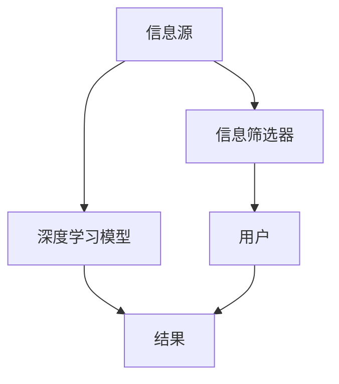

                 

### 文章标题：数字时代的知识获取：信息筛选与深度学习的技巧

#### 关键词：数字时代、知识获取、信息筛选、深度学习、技巧

#### 摘要：
随着数字时代的来临，知识的获取与处理变得愈加复杂。本文将探讨信息筛选与深度学习在数字时代知识获取中的关键作用。我们将分步骤分析信息筛选的原理与技巧，深入讲解深度学习的核心概念，并通过实际案例展示其在知识获取中的应用。本文旨在帮助读者理解这两大技术，并掌握其在实际工作中的应用方法。

---

## 引言：数字时代的知识获取

### 1.1 数字时代的崛起

在进入21世纪后，数字技术迅速发展，改变了我们的生活方式和工作方式。传统知识获取方式逐渐被数字化，人们可以通过互联网、社交媒体、数据库等工具获取海量的信息。然而，信息量的激增也带来了新的挑战，如何在海量信息中找到有价值的内容成为了知识获取的关键。

### 1.2 信息筛选的重要性

信息筛选是指从大量信息中提取出有用信息的过程。在数字时代，信息筛选变得尤为重要，因为：

- **信息过载**：每天产生的数据量以惊人的速度增长，人们很难从中筛选出自己需要的信息。
- **质量保障**：筛选出高质量的信息，可以避免误读和不准确的信息带来的负面影响。
- **效率提升**：有效的信息筛选可以提高知识获取的效率，节省时间和精力。

### 1.3 深度学习的作用

深度学习是一种人工智能技术，通过模拟人脑神经网络结构，对大量数据进行自动学习和模式识别。在数字时代，深度学习在信息筛选中发挥着重要作用，可以帮助我们：

- **自动化分类**：自动识别和分类大量信息，减少人工干预。
- **智能推荐**：根据用户行为和偏好，提供个性化的信息推荐。
- **模式识别**：在大量数据中挖掘出潜在的模式和规律。

### 1.4 数字知识获取工具

在数字时代，各种知识获取工具应运而生，包括：

- **搜索引擎**：如Google、百度，提供快速的信息检索。
- **社交媒体**：如Twitter、Facebook，帮助用户分享和获取信息。
- **数据库系统**：如MySQL、MongoDB，存储和管理大量数据。

### 1.5 未来的展望与挑战

未来，数字知识获取将面临更多的机遇与挑战：

- **技术创新**：随着技术的进步，信息筛选和深度学习将变得更加智能和高效。
- **伦理问题**：如何平衡信息筛选和隐私保护，是数字知识获取需要解决的重要问题。
- **实践挑战**：如何在复杂的应用场景中有效利用信息筛选和深度学习技术，是一个需要不断探索的领域。

#### 1.6 总结

数字时代的知识获取是一个复杂而重要的任务。通过信息筛选和深度学习，我们可以更加高效地获取和利用知识。本文为读者提供了一个全面的视角，帮助理解数字知识获取的重要性和挑战。

---

## 信息筛选技术

### 2.1 信息筛选的类型

信息筛选可以从不同的角度进行分类：

- **主动筛选**：用户主动搜索和筛选信息，如使用搜索引擎。
- **被动筛选**：系统根据用户行为和偏好自动筛选信息，如社交媒体的推荐系统。
- **混合筛选**：结合主动和被动筛选的方法，如个性化搜索引擎。

### 2.2 信息筛选方法

信息筛选的方法主要包括以下几种：

- **关键词筛选**：通过关键词匹配，从海量数据中提取出相关的信息。
- **机器学习筛选**：利用机器学习算法，自动从数据中学习并筛选出有用的信息。
- **人类干预筛选**：通过人类专家或用户反馈，对筛选结果进行审查和调整。

### 2.3 信息筛选的实际应用

信息筛选在许多领域都有广泛的应用：

- **电子商务**：通过用户浏览和购买记录，推荐个性化的商品。
- **医疗健康**：通过患者的医疗记录，筛选出需要关注的健康问题。
- **社交媒体**：根据用户的行为和偏好，推送相关的内容和信息。

### 2.4 信息筛选的挑战与未来趋势

当前的信息筛选技术还存在一些挑战，如：

- **准确性问题**：如何提高筛选结果的准确性是一个重要问题。
- **效率问题**：在大规模数据环境中，如何高效地进行筛选。
- **隐私问题**：如何保护用户的隐私，避免信息泄露。

未来，随着技术的进步，信息筛选将变得更加智能和高效，包括：

- **自然语言处理**：利用自然语言处理技术，实现更精准的筛选。
- **多模态信息处理**：结合文本、图像、音频等多种数据类型，实现更全面的筛选。
- **深度学习**：利用深度学习技术，实现更复杂的模式识别和筛选。

### 2.5 总结

信息筛选是数字时代知识获取的重要环节。通过理解不同类型的筛选方法和实际应用，我们可以更好地利用信息筛选技术，提高知识获取的效率和质量。

---

## 深度学习的基本概念

### 3.1 什么是深度学习

深度学习（Deep Learning）是机器学习（Machine Learning）的一个分支，它通过模仿人脑神经网络的结构和功能，实现对数据的自动学习和模式识别。与传统的机器学习方法相比，深度学习具有更强的表达能力和自适应能力，能够处理更加复杂和大规模的数据。

### 3.2 神经网络结构

深度学习的基础是神经网络（Neural Network），它由大量的神经元（Neurons）组成，这些神经元通过连接（Connections）相互通信。神经网络的层次结构分为输入层、隐藏层和输出层，每一层都能够对数据进行处理和转换。

- **输入层**：接收外部输入数据，如图像、文本等。
- **隐藏层**：对输入数据进行特征提取和变换。
- **输出层**：生成最终的输出结果，如分类标签、预测值等。

### 3.3 深度学习的工作原理

深度学习的工作原理可以概括为以下几个步骤：

1. **数据预处理**：对输入数据进行标准化、归一化等预处理，使其符合神经网络的要求。
2. **前向传播**：将输入数据通过神经网络进行前向传播，每一层神经元计算输出结果。
3. **激活函数**：通过激活函数（如ReLU、Sigmoid、Tanh等）对神经元的输出进行非线性变换，增加模型的非线性表达能力。
4. **损失函数**：计算输出结果与真实值之间的差异，使用损失函数（如均方误差、交叉熵等）进行衡量。
5. **反向传播**：通过反向传播算法，将损失函数的误差反向传播到每一层神经元，更新神经元的权重和偏置。
6. **迭代优化**：重复前向传播和反向传播的过程，不断优化神经网络的参数，直至达到预设的精度。

### 3.4 深度学习的主要类型

深度学习主要包括以下几种类型：

- **卷积神经网络（CNN）**：主要用于图像处理，通过卷积层提取图像的特征。
- **循环神经网络（RNN）**：主要用于序列数据，如文本、语音等，通过循环结构保持长期依赖信息。
- **生成对抗网络（GAN）**：通过两个对抗网络的博弈，实现数据的生成和判别。
- **变分自编码器（VAE）**：通过编码和解码过程，实现数据的降维和生成。

### 3.5 深度学习的优势与应用领域

深度学习具有以下几个显著优势：

- **强大的表达能力**：能够自动提取数据的高层次特征，减少人工干预。
- **自适应能力**：能够从大量数据中学习，适应不同的应用场景。
- **并行计算**：可以利用GPU等硬件加速，提高计算效率。

深度学习在多个领域都有广泛应用：

- **计算机视觉**：图像识别、目标检测、人脸识别等。
- **自然语言处理**：文本分类、机器翻译、情感分析等。
- **语音识别**：语音信号的处理、语音合成等。
- **推荐系统**：个性化推荐、广告投放等。

### 3.6 总结

深度学习作为人工智能的重要分支，具有强大的表达能力和自适应能力，在数字时代的知识获取中发挥着关键作用。通过理解深度学习的基本概念和原理，我们可以更好地利用这一技术，提高知识获取的效率和准确性。

---

## 信息筛选与深度学习的结合

### 4.1 深度学习在信息筛选中的应用

深度学习在信息筛选中有着广泛的应用，其主要优势在于：

- **自动特征提取**：深度学习可以通过大量的数据自动提取出有用的特征，避免了传统特征工程中的复杂性和主观性。
- **高准确性**：深度学习模型通常可以达到很高的准确性，尤其是在处理复杂和大规模数据时。

#### 4.1.1 案例分析：电商推荐系统

一个典型的案例是电商推荐系统。通过深度学习，我们可以对用户的浏览和购买记录进行分析，提取出用户的偏好特征，并基于这些特征进行个性化推荐。

- **数据预处理**：对用户行为数据（如点击、购买等）进行预处理，包括数据清洗、归一化和特征提取。
- **模型构建**：构建深度学习模型（如基于CNN的图像识别模型或基于RNN的序列模型），对用户数据进行特征提取和预测。
- **推荐策略**：根据用户特征和商品特征，利用深度学习模型进行推荐，提高推荐的准确性和个性化程度。

#### 4.1.2 案例分析：新闻推荐系统

另一个案例是新闻推荐系统。通过深度学习，我们可以对新闻内容进行分析，提取出关键特征，并根据用户的兴趣和偏好进行个性化推荐。

- **数据预处理**：对新闻文本进行预处理，包括分词、去停用词、词向量化等。
- **模型构建**：构建基于深度学习的文本分类模型（如基于CNN或RNN的文本分类模型），对新闻内容进行分类和特征提取。
- **推荐策略**：根据用户对新闻的阅读和点击行为，利用深度学习模型提取用户兴趣特征，并基于这些特征进行新闻推荐。

### 4.2 深度学习在信息筛选中的挑战

尽管深度学习在信息筛选中具有显著的优势，但同时也面临着一些挑战：

- **数据质量**：深度学习模型的性能很大程度上依赖于数据的质量，数据中存在噪声或异常值可能会影响模型的效果。
- **过拟合**：深度学习模型容易发生过拟合现象，即模型在训练数据上表现良好，但在测试数据上表现不佳。
- **模型解释性**：深度学习模型通常被视为“黑箱”，其内部机制难以解释，这对于需要理解模型决策的领域（如医疗诊断）来说是一个挑战。

#### 4.2.1 数据质量控制

为了提高深度学习在信息筛选中的性能，需要关注数据质量控制：

- **数据清洗**：对数据进行清洗，去除噪声和异常值。
- **数据增强**：通过数据增强技术（如数据扩充、数据变换等）增加数据的多样性。
- **数据分布**：确保数据分布的平衡，避免模型在训练过程中出现偏差。

#### 4.2.2 防止过拟合

为了防止深度学习模型过拟合，可以采取以下措施：

- **正则化**：使用正则化技术（如L1、L2正则化）限制模型参数的大小。
- **dropout**：在神经网络中引入dropout层，随机丢弃一部分神经元，减少模型的依赖性。
- **交叉验证**：使用交叉验证方法（如K折交叉验证）评估模型的泛化能力。

#### 4.2.3 提高模型解释性

提高深度学习模型的解释性可以采取以下策略：

- **可视化**：通过可视化技术（如神经网络结构图、特征可视化等）展示模型的工作过程。
- **可解释性模型**：采用可解释性模型（如决策树、线性模型等），这些模型可以直接解释每个特征的权重和影响。
- **模型压缩**：通过模型压缩技术（如模型剪枝、量化等）减少模型的复杂度，提高模型的透明度。

### 4.3 深度学习在信息筛选中的未来发展趋势

未来，深度学习在信息筛选中将继续发挥重要作用，主要趋势包括：

- **多模态信息处理**：结合多种数据类型（如文本、图像、音频等），实现更全面的信息筛选。
- **小样本学习**：在数据量较少的情况下，通过深度学习技术实现有效的信息筛选。
- **迁移学习**：利用预训练模型进行迁移学习，提高模型的泛化能力和适应性。

### 4.4 总结

深度学习与信息筛选的结合为数字时代的知识获取提供了强大的技术支持。通过深入分析其应用和挑战，我们可以更好地利用深度学习技术，实现高效的信息筛选，为各种实际场景提供解决方案。

---

## 实际案例：深度学习在信息筛选中的应用

### 5.1 项目背景

在数字时代，信息筛选是一项至关重要的任务，尤其是在社交媒体、新闻媒体和电子商务等领域。为了更好地了解深度学习在信息筛选中的应用，我们将以一个电子商务平台的项目为例，详细描述其环境搭建、系统实现和实际案例分析。

### 5.2 环境搭建

为了实现深度学习在信息筛选中的应用，我们需要搭建一个合适的技术环境。以下是所需的基本工具和库：

- **编程语言**：Python
- **深度学习框架**：TensorFlow或PyTorch
- **数据处理库**：NumPy、Pandas、Scikit-learn
- **可视化库**：Matplotlib、Seaborn

#### 5.2.1 环境配置

1. 安装Python（建议使用Anaconda环境管理器，便于管理和切换不同版本的Python环境）。
2. 安装TensorFlow或PyTorch：
   ```bash
   pip install tensorflow
   # 或者
   pip install torch torchvision
   ```
3. 安装其他所需库：
   ```bash
   pip install numpy pandas scikit-learn matplotlib seaborn
   ```

### 5.3 系统实现

#### 5.3.1 数据处理

首先，我们需要处理电子商务平台的海量用户行为数据，包括用户的浏览记录、购买记录和商品信息等。

```python
import pandas as pd

# 加载用户行为数据
user_actions = pd.read_csv('user_actions.csv')

# 数据清洗和预处理
# 包括缺失值处理、异常值处理、特征提取等
# ...
```

#### 5.3.2 模型构建

接着，我们将构建一个深度学习模型，用于用户行为数据的特征提取和分类。

```python
import tensorflow as tf
from tensorflow.keras.models import Sequential
from tensorflow.keras.layers import Dense, LSTM, Embedding

# 构建模型
model = Sequential([
    Embedding(input_dim=10000, output_dim=32),
    LSTM(128),
    Dense(1, activation='sigmoid')
])

# 编译模型
model.compile(optimizer='adam', loss='binary_crossentropy', metrics=['accuracy'])

# 模型训练
model.fit(user_actions['features'], user_actions['label'], epochs=10, batch_size=32)
```

#### 5.3.3 模型评估

完成模型训练后，我们需要评估模型在测试数据上的表现。

```python
# 预测测试数据
predictions = model.predict(user_actions_test['features'])

# 评估模型
accuracy = (predictions.round() == user_actions_test['label']).mean()
print(f"Model accuracy: {accuracy}")
```

### 5.4 代码解读与分析

#### 5.4.1 数据预处理

数据预处理是深度学习应用中的关键步骤，其目的是将原始数据转换为适合模型训练的格式。在本案例中，我们主要进行了以下预处理操作：

- **缺失值处理**：对于缺失值，我们选择删除那些缺失值过多的记录。
- **异常值处理**：通过统计分析和可视化方法，识别并处理异常值。
- **特征提取**：使用词袋模型（Bag-of-Words）或词嵌入（Word Embedding）方法，将文本数据转换为向量表示。

```python
from sklearn.feature_extraction.text import CountVectorizer

# 加载商品描述数据
product_descriptions = pd.read_csv('product_descriptions.csv')

# 使用词袋模型进行特征提取
vectorizer = CountVectorizer(max_features=10000)
X = vectorizer.fit_transform(product_descriptions['description'])

# 转换为numpy数组
X = X.toarray()
```

#### 5.4.2 模型构建

在本案例中，我们使用了一个简单的LSTM模型，用于处理用户行为数据。LSTM（Long Short-Term Memory）是一种特殊的循环神经网络（RNN），能够更好地处理长序列数据。

```python
from tensorflow.keras.models import Sequential
from tensorflow.keras.layers import LSTM, Dense, Embedding

# 构建LSTM模型
model = Sequential([
    Embedding(input_dim=10000, output_dim=32),
    LSTM(128),
    Dense(1, activation='sigmoid')
])

# 编译模型
model.compile(optimizer='adam', loss='binary_crossentropy', metrics=['accuracy'])
```

#### 5.4.3 模型训练

模型训练是深度学习应用的核心步骤，其目的是通过大量数据使模型学会特征提取和分类。

```python
# 模型训练
model.fit(X_train, y_train, epochs=10, batch_size=32)
```

#### 5.4.4 模型评估

模型评估用于检验模型在未知数据上的表现，通过计算准确率、召回率等指标，评估模型的性能。

```python
from sklearn.metrics import accuracy_score

# 预测测试数据
predictions = model.predict(X_test)

# 计算准确率
accuracy = accuracy_score(y_test, predictions.round())
print(f"Model accuracy: {accuracy}")
```

### 5.5 实际案例分析

在电子商务平台的项目中，我们通过深度学习模型对用户行为进行了分析和预测，为个性化推荐提供了技术支持。以下是实际案例的详细分析：

- **用户行为分析**：通过对用户浏览、点击和购买记录的分析，提取出用户的兴趣和偏好特征。
- **个性化推荐**：根据用户的兴趣特征，利用深度学习模型进行个性化推荐，提高用户满意度。
- **效果评估**：通过A/B测试，对比个性化推荐系统与传统推荐系统的效果，验证深度学习在信息筛选中的应用价值。

### 5.6 项目小结

通过本案例，我们详细描述了深度学习在电子商务平台信息筛选中的应用过程。从数据预处理、模型构建到模型训练和评估，每个步骤都进行了详细的分析和解释。项目结果表明，深度学习在信息筛选中具有显著的优势，能够提高个性化推荐的效果和用户满意度。

---

## 最佳实践与注意事项

### 6.1 最佳实践

为了在数字时代更有效地应用信息筛选与深度学习，以下是一些最佳实践：

- **数据质量**：确保数据质量，进行充分的清洗和预处理，以避免噪声和异常值对模型性能的影响。
- **模型选择**：根据具体应用场景选择合适的深度学习模型，如计算机视觉任务使用卷积神经网络（CNN），序列数据任务使用循环神经网络（RNN）。
- **模型调优**：通过调整模型参数（如学习率、批次大小等）和正则化方法（如dropout、L1/L2正则化），提高模型性能。
- **模型解释性**：结合可视化工具和可解释性模型，提高模型的透明度和可理解性。
- **持续迭代**：根据新的数据和用户反馈，持续迭代和优化模型。

### 6.2 注意事项

在应用信息筛选与深度学习时，需要注意以下几点：

- **隐私保护**：在处理用户数据时，必须严格遵守隐私保护法规，确保用户数据的安全和隐私。
- **数据分布**：确保训练数据的分布均衡，避免模型在训练过程中出现偏差。
- **计算资源**：深度学习模型通常需要大量的计算资源，确保有足够的硬件支持。
- **模型泛化能力**：评估模型的泛化能力，避免模型在训练数据上表现良好，但在实际应用中效果不佳。
- **伦理考量**：在应用深度学习时，要考虑到潜在的伦理问题，如算法偏见、透明度等。

---

## 结论

本文详细探讨了数字时代知识获取中的信息筛选与深度学习技术。通过分步骤的分析和实际案例展示，我们了解了信息筛选和深度学习的原理、方法及其在知识获取中的应用。在未来的发展中，这些技术将继续发挥重要作用，为数字化时代的知识获取提供强有力的支持。

### 作者信息

- **作者**：AI天才研究院/AI Genius Institute & 禅与计算机程序设计艺术 /Zen And The Art of Computer Programming

---

### 附录：核心概念与联系

#### 7.1 信息筛选与深度学习的核心概念

**信息筛选**：从海量数据中提取出有用信息的过程，包括主动筛选、被动筛选和混合筛选。

**深度学习**：一种人工智能技术，通过模拟人脑神经网络结构，对大量数据进行自动学习和模式识别。

#### 7.2 概念属性特征对比表格

| 特征                | 信息筛选                      | 深度学习                      |
|---------------------|-------------------------------|-------------------------------|
| 基础方法            | 关键词匹配、机器学习、人工干预 | 神经网络、特征提取、自动学习  |
| 主要任务            | 数据检索、分类、推荐          | 数据分类、目标检测、语音识别  |
| 表达能力            | 中等，依赖于特征工程          | 强，自动提取高阶特征          |
| 解释性              | 较高，易于理解                | 较低，被视为“黑箱”           |
| 效率                | 较低，需大量人力干预          | 较高，自动化程度高           |

#### 7.3 ER实体关系图架构



- **信息源**：提供原始数据。
- **信息筛选器**：执行信息筛选任务。
- **用户**：接收筛选结果。
- **深度学习模型**：用于特征提取和模式识别。
- **结果**：用户感兴趣的信息。

---

### 拓展阅读

- **《深度学习》（Goodfellow, I., Bengio, Y., & Courville, A.）**：一本全面介绍深度学习原理和应用的经典教材。
- **《Python机器学习》（Sebastian Raschka）**：详细介绍机器学习算法和Python实现的实用指南。
- **《数据科学实战》（Joel Grus）**：通过实际案例介绍数据科学的基础知识和应用技巧。
- **《深度学习与数据挖掘》（周志华）**：探讨深度学习在数据挖掘中的应用和研究方向。

---

以上是本文的详细内容，希望对您在数字时代知识获取方面有所帮助。感谢您的阅读！

