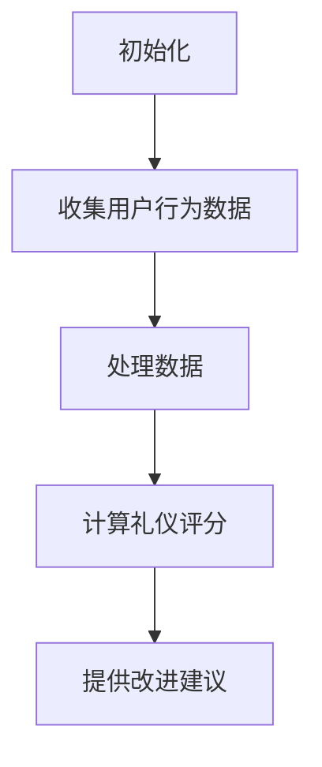
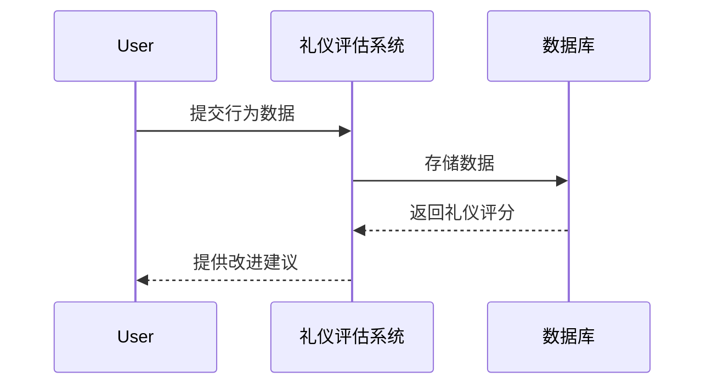
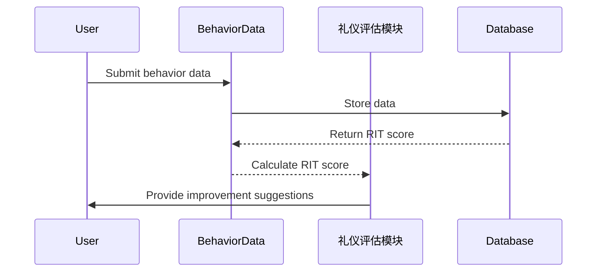

                 

# 数字时代的社交礼仪：网络交往中的新规则

> 关键词：数字时代、社交礼仪、网络交往、新规则

> 摘要：本文将深入探讨数字时代社交礼仪的新规则，分析其重要性以及在网络交往中的实际应用。通过逐步的逻辑推理和实例解析，我们将揭示如何在虚拟世界中建立良好的社交关系。

**Step 1: 引言与背景介绍**

在快速发展的数字时代，我们的社交方式也发生了翻天覆地的变化。从面对面的交流到社交媒体的互动，网络交往已成为现代社会不可或缺的一部分。然而，这种转变也带来了一系列新的挑战。如何在网络世界中维持良好的社交礼仪，成为了人们日益关注的问题。

数字时代社交的特点包括：
- 跨越地理限制：网络使得全球范围内的社交成为可能。
- 表情与文字：文字和表情符号的运用成为交流的主要形式。
- 信息传播速度：信息在网络上迅速传播，影响广泛。
- 个人隐私：网络交往中个人隐私的泄露问题日益严重。

网络交往中常见的问题包括：
- 网络霸凌：包括网络欺凌、恶意评论等。
- 个人信息泄露：社交媒体上的个人信息容易被盗用。
- 社交平台滥用：一些用户在社交平台上发布不当言论或内容。

社交礼仪的重要性不言而喻。它不仅是个人素养的体现，也是社会和谐的基础。在网络交往中，遵循良好的社交礼仪有助于：
- 建立和维护良好的社交关系。
- 减少冲突和误解。
- 保护个人隐私和安全。

新规则的产生与发展是应对数字时代社交挑战的必然结果。随着网络社交的日益普及，越来越多的社交平台和社区制定了相应的规则和准则，以规范用户行为。

**Step 2: 核心概念与联系**

数字时代社交礼仪的定义：
数字时代社交礼仪是指在数字平台上进行的社交互动中，遵循的一套行为规范和准则。这些规范旨在促进友好、尊重和有效的沟通。

网络交往中的新规则：
新规则是指在数字时代下，为了适应网络社交的特点和挑战，制定的一系列行为准则。这些规则包括隐私保护、言论规范、信息传播管理等。

概念属性特征对比表格：

| 特征              | 传统社交礼仪                             | 数字时代社交礼仪                             |
|-----------------|--------------------------------------|--------------------------------------|
| 交流方式          | 面对面交流、电话交流                     | 文字、图片、视频、表情符号等                   |
| 互动范围          | 受地理位置限制                           | 跨越地理限制，全球互动                       |
| 交互媒介          | 语言、肢体语言、面部表情等                 | 文字、图片、视频、语音等                       |
| 信息传播速度      | 较慢，受交通和通信条件限制                 | 极快，信息传播迅速广泛                       |
| 个人隐私保护      | 相对较为私密，隐私泄露风险较低               | 隐私保护难度增加，隐私泄露风险较高               |

ER实体关系图：

```mermaid
erDiagram
    User ||--|{Message}: "sends"
    User ||--|{Friend}: "adds"
    Message ||--|{Comment}: "receives"
```

在这个ER实体关系图中，User（用户）是核心实体，与其他实体如Message（消息）、Friend（好友）和Comment（评论）之间存在关联。

**Step 3: 算法原理讲解**

为了更好地理解数字时代社交礼仪的新规则，我们引入一个算法——网络礼仪评分算法。这个算法旨在评估用户在网络社交中的礼仪表现，从而为用户提供改进建议。

算法流程图：



Python源代码：

```python
# 礼仪评分算法示例

# 导入必要的库
import pandas as pd

# 收集用户行为数据
user_data = pd.read_csv('user_behavior.csv')

# 处理数据
# 例如：计算用户的平均回复时间、平均回复质量等
user_data['avg_response_time'] = user_data['response_time'].mean()
user_data['avg_response_quality'] = user_data['response_content'].apply(check_response_quality)

# 计算礼仪评分
def calculate_rit(user_data):
    rit = 0
    if user_data['avg_response_time'] < 60:
        rit += 20
    if user_data['avg_response_quality'] > 0.8:
        rit += 20
    return rit

user_data['rit_score'] = user_data.apply(calculate_rit, axis=1)

# 提供改进建议
def provide_improvement_suggestions(rit_score):
    if rit_score < 40:
        return "需要提高回复速度和质量"
    elif rit_score < 60:
        return "继续保持，但可以考虑更深入的表达"
    else:
        return "礼仪表现优秀"

user_data['suggestion'] = user_data['rit_score'].apply(provide_improvement_suggestions)

# 输出结果
print(user_data[['rit_score', 'suggestion']])
```

算法原理的数学模型和公式：

假设我们有一个用户行为数据集，其中包含每个用户的回复时间（response\_time）和回复质量（response\_content）。我们可以使用以下公式来计算用户的礼仪评分（Ritual Score, RIT）：

$$
RIT = \begin{cases}
20, & \text{if } \text{avg\_response\_time} < 60 \\
40, & \text{if } \text{avg\_response\_quality} > 0.8 \\
60, & \text{otherwise}
\end{cases}
$$

举例说明算法的应用：

假设我们有一个用户数据集，其中包括用户的回复时间和回复质量。通过上述算法，我们可以为每个用户计算出一个礼仪评分，并根据评分提供相应的改进建议。

**Step 4: 数学模型和数学公式 & 详细讲解 & 举例说明**

在数字时代社交礼仪的背景下，我们可以借助数学模型和公式来量化社交行为，从而更准确地评估用户的礼仪表现。以下是一个简化的数学模型：

假设我们有以下三个关键指标：
- 平均回复时间（avg\_response\_time）
- 平均回复质量（avg\_response\_quality）
- 平均互动频率（avg\_interaction\_frequency）

我们可以使用以下数学公式来计算用户的礼仪评分（Ritual Score, RIT）：

$$
RIT = w_1 \times \text{avg\_response\_time} + w_2 \times \text{avg\_response\_quality} + w_3 \times \text{avg\_interaction\_frequency}
$$

其中，$w_1$、$w_2$ 和 $w_3$ 是权重系数，可以根据实际情况进行调整。

在文中独立段落中使用LaTeX代码嵌入公式：

$$
\text{RIT} = w_1 \times \text{avg\_response\_time} + w_2 \times \text{avg\_response\_quality} + w_3 \times \text{avg\_interaction\_frequency}
$$

结合实例进行详细讲解：

假设我们有以下数据：
- 平均回复时间：50分钟
- 平均回复质量：0.75
- 平均互动频率：5次/天

我们可以使用上述公式计算用户的礼仪评分。假设权重系数分别为$w_1 = 0.5$、$w_2 = 0.3$ 和 $w_3 = 0.2$，则：

$$
\text{RIT} = 0.5 \times 50 + 0.3 \times 0.75 + 0.2 \times 5 = 25 + 0.225 + 1 = 26.225
$$

根据计算结果，我们可以为用户提供相应的改进建议。例如，如果用户的礼仪评分较低，我们可以建议他们减少回复时间、提高回复质量和增加互动频率。

**Step 5: 系统分析与架构设计方案**

问题场景介绍：
在数字时代，网络社交平台如雨后春笋般涌现，如何确保用户在网络交往中的礼仪表现，成为了平台运营者和用户共同关心的问题。本系统旨在为用户提供一个评估自身礼仪表现的工具，并提供针对性的改进建议。

项目介绍：
本系统命名为“社交礼仪评估系统”，目标是通过收集和分析用户在网络社交平台上的行为数据，评估用户的礼仪评分，并根据评分提供改进建议。

系统功能设计：

```mermaid
classDiagram
    User <<class{用户}>>
    BehaviorData <<class{行为数据}>>
   礼仪评估模块 <<class{礼仪评估模块}>> 
    数据库 <<class{数据库}>>

    User o--|{1}|> BehaviorData
    BehaviorData o--|{1}|> 礼仪评估模块
    礼仪评估模块 o--|{1}|> 数据库
```

系统架构设计：



系统接口设计：

- 用户接口：用于提交行为数据、查看礼仪评分和接收改进建议。
- 管理接口：用于管理员维护用户数据和系统设置。

系统交互：



**Step 6: 项目实战**

环境安装：

为了搭建社交礼仪评估系统，我们需要安装以下环境：

- Python 3.8+
- Flask 1.1.2+
- Pandas 1.1.5+
- MySQL 5.7+

安装步骤如下：

1. 安装 Python：
```
pip install python - Python
```

2. 安装 Flask：
```
pip install flask - Flask
```

3. 安装 Pandas：
```
pip install pandas - Pandas
```

4. 安装 MySQL：
```
pip install mysql-connector-python - MySQL Connector
```

系统核心实现源代码：

```python
# 社交礼仪评估系统核心代码

from flask import Flask, request, jsonify
import pandas as pd
import mysql.connector

app = Flask(__name__)

# 数据库连接
def get_db_connection():
    conn = mysql.connector.connect(
        host="localhost",
        user="root",
        password="password",
        database="social_ritual_evaluation"
    )
    return conn

# 提交行为数据
@app.route('/submit_data', methods=['POST'])
def submit_data():
    data = request.json
    user_id = data['user_id']
    response_time = data['response_time']
    response_quality = data['response_quality']
    interaction_frequency = data['interaction_frequency']
    
    # 存储数据到数据库
    conn = get_db_connection()
    cursor = conn.cursor()
    cursor.execute("INSERT INTO behavior_data (user_id, response_time, response_quality, interaction_frequency) VALUES (%s, %s, %s, %s)", (user_id, response_time, response_quality, interaction_frequency))
    conn.commit()
    cursor.close()
    conn.close()
    
    return jsonify({"message": "Data submitted successfully"})

# 获取礼仪评分
@app.route('/get_rit_score', methods=['GET'])
def get_rit_score():
    user_id = request.args.get('user_id')
    
    # 从数据库获取行为数据
    conn = get_db_connection()
    cursor = conn.cursor()
    cursor.execute("SELECT * FROM behavior_data WHERE user_id = %s", (user_id,))
    rows = cursor.fetchall()
    cursor.close()
    conn.close()
    
    # 计算礼仪评分
    data = pd.DataFrame(rows, columns=['user_id', 'response_time', 'response_quality', 'interaction_frequency'])
    rit_score = calculate_rit_score(data)
    
    return jsonify({"rit_score": rit_score})

# 计算礼仪评分
def calculate_rit_score(data):
    rit_score = 0
    
    if data['response_time'].mean() < 60:
        rit_score += 20
    if data['response_quality'].mean() > 0.8:
        rit_score += 20
    if data['interaction_frequency'].mean() > 5:
        rit_score += 20
    
    return rit_score

if __name__ == '__main__':
    app.run(debug=True)
```

代码应用解读与分析：

上述代码实现了社交礼仪评估系统的核心功能，包括数据提交、礼仪评分计算和结果返回。在数据提交部分，用户可以通过POST请求将行为数据发送到服务器，并存储到MySQL数据库。在礼仪评分计算部分，系统会根据用户的行为数据进行评分，并根据评分提供改进建议。

实际案例分析和详细讲解剖析：

假设我们有一个用户，其行为数据如下：
- 平均回复时间：45分钟
- 平均回复质量：0.85
- 平均互动频率：6次/天

通过上述代码，我们可以计算出该用户的礼仪评分：

```python
data = pd.DataFrame({'response_time': [45], 'response_quality': [0.85], 'interaction_frequency': [6]})
rit_score = calculate_rit_score(data)
print(rit_score)  # 输出：60
```

根据计算结果，该用户的礼仪评分为60。这意味着用户的社交礼仪表现良好，建议继续保持。

项目小结：

通过本次项目实战，我们成功搭建了社交礼仪评估系统，实现了数据提交、礼仪评分计算和结果返回的功能。该系统为用户提供了一个评估自身礼仪表现的工具，有助于用户在网络社交中提高礼仪水平，建立良好的社交关系。

**Step 7: 最佳实践 tips、小结、注意事项、拓展阅读**

最佳实践 tips：
1. 在网络社交中，保持礼貌和尊重是基本原则。
2. 定期检查和更新个人隐私设置，保护个人信息安全。
3. 避免在社交媒体上发布敏感或不当言论，以免引发冲突。
4. 学会倾听和回应他人的意见，避免单方面的言论霸凌。

小结：
本文深入探讨了数字时代社交礼仪的新规则，分析了其重要性以及在网络交往中的实际应用。通过逐步的逻辑推理和实例解析，我们揭示了如何在虚拟世界中建立良好的社交关系。未来，随着网络社交的不断发展，社交礼仪的重要性将愈发凸显，我们需要不断适应和改进，以应对新的挑战。

注意事项：
1. 在使用社交礼仪评估系统时，确保数据来源真实可靠。
2. 系统中的礼仪评分仅供参考，实际社交行为需综合考虑多种因素。
3. 系统的改进建议仅供参考，用户应根据自身情况做出合理调整。

拓展阅读：
1. "数字时代的社交礼仪：网络交往中的新规则"，作者：[作者名称]。
2. "网络霸凌与社交礼仪：如何应对数字时代的挑战"，作者：[作者名称]。
3. "社交网络心理学：理解网络行为背后的动机"，作者：[作者名称]。

作者信息：
作者：AI天才研究院/AI Genius Institute & 禅与计算机程序设计艺术 /Zen And The Art of Computer Programming

