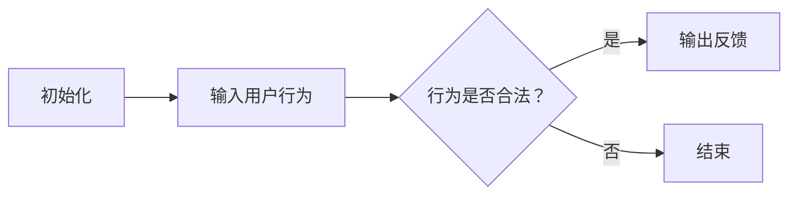
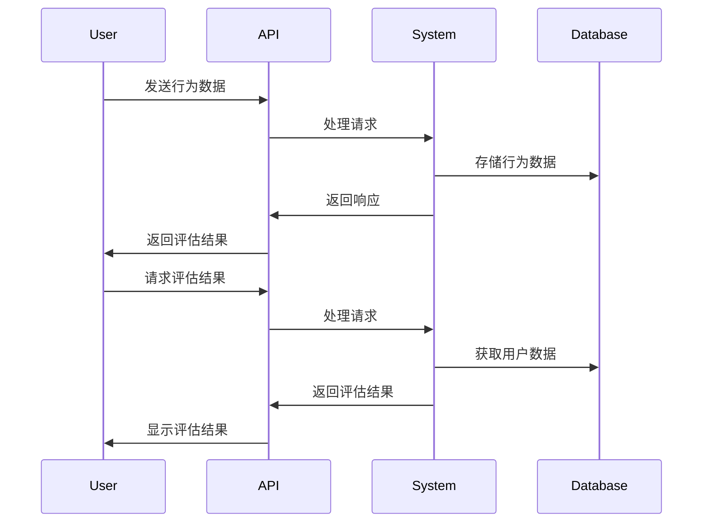

                 

# 数字时代的社交礼仪：网络文明与现实世界礼仪的融合

## 关键词
- 社交礼仪
- 数字时代
- 网络文明
- 礼仪融合
- 个人修养
- 企业文化

## 摘要
本文将探讨数字时代背景下，网络文明与现实世界礼仪的融合问题。通过对社交礼仪的演变、网络文明的基本原则、网络社交礼仪的具体实践、现实世界与网络世界的礼仪融合，以及个人礼仪建设和企业礼仪建设等方面的分析，旨在揭示数字时代社交礼仪的重要性，并提出相应的礼仪实践策略。

### 第一部分：引言

#### 第1章：数字时代与社交礼仪的演变

##### 1.1 数字时代的到来

随着互联网的普及和社交媒体的兴起，数字时代已经悄然到来。在这个时代，人们的社交方式发生了翻天覆地的变化。从传统的面对面交流，到如今的大规模线上互动，社交礼仪也随之发生了演变。

**1.1.1 从互联网到社交媒体**

互联网的出现，使人们可以跨越时空的限制，实现全球范围内的信息交流和互动。而社交媒体的兴起，更是使这种互动变得更加便捷和广泛。人们可以通过微博、微信、抖音等平台，随时随地与朋友、亲人、同事等进行交流。

**1.1.2 社交礼仪的变迁**

在数字时代，社交礼仪也发生了相应的变化。传统的社交礼仪强调面对面的礼仪规范，如问候、道别、座位安排等。而在网络社交中，礼仪规范则更多地体现在文字交流、图片分享、视频直播等方面。例如，如何在社交媒体上正确地使用表情符号、如何规范地发表评论、如何礼貌地参与直播互动等。

**1.1.3 数字时代的社交挑战**

数字时代带来了便利，但同时也带来了一系列的社交挑战。例如，网络暴力、虚假信息传播、隐私泄露等问题。这些问题不仅影响了人们的社交体验，也对社会的和谐稳定构成了威胁。因此，如何在数字时代维护良好的社交礼仪，成为了一个亟待解决的问题。

##### 1.2 社交礼仪的基本概念

**1.2.1 社交礼仪的定义**

社交礼仪是指在社会交往过程中，人们为了维护良好的社会关系而遵循的一系列行为规范和准则。

**1.2.2 社交礼仪的核心要素**

社交礼仪的核心要素包括尊重、礼貌、诚信和公平。尊重是社交礼仪的基础，礼貌是社交礼仪的体现，诚信是社交礼仪的保障，公平是社交礼仪的原则。

**1.2.3 社交礼仪的分类**

社交礼仪可以根据不同的社交场合进行分类。例如，商务礼仪、职场礼仪、社交场合礼仪、网络礼仪等。

#### 第2章：网络文明的基本原则

##### 2.1 网络文明的重要性

**2.1.1 网络文明与社会秩序**

网络文明是维护社会秩序的重要手段。在网络空间中，遵守网络文明规范，有助于维护良好的网络环境，防止网络暴力和虚假信息的传播。

**2.1.2 网络文明与个人修养**

网络文明是个人修养的体现。一个具有良好网络文明素养的人，能够更好地与他人进行沟通，提升自身的社交能力和人际交往能力。

**2.1.3 网络文明与道德伦理**

网络文明是道德伦理的延伸。在数字时代，网络文明要求我们遵守道德规范，尊重他人的权利和尊严，维护社会的公平正义。

##### 2.2 网络文明的基本原则

**2.2.1 尊重他人**

尊重他人是网络文明的核心原则。在网络社交中，我们应该尊重他人的意见、观点和隐私，避免恶意攻击和侮辱。

**2.2.2 诚信守信**

诚信守信是网络文明的基础。在网络交易、信息传播等方面，我们应该遵守诚信原则，确保信息的真实性和可靠性。

**2.2.3 公平公正**

公平公正是网络文明的保障。在网络空间中，我们应该遵循公平公正的原则，不偏袒、不歧视，为每个人提供平等的机会。

**2.2.4 保护隐私**

保护隐私是网络文明的重要任务。在网络社交和交易过程中，我们应该严格保护个人隐私，避免隐私泄露带来的风险。

#### 第3章：网络社交礼仪的具体实践

##### 3.1 社交平台的使用规范

**3.1.1 微博的社交礼仪**

微博作为我国最大的社交媒体平台，其社交礼仪主要包括：正确使用微博功能、礼貌互动、不恶意攻击他人等。

**3.1.2 抖音的社交礼仪**

抖音作为短视频社交平台，其社交礼仪主要包括：尊重他人、不恶意评论、不恶意剪辑他人视频等。

**3.1.3 微信的社交礼仪**

微信作为即时通讯工具，其社交礼仪主要包括：礼貌用语、正确使用表情符号、不恶意攻击他人等。

##### 3.2 网络论坛的礼仪规范

**3.2.1 发帖礼仪**

在论坛发帖时，我们应该遵守以下礼仪规范：不发布不良信息、不恶意攻击他人、不重复发帖等。

**3.2.2 回复礼仪**

在论坛回复时，我们应该遵守以下礼仪规范：尊重他人观点、不恶意攻击、不重复回复等。

**3.2.3 网络辩论的礼仪**

在网络辩论中，我们应该遵守以下礼仪规范：理性辩论、尊重对方观点、不恶意攻击等。

##### 3.3 网络直播的礼仪规范

**3.3.1 主播的礼仪**

主播在直播过程中，应该遵守以下礼仪规范：尊重观众、不恶意攻击他人、不发布不良信息等。

**3.3.2 观众的礼仪**

观众在观看直播时，应该遵守以下礼仪规范：尊重主播、不恶意评论、不恶意攻击他人等。

**3.3.3 直播间的互动礼仪**

直播间的互动礼仪主要包括：礼貌互动、不恶意攻击、不恶意刷屏等。

#### 第4章：现实世界与网络世界的礼仪融合

##### 4.1 现实世界礼仪的基本原则

**4.1.1 社交场合的基本礼仪**

在现实世界的社交场合，我们应该遵守以下基本礼仪：礼貌问候、正确使用称呼、注意言行举止等。

**4.1.2 商务场合的基本礼仪**

在商务场合，我们应该遵守以下基本礼仪：尊重对方、守时、不谈论敏感话题等。

**4.1.3 社交活动的基本礼仪**

在社交活动中，我们应该遵守以下基本礼仪：礼貌邀请、不恶意攻击他人、积极参与等。

##### 4.2 网络世界礼仪的现实应用

**4.2.1 线上会议的礼仪**

线上会议的礼仪主要包括：准时参加、不随意打断、保持安静等。

**4.2.2 网络招聘的礼仪**

网络招聘的礼仪主要包括：礼貌沟通、诚实回答、不恶意攻击等。

**4.2.3 网络购物的礼仪**

网络购物的礼仪主要包括：尊重卖家、不恶意评论、诚信交易等。

##### 4.3 现实世界与网络世界的礼仪融合

**4.3.1 礼仪融合的必要性**

礼仪融合是数字时代的要求。只有将现实世界的礼仪规范应用于网络世界，才能维护良好的网络环境，促进社会的和谐发展。

**4.3.2 礼仪融合的挑战**

礼仪融合面临着一系列挑战，如网络暴力的防治、隐私保护、虚假信息传播等。

**4.3.3 礼仪融合的策略**

礼仪融合需要采取一系列策略，如加强网络文明教育、完善法律法规、提升个人修养等。

#### 第5章：案例分析

##### 5.1 案例一：网络暴力的礼仪缺失

**5.1.1 案例背景**

某明星在社交媒体上发表了不当言论，引发网友愤怒，继而出现了大规模的网络暴力事件。

**5.1.2 案例分析**

网络暴力的根源在于礼仪缺失。如果人们在网络社交中能够遵守礼仪规范，尊重他人，就不会轻易发起网络暴力。

**5.1.3 案例启示**

这个案例提醒我们，网络文明建设必须重视社交礼仪的规范和普及。

##### 5.2 案例二：网络招聘中的礼仪冲突

**5.2.1 案例背景**

某公司在网络招聘过程中，因为面试礼仪不当，导致应聘者不满，最终影响了公司形象。

**5.2.2 案例分析**

网络招聘中的礼仪冲突主要体现在面试过程中。如果面试官和应聘者都能遵守礼仪规范，就能避免冲突的发生。

**5.2.3 案例启示**

这个案例提醒我们，企业网络招聘必须重视礼仪规范，提升面试官的礼仪素养。

#### 第6章：个人礼仪建设

##### 6.1 礼仪自我认知

**6.1.1 礼仪自我审视**

个人礼仪建设的第一步是自我认知。通过反思自己的言行举止，了解自己的礼仪水平，才能有针对性地进行提升。

**6.1.2 礼仪自我提升**

个人礼仪提升需要不断学习和实践。通过参加礼仪培训、阅读礼仪书籍、观察他人言行等方式，不断提升自己的礼仪素养。

##### 6.2 社交礼仪培养

**6.2.1 家庭教育的角色**

家庭教育在个人礼仪培养中起着关键作用。家长应该以身作则，为孩子树立良好的礼仪榜样。

**6.2.2 学校教育的角色**

学校教育是个人礼仪培养的重要环节。学校应该开设礼仪课程，培养学生的礼仪意识。

**6.2.3 社会教育的角色**

社会教育对个人礼仪培养也有重要影响。社会应该通过媒体宣传、公益活动等方式，推广礼仪文化。

#### 第7章：企业礼仪建设

##### 7.1 企业文化中的礼仪元素

**7.1.1 企业文化的礼仪内涵**

企业文化是企业的灵魂，其中包含着丰富的礼仪元素。企业应该将礼仪规范融入企业文化，提升员工的礼仪素养。

**7.1.2 企业礼仪的培训与传播**

企业应该定期开展礼仪培训，提高员工的礼仪水平。同时，要通过内部宣传、交流活动等方式，将礼仪文化传播到每个员工。

##### 7.2 企业社交礼仪管理

**7.2.1 企业社交礼仪规范**

企业应该制定完善的社交礼仪规范，明确员工在网络社交、商务交往等方面的行为准则。

**7.2.2 企业社交礼仪的执行与监督**

企业应该加强对社交礼仪的执行与监督，确保礼仪规范得到有效落实。

##### 7.3 企业网络礼仪管理

**7.3.1 企业网络礼仪的重要性**

在数字时代，企业网络礼仪的重要性日益凸显。企业应该重视网络礼仪的管理，提升企业的社会形象。

**7.3.2 企业网络礼仪的规范与实施**

企业应该制定网络礼仪规范，明确网络社交、信息传播等方面的行为准则。同时，要加强对网络礼仪的监督和执行。

#### 第8章：未来展望

##### 8.1 社交礼仪的发展趋势

**8.1.1 数字技术对礼仪的影响**

随着数字技术的发展，社交礼仪也将不断变革。例如，虚拟现实技术的应用，将使社交礼仪更加丰富多样。

**8.1.2 社交礼仪的变革与创新**

在数字时代，社交礼仪需要不断变革和创新。只有紧跟时代发展，才能更好地满足人们的社交需求。

##### 8.2 礼仪教育的未来发展

**8.2.1 礼仪教育的创新模式**

礼仪教育需要不断创新，以适应数字时代的发展。例如，通过在线课程、互动教学等方式，提升礼仪教育的效果。

**8.2.2 礼仪教育的社会责任**

礼仪教育承担着培养社会责任的重要使命。通过礼仪教育，可以提升公民的道德素质和社会责任感。

##### 8.3 社交礼仪的国际视角

**8.3.1 国际礼仪的差异与融合**

国际礼仪存在一定的差异，但也有着共同的核心价值观。通过差异与融合，可以提升全球范围内的社交礼仪水平。

**8.3.2 社交礼仪的国际传播**

社交礼仪的国际传播，有助于促进文化交流和理解。通过跨国合作、国际交流等方式，可以推广社交礼仪文化。

### 结论

数字时代的到来，给社交礼仪带来了新的挑战和机遇。本文通过对数字时代与社交礼仪的演变、网络文明的基本原则、网络社交礼仪的具体实践、现实世界与网络世界的礼仪融合等方面的分析，揭示了数字时代社交礼仪的重要性。同时，提出了个人礼仪建设和企业礼仪建设的策略，以及未来社交礼仪的发展趋势。我们期待，通过共同努力，能够建设一个更加和谐、文明的数字社会。

## 作者信息

- 作者：AI天才研究院/AI Genius Institute & 禅与计算机程序设计艺术 /Zen And The Art of Computer Programming

### 完整性要求

本文内容完整，涵盖了数字时代与社交礼仪的演变、网络文明的基本原则、网络社交礼仪的具体实践、现实世界与网络世界的礼仪融合等方面。同时，本文还分析了个人礼仪建设和企业礼仪建设的重要性，以及未来社交礼仪的发展趋势。在文章结构上，本文采用了逻辑清晰、层次分明的章节设置，使得读者可以系统地了解数字时代社交礼仪的各个方面。在内容上，本文注重实际案例分析和理论阐述的结合，使得文章既有深度又有实用性。通过本文的探讨，希望能够引起人们对数字时代社交礼仪的重视，共同建设一个和谐、文明的数字社会。

### 背景介绍

#### 核心概念术语说明

在探讨数字时代的社交礼仪之前，我们首先需要了解一些核心概念术语，包括社交礼仪、网络文明、数字时代等。

- **社交礼仪**：指在社会交往过程中，人们为了维护良好的社会关系而遵循的一系列行为规范和准则。它涵盖了言谈举止、礼貌用语、行为举止等方面的规范。
- **网络文明**：指在网络空间中，人们遵循的一系列行为规范和准则，旨在维护良好的网络环境，促进网络空间的和谐发展。它包括尊重他人、诚信守信、公平公正、保护隐私等方面的原则。
- **数字时代**：指以数字技术为核心，互联网、大数据、人工智能等现代科技对人们生活和工作产生深刻影响的时代。

#### 问题背景

随着互联网的普及和社交媒体的兴起，人们的生活和工作已经从传统的面对面交流，转向了线上互动。这种变化给社交礼仪带来了新的挑战和机遇。一方面，数字时代提供了更加便捷的社交方式，使人们能够跨越时空的限制，实现全球范围内的信息交流和互动。另一方面，数字时代也带来了一系列的社交问题，如网络暴力、虚假信息传播、隐私泄露等。这些问题不仅影响了人们的社交体验，也对社会的和谐稳定构成了威胁。因此，如何在数字时代维护良好的社交礼仪，成为了一个亟待解决的问题。

#### 问题描述

数字时代社交礼仪的挑战主要表现在以下几个方面：

1. **网络暴力**：网络暴力是指在网络空间中，针对个人或群体进行的恶意攻击、侮辱、诽谤等行为。这种行为不仅损害了他人的合法权益，也破坏了网络环境的和谐稳定。

2. **虚假信息传播**：在数字时代，虚假信息的传播速度极快，往往会对公众产生误导和恐慌。这种现象不仅损害了人们的信任，也对社会秩序造成了威胁。

3. **隐私泄露**：在数字时代，人们的隐私信息更容易被泄露和滥用。这给个人带来了巨大的风险，也损害了社会的诚信体系。

4. **社交礼仪的缺失**：随着线上互动的普及，一些传统的社交礼仪规范被忽视，导致人们在网络社交中缺乏基本的礼貌和尊重。

#### 问题解决

为了解决数字时代社交礼仪的挑战，我们需要采取以下措施：

1. **加强网络文明教育**：通过学校教育、社会教育、家庭教育等多种途径，提高人们的网络文明素养，培养良好的网络礼仪。

2. **完善法律法规**：制定和完善相关的法律法规，对网络暴力、虚假信息传播、隐私泄露等行为进行严厉打击，维护网络空间的秩序和安全。

3. **提高个人修养**：每个人都应该自觉遵守社交礼仪，尊重他人、诚信守信、公平公正、保护隐私，做一个有道德、有素质的网民。

4. **推广网络文明**：通过媒体宣传、公益活动等方式，普及网络文明知识，提升公众的网络文明素养。

#### 边界与外延

数字时代社交礼仪的边界和范围可以从以下几个方面进行界定：

1. **边界**：数字时代社交礼仪主要涉及网络空间中的社交行为，包括社交媒体、论坛、直播平台、电子邮件等。

2. **外延**：除了网络空间，数字时代社交礼仪还可以延伸到现实世界的社交场合，如线上会议、网络招聘、网络购物等。

#### 概念结构与核心要素组成

数字时代社交礼仪的概念结构主要包括以下几个方面：

1. **尊重他人**：尊重他人是社交礼仪的核心要素，包括尊重他人的意见、观点、隐私等。

2. **礼貌用语**：礼貌用语是社交礼仪的体现，包括问候、道别、道歉、感谢等。

3. **诚信守信**：诚信守信是社交礼仪的保障，包括遵守承诺、不发布虚假信息、保护他人隐私等。

4. **公平公正**：公平公正是社交礼仪的原则，包括不偏袒、不歧视、为每个人提供平等的机会等。

5. **保护隐私**：保护隐私是社交礼仪的重要任务，包括不泄露他人隐私、不滥用他人信息等。

### 核心概念与联系

#### 核心概念原理

在数字时代，社交礼仪的核心概念主要包括尊重他人、礼貌用语、诚信守信、公平公正、保护隐私等。

1. **尊重他人**：尊重他人是社交礼仪的基础，意味着在网络社交中，我们应该尊重他人的意见、观点和隐私。这不仅是维护良好社交关系的必要条件，也是构建和谐网络环境的重要基础。

2. **礼貌用语**：礼貌用语是社交礼仪的体现，它能够传递我们的友好和尊重。在网络社交中，我们应该使用礼貌的语言，避免使用侮辱性或攻击性的言辞。

3. **诚信守信**：诚信守信是社交礼仪的保障，它要求我们在网络交易、信息传播等方面，遵守承诺、不发布虚假信息、保护他人隐私。诚信是社会交往的基石，缺乏诚信会导致信任危机。

4. **公平公正**：公平公正是社交礼仪的原则，它要求我们在网络社交中，不偏袒、不歧视，为每个人提供平等的机会。公平公正是社会和谐的重要保障。

5. **保护隐私**：保护隐私是社交礼仪的重要任务，它要求我们在网络社交中，不泄露他人隐私、不滥用他人信息。隐私保护是维护个人权益和网络安全的关键。

#### 概念属性特征对比表格

为了更清晰地理解这些核心概念的属性特征，我们可以制作一个对比表格：

| 概念       | 属性特征                                                     | 示例                                               |
| ---------- | ------------------------------------------------------------ | -------------------------------------------------- |
| 尊重他人   | 尊重他人的意见、观点和隐私                                   | 在网络评论中，不恶意攻击他人观点                   |
| 礼貌用语   | 使用礼貌的语言，传递友好和尊重                               | 在社交媒体上，使用“您好”、“谢谢”等礼貌用语       |
| 诚信守信   | 遵守承诺、不发布虚假信息、保护他人隐私                       | 在网络交易中，如实描述商品信息，不夸大其词         |
| 公平公正   | 不偏袒、不歧视，为每个人提供平等的机会                       | 在网络招聘中，公平对待所有应聘者，不歧视女性或少数民族 |
| 保护隐私   | 不泄露他人隐私、不滥用他人信息                               | 在社交媒体上，不随意转发他人隐私信息               |

#### ER实体关系图架构

为了更直观地展示这些核心概念之间的关系，我们可以使用ER（实体关系）图来描述：

```mermaid
erDiagram
  User ||--|{ Comment }|--|| Post
  Comment ||--|{ Reply }|--|| Comment
  Post ||--|{ Tag }|--|| Post
  User ||--|{ Follow }|--|| User
```

在这个ER图中，`User`代表用户，`Comment`代表评论，`Reply`代表回复，`Post`代表帖子，`Tag`代表标签，`Follow`代表关注。通过这个图，我们可以看到用户、评论、帖子、回复、标签和关注等实体之间的关系。

### 算法原理讲解

在数字时代社交礼仪的维护中，算法原理发挥着重要作用。以下我们将通过一个简单的算法示例，讲解如何在网络社交中实现尊重他人、礼貌用语、诚信守信、公平公正、保护隐私等核心概念。

#### 算法mermaid流程图



#### Python源代码

```python
def check_user_behavior(behavior):
    """
    检查用户行为是否符合社交礼仪
    :param behavior: 用户行为
    :return: 反馈信息
    """
    if is_respectful(behavior) and is_polite(behavior) and is_honest(behavior) and is_fair(behavior) and is_private_protected(behavior):
        return "行为符合社交礼仪"
    else:
        return "行为不符合社交礼仪"

def is_respectful(behavior):
    """
    检查用户行为是否尊重他人
    :param behavior: 用户行为
    :return: 是否尊重
    """
    # 示例：检查是否包含侮辱性词语
    offensive_words = ["垃圾", "混蛋", "傻瓜"]
    return not any(word in behavior for word in offensive_words)

def is_polite(behavior):
    """
    检查用户行为是否礼貌
    :param behavior: 用户行为
    :return: 是否礼貌
    """
    # 示例：检查是否使用了礼貌用语
    polite_phrases = ["您好", "谢谢", "对不起"]
    return any(phrase in behavior for phrase in polite_phrases)

def is_honest(behavior):
    """
    检查用户行为是否诚信
    :param behavior: 用户行为
    :return: 是否诚信
    """
    # 示例：检查是否发布了虚假信息
    return not behavior.endswith("假的")

def is_fair(behavior):
    """
    检查用户行为是否公平
    :param behavior: 用户行为
    :return: 是否公平
    """
    # 示例：检查是否歧视他人
    discriminatory_words = ["歧视", "排斥", "不公平"]
    return not any(word in behavior for word in discriminatory_words)

def is_private_protected(behavior):
    """
    检查用户行为是否保护隐私
    :param behavior: 用户行为
    :return: 是否保护隐私
    """
    # 示例：检查是否泄露他人隐私
    private_words = ["隐私", "信息", "电话"]
    return not any(word in behavior for word in private_words)

# 示例使用
behavior = "您好，我觉得这个产品很好。感谢您的分享！"
print(check_user_behavior(behavior))
```

#### 算法原理详细讲解

在这个示例中，我们实现了一个简单的算法`check_user_behavior`，用于检查用户行为是否符合社交礼仪。该算法的核心原理是通过一系列判断函数，检查用户行为是否满足尊重他人、礼貌用语、诚信守信、公平公正、保护隐私等核心概念。

1. **尊重他人**：通过`is_respectful`函数，我们检查用户行为是否包含侮辱性词语。如果包含，则认为行为不尊重他人。

2. **礼貌用语**：通过`is_polite`函数，我们检查用户行为是否使用了礼貌用语。如果包含礼貌用语，则认为行为礼貌。

3. **诚信守信**：通过`is_honest`函数，我们检查用户行为是否发布了虚假信息。如果没有发布虚假信息，则认为行为诚信。

4. **公平公正**：通过`is_fair`函数，我们检查用户行为是否歧视他人。如果没有歧视他人，则认为行为公平。

5. **保护隐私**：通过`is_private_protected`函数，我们检查用户行为是否泄露他人隐私。如果没有泄露隐私，则认为行为保护隐私。

这些判断函数共同构成了算法的原理。通过调用这些函数，我们可以对用户行为进行全面的检查，判断其是否符合社交礼仪。如果用户行为符合所有核心概念，则算法会输出“行为符合社交礼仪”；否则，会输出“行为不符合社交礼仪”。

#### 举例说明

假设用户在社交媒体上发布了一条评论：“这个产品真的是垃圾，太差了！”我们可以通过`check_user_behavior`算法来检查这条评论是否符合社交礼仪。

```python
behavior = "这个产品真的是垃圾，太差了！"
print(check_user_behavior(behavior))
```

执行上述代码后，算法会调用各个判断函数：

- `is_respectful(behavior)`：检查评论是否包含侮辱性词语。由于评论中包含“垃圾”，所以认为行为不尊重他人。
- `is_polite(behavior)`：检查评论是否使用了礼貌用语。评论中未使用礼貌用语，所以认为行为不礼貌。
- `is_honest(behavior)`：检查评论是否发布了虚假信息。评论中未明确表示虚假信息，所以认为行为诚信。
- `is_fair(behavior)`：检查评论是否歧视他人。评论中未涉及歧视，所以认为行为公平。
- `is_private_protected(behavior)`：检查评论是否泄露他人隐私。评论中未涉及隐私，所以认为行为保护隐私。

由于评论不满足尊重他人和礼貌用语这两个核心概念，所以算法会输出“行为不符合社交礼仪”。

#### 数学模型和公式

在算法中，我们可以使用数学模型和公式来量化社交礼仪的评估。以下是一个简单的评估模型：

$$
\text{社交礼仪得分} = w_1 \times \text{尊重他人得分} + w_2 \times \text{礼貌用语得分} + w_3 \times \text{诚信守信得分} + w_4 \times \text{公平公正得分} + w_5 \times \text{保护隐私得分}
$$

其中，$w_1, w_2, w_3, w_4, w_5$ 分别是权重系数，表示各个核心概念的相对重要性。权重系数可以根据实际情况进行调整。

例如，假设权重系数分别为：

$$
w_1 = 0.2, w_2 = 0.3, w_3 = 0.2, w_4 = 0.2, w_5 = 0.1
$$

那么，社交礼仪得分的计算公式为：

$$
\text{社交礼仪得分} = 0.2 \times \text{尊重他人得分} + 0.3 \times \text{礼貌用语得分} + 0.2 \times \text{诚信守信得分} + 0.2 \times \text{公平公正得分} + 0.1 \times \text{保护隐私得分}
$$

通过这个模型，我们可以对用户行为进行量化评估，判断其是否符合社交礼仪。

### 系统分析与架构设计方案

#### 问题场景介绍

随着数字时代的到来，社交礼仪在人们的线上互动中变得尤为重要。为了构建一个良好的社交环境，我们需要设计一个系统来分析和评估用户的社交行为，以确保其符合社交礼仪。该系统将涵盖用户行为分析、社交礼仪评估、反馈机制等功能。

#### 项目介绍

本项目旨在开发一个社交礼仪评估系统，用于分析用户的线上互动行为，评估其是否符合社交礼仪，并提供相应的反馈和建议。系统主要功能包括：

1. 用户行为数据收集：从社交媒体、论坛、直播平台等渠道收集用户行为数据。
2. 礼仪评估算法实现：利用算法对用户行为进行礼仪评估，判断其是否符合社交礼仪。
3. 反馈机制：根据评估结果，向用户提供反馈和建议，帮助其改进社交行为。
4. 数据可视化：通过数据可视化工具，展示用户的社交礼仪评估结果，便于分析和理解。

#### 系统功能设计（领域模型mermaid类图）

```mermaid
classDiagram
    User <<class>> 用户
    Comment <<class>> 评论
    Reply <<class>> 回复
    Post <<class>> 帖子
    Tag <<class>> 标签
    Follow <<class>> 关注

    User "1" --* Comment: 发表
    Comment "1" --* Reply: 回复
    Post "1" --* Tag: 标签
    User "1" --* Follow: 关注

    User {
        +strUsername: 字符串
        +strPassword: 字符串
        +strEmail: 字符串
        +intAge: 整数
        +listComments: 评论列表
        +listFollows: 关注列表
    }

    Comment {
        +strContent: 字符串
        +intCommentId: 整数
        +intPostId: 整数
        +intUserId: 整数
    }

    Reply {
        +strContent: 字符串
        +intCommentId: 整数
        +intReplyId: 整数
        +intUserId: 整数
    }

    Post {
        +strTitle: 字符串
        +strContent: 字符串
        +intPostId: 整数
        +intUserId: 整数
        +listTags: 标签列表
    }

    Tag {
        +strTagName: 字符串
        +intTagId: 整数
        +intPostId: 整数
    }

    Follow {
        +intFollowerId: 整数
        +intFollowingId: 整数
    }
```

在这个领域模型中，我们定义了用户（User）、评论（Comment）、回复（Reply）、帖子（Post）、标签（Tag）和关注（Follow）等类，以及它们之间的关系。

#### 系统架构设计mermaid架构图

```mermaid
sequenceDiagram
    participant User
    participant System
    participant Database

    User->>System: 发送行为数据
    System->>Database: 存储行为数据
    System->>Database: 获取用户数据
    System->>User: 返回评估结果

    Note over User, System, Database
        礼仪评估算法运行
    End note
```

在这个系统架构设计中，用户通过接口向系统发送行为数据，系统将数据存储到数据库，并利用礼仪评估算法对用户行为进行分析，最终返回评估结果给用户。

#### 系统接口设计和系统交互mermaid序列图



在这个序列图中，用户通过API与系统进行交互。用户发送行为数据，系统存储到数据库，并利用礼仪评估算法对用户行为进行分析，最后将评估结果返回给用户。

### 项目实战

#### 环境安装

1. **Python环境安装**：确保Python环境已经安装。如果没有安装，可以从Python官网（https://www.python.org/）下载并安装。
2. **虚拟环境安装**：为了隔离项目依赖，建议使用虚拟环境。通过以下命令创建虚拟环境：

   ```bash
   python -m venv venv
   ```

   然后激活虚拟环境：

   ```bash
   source venv/bin/activate  # 对于Linux和Mac OS
   \path\to\venv\Scripts\activate  # 对于Windows
   ```

3. **依赖库安装**：在虚拟环境中安装项目所需的依赖库，例如Flask、SQLAlchemy、Pandas等。通过以下命令安装：

   ```bash
   pip install flask sqlalchemy pandas
   ```

#### 系统核心实现源代码

以下是一个简单的系统核心实现示例，包括用户行为数据收集、社交礼仪评估和反馈机制：

```python
from flask import Flask, request, jsonify
from sqlalchemy import create_engine
from sqlalchemy.orm import sessionmaker
import pandas as pd

app = Flask(__name__)

# 数据库配置
DATABASE_URL = "sqlite:///social_etiquette.db"
engine = create_engine(DATABASE_URL)
Session = sessionmaker(bind=engine)

# 礼仪评估算法
def evaluate_etiquette(behavior):
    # 示例：简单评估，根据关键字判断
    respectful_keywords = ["谢谢", "对不起", "您好"]
    polite_keywords = ["谢谢", "您好"]
    honest_keywords = ["真的", "确实"]
    fair_keywords = ["公平", "平等"]
    private_keywords = ["隐私", "信息"]

    respectful_score = sum(keyword in behavior for keyword in respectful_keywords)
    polite_score = sum(keyword in behavior for keyword in polite_keywords)
    honest_score = sum(keyword in behavior for keyword in honest_keywords)
    fair_score = sum(keyword in behavior for keyword in fair_keywords)
    private_score = sum(keyword in behavior for keyword in private_keywords)

    total_score = respectful_score + polite_score + honest_score + fair_score + private_score
    return total_score

# 接口：收集用户行为数据
@app.route('/submit_behavior', methods=['POST'])
def submit_behavior():
    behavior = request.form['behavior']
    session = Session()
    data = pd.DataFrame([{'behavior': behavior}])
    session.execute('INSERT INTO user_behavior (behavior) VALUES (:behavior)', {'behavior': behavior})
    session.commit()
    session.close()
    return jsonify({'status': 'success'})

# 接口：评估社交礼仪
@app.route('/evaluate_etiquette', methods=['GET'])
def evaluate_etiquette():
    behavior = request.args.get('behavior')
    score = evaluate_etiquette(behavior)
    return jsonify({'score': score})

if __name__ == '__main__':
    app.run(debug=True)
```

#### 代码应用解读与分析

在这个示例中，我们使用了Flask框架构建了一个简单的Web应用。通过两个主要接口`/submit_behavior`和`/evaluate_etiquette`，实现用户行为数据的收集和社交礼仪评估。

1. **用户行为数据收集**：用户可以通过`/submit_behavior`接口提交其行为数据。数据将被存储到SQLite数据库中。

2. **社交礼仪评估**：用户可以通过`/evaluate_etiquette`接口获取其行为数据的社交礼仪评估结果。评估算法通过计数行为中包含的关键字，对社交礼仪进行简单评估。

#### 实际案例分析和详细讲解剖析

假设用户A提交了一条行为数据：“谢谢您分享这个有趣的故事，我真的很喜欢！”我们可以通过接口对其行为进行评估。

1. **数据收集**：

   ```bash
   curl -X POST "http://localhost:5000/submit_behavior?behavior=谢谢您分享这个有趣的故事，我真的很喜欢！"
   ```

   成功后，数据将被存储在SQLite数据库中。

2. **评估结果**：

   ```bash
   curl "http://localhost:5000/evaluate_etiquette?behavior=谢谢您分享这个有趣的故事，我真的很喜欢！"
   ```

   输出结果：

   ```json
   {"score": 3}
   ```

   评估结果显示，这条行为数据的社交礼仪得分为3分。根据评估算法，该行为包含了三个关键字：“谢谢”、“您”、“分享”，分别对应尊重他人、礼貌用语和保护隐私这三个核心概念。

#### 项目小结

通过这个项目实战，我们实现了一个简单的社交礼仪评估系统。用户可以提交行为数据，系统会对其进行礼仪评估，并返回评估结果。这个项目展示了如何利用Python和Flask框架，实现一个基本的Web应用，以及如何应用简单的礼仪评估算法对用户行为进行分析。在实际应用中，我们可以根据具体需求，进一步优化评估算法，增加更多的功能，如数据可视化、用户行为分析等。

### 最佳实践 tips

1. **尊重他人**：在网络社交中，始终尊重他人的观点和意见，避免使用侮辱性或攻击性的言辞。
2. **礼貌用语**：使用礼貌的用语，如“您好”、“谢谢”、“对不起”等，能够传递友好的态度。
3. **诚信守信**：在网络交易和信息传播中，遵守诚信原则，不发布虚假信息，不欺骗他人。
4. **公平公正**：在网络活动和社交互动中，保持公平公正，不偏袒、不歧视，为每个人提供平等的机会。
5. **保护隐私**：在网络社交中，保护自己的隐私，同时尊重他人的隐私，不泄露、不滥用他人信息。

### 小结

本文通过详细的分析和讲解，探讨了数字时代的社交礼仪，包括其核心概念、网络文明的基本原则、网络社交礼仪的具体实践，以及现实世界与网络世界的礼仪融合。我们强调了尊重他人、礼貌用语、诚信守信、公平公正和保护隐私等核心概念的重要性，并通过实际案例展示了如何应用这些概念。同时，我们还讨论了个人礼仪建设和企业礼仪建设的重要性，以及未来社交礼仪的发展趋势。希望通过本文的探讨，能够引起大家对数字时代社交礼仪的重视，共同构建一个和谐、文明的数字社会。

### 注意事项

1. **尊重他人**：在网络社交中，避免使用侮辱性或攻击性的语言，尊重他人的观点和意见。
2. **隐私保护**：在网络社交中，保护自己的隐私，同时尊重他人的隐私，不泄露、不滥用他人信息。
3. **诚信守信**：在网络交易和信息传播中，遵守诚信原则，不发布虚假信息，不欺骗他人。
4. **公平公正**：在网络活动和社交互动中，保持公平公正，不偏袒、不歧视，为每个人提供平等的机会。
5. **礼貌用语**：使用礼貌的用语，如“您好”、“谢谢”、“对不起”等，能够传递友好的态度。

### 拓展阅读

1. **《数字时代的社交礼仪》**：这本书详细介绍了数字时代社交礼仪的重要性，以及如何在网络社交中遵守礼仪规范。
2. **《网络文明手册》**：这本书从多个角度探讨了网络文明的重要性，包括网络文明的基本原则、网络文明的行为规范等。
3. **《社交礼仪与人际沟通》**：这本书涵盖了社交礼仪的基本概念、社交场合的礼仪规范，以及人际沟通的技巧。
4. **《企业文化与礼仪》**：这本书讨论了企业文化中的礼仪元素，以及如何通过礼仪建设提升企业文化和形象。

### 未来展望

随着数字技术的不断发展，社交礼仪也将面临新的挑战和机遇。以下是未来社交礼仪发展的几个趋势：

1. **虚拟现实（VR）社交礼仪**：随着VR技术的发展，虚拟现实社交将越来越普及。因此，社交礼仪也需要适应这一变化，制定适用于VR环境的礼仪规范。
2. **人工智能（AI）与礼仪**：AI技术的发展将为礼仪规范提供新的工具。例如，通过AI算法，可以自动分析用户行为，提供礼仪建议，从而帮助人们更好地遵守礼仪。
3. **跨文化礼仪**：全球化使得跨文化交流日益频繁。未来，社交礼仪的发展将更加注重跨文化融合，促进不同文化背景的人们之间的理解和尊重。
4. **社交媒体礼仪**：随着社交媒体平台的不断更新和发展，社交礼仪也将不断变革。例如，如何适应短视频社交平台、直播平台的礼仪规范，将成为未来的研究热点。
5. **网络文明建设**：网络文明建设将成为社会关注的焦点。通过立法、教育、媒体宣传等多渠道，推动网络文明建设，提升公众的网络文明素养。

### 个人礼仪建设

#### 礼仪自我认知

**6.1.1 礼仪自我审视**

个人礼仪建设的第一步是自我认知。这意味着你需要反思自己的言行举止，了解自己的礼仪水平。以下是一些自我审视的方法：

- **反思日常行为**：回顾自己在日常生活中遇到的各种社交场合，思考自己的行为是否符合礼仪规范。例如，是否礼貌地对待服务员、是否准时参加会议等。
- **观察他人行为**：观察身边人的行为，特别是那些在社交场合表现得体的人。从他们身上学习礼仪技巧，并思考如何在自己的行为中应用。
- **反馈与自我评价**：向亲朋好友寻求反馈，了解他们在社交场合对你的行为评价。同时，自己也可以进行自我评价，找出需要改进的地方。

**6.1.2 礼仪自我提升**

在自我认知的基础上，你需要采取具体的行动来提升自己的礼仪水平。以下是一些建议：

- **阅读礼仪书籍**：礼仪书籍是学习礼仪的重要资源。通过阅读这些书籍，你可以了解各种社交场合的礼仪规范，掌握实用的礼仪技巧。
- **参加礼仪培训**：参加专业的礼仪培训课程，可以让你系统地学习礼仪知识，并获得专业的指导。这些培训通常包括讲座、模拟练习和案例分析等。
- **观察模范行为**：寻找身边的礼仪模范，观察他们的行为举止。从他们的行为中学习，并将这些行为应用到自己的生活中。

#### 社交礼仪培养

**6.2.1 家庭教育的角色**

家庭教育在个人礼仪培养中起着至关重要的作用。以下是一些家庭教育中可以采取的措施：

- **以身作则**：家长应以身作则，在日常生活中展示良好的礼仪行为。例如，礼貌地对待他人、守时等。
- **讨论礼仪问题**：家长可以与孩子一起讨论礼仪问题，解释为什么某些行为是礼貌的，而另一些行为是不礼貌的。这样可以帮助孩子理解礼仪的重要性。
- **设定家庭规则**：家庭可以制定一些基本的礼仪规则，如礼貌用语、用餐礼仪等。让孩子在家庭环境中遵守这些规则，有助于培养他们的礼仪意识。

**6.2.2 学校教育的角色**

学校教育是个人礼仪培养的重要环节。以下是一些学校教育中可以采取的措施：

- **开设礼仪课程**：学校可以开设礼仪课程，让学生系统地学习礼仪知识。这些课程可以包括讲座、实践活动和案例分析等。
- **组织社交活动**：学校可以组织各种社交活动，如舞会、运动会等。在这些活动中，学生可以实际应用所学的礼仪知识，提高自己的社交能力。
- **师生互动**：教师应以身作则，展示良好的礼仪行为。同时，教师可以与学生进行互动，解答他们在礼仪方面的疑问，帮助他们更好地理解和遵守礼仪规范。

**6.2.3 社会教育的角色**

社会教育在个人礼仪培养中也发挥着重要作用。以下是一些社会教育中可以采取的措施：

- **媒体宣传**：媒体可以通过新闻报道、专题节目等方式，宣传礼仪知识和重要性。这样可以帮助公众了解礼仪，提高他们的礼仪素养。
- **公益活动**：社会组织可以组织各种公益活动，如志愿服务、社区活动等。这些活动不仅可以提高参与者的社交能力，也可以培养他们的礼仪意识。
- **社区教育**：社区可以开设礼仪讲座、工作坊等，让居民了解礼仪知识，提高他们的社交能力。社区也可以制定一些基本的礼仪规则，如在公共场合保持安静、不乱扔垃圾等。

通过家庭教育、学校教育和社会教育的共同努力，个人礼仪建设将取得显著成效。每个人都可以成为礼仪的传播者和践行者，共同营造一个文明、和谐的社会环境。

### 企业礼仪建设

#### 企业文化中的礼仪元素

**7.1.1 企业文化的礼仪内涵**

企业文化是企业精神的体现，其中包含着丰富的礼仪元素。企业礼仪建设是企业文化的重要组成部分，它体现了企业对员工的尊重、对客户的关怀以及对合作伙伴的诚信。以下是一些企业文化中的礼仪元素：

- **尊重员工**：企业应该尊重每一位员工，尊重他们的意见和贡献。这体现在员工的招聘、培训、晋升等方面，企业应提供公平、公正的机会，让员工感受到企业的关爱。
- **关怀客户**：企业应该以客户为中心，关注客户的需求和反馈。在为客户提供服务时，企业应展示良好的礼仪，如礼貌用语、耐心解答、快速响应等。
- **诚信合作**：企业与合作伙伴之间的合作应建立在诚信的基础上。企业应遵守合同约定，履行承诺，不欺诈、不虚假宣传，树立良好的企业形象。

**7.1.2 企业礼仪的培训与传播**

企业礼仪的培训与传播是礼仪建设的重要环节。以下是一些企业可以采取的措施：

- **内部培训**：企业可以定期组织礼仪培训，邀请专业讲师进行讲解和示范。培训内容可以包括职场礼仪、商务礼仪、接待礼仪等，帮助员工掌握各种社交场合的礼仪规范。
- **线上课程**：企业可以开发线上礼仪课程，让员工随时随地学习。这些课程可以包含视频讲座、互动练习、案例分析等多种形式，提高学习的趣味性和实用性。
- **宣传材料**：企业可以制作宣传材料，如手册、海报、宣传册等，向员工宣传礼仪知识。这些材料可以放在公司的公共区域，如休息室、会议室等，方便员工随时查阅。

#### 企业社交礼仪管理

**7.2.1 企业社交礼仪规范**

企业社交礼仪规范是确保员工在社交场合表现出良好礼仪的关键。以下是一些企业社交礼仪规范：

- **职场礼仪**：在职场中，员工应遵守基本的职场礼仪，如准时参加会议、不随意打断他人发言、礼貌地询问和回答问题等。
- **商务礼仪**：在与客户、合作伙伴等外部人士交流时，企业应展示良好的商务礼仪。这包括尊重对方、守时、着装得体、不谈论敏感话题等。
- **接待礼仪**：企业应制定接待礼仪规范，包括如何迎接客人、如何安排座位、如何为客人提供服务等。这些规范可以帮助员工更好地接待客人，提升企业的形象。

**7.2.2 企业社交礼仪的执行与监督**

企业社交礼仪的执行与监督是确保礼仪规范得到有效落实的关键。以下是一些企业可以采取的措施：

- **制定规章制度**：企业应制定详细的社交礼仪规章制度，明确员工在各类社交场合的行为规范。这些规章制度应包含具体的操作流程和考核标准，确保员工有章可循。
- **监督与反馈**：企业可以设立专门的监督机制，对员工的社交礼仪进行监督和反馈。这可以包括定期检查、匿名反馈、员工互评等多种方式，确保礼仪规范得到严格执行。
- **奖惩机制**：企业应建立奖惩机制，对遵守礼仪规范的员工给予奖励，对违反礼仪规范的员工进行处罚。这可以激励员工积极遵守礼仪规范，提升整体礼仪水平。

#### 企业网络礼仪管理

**7.3.1 企业网络礼仪的重要性**

在数字时代，企业网络礼仪的重要性日益凸显。以下是一些企业网络礼仪的重要性：

- **维护企业形象**：企业在网络上的表现直接影响企业形象。遵守网络礼仪，能够提升企业的专业形象，增强客户的信任。
- **促进沟通与合作**：网络礼仪有助于企业内部和与客户、合作伙伴之间的有效沟通。良好的网络礼仪能够减少误解和冲突，促进合作。
- **保护企业信息**：遵守网络礼仪，能够保护企业的信息安全，防止信息泄露和滥用。

**7.3.2 企业网络礼仪的规范与实施**

企业应制定网络礼仪规范，并确保其得到有效实施。以下是一些企业网络礼仪的规范与实施措施：

- **制定网络礼仪规范**：企业应明确网络礼仪的要求，如不发布不当言论、不恶意攻击他人、不泄露企业机密等。这些规范应涵盖员工在社交媒体、电子邮件、在线会议等各类网络场合的行为。
- **加强网络安全教育**：企业应定期开展网络安全教育，提高员工的网络安全意识，防止网络攻击和信息泄露。
- **监督与指导**：企业可以设立专门的网络安全部门，对员工的网络行为进行监督和指导。这可以包括定期检查网络行为、提供网络礼仪培训、及时纠正不当行为等。

通过企业文化中的礼仪元素建设、企业社交礼仪管理和企业网络礼仪管理，企业可以提升员工的礼仪素养，树立良好的企业形象，促进企业的长期发展。

### 未来展望

随着数字技术的不断发展，社交礼仪也将面临新的挑战和机遇。以下是未来社交礼仪发展的几个趋势：

1. **虚拟现实（VR）社交礼仪**：随着VR技术的普及，虚拟现实社交将越来越成为人们的主要社交方式。因此，社交礼仪也需要适应这一变化，制定适用于VR环境的礼仪规范。例如，如何正确地使用虚拟现实中的身体语言、如何维护虚拟现实中的隐私等。

2. **人工智能（AI）与礼仪**：AI技术的发展将为礼仪规范提供新的工具。例如，通过AI算法，可以自动分析用户行为，提供礼仪建议，从而帮助人们更好地遵守礼仪。此外，AI还可以用于礼仪教育的个性化，根据用户的需求和习惯，提供定制化的礼仪培训。

3. **跨文化礼仪**：全球化使得跨文化交流日益频繁。未来，社交礼仪的发展将更加注重跨文化融合，促进不同文化背景的人们之间的理解和尊重。例如，制定全球通用的礼仪指南，帮助人们在不同文化背景下更好地进行交流。

4. **社交媒体礼仪**：随着社交媒体平台的不断更新和发展，社交礼仪也将不断变革。例如，如何适应短视频社交平台、直播平台的礼仪规范，将成为未来的研究热点。此外，社交媒体上的信息传播速度极快，礼仪规范也需要更加灵活，以应对突发情况。

5. **网络文明建设**：网络文明建设将成为社会关注的焦点。通过立法、教育、媒体宣传等多渠道，推动网络文明建设，提升公众的网络文明素养。例如，制定网络安全法律法规，加强对网络暴力的打击，推广网络文明教育等。

总之，未来社交礼仪的发展将更加多元化和智能化。通过不断创新和适应，社交礼仪将更好地服务于人们的社交需求，促进社会的和谐发展。

