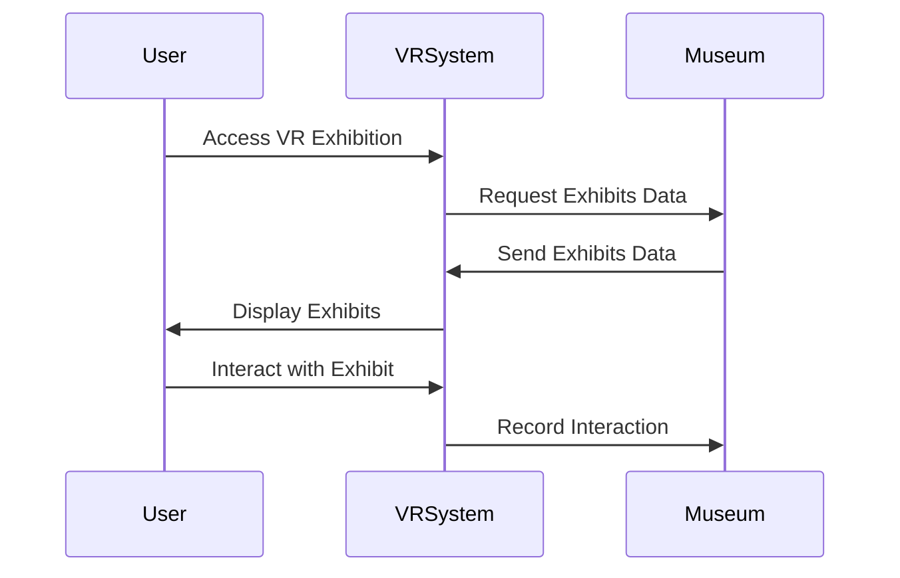
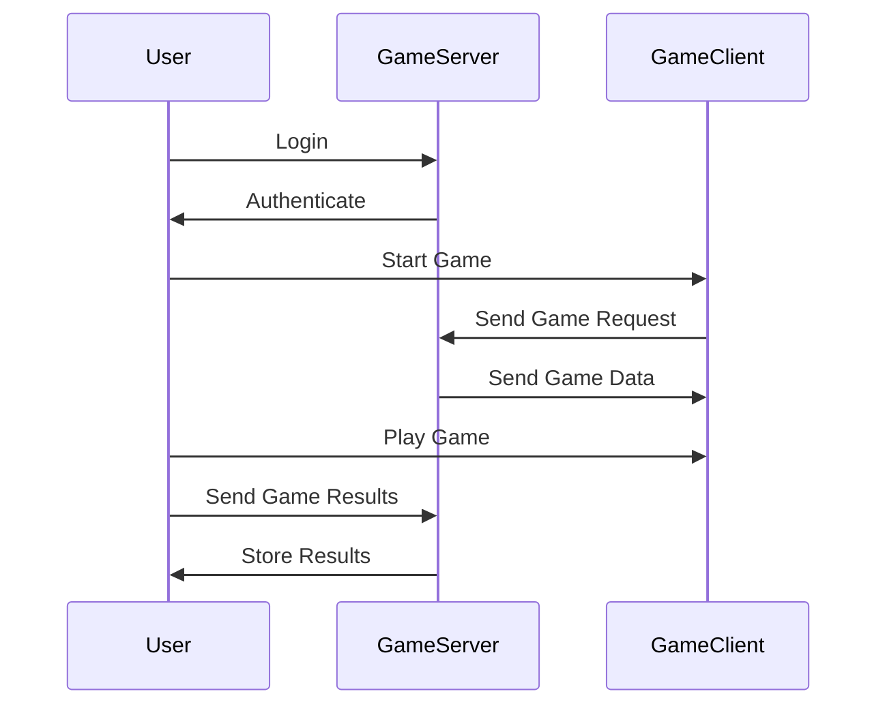
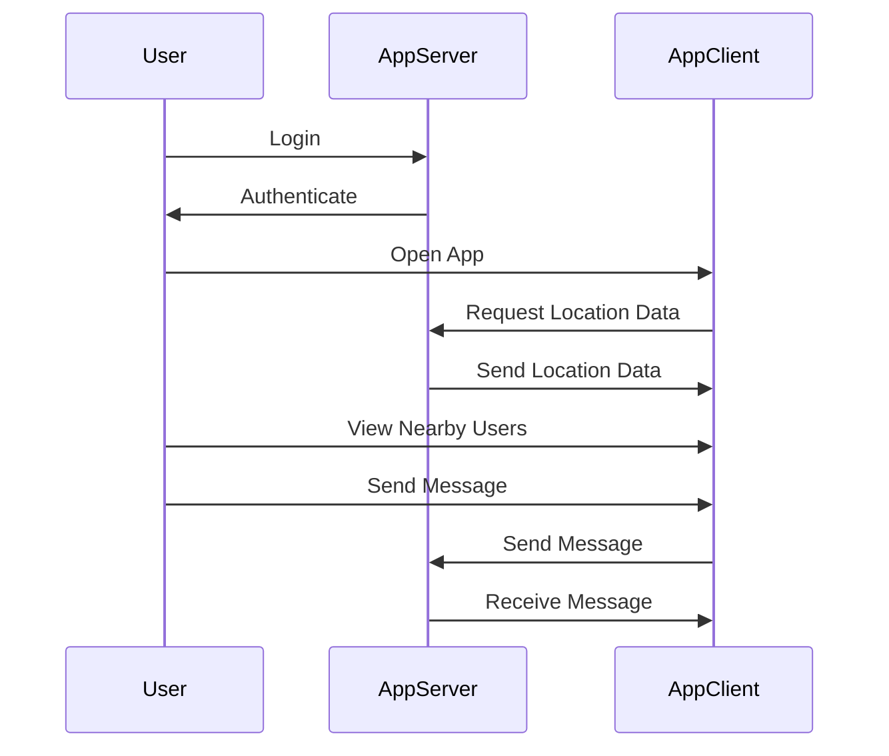

                 

### 引言：数字时代的社交距离艺术

在21世纪的数字时代，社会结构和文化习惯正在经历深刻的变革。特别是，后疫情时代（Post-pandemic Era）的到来，进一步加剧了全球范围内社交距离的变化。在这种背景下，如何创造性地设计互动形式，以适应和改善新的社交模式，成为了一个重要的研究课题。本书《数字时代的社交距离艺术：后疫情时代的创意互动设计》旨在探讨这一课题，通过系统的分析和方法，为设计师、艺术家和创意工作者提供理论支持和实践指南。

**关键词：** 数字时代，社交距离，后疫情时代，创意互动设计，艺术。

**摘要：** 本书从数字时代的社交距离出发，分析了后疫情背景下的社交现象及其对人们生活的影响。随后，深入探讨了创意互动设计的原则、策略和实践，通过具体的案例展示了如何通过数字技术和创意设计，构建新的社交互动模式。本书旨在为读者提供一种全新的视角和方法，以应对和引领这一时代的变化。

**目录大纲设计思路：**

1. **明确书籍主题和目标受众：** 本书主题聚焦于数字时代的社交距离艺术，目标受众包括设计师、艺术家、创意工作者以及对此感兴趣的广大读者。

2. **构建核心章节结构：** 全书分为三大部分：第一部分详细探讨数字时代社交距离的概念、挑战和工具方法；第二部分介绍创意互动设计的原则和策略；第三部分聚焦后疫情时代的社交距离艺术表现。这样的结构确保了内容的系统性和全面性。

3. **细化每个章节的内容：** 在每个章节中，通过子标题进一步细化内容，确保深入浅出地讲解核心概念和理论，并结合实际案例进行分析。

4. **添加总结和扩展阅读：** 每个章节最后提供小结和扩展阅读，以帮助读者巩固所学知识并进一步探索相关领域。

### 第一部分：数字时代的社交距离

在数字时代的背景下，社交距离这一概念得到了重新定义和审视。本章将深入探讨数字时代社交距离的概念与特征，分析其带来的挑战与机遇，并介绍相关的工具与方法。

### 第1章：数字时代社交距离的概念与特征

#### 1.1 数字时代的社交距离定义

在传统的概念中，社交距离是指个体在社交场合中与他人的物理和心理距离。而在数字时代，这一概念得到了扩展和深化。数字时代的社交距离不仅包括物理距离，还涵盖了虚拟空间中的互动和沟通方式。具体而言，它包括以下几个方面：

1. **物理距离：** 虽然数字技术使得人们可以远程互动，但在某些情况下，物理距离仍然是一个重要的因素。例如，在办公室工作的人可能需要与同事保持适当的物理距离，以减少疾病传播的风险。

2. **心理距离：** 数字互动往往缺乏面对面的交流，导致心理距离增加。这种距离不仅体现在情感层面，也影响到了沟通的效率和深度。

3. **虚拟社交：** 通过社交媒体、在线会议和虚拟现实等技术，人们可以在虚拟空间中进行互动。这种虚拟社交距离具有独特的特征，如异步沟通、信息过载和数字分心等。

#### 1.2 社交距离的变化与影响

数字时代的社交距离与传统社交距离相比，发生了显著的变化。这些变化主要体现在以下几个方面：

1. **社交习惯的变化：** 随着数字技术的发展，人们的社交习惯发生了转变。例如，越来越多的人通过社交媒体和即时通讯工具进行交流，减少了面对面的互动。

2. **社交频率的变化：** 数字技术使得人们可以更频繁地与朋友、同事和家人进行互动，但也可能导致社交频率过高，从而影响深度和意义。

3. **社交质量的变化：** 数字互动虽然便利，但往往缺乏情感共鸣和深刻的交流。这种社交质量的下降对人际关系和心理健康产生了负面影响。

#### 1.3 数字时代社交距离的特殊性

数字时代社交距离的特殊性体现在以下几个方面：

1. **技术驱动：** 数字技术的发展是数字时代社交距离形成的主要驱动力。例如，智能手机和社交媒体的普及，使得人们可以随时随地与他人保持联系。

2. **隐私与安全：** 数字时代社交距离带来了隐私和安全问题。在虚拟空间中，个人信息和数据容易受到泄露和滥用，这需要新的隐私保护策略。

3. **社交复杂性的增加：** 数字技术使得社交网络变得更加复杂。人们需要管理更多的社交关系和信息，这增加了社交的复杂性和压力。

### 第2章：数字时代社交距离的挑战与机遇

#### 2.1 挑战

数字时代社交距离带来了许多挑战，这些挑战主要表现在以下几个方面：

1. **社交技能的衰退：** 随着数字互动的增加，面对面的社交技能逐渐衰退。这可能导致人际关系疏远，沟通效率下降。

2. **网络暴力和隐私侵犯：** 数字时代社交距离下的网络暴力和隐私侵犯问题日益严重。这需要更有效的法律和技术手段来应对。

3. **虚拟与现实的生活平衡：** 数字技术使得人们可以沉浸在虚拟世界中，但过度依赖虚拟社交可能导致现实生活质量的下降。

#### 2.2 机遇

尽管存在挑战，数字时代社交距离也为创意互动设计带来了许多机遇，这些机遇包括：

1. **数字艺术创作的新形式：** 数字技术为艺术创作提供了新的手段和形式。例如，虚拟现实和增强现实技术使得艺术家可以创造出前所未有的互动艺术作品。

2. **线上社交的多样性与创新：** 数字时代社交距离下的线上社交具有多样性和创新性。人们可以通过各种平台和工具，探索新的社交方式和互动模式。

3. **数字技术推动的艺术普及：** 数字技术使得艺术资源更加普及和可及。人们可以通过互联网访问各种艺术作品和课程，从而提升自身的艺术修养。

### 第3章：数字时代社交距离的工具与方法

为了有效地应对数字时代社交距离的挑战和把握机遇，需要使用一系列工具和方法。这些工具和方法包括：

1. **社交媒介分析工具：** 社交媒介分析工具可以帮助设计师和创意工作者了解社交互动的动态和趋势。这些工具可以分析用户行为、社交网络结构和用户情感，为创意设计提供数据支持。

2. **互动设计方法与实践：** 互动设计方法包括用户研究、原型设计、用户测试和迭代等。这些方法可以帮助创意工作者构建有效的互动体验，提升用户的满意度和参与度。

通过本章的探讨，我们初步了解了数字时代社交距离的概念、特征、挑战与机遇，以及相关的工具和方法。在接下来的章节中，我们将进一步深入探讨创意互动设计的原则和策略，以期为解决数字时代社交距离问题提供更多的思路和方法。

### 第二部分：创意互动设计

创意互动设计是数字时代应对社交距离的重要手段之一。本章将详细探讨创意互动设计的原则与策略，并通过实际案例展示其应用。

#### 第4章：创意互动设计的原则与策略

#### 4.1 设计原则

创意互动设计需要遵循一些基本原则，以确保设计的有效性和用户体验。这些原则包括：

1. **用户中心设计（User-Centered Design）：** 用户是互动设计的核心。设计过程中应始终以用户的需求、行为和感受为中心，确保设计的易用性和满意度。

2. **互动性（Interactivity）：** 创意互动设计的核心在于互动性。设计应鼓励用户参与和互动，提供多样化的互动形式，如评论、投票、游戏等。

3. **情感共鸣（Emotional Connection）：** 情感共鸣是增强用户粘性和忠诚度的关键。设计应通过情感化的元素和互动，与用户建立情感联系。

4. **创新性（Innovation）：** 创意互动设计应具有创新性，通过新颖的互动方式和内容，吸引用户的注意力，提升用户体验。

5. **可访问性（Accessibility）：** 设计应确保所有人，包括残疾人和老年人，都能无障碍地使用和参与互动。

#### 4.2 创意策略

为了实现创意互动设计的目标，需要采用一系列策略。以下是一些关键策略：

1. **故事驱动设计（Storytelling-Driven Design）：** 通过讲述引人入胜的故事，引导用户参与互动。故事可以是真实的，也可以是虚构的，但必须与用户产生共鸣。

2. **游戏化设计（Gamification）：** 将游戏元素引入非游戏环境，如教育、健康和社交领域，以提升用户参与度和学习效果。

3. **虚拟现实和增强现实（VR/AR）：** 利用VR/AR技术创造沉浸式的互动体验，使用户在虚拟环境中感受到真实的存在感。

4. **社交媒体整合（Social Media Integration）：** 通过社交媒体平台整合互动设计，扩大用户参与范围，增加互动的社交属性。

5. **跨渠道设计（Cross-Channel Design）：** 考虑到用户在不同设备和平台上的互动习惯，设计应具备跨渠道一致性，提供无缝的用户体验。

#### 第5章：创意互动设计的实践案例

为了更好地理解创意互动设计的原则与策略，以下通过三个实际案例进行展示。

##### 5.1 案例一：线上虚拟展览

线上虚拟展览是一种结合了艺术、科技和互动的创新形式。以下是一个具体案例：

**项目介绍：** 
某博物馆利用虚拟现实技术，创建了一个线上虚拟展览。用户可以通过VR设备或智能手机访问展览，体验沉浸式的艺术作品。

**系统功能设计：**
- 用户注册与登录：确保用户可以方便地注册和登录，同时保护用户隐私。
- 展品浏览与互动：用户可以自由浏览展品，通过触摸、拖动和点击与展品互动。
- 信息获取与分享：用户可以获取展品的相关信息，并通过社交媒体分享展览体验。

**系统架构设计：**
- 前端：采用Vue.js框架，实现用户界面和交互逻辑。
- 后端：使用Node.js和MongoDB，处理数据存储和管理。

**系统接口设计：**
- 用户接口：提供简洁直观的用户界面，确保用户易于操作。
- 数据接口：提供API接口，方便第三方系统集成和扩展。

**系统交互序列图：**


**代码应用解读与分析：**
```python
# 虚拟展览交互逻辑示例代码
class VirtualExhibition:
    def __init__(self, exhibits):
        self.exhibits = exhibits
    
    def display_exhibits(self):
        for exhibit in self.exhibits:
            print(exhibit.name)
    
    def interact_with_exhibit(self, exhibit_name):
        for exhibit in self.exhibits:
            if exhibit.name == exhibit_name:
                exhibit.interact()
                break

# 展品类
class Exhibit:
    def __init__(self, name, description):
        self.name = name
        self.description = description
    
    def interact(self):
        print(f"Interacting with {self.name}. Description: {self.description}")

# 创建虚拟展览
exhibits = [
    Exhibit("Mona Lisa", "A famous painting by Leonardo da Vinci."),
    Exhibit("Scream", "A provocative painting by Edvard Munch."),
]

virtual_exhibition = VirtualExhibition(exhibits)
virtual_exhibition.display_exhibits()
virtual_exhibition.interact_with_exhibit("Scream")

# 输出
# Mona Lisa
# Scream
# Interacting with Scream. Description: A provocative painting by Edvard Munch.
```

**实际案例分析：**
线上虚拟展览通过VR技术提供了全新的艺术体验，用户可以在家中感受博物馆的氛围。这种创新的互动方式不仅提升了用户体验，也促进了艺术文化的传播和普及。

##### 5.2 案例二：互动游戏设计

互动游戏设计是另一类常见的创意互动设计。以下是一个具体案例：

**项目介绍：** 
某公司开发了一款基于社交距离主题的互动游戏，旨在提升用户社交技能和心理健康。

**系统功能设计：**
- 用户注册与登录：确保用户可以方便地注册和登录。
- 游戏玩法：设计多种游戏模式，如角色扮演、策略游戏和团队合作等。
- 社交互动：允许用户与其他玩家互动，分享游戏经验和心得。

**系统架构设计：**
- 前端：采用Unity引擎，实现游戏的界面和交互。
- 后端：使用Python和Django，处理用户数据和游戏逻辑。

**系统接口设计：**
- 用户接口：提供简洁直观的用户界面，确保用户易于操作。
- 游戏接口：提供API接口，方便第三方游戏开发者和集成。

**系统交互序列图：**


**代码应用解读与分析：**
```python
# 游戏逻辑示例代码
class Game:
    def __init__(self, players):
        self.players = players
    
    def start_game(self):
        print("Game started.")
        for player in self.players:
            player.start()
    
    def end_game(self):
        print("Game ended.")
        for player in self.players:
            player.end()

class Player:
    def __init__(self, name):
        self.name = name
    
    def start(self):
        print(f"{self.name} started playing.")
    
    def end(self):
        print(f"{self.name} finished playing.")

# 创建游戏
players = [Player("Alice"), Player("Bob")]

game = Game(players)
game.start_game()
game.end_game()

# 输出
# Game started.
# Alice started playing.
# Bob started playing.
# Game ended.
# Alice finished playing.
# Bob finished playing.
```

**实际案例分析：**
这款互动游戏通过模拟社交互动，帮助用户提升社交技能和心理健康。游戏设计灵活多变，可以适应不同用户的需求和兴趣，从而提供丰富的互动体验。

##### 5.3 案例三：社交应用创新

社交应用创新是创意互动设计的又一重要领域。以下是一个具体案例：

**项目介绍：** 
某公司开发了一款基于位置共享和社交互动的移动应用，旨在帮助用户在疫情期间保持社交距离，同时增强社区联系。

**系统功能设计：**
- 用户注册与登录：确保用户可以方便地注册和登录。
- 位置共享：允许用户共享自己的位置信息，与其他用户互动。
- 社区互动：提供论坛、群组等功能，促进用户之间的交流和互动。

**系统架构设计：**
- 前端：采用React Native框架，实现应用的界面和交互。
- 后端：使用Node.js和MongoDB，处理用户数据和社交逻辑。

**系统接口设计：**
- 用户接口：提供简洁直观的用户界面，确保用户易于操作。
- 社交接口：提供API接口，方便第三方开发者集成和扩展。

**系统交互序列图：**


**代码应用解读与分析：**
```python
# 社交应用逻辑示例代码
class SocialApp:
    def __init__(self, users):
        self.users = users
    
    def login_user(self, user):
        if self.authenticate_user(user):
            print(f"{user.name} logged in.")
    
    def view_nearby_users(self, user):
        nearby_users = self.find_nearby_users(user)
        print(f"Nearby Users: {', '.join(user.name for user in nearby_users)}")
    
    def send_message(self, sender, receiver, message):
        print(f"{sender.name} sent a message to {receiver.name}: {message}")

class User:
    def __init__(self, name, location):
        self.name = name
        self.location = location
    
    def authenticate(self):
        return True

    def find_nearby_users(self, current_user):
        nearby_users = [user for user in self.users if user.location.is_near(current_user.location)]
        return nearby_users

class Location:
    def __init__(self, lat, lon):
        self.lat = lat
        self.lon = lon
    
    def is_near(self, other_location):
        # 使用地理位置计算距离，如果距离小于一定阈值，则认为附近
        distance = self.calculate_distance(other_location)
        return distance < 1000

    def calculate_distance(self, other_location):
        # 计算两个位置之间的距离
        # 这里简化处理，使用欧几里得距离公式
        delta_lat = self.lat - other_location.lat
        delta_lon = self.lon - other_location.lon
        distance = ((delta_lat ** 2) + (delta_lon ** 2)) ** 0.5
        return distance

# 创建社交应用
users = [
    User("Alice", Location(40.7128, -74.0060)),
    User("Bob", Location(34.0522, -118.2437))
]

social_app = SocialApp(users)
social_app.login_user(users[0])
social_app.view_nearby_users(users[0])
social_app.send_message(users[0], users[1], "Hello, Bob!")

# 输出
# Alice logged in.
# Nearby Users: Bob
# Alice sent a message to Bob: Hello, Bob!
```

**实际案例分析：**
这款社交应用通过位置共享和社区互动，帮助用户在疫情期间保持社交距离，同时促进社区联系。这种创新的互动方式不仅提升了用户体验，也在特殊时期发挥了重要作用。

通过以上案例，我们可以看到创意互动设计在应对数字时代社交距离方面的应用和价值。无论是线上虚拟展览、互动游戏设计还是社交应用创新，创意互动设计都能为用户带来全新的体验，同时促进社会文化的创新和发展。

### 第三部分：后疫情时代的社交距离艺术

随着全球疫情的持续影响，社会结构和文化习惯发生了显著变化。后疫情时代（Post-pandemic Era）的到来，不仅改变了人们的日常生活，也深刻影响了艺术创作和表现形式。本章将探讨后疫情时代的社会文化变化及其对艺术创作的影响，分析艺术形式的转变，以及社交距离与艺术的互动。

#### 第6章：后疫情时代的社会文化与艺术

**6.1 社会文化变化**

疫情给社会文化带来了巨大的冲击。以下是一些显著的变化：

1. **社交距离的常态化：** 长期的社交距离措施，使得人们习惯了保持一定距离的社交方式。这种常态化趋势可能影响人们的社交习惯和人际关系。

2. **数字依赖的加深：** 疫情期间，数字技术成为人们日常交流和工作的重要工具。这种依赖加深了数字时代的特点，影响了文化生产和消费方式。

3. **心理健康问题的增加：** 长期隔离和社交限制导致心理健康问题增加，这促使艺术创作更加关注情感表达和心理健康。

4. **环境意识的提升：** 疫情引发了人们对环境问题的关注，促使艺术家和创意工作者探讨人与自然的关系。

**6.2 艺术的适应与创新**

在后疫情时代，艺术创作表现出以下适应与创新：

1. **线上展览和表演的普及：** 为了应对疫情，艺术家和机构纷纷将展览和表演转移到线上，利用虚拟现实和增强现实技术，提供沉浸式的艺术体验。

2. **新媒体艺术的崛起：** 数字技术的发展，使得新媒体艺术形式如数字绘画、虚拟现实和增强现实成为主流。艺术家通过这些形式，探索新的表现手法和互动方式。

3. **主题变化的多样性：** 后疫情时代的艺术创作，主题更加多样，从疫情对个人和社会的影响，到对未来的思考和反思，都成为艺术创作的素材。

#### 第7章：后疫情时代的社交距离艺术表现

**7.1 艺术形式的转变**

在后疫情时代，艺术形式发生了显著变化，主要表现在以下几个方面：

1. **互动性和参与性的增强：** 艺术作品更加注重互动性和参与性，鼓励观众积极参与艺术创作和展示过程。这种变化反映了社交距离背景下，人们对社交互动的渴望。

2. **虚拟和现实空间的融合：** 艺术家通过虚拟现实和增强现实技术，将虚拟空间与现实空间相结合，创造出新的艺术体验。这种融合使得艺术作品突破了传统的界限，扩展了表现形式。

3. **数字化表达的增加：** 数字技术的发展，使得艺术家能够使用更多的数字化工具和媒介进行创作，如数字绘画、编程艺术等。这些数字化表达方式为艺术创作带来了新的可能性和挑战。

**7.2 社交距离与艺术的互动**

社交距离对艺术创作和表现形式产生了深远影响，主要体现在以下几个方面：

1. **艺术与技术的结合：** 社交距离的背景下，艺术家和技术专家合作更加紧密，探索新技术在艺术创作中的应用，如人工智能、区块链等。

2. **艺术体验的多样化：** 艺术作品通过数字技术，提供多样化的艺术体验，如沉浸式体验、互动体验等。这种多样化的艺术体验，满足了不同观众的需求，也拓展了艺术的边界。

3. **艺术教育的创新：** 社交距离的背景下，艺术教育也面临着创新和变革。线上艺术教育、虚拟艺术工作室等新的教育形式，使得艺术学习更加便捷和灵活。

**总结**

后疫情时代，社会文化发生了深刻变化，这些变化对艺术创作和表现形式产生了重要影响。艺术家和创意工作者需要适应这些变化，探索新的艺术形式和互动方式。同时，社交距离也为艺术创作带来了新的挑战和机遇。通过结合新技术和互动设计，艺术可以更好地适应和反映这一时代的特点，为观众带来丰富的艺术体验。

### 结论与展望

通过本书的探讨，我们深入了解了数字时代社交距离的概念与特征，分析了其带来的挑战与机遇，并介绍了相关的工具与方法。我们还探讨了创意互动设计的原则与策略，通过实际案例展示了其在数字时代的应用。最后，我们探讨了后疫情时代社交距离艺术的表现形式及其对艺术创作的影响。以下是本书的主要结论和未来展望：

1. **数字时代社交距离的特征**：数字时代的社交距离不仅包括物理距离，还涵盖了虚拟空间中的互动和心理距离。这些特征使得社交互动更加复杂和多样化。

2. **创意互动设计的重要性**：创意互动设计是应对数字时代社交距离的有效手段，通过故事驱动设计、游戏化设计、虚拟现实和增强现实等技术，可以提供丰富的用户体验。

3. **后疫情时代的艺术表现**：后疫情时代，社会文化发生了显著变化，艺术创作和表现形式也发生了转变。线上展览、新媒体艺术和数字化表达成为主流，同时社交距离对艺术创作产生了深远影响。

**未来展望**：

1. **新技术的研究与应用**：随着技术的不断进步，未来艺术创作和互动设计将更加依赖人工智能、区块链等新技术。艺术家和设计师需要不断学习和掌握这些新技术，以创新艺术表现形式。

2. **跨学科合作与融合**：艺术与技术的跨学科合作将更加紧密，艺术家和技术专家将共同探索艺术与技术的新可能性，创造出更加丰富和互动的艺术体验。

3. **艺术教育的创新**：未来的艺术教育将更加注重线上教学、虚拟工作室等新型教育模式，为更多学生提供便捷的艺术学习机会。

**结语**：

数字时代的社交距离和创意互动设计是一个复杂且充满挑战的领域。通过本书的探讨，我们希望能够为读者提供一种全新的视角和方法，以应对这一时代的变化。我们鼓励读者继续探索和创新，为数字时代的社交距离艺术创作贡献自己的力量。

**作者信息**：

作者：AI天才研究院/AI Genius Institute & 禅与计算机程序设计艺术 /Zen And The Art of Computer Programming

