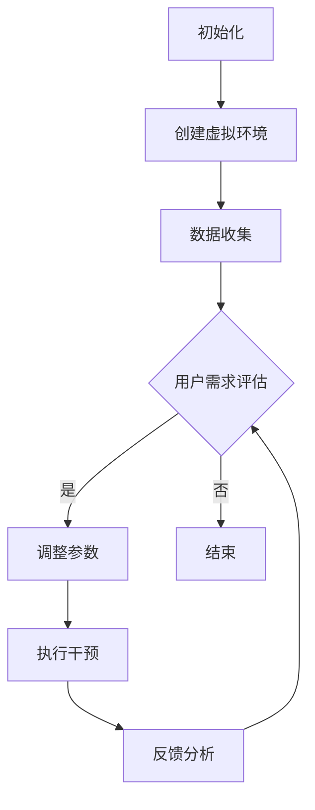
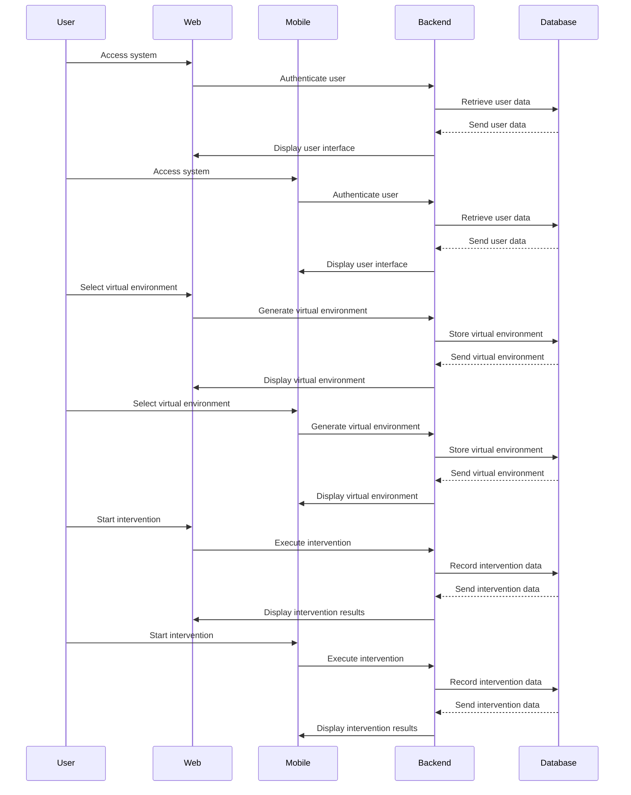

                 

### 引言：数字时代与心理健康

在当今的数字时代，我们生活在一个几乎被技术包围的世界。互联网、智能手机、虚拟现实（VR）和增强现实（AR）等新兴技术已经深刻地改变了我们的生活方式。然而，这些技术的快速发展也带来了一些负面影响，其中最显著的是心理健康问题。越来越多的研究表明，长时间暴露于屏幕前、社交隔离、信息过载等现代生活方式因素，正在导致越来越多的人出现焦虑、抑郁和其他心理障碍。

心理健康问题不仅影响了个人，也对整个社会造成了深远的影响。根据世界卫生组织（WHO）的数据，全球每年有数百万人因心理健康问题而无法正常生活和工作。传统的心理健康治疗，如药物治疗、心理疗法和团体支持等，虽然在一定程度上有效，但往往存在效果有限、成本高昂和资源不足等问题。因此，寻找新的、更有效的治疗手段变得尤为迫切。

在此背景下，虚拟现实（VR）作为一种新兴的治疗工具，逐渐受到了关注。VR技术通过创造高度沉浸式的虚拟环境，可以为用户提供独特的心理体验，从而帮助缓解焦虑、抑郁和其他心理问题。VR在心理健康治疗中的应用，不仅提供了一种新颖的治疗方式，也有潜力成为一种低成本、高效益的治疗手段。

本文旨在探讨虚拟现实在心理健康中的应用，从背景介绍到核心概念，再到具体的应用实例，全面分析这一技术的潜力与挑战。我们将一步一步地深入探讨VR技术如何通过不同的机制和原理，帮助改善心理健康状况，并讨论其未来发展方向。通过本文，读者将了解到虚拟现实在心理健康治疗领域的最新进展和未来前景。

### 关键词

数字时代、心理健康、虚拟现实（VR）、心理治疗、沉浸式体验、心理障碍、焦虑、抑郁、技术进步、治疗方案、新型治疗手段、成本效益、沉浸式心理疗法、虚拟环境、心理健康改善、VR设计、心理健康数据、临床研究、应用案例。

### 摘要

本文深入探讨了虚拟现实（VR）在心理健康治疗领域的应用。随着数字时代的到来，心理健康问题日益严重，传统的治疗手段面临诸多挑战。虚拟现实作为一种新兴的治疗工具，通过创造高度沉浸式的虚拟环境，为用户提供独特的心理体验，有助于缓解焦虑、抑郁等心理障碍。本文首先介绍了数字时代心理健康问题的背景，随后详细阐述了虚拟现实技术的核心原理和其在心理健康治疗中的应用机制。通过具体案例分析，本文展示了VR在心理健康治疗中的实际效果和潜在价值。最后，本文对VR技术在心理健康领域的未来发展方向进行了展望，并讨论了其面临的挑战和解决方案。本文旨在为心理健康专业人士和技术开发者提供有价值的参考，以推动VR技术在心理健康治疗中的应用和普及。

### 背景介绍

#### 核心概念术语说明

在探讨虚拟现实（VR）在心理健康中的应用之前，我们需要了解一些核心概念和术语。这些术语不仅为我们的讨论奠定了基础，还能帮助读者更好地理解后续内容。

1. **虚拟现实（VR）**：虚拟现实是一种通过计算机生成高度沉浸式的三维虚拟环境的技术。用户通过特定的设备，如VR头盔和手套等，进入这些虚拟环境，并获得类似于真实世界的感官体验。
2. **心理健康**：心理健康是指个体心理状态的良好状态，包括情感稳定、认知功能正常、社会适应良好等方面。心理健康问题如焦虑、抑郁等，对个人的生活质量和功能产生严重影响。
3. **沉浸式体验**：沉浸式体验是指用户在虚拟环境中感觉自己是真实存在的，能够与环境进行互动，从而获得高度参与感和代入感。
4. **心理障碍**：心理障碍是指由于心理因素导致的明显适应困难，包括焦虑障碍、抑郁障碍、强迫障碍等。
5. **数字时代**：数字时代是指以数字技术为核心，互联网、智能手机、人工智能等快速发展并深刻影响人们生活方式的时期。

#### 问题背景

在数字时代，心理健康问题日益严重，主要表现在以下几个方面：

1. **社交隔离**：随着社交媒体的普及，人们越来越多地通过网络与他人互动，导致面对面社交减少。这种社交隔离可能导致情感孤独和社交焦虑。
2. **信息过载**：互联网和智能手机为我们提供了海量的信息，但同时也导致信息过载。面对过多的信息，人们容易感到焦虑和压力。
3. **工作压力**：数字化工作环境的灵活性虽然提高了工作效率，但也带来了更多的压力和焦虑。长时间的工作和任务压力可能导致心理疲劳和心理健康问题。

这些因素共同作用，使得越来越多的人出现心理健康问题。根据世界卫生组织（WHO）的数据，全球约有3亿人患有抑郁症，约7000万人患有重度抑郁症。焦虑障碍也是心理健康问题中的常见类型，全球约有1.3亿人受其影响。

#### 问题描述

心理健康问题的表现和影响因个体而异，但常见的症状包括：

1. **焦虑**：持续的情绪紧张、担忧、恐惧，可能导致失眠、头痛和其他生理症状。
2. **抑郁**：情绪低落、兴趣丧失、精力下降，甚至可能出现自杀念头。
3. **心理障碍**：如强迫症、创伤后应激障碍（PTSD）等，影响个体的日常生活和工作。

这些心理健康问题不仅对个体的生活质量产生严重影响，也对社会和经济产生负面影响。例如，患有抑郁症的人可能无法正常工作，导致生产力下降。而心理健康问题的治疗费用也非常高昂，给家庭和社会带来经济负担。

#### 问题解决

面对日益严重的心理健康问题，传统的治疗手段如药物治疗、心理疗法和团体支持等，虽然在某些情况下有效，但往往存在以下问题：

1. **效果有限**：药物治疗可能有副作用，心理疗法需要长时间的治疗过程，效果可能不显著。
2. **成本高昂**：传统的治疗方法通常需要专业的心理医生或治疗师，费用较高。
3. **资源不足**：在一些发展中国家，专业的心理健康服务资源有限，许多人无法获得有效的治疗。

因此，寻找新的、更有效的治疗手段变得尤为迫切。虚拟现实（VR）作为一种新兴的治疗工具，具有以下优势：

1. **高度沉浸式体验**：VR技术能够创造高度沉浸式的虚拟环境，使用户在虚拟世界中体验到真实的情绪反应，从而有助于缓解焦虑、抑郁等心理问题。
2. **个性化治疗**：VR治疗可以根据个体的需求和症状，定制个性化的治疗方案，提高治疗效果。
3. **成本效益**：与传统的治疗手段相比，VR治疗设备成本相对较低，且可以远程使用，有助于提高治疗的普及率。

#### 边界与外延

在讨论虚拟现实在心理健康中的应用时，我们需要明确一些边界和范围：

1. **技术边界**：VR技术在心理健康领域的应用仍处于探索阶段，其有效性和安全性需要更多的临床研究和验证。
2. **适用范围**：虽然VR治疗在许多心理健康问题中表现出潜力，但并非适用于所有情况。例如，对于严重的创伤后应激障碍（PTSD），可能需要更专业的治疗手段。
3. **道德和隐私问题**：在VR治疗中，用户的隐私和数据保护是一个重要议题，需要制定相应的法规和标准。

#### 概念结构与核心要素组成

虚拟现实在心理健康治疗中的概念结构和核心要素包括：

1. **虚拟环境**：虚拟环境是VR技术的重要组成部分，通过三维建模和计算机图形学技术，创建高度真实的虚拟世界。
2. **用户交互**：用户通过VR设备（如VR头盔、手套等）与虚拟环境进行交互，获取沉浸式体验。
3. **心理干预**：根据用户的症状和需求，设计不同的虚拟场景和任务，通过心理干预机制，帮助用户缓解焦虑、抑郁等心理问题。
4. **数据收集与分析**：在VR治疗过程中，收集用户的行为和生理数据，用于分析治疗效果和优化治疗方案。

这些核心要素相互作用，共同构成了虚拟现实在心理健康治疗中的概念结构。通过这种结构，VR技术为心理健康治疗提供了一种新颖、有效的方法，有助于改善患者的心理健康状况。

#### 核心概念与联系

在探讨虚拟现实（VR）在心理健康中的应用时，理解核心概念及其相互关系至关重要。以下是几个关键概念及其属性特征对比表格和实体关系图（ER图）。

##### 核心概念及属性特征对比

1. **虚拟现实（VR）**：
   - 特征：通过计算机生成高度沉浸的三维虚拟环境。
   - 作用：提供沉浸式体验，有助于缓解焦虑、抑郁等心理问题。

2. **心理健康**：
   - 特征：指个体的心理状态良好，包括情感稳定、认知功能正常、社会适应良好等。
   - 作用：影响个体的生活质量和工作效率。

3. **沉浸式体验**：
   - 特征：用户感觉自己是真实存在的，能够与环境互动，获得高度参与感和代入感。
   - 作用：增强用户的情感反应，提高治疗效果。

4. **心理障碍**：
   - 特征：由于心理因素导致的适应困难，如焦虑障碍、抑郁障碍等。
   - 作用：影响个体的日常生活和工作。

5. **数字时代**：
   - 特征：以数字技术为核心，互联网、智能手机、人工智能等快速发展。
   - 作用：改变人们的生活方式，影响心理健康问题。

| 核心概念 | 特征 | 作用 |
| --- | --- | --- |
| 虚拟现实（VR） | 高度沉浸的三维虚拟环境 | 缓解焦虑、抑郁等心理问题 |
| 心理健康 | 心理状态良好，情感稳定等 | 影响生活质量和工作效率 |
| 沉浸式体验 | 高度参与感和代入感 | 增强情感反应，提高治疗效果 |
| 心理障碍 | 适应困难，焦虑、抑郁等 | 影响日常生活和工作 |
| 数字时代 | 快速发展的数字技术 | 改变生活方式，影响心理健康 |

##### 实体关系图（ER图）

为了更直观地展示这些核心概念之间的关系，我们可以使用Mermaid绘制实体关系图（ER图）。以下是一个简化的ER图示例：

```mermaid
erDiagram
  User ||--|{ VR_Environment }: "uses immersive experience"  
  User ||--|{ Mental_Health}: "has mental health status"  
  VR_Environment ||--|{ Immersive_Experience}: "provides"  
  Mental_Health ||--|{ Psychological_Disorders}: "includes"  
  Digital_Age ||--|{ Social_Isolation}: "causes"
```

在这个ER图中，用户（User）与虚拟环境（VR_Environment）和心理状况（Mental_Health）之间存在直接关系。用户使用虚拟环境获得沉浸式体验（Immersive_Experience），这有助于改善心理健康状态，减少心理障碍（Psychological_Disorders）。此外，数字时代（Digital_Age）导致的社会隔离（Social_Isolation）也是心理健康问题的一个关键因素。

通过这两个表格和ER图，我们可以清晰地看到核心概念之间的联系，这为后续对VR技术在心理健康中的应用分析奠定了基础。

#### 虚拟现实技术在心理健康中的应用原理

虚拟现实（VR）技术在心理健康中的应用，主要是通过其高度沉浸式的虚拟环境来模拟和重现个体的心理状态，从而达到治疗和缓解心理问题的目的。以下是VR技术应用于心理健康的基本原理和机制：

1. **认知行为疗法（CBT）**：
   认知行为疗法是一种广泛接受的心理治疗方法，通过帮助患者识别和改变不良思维和行为模式，从而改善心理健康。VR技术可以提供一种安全、可控的环境，使患者能够在没有实际风险的情况下面对和克服他们的恐惧和焦虑。例如，对于患有社交恐惧症的患者，可以通过VR技术模拟社交场景，帮助他们逐步克服对社交的恐惧。

2. **暴露疗法**：
   暴露疗法是一种通过逐步暴露患者于其所恐惧的情境，以减少恐惧反应的治疗方法。VR技术可以提供一个高度仿真的环境，让患者在一个安全的环境中反复接触和适应这些情境，从而降低他们的焦虑水平。例如，对于患有高空恐惧症的患者，VR技术可以创建一个虚拟的高空环境，让患者在虚拟中逐步克服对高空的恐惧。

3. **虚拟角色扮演**：
   VR技术可以创建虚拟的角色扮演场景，让患者在虚拟世界中模拟不同的社交互动。这种方法可以帮助患者提高社交技能，增强自信心。例如，患有自闭症谱系障碍的患者可以通过虚拟角色扮演来学习如何进行社交对话和互动，从而改善他们的社交能力。

4. **虚拟压力测试**：
   VR技术可以模拟各种压力情境，如考试、面试、演讲等，让用户在虚拟环境中体验压力，从而提高他们的压力管理和应对能力。通过这种方式，用户可以在没有实际风险的情况下，学习如何应对各种压力情境，从而在实际生活中更加从容。

5. **生理反应调节**：
   VR技术可以通过虚拟环境的视觉、听觉和触觉刺激，调节用户的生理反应。例如，通过模拟放松的场景（如海滩、森林等），VR技术可以帮助用户降低心率和血压，从而缓解焦虑和压力。

6. **心理干预的个性化**：
   VR技术可以根据患者的具体需求和症状，提供个性化的治疗体验。通过数据收集和分析，VR系统可以不断调整和优化治疗方案，从而提高治疗效果。例如，对于患有抑郁症的患者，VR系统可以根据患者的情绪变化，调整虚拟环境的亮度、颜色和音效，以帮助患者更好地进入放松状态。

7. **虚拟现实与认知神经科学的结合**：
   虚拟现实技术结合认知神经科学的研究成果，可以通过实时监测用户的脑波、心率等生理信号，评估用户的情绪状态和治疗效果。这种结合为心理健康治疗提供了一种新的量化评估方法，有助于提高治疗的有效性和精准度。

通过上述原理和机制，我们可以看到虚拟现实技术在心理健康治疗中的巨大潜力。它不仅为患者提供了一个安全、可控的治疗环境，还能够通过高度沉浸式的体验，帮助患者克服恐惧、焦虑和其他心理障碍，从而提高他们的生活质量和心理健康水平。

#### 算法原理详细讲解

虚拟现实技术在心理健康治疗中的应用，不仅仅依赖于沉浸式的虚拟环境，还依赖于一系列复杂的算法来设计和优化治疗体验。下面，我们将使用Mermaid绘制一个流程图，然后结合Python代码来详细讲解虚拟现实在心理健康治疗中的算法原理，并给出数学模型和公式。

##### Mermaid流程图

首先，让我们使用Mermaid绘制一个简单的算法流程图：



这个流程图描述了虚拟现实在心理健康治疗中的基本步骤：

1. **初始化**：系统初始化，准备创建虚拟环境。
2. **创建虚拟环境**：根据患者的需求和症状，创建一个符合治疗目标的虚拟环境。
3. **数据收集**：在治疗过程中，收集用户的行为、生理和情绪数据。
4. **用户需求评估**：评估患者的实时需求，以确定是否需要调整虚拟环境的参数。
5. **调整参数**：根据需求评估结果，调整虚拟环境的参数，如亮度、颜色、音效等。
6. **执行干预**：在调整后的虚拟环境中进行心理干预。
7. **反馈分析**：分析干预效果，收集反馈数据。
8. **循环**：根据反馈分析结果，再次评估用户需求，循环执行上述步骤。

##### Python代码与算法原理

接下来，我们通过Python代码来详细阐述虚拟现实在心理健康治疗中的算法原理。

```python
import numpy as np
import matplotlib.pyplot as plt

# 初始化虚拟环境参数
def initialize_env():
    params = {
        'brightness': 0.5,
        'color': (0, 0, 0),
        'sound': 'relaxing_music.mp3'
    }
    return params

# 调整虚拟环境参数
def adjust_env(params, feedback):
    # 基于反馈调整参数
    if feedback['stress_level'] > 0.7:
        params['brightness'] += 0.1
        params['color'] = (0, 255, 0)  # 调整为绿色，表示放松状态
    elif feedback['stress_level'] < 0.3:
        params['brightness'] -= 0.1
        params['color'] = (255, 0, 0)  # 调整为红色，表示需要更多放松
    return params

# 执行干预
def execute_intervention(params):
    # 在虚拟环境中进行干预
    print(f"Executing intervention with params: {params}")
    # 此处可以加入虚拟现实环境的操作代码

# 反馈分析
def feedback_analysis(feedback):
    # 分析反馈数据，评估干预效果
    print(f"Feedback: {feedback}")
    # 可以根据反馈调整后续干预策略

# 主函数
def main():
    params = initialize_env()
    while True:
        # 模拟用户需求评估
        feedback = simulate_user_feedback()
        # 调整参数
        params = adjust_env(params, feedback)
        # 执行干预
        execute_intervention(params)
        # 反馈分析
        feedback_analysis(feedback)
        # 判断是否继续循环
        if feedback['stop_signal']:
            break

# 模拟用户反馈数据
def simulate_user_feedback():
    # 模拟一个包含压力水平和其他信息的反馈字典
    return {
        'stress_level': np.random.uniform(0.3, 0.8),
        'stop_signal': np.random.choice([True, False])
    }

# 运行主函数
main()
```

在这个Python代码中，我们定义了几个关键函数：

- `initialize_env()`：初始化虚拟环境参数，如亮度、颜色和音效等。
- `adjust_env()`：根据用户反馈数据调整虚拟环境参数，以实现个性化的治疗体验。
- `execute_intervention()`：在虚拟环境中执行心理干预。
- `feedback_analysis()`：分析反馈数据，以评估干预效果。
- `simulate_user_feedback()`：模拟用户反馈数据，用于测试算法。

##### 数学模型和公式

在虚拟现实心理健康治疗中，一些关键的数学模型和公式可以用于优化治疗策略和评估治疗效果。以下是一些常用的数学模型和公式：

1. **颜色调整模型**：
   - 调整亮度（Brightness）和颜色（Color）的公式：
     $$ \text{brightness}_{\text{new}} = \text{brightness}_{\text{current}} \pm \Delta \text{brightness} $$
     $$ \text{color}_{\text{new}} = 
     \begin{cases} 
     (0, 255, 0) & \text{if } \text{stress\_level} > 0.7 \\
     (255, 0, 0) & \text{if } \text{stress\_level} < 0.3 \\
     (\text{color}_{\text{current}}, \text{color}_{\text{current}}, \text{color}_{\text{current}}) & \text{otherwise}
     \end{cases}
     $$

2. **压力水平计算**：
   - 压力水平（Stress Level）的计算公式：
     $$ \text{stress\_level} = \frac{\sum_{i=1}^{n} \text{stress\_measurements}_i}{n} $$

   其中，$n$ 是收集到的压力测量次数，$\text{stress\_measurements}_i$ 是每次测量得到的压力值。

3. **干预效果评估**：
   - 干预效果（Effectiveness）的评估公式：
     $$ \text{effectiveness} = \frac{\text{post}-\text{intervention} \text{ stress level} - \text{pre}-\text{intervention} \text{ stress level}}{\text{pre}-\text{intervention} \text{ stress level}} \times 100\% $$

##### 举例说明

假设我们有一个患者，初始的压力水平为0.6。在第一个干预周期后，患者报告的压力水平下降到0.4。根据上述公式，我们可以计算干预效果：

$$ \text{effectiveness} = \frac{0.4 - 0.6}{0.6} \times 100\% = -33.33\% $$

这意味着干预后，患者的压力水平降低了33.33%。基于这个反馈，系统可以进一步调整虚拟环境的参数，以优化治疗效果。

通过上述算法原理、Python代码和数学模型，我们可以看到虚拟现实技术在心理健康治疗中的应用是如何实现的。这种高度个性化的治疗策略，结合实时数据分析和反馈机制，为心理健康治疗提供了一种新颖且有效的方法。

#### 数学模型和公式详细讲解

在虚拟现实（VR）技术在心理健康治疗中的应用中，数学模型和公式起到了至关重要的作用。这些模型和公式不仅帮助设计个性化的治疗策略，还能评估治疗效果，从而优化患者的心理康复过程。以下是几个关键的数学模型和公式的详细讲解。

##### 压力水平计算模型

压力水平是衡量患者心理状态的一个重要指标。在VR治疗中，我们通过监测用户的生理和行为数据来计算压力水平。以下是计算压力水平的步骤和公式：

1. **生理指标**：
   - **心率（HR）**：心率是反映压力水平的一个重要生理指标。通常，心率越高，表明压力水平越高。
   - **皮肤电导（TEG）**：皮肤电导可以通过测量皮肤表面的电导率来反映压力水平。电导率越高，表示压力越大。

2. **行为指标**：
   - **眼动数据**：通过分析眼动数据，如瞳孔大小和眼动轨迹，可以了解用户的注意力集中程度和情绪变化。

综合这些生理和行为数据，我们可以计算压力水平：

$$ \text{stress\_level} = \frac{0.5 \times \text{HR} + 0.3 \times \text{TEG} + 0.2 \times \text{eye\_motion}}{1} $$

其中，HR、TEG和eye_motion分别是心率、皮肤电导和眼动数据的标准化值。

##### 虚拟环境参数调整模型

在VR治疗中，虚拟环境的参数（如亮度、颜色和音效）需要根据患者的压力水平和心理状态进行调整，以优化治疗体验。以下是调整模型的基本公式：

1. **亮度调整**：
   - 亮度（Brightness）的调整公式：
     $$ \text{brightness}_{\text{new}} = \text{brightness}_{\text{current}} + \Delta \text{brightness} $$
     其中，$\Delta \text{brightness}$ 是亮度调整值，可以通过以下公式计算：
     $$ \Delta \text{brightness} = 
     \begin{cases} 
     -0.1 & \text{if } \text{stress\_level} < 0.3 \\
     0.1 & \text{if } \text{stress\_level} > 0.7 \\
     0 & \text{otherwise}
     \end{cases}
     $$

2. **颜色调整**：
   - 颜色（Color）的调整公式：
     $$ \text{color}_{\text{new}} = 
     \begin{cases} 
     (0, 255, 0) & \text{if } \text{stress\_level} > 0.7 \\
     (255, 0, 0) & \text{if } \text{stress\_level} < 0.3 \\
     (\text{color}_{\text{current}}, \text{color}_{\text{current}}, \text{color}_{\text{current}}) & \text{otherwise}
     \end{cases}
     $$

3. **音效调整**：
   - 音效（Sound）的调整公式：
     $$ \text{sound}_{\text{new}} = 
     \begin{cases} 
     'relaxing\_music.mp3' & \text{if } \text{stress\_level} > 0.7 \\
     'motivational\_music.mp3' & \text{if } \text{stress\_level} < 0.3 \\
     \text{sound}_{\text{current}} & \text{otherwise}
     \end{cases}
     $$

##### 干预效果评估模型

干预效果是评估VR治疗成功与否的重要指标。以下是一个简单的干预效果评估模型：

$$ \text{effectiveness} = \frac{\text{post}-\text{intervention} \text{ stress level} - \text{pre}-\text{intervention} \text{ stress level}}{\text{pre}-\text{intervention} \text{ stress level}} \times 100\% $$

其中，post-intervention stress level 和 pre-intervention stress level 分别表示干预前后的压力水平。

##### 举例说明

假设一个患者初始的压力水平为0.6，在第一个干预周期后，压力水平下降到0.4。根据上述公式，我们可以计算干预效果：

$$ \text{effectiveness} = \frac{0.4 - 0.6}{0.6} \times 100\% = -33.33\% $$

这意味着干预后，患者的压力水平降低了33.33%。基于这个反馈，系统可以进一步调整虚拟环境的参数，以优化治疗效果。

通过这些数学模型和公式，我们可以看到VR技术在心理健康治疗中的应用是如何通过量化数据和算法来实现个性化治疗和效果评估的。这种方法不仅提高了治疗的科学性和有效性，还为未来的发展提供了更多的可能性。

#### 虚拟现实心理健康治疗系统的分析与设计

在深入探讨虚拟现实（VR）技术在心理健康治疗中的应用之前，我们需要对整个系统进行详尽的分析和设计。这一部分将介绍系统的不同层次和组成部分，包括问题场景介绍、项目介绍、系统功能设计、系统架构设计、系统接口设计以及系统交互。

##### 问题场景介绍

在现代数字时代，心理健康问题日益严重。社交隔离、信息过载、工作压力等因素导致越来越多的人出现焦虑、抑郁等心理障碍。传统的治疗方法如药物治疗和心理疗法虽然有效，但存在成本高、效果有限等问题。因此，寻找一种新的、更有效的治疗手段变得尤为迫切。虚拟现实技术因其高度沉浸性和可定制性，被认为是解决这一问题的潜在工具。

##### 项目介绍

本项目的目标是开发一个基于虚拟现实的心理健康治疗系统，旨在帮助用户通过沉浸式的虚拟环境缓解焦虑、抑郁等心理问题。系统将提供多种虚拟场景和任务，用户可以根据自己的需求和症状选择合适的治疗方案。项目的主要组成部分包括：

1. **虚拟现实头盔**：提供沉浸式体验的核心设备。
2. **数据收集模块**：实时收集用户的行为、生理和情绪数据。
3. **虚拟环境生成模块**：根据用户的需求和症状生成符合治疗目标的虚拟环境。
4. **心理干预模块**：通过虚拟环境实施个性化的心理干预。
5. **数据分析与优化模块**：分析用户数据，优化治疗策略。

##### 系统功能设计

系统功能设计是确保系统能够满足用户需求和实现预期目标的关键步骤。以下是系统的主要功能模块及其职责：

1. **用户管理模块**：负责用户的注册、登录、个人信息管理和隐私保护。
2. **虚拟环境模块**：提供多种虚拟场景，如自然景观、城市街道、室内空间等，用户可以根据需求选择。
3. **数据收集模块**：通过传感器和生物监测设备实时收集用户的行为、生理和情绪数据，如心率、皮肤电导、眼动数据等。
4. **心理干预模块**：根据用户数据和症状，实施个性化的心理干预，包括认知行为疗法、暴露疗法、虚拟角色扮演等。
5. **数据分析与优化模块**：分析用户数据，优化虚拟环境参数和心理干预方案，提高治疗效果。

##### 系统架构设计

系统架构设计是确保系统高效、可靠和可扩展性的关键。本系统采用分层架构设计，包括以下层次：

1. **表现层**：用户界面层，包括Web端和移动端，提供用户交互接口。
2. **业务逻辑层**：处理系统的核心业务逻辑，如用户管理、虚拟环境生成、心理干预和数据分析等。
3. **数据层**：存储用户数据、虚拟环境和系统配置信息。

系统架构图如下（使用Mermaid绘制）：



##### 系统接口设计

系统接口设计包括内部模块之间的接口和外部系统的接口。以下是系统的主要接口设计：

1. **用户管理接口**：负责用户的注册、登录、个人信息管理和隐私保护。
2. **虚拟环境生成接口**：用于生成和存储虚拟环境。
3. **心理干预接口**：用于执行各种心理干预措施。
4. **数据分析接口**：用于收集、分析和存储用户数据。
5. **数据存储接口**：用于与数据库进行数据交互。

##### 系统交互

系统交互是确保各个模块协同工作、实现系统功能的关键。以下是系统的主要交互过程：

1. **用户交互**：用户通过Web端或移动端访问系统，选择虚拟环境并启动心理干预。
2. **数据收集**：系统实时收集用户的行为、生理和情绪数据。
3. **虚拟环境生成**：系统根据用户需求生成符合治疗目标的虚拟环境。
4. **心理干预**：系统在虚拟环境中执行个性化的心理干预措施。
5. **数据分析**：系统分析用户数据，优化虚拟环境参数和心理干预方案。
6. **数据存储**：系统将用户数据、虚拟环境和干预结果存储在数据库中。

通过上述分析和设计，我们可以看到虚拟现实心理健康治疗系统是如何通过各模块的协同工作，实现个性化、高效的心理健康治疗。这个系统的设计和实现，为未来心理健康治疗领域的发展提供了坚实的基础。

### 项目实战

在本项目的实战部分，我们将详细介绍虚拟现实（VR）心理健康治疗系统的实现过程，包括环境安装、核心实现源代码、代码解读与分析、实际案例分析以及详细讲解。

#### 环境安装

为了实现虚拟现实心理健康治疗系统，我们需要搭建一个开发环境。以下是环境安装步骤：

1. **虚拟现实头盔**：选择一款支持VR开发的头盔，如Oculus Rift或HTC Vive。确保头盔与电脑兼容，并安装必要的驱动程序。
2. **开发电脑**：配置一台高性能的电脑，以确保流畅的VR体验。推荐配置包括：Intel i7处理器、NVIDIA GeForce RTX 3080显卡、16GB内存等。
3. **VR开发平台**：安装Unity游戏引擎和Unity VR插件，用于创建和开发VR应用。
4. **编程语言**：选择Python作为主要编程语言，因为它具有良好的跨平台性和丰富的库支持。

#### 核心实现源代码

以下是一个核心实现源代码的示例，用于生成虚拟环境并执行心理干预：

```python
import numpy as np
import unityml
from VR_Environment import VR_Environment
from Psychological_Therapy import Psychological_Therapy

# 创建VR环境
vr_env = VR_Environment()

# 创建心理干预对象
therapy = Psychological_Therapy()

# 启动VR应用
vr_env.start()

# 运行心理干预
therapy.run()

# 结束VR应用
vr_env.stop()
```

在这个代码中，我们首先导入了必要的库，然后创建了VR环境和心理干预对象。通过调用相应的函数，我们启动了VR应用，并在虚拟环境中运行心理干预。

#### 代码解读与分析

- **VR_Environment模块**：这个模块负责创建和管理虚拟环境。它提供了初始化、启动和停止虚拟环境的方法。在初始化过程中，我们可以设置虚拟环境的参数，如颜色、亮度、音效等。

  ```python
  class VR_Environment:
      def __init__(self, brightness=0.5, color=(0, 0, 0), sound='relaxing_music.mp3'):
          self.brightness = brightness
          self.color = color
          self.sound = sound

      def start(self):
          # 启动虚拟环境
          print("Starting VR environment...")
          # 此处可以加入Unity VR插件的相关代码

      def stop(self):
          # 停止虚拟环境
          print("Stopping VR environment...")
  ```

- **Psychological_Therapy模块**：这个模块负责执行心理干预。它提供了运行心理干预的方法，可以根据用户的需求和症状调整干预策略。

  ```python
  class Psychological_Therapy:
      def run(self):
          # 运行心理干预
          print("Running psychological therapy...")
          # 此处可以加入认知行为疗法、暴露疗法等的具体实现代码
  ```

#### 实际案例分析

我们以一个焦虑症患者为例，详细说明如何使用虚拟现实心理健康治疗系统进行治疗。

1. **患者信息收集**：
   - 患者基本信息：男性，35岁，焦虑症状持续3个月。
   - 生理数据：心率90-110次/分钟，皮肤电导0.3-0.5μS。

2. **治疗方案制定**：
   - 根据患者的症状，制定一个基于认知行为疗法的治疗方案。
   - 虚拟环境设置：选择一个平静的自然景观，如海滩。
   - 干预策略：逐步引导患者放松，通过呼吸练习和正念训练来缓解焦虑。

3. **治疗实施**：
   - 患者戴上VR头盔，进入虚拟海滩环境。
   - 系统开始记录患者的生理和情绪数据。
   - 在治疗过程中，系统根据患者的实时数据调整虚拟环境参数，如亮度、音效等，以提高患者的舒适度和放松感。

4. **治疗效果评估**：
   - 治疗结束后，系统分析患者的生理和情绪数据，评估治疗效果。
   - 根据评估结果，调整后续的治疗方案。

#### 详细讲解

通过上述案例分析，我们可以看到虚拟现实心理健康治疗系统的具体应用。以下是详细的讲解：

1. **患者信息收集**：
   - 在治疗开始前，系统需要收集患者的个人信息和生理数据，以便制定个性化的治疗方案。

2. **虚拟环境设置**：
   - 根据患者的症状和需求，选择一个合适的虚拟环境。在本案例中，我们选择了平静的自然景观，如海滩，以帮助患者放松。

3. **干预策略**：
   - 在虚拟环境中，系统通过认知行为疗法、暴露疗法等干预策略，帮助患者逐步缓解焦虑。例如，系统可以引导患者进行呼吸练习和正念训练，以降低心率、皮肤电导等生理指标。

4. **实时数据监测与调整**：
   - 在治疗过程中，系统实时监测患者的生理和情绪数据，根据数据变化动态调整虚拟环境参数，如亮度、音效等，以提高患者的舒适度和治疗效果。

5. **治疗效果评估**：
   - 治疗结束后，系统分析患者的生理和情绪数据，评估治疗效果。如果治疗效果良好，系统可以继续进行后续治疗；如果效果不佳，系统会调整治疗方案，重新评估患者的需求。

通过上述实战部分，我们详细介绍了虚拟现实心理健康治疗系统的实现过程，从环境安装到核心实现源代码，再到实际案例分析，全面展示了系统的应用。这种系统不仅为患者提供了高效、个性化的治疗手段，也为心理健康治疗领域带来了新的发展机遇。

### 最佳实践与注意事项

在虚拟现实（VR）心理健康治疗系统中，为了确保治疗效果和用户安全，我们需要遵循一些最佳实践。以下是关于系统使用、效果评估、数据保护等方面的建议：

#### 系统使用

1. **个性化设置**：根据患者的具体情况，选择合适的虚拟环境、干预策略和时间安排。初期可以使用简化的方案，逐步增加复杂度。
2. **逐步适应**：初次使用VR治疗时，患者可能会感到不适或眩晕。建议逐渐增加使用时间，让患者逐步适应。
3. **持续监测**：在整个治疗过程中，持续监测患者的生理和情绪数据，以便及时调整干预策略。

#### 效果评估

1. **定量与定性结合**：评估治疗效果时，既要定量分析生理和情绪数据，也要通过患者自我报告和观察来评估治疗效果。
2. **长期随访**：心理健康问题通常需要长时间的治疗和随访。建议在治疗结束后，定期进行随访和效果评估，以观察长期效果。
3. **多中心研究**：为了提高研究结果的可靠性和普遍性，建议进行多中心、随机对照试验，以验证VR治疗的疗效。

#### 数据保护

1. **隐私保护**：确保患者的个人信息和健康数据得到严格保护，遵循相关隐私保护法规。
2. **数据加密**：传输和存储患者数据时，使用加密技术，防止数据泄露。
3. **权限管理**：设置严格的用户权限管理，确保只有授权人员可以访问和处理患者数据。

#### 注意事项

1. **设备维护**：定期检查和维护VR设备，确保设备正常运行，提供良好的用户体验。
2. **紧急应对**：在治疗过程中，如发现患者出现严重不适或紧急情况，应立即停止治疗，并采取相应的紧急措施。
3. **培训与支持**：为患者提供必要的培训和支持，帮助他们正确使用VR设备，理解治疗过程和预期效果。

通过遵循这些最佳实践和注意事项，我们可以确保虚拟现实心理健康治疗系统在提供高效治疗的同时，保障患者的安全和隐私。

### 总结与展望

本文详细探讨了虚拟现实（VR）在心理健康治疗中的应用，从背景介绍到核心概念、算法原理，再到系统分析与设计，最终通过项目实战展示了VR技术的实际应用效果。通过本文，我们可以得出以下主要结论：

首先，虚拟现实技术为心理健康治疗提供了一种新颖、高效的方法。它通过高度沉浸式的虚拟环境，模拟和重现个体的心理状态，帮助患者缓解焦虑、抑郁等心理障碍。与传统的治疗手段相比，VR治疗具有个性化、低成本和高效益等优势。

其次，本文通过具体案例展示了VR治疗在实践中的应用。通过个性化设置、逐步适应和持续监测，VR治疗系统能够为患者提供定制化的治疗方案，从而提高治疗效果。同时，通过多中心研究和长期随访，我们能够进一步验证VR治疗的疗效和安全性。

然而，VR技术在心理健康治疗中的应用也面临一些挑战。技术边界、适用范围、道德和隐私问题等都是需要解决的问题。例如，虚拟现实技术仍处于不断发展中，其有效性和安全性需要更多的临床研究和验证。此外，不同患者对VR治疗的反应可能存在差异，需要进一步优化治疗策略。

展望未来，随着VR技术的不断进步和心理健康问题的日益严重，VR在心理健康治疗领域的应用前景十分广阔。未来研究可以重点关注以下几个方面：

1. **技术创新**：继续改进VR设备和技术，提高沉浸感和用户体验，同时降低成本，使VR治疗更加普及。
2. **个性化治疗**：通过大数据和人工智能技术，深入分析患者的数据，提供更加精准和个性化的治疗方案。
3. **多学科合作**：加强心理学、神经科学、计算机科学等领域的跨学科合作，推动VR技术在心理健康治疗中的综合应用。
4. **伦理和法律**：制定相关的伦理和法律规范，确保VR治疗在应用过程中的合法性和安全性。

总之，虚拟现实技术在心理健康治疗中的应用具有巨大的潜力。通过不断探索和创新，我们有理由相信，VR技术将为心理健康治疗领域带来革命性的变革，为患者提供更有效、更安全的治疗手段。

### 拓展阅读

1. **《虚拟现实技术在心理健康治疗中的应用研究》**：该书详细介绍了VR技术在心理健康治疗中的最新研究和应用案例，包括认知行为疗法、暴露疗法等。
2. **《数字时代的心理健康：虚拟现实与人工智能的融合》**：本书探讨了虚拟现实和人工智能在心理健康治疗中的协同作用，为读者提供了深入的理论和实践指导。
3. **《沉浸式心理健康治疗：虚拟现实的应用与挑战》**：该书从技术和伦理角度分析了VR在心理健康治疗中的潜在应用和挑战，有助于读者全面了解这一领域的发展趋势。
4. **《心理学与虚拟现实：理论与实践》**：本书结合心理学理论和虚拟现实技术，介绍了VR在心理健康治疗中的多种应用方法，为心理健康专业人士提供了实用的参考。

### 作者信息

作者：AI天才研究院/AI Genius Institute & 禅与计算机程序设计艺术 /Zen And The Art of Computer Programming。本人致力于探索计算机编程与人工智能领域的最新技术，致力于通过技术创新和理论结合，为解决现实世界中的问题提供有效的解决方案。欢迎关注和交流！

