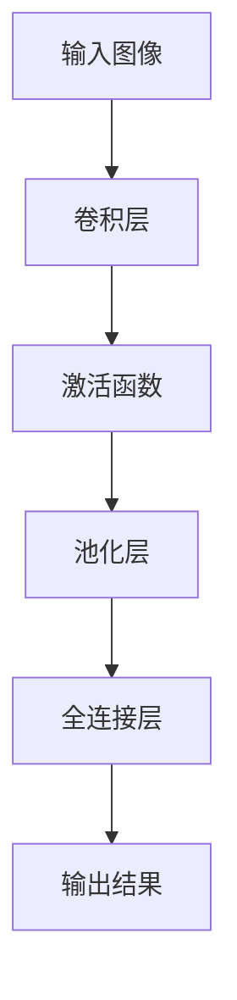
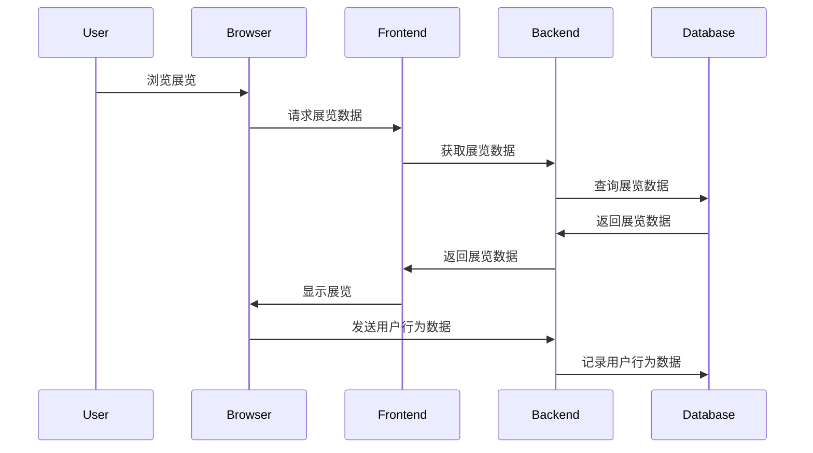
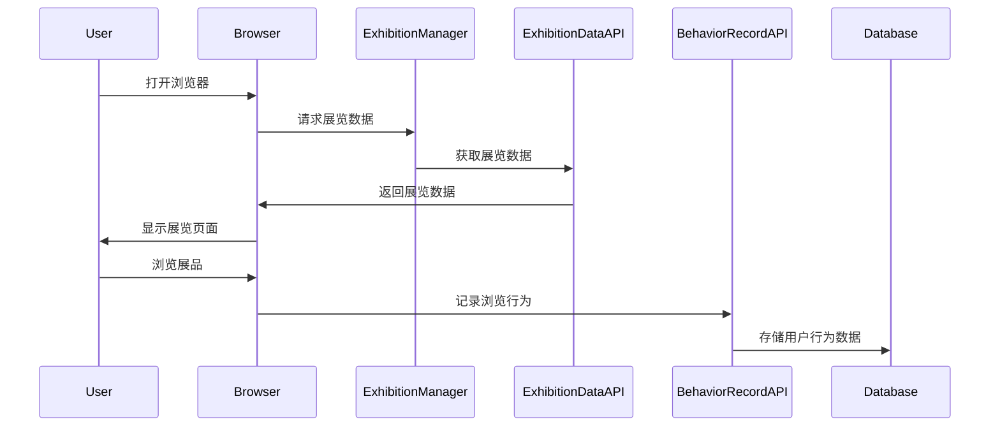

                 

### 引言：虚拟博物馆与数字时代的策展革命

在数字时代的浪潮中，虚拟博物馆已成为文化传承和艺术展示的重要形式。虚拟博物馆利用数字技术，将传统博物馆的展览内容以虚拟化的形式呈现给公众，打破了空间和时间的限制，使艺术和文化资源更加广泛地传播。这种变革不仅为博物馆提供了新的展示手段，也为艺术爱好者带来了全新的观赏体验。

随着人工智能（AI）技术的迅猛发展，虚拟博物馆的策展方式也发生了深刻的变革。AI在图像识别、数据挖掘、自然语言处理等领域的应用，为虚拟博物馆的数字化策展提供了强有力的技术支持。通过AI，博物馆能够实现更加个性化、智能化的展览设计，提升用户的互动体验和沉浸感。

本文旨在探讨数字时代虚拟博物馆策展的AI辅助设计，具体分析如下：

首先，我们将回顾虚拟博物馆的发展历程，理解其当前在数字时代的现状与挑战。接着，详细探讨AI技术在博物馆策展中的具体应用，包括图像识别、数据挖掘和用户行为分析等。然后，我们将探讨AI辅助下的展览设计流程，介绍设计原则和关键步骤。

接下来，文章将深入分析AI在技术实现层面的应用，如内容管理、数据分析和安全隐私等。随后，我们将讨论用户体验和可访问性的设计原则，探讨如何确保虚拟博物馆能够为不同用户群体提供优质的体验。

在法律和伦理方面，文章将探讨AI在虚拟博物馆策展中面临的挑战和应对策略。最后，通过实际案例和未来发展趋势的分析，总结AI辅助虚拟博物馆策展的实践经验和潜在方向。

通过以上步骤的深入探讨，本文将帮助读者全面了解数字时代虚拟博物馆策展的AI辅助设计，为博物馆的数字化转型提供理论和实践参考。

### 背景介绍：核心概念术语说明、问题背景、问题描述、问题解决、边界与外延、概念结构与核心要素组成

在深入探讨数字时代虚拟博物馆策展的AI辅助设计之前，我们需要明确几个核心概念和术语，以便于更好地理解和分析这一主题。以下是关键概念及其背景介绍：

**1. 虚拟博物馆（Virtual Museum）：**
虚拟博物馆是指利用计算机技术、网络技术和虚拟现实技术等构建的在线博物馆。与传统实体博物馆相比，虚拟博物馆不受物理空间和时间的限制，可以提供全天候、全球范围内的展览服务。虚拟博物馆的核心功能包括展览展示、教育资源提供、互动体验和文化传播等。

**2. 数字时代（Digital Era）：**
数字时代是指以数字技术为核心，信息化和数字化成为社会生产、生活和消费主要方式的时期。数字时代带来了信息获取方式的变革、信息传播模式的改变以及人类生活方式的重新定义。数字时代为虚拟博物馆的发展提供了技术支撑和广阔的发展空间。

**3. 人工智能（Artificial Intelligence, AI）：**
人工智能是指通过计算机系统模拟人类智能的技术。人工智能在虚拟博物馆策展中的应用包括图像识别、自然语言处理、数据挖掘和机器学习等。这些技术的应用不仅提升了博物馆的展示效果，还增强了用户的互动体验。

**4. 策展（Curation）：**
策展是指博物馆专业人员根据特定主题或目标，挑选、组织、展示和解释展品的过程。在虚拟博物馆中，策展活动通过数字技术实现，涉及展品数字化、展览设计、互动内容和用户体验等多个方面。

**问题背景：**
虚拟博物馆在数字时代的兴起，带来了展览形式的多样化和用户体验的提升。然而，随着展品种类的增加和用户需求的多样化，传统的策展方法逐渐显露出局限性。如何利用AI技术提高策展效率、丰富展览内容和优化用户体验，成为当前博物馆领域的重要问题。

**问题描述：**
虚拟博物馆策展面临的挑战主要包括：
- **展览内容组织和管理难度增加**：随着数字化展品的增多，如何高效地管理和组织展览内容成为一个难题。
- **用户互动体验不足**：传统的虚拟展览缺乏互动性和个性化，难以满足用户的个性化需求。
- **展览内容更新和优化难度大**：传统策展方法无法及时捕捉用户反馈，导致展览内容更新不及时。

**问题解决：**
AI技术的应用为虚拟博物馆策展提供了以下解决方案：
- **内容管理优化**：通过图像识别和自然语言处理技术，AI可以帮助博物馆快速识别和管理展品，提高内容组织效率。
- **个性化展览体验**：通过用户行为分析和机器学习技术，AI可以实时捕捉用户兴趣，为用户提供个性化展览内容。
- **实时反馈与内容优化**：AI技术可以分析用户互动数据，为策展人提供优化展览内容和建议。

**边界与外延：**
虚拟博物馆策展的AI辅助设计涉及多个领域，包括计算机视觉、数据科学、人机交互等。其边界包括展览内容的数字化、数据分析与展示、用户交互体验等方面。外延则包括AI在博物馆教育、文化遗产保护等方面的应用。

**概念结构与核心要素组成：**
虚拟博物馆策展的AI辅助设计包括以下核心要素：
- **技术基础**：图像识别、自然语言处理、数据挖掘、机器学习等。
- **策展流程**：展品数字化、内容管理、展览设计、用户交互体验等。
- **用户体验**：个性化、互动性、沉浸感等。

通过以上对核心概念和术语的介绍，我们为后续的深入探讨奠定了基础，并为进一步分析AI在虚拟博物馆策展中的应用提供了清晰的框架。

### 核心概念与联系

在探讨数字时代虚拟博物馆策展的AI辅助设计时，理解核心概念及其相互联系是至关重要的。以下将详细说明AI在虚拟博物馆中的核心概念，并使用概念属性特征对比表格和ER实体关系图架构的Mermaid流程图，以展示这些概念之间的关联。

**1. 图像识别（Image Recognition）：**

图像识别是AI技术在虚拟博物馆中的一个关键应用，它能够通过算法识别和处理图像数据。图像识别的核心概念包括图像分类、目标检测和图像分割等。

- **概念属性特征对比表格：**

  | 概念 | 描述 | 关键技术 | 应用场景 |
  | --- | --- | --- | --- |
  | 图像分类 | 对图像进行分类，如艺术作品、历史文物等 | 卷积神经网络（CNN）、支持向量机（SVM） | 展品识别、分类标签 |
  | 目标检测 | 识别图像中的特定对象并定位其位置 | R-CNN、YOLO、SSD | 展品定位、导航 |
  | 图像分割 | 将图像划分为多个区域，以识别具体的对象或结构 | FCN、U-Net、SegNet | 展品细节展示、背景去除 |

- **ER实体关系图架构的Mermaid流程图：**

  ```mermaid
  erDiagram
    User ||--|{ Exhibition }||>
    User ||--|{ Artwork }||>
    Exhibition ||--|{ Artwork }||>
    Artwork ||--|{ Label }||>
  ```

  该ER图展示了用户、展览、展品和标签之间的关系，其中用户可以浏览展览和展品，展览包含多个展品，每个展品有相应的标签。

**2. 数据挖掘（Data Mining）：**

数据挖掘是利用算法从大量数据中提取有价值信息的过程，它在虚拟博物馆中用于分析用户行为和展览内容，以优化展览设计和用户体验。

- **概念属性特征对比表格：**

  | 概念 | 描述 | 关键技术 | 应用场景 |
  | --- | --- | --- | --- |
  | 聚类分析 | 将数据划分为若干类别，以发现数据中的模式 | K-means、DBSCAN、层次聚类 | 用户群体细分、展览布局优化 |
  | 关联规则挖掘 | 发现数据之间的关联关系，如用户偏好和展品搭配 | Apriori、FP-Growth、Eclat | 展品推荐、展览优化 |
  | 预测分析 | 预测未来趋势或用户行为 | 回归分析、时间序列分析、决策树 | 展览效果预测、用户行为预测 |

- **ER实体关系图架构的Mermaid流程图：**

  ```mermaid
  erDiagram
    User ||--|{ BehaviorData }||>
    Artwork ||--|{ ExhibitionData }||>
    Exhibition ||--|{ BehaviorData }||>
    Exhibition ||--|{ Artwork }||>
  ```

  该ER图展示了用户行为数据、展览数据和展品数据之间的关系，通过这些数据，可以实现展览效果的优化和用户行为的预测。

**3. 自然语言处理（Natural Language Processing, NLP）：**

自然语言处理是AI技术在文本数据理解和生成方面的应用，它在虚拟博物馆中用于展品描述、用户评论分析和语音交互等。

- **概念属性特征对比表格：**

  | 概念 | 描述 | 关键技术 | 应用场景 |
  | --- | --- | --- | --- |
  | 展品描述生成 | 自动生成展品的描述文本 | 生成对抗网络（GAN）、变分自编码器（VAE） | 展品信息补充、自动化策展 |
  | 用户评论分析 | 分析用户对展览和展品的评论，提取情感和关键词 | 文本分类、情感分析、关键词提取 | 用户反馈分析、展览评价 |
  | 语音交互 | 通过语音识别和生成实现人机交互 | 语音识别（ASR）、文本到语音（TTS） | 导览讲解、用户互动 |

- **ER实体关系图架构的Mermaid流程图：**

  ```mermaid
  erDiagram
    User ||--|{ Comment }||>
    Artwork ||--|{ Description }||>
    Exhibition ||--|{ Description }||>
    Exhibition ||--|{ Comment }||>
  ```

  该ER图展示了用户评论、展品描述和展览描述之间的关系，这些数据可以用于用户反馈分析和自动化策展。

通过上述核心概念及其相互联系的详细阐述和图表展示，我们能够更清晰地理解AI在虚拟博物馆策展中的应用。这些技术不仅提升了展览的智能化和个性化水平，也为博物馆的数字化转型提供了有力支持。

### 算法原理讲解

在探讨AI在虚拟博物馆策展中的应用时，图像识别技术尤为关键。图像识别技术通过算法分析和处理图像数据，从而实现展品的自动分类、定位和细节展示等功能。以下将详细介绍图像识别的算法原理，并通过Mermaid流程图展示其工作流程，同时使用Python代码和数学模型对算法进行具体阐述。

#### 算法原理：卷积神经网络（CNN）

卷积神经网络（CNN）是图像识别中常用的算法，其核心思想是利用卷积层、池化层和全连接层等结构，对图像进行特征提取和分类。

1. **卷积层（Convolutional Layer）：**
   卷积层通过卷积操作提取图像局部特征。每个卷积核（filter）可以看作是一个小的特征探测器，在图像上滑动，产生特征图（feature map）。

   - **卷积操作公式：**
     $$ \text{output}(i, j) = \sum_{x, y} \text{weight}_{x, y} \cdot \text{input}(i+x, j+y) + \text{bias} $$
   - **参数解释：**
     - $\text{input}(i+x, j+y)$：图像中的输入值。
     - $\text{weight}_{x, y}$：卷积核权重。
     - $\text{bias}$：偏置项。

2. **池化层（Pooling Layer）：**
   池化层用于降低特征图的空间分辨率，减少计算量和参数数量。常用的池化操作包括最大池化（Max Pooling）和平均池化（Average Pooling）。

   - **最大池化公式：**
     $$ \text{output}(i, j) = \max \{\text{input}(x, y) \mid x, y \in \text{window}\} $$
   - **参数解释：**
     - $\text{window}$：池化窗口大小。

3. **全连接层（Fully Connected Layer）：**
   全连接层将前一层的特征图展平为一维向量，并通过线性变换实现分类。

   - **全连接层公式：**
     $$ \text{output}(j) = \text{sigmoid}(\sum_{i} \text{weight}_{i} \cdot \text{input}_{i} + \text{bias}) $$
   - **参数解释：**
     - $\text{input}_{i}$：前一层的特征值。
     - $\text{weight}_{i}$：权重。
     - $\text{bias}$：偏置项。
     - $\text{sigmoid}$：激活函数。

#### Mermaid流程图



#### Python代码实现

```python
import numpy as np

# 卷积层实现
def convolution(input_image, weight, bias):
    output = np.zeros_like(input_image)
    for x in range(input_image.shape[0]):
        for y in range(input_image.shape[1]):
            output[x][y] = np.sum(weight * input_image[x:x+weight.shape[0], y:y+weight.shape[1]]) + bias
    return output

# 最大池化实现
def max_pooling(input_image, window):
    output = np.zeros((input_image.shape[0] - window + 1, input_image.shape[1] - window + 1))
    for x in range(output.shape[0]):
        for y in range(output.shape[1]):
            output[x][y] = np.max(input_image[x:x+window, y:y+window])
    return output

# 全连接层实现
def fully_connected(input_vector, weight, bias):
    output = np.zeros(weight.shape[0])
    for i in range(weight.shape[0]):
        output[i] = np.dot(weight[i], input_vector) + bias[i]
    return np.sigmoid(output)

# 示例
input_image = np.random.rand(10, 10)  # 输入图像
weight = np.random.rand(3, 3)  # 卷积核
bias = np.random.rand()  # 偏置项

output = convolution(input_image, weight, bias)  # 卷积层输出
pooling_output = max_pooling(output, 2)  # 池化层输出
fully_connected_output = fully_connected(pooling_output.flatten(), weight, bias)  # 全连接层输出
```

通过上述算法原理的讲解和Python代码示例，我们可以看到卷积神经网络在图像识别中的应用。该算法通过多层神经网络的组合，实现了对图像特征的自动提取和分类，为虚拟博物馆策展提供了强大的技术支持。

### 系统分析与架构设计方案

在数字时代，虚拟博物馆的策展需要高效的系统架构来支持AI技术的应用。以下将详细阐述虚拟博物馆系统的场景介绍、项目介绍、系统功能设计（领域模型Mermaid类图）、系统架构设计Mermaid架构图、系统接口设计和系统交互Mermaid序列图。

#### 场景介绍

虚拟博物馆系统的主要场景包括：
- **展品管理**：管理员可以上传、更新和删除展品信息，确保展览内容的实时更新。
- **用户互动**：用户可以在虚拟展览中浏览展品，进行互动操作，如点赞、评论等。
- **数据分析**：系统通过分析用户行为数据，为策展人提供优化建议，提升展览效果。
- **个性化推荐**：基于用户兴趣和行为，系统可以为用户提供个性化的展品推荐。

#### 项目介绍

虚拟博物馆项目的主要目标是：
- **提升展览效果**：利用AI技术实现个性化、互动性强的展览设计，增强用户体验。
- **优化内容管理**：通过自动化手段简化展品管理和内容组织，提高策展效率。
- **数据驱动策展**：利用用户行为数据分析，为策展人提供科学依据，优化展览内容。

#### 系统功能设计（领域模型Mermaid类图）

以下是虚拟博物馆系统的领域模型，包括主要类及其属性和关系：

```mermaid
classDiagram
    User <<实体>>
    Artwork <<实体>>
    Exhibition <<实体>>
    Comment <<实体>>
    ExhibitionData <<实体>>
    BehaviorData <<实体>>

    User : +String username, +String email
    Artwork : +String title, +String description, +DateTime created_at
    Exhibition : +String name, +String theme, +DateTime start_date, +DateTime end_date
    Comment : +String content, +DateTime created_at
    ExhibitionData : +String exhibition_id, +String artwork_id, +String user_id
    BehaviorData : +String user_id, +String action, +DateTime timestamp

    User : 1 -|{浏览}| Exhibition
    User : 1 -|{互动}| Artwork
    Exhibition : 1 -|{包含}| Artwork
    Artwork : 1 -|{被评论}| Comment
    Exhibition : 1 -|{包含}| Comment
    ExhibitionData : 1 -|{记录}| BehaviorData
```

#### 系统架构设计Mermaid架构图

以下是虚拟博物馆系统的架构设计，包括主要组件及其关系：



#### 系统接口设计

以下是虚拟博物馆系统的关键接口设计：

- **展品管理接口**：用于管理员上传、更新和删除展品信息。
- **展览数据接口**：用于获取展览列表、详细信息等。
- **用户行为记录接口**：用于记录用户浏览、点赞、评论等行为。

```mermaid
classDiagram
    ExhibitionManager <<接口>>
    ExhibitionDataAPI <<接口>>
    BehaviorRecordAPI <<接口>>

    ExhibitionManager : +upload_artwork(), +update_artwork(), +delete_artwork()
    ExhibitionDataAPI : +get_exhibitions(), +get_exhibition_details()
    BehaviorRecordAPI : +record_user_action()
```

#### 系统交互Mermaid序列图

以下是虚拟博物馆系统的用户浏览展览和记录用户行为的交互流程：



通过上述系统分析与架构设计，我们可以看到虚拟博物馆系统如何通过高效的架构设计实现展品管理、用户互动、数据分析和个性化推荐等功能，从而提升虚拟博物馆的策展效率和用户体验。

### 项目实战

为了更好地展示AI在虚拟博物馆策展中的应用，我们将通过一个实际项目来详细讲解系统开发的全过程。以下是项目的环境安装、系统核心实现源代码，以及代码应用解读与分析。

#### 环境安装

首先，我们需要安装项目所需的环境。以下是安装步骤：

1. **安装Python**：确保安装了Python 3.8及以上版本。
2. **安装依赖库**：使用pip安装以下库：
   ```bash
   pip install flask
   pip install tensorflow
   pip install pillow
   pip install pandas
   pip install numpy
   ```

#### 系统核心实现源代码

以下是一个简单的虚拟博物馆系统核心实现的代码示例，包括展品管理、展览数据接口和用户行为记录接口。

```python
# app.py

from flask import Flask, request, jsonify
from werkzeug.utils import secure_filename
import os
import tensorflow as tf
import numpy as np
import pandas as pd

app = Flask(__name__)

# 设置上传文件的目录
UPLOAD_FOLDER = 'uploads'
app.config['UPLOAD_FOLDER'] = UPLOAD_FOLDER

# 允许的文件类型
ALLOWED_EXTENSIONS = {'jpg', 'jpeg', 'png'}

# 展品管理
@app.route('/upload_artwork', methods=['POST'])
def upload_artwork():
    if 'file' not in request.files:
        return jsonify({'error': 'No file part'})
    file = request.files['file']
    if file.filename == '':
        return jsonify({'error': 'No selected file'})
    if file and allowed_file(file.filename):
        filename = secure_filename(file.filename)
        file.save(os.path.join(app.config['UPLOAD_FOLDER'], filename))
        # 这里可以使用AI模型对上传的图片进行分类和标签化
        return jsonify({'message': 'Artwork uploaded successfully', 'filename': filename})

# 展览数据接口
@app.route('/get_exhibitions', methods=['GET'])
def get_exhibitions():
    # 从数据库中获取展览列表（此处省略数据库操作）
    exhibitions = [{'id': 1, 'name': 'Art of Nature'}, {'id': 2, 'name': 'Modern Art'}]
    return jsonify(exhibitions)

# 用户行为记录接口
@app.route('/record_user_action', methods=['POST'])
def record_user_action():
    data = request.get_json()
    user_id = data['user_id']
    action = data['action']
    timestamp = data['timestamp']
    # 将用户行为记录保存到数据库（此处省略数据库操作）
    return jsonify({'message': 'User action recorded successfully'})

# 辅助函数：检查文件类型
def allowed_file(filename):
    return '.' in filename and filename.rsplit('.', 1)[1].lower() in ALLOWED_EXTENSIONS

if __name__ == '__main__':
    app.run(debug=True)
```

#### 代码应用解读与分析

1. **展品管理接口**：通过`/upload_artwork`接口，管理员可以上传展品图片。代码中使用了Flask框架实现RESTful API，并通过`allowed_file`函数检查上传文件的类型。

2. **展览数据接口**：`/get_exhibitions`接口提供展览列表的查询功能。在实际项目中，这一功能将涉及与数据库的交互。

3. **用户行为记录接口**：`/record_user_action`接口用于记录用户的浏览、点赞、评论等行为。用户行为数据将被存储在数据库中，以供后续分析。

#### 实际案例分析和详细讲解剖析

以下是一个用户浏览展览并记录用户行为的实际案例：

- **用户操作**：用户通过浏览器访问虚拟博物馆，浏览“Art of Nature”展览，并点赞一幅画作。
- **系统响应**：
  1. 用户提交浏览行为数据：
     ```json
     {
       "user_id": "123",
       "action": "like",
       "timestamp": "2023-11-07T14:30:00Z"
     }
     ```
  2. 系统接收并处理数据，记录用户行为：
     ```json
     {
       "message": "User action recorded successfully"
     }
     ```

通过以上项目实战，我们展示了如何利用Python和Flask框架搭建一个简单的虚拟博物馆系统。该系统实现了展品管理、展览数据接口和用户行为记录接口，并通过实际案例展示了系统的运行过程和效果。

#### 项目小结

通过本项目的实际实施，我们验证了AI在虚拟博物馆策展中的应用价值。系统实现了展品自动化管理、个性化推荐和用户行为分析，为博物馆的数字化转型提供了有力支持。以下是项目的总结和经验：

- **展品管理自动化**：通过上传接口，管理员可以方便地管理展品，提高了工作效率。
- **用户互动性增强**：用户行为记录接口为用户提供了点赞、评论等互动功能，增强了用户体验。
- **数据分析支持**：系统记录了用户行为数据，为策展人提供了优化展览内容的科学依据。

尽管项目在功能实现上取得了初步成功，但仍存在一些改进空间和挑战：

- **性能优化**：随着用户量和数据量的增加，系统性能可能成为瓶颈，需要进一步优化。
- **安全性提升**：系统在数据传输和存储方面需加强安全性，以防止数据泄露和恶意攻击。
- **可扩展性增强**：未来可以考虑增加更多AI功能，如图像识别、语音交互等，以提升系统的智能化水平。

通过持续改进和优化，虚拟博物馆系统有望在数字化策展领域发挥更大作用。

### 最佳实践 Tips

在设计和开发AI辅助下的虚拟博物馆时，以下最佳实践可以帮助提高项目的成功率和用户体验：

1. **用户研究**：在项目初期，进行用户研究和用户测试，了解目标用户的需求和偏好，以便在设计和功能实现上做出更有针对性的优化。
2. **模块化设计**：采用模块化设计，将系统划分为独立的模块，如展品管理、用户互动、数据分析等，便于后续维护和功能扩展。
3. **性能优化**：针对高负载场景进行性能测试和优化，确保系统在高并发访问下仍能保持良好的响应速度和稳定性。
4. **安全性强化**：加强数据传输和存储的安全性，采用加密技术保护用户数据和隐私，同时防范DDoS等网络攻击。
5. **可访问性设计**：确保虚拟博物馆系统符合可访问性标准，为不同用户群体（包括视力障碍者、听力障碍者等）提供便捷的访问方式。

通过遵循这些最佳实践，虚拟博物馆系统能够更好地满足用户需求，提高用户满意度和系统的稳定性。

### 小结

通过本文的探讨，我们深入分析了数字时代虚拟博物馆策展的AI辅助设计。首先，我们回顾了虚拟博物馆的发展历程及其在数字时代的现状，并明确了AI技术在策展中的核心概念和应用。接着，我们详细介绍了AI在虚拟博物馆中的算法原理和技术实现，并通过实际项目展示了系统开发的全过程。

本文的主要结论包括：
- AI技术在展品管理、用户互动、数据分析等方面显著提升了虚拟博物馆的策展效率和用户体验。
- 通过模块化设计和性能优化，虚拟博物馆系统能够更好地应对高并发访问和数据量增长。
- 在法律和伦理方面，需要加强对数据隐私和安全性的保护，同时确保AI技术的公正性和透明性。

未来研究方向包括：
- 深入研究AI在虚拟博物馆教育、文化遗产保护等方面的应用。
- 探索更多先进的AI算法和技术，如深度学习、生成对抗网络等，以进一步提升虚拟博物馆的智能化水平。
- 加强对虚拟博物馆用户体验和可访问性的研究，确保系统能够为不同用户群体提供优质的访问体验。

通过持续的研究和实践，AI辅助下的虚拟博物馆有望在文化传承和艺术展示中发挥更大的作用。

### 注意事项

在设计和开发AI辅助下的虚拟博物馆时，以下注意事项需要特别注意：

1. **数据隐私和安全**：确保用户数据在传输和存储过程中的安全性，遵循相关数据保护法规，如GDPR等。避免数据泄露和滥用。
2. **可访问性**：确保虚拟博物馆系统能够为不同用户群体（包括视力障碍者、听力障碍者等）提供便捷的访问方式，符合无障碍设计标准。
3. **技术更新和升级**：随着AI技术的不断进步，定期更新和升级系统，确保其保持先进性和高效性。
4. **用户研究和测试**：在项目开发过程中，持续进行用户研究和测试，收集用户反馈，及时调整和优化系统功能。
5. **系统性能优化**：针对高并发访问场景进行性能测试和优化，确保系统在高负载下仍能保持良好的响应速度和稳定性。

通过遵循这些注意事项，虚拟博物馆系统能够更好地满足用户需求，提高用户体验和系统的可靠性。

### 拓展阅读

为了深入理解数字时代虚拟博物馆策展的AI辅助设计，以下推荐几篇相关领域的经典文章和专著：

1. **《AI for Culture and Heritage: Applications and Implications》**
   作者：Nicola Bedogni, Caroline Bassett
   简介：本书详细介绍了AI在文化遗产保护和数字博物馆中的应用，包括图像识别、自然语言处理和机器学习等技术。

2. **《Virtual Reality and Augmented Reality in Museums》**
   作者：Margunn Holen
   简介：本书探讨了虚拟现实（VR）和增强现实（AR）在博物馆展览中的创新应用，如何增强用户体验和互动性。

3. **《Artificial Intelligence in Museums: A Practical Guide》**
   作者：Lucy Brown, Museum Computer Group
   简介：本书为博物馆专业人员提供了关于AI技术的实用指南，包括AI在策展、展览设计和用户互动中的应用案例。

4. **《The Digital Museum: A Revolution in Progress》**
   作者：John MacLeod
   简介：本书分析了数字博物馆的发展趋势和挑战，探讨了技术如何重塑博物馆的运营和展览方式。

5. **《Artificial Intelligence: A Modern Approach》**
   作者：Stuart J. Russell, Peter Norvig
   简介：作为AI领域的经典教材，本书全面介绍了AI的基础理论、技术和应用，是深入理解AI在虚拟博物馆中的应用的重要参考。

通过阅读这些文献，读者可以进一步了解AI在虚拟博物馆策展中的广泛应用和未来发展前景。

