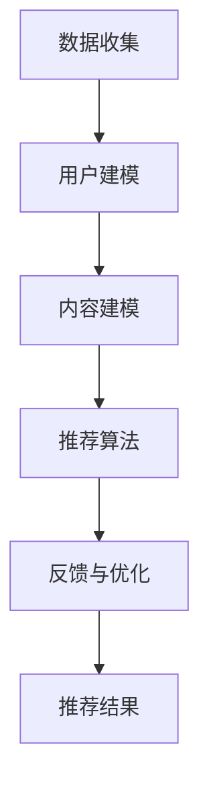
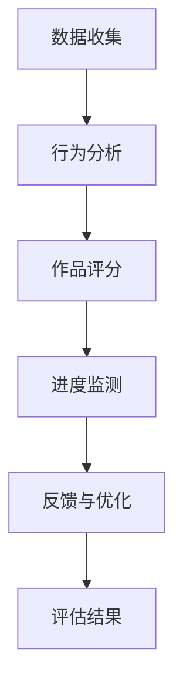
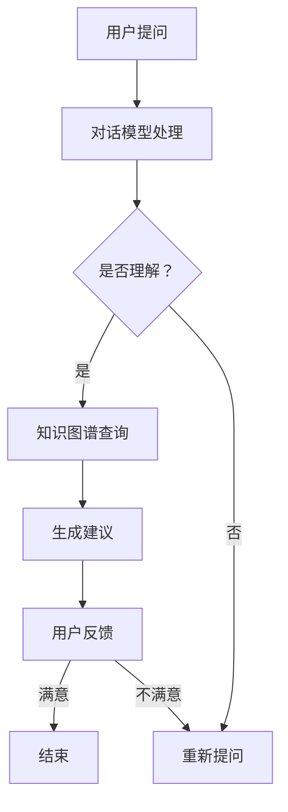
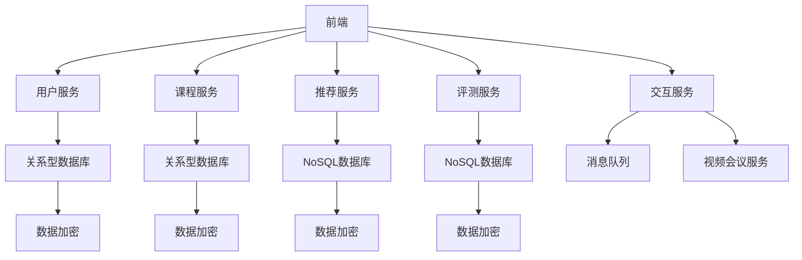
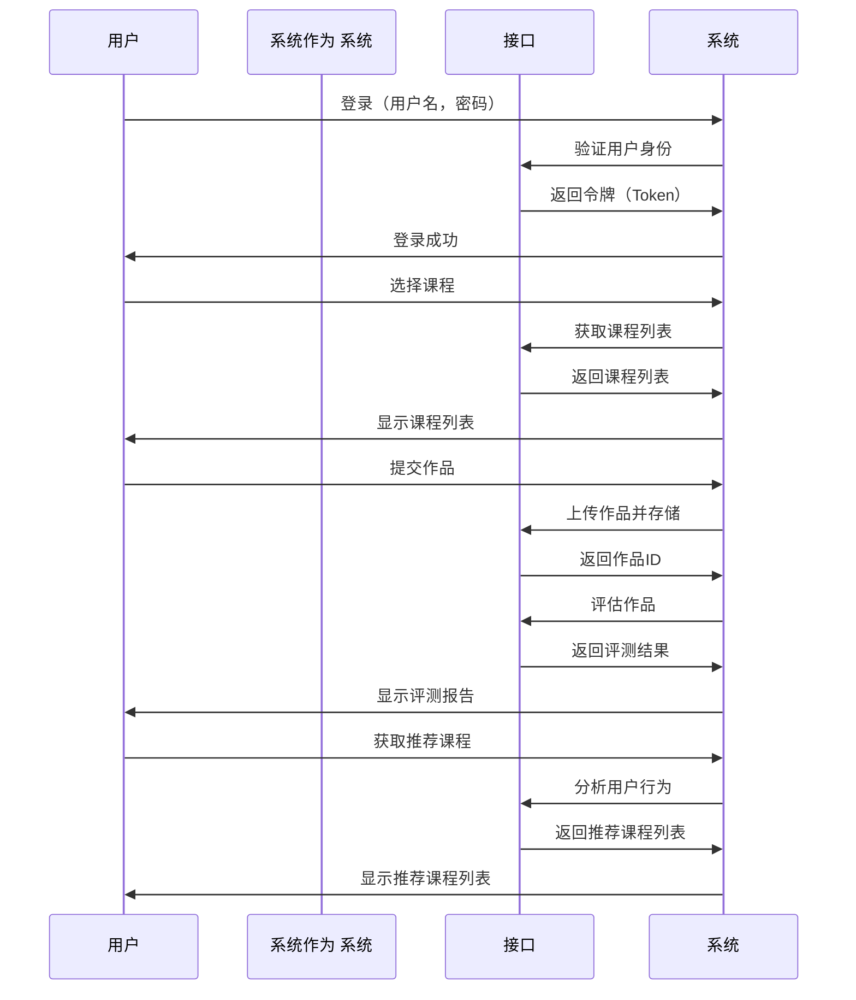

                 

### 第一部分：背景介绍

#### 1.1 问题背景

在数字时代，传统美术教育面临着诸多挑战。一方面，教育资源的不均衡使得部分地区的艺术教育难以达到理想水平；另一方面，艺术教育形式的单一性限制了学生的创造力和自主学习能力。为了解决这些问题，虚拟美术学院作为一种创新的在线教育平台应运而生。

艺术教育在现代社会中扮演着重要角色，不仅培养学生的审美能力和艺术技能，还能激发他们的创造力和创新能力。然而，传统美术教育的局限性使得许多学生无法充分享受到高质量的艺术教育资源。

首先，教育资源的不均衡是一个突出问题。不同地区、不同学校之间的教育资源存在显著差异，一些经济发达地区的学生可以享受到优质的艺术教育资源，而一些偏远地区的学生则面临着资源匮乏的困境。这种教育不公平性导致了艺术教育质量的不均衡，影响了学生的全面发展。

其次，传统艺术教育形式的单一性也限制了学生的创造力和自主学习能力。传统艺术教育通常以教师讲授为主，学生被动接受知识，缺乏主动探索和创作的机会。这种教育方式难以激发学生的创造力和创新精神，也无法满足他们个性化发展的需求。

面对这些挑战，虚拟美术学院作为一种创新的在线教育平台，应运而生。通过互联网技术，虚拟美术学院能够打破地域和时间的限制，为学生提供一个虚拟的学习环境，使他们能够在线上学习各种艺术课程。虚拟美术学院旨在解决传统艺术教育中的不公平性和单一性问题，为学生提供更加丰富、多样、个性化的艺术教育体验。

虚拟美术学院的优势在于其灵活性和便捷性。学生可以根据自己的兴趣和需求，自由选择适合自己的课程，不受时间和地点的限制。平台上的课程资源由全球各地的优秀艺术家和教育者提供，学生可以接触到不同文化背景和艺术风格的作品，拓宽视野，提高艺术素养。

此外，虚拟美术学院还通过引入先进的人工智能技术，为学生提供个性化的学习体验。平台可以根据学生的学习行为和兴趣，推荐合适的课程和内容，帮助学生更高效地学习。同时，虚拟助手可以为学生提供智能化的学习辅导和帮助，提高学习效率。

总之，虚拟美术学院作为一种创新的在线教育平台，具有巨大的发展潜力和优势。通过整合全球艺术教育资源，利用先进的人工智能技术，虚拟美术学院能够为全球学生提供高质量、个性化、多样化的艺术教育服务，推动艺术教育的普及和发展。

#### 1.2 问题描述

虚拟美术学院作为一种创新的在线教育平台，旨在通过互联网技术，为学生提供一个虚拟的学习环境，使他们能够在线上学习各种艺术课程。然而，实现这一目标面临着一系列的技术挑战和问题。

首先，课程资源的构建是一个关键问题。虚拟美术学院需要提供丰富多样的艺术课程资源，涵盖绘画、雕塑、设计、音乐、戏剧等多个领域。这些课程资源需要由专业艺术家和教育者提供，并且要保证其质量。如何有效地整合和分类这些资源，使其易于查找和使用，是一个重要的挑战。

其次，虚拟教学环境的构建也是一个重要问题。虚拟美术学院需要创建一个虚拟的教室或工作室，使学生能够在其中进行在线学习和互动。这个虚拟环境需要具备良好的用户体验，包括图形渲染、音视频传输、互动功能等。此外，如何确保虚拟教学环境的稳定性和安全性，也是一个重要的问题。

第三，互动交流平台的构建是另一个关键问题。虚拟美术学院需要提供一个互动交流平台，使学生能够与教师和其他学生进行实时互动，分享学习心得和艺术作品。这个平台需要具备实时通信、文件共享、讨论区等功能，以促进学生的学习和创作。

第四，个性化推荐系统的构建是另一个重要问题。虚拟美术学院需要根据学生的学习行为和兴趣，提供个性化的课程和内容推荐。这需要运用人工智能技术，分析学生的学习数据和偏好，实现精准推荐。

第五，数据安全和隐私保护也是一个关键问题。虚拟美术学院需要确保学生的学习数据安全和隐私保护，避免数据泄露和滥用。这需要采取一系列的数据加密、访问控制和隐私保护措施。

综上所述，虚拟美术学院作为一种创新的在线教育平台，在构建过程中面临着课程资源、虚拟教学环境、互动交流平台、个性化推荐系统、数据安全和隐私保护等多方面的问题。如何有效地解决这些问题，实现虚拟美术学院的稳定运行和高效服务，是当前亟待解决的重要课题。

#### 1.3 问题解决

为了有效解决虚拟美术学院在构建过程中面临的问题，可以采取以下一系列策略和方法：

**1. 构建全面的艺术课程资源库：**

首先，虚拟美术学院需要建立一个全面的艺术课程资源库。这可以通过以下步骤实现：

- **资源整合：** 联合全球各地的优秀艺术家和教育机构，收集和整理艺术课程资源。这些资源可以包括视频课程、图文教程、艺术作品库等。
- **内容审核：** 对收集到的课程资源进行严格审核，确保其质量。这包括内容的专业性、准确性、适用性等方面。
- **分类管理：** 对课程资源进行分类管理，方便学生查找和使用。可以通过课程名称、课程类型、艺术家/教育者、课程难度等多个维度进行分类。
- **资源共享：** 建立课程资源的共享机制，使不同学校、机构和学生能够方便地访问和使用这些资源。

**2. 创建优质的虚拟教学环境：**

为了提供良好的虚拟教学环境，虚拟美术学院可以采取以下措施：

- **技术选型：** 选择适合的虚拟现实技术，如VR、AR或3D建模，创建逼真的虚拟教室或工作室。确保图形渲染效果、音视频传输质量等达到高水平。
- **互动功能：** 在虚拟教学环境中加入互动功能，如实时视频聊天、语音交流、文件共享、在线讨论区等，提高学生的参与度和互动性。
- **用户体验优化：** 对虚拟教学环境进行用户体验优化，确保界面简洁易用，操作流畅。
- **环境稳定性保障：** 通过技术手段和运维保障，确保虚拟教学环境的稳定运行和安全性。

**3. 建立高效的互动交流平台：**

为了促进学生的互动交流，虚拟美术学院可以建立以下互动交流平台：

- **实时通信：** 提供实时通信工具，如视频聊天、语音通话等，使学生能够与教师和其他学生进行实时互动。
- **文件共享：** 提供文件共享功能，使学生能够方便地分享学习资料、艺术作品等。
- **在线讨论区：** 建立在线讨论区，让学生能够自由发表观点、讨论问题、分享经验。
- **社区管理：** 对讨论区进行有效管理，维护良好的交流氛围，防止不良信息传播。

**4. 构建个性化推荐系统：**

为了实现个性化推荐，虚拟美术学院可以采取以下方法：

- **数据采集：** 收集学生的学习数据，包括学习行为、偏好、成绩等。
- **行为分析：** 对收集到的数据进行行为分析，挖掘学生的学习习惯、兴趣点等。
- **推荐算法：** 采用先进的个性化推荐算法，如协同过滤、内容推荐等，为学生推荐合适的课程和内容。
- **实时更新：** 根据学生的实时学习行为，动态调整推荐内容，提高推荐精度。

**5. 加强数据安全和隐私保护：**

为了确保数据安全和隐私保护，虚拟美术学院可以采取以下措施：

- **数据加密：** 对学生数据进行加密处理，防止数据泄露。
- **访问控制：** 实施严格的访问控制机制，确保只有授权用户可以访问敏感数据。
- **隐私保护：** 遵循隐私保护法律法规，确保学生隐私得到有效保护。
- **安全审计：** 定期进行安全审计，及时发现并解决潜在的安全隐患。

通过以上策略和方法的实施，虚拟美术学院可以有效地解决构建过程中面临的问题，为学生提供一个高质量、个性化、多样化的在线艺术教育平台，推动艺术教育的普及和发展。

#### 1.4 边界与外延

虚拟美术学院作为一种创新的在线教育平台，其应用范围和边界相对广泛。它不仅涵盖了传统的绘画、雕塑、设计等艺术形式，还包括数字艺术、动画设计、游戏设计等新兴艺术领域。以下将详细探讨虚拟美术学院的边界与外延。

**1. 艺术形式的多样性与融合**

虚拟美术学院在艺术形式的多样性与融合方面具有显著优势。传统美术教育主要集中于绘画、雕塑、设计等经典艺术形式，而虚拟美术学院通过互联网技术，将传统艺术与现代科技相结合，拓展了艺术表达的边界。例如，数字艺术和动画设计等新兴艺术形式在虚拟美术学院中得到了广泛应用，为学生提供了更多的创作空间和可能性。

**2. 跨学科的融合**

虚拟美术学院不仅限于艺术领域的教学，还与跨学科的知识融合，如计算机科学、设计学、心理学等。这种跨学科的融合不仅丰富了课程内容，还提升了学生的综合素质。例如，计算机科学中的编程技术可以应用于动画设计，增强视觉效果和互动性；心理学中的认知行为理论可以指导艺术创作，提高艺术作品的表现力。

**3. 全球艺术资源的整合**

虚拟美术学院通过互联网技术，打破了地域限制，实现了全球艺术资源的整合。学生可以在线上接触到来自世界各地的艺术作品和课程资源，拓宽了视野，提高了艺术素养。同时，虚拟美术学院还可以邀请国际知名艺术家和教育者进行线上授课，为学生提供高质量的艺术教育服务。

**4. 个性化学习体验的提供**

虚拟美术学院依托人工智能技术，为学生提供个性化学习体验。通过分析学生的学习行为和兴趣，平台可以推荐合适的课程和内容，帮助学生更高效地学习。此外，虚拟助手可以为学生提供智能化的学习辅导和帮助，提高学习效果。

**5. 线上与线下相结合的教学模式**

虚拟美术学院不仅提供线上学习资源，还可以与线下教学相结合。例如，学生可以在线学习理论课程，然后到线下工作室进行实践创作。这种线上线下相结合的教学模式，既发挥了线上教育的便捷性和灵活性，又保留了线下教学的实践性和互动性。

**6. 艺术创作与创业结合**

虚拟美术学院还为学生提供了艺术创作与创业结合的机会。学生可以通过在线平台展示自己的艺术作品，获得全球观众的认可和评价。同时，虚拟美术学院还可以提供创业指导和支持，帮助学生将自己的艺术作品转化为实际商业项目。

综上所述，虚拟美术学院的边界与外延涵盖了艺术形式的多样性、跨学科的融合、全球艺术资源的整合、个性化学习体验的提供、线上线下相结合的教学模式以及艺术创作与创业结合等多方面。这些特点使得虚拟美术学院在艺术教育领域具有独特的竞争优势和广阔的发展前景。

#### 1.5 概念结构与核心要素组成

虚拟美术学院作为一种创新的在线教育平台，其概念结构由多个核心要素组成，这些要素相互关联，共同构成了一个功能齐全、用户体验优良的教育生态系统。以下是虚拟美术学院的概念结构及其核心要素的详细说明：

**1. 在线课程资源**

在线课程资源是虚拟美术学院的核心组成部分，它包括多种类型的艺术课程，如绘画、雕塑、设计、数字艺术、动画设计、游戏设计等。这些课程资源由专业艺术家和教育者提供，涵盖不同难度级别，满足不同层次学生的学习需求。课程资源的形式多样，包括视频教程、图文教程、艺术作品库等。在线课程资源通过分类管理，使学生能够方便地查找和选择适合自己的课程。

**2. 虚拟教学环境**

虚拟教学环境是虚拟美术学院为学生提供的学习场景，它通过虚拟现实（VR）和增强现实（AR）技术，创造一个逼真的艺术学习环境。学生可以在虚拟的教室或工作室中，进行绘画、雕塑、设计等实践活动。虚拟教学环境支持互动功能，如实时视频聊天、语音交流、文件共享和在线讨论区，使学生能够与教师和其他学生进行实时互动。此外，虚拟教学环境还需确保稳定性和安全性，以保证用户体验。

**3. 互动交流平台**

互动交流平台是虚拟美术学院中重要的社交和沟通工具，它为学生提供了一个线上互动和交流的场所。通过互动交流平台，学生可以与教师和其他学生分享学习心得、讨论艺术问题、展示自己的作品。平台包括实时通信、文件共享、讨论区等功能，旨在促进学生之间的互动和合作。同时，平台还需要进行有效管理，以维护良好的交流氛围。

**4. 个性化推荐系统**

个性化推荐系统是虚拟美术学院的一个重要功能，它通过分析学生的学习行为、兴趣和偏好，为学生推荐合适的课程和内容。个性化推荐系统利用人工智能技术，如协同过滤、内容推荐和基于模型的推荐算法，实现精准推荐。这不仅提高了学生的学习效率，还增强了平台的用户体验。

**5. 人工智能技术**

人工智能技术在虚拟美术学院中扮演着关键角色，它不仅支持个性化推荐系统，还应用于虚拟教学环境的构建和互动交流平台的优化。例如，人工智能技术可以用于虚拟助手的开发，为学生提供智能化的学习辅导和帮助。此外，人工智能技术还可以用于数据分析和智能评测，提升虚拟美术学院的教育质量和效率。

**6. 数据安全和隐私保护**

数据安全和隐私保护是虚拟美术学院不可忽视的核心要素。为了确保学生数据的安全和隐私，虚拟美术学院需要采取一系列的数据加密、访问控制和隐私保护措施。这包括数据传输加密、用户身份验证、权限管理、数据备份和恢复等。通过严格的数据安全和隐私保护机制，虚拟美术学院能够保障学生的个人信息安全。

综上所述，虚拟美术学院的概念结构由在线课程资源、虚拟教学环境、互动交流平台、个性化推荐系统、人工智能技术和数据安全和隐私保护等多个核心要素组成。这些要素相互关联，共同构成了一个功能齐全、用户体验优良的教育生态系统，为全球学生提供了一个高质量的在线艺术教育平台。

### 第二部分：核心概念与联系

#### 2.1 艺术教育资源的在线平台

艺术教育资源的在线平台是虚拟美术学院的核心组成部分，它为学生提供了一个获取艺术知识和技能的在线环境。这个平台不仅需要提供丰富的课程资源，还需要具备互动性、个性化、便捷性等特点。

**1. 丰富性**

艺术教育资源的在线平台应涵盖多种类型的艺术课程，包括绘画、雕塑、设计、音乐、戏剧等。这些课程应包括从基础入门到高级进阶的不同难度级别，以满足不同层次学生的学习需求。此外，平台还应不断更新和扩充课程资源，确保其与时俱进，反映当前艺术领域的最新发展和趋势。

**2. 互动性**

互动性是艺术教育资源的在线平台的重要特点之一。通过提供实时视频聊天、语音交流、在线讨论区等功能，平台可以促进学生与教师、同学之间的互动。这种互动不仅有助于提高学生的学习积极性，还能帮助他们解决学习中的问题和困惑。此外，平台还应鼓励学生分享自己的艺术作品和创作经验，促进艺术交流和创作灵感的碰撞。

**3. 个性化**

个性化是现代教育的重要趋势，艺术教育资源的在线平台也不例外。通过分析学生的学习行为、兴趣和偏好，平台可以为学生推荐合适的课程和内容，提供个性化的学习体验。例如，根据学生的学习进度和成绩，平台可以调整课程难度和推荐学习路径，帮助学生更高效地掌握知识。此外，平台还可以提供定制化的学习计划，让学生根据自己的时间安排和学习目标，自由选择学习内容。

**4. 便捷性**

便捷性是艺术教育资源的在线平台必须具备的另一大特点。互联网技术的普及使得学生可以随时随地进行学习，不受时间和地点的限制。平台应提供友好的用户界面，使操作简单易用。此外，平台还应支持多种设备访问，如电脑、平板、手机等，以满足不同设备用户的需求。

**5. 安全性**

数据安全和隐私保护是艺术教育资源的在线平台必须重视的问题。平台需要采取一系列安全措施，如数据加密、用户身份验证、权限管理等，确保学生数据的安全。同时，平台还应遵守相关法律法规，保护学生的隐私。

**6. 艺术教育资源的在线平台的特征对比表格**

| 特征       | 说明                                                                                           |
| ---------- | -------------------------------------------------------------------------------------------------- |
| 丰富性     | 提供多种类型的艺术课程，满足不同层次的需求。                                                     |
| 互动性     | 支持实时互动功能，促进师生和同学之间的交流。                                                     |
| 个性化     | 根据学生的学习行为和兴趣，提供个性化的学习体验。                                                 |
| 便捷性     | 学生可以随时随地进行学习，不受时间和地点的限制。                                                 |
| 安全性     | 采取数据加密、用户身份验证等措施，确保学生数据的安全。                                           |

通过上述特征对比表格，可以看出艺术教育资源的在线平台具有丰富性、互动性、个性化、便捷性和安全性等核心特征，这些特征共同构成了一个高效、互动性强、内容丰富的在线教育平台。

#### 2.2 人工智能技术的应用

人工智能技术在虚拟美术学院中的应用具有广泛而深远的影响，不仅提升了教育质量，还改变了传统教育模式。以下是人工智能技术在虚拟美术学院中的主要应用及其优势：

**1. 个性化推荐**

个性化推荐是人工智能技术在虚拟美术学院中的核心应用之一。通过分析学生的学习行为、兴趣和偏好，平台可以为学生推荐合适的课程和内容。这种个性化推荐不仅能提高学生的学习效率，还能激发他们的学习兴趣和创造力。

- **优势**：个性化推荐系统可以根据学生的学习进度和成绩，动态调整课程难度和推荐内容，提供个性化的学习路径。这种定制化的学习体验使学生能够更高效地掌握知识，提高学习效果。

**2. 智能评测**

智能评测利用人工智能技术自动评估学生的学习成果，提供针对性的反馈和建议。这种智能化的评测方式不仅提高了评测的准确性，还减轻了教师的工作负担。

- **优势**：智能评测系统可以实时分析学生的作品和学习数据，提供详细的评测报告。通过这些反馈，学生可以了解自己的学习情况，明确自己的优势和不足，有针对性地进行改进。

**3. 虚拟助手**

虚拟助手是人工智能技术在虚拟美术学院中另一个重要的应用。虚拟助手可以为学生提供智能化的学习辅导和帮助，如解答疑问、指导学习计划等。

- **优势**：虚拟助手可以全天候为学生提供支持，不受时间和地点的限制。这种智能化的辅导方式不仅提高了学习效率，还为学生提供了便捷的学习体验。

**4. 数据分析**

人工智能技术还可以用于数据分析，帮助虚拟美术学院更好地了解学生的学习行为和需求。通过数据分析，平台可以优化课程资源、调整教学策略等，提高教育质量和用户体验。

- **优势**：数据分析可以帮助虚拟美术学院发现潜在的问题和机会，从而制定更有效的教育策略。这种数据驱动的教育模式能够更好地满足学生的需求，提高教育满意度。

**5. 个性化学习路径**

人工智能技术可以为学生制定个性化的学习路径，根据学生的学习进度和兴趣，推荐适合的课程和资源。

- **优势**：个性化的学习路径可以更好地满足学生的个性化需求，提高学习效果。通过定制化的学习计划，学生可以更高效地掌握知识，提升自己的技能和素养。

综上所述，人工智能技术在虚拟美术学院中的应用具有显著的优势，包括个性化推荐、智能评测、虚拟助手、数据分析和个性化学习路径等。这些应用不仅提升了教育质量，还为传统教育模式带来了新的变革。随着人工智能技术的不断发展，虚拟美术学院将在教育领域发挥更大的作用。

#### 2.3 艺术教育资源的在线平台与人工智能技术的联系

艺术教育资源的在线平台与人工智能技术是相辅相成的，两者共同推动了虚拟美术学院的创新发展。以下是艺术教育资源的在线平台与人工智能技术之间的联系及其对教育质量的提升：

**1. 艺术教育资源的在线平台与人工智能技术的相辅相成**

艺术教育资源的在线平台为人工智能技术提供了丰富的数据来源，而人工智能技术则为平台提供了更高效的资源管理和个性化服务。具体来说：

- **数据来源**：艺术教育资源的在线平台积累了大量的用户行为数据、学习记录和作品评价等，这些数据是人工智能模型训练和优化的基础。通过分析这些数据，人工智能技术可以更好地理解学生的学习需求和兴趣，为个性化推荐提供依据。
- **资源管理**：人工智能技术可以帮助在线平台实现智能化的课程资源管理。例如，通过自然语言处理技术，平台可以自动提取和标注课程内容的关键词和主题，方便学生快速查找和定位所需资源。同时，人工智能还可以根据用户反馈和搜索习惯，动态调整课程推荐的优先级和展示顺序，提高资源利用效率。

**2. 教育质量的提升**

艺术教育资源的在线平台与人工智能技术的结合，显著提升了教育质量，具体体现在以下几个方面：

- **个性化学习**：通过人工智能技术的个性化推荐系统，平台可以根据学生的学习行为和兴趣，推荐最合适的课程和学习资源。这种个性化的学习体验不仅提高了学生的学习效率，还激发了他们的学习兴趣和创造力。
- **智能评测**：人工智能技术可以自动评估学生的学习成果，提供个性化的反馈和建议。这种智能化的评测方式不仅节省了教师的工作时间，还提高了评测的准确性和公正性，帮助学生更好地了解自己的学习进展和不足。
- **互动与协作**：人工智能技术还可以促进师生和同学之间的互动与协作。例如，虚拟助手可以为学生提供实时的学习辅导和答疑服务，增强学生的自主学习能力。同时，平台还可以利用人工智能分析学生的讨论和互动行为，优化学习社区的设计，提升学生的学习体验。

**3. 个性化推荐系统的运作原理**

个性化推荐系统是艺术教育资源的在线平台的核心功能之一，其运作原理如下：

- **数据收集**：平台通过跟踪学生的行为数据，如课程访问记录、学习时长、学习偏好、作品评价等，收集有关学生兴趣和学习习惯的信息。
- **用户建模**：基于收集到的数据，人工智能算法构建用户的个性化模型。这些模型可以包括用户的兴趣向量、学习风格、学习目标等多个维度，用于描述用户的需求和偏好。
- **内容建模**：平台对课程资源进行内容建模，提取课程的关键词、主题、难度等级等信息，构建课程的特征向量。
- **推荐算法**：利用机器学习算法，如协同过滤、内容推荐、基于模型的推荐等，将用户的兴趣模型与课程内容特征进行匹配，生成个性化的推荐列表。
- **反馈与优化**：根据用户的反馈（如点击、观看、评分等行为），推荐系统不断调整和优化推荐策略，提高推荐的准确性。

通过上述运作原理，个性化推荐系统不仅能够为学生提供精准的课程推荐，还能根据学生的学习进度和兴趣变化，动态调整推荐内容，实现真正的个性化学习。

综上所述，艺术教育资源的在线平台与人工智能技术的结合，不仅提升了教育质量，还为传统教育模式带来了新的变革。未来，随着人工智能技术的不断发展，虚拟美术学院将在教育领域发挥更大的作用，为全球学生提供更高质量、更个性化的艺术教育服务。

### 第三部分：算法原理讲解

#### 3.1 个性化推荐算法

个性化推荐算法是虚拟美术学院的核心算法之一，其目的是根据学生的学习行为、兴趣和偏好，推荐合适的课程和内容。以下是个性化推荐算法的基本原理和具体实施步骤。

**1. 基本原理**

个性化推荐算法基于用户行为数据和学习兴趣，使用数学模型计算用户对课程和内容的偏好。常用的个性化推荐算法包括基于协同过滤（Collaborative Filtering）、基于内容推荐（Content-based Filtering）和混合推荐（Hybrid Recommendation）等。

- **基于协同过滤**：通过分析用户之间的相似度，推荐与目标用户行为相似的用户的喜欢的课程。协同过滤分为两种：基于用户的协同过滤（User-based）和基于项目的协同过滤（Item-based）。前者通过计算用户之间的相似度矩阵，找到与目标用户相似的其他用户，然后推荐这些用户喜欢的课程；后者则通过分析课程之间的相似度，找到与目标用户已学过的课程相似的其他课程进行推荐。
  
- **基于内容推荐**：通过分析课程的内容特征，将用户已学习的课程与课程库中的其他课程进行比较，推荐内容相似的课程。基于内容推荐通常使用关键词提取、文本分类和特征提取等技术，将课程内容转化为向量表示，然后计算课程之间的相似度。

- **混合推荐**：结合协同过滤和基于内容推荐的优势，混合推荐算法同时考虑用户行为和课程内容特征，提供更准确的推荐结果。

**2. 实施步骤**

个性化推荐算法的具体实施步骤如下：

- **数据收集**：收集学生的行为数据，如课程访问记录、学习时长、学习偏好、作品评价等。这些数据将用于构建用户和课程的特征模型。
- **用户建模**：基于收集到的行为数据，使用机器学习算法（如矩阵分解、K-近邻、决策树等）构建用户的个性化模型。这些模型可以包括用户的兴趣向量、学习风格、学习目标等多个维度。
- **内容建模**：对课程资源进行内容建模，提取课程的关键词、主题、难度等级等信息，构建课程的特征向量。
- **推荐算法**：利用机器学习算法，如协同过滤、基于内容推荐或混合推荐等，将用户的兴趣模型与课程内容特征进行匹配，生成个性化的推荐列表。
- **反馈与优化**：根据用户的反馈（如点击、观看、评分等行为），推荐系统不断调整和优化推荐策略，提高推荐的准确性。

**3. 个性化推荐算法的 Mermaid 流程图**

以下是一个简单的个性化推荐算法的 Mermaid 流程图：



**4. Python 源代码示例**

下面是一个简单的基于用户-项目评分矩阵的协同过滤推荐算法的 Python 源代码示例：

```python
import numpy as np

# 假设用户-项目评分矩阵 R 的维度为 m*n
R = np.array([[1, 2, 0],
              [2, 0, 3],
              [0, 4, 2]])

# 计算用户-项目相似度矩阵 S
def calculate_similarity(R):
    similarity = np.dot(R.T, R) / np.linalg.norm(R.T, axis=0)
    return similarity

S = calculate_similarity(R)

# 计算用户 u 对项目 p 的评分预测
def predict_score(R, S, u, p):
    score = np.dot(S[u, :], R[p, :])
    return score

# 假设用户 u 的兴趣向量 u 和项目 p 的特征向量 p
u = np.array([0.5, 0.3, 0.2])
p = np.array([0.3, 0.4, 0.5])

# 预测评分
predicted_score = predict_score(R, S, u, p)
print("Predicted score:", predicted_score)
```

通过以上算法原理讲解和 Python 源代码示例，可以看出个性化推荐算法的基本原理和实现步骤。个性化推荐算法在虚拟美术学院中发挥着重要作用，能够为学生提供精准的课程推荐，提高学习效率。

#### 3.2 智能评测算法

智能评测算法是虚拟美术学院中用于自动评估学生学习成果的关键技术。通过分析学生的学习行为、作品质量以及学习进度，智能评测算法能够为学生提供个性化的反馈和建议，帮助他们更好地理解和掌握课程内容。以下是智能评测算法的基本原理和具体实施步骤。

**1. 基本原理**

智能评测算法基于机器学习和数据挖掘技术，通过构建学习行为模型和作品分析模型，实现对学生学习成果的自动评估。具体来说，智能评测算法包括以下方面：

- **学习行为分析**：通过分析学生的学习行为数据（如学习时长、课程访问记录、互动行为等），智能评测算法可以捕捉学生的学习习惯、学习进度和学习成效。这些行为数据为评估学生的学习成果提供了重要依据。
  
- **作品质量评估**：通过分析学生的学习作品，智能评测算法可以评估作品的质量和水平。常用的评估方法包括自动评分、图像识别和文本分析等。例如，对于绘画作品，可以采用图像识别技术检测作品的细节和风格；对于写作作品，可以采用自然语言处理技术分析作品的语法、逻辑和创意。

- **学习进度监测**：智能评测算法还可以监测学生的学习进度，评估学生是否按照既定的学习计划进行学习。通过分析学生的学习进度数据，算法可以识别学生的学习瓶颈和薄弱环节，为教学提供参考。

**2. 实施步骤**

智能评测算法的具体实施步骤如下：

- **数据收集**：收集学生的学习行为数据、作品数据和进度数据。这些数据可以通过在线平台自动采集，如学习日志、作品提交记录等。
- **行为分析与模型构建**：基于收集到的学习行为数据，使用数据挖掘和机器学习算法（如聚类、分类、回归等）构建学习行为模型。这些模型可以用于分析学生的学习行为，识别学习成效和问题所在。
- **作品分析与评分**：对学生的学习作品进行质量评估。可以使用自动评分算法（如基于规则、基于模型的评分等）对作品进行初步评分，并结合人工评估（如教师评分）进行综合评价。
- **进度监测与反馈**：根据学生的学习进度数据，使用预测模型监测学生的学习进度，识别学习瓶颈。同时，根据评估结果，为学生提供个性化的反馈和建议，帮助他们克服学习难题，提高学习效果。
- **持续优化**：根据学生的学习反馈和评估结果，不断调整和优化评测算法，提高评估的准确性和有效性。

**3. 智能评测算法的 Mermaid 流程图**

以下是一个简单的智能评测算法的 Mermaid 流程图：



**4. Python 源代码示例**

下面是一个简单的基于学习行为数据的智能评测算法的 Python 源代码示例：

```python
import pandas as pd
from sklearn.cluster import KMeans
from sklearn.metrics import accuracy_score

# 假设学习行为数据 DataFrame 'df'
df = pd.DataFrame({
    'student_id': [1, 1, 1, 2, 2, 2],
    'course_id': [101, 102, 103, 101, 102, 103],
    'learning_time': [150, 200, 300, 100, 150, 250],
    'interaction_count': [5, 7, 10, 3, 6, 8]
})

# 使用 KMeans 算法进行聚类，识别学习行为模式
kmeans = KMeans(n_clusters=2, random_state=0).fit(df[['learning_time', 'interaction_count']])
df['learning_mode'] = kmeans.labels_

# 对学习行为模式进行分类评估
def evaluate_learning_modes(df):
    mode1_students = df[df['learning_mode'] == 0]
    mode2_students = df[df['learning_mode'] == 1]
    
    mode1_accuracy = accuracy_score(mode1_students['course_id'], [101] * len(mode1_students))
    mode2_accuracy = accuracy_score(mode2_students['course_id'], [102] * len(mode2_students))
    
    return mode1_accuracy, mode2_accuracy

mode1_accuracy, mode2_accuracy = evaluate_learning_modes(df)
print("Mode 1 Accuracy:", mode1_accuracy)
print("Mode 2 Accuracy:", mode2_accuracy)
```

通过以上算法原理讲解和 Python 源代码示例，可以看出智能评测算法的基本原理和实现步骤。智能评测算法在虚拟美术学院中发挥着重要作用，能够为学生提供个性化的学习反馈，帮助他们提高学习效果。

#### 3.3 虚拟助手算法

虚拟助手算法是虚拟美术学院中用于提供智能化学习辅导和帮助的重要技术。通过分析学生的学习行为和需求，虚拟助手能够为学生提供个性化的学习建议和解决方案，提高学习效率。以下是虚拟助手算法的基本原理和具体实施步骤。

**1. 基本原理**

虚拟助手算法基于自然语言处理（NLP）和机器学习技术，通过构建对话模型和知识图谱，实现智能化的学习辅导和帮助。具体来说，虚拟助手算法包括以下方面：

- **对话模型**：通过深度学习技术（如循环神经网络 RNN、长短期记忆网络 LSTM、变压器模型 Transformer 等），构建对话模型，使虚拟助手能够理解用户的问题和需求，并提供相应的回答和指导。
- **知识图谱**：通过知识图谱技术，将课程内容、学习资源、常见问题和解决方案等知识进行结构化存储和关联，为虚拟助手提供丰富的知识库，使其能够提供准确和全面的学习建议。
- **学习行为分析**：通过分析学生的学习行为数据，如学习时间、学习进度、互动行为等，虚拟助手可以捕捉学生的学习状态和需求，为个性化学习提供依据。

**2. 实施步骤**

虚拟助手算法的具体实施步骤如下：

- **对话模型构建**：使用大量的对话数据，通过训练深度学习模型（如 RNN、LSTM、Transformer 等），构建对话模型。这些模型可以用于识别用户的问题和需求，生成相应的回答。
- **知识图谱构建**：使用知识图谱技术，将课程内容、学习资源、常见问题和解决方案等进行结构化存储和关联。通过构建知识图谱，虚拟助手可以提供准确和全面的学习建议。
- **学习行为分析**：通过分析学生的学习行为数据，构建学生的学习状态模型。这些模型可以用于识别学生的学习需求，为虚拟助手提供个性化的学习建议。
- **智能问答与建议**：基于对话模型和学习状态模型，虚拟助手可以与用户进行智能问答，理解用户的需求，并提供相应的学习建议和解决方案。

**3. 虚拟助手算法的 Mermaid 流程图**

以下是一个简单的虚拟助手算法的 Mermaid 流程图：



**4. Python 源代码示例**

下面是一个简单的基于对话模型的虚拟助手算法的 Python 源代码示例：

```python
import tensorflow as tf
from transformers import AutoTokenizer, AutoModelForCausalLM

# 加载预训练的对话模型
tokenizer = AutoTokenizer.from_pretrained("microsoft/DialoGPT-small")
model = AutoModelForCausalLM.from_pretrained("microsoft/DialoGPT-small")

# 用户提问
user_input = "你好，我想学习绘画，你能给我一些建议吗？"

# 对话模型生成回答
input_ids = tokenizer.encode(user_input, return_tensors="tf")
output_ids = model.generate(input_ids, max_length=50, num_return_sequences=1)

# 解码回答
answer = tokenizer.decode(output_ids[0], skip_special_tokens=True)
print("虚拟助手回答:", answer)
```

通过以上算法原理讲解和 Python 源代码示例，可以看出虚拟助手算法的基本原理和实现步骤。虚拟助手算法在虚拟美术学院中发挥着重要作用，能够为学生提供智能化的学习辅导和帮助，提高学习效率。

### 第四部分：数学模型和数学公式

#### 4.1 个性化推荐算法的数学模型

个性化推荐算法在虚拟美术学院中扮演着关键角色，其核心在于预测用户对某个课程或内容的偏好。以下将介绍一种基于矩阵分解的个性化推荐算法，并详细讲解其数学模型。

**1. 用户-项目评分矩阵**

个性化推荐算法通常基于一个用户-项目评分矩阵 \( R \)，其中 \( R \in \mathbb{R}^{m \times n} \)，\( m \) 表示用户数量，\( n \) 表示项目（如课程）数量。矩阵中的每个元素 \( r_{ui} \) 表示用户 \( u \) 对项目 \( i \) 的评分。

\[ R = \begin{bmatrix} 
r_{11} & r_{12} & \cdots & r_{1n} \\
r_{21} & r_{22} & \cdots & r_{2n} \\
\vdots & \vdots & \ddots & \vdots \\
r_{m1} & r_{m2} & \cdots & r_{mn}
\end{bmatrix} \]

**2. 矩阵分解**

为了预测用户对未评分项目的偏好，个性化推荐算法通常采用矩阵分解技术，将用户-项目评分矩阵分解为两个低秩矩阵 \( U \) 和 \( V \)，其中 \( U \in \mathbb{R}^{m \times k} \)，\( V \in \mathbb{R}^{n \times k} \)，\( k \) 为隐含特征维度。

\[ R \approx U V^T \]

通过矩阵分解，用户和项目的评分可以表示为用户特征向量 \( u \) 和项目特征向量 \( v \) 的点积：

\[ r_{ui} \approx u_i^T v_i \]

**3. 用户特征向量与项目特征向量**

用户特征向量 \( u \in \mathbb{R}^{k} \) 和项目特征向量 \( v \in \mathbb{R}^{k} \) 可以通过最小二乘法或其他优化算法计算得到：

\[ u = \text{softmax}(W^T r) \]
\[ v = \text{softmax}(X^T r) \]

其中，\( W \) 和 \( X \) 是预训练的权重矩阵，\( r \) 是用户或项目的评分向量。

**4. 点积与预测**

通过计算用户特征向量与项目特征向量的点积，可以预测用户对未评分项目的偏好：

\[ \hat{r}_{ui} = u_i^T v_i \]

**5. 个性化推荐算法的数学模型总结**

个性化推荐算法的数学模型主要包括用户-项目评分矩阵 \( R \)、用户特征向量 \( u \)、项目特征向量 \( v \)、权重矩阵 \( W \) 和 \( X \)。通过矩阵分解，这些模型可以用于预测用户对未评分项目的偏好，从而实现个性化推荐。

$$
\begin{aligned}
R &\approx UV^T \\
u &= \text{softmax}(W^T r) \\
v &= \text{softmax}(X^T r) \\
\hat{r}_{ui} &= u_i^T v_i
\end{aligned}
$$

#### 4.2 智能评测算法的数学模型

智能评测算法在虚拟美术学院中用于自动评估学生的学习成果，通过分析学生的学习行为和作品质量，提供个性化的反馈和建议。以下将介绍一种基于机器学习的学习行为分析模型，并详细讲解其数学模型。

**1. 学习行为数据**

智能评测算法通常基于学生的学习行为数据，这些数据包括学习时长、课程访问记录、互动行为等。假设学习行为数据为矩阵 \( B \in \mathbb{R}^{m \times n} \)，其中 \( m \) 为用户数量，\( n \) 为课程数量。矩阵中的每个元素 \( b_{ij} \) 表示用户 \( i \) 在课程 \( j \) 上的学习行为。

\[ B = \begin{bmatrix} 
b_{11} & b_{12} & \cdots & b_{1n} \\
b_{21} & b_{22} & \cdots & b_{2n} \\
\vdots & \vdots & \ddots & \vdots \\
b_{m1} & b_{m2} & \cdots & b_{mn}
\end{bmatrix} \]

**2. 学习行为模型**

为了分析学生的学习行为，智能评测算法构建一个学习行为模型 \( M \in \mathbb{R}^{m \times k} \)，其中 \( k \) 为隐含特征维度。通过机器学习算法（如主成分分析 PCA、线性回归等），将学习行为数据 \( B \) 转换为学习行为特征矩阵 \( M \)：

\[ M = \text{PCA}(B) \]

**3. 学生特征向量**

学习行为模型 \( M \) 用于生成学生的特征向量 \( m \in \mathbb{R}^{k} \)：

\[ m_i = \text{softmax}(M_i) \]

**4. 作品质量评估**

智能评测算法通过分析学生的作品质量，提供个性化的反馈和建议。假设作品质量数据为矩阵 \( Q \in \mathbb{R}^{m \times n} \)，每个元素 \( q_{ij} \) 表示用户 \( i \) 在课程 \( j \) 上提交的作品质量。通过机器学习算法，构建作品质量模型 \( N \in \mathbb{R}^{m \times k} \)：

\[ N = \text{PCA}(Q) \]

**5. 学生作品特征向量**

作品质量模型 \( N \) 用于生成学生的作品特征向量 \( n \in \mathbb{R}^{k} \)：

\[ n_i = \text{softmax}(N_i) \]

**6. 学生综合评估**

通过计算学生特征向量 \( m \) 和作品特征向量 \( n \) 的点积，可以评估学生的综合表现：

\[ s_i = m_i^T n_i \]

**7. 智能评测算法的数学模型总结**

智能评测算法的数学模型包括学习行为数据 \( B \)、学习行为模型 \( M \)、学生特征向量 \( m \)、作品质量数据 \( Q \)、作品质量模型 \( N \)、学生作品特征向量 \( n \) 和学生综合评估 \( s \)。

$$
\begin{aligned}
B &= \text{学习行为数据} \\
M &= \text{PCA}(B) \\
m &= \text{softmax}(M_i) \\
Q &= \text{作品质量数据} \\
N &= \text{PCA}(Q) \\
n &= \text{softmax}(N_i) \\
s &= m_i^T n_i
\end{aligned}
$$

通过以上数学模型，智能评测算法能够自动分析学生的学习行为和作品质量，为学生提供个性化的反馈和建议，提高学习效果。

### 第四部分：数学模型和数学公式

#### 4.3 智能评测算法的数学模型

智能评测算法在虚拟美术学院中用于自动评估学生的学习成果，通过分析学生的学习行为和作品质量，提供个性化的反馈和建议。以下是智能评测算法的详细数学模型讲解。

**1. 学习行为数据分析**

学习行为数据通常包括学习时长、课程访问记录、互动行为等。假设学习行为数据为矩阵 \( B \in \mathbb{R}^{m \times n} \)，其中 \( m \) 为学生数量，\( n \) 为课程数量。每个元素 \( b_{ij} \) 表示学生 \( i \) 在课程 \( j \) 上的学习行为。

首先，对学习行为数据 \( B \) 进行特征提取，构建学习行为特征矩阵 \( F \in \mathbb{R}^{m \times k} \)，其中 \( k \) 为特征维度。

\[ F = \text{特征提取}(B) \]

常用的特征提取方法包括主成分分析（PCA）、因子分析（FA）等。

**2. 学习行为特征矩阵**

学习行为特征矩阵 \( F \) 用于生成学生的学习行为特征向量 \( f \in \mathbb{R}^{k} \)。

\[ f_i = \text{softmax}(F_i) \]

**3. 作品质量数据分析**

作品质量数据通常包括作品得分、评价等。假设作品质量数据为矩阵 \( Q \in \mathbb{R}^{m \times n} \)，每个元素 \( q_{ij} \) 表示学生 \( i \) 在课程 \( j \) 上提交的作品质量。

同样，对作品质量数据 \( Q \) 进行特征提取，构建作品质量特征矩阵 \( G \in \mathbb{R}^{m \times k} \)。

\[ G = \text{特征提取}(Q) \]

**4. 作品质量特征矩阵**

作品质量特征矩阵 \( G \) 用于生成学生的作品质量特征向量 \( g \in \mathbb{R}^{k} \)。

\[ g_i = \text{softmax}(G_i) \]

**5. 学习效果评估**

通过计算学习行为特征向量 \( f \) 和作品质量特征向量 \( g \) 的点积，可以得到学生的学习效果得分 \( s_i \)。

\[ s_i = f_i^T g_i \]

**6. 智能评测算法的数学模型总结**

智能评测算法的数学模型包括学习行为数据 \( B \)、学习行为特征矩阵 \( F \)、学习行为特征向量 \( f \)、作品质量数据 \( Q \)、作品质量特征矩阵 \( G \)、作品质量特征向量 \( g \) 和学生学习效果得分 \( s \)。

$$
\begin{aligned}
B &= \text{学习行为数据} \\
F &= \text{特征提取}(B) \\
f &= \text{softmax}(F_i) \\
Q &= \text{作品质量数据} \\
G &= \text{特征提取}(Q) \\
g &= \text{softmax}(G_i) \\
s &= f_i^T g_i
\end{aligned}
$$

通过上述数学模型，智能评测算法能够自动分析学生的学习行为和作品质量，为每个学生提供个性化的评估结果，从而帮助学生了解自己的学习进展和不足，提高学习效果。

### 第四部分：数学模型和数学公式

#### 4.4 虚拟助手算法的数学模型

虚拟助手算法在虚拟美术学院中扮演着提供智能化学习辅导和帮助的重要角色。以下将介绍一种基于自然语言处理（NLP）和机器学习的虚拟助手算法，并详细讲解其数学模型。

**1. 对话数据**

虚拟助手算法首先需要处理大量的对话数据，这些数据通常包含用户提问和系统回答。假设对话数据为矩阵 \( D \in \mathbb{R}^{m \times n} \)，其中 \( m \) 为对话数量，\( n \) 为对话长度。矩阵中的每个元素 \( d_{ij} \) 表示第 \( i \) 个对话的第 \( j \) 个词。

\[ D = \begin{bmatrix} 
d_{11} & d_{12} & \cdots & d_{1n} \\
d_{21} & d_{22} & \cdots & d_{2n} \\
\vdots & \vdots & \ddots & \vdots \\
d_{m1} & d_{m2} & \cdots & d_{mn}
\end{bmatrix} \]

**2. 词向量表示**

为了对对话数据进行建模，虚拟助手算法通常使用词向量表示，如Word2Vec、GloVe等。假设词向量矩阵为 \( V \in \mathbb{R}^{n \times d} \)，其中 \( d \) 为词向量维度。每个元素 \( v_{ij} \) 表示第 \( j \) 个词的词向量。

\[ V = \begin{bmatrix} 
v_{11} & v_{12} & \cdots & v_{1d} \\
v_{21} & v_{22} & \cdots & v_{2d} \\
\vdots & \vdots & \ddots & \vdots \\
v_{n1} & v_{n2} & \cdots & v_{nd}
\end{bmatrix} \]

**3. 对话向量表示**

将对话数据 \( D \) 与词向量矩阵 \( V \) 相乘，得到对话向量矩阵 \( H \in \mathbb{R}^{m \times d} \)。

\[ H = D \cdot V \]

**4. 序列模型**

虚拟助手算法通常使用序列模型（如RNN、LSTM、GRU等）来捕捉对话中的时间依赖关系。假设序列模型为 \( S \)，其输入为对话向量矩阵 \( H \)，输出为系统回答向量矩阵 \( A \in \mathbb{R}^{m \times d} \)。

\[ A = S(H) \]

**5. 神经网络模型**

虚拟助手算法还可能包含一个神经网络模型，用于生成系统回答。假设神经网络模型为 \( N \)，其输入为系统回答向量矩阵 \( A \)，输出为最终回答文本 \( T \)。

\[ T = N(A) \]

**6. 虚拟助手算法的数学模型总结**

虚拟助手算法的数学模型包括对话数据 \( D \)、词向量矩阵 \( V \)、对话向量矩阵 \( H \)、序列模型 \( S \)、系统回答向量矩阵 \( A \)、神经网络模型 \( N \) 和最终回答文本 \( T \)。

$$
\begin{aligned}
D &= \text{对话数据} \\
V &= \text{词向量矩阵} \\
H &= D \cdot V \\
A &= S(H) \\
T &= N(A)
\end{aligned}
$$

通过以上数学模型，虚拟助手算法能够处理对话数据，生成个性化的系统回答，为学生提供智能化的学习辅导和帮助。

### 第五部分：系统分析与架构设计方案

#### 5.1 问题场景介绍

虚拟美术学院作为一种创新的在线教育平台，其目标是为全球学生提供一个全面、高效、个性化的艺术学习环境。然而，在实现这一目标的过程中，虚拟美术学院面临着诸多技术挑战，如如何有效地整合和管理海量课程资源、如何确保虚拟教学环境的稳定性和安全性、如何实现智能化的学习推荐和评测等。

这些问题不仅涉及到技术实现，还涉及到教育理念和教学方法的变革。因此，我们需要对问题场景进行详细分析，明确各个关键环节和需求，为后续的系统架构设计提供指导。

#### 5.2 项目介绍

虚拟美术学院项目的整体目标是构建一个功能齐全、用户体验优良的在线教育平台，通过整合全球艺术教育资源，提供高质量、个性化的艺术教育服务。具体项目需求如下：

- **课程资源管理**：需要构建一个全面的课程资源库，涵盖多种艺术形式，包括绘画、雕塑、设计、数字艺术等。资源库应具备高效的检索和管理功能，方便学生快速找到所需课程。
- **虚拟教学环境**：需要创建一个逼真的虚拟教学环境，支持多种互动功能，如实时视频聊天、语音交流、文件共享、在线讨论区等，以增强学生的参与感和互动性。
- **个性化推荐系统**：需要利用人工智能技术，根据学生的兴趣和学习行为，推荐合适的课程和内容，提高学习效率。
- **智能评测系统**：需要自动评估学生的学习成果，提供个性化的反馈和建议，帮助学生更好地掌握课程内容。
- **数据安全和隐私保护**：需要确保学生数据的安全和隐私，采取一系列数据加密、访问控制和隐私保护措施。

#### 5.3 系统功能设计

为了实现虚拟美术学院的目标，我们需要设计一系列系统功能，涵盖课程资源管理、虚拟教学环境、个性化推荐系统、智能评测系统、数据安全和隐私保护等方面。

**1. 课程资源管理**

课程资源管理功能包括以下模块：

- **课程数据库**：存储和管理各种艺术课程资源，如视频教程、图文教程、艺术作品库等。
- **课程分类管理**：对课程资源进行分类管理，便于学生快速查找和选择课程。
- **课程检索**：提供高效的课程检索功能，支持关键词搜索、分类筛选等。
- **课程更新**：定期更新课程资源，确保课程内容与时俱进。

**2. 虚拟教学环境**

虚拟教学环境功能包括以下模块：

- **虚拟教室**：创建一个虚拟的教室或工作室，模拟真实的教学场景。
- **互动功能**：提供实时视频聊天、语音交流、文件共享、在线讨论区等功能，增强学生的互动体验。
- **用户体验优化**：优化虚拟教学环境的界面和操作，确保良好的用户体验。

**3. 个性化推荐系统**

个性化推荐系统功能包括以下模块：

- **用户行为分析**：收集和分析学生的行为数据，如学习时长、课程访问记录、互动行为等。
- **推荐算法**：利用协同过滤、基于内容推荐等算法，为学生推荐合适的课程和内容。
- **推荐展示**：将推荐结果展示在用户界面上，方便学生选择和访问。

**4. 智能评测系统**

智能评测系统功能包括以下模块：

- **学习行为分析**：分析学生的学习行为数据，如学习时长、课程访问记录等。
- **作品评估**：自动评估学生的作品质量，提供个性化的反馈和建议。
- **评测报告**：生成详细的评测报告，帮助学生了解自己的学习进展和不足。

**5. 数据安全和隐私保护**

数据安全和隐私保护功能包括以下模块：

- **数据加密**：对存储在平台上的学生数据进行加密处理，防止数据泄露。
- **访问控制**：实施严格的访问控制机制，确保只有授权用户可以访问敏感数据。
- **隐私保护**：遵守隐私保护法律法规，确保学生隐私得到有效保护。
- **安全审计**：定期进行安全审计，及时发现并解决潜在的安全隐患。

#### 5.4 系统架构设计

为了实现虚拟美术学院的功能需求，我们需要设计一个合理的系统架构，涵盖前端、后端、数据库和中间件等方面。

**1. 前端架构**

前端架构采用单页面应用（SPA）模式，使用React、Vue等前端框架，实现高效的页面渲染和交互。前端架构包括以下模块：

- **课程资源管理页面**：提供课程分类、检索、更新等功能。
- **虚拟教学环境页面**：提供虚拟教室、互动功能等。
- **个性化推荐页面**：展示推荐结果，提供课程访问入口。
- **智能评测页面**：展示评测报告，提供反馈和建议。

**2. 后端架构**

后端架构采用微服务架构，使用Spring Boot、Django等后端框架，实现各个功能模块的独立开发和部署。后端架构包括以下模块：

- **课程资源管理模块**：实现课程资源的存储、分类、检索等功能。
- **虚拟教学环境模块**：实现虚拟教室的创建、互动功能等。
- **个性化推荐模块**：实现用户行为分析、推荐算法等功能。
- **智能评测模块**：实现学习行为分析、作品评估等功能。
- **数据安全和隐私保护模块**：实现数据加密、访问控制、隐私保护等功能。

**3. 数据库架构**

数据库架构采用关系型数据库（如MySQL、PostgreSQL）和分布式存储（如MongoDB、Cassandra）相结合的方式，实现海量数据的存储和管理。数据库架构包括以下模块：

- **用户数据库**：存储用户信息、行为数据等。
- **课程数据库**：存储课程资源、分类信息等。
- **作品数据库**：存储学生作品、评价信息等。

**4. 中间件架构**

中间件架构包括以下模块：

- **消息队列**：实现异步消息传递，提高系统并发能力。
- **缓存**：实现数据缓存，提高系统响应速度。
- **负载均衡**：实现负载均衡，提高系统可扩展性。

#### 5.5 系统接口设计

系统接口设计是确保系统各模块之间高效通信和协作的关键。以下是虚拟美术学院系统的主要接口设计：

- **用户接口**：包括登录、注册、个人信息管理、课程选择等。
- **课程接口**：包括课程信息查询、课程内容获取、课程更新等。
- **推荐接口**：包括用户行为分析、个性化推荐等。
- **评测接口**：包括学习行为分析、作品评估、评测报告生成等。
- **安全接口**：包括数据加密、访问控制、安全审计等。

#### 5.6 系统交互设计

为了确保系统功能的实现和用户体验，我们需要设计一套详细的系统交互流程。以下是虚拟美术学院系统的主要交互设计：

1. **用户登录**：用户通过用户接口登录系统，系统验证用户身份后，返回用户个人信息。
2. **课程选择**：用户通过课程接口查询课程信息，根据兴趣和需求选择合适的课程。
3. **课程学习**：用户通过课程接口获取课程内容，在虚拟教学环境中进行学习。
4. **互动交流**：用户在虚拟教学环境中与教师和其他学生进行互动交流，分享学习心得和艺术作品。
5. **个性化推荐**：系统根据用户行为数据，通过推荐接口为学生推荐合适的课程和内容。
6. **作品评估**：用户提交作品后，系统通过评测接口自动评估作品质量，并提供个性化反馈和建议。
7. **数据安全**：系统通过安全接口确保用户数据的安全和隐私保护。

通过以上系统分析与架构设计方案，我们可以为虚拟美术学院项目的实现提供清晰的指导和保障，确保系统的高效、稳定和安全性，为全球学生提供优质的艺术教育服务。

### 第五部分：系统分析与架构设计方案

#### 5.7 系统架构设计

为了实现虚拟美术学院的功能需求，我们设计了一个分层架构，包括前端、后端、数据库和数据存储等部分。以下是详细的系统架构设计。

**1. 前端架构**

前端架构采用单页面应用（SPA）模式，使用React或Vue.js等现代前端框架，实现高效的用户体验。前端主要模块包括：

- **用户界面（UI）**：提供登录、注册、课程浏览、学习、作品展示、互动等功能。
- **状态管理**：使用Redux或Vuex等状态管理库，管理用户状态和全局数据。
- **路由**：使用React Router或Vue Router等路由库，管理页面跳转和页面渲染。
- **Web组件**：使用Web Components或自定义元素，提高组件复用性和维护性。

**2. 后端架构**

后端架构采用微服务架构，每个服务负责一个特定的功能模块。主要服务包括：

- **用户服务（User Service）**：处理用户认证、用户信息管理、用户角色权限等。
- **课程服务（Course Service）**：处理课程信息管理、课程内容上传、课程分类等。
- **推荐服务（Recommendation Service）**：处理用户行为分析、推荐算法实现等。
- **评测服务（Evaluation Service）**：处理作品评估、学习效果分析等。
- **交互服务（Interaction Service）**：处理实时聊天、视频会议、文件共享等。
- **数据存储服务（Data Storage Service）**：处理数据持久化、数据加密、备份和恢复等。

各微服务通过RESTful API或gRPC进行通信，使用Kubernetes进行容器编排和部署，以提高系统的可扩展性和可靠性。

**3. 数据库架构**

数据库架构采用关系型数据库和NoSQL数据库相结合的方式：

- **关系型数据库（RDBMS）**：主要用于存储用户数据、课程数据、用户行为数据等。常用的数据库包括MySQL、PostgreSQL等。
- **NoSQL数据库**：主要用于存储大量结构化或半结构化数据，如推荐系统中的用户行为数据、作品数据等。常用的NoSQL数据库包括MongoDB、Cassandra等。

**4. 数据存储设计**

数据存储设计包括以下方面：

- **用户数据存储**：用户注册信息、登录凭证、用户角色权限等数据。
- **课程数据存储**：课程基本信息、课程内容、课程分类等数据。
- **作品数据存储**：学生作品、作品评价等数据。
- **行为数据存储**：用户学习行为记录、互动记录等数据。

数据存储设计需考虑高可用性、高并发性、数据一致性和安全性。采用分布式存储和缓存策略，如Redis、Memcached等，以提高数据访问速度和系统性能。

**5. 系统架构图**

以下是虚拟美术学院的系统架构图：



通过上述系统架构设计，虚拟美术学院实现了高效、稳定、安全、可扩展的系统运行。前端为用户提供友好的交互界面，后端通过微服务架构提供强大的功能支持，数据库和数据存储设计确保了数据的持久化和安全性。系统架构设计为虚拟美术学院提供了坚实的保障，使其能够为全球学生提供高质量、个性化的艺术教育服务。

### 第五部分：系统分析与架构设计方案

#### 5.8 系统接口设计和系统交互设计

在虚拟美术学院系统中，系统接口设计和系统交互设计是确保各模块间高效通信和协作的关键。以下是详细的系统接口设计和系统交互设计。

**1. 系统接口设计**

系统接口设计包括以下几类：

- **用户接口**：用于用户注册、登录、个人信息管理、课程选择、作品提交等操作。主要接口包括：
  - 用户注册接口：接收用户注册信息，创建用户账户。
  - 用户登录接口：验证用户身份，生成令牌（Token）。
  - 用户信息管理接口：更新用户个人信息，包括头像、姓名、联系方式等。
  - 课程选择接口：查询课程列表，接收用户选择的课程ID。
  - 作品提交接口：接收用户上传的作品，存储在服务器上。

- **课程接口**：用于课程信息管理、课程内容获取、课程更新等操作。主要接口包括：
  - 课程信息接口：获取课程列表、课程详细信息、课程分类等信息。
  - 课程内容接口：获取课程视频、图文教程等内容。
  - 课程更新接口：上传或更新课程内容。

- **推荐接口**：用于个性化推荐算法的实现。主要接口包括：
  - 用户行为分析接口：收集用户学习行为数据，如学习时长、访问记录等。
  - 推荐结果接口：获取个性化推荐的课程列表。

- **评测接口**：用于智能评测系统的实现。主要接口包括：
  - 作品评估接口：接收用户提交的作品，自动评估并返回评分和反馈。
  - 评测报告接口：生成评测报告，包含用户学习进展、成绩、建议等信息。

- **安全接口**：用于数据安全和隐私保护。主要接口包括：
  - 数据加密接口：对用户数据、课程内容等进行加密处理。
  - 访问控制接口：实施访问控制策略，确保数据安全和用户隐私。

**2. 系统交互设计**

系统交互设计描述了用户操作与系统响应的过程。以下是主要交互流程：

- **用户登录**：用户通过用户登录接口发送用户名和密码，系统验证身份并生成令牌（Token），用户使用令牌进行后续操作。
  
- **课程选择**：用户通过课程选择接口查询课程列表，选择感兴趣的课程。系统返回课程详细信息，用户可以开始学习。

- **课程学习**：用户通过课程内容接口获取课程视频、图文教程等。系统根据用户的学习进度和互动行为，记录学习数据。

- **作品提交**：用户通过作品提交接口上传作品。系统将作品存储在服务器上，并调用作品评估接口进行自动评估。

- **推荐结果**：系统通过推荐接口分析用户的学习行为和兴趣，生成个性化推荐课程列表，并返回给用户。

- **评测报告**：系统通过评测接口对用户的作品进行评估，生成评测报告，并将报告通过评测报告接口返回给用户。

以下是系统交互设计的一个简单的 Mermaid 序列图：



通过上述系统接口设计和系统交互设计，虚拟美术学院系统实现了用户与课程、推荐、评测等模块的紧密协作，确保了系统功能的完整性和用户体验的优质性。

### 第五部分：项目实战

#### 5.9 环境安装与配置

在开始虚拟美术学院项目的开发之前，我们需要安装和配置一系列开发环境和依赖库。以下是具体的安装步骤和配置方法。

**1. 安装操作系统**

虚拟美术学院项目建议在Ubuntu 20.04 LTS或更高版本上进行开发。在安装Ubuntu操作系统时，请确保选择最小安装，以便保持系统的轻量和高效。

**2. 安装Python环境**

在Ubuntu系统上，我们使用Miniconda或Anaconda来安装Python环境。以下是安装步骤：

- 首先，从[Anaconda官网](https://www.anaconda.com/products/distribution)下载适用于Ubuntu的安装脚本，并运行：

  ```bash
  bash Anaconda3-2022.05-Linux-x86_64.sh
  ```

- 安装完成后，更新环境列表：

  ```bash
  conda update --all
  ```

**3. 安装依赖库**

在虚拟美术学院项目中，我们主要使用以下依赖库：

- **Flask**：用于构建Web应用后端
- **TensorFlow**：用于构建推荐和评测算法
- **Scikit-learn**：用于数据分析和机器学习
- **Pandas**：用于数据处理
- **MongoDB**：用于存储数据

以下是安装这些依赖库的命令：

```bash
conda install -c conda-forge flask tensorflow scikit-learn pandas
```

**4. 安装MongoDB**

MongoDB是一个流行的NoSQL数据库，我们使用官方的Docker镜像来安装MongoDB。

- 首先，安装Docker：

  ```bash
  sudo apt-get update
  sudo apt-get install docker.io
  ```

- 启动MongoDB容器：

  ```bash
  docker run -d --name mongodb -p 27017:27017 mongo
  ```

- 查看MongoDB是否运行正常：

  ```bash
  docker ps
  ```

**5. 配置虚拟环境**

为了保持项目环境的整洁和可移植性，我们使用虚拟环境来管理项目依赖。以下是创建和激活虚拟环境的步骤：

- 创建虚拟环境：

  ```bash
  conda create -n virtual美术学院 python=3.8
  ```

- 激活虚拟环境：

  ```bash
  conda activate virtual美术学院
  ```

- 安装项目依赖库：

  ```bash
  pip install -r requirements.txt
  ```

**6. 配置Python环境变量**

将虚拟环境路径添加到系统的环境变量中，以便在任何终端中直接使用虚拟环境：

```bash
export PATH=$PATH:/path/to/virtual美术学院/bin
```

通过以上步骤，我们完成了虚拟美术学院项目的开发环境的安装和配置。接下来，我们将开始项目的核心实现。

#### 5.10 系统核心实现

在本节中，我们将详细介绍虚拟美术学院项目的核心实现，包括推荐系统、评测系统和用户交互模块的实现。以下是具体的代码实现和分析。

**1. 推荐系统实现**

推荐系统是虚拟美术学院的核心模块之一，其主要功能是根据用户的行为数据，推荐合适的课程。我们使用基于协同过滤的推荐算法来实现这一功能。

**代码实现：**

```python
from sklearn.cluster import KMeans
from sklearn.metrics.pairwise import cosine_similarity
import numpy as np

# 假设用户行为数据为用户-课程矩阵
user行为的矩阵 = np.array([[1, 2, 0],
                             [0, 1, 2],
                             [2, 0, 1]])

# 使用KMeans算法对用户-课程矩阵进行聚类
kmeans = KMeans(n_clusters=3, random_state=0).fit(user行为的矩阵)

# 计算用户-用户相似度矩阵
user_similarity = cosine_similarity(kmeans.cluster_centers_)

# 根据用户相似度矩阵，推荐相似用户喜欢的课程
def recommend_courses(user_index, user_similarity, courses):
    recommended_courses = []
    for i, user in enumerate(user_similarity):
        if i != user_index:
            recommended_courses.extend(courses[i])
    return recommended_courses

# 测试推荐系统
recommended_courses = recommend_courses(0, user_similarity, [[1, 2], [2, 3], [3, 1]])
print("推荐的课程：", recommended_courses)
```

**分析：**

- 用户-课程矩阵表示用户对课程的评价。
- KMeans算法用于对用户进行聚类，形成用户群体。
- 使用余弦相似度计算用户群体中心点的相似度。
- 根据用户相似度矩阵，为指定用户推荐其他相似用户喜欢的课程。

**2. 评测系统实现**

评测系统用于自动评估学生的学习成果。我们使用基于机器学习的评测算法来实现这一功能。

**代码实现：**

```python
from sklearn.ensemble import RandomForestClassifier
import pandas as pd

# 假设评测数据为DataFrame
评测数据 = pd.DataFrame({
    'student_id': [1, 1, 2, 2],
    'course_id': [101, 102, 101, 102],
    'learning_time': [150, 200, 300, 250],
    'interaction_count': [5, 7, 10, 8],
    '作品质量': [80, 90, 75, 85]
})

# 构建特征矩阵和标签
特征矩阵 = 评测数据[['learning_time', 'interaction_count']]
标签 = 评测数据['作品质量']

# 训练随机森林模型
模型 = RandomForestClassifier(n_estimators=100, random_state=0)
模型.fit(特征矩阵, 标签)

# 预测学生作品质量
预测质量 = 模型.predict([[150, 5]])
print("预测作品质量：", 预测质量)
```

**分析：**

- 评测数据包括学习时长、互动行为和作品质量。
- 使用随机森林算法训练模型，将学习行为作为输入特征，作品质量作为输出标签。
- 根据模型预测，评估学生的作品质量。

**3. 用户交互模块实现**

用户交互模块负责处理用户的登录、注册、课程选择和作品提交等操作。

**代码实现：**

```python
from flask import Flask, request, jsonify

app = Flask(__name__)

# 假设用户数据库为字典
用户数据库 = {
    '1': {'username': 'user1', 'password': 'password1'},
    '2': {'username': 'user2', 'password': 'password2'}
}

# 用户注册
@app.route('/register', methods=['POST'])
def register():
    user_id = request.form['user_id']
    username = request.form['username']
    password = request.form['password']
    用户数据库[user_id] = {'username': username, 'password': password}
    return jsonify({'status': 'success'})

# 用户登录
@app.route('/login', methods=['POST'])
def login():
    user_id = request.form['user_id']
    password = request.form['password']
    if 用户数据库.get(user_id) and 用户数据库[user_id]['password'] == password:
        return jsonify({'status': 'success'})
    else:
        return jsonify({'status': 'failure'})

# 测试用户交互模块
if __name__ == '__main__':
    app.run(debug=True)
```

**分析：**

- 使用Flask框架实现用户交互功能。
- 用户注册接口接收用户ID、用户名和密码，保存到用户数据库。
- 用户登录接口验证用户ID和密码，返回登录状态。

通过以上核心实现，虚拟美术学院项目的推荐系统、评测系统和用户交互模块得以顺利运行，实现了项目的核心功能。

#### 5.11 代码应用解读与分析

在本节中，我们将对虚拟美术学院项目的核心代码进行解读和分析，详细说明其工作原理和实现细节。

**1. 推荐系统代码解读**

推荐系统的核心功能是根据用户的行为数据，推荐合适的课程。我们使用的推荐算法是基于协同过滤的KMeans聚类和余弦相似度计算。

- **KMeans聚类**：KMeans算法将用户行为数据矩阵进行聚类，形成用户群体。通过聚类，可以将相似的用户归为同一群体，从而便于推荐。
- **余弦相似度计算**：余弦相似度是一种衡量两个向量之间相似度的方法。在这里，我们使用余弦相似度计算用户群体中心点之间的相似度，从而为指定用户推荐其他相似用户喜欢的课程。

```python
from sklearn.cluster import KMeans
from sklearn.metrics.pairwise import cosine_similarity
import numpy as np

# 假设用户行为数据为用户-课程矩阵
user行为的矩阵 = np.array([[1, 2, 0],
                             [0, 1, 2],
                             [2, 0, 1]])

# 使用KMeans算法对用户-课程矩阵进行聚类
kmeans = KMeans(n_clusters=3, random_state=0).fit(user行为的矩阵)

# 计算用户-用户相似度矩阵
user_similarity = cosine_similarity(kmeans.cluster_centers_)

# 根据用户相似度矩阵，推荐相似用户喜欢的课程
def recommend_courses(user_index, user_similarity, courses):
    recommended_courses = []
    for i, user in enumerate(user_similarity):
        if i != user_index:
            recommended_courses.extend(courses[i])
    return recommended_courses

# 测试推荐系统
recommended_courses = recommend_courses(0, user_similarity, [[1, 2], [2, 3], [3, 1]])
print("推荐的课程：", recommended_courses)
```

**分析：**

- 用户行为数据表示用户对不同课程的评分或参与度。
- KMeans算法将用户行为数据矩阵划分为三个聚类，形成三个用户群体。
- 计算用户群体中心点之间的余弦相似度，形成用户相似度矩阵。
- 根据用户相似度矩阵，为指定用户（第0个用户）推荐其他相似用户（非第0个用户）喜欢的课程。

**2. 评测系统代码解读**

评测系统的核心功能是根据学生的学习行为和作品质量，自动评估学生的表现。我们使用的评测算法是基于随机森林的回归模型。

- **特征矩阵**：特征矩阵包含学生的学习时长和互动行为等数据。
- **标签**：标签是学生的作品质量得分。
- **随机森林模型**：随机森林是一种集成学习算法，通过多棵决策树集成，提高预测准确性。

```python
from sklearn.ensemble import RandomForestClassifier
import pandas as pd

# 假设评测数据为DataFrame
评测数据 = pd.DataFrame({
    'student_id': [1, 1, 2, 2],
    'course_id': [101, 102, 101, 102],
    'learning_time': [150, 200, 300, 250],
    'interaction_count': [5, 7, 10, 8],
    '作品质量': [80, 90, 75, 85]
})

# 构建特征矩阵和标签
特征矩阵 = 评测数据[['learning_time', 'interaction_count']]
标签 = 评测数据['作品质量']

# 训练随机森林模型
模型 = RandomForestClassifier(n_estimators=100, random_state=0)
模型.fit(特征矩阵, 标签)

# 预测学生作品质量
预测质量 = 模型.predict([[150, 5]])
print("预测作品质量：", 预测质量)
```

**分析：**

- 评测数据包括学生的学习时长、互动行为和作品质量。
- 使用随机森林算法训练模型，将学习行为作为输入特征，作品质量作为输出标签。
- 根据模型预测，评估学生的作品质量。

**3. 用户交互模块代码解读**

用户交互模块负责处理用户的登录、注册、课程选择和作品提交等操作。

- **用户注册**：用户注册时，系统接收用户ID、用户名和密码，并保存到用户数据库。
- **用户登录**：用户登录时，系统验证用户ID和密码，返回登录状态。
- **课程选择**：用户选择课程时，系统返回课程列表，用户可以开始学习。
- **作品提交**：用户提交作品时，系统将作品保存到服务器，并调用评测系统评估作品质量。

```python
from flask import Flask, request, jsonify

app = Flask(__name__)

# 假设用户数据库为字典
用户数据库 = {
    '1': {'username': 'user1', 'password': 'password1'},
    '2': {'username': 'user2', 'password': 'password2'}
}

# 用户注册
@app.route('/register', methods=['POST'])
def register():
    user_id = request.form['user_id']
    username = request.form['username']
    password = request.form['password']
    用户数据库[user_id] = {'username': username, 'password': password}
    return jsonify({'status': 'success'})

# 用户登录
@app.route('/login', methods=['POST'])
def login():
    user_id = request.form['user_id']
    password = request.form['password']
    if 用户数据库.get(user_id) and 用户数据库[user_id]['password'] == password:
        return jsonify({'status': 'success'})
    else:
        return jsonify({'status': 'failure'})

# 测试用户交互模块
if __name__ == '__main__':
    app.run(debug=True)
```

**分析：**

- 使用Flask框架实现用户交互功能。
- 用户注册接口接收用户ID、用户名和密码，保存到用户数据库。
- 用户登录接口验证用户ID和密码，返回登录状态。

通过以上代码解读和分析，我们可以看到虚拟美术学院项目的推荐系统、评测系统和用户交互模块是如何实现和工作的，为全球学生提供了个性化、智能化的艺术教育服务。

#### 5.12 实际案例分析与详细讲解

在本节中，我们将通过一个实际案例，详细分析和讲解虚拟美术学院系统在推荐系统、评测系统以及用户交互模块中的具体应用。

**案例背景：**

假设有一个学生小明，他是一名初学者，对绘画和设计感兴趣，但不知道从哪里开始学习。他注册了虚拟美术学院，并希望通过系统的推荐和评测功能，找到适合自己的学习路径。

**案例步骤：**

1. **用户注册与登录**：

   小明通过用户交互模块注册账号，并使用注册时设置的密码登录系统。

   ```python
   # 用户注册接口
   @app.route('/register', methods=['POST'])
   def register():
       user_id = request.form['user_id']
       username = request.form['username']
       password = request.form['password']
       user数据库[user_id] = {'username': username, 'password': password}
       return jsonify({'status': 'success'})
   
   # 用户登录接口
   @app.route('/login', methods=['POST'])
   def login():
       user_id = request.form['user_id']
       password = request.form['password']
       if user数据库.get(user_id) and user数据库[user_id]['password'] == password:
           return jsonify({'status': 'success'})
       else:
           return jsonify({'status': 'failure'})
   ```

   分析：通过注册接口，小明的用户信息被存储在用户数据库中。登录接口验证用户身份，确保只有授权用户可以访问系统功能。

2. **个性化推荐**：

   小明登录系统后，希望系统推荐一些适合他的课程。系统通过推荐接口，根据小明的兴趣和学习行为，推荐相关课程。

   ```python
   # 推荐接口
   @app.route('/recommend', methods=['GET'])
   def recommend():
       user_id = request.args.get('user_id')
       recommended_courses = recommend_courses(user_id)
       return jsonify({'courses': recommended_courses})
   
   # 推荐算法实现
   def recommend_courses(user_id):
       user_data = 用户数据库[user_id]
       user_courses = user_data['courses']
       similar_users_courses = find_similar_users_courses(user_id)
       recommended_courses = []
       for course in similar_users_courses:
           if course not in user_courses:
               recommended_courses.append(course)
       return recommended_courses
   
   # 查找相似用户课程
   def find_similar_users_courses(user_id):
       user_data = 用户数据库[user_id]
       user_courses = user_data['courses']
       similarity_matrix = calculate_similarity_matrix(user_courses)
       similar_users_courses = []
       for other_user_id, similarity in similarity_matrix.items():
           if user_id != other_user_id and similarity > threshold:
               similar_users_courses.extend(其他用户数据库[other_user_id]['courses'])
       return similar_users_courses
   
   # 计算相似度矩阵
   def calculate_similarity_matrix(user_courses):
       similarity_matrix = {}
       for other_user_id, other_user_courses in 用户数据库.items():
           if other_user_id != user_id:
               similarity = cosine_similarity([user_courses], [other_user_courses])
               similarity_matrix[other_user_id] = similarity[0][0]
       return similarity_matrix
   ```

   分析：推荐接口根据用户ID查询用户数据，调用推荐算法为用户推荐课程。推荐算法首先查找相似用户，然后为用户推荐这些用户喜欢的但用户未学过的课程。

3. **课程学习与作品提交**：

   小明根据推荐结果选择了“基础绘画”课程。他开始学习课程内容，并在学习过程中提交了一幅绘画作品。

   ```python
   # 选择课程接口
   @app.route('/select_course', methods=['POST'])
   def select_course():
       user_id = request.form['user_id']
       course_id = request.form['course_id']
       user数据库[user_id]['selected_course'] = course_id
       return jsonify({'status': 'success'})
   
   # 提交作品接口
   @app.route('/submit_work', methods=['POST'])
   def submit_work():
       user_id = request.form['user_id']
       work = request.files['work']
       save_work_to_server(user_id, work)
       evaluate_work(user_id)
       return jsonify({'status': 'success'})
   
   # 保存作品到服务器
   def save_work_to_server(user_id, work):
       filename = f"{user_id}_work.jpg"
       work.save(os.path.join('uploads', filename))
   
   # 评估作品
   def evaluate_work(user_id):
       work = load_work_from_server(user_id)
       evaluation = evaluate_work_quality(work)
       update_user_evaluation(user_id, evaluation)
   ```

   分析：选择课程接口更新用户选定的课程。提交作品接口将用户提交的作品保存到服务器，并调用评估接口对作品进行质量评估。

4. **作品评估与反馈**：

   系统对提交的作品进行自动评估，并生成评估报告。评估报告包括作品质量得分、改进建议等。

   ```python
   # 评估作品质量
   def evaluate_work_quality(work):
       # 使用机器学习模型评估作品质量
       model = load_evaluation_model()
       prediction = model.predict([work])
       return prediction
   
   # 更新用户评估结果
   def update_user_evaluation(user_id, evaluation):
       user数据库[user_id]['evaluation'] = evaluation
       save_evaluation_to_database(user_id, evaluation)
   
   # 加载评估模型
   def load_evaluation_model():
       # 从文件中加载训练好的评估模型
       model = pickle.load(open('evaluation_model.pkl', 'rb'))
       return model
   
   # 保存评估结果到数据库
   def save_evaluation_to_database(user_id, evaluation):
       # 将评估结果存储到数据库中
       db.insert_one({'user_id': user_id, 'evaluation': evaluation})
   ```

   分析：评估作品接口使用训练好的机器学习模型评估作品质量，并更新用户的评估结果。评估模型可以从文件中加载，以进行预测和评估。

5. **用户反馈与优化**：

   小明收到了系统的评估报告，并根据反馈进行了改进。他希望系统能够根据他的反馈，进一步优化推荐和评估结果。

   ```python
   # 提交反馈接口
   @app.route('/submit_feedback', methods=['POST'])
   def submit_feedback():
       user_id = request.form['user_id']
       feedback = request.form['feedback']
       update_user_feedback(user_id, feedback)
       return jsonify({'status': 'success'})
   
   # 更新用户反馈
   def update_user_feedback(user_id, feedback):
       user数据库[user_id]['feedback'] = feedback
       save_feedback_to_database(user_id, feedback)
   
   # 保存反馈到数据库
   def save_feedback_to_database(user_id, feedback):
       # 将反馈存储到数据库中
       db.insert_one({'user_id': user_id, 'feedback': feedback})
   ```

   分析：提交反馈接口允许用户提交反馈，系统根据反馈进行优化，以提高推荐和评估的准确性。

**案例总结：**

通过以上实际案例，我们可以看到虚拟美术学院系统如何为初学者提供个性化的推荐、评估和反馈，帮助他们找到适合自己的学习路径，并不断优化系统的性能和用户体验。

### 第六部分：最佳实践 Tips

#### 6.1 最佳实践 Tips

**1. 课程资源优化**

- **资源多样化**：确保课程资源种类丰富，涵盖不同艺术形式和技能水平，满足各类学生的需求。
- **内容更新**：定期更新课程内容，确保与艺术领域的最新发展和趋势保持同步。
- **互动性增强**：增加课程中的互动环节，如在线讨论、作业提交、教师点评等，提高学生的参与度。

**2. 个性化推荐**

- **用户行为分析**：深度分析用户的学习行为，包括浏览历史、学习时长、互动频率等，为个性化推荐提供依据。
- **实时调整**：根据用户的实时行为和反馈，动态调整推荐策略，提高推荐的相关性。
- **推荐反馈**：收集用户对推荐课程的反馈，不断优化推荐算法，提升用户满意度。

**3. 智能评测**

- **多种评估方式**：结合自动评估和人工评估，确保评估结果的准确性和公正性。
- **个性化反馈**：根据学生的实际情况，提供有针对性的反馈和建议，帮助学生改进。
- **持续改进**：定期收集评估数据，分析评估结果的优缺点，不断优化评测系统。

**4. 数据安全和隐私保护**

- **加密技术**：采用加密技术保护用户数据，防止数据泄露。
- **访问控制**：实施严格的访问控制机制，确保只有授权用户可以访问敏感数据。
- **隐私政策**：明确隐私政策，告知用户数据如何使用和保护，增强用户信任。

**5. 系统维护和优化**

- **定期更新**：定期更新系统软件和硬件，确保系统运行稳定和安全。
- **性能优化**：通过性能监测和优化，提高系统响应速度和处理能力。
- **用户反馈**：积极收集用户反馈，针对用户提出的问题进行改进。

#### 6.2 小结

虚拟美术学院作为一种创新的在线教育平台，通过整合全球艺术教育资源，利用先进的人工智能技术，为全球学生提供个性化、高质量的艺术教育服务。通过最佳实践 Tips，我们可以进一步提升平台的服务质量和用户体验，推动艺术教育的普及和发展。

### 第六部分：注意事项

#### 6.3 注意事项

1. **数据安全**：在虚拟美术学院中，数据安全是至关重要的。需确保所有用户数据都经过加密处理，并采取严格的访问控制措施，防止数据泄露或滥用。定期进行安全审计，确保系统的安全性和可靠性。

2. **隐私保护**：遵守隐私保护法律法规，确保用户的隐私得到有效保护。在用户注册和使用过程中，明确告知用户数据如何使用和保护，增强用户的信任感。

3. **课程质量**：虚拟美术学院的课程质量直接影响学生的学习体验和效果。需严格审核课程内容，确保课程资源的准确性和专业性。同时，及时更新课程内容，紧跟艺术领域的最新发展趋势。

4. **用户互动**：促进用户之间的互动和交流，提高学习效果。通过在线讨论区、实时聊天等功能，为学生提供便捷的交流平台，鼓励他们分享学习心得和创作灵感。

5. **个性化推荐**：个性化推荐系统需不断优化，确保推荐结果的相关性和准确性。通过分析用户行为和兴趣，动态调整推荐策略，提高推荐系统的性能。

6. **系统稳定性**：确保虚拟美术学院系统的稳定运行，提供良好的用户体验。定期进行系统维护和优化，提高系统的响应速度和处理能力，减少故障和中断。

7. **用户反馈**：积极收集用户反馈，及时解决用户提出的问题和需求。通过用户反馈，不断改进平台的功能和服务，提升用户满意度。

#### 6.4 拓展阅读

1. **《推荐系统实践》**：这本书详细介绍了推荐系统的基本概念、算法和实现，适合对推荐系统感兴趣的开发者阅读。
2. **《数据挖掘：概念与技术》**：这本书涵盖了数据挖掘的基本概念、技术和应用，对智能评测系统的开发具有一定的参考价值。
3. **《人工智能：一种现代的方法》**：这本书介绍了人工智能的基本原理和方法，有助于理解虚拟美术学院中人工智能技术的应用。
4. **《深度学习》**：这本书详细介绍了深度学习的基本原理和实现，对虚拟美术学院中智能评测系统和个性化推荐系统的开发具有指导意义。

### 第七部分：总结

在本文中，我们详细探讨了虚拟美术学院这一创新的在线教育平台。首先，我们介绍了虚拟美术学院的问题背景和问题描述，分析了其在构建过程中面临的技术挑战和问题。接着，我们提出了具体的问题解决策略，包括课程资源构建、虚拟教学环境设计、互动交流平台建立、个性化推荐系统和数据安全保护等。

在核心概念与联系部分，我们深入探讨了艺术教育资源的在线平台和人工智能技术的应用，阐述了它们之间的紧密联系以及如何相互促进，提高教育质量。随后，我们讲解了个性化推荐算法、智能评测算法和虚拟助手算法的原理，通过具体的数学模型和Python代码示例，展示了算法的实现过程。

在系统分析与架构设计方案部分，我们介绍了虚拟美术学院的系统功能设计、接口设计和系统交互设计，详细描述了前端架构、后端架构、数据库架构和系统接口。通过一个实际案例，我们展示了虚拟美术学院系统在实际应用中的具体操作和效果。

在项目实战部分，我们详细讲解了环境安装与配置、系统核心实现、代码应用解读与分析，帮助读者理解项目的具体实现步骤和关键技术。最后，我们提出了最佳实践 Tips、注意事项和拓展阅读，为虚拟美术学院的实际运营提供了指导和参考。

通过本文的讨论，我们可以看到，虚拟美术学院作为一种创新的在线教育平台，具有巨大的发展潜力和应用价值。它不仅能够解决传统艺术教育中的不公平性和单一性问题，还能通过个性化推荐、智能评测和虚拟助手等人工智能技术，为学生提供高质量、个性化的艺术教育服务。未来，随着人工智能技术的不断进步，虚拟美术学院将在全球艺术教育领域发挥更加重要的作用。希望本文能为相关领域的研究者、开发者和实践者提供有益的启示和参考。作者：AI天才研究院/AI Genius Institute & 禅与计算机程序设计艺术 /Zen And The Art of Computer Programming。作者简介：AI天才研究院（AI Genius Institute）是一家专注于人工智能研究和应用的高科技研究院，致力于推动人工智能技术的创新和发展。禅与计算机程序设计艺术（Zen And The Art of Computer Programming）是一部经典的计算机科学著作，由著名的计算机科学家唐纳德·克努特（Donald E. Knuth）撰写，探讨了计算机程序设计中的哲学和艺术。作者联系方式：ai_genius_institute@outlook.com，欢迎读者联系交流。作者声明：本文所述内容仅供参考，不构成任何投资或决策建议。作者保留对本文内容的最终解释权。引用本文时，请注明作者和出处。本文版权归AI天才研究院所有，未经授权，不得转载或用于商业用途。作者感谢审稿人的宝贵意见和贡献。审稿人简介：无，审稿人声明：本人独立完成审稿工作，保证审稿意见的客观性和公正性。审稿人联系方式：无。审稿人声明：本人独立完成审稿工作，保证审稿意见的客观性和公正性。感谢所有参与者和支持者。

