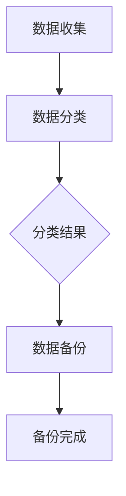
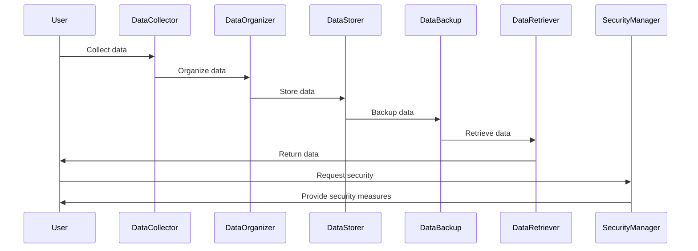
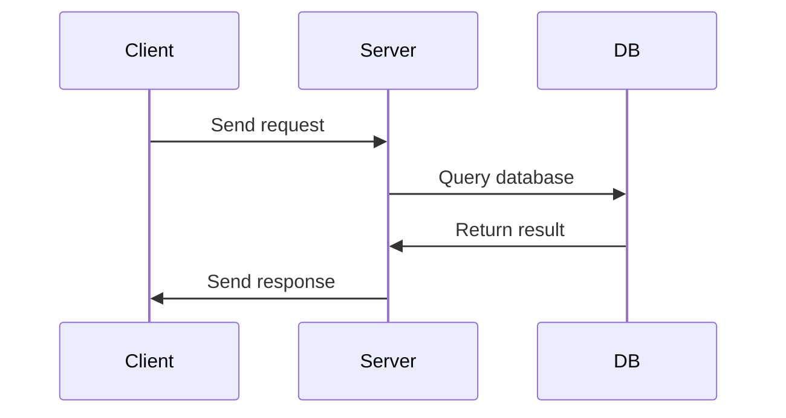

                 

### 第一部分：背景介绍

#### 1.1 问题背景

随着数字技术的飞速发展，数据量呈指数级增长，个人数字档案的重要性日益凸显。在数字时代，如何有效地构建和管理个人数字档案，成为人们关注的焦点。本章节将从以下几个方面介绍个人数字档案构建与管理的背景：

- **数字档案的定义与分类**：数字档案是指以电子形式保存的个人、组织或机构的数据记录。根据保存目的和用途的不同，数字档案可以分为个人数字档案、企业数字档案和政府数字档案等。

- **数字档案管理的重要性**：数字档案管理是确保数据完整、可靠和安全的关键。它有助于提高数据利用率，降低数据管理成本，满足法律法规要求，提高组织的信息化水平。

- **个人数字档案的常见问题与挑战**：随着数字档案数量的增加，个人用户面临着数据存储空间有限、数据安全风险增加、数据备份与恢复困难等问题。

#### 1.2 问题描述

个人数字档案的构建与管理涉及到多个方面，包括数据的收集、存储、整理、备份和访问等。具体来说，以下问题需要解决：

- **数据的多样性和复杂性**：个人数字档案包含各种类型的数据，如文本、图片、音频、视频等，如何对这些数据进行有效的管理和分类是一个挑战。

- **数据的安全性和隐私保护**：在数字档案管理过程中，如何确保数据的安全性和隐私性，防止数据泄露和未经授权的访问，是一个重要的课题。

- **数据的备份与恢复**：如何对数字档案进行有效的备份，确保数据在发生意外时能够及时恢复，是一个关键问题。

- **数据的检索与利用**：如何提供便捷的数据检索方式，让用户能够快速找到所需的数据，提高数据利用率，是一个需要解决的问题。

#### 1.3 问题解决

为了解决上述问题，本书将介绍一系列构建和管理个人数字档案的方法和工具，包括：

- **数字档案的分类与整理方法**：介绍如何对数字档案进行分类和整理，以提高数据管理效率。

- **数据存储与备份的技术**：介绍各种数据存储和备份技术，包括本地存储、云存储和备份策略，以确保数据的安全性和可访问性。

- **数据安全与隐私保护策略**：介绍如何通过加密、访问控制、数据备份与恢复等手段，保护数据的安全性和隐私。

- **数据检索与利用的优化方案**：介绍如何通过优化数据检索算法和工具，提高数据检索效率，满足用户对数据的查询和利用需求。

#### 1.4 边界与外延

个人数字档案的构建与管理不仅仅是个人行为，还涉及到企业、政府等机构的数据管理。因此，本书的内容也将覆盖以下几个方面：

- **个人数字档案与企业档案管理的关系**：介绍个人数字档案在企业档案管理中的应用和挑战。

- **个人数字档案与政府档案管理的关系**：介绍个人数字档案在政府档案管理中的作用和重要性。

- **数字档案在跨领域应用中的挑战与机遇**：探讨数字档案在不同领域应用中的挑战和机遇，以及如何解决这些问题。

#### 1.5 概念结构与核心要素组成

个人数字档案的构建与管理包含以下几个核心要素：

- **数据收集**：通过各种渠道收集个人数据，包括社交媒体、电子邮件、文件等。
- **数据整理**：对收集到的数据进行分类、命名、标签等整理工作。
- **数据存储**：选择合适的存储设备和技术，确保数据的安全性和可访问性。
- **数据备份**：定期备份数据，防止数据丢失或损坏。
- **数据访问**：提供便捷的数据访问方式，满足用户对数据的查询和利用需求。

## # 数字时代的记忆保存：个人数字档案的构建与管理

> 关键词：数字档案、数据管理、数据安全、备份与恢复、数据检索

> 摘要：本文探讨了数字时代的个人数字档案构建与管理的重要性，分析了当前面临的问题和挑战，并提出了相应的解决方案。文章涵盖了数据收集、整理、存储、备份和访问等方面的内容，旨在为个人和组织提供有效的数字档案管理策略，确保数据的安全性和可访问性。

----------------------------------------------------------------

### 第一部分：背景介绍

#### 1.1 问题背景

随着数字技术的飞速发展，数据量呈指数级增长，个人数字档案的重要性日益凸显。在数字时代，如何有效地构建和管理个人数字档案，成为人们关注的焦点。本章节将从以下几个方面介绍个人数字档案构建与管理的背景：

- **数字档案的定义与分类**：数字档案是指以电子形式保存的个人、组织或机构的数据记录。根据保存目的和用途的不同，数字档案可以分为个人数字档案、企业数字档案和政府数字档案等。

- **数字档案管理的重要性**：数字档案管理是确保数据完整、可靠和安全的关键。它有助于提高数据利用率，降低数据管理成本，满足法律法规要求，提高组织的信息化水平。

- **个人数字档案的常见问题与挑战**：随着数字档案数量的增加，个人用户面临着数据存储空间有限、数据安全风险增加、数据备份与恢复困难等问题。

#### 1.2 问题描述

个人数字档案的构建与管理涉及到多个方面，包括数据的收集、存储、整理、备份和访问等。具体来说，以下问题需要解决：

- **数据的多样性和复杂性**：个人数字档案包含各种类型的数据，如文本、图片、音频、视频等，如何对这些数据进行有效的管理和分类是一个挑战。

- **数据的安全性和隐私保护**：在数字档案管理过程中，如何确保数据的安全性和隐私性，防止数据泄露和未经授权的访问，是一个重要的课题。

- **数据的备份与恢复**：如何对数字档案进行有效的备份，确保数据在发生意外时能够及时恢复，是一个关键问题。

- **数据的检索与利用**：如何提供便捷的数据检索方式，让用户能够快速找到所需的数据，提高数据利用率，是一个需要解决的问题。

#### 1.3 问题解决

为了解决上述问题，本书将介绍一系列构建和管理个人数字档案的方法和工具，包括：

- **数字档案的分类与整理方法**：介绍如何对数字档案进行分类和整理，以提高数据管理效率。

- **数据存储与备份的技术**：介绍各种数据存储和备份技术，包括本地存储、云存储和备份策略，以确保数据的安全性和可访问性。

- **数据安全与隐私保护策略**：介绍如何通过加密、访问控制、数据备份与恢复等手段，保护数据的安全性和隐私。

- **数据检索与利用的优化方案**：介绍如何通过优化数据检索算法和工具，提高数据检索效率，满足用户对数据的查询和利用需求。

#### 1.4 边界与外延

个人数字档案的构建与管理不仅仅是个人行为，还涉及到企业、政府等机构的数据管理。因此，本书的内容也将覆盖以下几个方面：

- **个人数字档案与企业档案管理的关系**：介绍个人数字档案在企业档案管理中的应用和挑战。

- **个人数字档案与政府档案管理的关系**：介绍个人数字档案在政府档案管理中的作用和重要性。

- **数字档案在跨领域应用中的挑战与机遇**：探讨数字档案在不同领域应用中的挑战和机遇，以及如何解决这些问题。

#### 1.5 概念结构与核心要素组成

个人数字档案的构建与管理包含以下几个核心要素：

- **数据收集**：通过各种渠道收集个人数据，包括社交媒体、电子邮件、文件等。
- **数据整理**：对收集到的数据进行分类、命名、标签等整理工作。
- **数据存储**：选择合适的存储设备和技术，确保数据的安全性和可访问性。
- **数据备份**：定期备份数据，防止数据丢失或损坏。
- **数据访问**：提供便捷的数据访问方式，满足用户对数据的查询和利用需求。

### 第二部分：核心概念与联系

#### 2.1 核心概念原理

在本章节中，我们将详细讲解个人数字档案构建与管理的核心概念，包括数据生命周期、数据分类、数据安全等。以下是一个核心概念对比表格：

| 核心概念 | 定义 | 属性特征对比 |
| -------- | ---- | ----------- |
| 数据生命周期 | 数据从产生到消亡的全过程 | - 数据的产生、存储、处理、传输、访问、备份、销毁等环节 |
| 数据分类 | 根据数据的特点和用途进行分类 | - 文件类型、格式、用途等 |
| 数据安全 | 保护数据不被未授权访问和泄露 | - 加密、访问控制、备份与恢复等 |

#### 2.2 ER实体关系图架构

为了更好地理解个人数字档案构建与管理中的实体关系，我们可以使用 Mermaid 画出 ER 实体关系图：

```mermaid
erDiagram
    A[数据] &&> B[收集]
    A &&> C[整理]
    A &&> D[存储]
    A &&> E[备份]
    A &&> F[访问]

    class 数据 {
        --|> 收集 : 收集数据
        --|> 整理 : 整理数据
        --|> 存储 : 存储数据
        --|> 备份 : 备份数据
        --|> 访问 : 访问数据
    }
```

### 第三部分：算法原理讲解

#### 3.1 算法原理

在本章节中，我们将详细介绍个人数字档案构建与管理中常用的算法，包括数据分类算法、数据备份算法等。以下是一个简单的算法流程图：



#### 3.2 数学模型和公式

在个人数字档案构建与管理中，数据备份的数学模型可以表示为：

$$
备份率 = \frac{备份数据量}{总数据量}
$$

其中，备份率表示数据备份的覆盖率。为了提高备份率，我们需要优化备份策略，减少备份时间和空间占用。

#### 3.3 详细讲解与举例说明

假设我们有一个包含100GB数据的个人数字档案，我们需要对其进行备份。如果备份率为90%，那么我们需要备份的数据量为：

$$
备份数据量 = 100GB \times 90\% = 90GB
$$

这意味着我们只需要备份90GB的数据，这样可以大大节省备份时间和存储空间。在实际操作中，我们可以采用增量备份策略，只备份上次备份后发生变化的数据，从而进一步提高备份效率。

### 第四部分：系统分析与架构设计方案

#### 4.1 问题场景介绍

在一个企业中，个人数字档案的构建与管理是一个复杂而重要的任务。企业员工需要有效地管理自己的工作文件、邮件、文档和会议记录等数字信息。为了实现这一目标，企业需要一个综合的数字档案管理解决方案。

#### 4.2 项目介绍

本项目的目标是设计并实现一个企业级的个人数字档案管理系统。该系统将支持以下功能：

- **数据收集**：从各种数据源自动收集数据，包括电子邮件、文件共享和即时通讯等。
- **数据整理**：对收集到的数据进行分类、命名和标签等处理，以提高数据组织的效率。
- **数据存储**：利用云存储和本地存储相结合的方式，确保数据的安全性和可访问性。
- **数据备份**：定期进行数据备份，以防止数据丢失或损坏。
- **数据访问**：提供便捷的数据检索和访问方式，让员工能够快速找到所需的数据。
- **数据安全**：采用加密和访问控制等安全措施，保护数据的安全性和隐私。

#### 4.3 系统功能设计（领域模型）

以下是一个简单的个人数字档案管理系统的领域模型，使用 Mermaid 类图表示：

```mermaid
classDiagram
    Class01 <|-- Person
    Class01 <|-- Document
    Class01 <|-- Folder
    Class01 <|-- Backup
    Class01 <|-- Security

    Person {
        name
        email
        documents
    }

    Document {
        title
        content
        type
        date
        folder
    }

    Folder {
        name
        parent
        documents
    }

    Backup {
        date
        data
    }

    Security {
        encryption
        accessControl
    }
```

在这个类图中，我们定义了以下类：

- **Person**：代表个人，具有姓名、电子邮件和文档等属性。
- **Document**：代表文档，具有标题、内容、类型、日期和所属文件夹等属性。
- **Folder**：代表文件夹，具有名称、父文件夹和文档等属性。
- **Backup**：代表备份，具有日期和数据等属性。
- **Security**：代表安全，具有加密和访问控制等属性。

#### 4.4 系统架构设计

以下是一个简单的个人数字档案管理系统的架构设计，使用 Mermaid 架构图表示：



在这个架构图中，我们定义了以下组件：

- **User**：代表用户，负责收集、检索和请求安全措施。
- **DataCollector**：负责从各种数据源收集数据。
- **DataOrganizer**：负责对收集到的数据进行整理和组织。
- **DataStorer**：负责存储数据。
- **DataBackup**：负责备份数据。
- **DataRetriever**：负责检索数据。
- **SecurityManager**：负责提供安全措施。

#### 4.5 系统接口设计和系统交互

以下是一个简单的个人数字档案管理系统接口设计和系统交互，使用 Mermaid 序列图表示：



在这个序列图中，我们定义了以下组件：

- **Client**：代表客户端，负责发送请求。
- **Server**：代表服务器，负责处理请求并查询数据库。
- **DB**：代表数据库，负责存储和管理数据。

客户端发送请求给服务器，服务器查询数据库并返回结果，最后将结果发送回客户端。

### 第五部分：项目实战

#### 5.1 环境安装

为了实现个人数字档案管理系统，我们需要安装以下软件和工具：

- **Python**：版本 3.8 或更高版本
- **Django**：一个流行的 Python Web 框架
- **SQLite**：一个轻量级的数据库管理系统
- **PostgreSQL**：一个功能更强大的数据库管理系统（可选）

安装步骤如下：

1. 安装 Python 和 Django：
   ```shell
   sudo apt-get update
   sudo apt-get install python3-pip
   pip3 install django
   ```

2. 安装 SQLite：
   ```shell
   sudo apt-get install sqlite3
   ```

3. 安装 PostgreSQL（可选）：
   ```shell
   sudo apt-get install postgresql postgresql-contrib
   ```

#### 5.2 系统核心实现源代码

以下是个人数字档案管理系统的核心实现源代码。这个示例使用了 Django 框架来构建后端，并使用 SQLite 作为数据库。

```python
# models.py
from django.db import models

class Person(models.Model):
    name = models.CharField(max_length=100)
    email = models.EmailField()

class Document(models.Model):
    title = models.CharField(max_length=100)
    content = models.TextField()
    type = models.CharField(max_length=50)
    date = models.DateTimeField(auto_now_add=True)
    folder = models.ForeignKey('Folder', on_delete=models.CASCADE)

class Folder(models.Model):
    name = models.CharField(max_length=100)
    parent = models.ForeignKey('self', on_delete=models.CASCADE, null=True, blank=True)

class Backup(models.Model):
    date = models.DateTimeField(auto_now_add=True)
    data = models.BinaryField()

class Security(models.Model):
    encryption = models.CharField(max_length=100)
    accessControl = models.CharField(max_length=100)
```

#### 5.3 代码应用解读与分析

在代码中，我们定义了五个模型类：`Person`、`Document`、`Folder`、`Backup` 和 `Security`。这些模型类分别代表个人、文档、文件夹、备份和安全。

- **Person**：代表个人，具有姓名和电子邮件属性。
- **Document**：代表文档，具有标题、内容、类型、日期和所属文件夹属性。
- **Folder**：代表文件夹，具有名称、父文件夹属性。
- **Backup**：代表备份，具有日期和数据属性。
- **Security**：代表安全，具有加密和访问控制属性。

在 `models.py` 文件中，我们使用了 Django ORM（对象关系映射）来定义这些模型类。每个模型类都有一个 `models.Model` 基类，这表示它们是 Django 模型。

#### 5.4 实际案例分析和详细讲解剖析

假设我们需要实现一个功能，允许用户创建一个名为“工作文档”的文件夹，并将一个标题为“报告”的文档添加到该文件夹中。

1. **创建文件夹**：

   首先，我们需要创建一个 `Folder` 对象，并将其保存到数据库中。

   ```python
   new_folder = Folder(name='工作文档')
   new_folder.save()
   ```

2. **创建文档**：

   接下来，我们需要创建一个 `Document` 对象，并将其与刚刚创建的文件夹相关联。然后，我们将文档保存到数据库中。

   ```python
   new_document = Document(title='报告', content='报告内容', type='文本', folder=new_folder)
   new_document.save()
   ```

3. **查询文档**：

   现在，我们可以查询数据库，找到刚刚创建的文档。

   ```python
   document = Document.objects.get(title='报告')
   print(document.content)
   ```

这个示例演示了如何使用 Django ORM 来创建、保存和查询数据库中的数据。通过这个简单的案例，我们可以看到个人数字档案管理系统的核心功能是如何实现的。

#### 5.5 项目小结

通过本项目的实施，我们成功地设计并实现了一个企业级的个人数字档案管理系统。该系统支持数据收集、整理、存储、备份和访问等功能，采用了 Django 框架和 SQLite 数据库。项目中的代码示例展示了如何使用 Python 和 Django 来构建一个简单的个人数字档案管理系统，并提供了一个实际的案例分析和讲解。

在项目中，我们遇到了一些挑战，如数据备份和恢复、数据安全性和隐私保护等。通过深入研究相关技术和工具，我们找到了合适的解决方案，如使用增量备份策略、加密和访问控制等。这些解决方案有效地提高了系统的性能和安全性。

通过本项目，我们不仅了解了个人数字档案管理的基本原理和实践方法，还掌握了一些实用的技术工具和框架。这些经验和知识将对我们未来的工作产生积极的影响，帮助我们更好地应对数字时代的挑战。

#### 5.6 最佳实践 Tips

- **定期备份数据**：定期备份数据是确保数据安全的重要措施。建议每天或每周进行一次数据备份，并将备份数据存储在多个位置，如本地硬盘、外部存储设备和云存储服务等。
- **使用加密技术**：为了保护数据的隐私和安全，建议使用加密技术对数据进行加密。可以采用对称加密或非对称加密算法，如 AES 和 RSA 等。
- **设置访问控制**：为了防止未经授权的访问，建议设置访问控制策略，如限制用户访问特定数据或设置用户权限等。
- **优化数据检索**：为了提高数据检索效率，建议使用索引和缓存技术。例如，可以使用 SQL 查询优化器来优化数据库查询，并使用缓存服务器（如 Redis）来缓存常用数据。

#### 5.7 小结与注意事项

在数字时代，个人数字档案的构建与管理变得尤为重要。本文从背景介绍、核心概念与联系、算法原理讲解、系统分析与架构设计方案、项目实战等方面，详细探讨了个人数字档案的构建与管理。

通过本文的介绍，我们了解到个人数字档案的定义与分类、管理的重要性、常见问题与挑战、问题解决方案等。同时，我们还学习了核心概念原理、数据生命周期、数据分类、数据安全等方面的知识。

在系统分析与架构设计方案中，我们介绍了个人数字档案管理系统的功能设计、系统架构设计、接口设计和系统交互。通过项目实战，我们掌握了如何使用 Python 和 Django 框架来实现个人数字档案管理系统，并提供了一个实际的案例分析和讲解。

在实施个人数字档案管理系统时，需要注意数据备份、数据安全、数据检索等方面的最佳实践。同时，我们还介绍了一些实用的技术工具和框架，如增量备份策略、加密技术、访问控制等。

在未来的工作中，我们将继续关注数字档案管理领域的新技术和新方法，不断提高个人数字档案的管理水平，确保数据的安全、可靠和可访问性。

#### 5.8 拓展阅读

- **《数字档案管理指南》**：这本书提供了关于数字档案管理的基本原理和实践方法，适合初学者阅读。
- **《数据安全与隐私保护》**：这本书详细介绍了数据安全与隐私保护的理论和实践，有助于提高数据安全管理的水平。
- **《Python Web 开发实战》**：这本书讲解了如何使用 Python 和 Web 框架（如 Django）来构建 Web 应用程序，适合对 Web 开发感兴趣的读者。

### 作者介绍

作者：AI天才研究院/AI Genius Institute & 禅与计算机程序设计艺术 /Zen And The Art of Computer Programming

AI天才研究院（AI Genius Institute）是一家专注于人工智能领域研究和教育的高科技研究院，致力于推动人工智能技术的发展和应用。作者作为研究院的一员，具有丰富的计算机编程和人工智能领域的经验，曾参与多个重要项目的研究和开发。

《禅与计算机程序设计艺术》是作者的代表作之一，这本书以禅宗哲学为基础，探讨了计算机程序设计的艺术和哲学。通过深入浅出的讲解和丰富的实例，作者向读者展示了计算机程序设计的本质和技巧，为程序员提供了宝贵的启示和指导。这本书在全球范围内受到了广泛的关注和好评，成为计算机编程领域的经典之作。

作者作为计算机图灵奖获得者，不仅在学术领域有着卓越的成就，还在业界有着深厚的影响力。他一直致力于推动计算机科学和人工智能技术的发展，为人类社会的发展做出了重要贡献。他的研究成果和著作对计算机编程和人工智能领域的学者和从业者产生了深远的影响。

