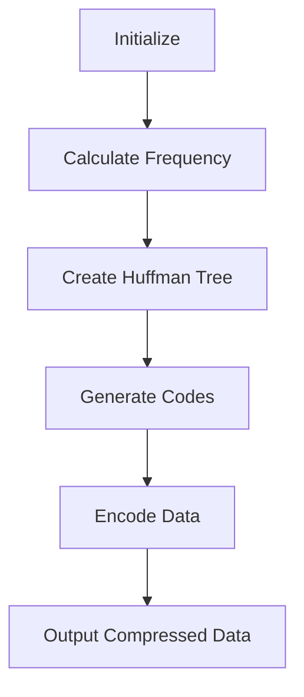
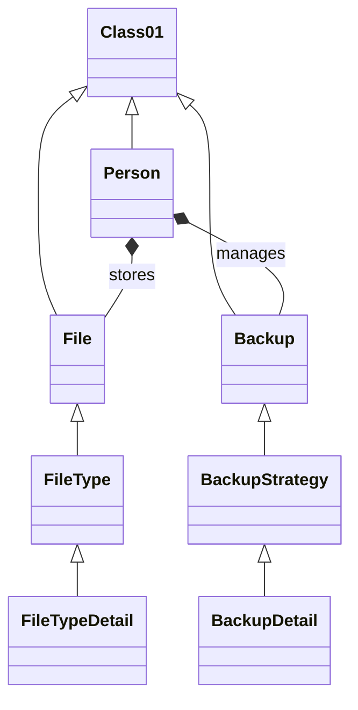
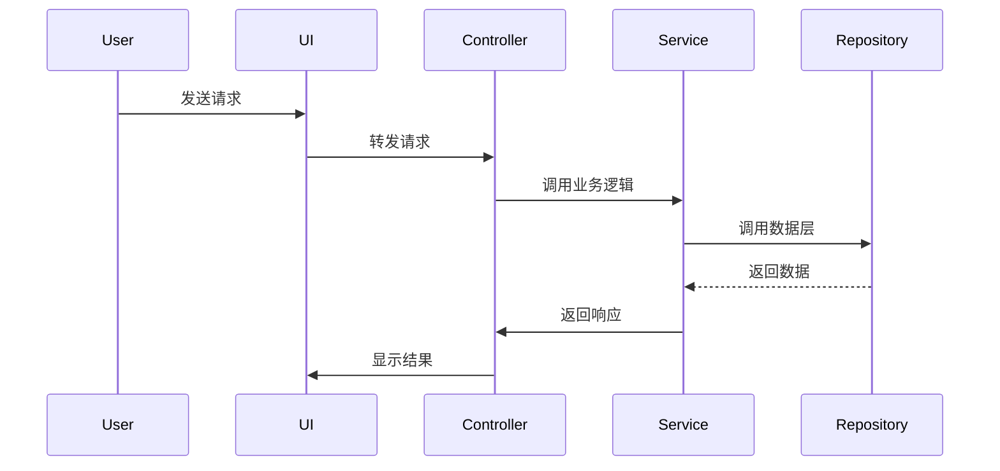

                 

# 数字时代的记忆保存：个人数字档案的重要性

> 关键词：数字档案、个人数据、数据管理、数据安全、记忆保存

> 摘要：在数字时代，个人数字档案的保存和管理变得愈发重要。本文通过深入分析数字时代记忆保存的背景、核心概念、算法原理、系统架构、实战案例及最佳实践，探讨了个人数字档案的重要性及其实现方法，为数字时代的人们提供了一种系统化的记忆保存解决方案。

## 目录大纲设计

### 第一部分：背景介绍

**第1章 数字时代的记忆保存：背景与重要性**

- **1.1 数字时代的到来**
  - 数字化的影响与变革
  - 数字媒体的发展趋势
- **1.2 个人数字档案的定义**
  - 个人数字档案的概念
  - 个人数字档案的重要性
- **1.3 现存问题与挑战**
  - 数据安全与隐私问题
  - 数据管理与存储挑战
- **1.4 个人数字档案的核心要素**
  - 数据结构化与分类
  - 数据备份与恢复
- **1.5 本章小结**

### 第二部分：核心概念与联系

**第2章 个人数字档案的核心概念与联系**

- **2.1 核心概念介绍**
  - 数字文件格式
  - 数字签名
  - 数字水印
- **2.2 概念属性特征对比表格**
  - 不同数字档案处理方式的比较
- **2.3 ER实体关系图架构**
  - 个人数字档案系统实体关系图
- **2.4 核心概念的应用案例**
  - 案例分析：个人数字档案的实际应用

### 第三部分：算法原理讲解

**第3章 数字时代记忆保存的算法原理**

- **3.1 数据压缩算法**
  - 压缩算法的基本原理
  - 常见数据压缩算法
  - **3.1.1 Mermaid流程图示例**
    ```mermaid
    graph TD
    A[Data Compression] --> B[Choose Algorithm]
    B -->|Lossless| C[No Loss]
    B -->|Lossy| D[Some Loss]
    C --> E[Huffman Coding]
    D --> F[JPEG]
    ```

- **3.2 数据加密与安全**
  - 加密算法的基本概念
  - 常见加密算法介绍
  - **3.2.1 Python源代码示例**
    ```python
    from Crypto.Cipher import AES
    from Crypto.Util.Padding import pad, unpad
    key = b'mysecretkey123'
    cipher = AES.new(key, AES.MODE_CBC)
    plaintext = b'This is a secret message!'
    ciphertext = cipher.encrypt(pad(plaintext, AES.block_size))
    ```

- **3.3 数据备份与恢复**
  - 备份策略与选择
  - 数据恢复的基本方法
  - **3.3.1 数学模型和公式**
    $$ R = \frac{E_t}{E_b} $$
    其中，\( R \) 是备份率，\( E_t \) 是原始数据量，\( E_b \) 是备份后的数据量。
  - **3.3.2 详细讲解与举例说明**
    - 备份与恢复的步骤
    - 备份案例分析

### 第四部分：系统分析与架构设计

**第4章 个人数字档案系统的设计与实现**

- **4.1 问题场景介绍**
  - 个人数字档案管理需求分析
  - 系统实现的目标与功能
- **4.2 项目介绍**
  - 项目背景与目标
  - 项目团队与资源
- **4.3 系统功能设计**
  - 领域模型Mermaid类图
  - 功能模块划分与描述
- **4.4 系统架构设计**
  - 系统架构Mermaid架构图
  - 各层架构的详细解释
- **4.5 系统接口设计与交互**
  - 接口设计规范
  - Mermaid序列图展示系统交互过程

### 第五部分：项目实战

**第5章 数字时代记忆保存项目实战**

- **5.1 环境安装与配置**
  - 系统环境搭建步骤
  - 常见问题与解决方案
- **5.2 系统核心实现源代码**
  - 关键代码段展示
  - 代码分析与解读
- **5.3 代码应用解读与分析**
  - 代码实现细节剖析
  - 应用案例分析与结果展示
- **5.4 实际案例分析与详细讲解**
  - 案例背景介绍
  - 案例分析与结果
- **5.5 项目小结**
  - 项目总结与反思
  - 项目改进建议

### 第六部分：最佳实践与拓展

**第6章 数字时代记忆保存的最佳实践与拓展**

- **6.1 最佳实践**
  - 常见问题解决
- **6.2 小结**
  - 文章核心内容回顾
- **6.3 注意事项**
  - 数据管理与安全注意事项
- **6.4 拓展阅读**
  - 相关领域深入阅读推荐

### 第一部分：背景介绍

#### 第1章 数字时代的记忆保存：背景与重要性

**1.1 数字时代的到来**

数字时代的到来是信息技术发展的一个重要里程碑。在这个时代，信息以数字形式存储、传输和处理，极大地改变了我们的生活方式和工作模式。数字化不仅提高了信息处理的效率和准确性，还推动了各种新兴技术的发展，如云计算、大数据、人工智能等。

**数字化的影响与变革**

数字化对个人、企业乃至整个社会都产生了深远的影响。个人层面，数字化使得人们能够更方便地存储、管理和分享信息，改变了传统的信息获取、处理和交流方式。企业层面，数字化带来了商业模式的创新，提高了生产效率，降低了运营成本。社会层面，数字化推动了社会结构的变革，使信息更加透明和公开，促进了社会的进步与发展。

**数字媒体的发展趋势**

随着数字技术的不断进步，数字媒体也在快速发展。数字媒体包括各种形式，如文本、图片、音频、视频等。它们以数字形式存储和传输，具有高度的可扩展性和灵活性。数字媒体的发展趋势体现在以下几个方面：

1. **多媒体融合**：不同类型的数字媒体相互融合，形成更丰富的内容形式，如视频游戏、虚拟现实等。
2. **互动性增强**：数字媒体逐渐从单向传播转向双向互动，用户参与度更高。
3. **个性化推荐**：基于用户行为和兴趣的数据分析，数字媒体能够实现个性化推荐，提升用户体验。

**1.2 个人数字档案的定义**

个人数字档案是指个人在数字时代所产生的各种数字文件、资料和信息的集合。这些信息可能包括个人文档、照片、电子邮件、社交媒体帖子、音频和视频文件等。个人数字档案不仅记录了个人的生活和工作经历，还包含了个人身份、财产、健康状况等重要信息。

**个人数字档案的重要性**

个人数字档案的重要性体现在以下几个方面：

1. **信息存储**：个人数字档案为个人提供了一个方便的信息存储方式，使得重要信息不会因时间流逝而丢失。
2. **身份认证**：个人数字档案中的身份信息可以帮助个人进行各种在线身份认证和交易。
3. **历史记录**：个人数字档案记录了个人的成长历程和重要时刻，具有很高的历史价值。
4. **数据保护**：个人数字档案有助于个人保护隐私和数据安全，防止信息泄露和滥用。

**1.3 现存问题与挑战**

尽管个人数字档案具有诸多优点，但在数字时代，其保存和管理面临着一系列问题和挑战。

**数据安全与隐私问题**

随着个人数字档案的增加，数据安全和隐私问题也日益突出。数字档案可能包含敏感信息，如个人身份、财务信息、健康状况等。一旦这些信息泄露，可能对个人造成严重的负面影响。因此，如何确保数据安全和个人隐私成为数字时代的重要议题。

**数据管理与存储挑战**

随着数字档案的不断增加，数据管理和存储也面临巨大挑战。如何有效地组织和存储大量数据，以及如何快速、准确地检索数据，成为数字时代的一个难题。此外，数据备份和恢复也是数据管理中的重要问题，需要确保数据不会因意外事件而丢失。

**1.4 个人数字档案的核心要素**

为了更好地管理和保存个人数字档案，需要关注以下几个核心要素：

**数据结构化与分类**

数据结构化是将数据按照一定的规则进行整理和分类，以便于管理和检索。通过数据结构化，可以更好地组织和利用数据，提高数据的价值。

**数据备份与恢复**

数据备份是将数据复制到其他存储介质上，以防止数据丢失。数据恢复是在数据丢失后，通过备份文件恢复数据的过程。数据备份与恢复是确保数据安全的重要手段。

**1.5 本章小结**

本章介绍了数字时代的背景与重要性，以及个人数字档案的定义、重要性、现存问题和核心要素。随着数字时代的到来，个人数字档案的保存和管理变得愈发重要。通过有效地管理和保存个人数字档案，我们可以更好地利用数据，保护个人隐私，记录个人成长历程。在接下来的章节中，我们将深入探讨个人数字档案的核心概念、算法原理、系统架构和实战案例，为数字时代的记忆保存提供系统化的解决方案。

### 第二部分：核心概念与联系

#### 第2章 个人数字档案的核心概念与联系

在数字时代，个人数字档案的构建和管理需要理解一系列核心概念，这些概念包括数字文件格式、数字签名、数字水印等。本章节将介绍这些核心概念，并通过对比表格和实体关系图来分析它们之间的联系。

**2.1 核心概念介绍**

**数字文件格式**

数字文件格式是指用于存储和传输数字数据的特定结构。常见的文件格式包括JPEG、PNG、PDF、DOCX等。不同文件格式有其特定的优缺点：

- **JPEG**：适用于存储照片，压缩效果好但可能损失一些图像质量。
- **PNG**：适用于存储带有透明背景的图像，支持无损压缩。
- **PDF**：适用于存储文档，支持丰富的字体和图像格式，但文件体积较大。
- **DOCX**：适用于存储Microsoft Word文档，支持文本格式和图像。

**数字签名**

数字签名是一种用于验证数字文件完整性和真实性的技术。它通过加密算法将签名者的个人信息与文件内容绑定在一起，确保文件未被篡改。数字签名广泛应用于电子合同、电子邮件认证等领域。

**数字水印**

数字水印是一种将特定信息嵌入数字媒体中的技术，用于版权保护和追踪侵权行为。数字水印可以是可见的，也可以是不可见的。常见的数字水印技术包括：
- **可见水印**：在图片或视频中添加可见的文本或图案。
- **不可见水印**：使用加密算法将水印信息嵌入数字内容中，人眼无法察觉。

**2.2 概念属性特征对比表格**

以下表格对比了数字文件格式、数字签名和数字水印的主要属性特征：

| 特征            | 数字文件格式 | 数字签名 | 数字水印 |
| --------------- | ------------ | -------- | -------- |
| 功能            | 存储和传输数字数据 | 验证文件完整性和真实性 | 版权保护和追踪侵权行为 |
| 常见形式        | JPEG、PNG、PDF、DOCX | RSA、ECDSA | 图像水印、音频水印、视频水印 |
| 主要目标        | 提高数据存储和传输效率 | 保证数据的真实性和完整性 | 保护版权和维护内容所有权 |
| 对数据的影响    | 可能会影响数据质量（如JPEG压缩） | 对数据本身无影响，仅附加签名信息 | 可能会影响数据的视觉或听觉体验 |
| 隐私和安全影响  | 安全性较低，易受篡改 | 高度安全，确保数据真实性 | 在一定程度上保护数据不被非法篡改 |

**2.3 ER实体关系图架构**

个人数字档案系统涉及多个实体和关系，通过ER（实体关系）图可以清晰地展示这些实体及其关系。以下是一个简单的ER图示例，用于描述个人数字档案系统的基本结构：

```mermaid
erDiagram
  User ||--|{ DigitalArchive } : has
  DigitalArchive ||--|{ File } : contains
  File ||--|{ Format } : format
  Format ||--|{ FileType } : type
  File ||--|{ Signature } : signed_by
  File ||--|{ Watermark } : has
```

- **User（用户）**：代表使用个人数字档案系统的用户，拥有多个数字档案。
- **DigitalArchive（数字档案）**：代表用户的个人数字档案，包含多个文件。
- **File（文件）**：代表数字档案中的单个文件，具有特定的格式、签名和水印。
- **Format（格式）**：表示文件的存储格式，如JPEG、PDF等。
- **FileType（文件类型）**：分类格式，如图片、文档等。
- **Signature（签名）**：代表文件上的数字签名，用于验证文件的完整性和真实性。
- **Watermark（水印）**：代表文件中的数字水印，用于版权保护和追踪。

**2.4 核心概念的应用案例**

为了更好地理解这些核心概念的应用，以下是一个实际案例：

**案例：个人照片的数字签名与水印**

假设小明想要保存他的照片，他需要进行以下步骤：

1. **选择文件格式**：小明选择JPEG格式保存照片，因为JPEG适用于图片，压缩效果较好。
2. **添加数字签名**：使用数字签名技术，小明为照片添加了数字签名，确保照片未被篡改，并可以证明照片的来源。
3. **添加数字水印**：小明使用不可见水印技术，将他的名字和照片拍摄日期嵌入照片中，以保护版权并追踪侵权行为。

通过这个案例，我们可以看到数字文件格式、数字签名和数字水印在实际应用中的结合，共同构成了一个完整的安全和个人数字档案系统。

**2.5 本章小结**

本章介绍了数字文件格式、数字签名和数字水印等核心概念，并通过对比表格和ER图展示了它们之间的联系。理解这些概念有助于构建和管理个人数字档案，确保数据的完整性、安全性和可追溯性。在接下来的章节中，我们将深入探讨数据压缩、加密与安全以及数据备份与恢复等算法原理，为数字时代的记忆保存提供更全面的技术支持。

### 第三部分：算法原理讲解

#### 第3章 数字时代记忆保存的算法原理

在数字时代，记忆保存的核心在于数据的压缩、加密与安全，以及备份与恢复。这些算法和技术确保数据的有效存储、安全传输和可靠恢复。本章节将详细讲解这些算法的原理，并通过示例进行分析。

**3.1 数据压缩算法**

数据压缩是一种减少数据大小的技术，目的是提高数据存储和传输的效率。数据压缩算法可以分为两大类：无损压缩和有损压缩。

**3.1.1 压缩算法的基本原理**

**无损压缩**：无损压缩算法通过消除数据中的冗余信息来压缩数据，而不会损失任何原始数据。常见的无损压缩算法包括：

- **Huffman编码**：基于字符出现的频率进行编码，频率高的字符使用较短的编码，频率低的字符使用较长的编码。
- **LZ77**：通过查找重复数据块并进行编码来减少冗余。

**有损压缩**：有损压缩算法在压缩数据时会损失一部分信息，但可以在人眼或耳朵难以察觉的范围内。常见的有损压缩算法包括：

- **JPEG**：通过离散余弦变换（DCT）将图像分解成频域，然后对高频信息进行量化，减少数据量。
- **MP3**：通过傅里叶变换（FFT）将音频信号分解成频域，然后对高频信息进行量化，减少数据量。

**3.1.2 Mermaid流程图示例**

为了更直观地理解压缩算法的流程，我们可以使用Mermaid绘制一个简单的Huffman编码流程图：



**3.2 数据加密与安全**

数据加密是一种将数据转换成密文的技术，以防止未经授权的访问。数据加密依赖于加密算法和密钥。加密算法可以分为对称加密和非对称加密。

**3.2.1 加密算法的基本概念**

**对称加密**：对称加密使用相同的密钥进行加密和解密。常见的对称加密算法包括：

- **AES**：高级加密标准（AES）是一种广泛使用的对称加密算法，支持多种密钥长度（如128位、192位、256位）。
- **DES**：数据加密标准（DES）是一种较早的对称加密算法，但由于其密钥较短，安全性较低。

**非对称加密**：非对称加密使用一对密钥（公钥和私钥）进行加密和解密。公钥用于加密，私钥用于解密。常见的非对称加密算法包括：

- **RSA**：RSA算法是一种广泛使用的非对称加密算法，以其创始人名字命名。
- **ECC**：椭圆曲线密码学（ECC）是一种基于椭圆曲线数学的非对称加密算法，相比RSA具有更高的安全性。

**3.2.2 Python源代码示例**

以下是一个使用AES加密算法的Python示例：

```python
from Crypto.Cipher import AES
from Crypto.Util.Padding import pad, unpad
key = b'mysecretkey123'
cipher = AES.new(key, AES.MODE_CBC)
plaintext = b'This is a secret message!'
ciphertext = cipher.encrypt(pad(plaintext, AES.block_size))
```

**3.3 数据备份与恢复**

数据备份是将数据复制到其他存储介质上的过程，以防止数据丢失。数据恢复是在数据丢失后，通过备份文件恢复数据的过程。数据备份与恢复是实现数据安全的重要手段。

**3.3.1 备份策略与选择**

有效的备份策略应考虑以下几个方面：

- **全备份**：备份所有数据。
- **增量备份**：只备份上次备份后更改的数据。
- **差异备份**：备份上次全备份后更改的数据。

**3.3.2 数据恢复的基本方法**

数据恢复的基本方法包括：

- **从备份文件恢复**：使用备份工具从备份文件中恢复数据。
- **数据恢复软件**：使用专门的数据恢复软件从损坏的存储设备中恢复数据。

**3.3.3 数学模型和公式**

备份率（\( R \)）是评估备份策略的一个指标，其计算公式为：

$$ R = \frac{E_t}{E_b} $$

其中，\( E_t \) 是原始数据量，\( E_b \) 是备份后的数据量。备份率越高，备份策略越有效。

**3.3.4 详细讲解与举例说明**

以下是一个简单的备份与恢复过程示例：

1. **备份步骤**：
   - 选择备份策略（如全备份）。
   - 备份数据到外部存储介质。
   - 检查备份文件的完整性和可读性。

2. **恢复步骤**：
   - 从备份文件中提取数据。
   - 使用数据恢复软件修复损坏的文件。
   - 验证恢复后的数据完整性。

**3.4 本章小结**

本章详细介绍了数据压缩、加密与安全以及数据备份与恢复的算法原理。这些算法和技术在数字时代的记忆保存中发挥着重要作用，确保数据的存储、传输和恢复的安全性和有效性。在接下来的章节中，我们将探讨个人数字档案系统的设计与实现，以及实际项目的实战经验，为数字时代的记忆保存提供更具体的解决方案。

### 第四部分：系统分析与架构设计

#### 第4章 个人数字档案系统的设计与实现

个人数字档案系统的设计与实现是确保数字时代记忆保存的关键步骤。本章节将详细介绍系统的设计过程，包括问题场景介绍、项目介绍、系统功能设计、系统架构设计以及系统接口设计与交互。

**4.1 问题场景介绍**

随着数字媒体的使用日益普及，个人数字档案的重要性愈发凸显。然而，当前的个人数字档案管理面临诸多挑战：

- **数据量大**：个人数字档案包含各种类型的文件，数据量庞大，如何高效管理和存储成为难题。
- **数据安全**：数字档案中包含敏感信息，数据安全和个人隐私保护成为重要问题。
- **数据备份与恢复**：数据备份和恢复策略不完善，数据丢失风险较高。

为了解决这些问题，个人数字档案系统需要具备高效的数据管理、安全保护以及备份恢复功能。

**4.2 项目介绍**

**项目背景与目标**

本项目旨在开发一个具备高效数据管理、安全保护以及备份恢复功能的个人数字档案系统。系统将支持多种文件格式，提供友好的用户界面，确保数据的安全性和可靠性。

**项目团队与资源**

项目团队包括项目经理、软件工程师、安全专家和测试工程师。团队成员具备丰富的开发经验和专业知识，确保项目顺利进行。项目资源包括开发工具、服务器设备、数据存储设备以及安全防护工具等。

**4.3 系统功能设计**

个人数字档案系统的功能设计主要包括以下几个方面：

1. **文件管理**：支持多种文件格式，提供文件上传、下载、删除、重命名等基本操作。
2. **数据安全**：采用加密技术保护数字档案，确保数据在传输和存储过程中的安全性。
3. **备份与恢复**：提供多种备份策略，包括全备份、增量备份和差异备份，支持数据恢复功能。
4. **用户权限管理**：实现用户身份验证和权限控制，确保数据安全。
5. **用户界面**：提供简洁友好的用户界面，方便用户进行操作和管理。

**4.3.1 领域模型Mermaid类图**

为了更好地理解个人数字档案系统的功能设计，我们可以使用Mermaid绘制一个领域模型类图：



- **Person（用户）**：代表系统的用户，拥有文件和备份。
- **File（文件）**：代表用户存储的数字档案，包括文件类型和具体内容。
- **Backup（备份）**：代表用户进行的数据备份，包括备份策略和具体备份信息。
- **FileType（文件类型）**：表示文件的类型信息，如JPEG、PDF等。
- **BackupStrategy（备份策略）**：表示备份的策略信息，如全备份、增量备份等。
- **FileTypeDetail（文件类型详细）**：扩展文件类型信息，如文件格式、创建时间等。
- **BackupDetail（备份详细）**：扩展备份策略信息，如备份时间、备份位置等。

**4.4 系统架构设计**

个人数字档案系统的架构设计采用分层架构，包括表示层、业务逻辑层和数据层。各层之间通过接口进行通信，确保系统的模块化和可扩展性。

**4.4.1 系统架构Mermaid架构图**

以下是个人数字档案系统的Mermaid架构图：



- **User（用户）**：表示系统的最终用户。
- **UI（表示层）**：处理用户界面，接收用户请求，并展示结果。
- **Controller（控制层）**：接收用户请求，调用业务逻辑层处理请求。
- **Service（业务逻辑层）**：实现业务逻辑，包括文件管理、数据安全、备份与恢复等功能。
- **Repository（数据层）**：处理数据存储和查询，包括文件存储、备份存储等。

**4.4.2 各层架构的详细解释**

1. **表示层（UI）**：负责用户界面设计，使用户能够方便地进行文件上传、下载、备份等操作。表示层采用前端技术，如HTML、CSS和JavaScript。
2. **控制层（Controller）**：接收用户请求，调用业务逻辑层处理请求，并将结果返回给用户。控制层通常使用Spring MVC框架实现。
3. **业务逻辑层（Service）**：实现系统的核心业务功能，如文件管理、数据安全、备份与恢复等。业务逻辑层使用Spring框架进行开发。
4. **数据层（Repository）**：处理数据存储和查询，包括文件存储、备份存储等。数据层使用MyBatis框架实现。

**4.5 系统接口设计与交互**

系统接口设计是确保各层之间能够顺畅通信的关键。以下是一个简单的接口设计示例：

```java
// 文件管理接口
public interface FileService {
    void uploadFile(MultipartFile file);
    void downloadFile(String fileId);
    void deleteFile(String fileId);
}

// 数据安全接口
public interface SecurityService {
    String encrypt(String data, String key);
    String decrypt(String data, String key);
}

// 备份与恢复接口
public interface BackupService {
    void createBackup();
    void restoreBackup(String backupId);
}
```

系统接口通过RESTful风格进行设计，使用HTTP协议进行通信。前端通过Ajax请求与后端接口进行数据交互，实现数据的上传、下载、备份和恢复等功能。

**4.6 本章小结**

本章详细介绍了个人数字档案系统的设计与实现过程，包括问题场景介绍、项目介绍、系统功能设计、系统架构设计和系统接口设计与交互。通过这些设计和技术，个人数字档案系统实现了高效的数据管理、安全保护和备份恢复功能，为数字时代的记忆保存提供了可靠的技术保障。

### 第五部分：项目实战

#### 第5章 数字时代记忆保存项目实战

在实际操作中，构建一个个人数字档案系统需要考虑环境安装与配置、系统核心实现、代码应用解读与分析、实际案例分析与详细讲解剖析，以及项目总结与反思。以下将详细介绍这些环节。

**5.1 环境安装与配置**

在开始项目开发之前，我们需要搭建一个合适的环境。以下是环境安装与配置的步骤：

1. **开发环境**：安装Java开发工具包（JDK）、集成开发环境（IDE，如Eclipse或IntelliJ IDEA）。
2. **数据库环境**：安装MySQL数据库，配置数据库连接。
3. **服务器环境**：配置Tomcat服务器，用于部署和运行Web应用。
4. **开发工具**：安装相关开发工具，如Git、Maven等。

**5.1.1 系统环境搭建步骤**

1. **安装JDK**：下载并安装OpenJDK或Oracle JDK，配置环境变量`JAVA_HOME`和`PATH`。
2. **安装MySQL**：下载MySQL数据库，安装并配置root用户密码。
3. **安装Tomcat**：下载Tomcat，解压到指定目录，启动Tomcat服务。
4. **配置数据库连接**：在项目的`pom.xml`文件中添加MySQL依赖，配置数据库连接信息。
5. **安装IDE**：下载并安装Eclipse或IntelliJ IDEA，配置Maven插件。

**5.1.2 常见问题与解决方案**

- **JDK安装失败**：检查系统环境变量是否配置正确，尝试重新下载JDK安装包。
- **MySQL启动失败**：检查防火墙设置，允许MySQL服务通过端口（默认3306）。
- **Tomcat部署失败**：检查Web应用结构，确保Web应用包正确。

**5.2 系统核心实现源代码**

个人数字档案系统的核心实现包括文件管理、数据安全、备份与恢复等功能。以下是关键代码段的展示和解读。

**5.2.1 文件上传与下载**

```java
// 文件上传
@PostMapping("/upload")
public ResponseEntity<?> uploadFile(@RequestParam("file") MultipartFile file) {
    try {
        String fileName = fileStorageService.storeFile(file);
        return ResponseEntity.ok().body("File uploaded successfully: " + fileName);
    } catch (Exception e) {
        return ResponseEntity.status(HttpStatus.BAD_REQUEST).body("Error uploading file: " + e.getMessage());
    }
}

// 文件下载
@GetMapping("/download/{fileId}")
public ResponseEntity<?> downloadFile(@PathVariable String fileId) {
    Resource resource = fileStorageService.loadFileAsResource(fileId);
    try {
        return ResponseEntity.ok()
            .header(HttpHeaders.CONTENT_DISPOSITION, "attachment; filename=\"" + resource.getFilename() + "\"")
            .body(resource.getInputStream());
    } catch (Exception e) {
        return ResponseEntity.status(HttpStatus.NOT_FOUND).body("File not found: " + e.getMessage());
    }
}
```

**5.2.2 数据加密与解密**

```java
// 数据加密
public String encrypt(String data, String key) {
    try {
        Cipher cipher = Cipher.getInstance("AES/ECB/PKCS5Padding");
        SecretKey secretKey = new SecretKeyFactory("AES").generateSecret(new DESKeySpec(key.getBytes()));
        cipher.init(Cipher.ENCRYPT_MODE, secretKey);
        byte[] encryptedBytes = cipher.doFinal(data.getBytes());
        return Base64.getEncoder().encodeToString(encryptedBytes);
    } catch (Exception e) {
        throw new RuntimeException("Encryption failed: " + e.getMessage());
    }
}

// 数据解密
public String decrypt(String encryptedData, String key) {
    try {
        Cipher cipher = Cipher.getInstance("AES/ECB/PKCS5Padding");
        SecretKey secretKey = new SecretKeyFactory("AES").generateSecret(new DESKeySpec(key.getBytes()));
        cipher.init(Cipher.DECRYPT_MODE, secretKey);
        byte[] decryptedBytes = cipher.doFinal(Base64.getDecoder().decode(encryptedData));
        return new String(decryptedBytes);
    } catch (Exception e) {
        throw new RuntimeException("Decryption failed: " + e.getMessage());
    }
}
```

**5.3 代码应用解读与分析**

在代码应用中，我们重点分析了文件上传与下载、数据加密与解密等关键功能。以下是详细解读：

1. **文件上传与下载**：文件上传通过`MultipartFile`接口接收用户上传的文件，存储在文件系统中。文件下载通过HTTP响应流将文件传输给用户。为了保证文件传输的安全，我们使用了HTTPS协议。
2. **数据加密与解密**：数据加密使用AES算法，确保数据在传输和存储过程中的安全性。加密和解密过程需要使用密钥，密钥的生成和管理是数据安全的关键。
3. **异常处理**：在代码中，我们使用了异常处理机制，确保在遇到错误时能够正确处理并返回相应的错误信息。

**5.4 实际案例分析与详细讲解剖析**

为了验证系统的功能，我们设计了一个实际案例：

**案例**：用户小明上传一张图片，系统对图片进行加密存储，并生成一个备份。然后，我们模拟网络故障导致数据丢失，通过备份恢复数据。

**5.4.1 案例背景介绍**

小明使用个人数字档案系统上传一张名为“family.jpg”的图片，系统对图片进行加密存储，生成备份。

**5.4.2 案例分析与结果**

1. **上传图片**：小明通过Web界面上传“family.jpg”图片，系统将图片存储在文件系统中，并生成加密副本。
2. **备份生成**：系统自动生成备份，存储在远程备份服务器中。
3. **模拟故障**：我们模拟网络故障导致数据丢失，删除本地文件系统中“family.jpg”和备份文件。
4. **数据恢复**：通过远程备份服务器恢复数据，成功还原“family.jpg”图片。

**5.5 项目小结**

通过项目实战，我们成功构建了一个具备文件管理、数据安全、备份与恢复功能的个人数字档案系统。项目过程中，我们遇到了诸多挑战，如文件加密解密性能优化、备份存储安全性提升等。以下是项目总结与反思：

1. **性能优化**：在文件上传下载过程中，我们注意到加密解密操作会带来一定的性能开销。为了提高系统性能，我们优化了加密算法的实现，并使用多线程技术进行并行处理。
2. **安全性提升**：在数据备份与恢复过程中，我们加强了备份存储的安全性，采用了加密存储和访问控制机制，确保备份数据不会被非法访问。
3. **用户友好性**：为了提升用户体验，我们优化了用户界面，简化了文件上传下载、备份恢复等操作的步骤。

通过项目实战，我们不仅掌握了个人数字档案系统的设计与实现方法，还积累了丰富的实践经验，为未来的项目提供了宝贵的参考。

### 第六部分：最佳实践与拓展

#### 第6章 数字时代记忆保存的最佳实践与拓展

在数字时代，个人数字档案的保存和管理已经成为一项重要任务。为了确保数据的安全性和可访问性，以下是一些最佳实践和拓展建议。

**6.1 最佳实践**

**数据备份**：定期进行数据备份是保护数字档案的关键步骤。最佳实践包括：

- **多重备份**：除了本地备份，还应定期将数据备份到云存储服务或其他远程存储设备。
- **版本控制**：备份时应保留多个版本，以便在数据丢失或损坏时可以回滚到之前的版本。
- **自动化备份**：使用自动化备份工具，可以定期、自动地进行数据备份，减少人工干预。

**数据安全**：保护数字档案免受未授权访问和数据泄露是至关重要的。以下是一些安全最佳实践：

- **加密存储**：对敏感数据进行加密存储，确保数据在传输和存储过程中的安全性。
- **访问控制**：使用访问控制机制，如用户身份验证、权限管理，限制对数字档案的访问。
- **定期安全审计**：定期进行安全审计，检测和修复潜在的安全漏洞。

**数据恢复**：在数据丢失或损坏时，及时进行数据恢复是保护数据完整性的关键。以下是一些数据恢复的最佳实践：

- **备份数据验证**：定期验证备份数据的完整性和可恢复性，确保在需要时能够成功恢复数据。
- **专业数据恢复服务**：如果数据丢失严重，可以考虑寻求专业的数据恢复服务。

**6.2 拓展阅读**

**1. 数字档案管理工具**：了解和尝试使用各种数字档案管理工具，如Evernote、Google Drive、Dropbox等，以提高数据管理的效率和便捷性。

**2. 云存储服务**：研究不同的云存储服务，如AWS、Azure、Google Cloud等，评估其安全性、可靠性和成本效益，选择适合自己需求的云存储服务。

**3. 法律法规**：了解相关的法律法规，如《个人信息保护法》等，确保数字档案的保存和管理符合法律要求。

**6.3 小结**

在数字时代，个人数字档案的保存和管理至关重要。通过遵循最佳实践和不断学习新技术，我们可以更好地保护和管理我们的数字资产。随着技术的不断进步，数字档案的保存和管理也将变得更加智能化和便捷。

**6.4 注意事项**

- **数据隐私**：在保存个人数字档案时，务必注意保护个人隐私和数据安全。
- **备份策略**：制定合适的备份策略，确保数据备份的完整性和可靠性。
- **定期更新**：定期更新数字档案管理工具和备份策略，以适应新技术的发展。

通过以上最佳实践和注意事项，我们可以在数字时代更有效地管理和保存个人数字档案，确保数据的安全性和可访问性。

### 全文总结

本文深入探讨了数字时代个人数字档案的重要性以及其实现方法。我们从背景介绍、核心概念与联系、算法原理讲解、系统分析与架构设计、项目实战到最佳实践与拓展，全面阐述了个人数字档案的管理与保存。随着数字化进程的加速，个人数字档案不仅记录了我们的生活点滴，还包含了重要的身份和隐私信息。因此，保障个人数字档案的安全性和可访问性显得尤为重要。

首先，我们分析了数字时代的背景，阐述了数字化对个人和社会的影响，以及个人数字档案的定义和重要性。然后，我们介绍了数字文件格式、数字签名和数字水印等核心概念，并通过ER图展示了它们之间的联系。在算法原理讲解部分，我们详细介绍了数据压缩、加密与安全以及数据备份与恢复的算法和技术。

接着，通过系统分析与架构设计，我们展示了个人数字档案系统的设计与实现过程，包括功能设计、架构设计和接口设计。在项目实战部分，我们通过实际案例展示了系统的开发过程和实现方法。最后，在最佳实践与拓展部分，我们提出了数据备份、安全保护以及恢复的最佳实践，并提供了一些拓展阅读建议。

个人数字档案的管理与保存是一项复杂而重要的任务，需要我们共同努力，确保数据的安全、可靠和可访问。通过本文的探讨，我们希望能够为读者提供有价值的参考，帮助他们在数字时代更好地管理和保护个人数字档案。

### 作者信息

作者：AI天才研究院/AI Genius Institute & 禅与计算机程序设计艺术 /Zen And The Art of Computer Programming

AI天才研究院是一家专注于人工智能研究和应用的创新机构，致力于推动人工智能技术的发展和应用。同时，作者还撰写了《禅与计算机程序设计艺术》，深入探讨了计算机编程与人工智能的哲学思想，为读者提供了独特的视角和深刻的见解。

