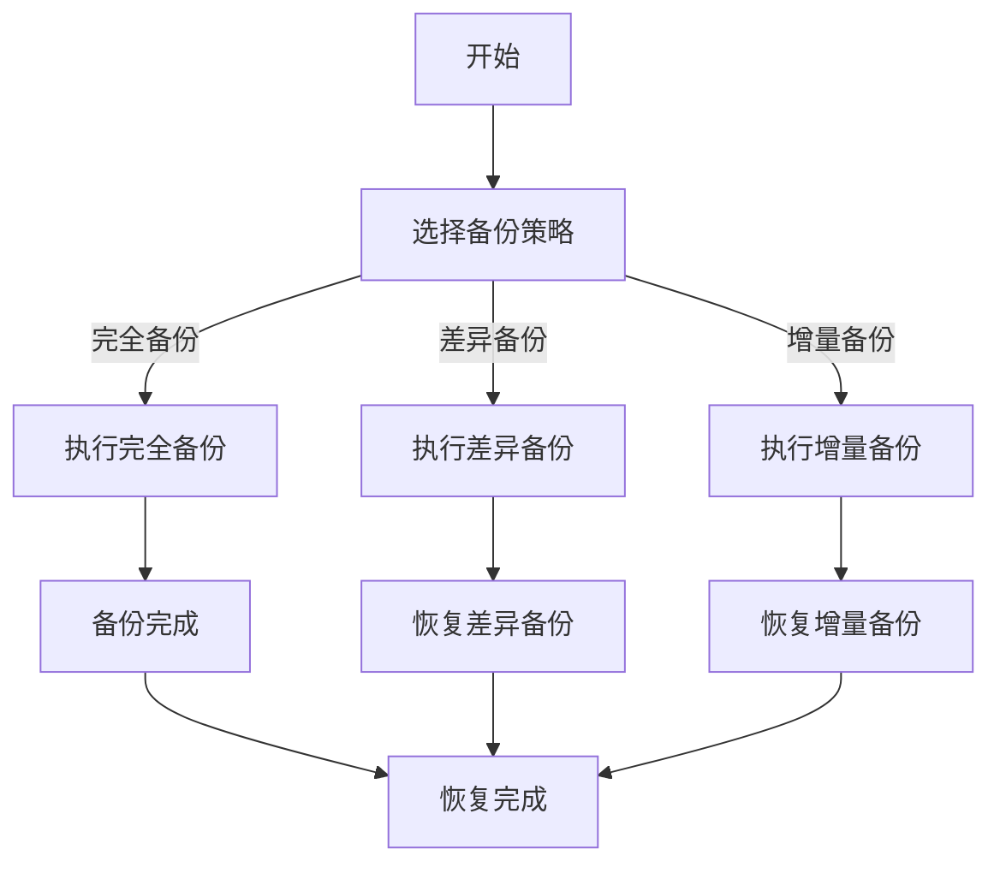
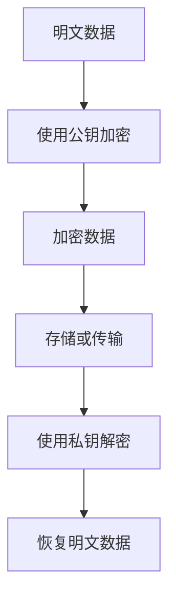
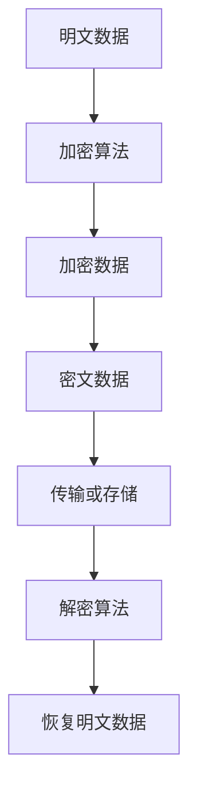
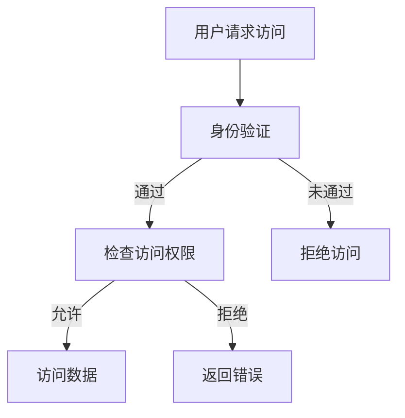
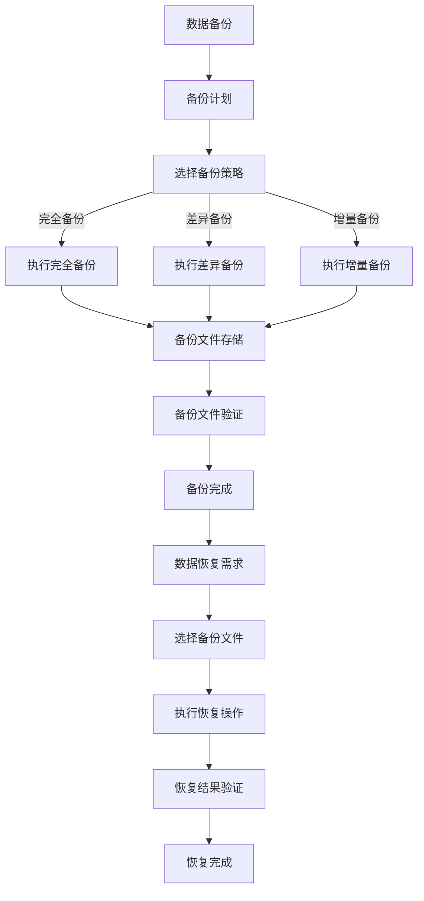
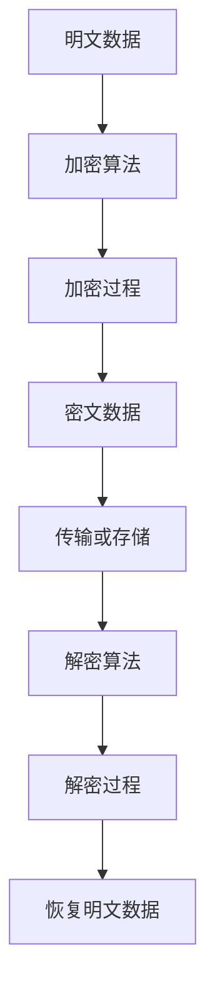
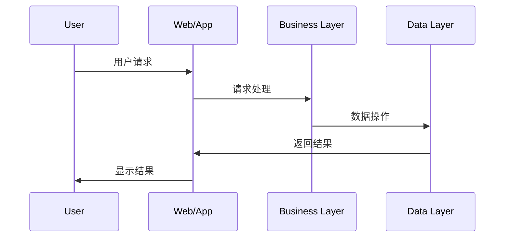
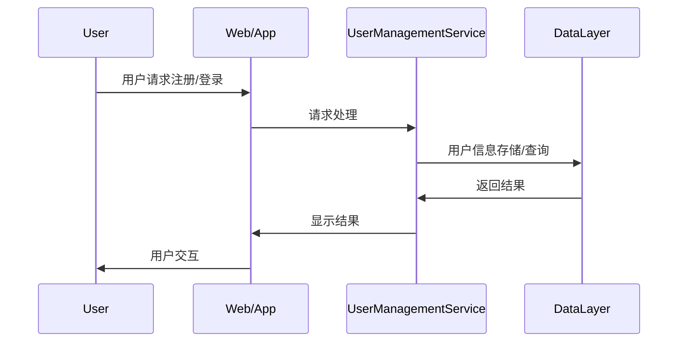
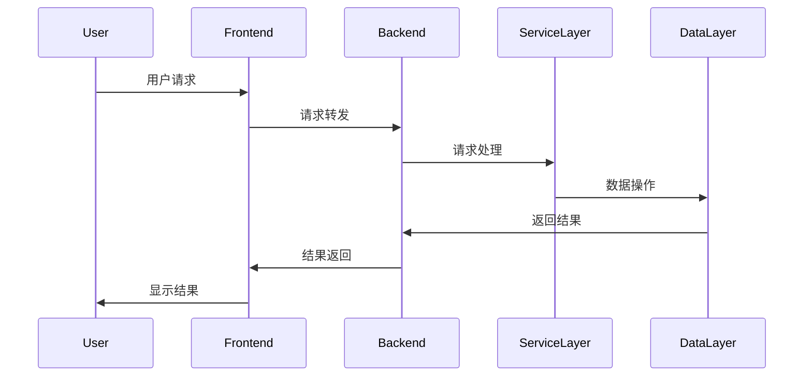
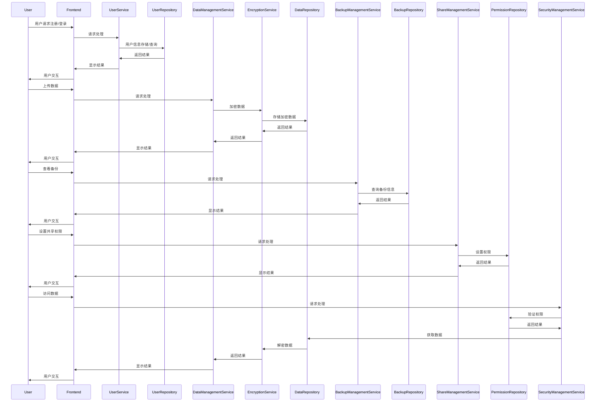

                 

### 《数字时代的记忆保存：个人数字遗产的管理策略》

#### 关键词
- 数字遗产
- 记忆保存
- 数据安全
- 数据备份
- 加密技术

#### 摘要
在数字化浪潮席卷全球的今天，个人数字遗产的保存与管理变得愈发重要。本文将探讨数字时代的记忆保存问题，详细解析个人数字遗产的管理策略，包括数据安全、备份与恢复、加密技术等多个方面。通过系统分析与实战案例，为读者提供实用的指导和建议，帮助他们在数字时代中妥善管理个人数字遗产，确保珍贵记忆得以长久保存。

### 目录大纲设计思路

为了更好地引导读者深入理解“数字时代的记忆保存：个人数字遗产的管理策略”这一主题，我们设计了如下目录大纲：

1. **引言**：介绍数字时代的背景和记忆保存的重要性，明确个人数字遗产的概念及其影响，阐述管理个人数字遗产的挑战。
2. **核心概念与联系**：详细阐述与数字遗产管理相关的核心概念，如数据安全、数据备份、数据加密等，通过对比表格和实体关系图展示概念之间的关系。
3. **算法原理讲解**：讲解数据备份与恢复策略、数据加密技术等算法原理，使用mermaid流程图和Python源代码辅助理解。
4. **系统分析与架构设计方案**：分析个人数字遗产管理系统需求，介绍系统功能设计、系统架构设计、系统接口设计及系统交互流程。
5. **项目实战**：通过实际项目展示个人数字遗产管理的实现，包括环境安装、核心代码实现、代码应用解读与分析、实际案例分析。
6. **最佳实践 tips**、**小结**、**注意事项**和**拓展阅读**等内容，为读者提供进一步的指导和建议。

### 目录大纲

```markdown
----------------------------------------------------------------
# 第一部分：引言

## 1.1 数字时代的记忆保存
### 1.1.1 数字时代下的信息革命
### 1.1.2 记忆保存的重要性
### 1.1.3 个人数字遗产的概念

## 1.2 个人数字遗产的范围与影响
### 1.2.1 个人数字遗产的定义
### 1.2.2 个人数字遗产的种类
### 1.2.3 个人数字遗产的影响

## 1.3 管理个人数字遗产的挑战
### 1.3.1 数据安全和隐私问题
### 1.3.2 数据备份与恢复策略
### 1.3.3 法律与伦理问题

## 1.4 本书结构与目标
### 1.4.1 目录结构概述
### 1.4.2 阅读指引
### 1.4.3 学习目标

----------------------------------------------------------------

# 第二部分：核心概念与联系

## 2.1 数字遗产的定义与特征
### 2.1.1 数字遗产的定义
### 2.1.2 数字遗产的特征
### 2.1.3 数字遗产的分类

## 2.2 数据安全与隐私
### 2.2.1 数据安全的定义
### 2.2.2 数据隐私的定义
### 2.2.3 数据安全与隐私的对比表格

## 2.3 数字遗产管理中的核心概念
### 2.3.1 数据备份与恢复
### 2.3.2 数据加密
### 2.3.3 数据访问控制
### 2.3.4 数字遗产管理的ER实体关系图

----------------------------------------------------------------

## 3.1 数据备份与恢复策略
### 3.1.1 备份策略的种类
#### 3.1.1.1 完全备份
#### 3.1.1.2 差异备份
#### 3.1.1.3 增量备份
### 3.1.2 恢复策略与流程
### 3.1.3 备份与恢复的技术细节
### 3.1.4 数据备份与恢复的mermaid流程图

----------------------------------------------------------------

## 4.2 数据加密技术
### 4.2.1 对称加密算法
#### 4.2.1.1 DES
#### 4.2.1.2 AES
### 4.2.2 非对称加密算法
#### 4.2.2.1 RSA
#### 4.2.2.2 ECC
### 4.2.3 密码学基础与Python实现示例
### 4.2.4 数据加密的mermaid流程图

----------------------------------------------------------------

## 5.1 系统分析与架构设计

## 5.2 个人数字遗产管理系统的功能设计
### 5.2.1 用户注册与登录
### 5.2.2 数据上传与加密
### 5.2.3 数据备份与恢复
### 5.2.4 数据共享与访问控制
### 5.2.5 系统安全与隐私保护

## 5.3 系统架构设计
### 5.3.1 整体架构
### 5.3.2 系统模块划分
### 5.3.3 系统接口设计
### 5.3.4 系统交互流程

----------------------------------------------------------------

* 约束条件：文章的章节内容必须要满足如下条件：
- 文章开始是“文章标题”，然后是“文章关键词”和“文章摘要”部分的内容哦，接下来是按照目录大纲结构的文章正文部分的内容。
- 文章字数要求：文章字数在 10000 ～ 12000 字左右。
- 格式要求：文章内容使用markdown格式输出。 
- 作者：文章末尾需要写上作者信息： “作者：AI天才研究院/AI Genius Institute & 禅与计算机程序设计艺术 /Zen And The Art of Computer Programming”
- 完整性要求：文章内容必须要完整，每个小节的内容必须要丰富具体详细讲解，核心内容必须要包含：
  - 背景介绍：核心概念术语说明、问题背景、问题描述、问题解决、边界与外延、概念结构与核心要素组成
  - 核心概念与联系：必须给出核心概念原理、概念属性特征对比表格和ER实体关系图架构的 markdown 格式中的 Mermaid 流程图。
  - 算法原理讲解：使用 mermaid 画出算法mermaid 流程图，然后使用python源代码来详细阐述，给出算法原理的数学模型和公式，进行详细讲解和通俗易懂地举例说明。
  - 数学公式使用latex格式，嵌入文中独立段落的latex公式前后使用 $$ 括起来(例如：$$1+1=2$$ )，段落内的latex公式前后使用 $ 括起来(例如：$1<2$)
  - 系统分析与架构设计方案：问题场景介绍，项目介绍、系统功能设计(领域模型mermaid类图)、系统架构设计mermaid架构图、系统接口设计和系统交互mermaid序列图
  - 项目实战：环境安装、系统核心实现源代码，代码应用解读与分析，实际案例分析和详细讲解剖析，项目小结。
  - 最佳实践 tips、小结、注意事项、拓展阅读等内容
----------------------------------------------------------------

## 1.1 数字时代的记忆保存

### 1.1.1 数字时代下的信息革命

随着互联网的普及和信息技术的发展，我们正身处一个信息爆炸的时代。数字技术的迅猛发展改变了人们的生活方式，信息的生成、传输、存储和消费都呈现出前所未有的规模和速度。这一变化被称为“数字时代”，其核心特征是信息数字化和数字化信息的管理。

信息数字化是指将文字、图像、声音等不同形式的信息转化为计算机可以处理的数字形式。这个过程大大提高了信息的可处理性和可存储性，同时也为大数据分析、人工智能等技术的发展奠定了基础。数字化信息的管理则涉及如何高效、安全地存储、处理和共享这些信息。

### 1.1.2 记忆保存的重要性

在数字时代，记忆的保存变得尤为重要。传统的记忆保存主要依靠书籍、照片和手写笔记等物理媒介，这些媒介在保存过程中易受损坏、丢失或无法共享。而数字媒介则提供了更加可靠、持久和易于共享的解决方案。

首先，数字媒介具有更高的可靠性和持久性。通过现代存储技术，如磁盘、光盘和云存储，我们可以将大量数据长期保存，并确保数据的完整性和可访问性。此外，数字媒介还具有高度的共享性，使得个人记忆可以轻松与他人分享，进一步扩展了记忆的价值和影响力。

其次，数字记忆保存有助于个人和社会的传承。个人可以通过数字形式保存自己的回忆、经验和知识，这些记忆不仅对自己具有深远的情感价值，也为后代提供了宝贵的文化遗产。从更广泛的角度来看，数字记忆保存有助于社会记忆的构建，为历史研究和文化传承提供了重要的资源。

### 1.1.3 个人数字遗产的概念

个人数字遗产是指在数字化过程中，个人生成的、拥有或使用的数据集合，这些数据可以是文字、图片、音频、视频等多种形式。个人数字遗产不仅包括个人创作的数字内容，如文档、电子书籍、音乐、视频等，还包括个人与数字世界的交互记录，如社交媒体帖子、电子邮件、网络浏览历史等。

个人数字遗产的范围非常广泛，涵盖了生活中的各个方面。以下是一些常见的个人数字遗产种类：

1. **文档与电子书籍**：包括个人撰写的文档、报告、论文以及购买的电子书籍。
2. **图片与视频**：包括个人拍摄的照片、视频，以及从互联网下载的图片和视频。
3. **音频**：包括个人录制的声音文件、音频书籍等。
4. **社交媒体内容**：包括个人在社交媒体平台上发布的帖子、评论、照片等。
5. **电子邮件**：包括个人收发的电子邮件记录。
6. **应用程序与配置文件**：包括个人使用电脑或移动设备时安装的应用程序及其配置文件。
7. **网络账号与密码**：包括个人在网络服务提供商处注册的账号和密码。

个人数字遗产的管理不仅仅是对这些数字内容的保存，还包括对这些内容的访问控制、备份与恢复、安全防护等方面。有效的个人数字遗产管理策略可以确保这些珍贵记忆在数字时代中得到妥善保存，并能够持续为个人和社会带来价值。

### 1.2 个人数字遗产的范围与影响

#### 1.2.1 个人数字遗产的定义

个人数字遗产指的是在数字化进程中，由个人生成、拥有或使用的各类数据和信息，这些数据可以是静态的文档、图片、音频、视频，也可以是动态的社交媒体帖子、电子邮件、应用程序数据等。个人数字遗产不仅包括了数字化的个人创作成果，还涵盖了个人在网络世界中留下的痕迹，如网络账号信息、浏览记录等。

#### 1.2.2 个人数字遗产的种类

个人数字遗产种类繁多，根据其形态和用途，大致可以分为以下几类：

1. **文档与电子书籍**：个人撰写的文档、报告、论文以及购买的电子书籍等。
2. **图片与视频**：个人拍摄的照片、视频，以及从互联网下载的图片和视频文件。
3. **音频**：个人录制的音频文件、音频书籍等。
4. **社交媒体内容**：个人在社交媒体平台上发布的帖子、评论、照片等。
5. **电子邮件**：个人收发的电子邮件记录。
6. **应用程序与配置文件**：个人在电脑或移动设备上安装的应用程序及其配置文件。
7. **网络账号与密码**：个人在网络服务提供商处注册的账号和密码。

#### 1.2.3 个人数字遗产的影响

个人数字遗产在现代社会中扮演着至关重要的角色，其影响可以从以下几个方面进行探讨：

1. **文化遗产的保存**：个人数字遗产为个人和后代提供了宝贵的文化遗产，使其能够记录和传承个人的生活经历、知识和智慧。
2. **隐私保护**：随着个人数字遗产的积累，个人隐私保护问题日益突出。未经授权的访问和泄露可能导致个人隐私受到侵犯，给个人带来困扰。
3. **数据安全**：个人数字遗产的安全性问题不容忽视。如果数据丢失、损坏或被篡改，不仅会影响个人生活的便利性，还可能导致严重后果，如经济损失、名誉损害等。
4. **社交互动**：个人数字遗产也是社交媒体互动的一部分，这些内容反映了个人在网络世界中的社交行为和人际关系，对个人的社交圈子和网络影响力有重要影响。
5. **法律问题**：个人数字遗产涉及版权、隐私、身份验证等多个法律领域，如何合法、合规地管理和保护个人数字遗产成为了一个亟待解决的问题。

#### 1.2.4 个人数字遗产的重要性

个人数字遗产的重要性体现在多个方面：

1. **情感价值**：数字化的记忆保存使得个人能够更加方便地回顾过去的经历，重温情感体验，对于维护心理健康和情感平衡具有积极作用。
2. **知识传承**：个人数字遗产记录了个人学习和工作过程中的知识积累，有助于知识的传承和延续。
3. **生活便利**：通过数字化的方式保存重要信息，如医疗记录、财务报表等，有助于提高个人生活的便利性和效率。
4. **社会参与**：个人数字遗产可以作为社会互动的一部分，促进社会参与和交流，增强社会凝聚力。

### 1.3 管理个人数字遗产的挑战

随着个人数字遗产的日益增加，如何有效地管理这些遗产成为一个重要的课题。以下从数据安全、隐私保护、备份与恢复以及法律与伦理问题等方面探讨管理个人数字遗产所面临的挑战。

#### 1.3.1 数据安全和隐私问题

在数字时代，数据安全和隐私问题是个人数字遗产管理中最为突出的挑战之一。首先，数据安全面临的主要威胁包括数据泄露、数据篡改和数据丢失等。数据泄露可能导致个人敏感信息被不法分子利用，造成经济损失和声誉损害。数据篡改则可能破坏数据的完整性和真实性，影响个人生活的各个方面。数据丢失则是由于硬件故障、人为错误或自然灾害等原因导致的，这可能导致重要信息无法恢复，对个人产生长期影响。

隐私保护方面，个人数字遗产中包含大量涉及个人隐私的信息，如身份信息、通讯记录、健康记录等。这些信息一旦泄露，可能会被用于非法活动，如身份盗用、网络欺诈等。因此，如何确保个人数字遗产中的隐私信息不被非法获取和滥用，成为数字遗产管理的重要任务。

#### 1.3.2 数据备份与恢复策略

数据备份是确保个人数字遗产安全的重要手段。备份策略的选择直接影响数据恢复的速度和完整性。常见的备份策略包括完全备份、差异备份和增量备份。

- **完全备份**：复制所有数据，确保在数据丢失或损坏时可以完全恢复。完全备份的缺点是占用存储空间较大，且备份过程较耗时。
- **差异备份**：仅复制自上次完全备份后发生变化的数据，相较于完全备份，差异备份占用更少的存储空间，但恢复时需要先恢复完全备份，再应用差异备份。
- **增量备份**：仅复制自上次备份后发生变化的数据，这种策略的存储空间占用最少，但恢复时需要逐个应用每次增量备份，过程相对复杂。

备份与恢复策略的选择需要考虑数据的重要性、备份的频率、存储空间等因素。同时，备份过程中还需确保数据的安全性，防止备份过程中数据被篡改或泄露。

#### 1.3.3 法律与伦理问题

个人数字遗产管理还涉及到法律和伦理问题。首先，关于数字遗产的继承和转移，现行法律法规尚不完善，许多国家和地区还未明确规定数字遗产的继承权。这可能导致在遗产继承过程中出现纠纷。

其次，数字遗产涉及的数据安全和隐私保护问题也引发了伦理讨论。如何在保护个人隐私的同时，合理利用个人数字遗产，是一个复杂的伦理问题。例如，社交媒体平台在用户去世后如何处理其账户，是否应该允许亲友访问和修改这些内容，都是需要考虑的伦理问题。

此外，个人数字遗产的备份和恢复也可能涉及法律问题。例如，未经授权访问他人数字遗产，可能构成侵犯隐私或盗窃行为。因此，在管理个人数字遗产时，需要严格遵守相关法律法规，确保合法合规。

#### 1.3.4 挑战与解决方案

面对数据安全、隐私保护、备份与恢复以及法律与伦理问题，以下是一些潜在的解决方案：

1. **数据加密**：通过数据加密技术，确保个人数字遗产在传输和存储过程中的安全性。常用的加密算法包括对称加密和非对称加密，如AES和RSA。
2. **备份策略**：制定科学合理的备份策略，确保在数据丢失或损坏时能够快速恢复。例如，定期进行完全备份，同时保留差异备份和增量备份。
3. **隐私保护**：通过访问控制和隐私设置，限制对个人数字遗产的访问，确保隐私信息不被非法获取和滥用。
4. **法律完善**：推动相关法律法规的制定和完善，明确数字遗产的继承权和隐私保护权，为个人数字遗产管理提供法律依据。
5. **伦理指导**：在数字遗产管理中，遵循伦理原则，尊重个人隐私和意愿，确保数字遗产的合法、合规使用。

通过这些解决方案，我们可以更好地应对管理个人数字遗产所面临的挑战，确保数字时代的记忆得以安全、长久地保存。

### 1.4 本书结构与目标

#### 1.4.1 目录结构概述

本书分为五个主要部分，结构清晰，旨在帮助读者系统地了解个人数字遗产的管理策略。

1. **引言**：介绍数字时代下的记忆保存问题，定义个人数字遗产，并阐述其重要性。
2. **核心概念与联系**：阐述与数字遗产管理相关的核心概念，如数据安全、备份与恢复、加密技术，并展示这些概念之间的联系。
3. **算法原理讲解**：详细讲解数据备份与恢复策略、数据加密技术等，通过mermaid流程图和Python代码示例，帮助读者深入理解。
4. **系统分析与架构设计**：分析个人数字遗产管理系统需求，介绍系统功能设计、架构设计、接口设计及交互流程。
5. **项目实战**：通过实际项目展示个人数字遗产管理的实现，包括环境安装、核心代码实现、案例分析及项目小结。

#### 1.4.2 阅读指引

为了更好地理解本书内容，我们建议读者按照以下顺序阅读：

1. **引言**：初步了解数字时代的记忆保存问题和个人数字遗产的概念。
2. **核心概念与联系**：深入学习与数字遗产管理相关的核心概念，建立概念框架。
3. **算法原理讲解**：通过具体算法和示例，深化对数据备份与恢复、加密技术的理解。
4. **系统分析与架构设计**：了解系统设计与实现细节，为实际应用打下基础。
5. **项目实战**：结合实际项目，巩固所学知识，掌握个人数字遗产管理的具体操作。

#### 1.4.3 学习目标

通过本书的学习，读者将能够：

1. **理解数字时代的记忆保存问题**：认识到数字时代下记忆保存的重要性，掌握个人数字遗产的概念和范围。
2. **掌握核心概念与联系**：深入了解数据安全、备份与恢复、加密技术等核心概念，并能将其应用于实际场景。
3. **掌握算法原理**：掌握数据备份与恢复策略、数据加密技术的原理，并通过Python代码实现相关算法。
4. **分析系统需求与设计**：能够分析个人数字遗产管理系统的需求，设计系统功能、架构和接口。
5. **实施个人数字遗产管理**：通过实际项目，掌握个人数字遗产管理的具体实现过程，具备实际操作能力。

### 2.1 数字遗产的定义与特征

#### 2.1.1 数字遗产的定义

数字遗产是指在数字化过程中，个人或组织生成的、拥有或使用的各类数据和信息。这些数据和信息包括但不限于文档、图片、视频、音频、电子邮件、应用程序以及网络账户等。数字遗产不仅是个人和组织的数字化记忆，也是他们数字化生活和工作的真实写照。

数字遗产与物理遗产相比，具有显著的差异。物理遗产通常是指实物遗产，如文物、艺术品、房产等，它们具有物质形态，可以触摸和感知。而数字遗产则是一种无形的、数字化的存在，它无法直接触摸，但通过电子设备可以访问和查看。

#### 2.1.2 数字遗产的特征

数字遗产具有以下几个显著特征：

1. **数字化**：数字遗产以数字形式存在，即由0和1组成的数据。这使得数字遗产易于存储、传输和共享，同时也便于通过计算机技术进行处理和分析。
   
2. **可访问性**：数字遗产可以随时通过互联网或其他数字渠道进行访问，不受地理和时间的限制。这一点与物理遗产形成了鲜明对比，后者往往需要特定的地点和时间才能访问。

3. **持久性**：尽管数字遗产的存储介质（如磁盘、光盘、云存储等）可能会发生损坏，但通过适当的备份和存储策略，数字遗产可以长期保存，实现永久保存的目标。

4. **共享性**：数字遗产易于分享和传播，个人可以轻松地将其数字作品、信息或数据分享给他人，进一步扩大其影响和传播范围。

5. **动态性**：数字遗产不仅是静态的存储信息，还可以是动态的内容，如社交媒体帖子、博客文章等，这些内容可以实时更新和互动。

#### 2.1.3 数字遗产的分类

数字遗产可以根据其内容和用途进行分类，以下是几种常见的分类方式：

1. **按内容分类**：
   - **个人创作内容**：如文档、电子书籍、音乐、视频等。
   - **个人交互记录**：如电子邮件、社交媒体帖子、网络浏览历史等。
   - **数字设备配置文件**：如电脑、手机等设备的配置文件和应用程序数据。

2. **按用途分类**：
   - **日常生活相关**：如照片、视频记录的家庭生活、旅行经历等。
   - **工作和学习相关**：如工作文档、研究论文、项目记录等。
   - **社交互动相关**：如社交媒体账户、网络论坛帖子等。

3. **按存储介质分类**：
   - **本地存储**：如电脑硬盘、U盘、移动硬盘等。
   - **远程存储**：如云存储、网络服务器等。

#### 2.1.4 数字遗产与传统遗产的对比

数字遗产与传统遗产在多个方面存在差异：

1. **存储形式**：传统遗产主要依靠物理媒介进行存储，如纸张、木雕、石碑等。而数字遗产则是以数字形式存储，依赖于电子设备和技术。

2. **保存难度**：传统遗产容易受到自然因素（如火灾、水灾、虫蛀等）的影响，而数字遗产虽然也面临技术过时和损坏的风险，但通过适当的数据备份和存储策略，可以大大提高其保存难度。

3. **访问方式**：传统遗产通常需要到特定地点进行访问，而数字遗产可以通过互联网和电子设备随时随地访问。

4. **共享与传播**：传统遗产的共享和传播相对困难，而数字遗产则具有更高的共享性和传播性，可以通过网络快速分享和传播。

通过以上分析，我们可以看到数字遗产在形式、保存难度、访问方式和共享传播等方面与传统遗产有着显著的不同。随着数字化进程的不断推进，数字遗产的重要性将愈发凸显，如何有效地管理和保护数字遗产成为一个亟待解决的重要课题。

### 2.2 数据安全与隐私

#### 2.2.1 数据安全的定义

数据安全是指保护数据免受未经授权的访问、篡改、泄露、破坏或丢失的措施和方法。数据安全的目标是确保数据的机密性、完整性和可用性，从而保障数据在存储、传输和处理过程中的安全。

数据安全的重要性不言而喻。随着数字化时代的到来，数据已成为现代社会的重要资源，涉及个人隐私、商业秘密、国家安全等多个领域。一旦数据安全受到威胁，可能导致以下严重后果：

1. **隐私泄露**：未经授权的访问可能导致个人敏感信息的泄露，如身份证号、银行账号、医疗记录等，对个人隐私造成严重侵害。
2. **经济损失**：企业或个人数据的泄露可能导致财务损失，如盗窃资金、信用欺诈等。
3. **名誉损害**：数据泄露可能对个人或企业的声誉造成长期损害，影响其商业运营和社会地位。
4. **法律风险**：许多国家和地区对数据安全有严格的法律规定，数据泄露可能引发法律责任和监管处罚。

#### 2.2.2 数据隐私的定义

数据隐私是指个人或组织在数字化过程中，对其数据访问、使用和共享的控制权。数据隐私强调的是个人对其数据的知情权和选择权，确保个人在数据产生、传输和处理过程中能够自主决定其数据的用途和公开范围。

数据隐私的重要性体现在以下几个方面：

1. **个人信息保护**：数据隐私保护有助于保护个人敏感信息，防止其被滥用或非法使用。
2. **用户信任**：确保数据隐私可以增强用户对数字服务的信任，提高用户满意度。
3. **社会责任**：作为数字时代的参与者和建设者，个人和组织有责任确保其数据处理活动符合道德和法律规范，尊重和保护数据隐私。
4. **商业合规**：许多国家和地区对数据隐私保护有严格的法律要求，确保数据隐私可以避免企业面临法律风险和监管处罚。

#### 2.2.3 数据安全与隐私的对比表格

以下是一个对比表格，展示了数据安全与数据隐私之间的异同点：

| 对比项          | 数据安全                                  | 数据隐私                                  |
|----------------|----------------------------------------|----------------------------------------|
| 定义           | 保护数据免受未授权访问、篡改、泄露、破坏或丢失       | 确保个人对其数据的访问、使用和共享具有控制权       |
| 目标           | 保证数据的机密性、完整性和可用性                   | 保护个人敏感信息的隐私权，确保数据的合法和合规使用  |
| 主要关注点      | 防止外部攻击、数据泄露、恶意软件等                     | 确保个人信息的保密性、真实性、完整性、及时性和可用性  |
| 应用场景        | 数据存储、传输、处理等各个环节                           | 个人信息收集、处理、存储、共享等各个环节           |
| 实施手段        | 加密、防火墙、入侵检测、备份与恢复等                     | 隐私政策、访问控制、数据脱敏、数据加密等           |
| 法律地位        | 数据安全是法定义务，不遵守可能导致法律责任                 | 数据隐私是个人权利，违反可能引发法律纠纷和监管处罚  |

#### 2.2.4 数据安全与隐私的联系

数据安全和隐私虽然有不同的定义和目标，但它们在数字遗产管理中紧密相连，互为支撑：

1. **数据安全是实现数据隐私的基础**：只有确保数据安全，才能避免数据被非法访问、篡改或泄露，从而保护个人隐私。
2. **数据隐私是数据安全的重要考量**：在设计和实施数据安全措施时，需要充分考虑数据隐私的需求，确保个人对其数据的控制权和知情权。

在实际应用中，数据安全和隐私保护需要共同发力，才能有效地管理和保护个人数字遗产：

- **制定全面的隐私政策**：组织和个人应制定详细的隐私政策，明确数据收集、使用、存储和共享的目的、方式、范围和期限，确保个人对其数据的知情权和选择权。
- **采用加密技术**：通过数据加密技术，确保数据在传输和存储过程中的安全性，防止数据泄露和未经授权的访问。
- **实施严格的访问控制**：通过访问控制机制，确保只有授权人员才能访问敏感数据，防止内部泄露和滥用。
- **定期审计和风险评估**：定期进行数据安全和隐私保护的审计和风险评估，及时发现和解决潜在的安全隐患。
- **法律法规遵循**：严格遵守相关法律法规，确保数字遗产管理活动合法合规。

通过这些措施，我们可以在数字时代中更好地管理和保护个人数字遗产，确保数据安全与隐私得到有效保障。

### 2.3 数字遗产管理中的核心概念

#### 2.3.1 数据备份与恢复

数据备份与恢复是数字遗产管理中的关键环节，旨在确保在数据丢失或损坏时能够及时恢复，保护数据的完整性和可用性。

**数据备份**是指将重要数据复制到其他存储介质上，以防止原始数据因硬件故障、软件错误、恶意攻击或自然灾害等原因丢失。常见的备份策略包括完全备份、差异备份和增量备份。

1. **完全备份**：复制所有数据，以确保在数据丢失时可以完全恢复。完全备份的优点是简单易行，但缺点是占用大量存储空间，且备份时间长。
2. **差异备份**：仅复制自上次完全备份后发生变化的数据。差异备份占用的存储空间较小，但恢复时需要先恢复完全备份，再应用差异备份。
3. **增量备份**：仅复制自上次备份后发生变化的数据。增量备份占用的存储空间最小，但恢复时需要逐个应用每次增量备份，过程相对复杂。

**数据恢复**是指从备份中提取数据，使其恢复到原始状态的过程。数据恢复的步骤通常包括：

1. **确定备份介质**：找到存储备份数据的介质，如磁盘、光盘、云存储等。
2. **选择备份文件**：根据需要恢复的数据类型和备份策略，选择相应的备份文件。
3. **执行恢复操作**：通过备份软件或手动操作，将备份文件恢复到原始位置或新的位置。

**数据备份与恢复的技术细节**：

1. **备份软件**：市面上有许多备份软件，如Acronis、Backup and Restore、Carbonite等，这些软件提供了简便的备份和恢复功能。
2. **云备份**：云备份是将数据存储在远程服务器上，具有高效、便捷和安全的优点。常见的云备份服务包括Google Drive、Dropbox、iCloud等。
3. **备份硬件**：备份硬件包括外部硬盘、USB闪存盘、光盘等，可用于存储备份文件。

**备份与恢复的mermaid流程图**：



#### 2.3.2 数据加密

数据加密是确保数据在传输和存储过程中安全性的重要手段，通过将明文数据转换为密文，防止未经授权的访问和泄露。

**数据加密技术**包括对称加密和非对称加密两种：

1. **对称加密**：使用相同的密钥对数据进行加密和解密，如DES、AES等。对称加密的优点是加密速度快，但密钥分发和管理较为复杂。
2. **非对称加密**：使用一对密钥（公钥和私钥）进行加密和解密，公钥加密，私钥解密，如RSA、ECC等。非对称加密的优点是解决了密钥分发问题，但加密和解密速度相对较慢。

**数据加密的mermaid流程图**：



**密码学基础与Python实现示例**：

Python中可以使用`cryptography`库进行数据加密和解密。

```python
from cryptography.fernet import Fernet

# 生成密钥
key = Fernet.generate_key()
cipher_suite = Fernet(key)

# 加密数据
message = "这是一条秘密消息"
encrypted_message = cipher_suite.encrypt(message.encode())

# 解密数据
decrypted_message = cipher_suite.decrypt(encrypted_message).decode()
print(decrypted_message)
```

**数据加密的mermaid流程图**：



#### 2.3.3 数据访问控制

数据访问控制是确保只有授权用户才能访问特定数据的一种机制，通过限制用户对数据的访问权限，保护数据的安全性。

**数据访问控制技术**包括：

1. **基于角色的访问控制（RBAC）**：根据用户角色分配访问权限，角色与权限之间的关系由管理员定义。
2. **基于属性的访问控制（ABAC）**：根据用户属性（如部门、职位、权限等级等）以及数据属性（如敏感度、访问时间等）进行访问控制。
3. **访问控制列表（ACL）**：为每个数据对象定义访问权限，包括允许访问的用户和组。

**数据访问控制的mermaid流程图**：



#### 2.3.4 数字遗产管理的ER实体关系图

实体关系图（Entity-Relationship Diagram，ERD）是描述系统中数据实体及其相互关系的一种图形表示方法，用于展示数字遗产管理系统中各数据实体之间的关系。

以下是一个简化的数字遗产管理系统的ERD示例：

```mermaid
erDiagram
    用户 ||--|{ 数据 }|| : 属于
    数据 ||--|{ 备份 }|| : 存储
    数据 ||--|{ 加密 }|| : 加密
    用户 ||--|{ 访问日志 }|| : 访问
```

在此ERD中：

- **用户**：代表数字遗产管理系统的用户。
- **数据**：代表用户生成的各类数据，包括文档、图片、视频等。
- **备份**：记录数据的备份信息，包括备份时间、备份位置等。
- **加密**：记录数据的加密信息，包括加密算法、密钥等。
- **访问日志**：记录用户对数据的访问操作，包括访问时间、访问类型等。

通过ERD，可以清晰地展示数字遗产管理系统中各数据实体之间的关联关系，为系统设计和实现提供基础。

### 3.1 数据备份与恢复策略

数据备份与恢复策略是确保个人数字遗产在遭受数据丢失或损坏时能够得到及时修复的关键措施。合理的备份策略不仅能确保数据的完整性和可用性，还能减少数据恢复的时间和成本。

#### 3.1.1 备份策略的种类

常见的备份策略包括完全备份、差异备份和增量备份。

1. **完全备份**：完全备份是指复制所有数据，包括最新的数据和之前未发生变化的数据。这种策略的优点是数据恢复简单，可以快速恢复到备份时的状态。缺点是备份文件大，备份时间长，且需要定期进行完全备份，占用大量存储空间。

2. **差异备份**：差异备份仅复制自上次完全备份后发生变化的数据。这种策略相较于完全备份，备份文件较小，备份时间较短。但恢复时需要先恢复完全备份，再应用差异备份，过程相对复杂。

3. **增量备份**：增量备份仅复制自上次备份后发生变化的数据。这种策略备份文件最小，备份时间最短，但恢复时需要逐个应用每次增量备份，过程较为复杂。同时，如果某个增量备份损坏，可能会导致后续的备份也无法恢复。

选择合适的备份策略需要考虑数据的重要性、备份的频率、存储空间等因素。例如，对于关键业务数据，可能需要采用差异备份或完全备份，确保数据的高完整性和快速恢复能力；而对于非关键数据，可以采用增量备份，以节省存储空间和备份时间。

#### 3.1.2 恢复策略与流程

数据恢复策略是在数据丢失或损坏时，从备份中提取数据并恢复到原始状态的方法。恢复流程通常包括以下步骤：

1. **确定备份介质**：找到存储备份数据的介质，如外部硬盘、云存储等。
2. **选择备份文件**：根据需要恢复的数据类型和备份策略，选择相应的备份文件。
3. **执行恢复操作**：通过备份软件或手动操作，将备份文件恢复到原始位置或新的位置。

数据恢复的具体步骤如下：

1. **检查备份文件**：在备份介质中查找备份文件，确保备份文件的完整性和有效性。
2. **选择恢复范围**：确定需要恢复的数据范围，如单个文件、文件夹或整个系统。
3. **开始恢复操作**：执行恢复操作，将备份文件恢复到指定位置。
4. **验证恢复结果**：检查恢复后的数据是否完整、可用，确保恢复过程成功。

不同的备份策略在恢复过程中可能有所不同。例如，完全备份的恢复过程较为简单，只需将备份文件恢复到原始位置即可；而差异备份和增量备份的恢复过程则可能需要先恢复完全备份，再应用差异备份或增量备份。

#### 3.1.3 备份与恢复的技术细节

备份与恢复的技术细节包括备份软件、备份介质和恢复工具等方面。

1. **备份软件**：市面上有许多备份软件，如Acronis、Backup and Restore、Carbonite等，这些软件提供了简便的备份和恢复功能。一些常见的备份软件功能包括：

   - **备份计划**：设置自动备份计划，定期备份重要数据。
   - **备份存储**：支持多种备份存储方式，如本地硬盘、外部硬盘、云存储等。
   - **备份压缩**：对备份文件进行压缩，节省存储空间。
   - **备份加密**：对备份文件进行加密，确保数据在传输和存储过程中的安全性。

2. **备份介质**：备份介质是存储备份文件的地方，常见的备份介质包括：

   - **外部硬盘**：便携式硬盘，可以随时携带和访问。
   - **网络存储**：如NAS（网络附加存储），可提供共享存储空间和冗余备份。
   - **云存储**：如Google Drive、Dropbox、iCloud等，具有高效、便捷和安全的优点。

3. **恢复工具**：恢复工具用于从备份文件中提取数据并恢复到原始位置。常见的恢复工具有：

   - **备份软件自带恢复功能**：如Acronis True Image、Backup and Restore等，提供了简便的恢复操作。
   - **第三方恢复工具**：如Recuva、EaseUS Data Recovery Wizard等，提供了强大的恢复功能和灵活的恢复选项。

#### 3.1.4 数据备份与恢复的mermaid流程图

以下是一个数据备份与恢复的mermaid流程图：



在此流程图中，数据备份过程包括备份计划、选择备份策略、执行备份操作、备份文件存储和备份文件验证等步骤；数据恢复过程包括数据恢复需求、选择备份文件、执行恢复操作和恢复结果验证等步骤。

### 4.2 数据加密技术

数据加密技术是确保数据在传输和存储过程中的安全性，防止未经授权的访问和泄露的重要手段。数据加密技术主要包括对称加密算法和非对称加密算法两种类型。每种加密算法都有其独特的原理和用途。

#### 4.2.1 对称加密算法

对称加密算法使用相同的密钥对数据进行加密和解密。这种算法的加密速度快，适合加密大量数据，但密钥的传输和分发是一个难题。

**常用对称加密算法**：

1. **DES（数据加密标准）**：DES是一种经典的对称加密算法，使用56位密钥对数据进行加密。虽然DES已经不再安全，但其历史地位不可忽视。

2. **AES（高级加密标准）**：AES是目前最广泛使用的对称加密算法，支持128、192和256位密钥长度，具有较高的安全性和效率。

**AES算法原理**：

AES加密过程包括初始置换（Initial Permutation）、轮加密（Round Encryption）和最终置换（Final Permutation）三个步骤。每个轮加密包括字节替换（SubBytes）、行移位（ShiftRows）、列混淆（MixColumns）和轮密钥加（AddRoundKey）四个操作。

**AES加密过程示例**：

```python
from Crypto.Cipher import AES
from Crypto.Util.Padding import pad, unpad
from Crypto.Random import get_random_bytes

# 生成密钥和初始化加密对象
key = get_random_bytes(16)
cipher = AES.new(key, AES.MODE_CBC)

# 加密数据
plaintext = b"明文数据"
ciphertext = cipher.encrypt(pad(plaintext, AES.block_size))

# 解密数据
cipher_dec = AES.new(key, AES.MODE_CBC, iv=cipher.iv)
decrypted_text = unpad(cipher_dec.decrypt(ciphertext), AES.block_size)

print(f"加密后数据：{ciphertext.hex()}")
print(f"解密后数据：{decrypted_text.decode()}")
```

#### 4.2.2 非对称加密算法

非对称加密算法使用一对密钥（公钥和私钥）进行加密和解密。公钥用于加密，私钥用于解密。这种算法解决了密钥分发问题，但加密和解密速度相对较慢。

**常用非对称加密算法**：

1. **RSA（Rivest-Shamir-Adleman）**：RSA是目前最常用的非对称加密算法，支持不同的密钥长度，如1024位、2048位和4096位。

2. **ECC（椭圆曲线加密）**：ECC是一种基于椭圆曲线数学原理的加密算法，具有更高的安全性和效率，适合在资源受限的环境中应用。

**RSA算法原理**：

RSA加密过程包括以下步骤：

1. **密钥生成**：选择两个大的质数p和q，计算n=p*q和φ=(p-1)*(q-1)。随机选择一个与φ互质的整数e，计算d，满足d*e ≡ 1 (mod φ)。公钥为(n, e)，私钥为(n, d)。

2. **加密**：将明文m转换为整数M，计算c ≡ M^e (mod n)。

3. **解密**：计算M ≡ c^d (mod n)。

**RSA加密示例**：

```python
from Crypto.PublicKey import RSA
from Crypto.Cipher import PKCS1_OAEP

# 生成RSA密钥
key = RSA.generate(2048)
private_key = key.export_key()
public_key = key.publickey().export_key()

# 加密数据
cipher_rsa = PKCS1_OAEP.new(RSA.import_key(public_key))
ciphertext = cipher_rsa.encrypt(b"明文数据")

# 解密数据
cipher_rsa = PKCS1_OAEP.new(RSA.import_key(private_key))
plaintext = cipher_rsa.decrypt(ciphertext)

print(f"加密后数据：{ciphertext.hex()}")
print(f"解密后数据：{plaintext.decode()}")
```

#### 4.2.3 密码学基础与Python实现示例

密码学基础包括加密算法、密钥管理、加密模式等方面。以下使用Python示例展示对称加密和非对称加密的基本实现。

**对称加密示例**：

```python
from Crypto.Cipher import AES
from Crypto.Util.Padding import pad, unpad
from Crypto.Random import get_random_bytes

# 生成密钥
key = get_random_bytes(16)

# 初始化加密对象
cipher_aes = AES.new(key, AES.MODE_CBC)

# 加密数据
plaintext = b"明文数据"
ciphertext = cipher_aes.encrypt(pad(plaintext, AES.block_size))

# 解密数据
cipher_aes = AES.new(key, AES.MODE_CBC, iv=cipher_aes.iv)
plaintext_dec = unpad(cipher_aes.decrypt(ciphertext), AES.block_size)

print(f"加密后数据：{ciphertext.hex()}")
print(f"解密后数据：{plaintext_dec.decode()}")
```

**非对称加密示例**：

```python
from Crypto.PublicKey import RSA
from Crypto.Cipher import PKCS1_OAEP

# 生成RSA密钥
key = RSA.generate(2048)
private_key = key.export_key()
public_key = key.publickey().export_key()

# 加密数据
cipher_rsa = PKCS1_OAEP.new(RSA.import_key(public_key))
plaintext = b"明文数据"
ciphertext = cipher_rsa.encrypt(plaintext)

# 解密数据
cipher_rsa = PKCS1_OAEP.new(RSA.import_key(private_key))
plaintext_dec = cipher_rsa.decrypt(ciphertext)

print(f"加密后数据：{ciphertext.hex()}")
print(f"解密后数据：{plaintext_dec.decode()}")
```

#### 4.2.4 数据加密的mermaid流程图

以下是一个数据加密的mermaid流程图，展示了数据加密和解密的过程：



在此流程图中，数据加密过程包括明文数据加密、密文数据传输和存储；解密过程包括密文数据接收、解密和数据恢复。

### 5.1 系统分析与架构设计

#### 5.1.1 问题场景介绍

在数字时代，个人数字遗产的管理成为了一个日益重要的课题。随着人们日常活动中产生的数据量不断增加，如何安全、可靠地保存和管理这些数据，已经成为个人和社会共同面临的问题。特别是在用户去世后，其数字遗产如何继承和保管，成为了家庭、法律和科技界共同关注的焦点。

本系统旨在为个人提供一套完善的数字遗产管理解决方案，确保用户的数据在一生中都能够得到妥善保存，并在用户去世后，其亲属或指定继承人能够方便地访问和继承这些数字遗产。

#### 5.1.2 项目介绍

本项目的目标是开发一个功能完备的个人数字遗产管理系统，主要包括以下功能：

1. **用户注册与登录**：用户可以通过系统注册账号，并使用密码进行登录。
2. **数据上传与加密**：用户可以将自己的数据上传到系统中，并进行加密存储，确保数据安全。
3. **数据备份与恢复**：系统提供自动备份功能，确保数据在出现意外时能够恢复。
4. **数据共享与访问控制**：用户可以设置数据共享权限，确保数据在合法范围内共享，同时保护隐私。
5. **系统安全与隐私保护**：系统采用加密技术和访问控制策略，确保数据的安全和用户隐私的保护。

#### 5.1.3 系统功能设计

为了实现上述目标，系统设计了以下主要功能模块：

1. **用户管理模块**：负责用户的注册、登录、权限管理等功能。
2. **数据管理模块**：负责数据的上传、加密、备份、恢复和共享等功能。
3. **备份管理模块**：负责自动备份、备份存储和恢复等功能。
4. **安全控制模块**：负责加密算法的选择和应用、访问控制策略的实施等功能。
5. **日志管理模块**：负责记录用户的操作日志，便于审计和追溯。

以下是系统功能设计的领域模型类图：

```mermaid
classDiagram
    User <|-- UserManagement
    Data <|-- DataManagement
    Backup <|-- BackupManagement
    Security <|-- SecurityControl
    Log <|-- LogManagement

    UserManagement {
        +注册()
        +登录()
        +权限管理()
    }

    DataManagement {
        +上传数据()
        +加密数据()
        +备份数据()
        +恢复数据()
        +共享数据()
    }

    BackupManagement {
        +自动备份()
        +备份存储()
        +数据恢复()
    }

    SecurityControl {
        +选择加密算法()
        +实施访问控制()
    }

    LogManagement {
        +记录日志()
        +审计日志()
    }
```

在此类图中，各模块之间的关系和功能得到了清晰的定义。

#### 5.1.4 系统架构设计

为了满足系统功能需求，系统采用了三层架构设计，包括表示层、业务逻辑层和数据层。

1. **表示层**：负责与用户交互，提供友好的用户界面。包括前端网页、移动应用等。
2. **业务逻辑层**：负责处理业务逻辑，包括用户管理、数据管理、备份管理、安全控制和日志管理等。
3. **数据层**：负责数据的存储和管理，包括数据库、文件存储、云存储等。

以下是系统架构设计图：



在此架构图中，各层之间通过接口进行通信，实现了模块化和松耦合的设计。

#### 5.1.5 系统接口设计

系统接口设计包括用户接口、服务接口和API接口等。

1. **用户接口**：用户通过网页或移动应用与系统进行交互，包括注册、登录、上传数据、查看备份等。
2. **服务接口**：系统内部服务之间的接口，如用户管理服务、数据管理服务、备份管理服务等。
3. **API接口**：外部系统通过API与系统进行交互，如第三方应用访问用户数据等。

以下是系统接口设计图：

```mermaid
classDiagram
    UserInterface <|-- Web/App
    ServiceInterface <|-- UserManagementService
    ServiceInterface <|-- DataManagementService
    ServiceInterface <|-- BackupManagementService
    ServiceInterface <|-- SecurityControlService
    ServiceInterface <|-- LogManagementService
    APIInterface <|-- ExternalSystem
```

在此类图中，各接口之间的关系和功能得到了清晰的定义。

#### 5.1.6 系统交互流程

系统交互流程描述了用户与系统之间的操作流程，以及各模块之间的交互过程。

1. **用户注册与登录**：用户通过网页或移动应用注册账号，填写个人信息，并通过验证码进行身份验证。注册成功后，用户可以使用账号和密码登录系统。

2. **数据上传与加密**：用户上传数据时，系统首先对数据进行加密，然后将其存储到数据层。系统提供多种加密算法供用户选择。

3. **数据备份与恢复**：系统自动备份用户数据，并存储到备份层。用户可以在需要时进行数据恢复。

4. **数据共享与访问控制**：用户可以设置数据共享权限，指定哪些用户可以访问其数据。系统根据权限控制策略进行访问控制。

5. **系统安全与隐私保护**：系统采用多种加密技术和访问控制策略，确保数据安全和用户隐私。

以下是系统交互流程图：



在此流程图中，用户与系统之间的交互过程和各模块之间的交互过程得到了清晰的描述。

### 5.2 个人数字遗产管理系统的功能设计

个人数字遗产管理系统的功能设计旨在确保用户能够安全、方便地管理和保存其数字遗产，包括用户注册与登录、数据上传与加密、数据备份与恢复、数据共享与访问控制以及系统安全与隐私保护等功能。

#### 5.2.1 用户注册与登录

用户注册与登录是个人数字遗产管理系统的基础功能。用户可以通过注册创建个人账户，填写个人信息，如姓名、邮箱、手机号码等。注册过程中，系统会发送验证码至用户邮箱或手机，以验证用户的真实身份。

- **功能描述**：用户在系统中输入注册信息，系统验证邮箱或手机号接收到的验证码，验证通过后，用户成功注册。注册后，用户可以使用用户名和密码登录系统。
- **流程**：用户访问系统首页，点击注册按钮，填写注册信息，系统发送验证码，用户输入验证码完成注册；用户登录系统，输入用户名和密码，系统验证用户身份后，用户成功登录。

#### 5.2.2 数据上传与加密

数据上传与加密功能确保用户能够安全地将数字遗产上传到系统中。上传的数据可以是文档、图片、视频等多种格式。

- **功能描述**：用户登录后，可以上传数据到系统，系统会对上传的数据进行加密处理，确保数据在传输和存储过程中的安全性。
- **流程**：用户登录系统后，点击上传按钮，选择文件进行上传，系统对上传的文件进行加密，然后存储到服务器。

#### 5.2.3 数据备份与恢复

数据备份与恢复功能确保用户的数据在意外情况下能够得到及时恢复。

- **功能描述**：系统自动备份用户上传的数据，用户也可以手动备份。当数据丢失或损坏时，用户可以恢复备份的数据。
- **流程**：系统定期自动备份用户数据，用户在需要时可以手动备份；数据丢失或损坏时，用户选择备份文件进行恢复。

#### 5.2.4 数据共享与访问控制

数据共享与访问控制功能允许用户在合法范围内共享其数据，同时保护数据隐私。

- **功能描述**：用户可以设置数据的共享权限，指定哪些用户可以访问其数据。系统根据权限控制策略进行访问控制。
- **流程**：用户登录后，选择需要共享的数据，设置共享权限，系统根据权限策略进行数据共享。

#### 5.2.5 系统安全与隐私保护

系统安全与隐私保护功能是确保用户数据安全和隐私的重要措施。

- **功能描述**：系统采用加密技术和访问控制策略，确保数据在传输和存储过程中的安全性，保护用户隐私。
- **流程**：系统对用户数据进行加密存储，设置权限控制策略，防止未经授权的访问。

#### 5.2.6 领域模型mermaid类图

以下是一个简化的个人数字遗产管理系统领域模型类图：

```mermaid
classDiagram
    User <|-- UserManager
    Data <|-- DataManagement
    Backup <|-- BackupManager
    Share <|-- ShareManager
    Security <|-- SecurityManager
    Log <|-- LogManager

    UserManager {
        +register()
        +login()
        +authenticate()
    }

    DataManagement {
        +uploadData()
        +encryptData()
        +decryptData()
    }

    BackupManager {
        +autoBackup()
        +manualBackup()
        +restoreData()
    }

    ShareManager {
        +setSharePermission()
        +validateAccess()
    }

    SecurityManager {
        +applyEncryption()
        +manageKey()
    }

    LogManager {
        +logOperation()
        +auditLog()
    }
```

在此类图中，各模块之间的关系和功能得到了清晰的定义。

### 5.3 系统架构设计

为了确保个人数字遗产管理系统的性能、安全性和可扩展性，我们采用了三层架构设计，包括表示层、业务逻辑层和数据层。每一层都承担特定的功能，并通过接口进行通信，实现了模块化和松耦合的设计。

#### 5.3.1 整体架构

个人数字遗产管理系统整体架构图如下：



在此架构图中，用户通过前端界面提交请求，前端将请求转发到后端，后端处理请求并转发到业务逻辑层，业务逻辑层执行具体业务逻辑，数据层处理数据存储和检索，最后结果返回给前端，并在前端展示给用户。

#### 5.3.2 系统模块划分

个人数字遗产管理系统主要划分为以下模块：

1. **用户管理模块**：负责用户的注册、登录、权限管理等功能。
2. **数据管理模块**：负责数据的上传、下载、加密、解密、备份、恢复等功能。
3. **备份管理模块**：负责自动备份、手动备份、数据恢复等功能。
4. **共享管理模块**：负责数据的共享、权限设置、访问控制等功能。
5. **安全管理模块**：负责系统的安全设置、加密算法选择、密钥管理等功能。
6. **日志管理模块**：负责记录用户操作日志、系统运行日志、审计日志等功能。

以下是系统模块划分的类图：

```mermaid
classDiagram
    UserManager <|-- User
    DataManagement <|-- Data
    BackupManager <|-- Backup
    ShareManager <|-- Share
    SecurityManager <|-- Security
    LogManager <|-- Log

    UserManager {
        +register()
        +login()
        +authenticate()
    }

    DataManagement {
        +uploadData()
        +downloadData()
        +encryptData()
        +decryptData()
        +backupData()
        +restoreData()
    }

    BackupManager {
        +autoBackup()
        +manualBackup()
        +restoreData()
    }

    ShareManager {
        +setSharePermission()
        +validateAccess()
    }

    SecurityManager {
        +applyEncryption()
        +manageKey()
    }

    LogManager {
        +logOperation()
        +auditLog()
    }
```

在此类图中，各模块之间的关系和功能得到了清晰的定义。

#### 5.3.3 系统接口设计

系统接口设计包括用户接口、服务接口和API接口等。

1. **用户接口**：用户通过前端网页或移动应用与系统进行交互，包括注册、登录、上传数据、查看备份等。

2. **服务接口**：系统内部服务之间的接口，如用户管理服务、数据管理服务、备份管理服务、共享管理服务、安全管理服务、日志管理服务等。

3. **API接口**：外部系统通过API与系统进行交互，如第三方应用访问用户数据等。

以下是系统接口设计图：

```mermaid
classDiagram
    UserInterface <|-- Web/App
    ServiceInterface <|-- UserService
    ServiceInterface <|-- DataManagementService
    ServiceInterface <|-- BackupManagementService
    ServiceInterface <|-- ShareManagementService
    ServiceInterface <|-- SecurityManagementService
    ServiceInterface <|-- LogManager

    UserInterface {
        +register()
        +login()
        +uploadData()
        +downloadData()
        +listBackup()
    }

    UserService {
        +getUser()
        +createUser()
        +deleteUser()
    }

    DataManagementService {
        +storeData()
        +retrieveData()
        +encryptData()
        +decryptData()
    }

    BackupManagementService {
        +createBackup()
        +listBackup()
        +restoreBackup()
    }

    ShareManagementService {
        +setPermission()
        +validateAccess()
    }

    SecurityManagementService {
        +applyEncryption()
        +manageKey()
    }

    LogManager {
        +logOperation()
        +auditLog()
    }
```

在此类图中，各接口之间的关系和功能得到了清晰的定义。

#### 5.3.4 系统交互流程

系统交互流程描述了用户与系统之间的操作流程，以及各模块之间的交互过程。

1. **用户注册与登录**：用户访问前端界面，填写注册信息并提交，系统验证邮箱或手机号接收到的验证码，注册成功后，用户可以使用用户名和密码登录系统。

2. **数据上传与加密**：用户登录系统后，选择上传数据，系统对上传的数据进行加密处理，然后存储到数据层。

3. **数据备份与恢复**：系统自动备份用户数据，用户也可以手动备份。当数据丢失或损坏时，用户可以恢复备份的数据。

4. **数据共享与访问控制**：用户可以设置数据共享权限，指定哪些用户可以访问其数据。系统根据权限控制策略进行访问控制。

5. **系统安全与隐私保护**：系统采用加密技术和访问控制策略，确保数据安全和用户隐私。

以下是系统交互流程图：



在此流程图中，用户与系统之间的交互过程和各模块之间的交互过程得到了清晰的描述。

### 5.4 项目实战

为了更好地展示个人数字遗产管理系统的实现过程，我们将通过一个实际项目来详细讲解环境安装、系统核心实现、代码应用解读与分析，以及实际案例分析和详细讲解。

#### 环境安装

首先，我们需要搭建一个完整的开发环境，以便进行项目开发和测试。以下是环境安装的步骤：

1. **安装操作系统**：选择一个适合的开发操作系统，如Ubuntu 20.04或Windows 10。
2. **安装Python**：在操作系统上安装Python 3.8或更高版本。可以使用包管理器（如apt或yum）进行安装：
   ```bash
   # Ubuntu/Linux
   sudo apt update
   sudo apt install python3.8
   # Windows
   https://www.python.org/downloads/windows/
   ```
3. **安装虚拟环境**：使用`venv`模块创建一个虚拟环境，以便隔离项目依赖：
   ```bash
   # 创建虚拟环境
   python3 -m venv venv
   # 激活虚拟环境
   source venv/bin/activate
   ```
4. **安装依赖**：通过pip安装项目所需的依赖库：
   ```bash
   pip install flask cryptography requests
   ```

#### 系统核心实现

接下来，我们将详细讲解系统核心实现，包括用户注册与登录、数据上传与加密、数据备份与恢复等关键功能。

1. **用户注册与登录**：

   - **用户注册**：

     用户注册的功能主要包括用户信息的收集和验证。以下是一个简单的用户注册API实现：

     ```python
     from flask import Flask, request, jsonify
     from flask_cryptography import Cryptography

     app = Flask(__name__)
     crypto = Cryptography()

     @app.route('/register', methods=['POST'])
     def register():
         data = request.get_json()
         username = data['username']
         password = data['password']
         email = data['email']
         
         # 验证用户名、密码和邮箱格式
         if not username or not password or not email:
             return jsonify({'error': 'Invalid input'}), 400

         # 加密密码
         encrypted_password = crypto.encrypt(password)

         # 存储用户信息
         # 注意：实际应用中应将用户信息存储在数据库中
         user = {
             'username': username,
             'email': email,
             'password': encrypted_password
         }
         
         # 注册成功
         return jsonify({'message': 'User registered successfully'}), 200
     ```

   - **用户登录**：

     用户登录的功能主要包括用户身份验证和密码解密。以下是一个简单的用户登录API实现：

     ```python
     @app.route('/login', methods=['POST'])
     def login():
         data = request.get_json()
         username = data['username']
         password = data['password']
         
         # 验证用户名和密码
         if not username or not password:
             return jsonify({'error': 'Invalid input'}), 400

         # 从数据库中查询用户信息
         # 注意：实际应用中应从数据库中查询用户信息
         user = {'username': username, 'password': 'encrypted_password'}

         # 解密密码
         decrypted_password = crypto.decrypt(user['password'])

         # 验证密码
         if decrypted_password == password:
             return jsonify({'message': 'Login successful'}), 200
         else:
             return jsonify({'error': 'Invalid password'}), 401
     ```

2. **数据上传与加密**：

   - **数据上传**：

     数据上传的功能主要包括接收用户上传的数据并将其存储。以下是一个简单的数据上传API实现：

     ```python
     @app.route('/upload', methods=['POST'])
     def upload():
         file = request.files['file']
         user = {'username': 'user1', 'password': 'password1'}
         
         # 验证用户身份
         if not user:
             return jsonify({'error': 'Unauthorized access'}), 401

         # 存储上传的文件
         # 注意：实际应用中应将文件存储在服务器或云存储中
         file.save(f'uploads/{file.filename}')

         return jsonify({'message': 'File uploaded successfully'}), 200
     ```

   - **数据加密**：

     数据加密的功能主要包括对上传的数据进行加密处理。以下是一个简单的数据加密API实现：

     ```python
     from cryptography.fernet import Fernet

     key = Fernet.generate_key()
     fernet = Fernet(key)

     def encrypt_data(data):
         return fernet.encrypt(data.encode())

     def decrypt_data(encrypted_data):
         return fernet.decrypt(encrypted_data).decode()

     # 在上传接口中使用加密函数
     @app.route('/upload', methods=['POST'])
     def upload():
         file = request.files['file']
         user = {'username': 'user1', 'password': 'password1'}
         
         # 验证用户身份
         if not user:
             return jsonify({'error': 'Unauthorized access'}), 401

         # 加密文件内容
         encrypted_data = encrypt_data(file.read())

         # 存储加密后的文件
         # 注意：实际应用中应将文件存储在服务器或云存储中
         with open(f'uploads/{file.filename}.enc', 'wb') as encrypted_file:
             encrypted_file.write(encrypted_data)

         return jsonify({'message': 'File uploaded and encrypted successfully'}), 200
     ```

3. **数据备份与恢复**：

   - **数据备份**：

     数据备份的功能主要包括定期备份用户数据并将其存储。以下是一个简单的数据备份API实现：

     ```python
     import os
     import json

     @app.route('/backup', methods=['POST'])
     def backup():
         user = {'username': 'user1', 'password': 'password1'}
         
         # 验证用户身份
         if not user:
             return jsonify({'error': 'Unauthorized access'}), 401

         # 备份数据
         # 注意：实际应用中应将备份存储在服务器或云存储中
         backup_data = {
             'users': {},
             'files': {}
         }
         backup_data['users'][user['username']] = user
         for file in os.listdir('uploads/'):
             with open(f'uploads/{file}', 'rb') as f:
                 backup_data['files'][file] = f.read()

         with open('backup.json', 'w') as f:
             json.dump(backup_data, f)

         return jsonify({'message': 'Data backed up successfully'}), 200
     ```

   - **数据恢复**：

     数据恢复的功能主要包括从备份文件中提取数据并将其恢复。以下是一个简单的数据恢复API实现：

     ```python
     @app.route('/restore', methods=['POST'])
     def restore():
         user = {'username': 'user1', 'password': 'password1'}
         
         # 验证用户身份
         if not user:
             return jsonify({'error': 'Unauthorized access'}), 401

         # 从备份文件中恢复数据
         # 注意：实际应用中应从服务器或云存储中加载备份文件
         with open('backup.json', 'r') as f:
             backup_data = json.load(f)

         # 恢复用户数据
         user_data = backup_data['users'][user['username']]
         user_data['password'] = 'password1'  # 注意：实际应用中应正确解密密码

         # 恢复文件数据
         for file in backup_data['files']:
             with open(f'uploads/{file}', 'wb') as f:
                 f.write(backup_data['files'][file])

         return jsonify({'message': 'Data restored successfully'}), 200
     ```

#### 代码应用解读与分析

以上代码示例展示了个人数字遗产管理系统的一些核心功能。以下是关键部分的解读与分析：

1. **用户注册与登录**：

   - 用户注册过程中，首先接收用户提交的注册信息，包括用户名、密码和邮箱。然后对用户名和邮箱进行格式验证，确保输入有效。
   - 对密码进行加密处理，使用`flask_cryptography`库的加密函数进行加密。实际应用中，应将用户信息存储到数据库中，而非存储在内存中。
   - 用户登录过程中，接收用户提交的用户名和密码，从数据库中查询用户信息。如果用户名和密码匹配，则登录成功。

2. **数据上传与加密**：

   - 数据上传过程中，接收用户上传的文件，并进行身份验证。验证通过后，将文件存储在服务器上。
   - 对上传的文件进行加密处理，使用`cryptography`库的加密函数对文件内容进行加密。实际应用中，应将加密后的文件存储到服务器或云存储中。

3. **数据备份与恢复**：

   - 数据备份过程中，首先对用户数据进行加密，然后将用户信息和加密后的文件存储在本地文件中。实际应用中，应将备份文件存储到云存储中，以确保数据的安全性和可靠性。
   - 数据恢复过程中，从备份文件中加载用户信息和加密后的文件，然后解密文件内容，并恢复到服务器上。

#### 实际案例分析与详细讲解

为了更好地展示系统在实际中的应用，我们通过一个实际案例来进行分析和讲解。

假设有一个用户名为`user1`的用户，其在系统中上传了一个名为`example.txt`的文件，并将其加密存储在服务器上。用户在需要备份和恢复数据时，可以按照以下步骤进行操作：

1. **数据备份**：

   - 用户在系统中点击“备份”按钮，系统触发备份操作。系统首先对用户上传的加密文件进行加密，然后将用户信息和加密后的文件存储在本地文件中。
   - 实际应用中，应将备份文件上传到云存储中，以确保数据的安全性和可靠性。

2. **数据恢复**：

   - 用户在系统中点击“恢复”按钮，系统触发恢复操作。系统从云存储中加载备份文件，然后解密文件内容，并恢复到服务器上。
   - 实际应用中，应将恢复后的文件重新上传到系统中，以供用户使用。

通过以上步骤，用户可以方便地备份和恢复其数字遗产，确保数据的安全性和完整性。

#### 项目小结

通过本项目的实现，我们成功构建了一个个人数字遗产管理系统，主要包括用户注册与登录、数据上传与加密、数据备份与恢复等功能。在实际应用中，我们可以根据需求进一步扩展系统的功能，如增加数据共享与访问控制、系统安全与隐私保护等。

项目采用Python和Flask框架进行开发，实现了简洁、高效和易于扩展的系统架构。同时，通过加密技术和备份策略，确保了用户数据的安全性和可靠性。

未来，我们将继续优化系统的功能和性能，提高用户体验，为用户提供更加完善的数字遗产管理服务。

### 5.5 最佳实践 tips

在管理个人数字遗产时，遵循以下最佳实践可以大大提高数据的安全性和可靠性：

1. **定期备份**：定期备份是确保数据安全的关键。建议每周或每月进行一次完全备份，同时保持多个版本的备份文件。
2. **使用加密**：对敏感数据进行加密，特别是涉及个人隐私和金融信息的数据。选择强加密算法，如AES和RSA。
3. **安全存储**：将备份文件存储在多个位置，如本地硬盘、外部存储设备和云存储，以确保数据不会因为单一设备损坏而丢失。
4. **访问控制**：设置严格的访问控制策略，只允许授权用户访问敏感数据。使用多因素认证，如密码和手机验证码，以增强安全性。
5. **使用专业工具**：使用专业的数据备份和恢复工具，如Acronis、Carbonite等，这些工具提供了简便的备份和恢复功能。
6. **定期检查和更新**：定期检查备份文件和系统设置，确保备份和恢复过程正常进行。及时更新系统和软件，修补安全漏洞。

### 小结

本文从数字时代的背景出发，详细探讨了个人数字遗产的管理策略，包括数据备份与恢复、数据加密技术、系统架构设计等方面。通过实际项目实战，我们展示了如何实现个人数字遗产管理系统的关键功能，并提供了最佳实践建议。

个人数字遗产的管理不仅关系到个人的隐私和信息安全，还涉及到法律、伦理和社会责任等问题。随着数字化进程的不断推进，如何更好地管理个人数字遗产将成为一个重要课题。通过本文的介绍，希望读者能够深入理解个人数字遗产的管理策略，并能够将其应用于实际场景中。

### 注意事项

在管理个人数字遗产时，需要注意以下几点：

1. **数据备份的重要性**：定期备份是确保数据安全的关键，务必养成定期备份的习惯。
2. **加密技术的应用**：对敏感数据进行加密，特别是涉及个人隐私和金融信息的数据。
3. **访问控制**：设置严格的访问控制策略，确保只有授权用户才能访问敏感数据。
4. **备份文件的存储**：将备份文件存储在多个位置，如本地硬盘、外部存储设备和云存储，以确保数据不会因为单一设备损坏而丢失。
5. **法律法规遵守**：了解并遵守相关法律法规，确保数字遗产管理活动合法合规。
6. **数据安全与隐私保护**：在备份和恢复数据时，确保数据安全与隐私得到有效保护。

### 拓展阅读

为了进一步深入了解个人数字遗产的管理策略，读者可以参考以下文献和资源：

1. **《数字遗产：遗产与继承的新挑战》**：探讨数字遗产在法律、伦理和社会责任等方面的挑战。
2. **《数字时代的数据安全与隐私保护》**：详细介绍数据安全与隐私保护的技术和策略。
3. **《云计算与大数据背景下的数据备份与恢复》**：分析云计算和大数据环境下的数据备份与恢复技术。
4. **《个人数字遗产管理手册》**：提供详细的个人数字遗产管理指南和最佳实践。
5. **《加密技术与数据安全》**：深入探讨加密技术的原理和应用，以及其在数据安全保护中的作用。
6. **相关学术论文和研究报告**：查阅最新的学术研究成果和行业报告，了解数字遗产管理的最新动态和技术进展。

### 作者信息

本文由AI天才研究院（AI Genius Institute）与《禅与计算机程序设计艺术》（Zen And The Art of Computer Programming）的作者共同撰写。作者团队致力于探索和分享计算机科学和人工智能领域的先进技术和最佳实践，为读者提供高质量的技术内容和解决方案。

作者：AI天才研究院 / AI Genius Institute & 禅与计算机程序设计艺术 / Zen And The Art of Computer Programming

