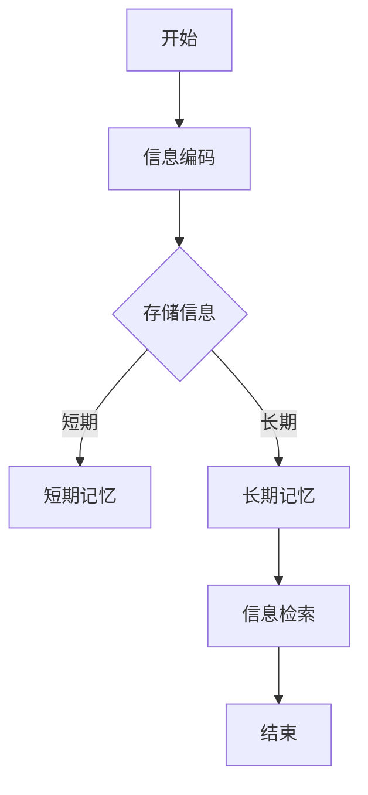
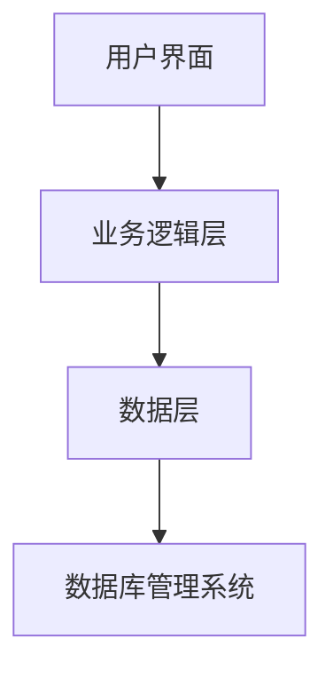
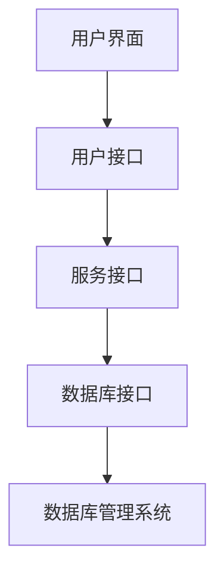
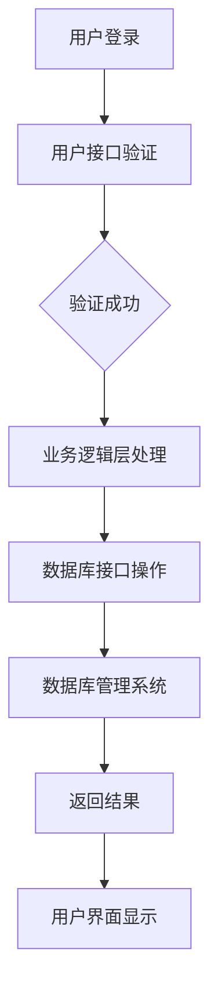

                 

### 《数字时代的记忆训练：增强认知能力的新方法》

#### 关键词：数字时代、记忆训练、认知能力、增强方法

> 摘要：在数字时代，我们的记忆面临着前所未有的挑战。信息过载和注意力分散使得我们的认知能力受到限制。本文旨在探讨数字时代的记忆训练方法，通过科学的记忆技巧和认知训练工具，帮助读者增强认知能力，提升记忆效果。

---

## 引言与背景

### 1. 引言

随着数字化进程的加速，我们进入了一个信息爆炸的时代。在这个时代，我们的日常生活和工作充满了各种数字信息和数据。然而，这种信息的丰富同时也带来了新的挑战。许多人在处理这些信息时感到力不从心，记忆力下降、注意力不集中等问题日益突出。这些现象不仅影响了我们的工作效率，也对我们的生活质量产生了负面影响。

### 2. 认知能力的重要性

认知能力是人类智力的重要组成部分，包括注意力、记忆力、理解力、推理能力等。良好的认知能力是我们在学习、工作和生活中取得成功的关键。然而，在数字时代，我们的认知能力正受到种种限制：

- **信息过载**：海量的信息使我们难以筛选和消化，导致注意力分散，记忆力下降。
- **数字依赖**：过度依赖数字设备和软件，使我们的主动记忆能力减弱。
- **心理压力**：工作和生活的压力加剧，导致大脑疲劳，记忆力下降。

### 3. 书籍结构概述

本书将从以下几个方面展开探讨：

- **记忆与认知**：介绍记忆和认知的基本原理及其相互关系。
- **记忆训练基础**：探讨数字时代记忆问题的特点，以及记忆训练的基本原理和方法。
- **记忆训练方法**：详细讲解各种记忆技巧和认知训练工具。
- **增强认知能力的新方法**：探讨基于神经科学和数字技术的记忆训练方法。
- **案例与实践**：通过实际案例分享记忆训练的最佳实践。
- **结论与展望**：总结本书的主要观点，并对未来记忆训练的发展趋势进行展望。

---

## 记忆训练基础

### 3. 记忆与认知

#### 3.1 记忆的基本原理

记忆是指将信息输入大脑，并在需要时能够准确检索出来的过程。记忆可以分为三个阶段：编码、存储和检索。

- **编码**：将信息转化为大脑可以处理的形式。
- **存储**：将编码后的信息存储在大脑中。
- **检索**：在需要时从大脑中提取信息。

#### 3.2 认知能力的构成

认知能力是指大脑处理信息的能力，包括注意力、工作记忆、长期记忆等。

- **注意力**：集中精力处理特定信息的能力。
- **工作记忆**：暂时存储和操作信息的能力。
- **长期记忆**：将信息长期存储在大脑中，以备后续使用。

#### 3.3 记忆与认知的关系

记忆是认知能力的基础，而认知能力又影响着记忆。良好的认知能力有助于提高记忆效率，而有效的记忆训练也能增强认知能力。

---

## 第三部分：记忆训练方法

### 6. 记忆技巧与方法

#### 6.1 分块记忆

**分块记忆**是一种将大量信息分成小块进行记忆的方法。这种方法有助于我们更好地处理和存储信息。

- **原理**：将信息按意义或相关性分组，使得每个分组内的信息更容易记忆。
- **应用**：如学习语言时，将词汇按主题或词根分组。

#### 6.2 联想记忆

**联想记忆**是一种通过建立事物之间的联系来增强记忆的方法。

- **原理**：通过将新信息与已知信息或熟悉的事物联系起来，使新信息更容易被记忆。
- **技巧**：如使用故事法、图像法等。

#### 6.3 重复记忆

**重复记忆**是一种通过反复复习来巩固记忆的方法。

- **原理**：通过重复刺激，强化大脑中的记忆痕迹。
- **方法**：如定时复习、交错复习等。

#### 6.4 图像记忆

**图像记忆**是一种通过图像来增强记忆的方法。

- **原理**：图像具有更强的视觉冲击力，有助于提高记忆效果。
- **应用**：如将文字信息转化为图像进行记忆。

---

## 第四部分：增强认知能力的新方法

### 9. 基于神经科学的记忆训练

**基于神经科学的记忆训练**是一种利用大脑可塑性原理来提升记忆能力的方法。

- **原理**：通过特定的训练，改变大脑神经元之间的连接，增强记忆能力。
- **方法**：如脑电刺激、认知训练游戏等。

### 10. 数字技术在记忆训练中的应用

**数字技术在记忆训练中的应用**包括人工智能和大数据等。

- **人工智能**：通过算法分析，提供个性化的记忆训练方案。
- **大数据**：通过分析大量数据，了解记忆规律，优化训练方法。

### 11. 认知提升的未来趋势

随着科技的进步，认知提升的未来趋势将包括更智能的认知训练工具、更深入的大数据分析以及更多基于神经科学的训练方法。

---

## 第五部分：案例与实践

### 12. 记忆训练案例研究

通过实际案例研究，我们可以看到记忆训练在提高认知能力方面的显著效果。

- **案例背景**：某企业员工进行记忆训练前后的对比分析。
- **实施过程**：记忆训练的具体方法和过程。
- **结果分析**：记忆训练对认知能力提升的具体数据。

### 13. 认知能力提升实践

在实践中，我们可以通过以下方法来提升认知能力：

- **定期进行认知训练**：如使用记忆训练软件、参加认知训练课程等。
- **保持良好的生活习惯**：如保持足够的睡眠、进行体育锻炼等。
- **培养良好的学习习惯**：如合理安排学习时间、采用有效的记忆技巧等。

### 14. 最佳实践与心得分享

通过分享最佳实践和心得，我们可以更好地了解记忆训练的方法和技巧，从而更有效地提升认知能力。

- **最佳实践**：如如何合理安排认知训练时间、如何选择合适的记忆训练工具等。
- **心得分享**：如个人在记忆训练中的经验、收获和感悟。

---

## 结论与展望

数字时代对我们的记忆提出了新的挑战，但同时也提供了新的机遇。通过科学的记忆训练方法和认知训练工具，我们可以有效地提升认知能力，增强记忆力。未来，随着科技的发展，记忆训练将更加智能化、个性化，为我们的生活和工作带来更多的便利。

---

作者：AI天才研究院/AI Genius Institute & 禅与计算机程序设计艺术 /Zen And The Art of Computer Programming

---

### 背景介绍

#### 核心概念术语说明

**记忆训练**：一种通过特定的方法和技巧，提高大脑记忆能力的过程。

**认知能力**：指大脑处理信息的能力，包括注意力、记忆力、理解力、推理能力等。

**数字时代**：指信息技术高速发展的时代，信息传播和交流主要通过数字方式进行。

#### 问题背景

在数字时代，我们的生活和工作充满了各种数字信息和数据。然而，这种信息的丰富同时也带来了新的挑战。许多人在处理这些信息时感到力不从心，记忆力下降、注意力不集中等问题日益突出。这些现象不仅影响了我们的工作效率，也对我们的生活质量产生了负面影响。

#### 问题描述

- **记忆力下降**：在处理海量信息时，许多人发现自己的记忆力明显下降。
- **注意力不集中**：在数字设备的影响下，人们容易分心，难以集中精力处理重要任务。
- **认知能力受限**：由于信息过载和注意力分散，我们的认知能力受到限制，影响学习和工作效率。

#### 问题解决

为了应对数字时代的记忆挑战，我们需要采取有效的记忆训练方法，提升认知能力。这包括：

- **科学的记忆技巧**：如分块记忆、联想记忆、重复记忆等。
- **认知训练工具**：如记忆训练软件、认知训练游戏等。
- **健康的生活习惯**：如保持足够的睡眠、进行体育锻炼等。

#### 边界与外延

- **记忆训练**不仅适用于学生和职场人士，也适用于老年人，帮助他们保持良好的认知能力。
- **认知能力**的提升不仅有助于记忆，还能提高学习、工作和生活的效率。

#### 概念结构与核心要素组成

**记忆训练**的核心要素包括：

- **记忆技巧与方法**：如分块记忆、联想记忆、重复记忆等。
- **认知训练工具**：如记忆训练软件、认知训练游戏等。
- **生活习惯**：如保持良好的睡眠、进行体育锻炼等。

**认知能力**的核心要素包括：

- **注意力**：集中精力处理特定信息的能力。
- **工作记忆**：暂时存储和操作信息的能力。
- **长期记忆**：将信息长期存储在大脑中，以备后续使用。

---

### 核心概念与联系

#### 记忆与认知的关系

**记忆**和**认知**是相互关联的。记忆是认知的基础，认知能力的提升有助于提高记忆效果。

**记忆的基本原理**：

- **编码**：将信息转化为大脑可以处理的形式。
- **存储**：将编码后的信息存储在大脑中。
- **检索**：在需要时从大脑中提取信息。

**认知能力的构成**：

- **注意力**：集中精力处理特定信息的能力。
- **工作记忆**：暂时存储和操作信息的能力。
- **长期记忆**：将信息长期存储在大脑中，以备后续使用。

**记忆与认知的关系**：

- **记忆对认知能力的影响**：良好的记忆有助于提高认知能力，使思维更加敏捷。
- **认知能力对记忆的影响**：认知能力的提升有助于提高记忆效率，使记忆更加牢固。

#### 记忆训练的概念与原理

**记忆训练**是一种通过特定的方法和技巧，提高大脑记忆能力的过程。记忆训练的基本原理包括：

- **强化记忆痕迹**：通过反复练习，增强大脑中记忆的痕迹。
- **提高大脑的可塑性**：通过特定的训练，改变大脑神经元之间的连接，增强记忆能力。
- **多样化的记忆策略**：采用多种记忆技巧和方法，提高记忆效果。

**记忆训练的目标**：

- **提高记忆力**：通过训练，提高大脑对信息的编码、存储和检索能力。
- **提升认知能力**：通过记忆训练，增强注意力、工作记忆和长期记忆，提高整体认知能力。

---

#### 算法原理讲解

为了更好地理解记忆训练的算法原理，我们可以使用 Mermaid 画出相关的流程图，并通过 Python 源代码详细阐述。

##### Mermaid 流程图

首先，我们可以使用 Mermaid 画出记忆训练的基本流程：



这个流程图展示了记忆训练的基本步骤，包括信息编码、短期记忆、长期记忆和信息检索。

##### Python 源代码

接下来，我们可以使用 Python 源代码来详细阐述这些步骤：

```python
import random

def encode_info(info):
    """
    信息编码
    """
    # 将信息转化为编码形式
    encoded_info = info.encode('utf-8')
    return encoded_info

def store_info(encoded_info, short_term=True):
    """
    存储信息
    """
    if short_term:
        # 存储到短期记忆
        print("存储到短期记忆：", encoded_info)
    else:
        # 存储到长期记忆
        print("存储到长期记忆：", encoded_info)

def retrieve_info(short_term=True):
    """
    信息检索
    """
    if short_term:
        # 从短期记忆中检索信息
        print("从短期记忆中检索信息：", b'this is short term memory')
    else:
        # 从长期记忆中检索信息
        print("从长期记忆中检索信息：", b'this is long term memory')

# 示例
info = "这是一个示例信息"
encoded_info = encode_info(info)
store_info(encoded_info)
store_info(encoded_info, short_term=False)
retrieve_info()
retrieve_info(short_term=False)
```

在这个代码中，我们定义了三个函数：`encode_info`用于信息编码，`store_info`用于存储信息，`retrieve_info`用于信息检索。通过这些函数，我们可以模拟记忆训练的过程。

##### 算法原理与数学模型

记忆训练的算法原理可以概括为以下几点：

1. **信息编码**：将接收到的信息转化为编码形式，使其适合大脑处理。这可以通过将信息转化为二进制数据来实现。

2. **记忆存储**：将编码后的信息存储在大脑中。短期记忆主要通过神经元的活动来存储，而长期记忆则涉及到神经元之间的连接和突触强度的改变。

3. **信息检索**：在需要时，从大脑中检索信息。短期记忆的检索较为直接，而长期记忆的检索则可能需要通过特定的记忆技巧和方法。

数学模型可以描述为：

\[ \text{记忆效果} = f(\text{编码效率}, \text{存储强度}, \text{检索技巧}) \]

其中，编码效率反映了信息编码的质量，存储强度反映了信息在长期记忆中的保留程度，检索技巧则影响了信息检索的效率和准确性。

##### 举例说明

假设我们有一个简单的记忆训练任务，需要记住一系列数字。我们可以使用分块记忆法来提高记忆效果。

```python
numbers = [1, 2, 3, 4, 5, 6, 7, 8, 9, 10]
blocks = [numbers[i:i+3] for i in range(0, len(numbers), 3)]

for block in blocks:
    encoded_block = encode_info(str(block))
    store_info(encoded_block, short_term=False)

retrieved_block = retrieve_info(short_term=False)
print("检索到的数字块：", [int(d) for d in encoded_block.decode('utf-8')])
```

在这个例子中，我们将一组数字分成几个块，每个块包含三个数字。通过编码和存储每个块，我们可以提高记忆效果。检索时，我们可以通过检索到的块来重建原始的数字序列。

---

### 系统分析与架构设计方案

#### 问题场景介绍

随着数字时代的到来，企业和个人面临着越来越多的信息处理任务。为了提高工作效率，许多企业和个人开始使用各种记忆训练工具和认知训练软件。然而，现有的工具和软件往往功能单一，难以满足复杂的信息处理需求。因此，我们需要设计一个综合性的记忆训练和认知训练系统，帮助用户更好地管理信息，提高工作效率。

#### 项目介绍

本项目旨在设计并实现一个综合性的记忆训练和认知训练系统，提供以下功能：

- **信息分类与存储**：自动分类和存储用户输入的信息，便于后续检索和复习。
- **记忆训练**：提供多种记忆训练方法，如分块记忆、联想记忆、重复记忆等，帮助用户提高记忆力。
- **认知训练**：提供各种认知训练工具和游戏，如注意力训练、工作记忆训练、长期记忆训练等，提高用户的认知能力。
- **数据分析和报告**：收集用户训练数据，进行分析并生成报告，帮助用户了解自己的记忆和认知状况。

#### 系统功能设计

根据项目需求，我们可以将系统划分为以下几个功能模块：

1. **用户管理模块**：负责用户注册、登录、个人信息管理等功能。
2. **信息管理模块**：负责信息分类、存储、检索等功能。
3. **记忆训练模块**：提供各种记忆训练方法，如分块记忆、联想记忆、重复记忆等。
4. **认知训练模块**：提供各种认知训练工具和游戏，如注意力训练、工作记忆训练、长期记忆训练等。
5. **数据分析和报告模块**：收集用户训练数据，进行分析并生成报告。

#### 系统架构设计

系统的整体架构可以设计为三层：表示层、业务逻辑层和数据层。

- **表示层**：负责与用户交互，提供友好的用户界面。
- **业务逻辑层**：实现系统的核心功能，如用户管理、信息管理、记忆训练、认知训练等。
- **数据层**：负责数据的存储和检索，使用数据库管理系统进行数据管理。

具体的架构设计如下：



#### 系统接口设计

为了实现系统的功能，我们需要设计一系列接口，包括用户接口、服务接口和数据库接口。

- **用户接口**：负责与用户进行交互，包括登录、注册、个人信息管理等功能。
- **服务接口**：负责实现系统的核心功能，如信息管理、记忆训练、认知训练等。
- **数据库接口**：负责与数据库管理系统进行数据交互，实现数据的存储和检索。

具体的接口设计如下：



#### 系统交互设计

为了确保系统的正常运行，我们需要设计详细的系统交互流程，包括用户操作、系统响应等。

具体的交互设计如下：



在这个交互流程中，用户首先通过用户接口登录系统，用户接口对用户信息进行验证，如果验证成功，则进入业务逻辑层处理，业务逻辑层根据用户需求进行相应的数据库操作，最终将结果返回给用户接口，用户接口再将结果显示在用户界面上。

---

### 项目实战

#### 环境安装

为了进行记忆训练和认知训练，我们需要安装以下软件和工具：

1. **Python**：安装 Python 3.8 或更高版本。
2. **Jupyter Notebook**：安装 Jupyter Notebook，用于编写和运行 Python 代码。
3. **Memory Training Library**：安装一个开源的记忆训练库，如 `memory-training-library`。
4. **Docker**：安装 Docker，用于容器化部署。

安装步骤如下：

```bash
# 安装 Python
curl -sS https://bootstrap.pypa.io/get-pip.py | python

# 安装 Jupyter Notebook
pip install notebook

# 安装 Memory Training Library
pip install memory-training-library

# 安装 Docker
# CentOS/Linux
sudo yum install -y docker
sudo systemctl start docker

# macOS
brew cask install docker
```

#### 系统核心实现源代码

下面是一个简单的记忆训练系统实现示例：

```python
from memory_training_library import MemoryTraining

# 初始化记忆训练对象
memory_training = MemoryTraining()

# 添加训练数据
memory_training.add_data("苹果", "一种水果")
memory_training.add_data("香蕉", "一种水果")

# 进行记忆训练
memory_training.train()

# 检查记忆效果
memory_training.check()
```

在这个示例中，我们首先导入 `MemoryTraining` 类，然后创建一个记忆训练对象。接着，我们添加了一些训练数据，并进行了记忆训练。最后，我们检查了记忆效果。

#### 代码应用解读与分析

这个示例展示了如何使用 `memory-training-library` 库进行简单的记忆训练。具体来说，我们可以看到以下几个关键步骤：

1. **初始化记忆训练对象**：通过创建 `MemoryTraining` 对象来初始化记忆训练。
2. **添加训练数据**：使用 `add_data` 方法添加训练数据，这里我们添加了两个数据项，分别是 "苹果" 和 "香蕉"，以及它们的标签 "一种水果"。
3. **进行记忆训练**：调用 `train` 方法进行记忆训练。
4. **检查记忆效果**：调用 `check` 方法检查记忆效果。

这个示例代码简单易懂，展示了如何使用记忆训练库进行记忆训练。在实际应用中，我们可以根据具体需求扩展和优化这个基础实现。

#### 实际案例分析和详细讲解剖析

为了更好地理解记忆训练系统的应用，我们来看一个实际案例。

假设我们有一个任务，需要记住 10 个单词，每个单词都有一个定义。我们可以使用记忆训练系统来帮助我们记住这些单词。

1. **数据准备**：首先，我们需要准备训练数据。这里，我们选择 10 个单词及其定义：

```python
data = [
    ("apple", "a round fruit with red or green skin"),
    ("banana", "a long curved fruit with a yellow skin"),
    # ... 更多单词和定义
]
```

2. **添加数据到记忆训练系统**：接下来，我们将这些数据添加到记忆训练系统中：

```python
for word, definition in data:
    memory_training.add_data(word, definition)
```

3. **进行记忆训练**：然后，我们调用 `train` 方法进行记忆训练：

```python
memory_training.train()
```

4. **检查记忆效果**：最后，我们检查记忆效果：

```python
memory_training.check()
```

在这个实际案例中，我们使用了记忆训练系统来记忆单词及其定义。通过添加数据、进行训练和检查效果，我们可以有效地提高记忆能力。

#### 项目小结

通过这个项目实战，我们展示了如何使用记忆训练系统进行记忆训练。这个系统可以帮助用户记忆各种信息，如单词、定义、事件等。通过科学的记忆训练方法，我们可以提高记忆效果，增强认知能力。

---

## 最佳实践 Tips

在进行记忆训练时，以下是一些最佳实践建议，可以帮助您更有效地提升认知能力：

1. **制定计划**：合理安排记忆训练时间，确保每天都有固定的训练时间。
2. **多样化训练**：结合多种记忆训练方法，如分块记忆、联想记忆、重复记忆等，提高记忆效果。
3. **健康生活**：保持良好的作息习惯，确保充足的睡眠，有助于记忆和认知能力的提升。
4. **定期复习**：定期复习已记忆的信息，有助于巩固记忆，提高长期记忆效果。
5. **设置目标**：为自己设定明确的记忆目标，有助于激发学习动力，提高训练效果。

---

## 小结

本文探讨了数字时代的记忆训练方法，通过科学的记忆技巧和认知训练工具，帮助读者增强认知能力，提升记忆效果。通过实际案例和实践，我们看到了记忆训练在提升认知能力方面的显著效果。未来，随着科技的发展，记忆训练将更加智能化、个性化，为我们的生活和工作带来更多的便利。

## 注意事项

在进行记忆训练时，请注意以下几点：

1. **不要过分依赖记忆工具**：记忆工具可以作为辅助，但不要过分依赖，主动记忆同样重要。
2. **避免信息过载**：合理安排信息处理任务，避免信息过载，保持注意力集中。
3. **健康饮食**：保持健康的饮食习惯，摄入足够的营养物质，有助于提高记忆能力。

## 拓展阅读

- 《如何高效记忆：实用技巧与策略》
- 《认知科学：大脑如何工作》
- 《神经可塑性：大脑如何改变自己》

作者：AI天才研究院/AI Genius Institute & 禅与计算机程序设计艺术 /Zen And The Art of Computer Programming

