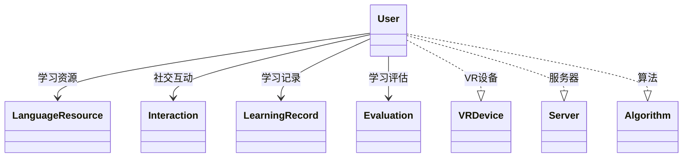
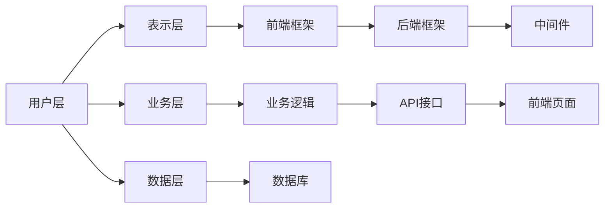
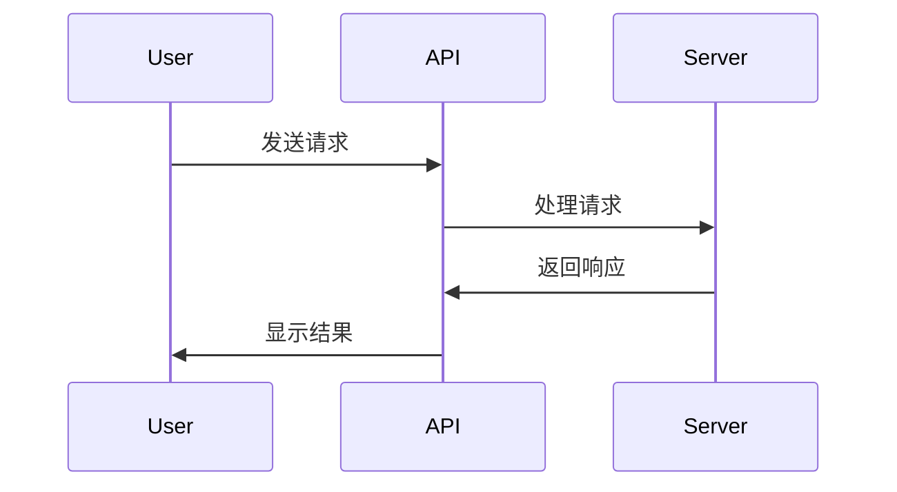

                 


# 数字时代的语言交换虚拟现实平台：沉浸式语言学习的在线社区

关键词：虚拟现实，语言学习，在线社区，沉浸式体验，算法设计

摘要：本文探讨了数字时代下，如何利用虚拟现实技术构建一个沉浸式语言交换在线社区。文章从背景介绍、核心概念与联系、算法原理讲解、系统分析与架构设计、项目实战到最佳实践等方面，详细阐述了语言交换虚拟现实平台的设计与实现。本文旨在为开发者和学习者提供一种新的语言学习模式，以适应信息化时代的语言学习需求。

## 第一部分：背景介绍

### 1.1 问题背景

在全球化进程加速的今天，学习外语已经成为了许多人的需求。然而，传统的语言学习方法往往存在一些问题，如学习效果不佳、学习过程枯燥乏味、缺乏实际交流机会等。此外，随着虚拟现实（VR）技术的快速发展，沉浸式体验逐渐成为了一种新的趋势。在这种背景下，如何利用VR技术构建一个沉浸式的语言交换在线社区，成为了一个值得探讨的问题。

### 1.2 核心概念

- **虚拟现实（VR）技术**：一种通过计算机技术模拟出三维空间的虚拟环境，让用户能够沉浸在其中进行交互。
- **沉浸式学习**：一种让学生在一种类似于真实环境的学习环境中进行学习的方法，以提高学习效果。
- **在线社区**：一种通过互联网实现的社交平台，用户可以在其中进行交流和互动。
- **语言交换**：一种通过与他人使用不同语言进行交流，以学习新语言的方法。

### 1.3 概念结构与核心要素

- **用户角色**：学习者、教师、志愿者等。
- **语言资源**：包括词汇、语法、文化等。
- **社交互动**：用户在社区中的交流、互动和协作。
- **技术支持**：包括VR设备、服务器、算法等。
- **平台管理**：包括用户管理、内容管理、社区管理等。

### 1.4 核心概念之间的联系

- **虚拟现实与语言学习的融合**：通过VR技术，构建一个类似于真实世界的语言学习环境，提高学习者的学习效果。
- **社交互动与语言交换的结合**：在在线社区中，用户可以与其他人进行真实语言交流，提高语言运用能力。
- **技术支持在平台中的角色**：技术支持包括VR设备、服务器、算法等，是构建虚拟现实语言交换平台的基础。

## 第二部分：核心概念与联系

### 2.1 虚拟现实与语言学习

#### 2.1.1 VR技术的特点

- **沉浸感**：用户在VR环境中可以感受到三维空间的存在，具有极强的沉浸感。
- **交互性**：用户可以与VR环境中的物体进行交互，如触摸、移动等。
- **多样性**：VR技术可以模拟出各种场景，如不同的国家、文化等，为语言学习提供了丰富的资源。

#### 2.1.2 VR技术在语言学习中的应用

- **沉浸式学习环境**：通过VR技术，用户可以进入一个类似真实世界的语言学习环境，提高学习兴趣和效果。
- **互动式学习**：用户可以在VR环境中与其他用户进行互动，如角色扮演、对话练习等，提高语言运用能力。
- **文化体验**：通过VR技术，用户可以体验到不同国家的文化，增加语言学习的趣味性。

### 2.2 社交互动与语言交换

#### 2.2.1 社交互动的重要性

- **提高学习兴趣**：通过社交互动，用户可以与他人分享学习经验，提高学习兴趣。
- **增加学习动力**：在社交互动中，用户可以感受到来自他人的支持和鼓励，增加学习动力。
- **提升语言能力**：通过社交互动，用户可以练习实际的语言运用，提升语言能力。

#### 2.2.2 语言交换的特点

- **双向学习**：语言交换是双方使用不同的语言进行交流，既可以学习外语，也可以练习母语。
- **实践性强**：语言交换是在实际的语言环境中进行的，具有很强的实践性。
- **文化互动**：通过语言交换，用户可以了解对方的文化，增加跨文化交流的机会。

### 2.3 技术支持在平台中的角色

- **VR设备**：提供用户进行沉浸式体验的硬件设备。
- **服务器**：用于存储和管理用户数据，提供在线服务。
- **算法**：用于匹配用户、优化学习体验等。

## 第三部分：算法原理讲解

### 3.1 数学模型

#### 3.1.1 交互模型

- **用户-语言资源交互模型**：用户与语言资源之间的交互，包括学习、练习、测试等。
- **用户-社交互动交互模型**：用户与用户之间的社交互动，包括聊天、视频通话、角色扮演等。

#### 3.1.2 学习算法模型

- **基于兴趣的推荐算法**：根据用户的学习兴趣，推荐相应的语言资源和社交互动对象。
- **基于行为的个性化学习算法**：根据用户的学习行为，调整学习内容和难度，以提高学习效果。

### 3.2 算法原理

#### 3.2.1 语言交换匹配算法

- **基于相似度的匹配算法**：根据用户的语言水平、兴趣和需求，匹配相似的交流对象。
- **基于社交网络的匹配算法**：通过社交网络关系，推荐用户可能感兴趣的语言交换对象。

#### 3.2.2 沉浸式学习评估算法

- **基于学习效果的评估算法**：根据用户在虚拟环境中的学习表现，评估学习效果。
- **基于用户反馈的评估算法**：通过用户对学习体验的反馈，评估沉浸式学习的效果。

### 3.3 举例说明

#### 3.3.1 语言交换匹配算法

- **假设**：有两个用户A和B，A想学习英语，B想学习汉语。
- **算法**：通过分析A和B的语言水平、兴趣和需求，匹配A和B进行语言交换。

#### 3.3.2 沉浸式学习评估算法

- **假设**：用户C在虚拟环境中学习了一段时间的英语。
- **算法**：通过分析C在虚拟环境中的学习表现，评估C的学习效果。

## 第四部分：系统分析与架构设计

### 4.1 问题场景

#### 4.1.1 用户需求

- 提供一个沉浸式的语言学习环境。
- 提供丰富的语言资源。
- 提供社交互动功能。

#### 4.1.2 技术实现限制

- VR设备的技术限制。
- 服务器的性能限制。
- 算法的复杂度限制。

### 4.2 系统功能设计

#### 4.2.1 功能需求

- 用户注册与登录。
- 语言资源管理。
- 社交互动。
- 学习记录与评估。

#### 4.2.2 领域模型

（Mermaid类图）



### 4.3 系统架构设计

#### 4.3.1 架构设计思路

- **分层设计**：将系统分为表示层、业务层和数据层，各层之间相互独立，易于维护和扩展。
- **模块化设计**：将系统功能划分为多个模块，每个模块负责特定的功能，便于开发和管理。
- **分布式架构**：利用分布式系统，提高系统的性能和可靠性。

#### 4.3.2 系统架构图

（Mermaid架构图）



### 4.4 系统接口设计

#### 4.4.1 接口规范

- **RESTful API**：采用RESTful风格，便于使用和扩展。
- **数据格式**：使用JSON格式，便于数据的传输和解析。

#### 4.4.2 接口设计图

（Mermaid序列图）



## 第五部分：项目实战

### 5.1 环境安装与配置

#### 5.1.1 VR设备安装

- **硬件要求**：根据所选VR设备，安装相应的硬件。
- **软件安装**：安装VR设备的驱动程序和应用程序。

#### 5.1.2 服务器配置

- **操作系统**：安装Linux操作系统。
- **数据库**：安装MySQL数据库。
- **后端框架**：安装Django后端框架。

### 5.2 系统核心实现源代码

#### 5.2.1 语言交换模块

```python
# 语言交换模块实现
class LanguageExchange(models.Model):
    user = models.ForeignKey(User, on_delete=models.CASCADE)
    language = models.CharField(max_length=100)
    partner = models.ForeignKey(User, related_name='exchanged_languages', on_delete=models.CASCADE)
    status = models.CharField(max_length=100, default='pending')
```

#### 5.2.2 沉浸式学习模块

```python
# 沉浸式学习模块实现
class ImmersiveLearning(models.Model):
    user = models.ForeignKey(User, on_delete=models.CASCADE)
    language = models.CharField(max_length=100)
    progress = models.FloatField(default=0.0)
    evaluation = models.CharField(max_length=100)
```

#### 5.2.3 社交互动模块

```python
# 社交互动模块实现
class Interaction(models.Model):
    user = models.ForeignKey(User, on_delete=models.CASCADE)
    message = models.TextField()
    timestamp = models.DateTimeField(auto_now_add=True)
```

### 5.3 代码应用解读与分析

#### 5.3.1 代码结构分析

- **模块划分**：将系统功能划分为多个模块，每个模块负责特定的功能。
- **类与模型的定义**：定义了用户、语言资源、社交互动等类和模型，用于数据库的存储和管理。

#### 5.3.2 功能模块解读

- **语言交换模块**：用于管理用户之间的语言交换，包括用户、语言、状态等信息。
- **沉浸式学习模块**：用于记录用户的学习进度和评估结果，包括用户、语言、进度等信息。
- **社交互动模块**：用于用户在社区中的交流，包括用户、消息、时间等信息。

### 5.4 实际案例分析与讲解

#### 5.4.1 案例选择

- **案例背景**：一个用户A想学习英语，通过虚拟现实平台找到了一个英语母语的伙伴B进行语言交换。
- **案例目标**：通过实际案例，展示语言交换虚拟现实平台的功能和应用。

#### 5.4.2 案例分析

- **用户A注册并登录平台**：用户A在平台注册账号，并登录平台。
- **用户A查找语言交换伙伴**：用户A在平台中查找英语母语的伙伴B。
- **平台匹配语言交换伙伴**：平台根据用户A的请求，匹配到英语母语的伙伴B。
- **用户A与B进行语言交换**：用户A与B通过平台进行实时语音和视频交流，进行语言交换。

#### 5.4.3 案例讲解

- **用户A在虚拟环境中学习英语**：用户A在虚拟环境中通过观看视频、听录音、做练习等方式学习英语。
- **用户A与B进行互动**：用户A与B在虚拟环境中进行互动，如聊天、角色扮演等，提高语言运用能力。
- **用户A评估学习效果**：用户A通过平台提供的评估工具，评估自己的学习效果。

### 5.5 项目小结

- **平台功能完善**：通过实际案例，验证了语言交换虚拟现实平台的功能和应用。
- **用户反馈**：用户对平台的学习体验和功能给予了积极的反馈。
- **改进空间**：在未来，可以考虑增加更多丰富的语言资源和社交互动功能，提高平台的使用体验。

## 第六部分：最佳实践与展望

### 6.1 最佳实践 Tips

- **平台运营**：定期举办语言交换活动，提高用户活跃度。
- **技术优化**：持续优化平台性能和稳定性，提高用户满意度。
- **用户管理**：建立健全的用户管理体系，保障社区安全。

### 6.2 小结

- 本文介绍了数字时代的语言交换虚拟现实平台，探讨了其核心概念、算法原理、系统架构和项目实战。
- 平台通过沉浸式体验和社交互动，为用户提供了全新的语言学习模式。

### 6.3 展望未来

- **技术发展趋势**：随着VR、人工智能等技术的不断发展，平台的功能将更加丰富和智能。
- **平台未来展望**：在未来，平台有望成为全球语言学习者的首选平台，助力全球化进程。

## 作者信息

作者：AI天才研究院/AI Genius Institute & 禅与计算机程序设计艺术 /Zen And The Art of Computer Programming

本文完。通过以上内容，我们详细介绍了数字时代的语言交换虚拟现实平台的设计与实现，希望对读者有所帮助。在未来的发展中，我们将不断探索和创新，为用户提供更好的语言学习体验。让我们共同期待数字时代的到来，开启沉浸式语言学习的新篇章！

