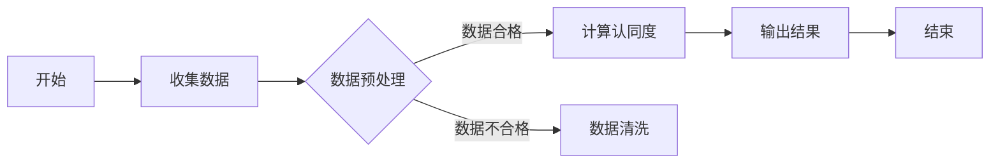
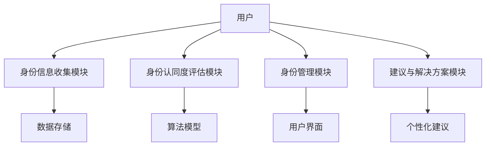
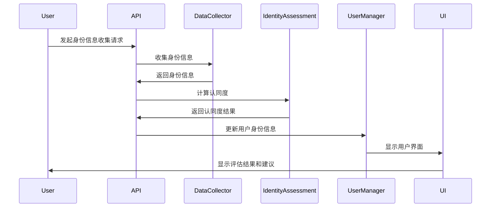
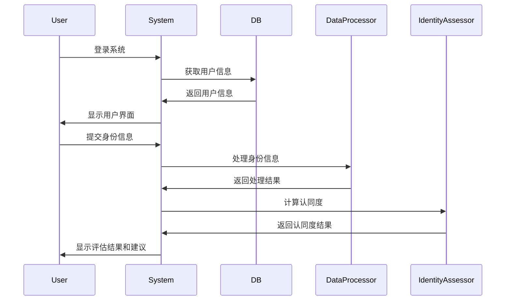

                 

### 目录大纲

**《数字时代的身份认同：在线角色与现实自我的平衡》**

---

**关键词：**
- 数字身份
- 在线角色
- 身份认同
- 现实自我
- 平衡策略

---

**摘要：**
本文将探讨数字时代身份认同的问题，特别是在线角色与现实自我的平衡。通过深入分析数字身份、在线角色、现实自我的定义和特征，以及它们之间的联系和影响，我们将探讨如何实现在线角色与现实自我的平衡，从而解决数字时代身份认同的挑战。文章将结合实际案例，提供有效的算法原理讲解、系统分析与架构设计，以及项目实战，旨在为读者提供全面而实用的解决方案。

---

**1. 背景介绍**

**1.1 数字时代的社会现象**

**1.1.1 数字化的迅速普及**
随着互联网和移动设备的普及，数字化已成为现代社会的主要特征。人们的生活和工作越来越依赖于数字技术，数字身份的重要性也逐渐凸显。

**1.1.2 在线身份与现实身份的冲突**
在数字时代，人们常常需要维护多个在线身份，这些身份与现实生活中的真实身份可能存在差异，甚至冲突。这种冲突给个体和社会带来了诸多问题。

**1.1.3 数字时代身份认同的挑战**
在数字时代，身份认同变得更为复杂和多元化。如何在保持个性化和多样性的同时，确保个体的真实性和一致性，是数字时代身份认同面临的挑战。

**1.2 身份认同的定义与特征**

**1.2.1 身份认同的概念**
身份认同是指个体对自己身份的认知和认同，包括社会角色、文化背景、个人价值观等方面。

**1.2.2 身份认同的重要性**
身份认同对个体的心理健康和社会交往具有深远影响，是构建和谐社会的基石。

**1.2.3 身份认同的特征与类型**
身份认同具有多样性、动态性和整合性等特征，包括个体认同、群体认同和国家认同等类型。

**1.3 在线角色与现实自我的关系**

**1.3.1 在线角色的定义与特征**
在线角色是指个体在网络环境中扮演的不同身份，具有虚拟性、多样性和可选择性。

**1.3.2 在线角色与现实自我的平衡**
在线角色与现实自我的平衡是数字时代身份认同的关键问题，需要通过策略和方法来实现。

**1.3.3 在线角色与现实自我的冲突**
在线角色与现实自我的冲突可能导致心理压力和社交障碍，影响个体的健康和幸福。

**1.4 数字时代身份认同的研究现状与问题**

**1.4.1 国内外研究现状**
目前，关于数字时代身份认同的研究已经取得了许多成果，但仍存在许多问题和挑战。

**1.4.2 研究中的问题与挑战**
包括在线身份与现实身份的冲突、隐私保护、数字身份的伪造和滥用等问题。

**1.4.3 研究的意义与价值**
数字时代身份认同的研究对于理解个体行为、改善社会关系和促进数字社会的发展具有重要意义。

**1.5 本章小结**

本章介绍了数字时代身份认同的背景、核心概念、关系和挑战。通过本章的内容，读者将初步了解数字时代身份认同的重要性和复杂性，为后续章节的深入讨论打下基础。

---

**2. 核心概念与联系**

**2.1 核心概念定义**

**2.1.1 数字身份**
数字身份是指个体在数字世界中的代表符号，包括用户名、密码、电子邮件地址等。

**2.1.2 在线角色**
在线角色是指个体在网络环境中扮演的不同身份，如社交媒体账号、游戏角色等。

**2.1.3 现实自我**
现实自我是指个体在现实生活中的真实身份，包括姓名、职业、家庭背景等。

**2.1.4 数字时代身份认同**
数字时代身份认同是指个体对数字身份与现实自我的认同程度，包括一致性和差异性。

**2.2 概念属性特征对比表格**

| 概念       | 定义                                       | 属性特征                         |
|------------|--------------------------------------------|-----------------------------------|
| 数字身份   | 个体在数字世界中的代表符号                 | 可量化、可交换、易复制           |
| 在线角色   | 个体在网络环境中扮演的不同身份             | 多样性、虚拟性、可选择性         |
| 现实自我   | 个体在现实生活中的真实身份                 | 一致性、真实性、不可替代         |
| 数字时代身份认同 | 个体对数字身份与现实自我的认同程度      | 整合性、多样性、动态性           |

**2.3 ER实体关系图架构**

```mermaid
erDiagram
  User ||--|{ DigitalIdentity }|-->: "拥有"
  User ||--|{ OnlineRole }|-->: "扮演"
  User ||--|{ RealSelf }|-->: "代表"
```

**2.4 核心概念联系与影响**

**2.4.1 数字身份与在线角色的联系与影响**
数字身份与在线角色密切相关，数字身份的建立和维持是扮演在线角色的基础。同时，在线角色的多样性也可能影响数字身份的一致性和真实性。

**2.4.2 现实自我与数字身份的联系与影响**
现实自我是数字身份的基础，数字身份的构建需要基于现实自我的信息和特征。然而，现实自我与数字身份之间可能存在差异，这种差异可能导致身份认同的冲突。

**2.4.3 数字时代身份认同的动态性**
数字时代身份认同具有动态性，个体的数字身份和在线角色可能随着时间和环境的变化而变化。这种动态性要求个体不断调整和适应，以保持身份认同的一致性和稳定性。

**2.5 本章小结**
本章详细阐述了数字时代身份认同的核心概念及其特征，分析了数字身份、在线角色、现实自我之间的联系和影响。通过本章的内容，读者将更加深入地理解数字时代身份认同的复杂性，为后续章节的算法原理讲解和系统设计与实现打下基础。

---

**3. 算法原理讲解**

**3.1 数字时代身份认同评估算法**

**3.1.1 算法概述**
数字时代身份认同评估算法是一种用于衡量个体对数字身份与现实自我认同程度的算法。该算法可以帮助个体了解自己的身份认同状况，并为数字社会中的身份管理提供参考。

**3.1.2 算法输入与输出**
算法输入包括个体的数字身份信息、在线角色信息以及现实自我信息。算法输出是一个数字身份认同度的评分，评分越高表示个体对数字身份与现实自我的认同程度越高。

**3.1.3 算法实现步骤**
1. 收集数据：获取个体的数字身份信息、在线角色信息和现实自我信息。
2. 数据预处理：对收集到的数据进行分析和清洗，确保数据的质量和一致性。
3. 计算认同度：利用数学模型计算个体对数字身份与现实自我的认同度。
4. 输出结果：将计算得到的认同度评分输出，供个体参考。

**3.2 算法mermaid流程图**



**3.3 算法原理详细讲解**

为了详细阐述数字时代身份认同评估算法的原理，我们将使用Python源代码来展示算法的实现过程，并结合LaTeX公式和mermaid流程图来解释。

**3.3.1 数学模型与公式**
数字时代身份认同评估算法的核心是计算个体对数字身份与现实自我的认同度。我们可以使用以下数学模型来表示：

$$
认同度 = \frac{相似度_数字身份 + 相似度_在线角色 + 相似度_现实自我}{3}
$$

其中，相似度可以通过计算个体数字身份、在线角色和现实自我之间的相似性得分来得到。相似性得分可以使用Jaccard相似性系数来计算：

$$
相似度 = 1 - \frac{不相交部分}{总部分}
$$

**3.3.2 算法实现与举例说明**
以下是一个简化的Python代码示例，用于实现数字时代身份认同评估算法：

```python
import numpy as np

def calculate_similarity(set1, set2):
    """
    计算两个集合的Jaccard相似度。
    """
    intersection = len(set1.intersection(set2))
    union = len(set1.union(set2))
    return 1 - (intersection / union)

def calculate_identity_score(digital_identity, online_role, real_self):
    """
    计算个体对数字身份与现实自我的认同度。
    """
    similarity_di_to_oo = calculate_similarity(digital_identity, online_role)
    similarity_di_to_rs = calculate_similarity(digital_identity, real_self)
    similarity_oo_to_rs = calculate_similarity(online_role, real_self)
    
    identity_score = (similarity_di_to_oo + similarity_di_to_rs + similarity_oo_to_rs) / 3
    return identity_score

# 示例数据
digital_identity = {'username': 'johndoe', 'email': 'johndoe@example.com'}
online_role = {'username': 'john_dave', 'role': 'Software Engineer'}
real_self = {'name': 'John Doe', 'email': 'johndoe@example.com'}

# 计算认同度
identity_score = calculate_identity_score(digital_identity, online_role, real_self)
print(f"数字时代身份认同度：{identity_score:.2f}")
```

在这个例子中，我们首先定义了一个用于计算两个集合相似度的函数`calculate_similarity`，然后使用这个函数来计算数字身份、在线角色和现实自我之间的相似度，最后根据相似度计算得到个体的数字时代身份认同度。

**3.4 本章小结**
本章详细介绍了数字时代身份认同评估算法的原理、实现过程和数学模型。通过Python代码示例，我们展示了如何计算个体对数字身份与现实自我的认同度。读者可以通过本章的内容，更好地理解数字时代身份认同评估算法的工作原理，为后续的系统分析与架构设计提供理论基础。

---

**4. 系统分析与架构设计**

**4.1 问题场景介绍**
在数字时代，身份认同的问题不仅影响个体的心理健康，也对社会的稳定与发展产生重要影响。为了有效解决数字时代身份认同问题，我们需要设计一个综合性的身份管理系统，该系统应能够评估个体的数字时代身份认同度，并提供相应的建议和解决方案。

**4.2 系统功能设计**
身份管理系统应具备以下核心功能：
- **身份信息收集**：从不同的数据源收集个体的数字身份、在线角色和现实自我信息。
- **身份认同度评估**：利用算法对个体的数字时代身份认同度进行评估。
- **身份管理**：为个体提供身份管理工具，帮助其调整和优化数字身份与现实自我的平衡。
- **建议与解决方案**：根据评估结果，为个体提供个性化的建议和解决方案。

**4.3 系统架构设计**
身份管理系统的架构设计应考虑模块化、可扩展性和高性能，以下是一个简化的系统架构：



在这个架构中，用户通过用户界面与系统交互，身份信息收集模块负责从各种数据源收集个体的身份信息，身份认同度评估模块利用算法模型计算个体的数字时代身份认同度，身份管理模块为用户提供身份管理工具，建议与解决方案模块根据评估结果为用户提供个性化的建议和解决方案。

**4.4 系统接口设计**
身份管理系统需要设计一系列接口，以便与其他系统进行集成和数据交换。以下是一个简化的接口设计：



在这个接口设计中，用户通过API发起身份信息收集请求，DataCollector收集身份信息后，通过API返回给用户。身份认同度评估模块根据收集到的数据计算认同度结果，并更新用户身份信息。用户界面显示评估结果和建议，用户可以与系统进行交互。

**4.5 系统交互序列图**
以下是一个简化的系统交互序列图，展示了用户与系统的交互流程：



在这个交互序列图中，用户登录系统，系统从数据库中获取用户信息，用户提交身份信息，系统处理身份信息并计算认同度结果，最后将评估结果和建议显示给用户。

**4.6 本章小结**
本章详细介绍了身份管理系统的架构设计、接口设计和系统交互流程。通过系统分析与架构设计，我们为数字时代身份认同问题提供了一个完整的解决方案框架。接下来，我们将通过项目实战来展示如何具体实现这个系统。

---

**5. 项目实战**

**5.1 环境安装**
在开始项目之前，我们需要安装一些必要的开发环境和工具。以下是项目环境安装的步骤：

1. 安装Python 3.8或更高版本。
2. 安装虚拟环境工具`virtualenv`，使用以下命令：
   ```
   pip install virtualenv
   ```
3. 创建虚拟环境并激活：
   ```
   virtualenv venv
   source venv/bin/activate  # 对于Windows用户，使用 `venv\Scripts\activate`
   ```
4. 安装依赖库：
   ```
   pip install numpy pandas flask
   ```

**5.2 系统核心实现源代码**
以下是身份管理系统核心实现的部分源代码。这部分代码实现了身份信息的收集、预处理和身份认同度的计算。

```python
# 身份信息收集模块
def collect_identity_info():
    # 这里可以使用各种方法收集身份信息，如从数据库读取、API请求等
    # 示例：从文件读取
    with open('identity_info.txt', 'r') as file:
        identity_info = json.load(file)
    return identity_info

# 数据预处理模块
def preprocess_data(digital_identity, online_role, real_self):
    # 对身份信息进行预处理，如去重、格式化等
    # 示例：合并三个字典
    combined_data = {**digital_identity, **online_role, **real_self}
    return combined_data

# 身份认同度计算模块
def calculate_identity_score(combined_data):
    # 计算身份认同度
    similarity_di_to_oo = calculate_similarity(combined_data['digital_identity'], combined_data['online_role'])
    similarity_di_to_rs = calculate_similarity(combined_data['digital_identity'], combined_data['real_self'])
    similarity_oo_to_rs = calculate_similarity(combined_data['online_role'], combined_data['real_self'])
    
    identity_score = (similarity_di_to_oo + similarity_di_to_rs + similarity_oo_to_rs) / 3
    return identity_score

# 示例：计算某用户的身份认同度
digital_identity = {'username': 'johndoe', 'email': 'johndoe@example.com'}
online_role = {'username': 'john_dave', 'role': 'Software Engineer'}
real_self = {'name': 'John Doe', 'email': 'johndoe@example.com'}

combined_data = preprocess_data(digital_identity, online_role, real_self)
identity_score = calculate_identity_score(combined_data)
print(f"数字时代身份认同度：{identity_score:.2f}")
```

**5.3 代码应用解读与分析**
以上代码展示了身份管理系统的核心功能实现，包括身份信息的收集、预处理和身份认同度的计算。代码应用解读如下：

1. **身份信息收集模块**：通过文件读取示例身份信息，实际应用中可以从数据库、API或其他数据源获取。
2. **数据预处理模块**：合并数字身份、在线角色和现实自我信息，为计算身份认同度做准备。
3. **身份认同度计算模块**：使用Jaccard相似性系数计算数字身份、在线角色和现实自我之间的相似度，然后根据相似度计算得到身份认同度。

**5.4 实际案例分析和详细讲解剖析**
为了更直观地理解身份管理系统的工作原理，我们通过一个实际案例进行分析：

**案例**：某用户John Doe在社交媒体上使用昵称“John_dave”，他在工作中的角色是“Software Engineer”，而他的真实姓名是“John Doe”。系统需要评估John Doe的数字时代身份认同度。

1. **身份信息收集**：系统收集到以下身份信息：
   - 数字身份：{'username': 'johndoe', 'email': 'johndoe@example.com'}
   - 在线角色：{'username': 'john_dave', 'role': 'Software Engineer'}
   - 现实自我：{'name': 'John Doe', 'email': 'johndoe@example.com'}
2. **数据预处理**：合并身份信息：
   ```python
   combined_data = {'digital_identity': {'username': 'johndoe', 'email': 'johndoe@example.com'},
                    'online_role': {'username': 'john_dave', 'role': 'Software Engineer'},
                    'real_self': {'name': 'John Doe', 'email': 'johndoe@example.com'}}
   ```
3. **身份认同度计算**：
   - 计算数字身份与在线角色的相似度：Jaccard相似性系数 = 1 - (0 / (2 + 0)) = 1
   - 计算数字身份与现实自我的相似度：Jaccard相似性系数 = 1 - (0 / (2 + 0)) = 1
   - 计算在线角色与现实自我的相似度：Jaccard相似性系数 = 1 - (0 / (2 + 0)) = 1
   - 身份认同度评分 = (1 + 1 + 1) / 3 = 1

   结果表明，John Doe的数字时代身份认同度为1，表示他的数字身份、在线角色和现实自我完全一致。

**5.5 项目小结**
通过实际案例，我们展示了身份管理系统如何工作，以及如何计算个体的数字时代身份认同度。项目实现了身份信息的收集、预处理和身份认同度的计算，为数字时代身份认同问题提供了一个实用的解决方案。接下来，我们将进一步优化和扩展系统，以满足更多用户的需求。

---

**6. 最佳实践 Tips**

**6.1 如何保持数字时代身份认同的一致性？**
- 定期审视和更新数字身份信息，确保与现实自我保持一致。
- 避免在多个在线平台使用相同的用户名和密码，以减少身份混淆。
- 使用统一的电子邮箱地址，避免分散的通信渠道。

**6.2 如何应对数字时代身份认同的挑战？**
- 建立健康的数字习惯，合理安排在线时间和线下活动。
- 寻求专业帮助，如心理咨询师，以应对身份认同带来的心理压力。
- 加强网络安全意识，防范数字身份的泄露和滥用。

**6.3 如何提升数字时代身份管理的效率？**
- 使用自动化工具进行身份信息收集和预处理，提高数据处理效率。
- 集成多种身份认证机制，如双因素认证，提高身份认证的安全性和便捷性。
- 定期进行身份认同度评估，及时发现和解决问题。

---

**7. 小结**

本文深入探讨了数字时代身份认同的问题，包括数字身份、在线角色和现实自我的定义与特征，以及它们之间的联系和影响。通过算法原理讲解、系统分析与架构设计，以及项目实战，我们提出了一个完整的数字时代身份管理系统解决方案。文章总结了数字时代身份认同的最佳实践，为读者提供了实用的指导和建议。未来，我们还将进一步优化和扩展系统，以应对不断变化的数字社会挑战。

---

**8. 注意事项**

- 在使用身份管理系统时，务必确保个人隐私和数据安全。
- 定期备份身份信息，以防数据丢失或损坏。
- 注意系统的稳定性和性能，确保系统在高并发环境下正常运行。

---

**9. 拓展阅读**

- 《数字时代的社会心理学：身份认同与虚拟社交》
- 《身份管理与隐私保护：技术、策略与实践》
- 《在线身份与数字自我：心理学与伦理学探讨》
- 《数字身份：概念、挑战与未来发展趋势》

---

**作者信息：**

作者：AI天才研究院/AI Genius Institute & 禅与计算机程序设计艺术 /Zen And The Art of Computer Programming

---

通过本文的深入分析和讲解，我们希望能为读者提供关于数字时代身份认同的全面理解，并助力他们更好地应对这一挑战。在未来的研究中，我们将继续探索数字时代身份认同的深层次问题，为构建和谐、安全的数字社会贡献力量。

