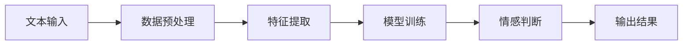
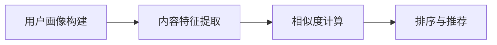
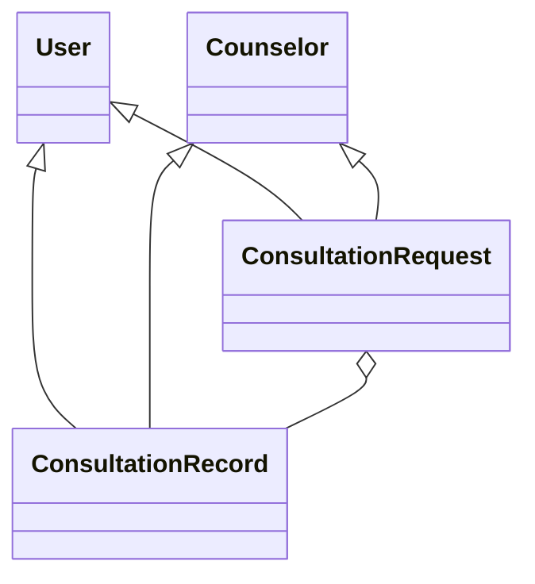

                 

### 《数字时代的远程情感支持网络：科技辅助下的全球心理互助平台》

#### 关键词：
- 数字时代
- 远程情感支持
- 科技辅助
- 全球心理互助
- 心理健康

#### 摘要：
随着数字时代的到来，远程情感支持网络作为一种新型的心理服务模式，正在成为全球心理健康领域的重要发展方向。本文将探讨科技在远程情感支持网络中的辅助作用，构建全球心理互助平台的概念与实现，以及其对社会心理健康的重要意义。

## 第一部分：背景介绍

### 1.1 问题背景

#### 1.1.1 问题的提出
在数字时代，互联网和移动通信技术的飞速发展使得人们的生活方式和社交模式发生了翻天覆地的变化。然而，这种变化也带来了新的挑战，尤其是心理健康问题。随着工作压力、生活节奏的加快，以及社交媒体的普及，越来越多的人面临着心理困扰。这些困扰包括焦虑、抑郁、孤独感等。传统面对面心理支持模式由于地域、时间和资源的限制，难以满足日益增长的需求。

#### 1.1.2 问题描述
数字时代的远程情感支持网络旨在解决传统心理支持模式的局限性，为全球范围内的个体提供及时、便捷的心理支持服务。然而，如何构建一个高效、可信且可扩展的远程情感支持网络，成为当前研究的重要课题。

#### 1.1.3 问题解决
远程情感支持网络的构建需要充分利用现代科技，如人工智能、大数据、云计算等，通过智能化的匹配算法、个性化的服务方式以及用户隐私保护机制，提供高质量的心理支持服务。

#### 1.1.4 边界与外延
本文研究的边界包括远程情感支持网络的技术实现、服务模式、用户隐私保护等方面。而其外延则涵盖了全球范围内的心理健康服务、心理援助的全球化发展等。

#### 1.1.5 概念结构与核心要素组成
远程情感支持网络的核心概念包括科技辅助、心理支持、用户隐私保护、全球化、个性化服务。这些概念共同构成了一个高效、可信且可持续发展的全球心理互助平台。

## 第二部分：核心概念与联系

### 2.1 核心概念原理

#### 2.1.1 科技辅助
科技辅助是远程情感支持网络的核心，通过人工智能、大数据、云计算等技术手段，实现对心理支持服务的智能化、个性化和高效化。例如，利用自然语言处理技术进行情感分析，利用机器学习算法进行用户画像构建和个性化推荐。

#### 2.1.2 心理支持
心理支持是指通过专业的心理知识和方法，帮助个体应对心理困扰，提升心理健康水平。在远程情感支持网络中，心理支持服务可以采用线上咨询、心理测评、自助工具等多种形式。

#### 2.1.3 用户隐私保护
用户隐私保护是远程情感支持网络中至关重要的一环。在提供服务的过程中，必须确保用户的个人信息和隐私得到严格保护，防止数据泄露和滥用。

#### 2.1.4 全球化
全球化是指在全球范围内实现心理支持服务的共享和互认。通过互联网和移动通信技术，远程情感支持网络可以跨越地域、语言和文化障碍，为全球用户提供一致性的服务体验。

#### 2.1.5 个性化服务
个性化服务是根据用户的需求和特点，提供定制化的心理支持服务。通过用户画像和个性化推荐算法，可以更好地满足不同用户的心理健康需求。

### 2.2 概念属性特征对比表格

| 概念             | 属性特征                                                     |
|------------------|--------------------------------------------------------------|
| 科技辅助         | 利用信息技术提升服务效率                                     |
| 心理支持         | 通过专业知识和方法提升心理健康                               |
| 用户隐私保护     | 保护用户个人信息和隐私安全                                   |
| 全球化           | 打破地域、语言和文化障碍                                   |
| 个性化服务       | 根据用户需求提供定制化服务                                 |

### 2.3 ER实体关系图架构

```mermaid
erDiagram
  User ||--|{ SupportRequest } : 提出心理支持请求
  User ||--|{ SupportResponse } : 收到心理支持回应
  SupportRequest ||--|{ SupportService } : 服务请求与心理服务匹配
  SupportResponse ||--|{ SupportService } : 回应与心理服务关联
  SupportService ||--|{ ServiceProvider } : 提供心理服务的人员或机构
  ServiceProvider ||--|{ ServiceRecord } : 记录服务过程和结果
```

## 第三部分：算法原理讲解

### 3.1 情感分析算法原理

#### 3.1.1 情感分析算法流程
情感分析算法通过对用户输入的文字内容进行情感倾向判断，识别用户的心理状态。其基本流程包括：

1. **数据预处理**：包括分词、去停用词、词干提取等，将原始文本转化为适合模型处理的格式。
2. **特征提取**：利用词袋模型、TF-IDF等算法提取文本特征，为模型提供输入。
3. **模型训练**：使用机器学习算法（如SVM、朴素贝叶斯等）进行模型训练，将特征转化为情感分类。
4. **情感判断**：输入新的文本数据，经过模型处理，输出情感倾向。

#### 3.1.2 情感分析算法Mermaid流程图



#### 3.1.3 情感分析算法Python实现
```python
import nltk
from nltk.corpus import stopwords
from sklearn.feature_extraction.text import TfidfVectorizer
from sklearn.naive_bayes import MultinomialNB
from sklearn.pipeline import make_pipeline

# 数据预处理
nltk.download('stopwords')
stop_words = set(stopwords.words('english'))

def preprocess_text(text):
    tokens = nltk.word_tokenize(text)
    tokens = [token.lower() for token in tokens if token.isalpha()]
    tokens = [token for token in tokens if token not in stop_words]
    return ' '.join(tokens)

# 特征提取与模型训练
text = "I feel very happy and excited about this opportunity."
preprocessed_text = preprocess_text(text)

vectorizer = TfidfVectorizer()
X = vectorizer.fit_transform([preprocessed_text])

model = MultinomialNB()
model.fit(X, [1])  # 假设情感为正面

# 情感判断
predicted_emotion = model.predict(X)
print("Predicted emotion:", predicted_emotion)
```

### 3.2 个性化推荐算法原理

#### 3.2.1 个性化推荐算法流程
个性化推荐算法是根据用户的兴趣和行为，为其推荐相关内容。其基本流程包括：

1. **用户画像构建**：分析用户历史行为，构建用户兴趣模型。
2. **内容特征提取**：分析推荐内容，提取内容特征。
3. **相似度计算**：计算用户与内容的相似度。
4. **排序与推荐**：根据相似度排序，推荐相似内容。

#### 3.2.2 个性化推荐算法Mermaid流程图



#### 3.2.3 个性化推荐算法Python实现
```python
import pandas as pd
from sklearn.neighbors import NearestNeighbors

# 用户画像构建
user_data = pd.DataFrame({
    'user_id': [1, 2, 3],
    'interests': [['tech', 'coding'], ['health', 'travel'], ['movies', 'sport']]
})

# 内容特征提取
content_data = pd.DataFrame({
    'content_id': [1, 2, 3, 4],
    'features': [['tech', 'coding'], ['health', 'fitness'], ['movies', 'action'], ['travel', 'beach']]
})

# 相似度计算与推荐
model = NearestNeighbors(n_neighbors=2)
model.fit(content_data[['features']])

user_vector = [['coding', 'health']]
distances, indices = model.kneighbors(user_vector)

recommended_contents = content_data.iloc[indices[0][1]]
print("Recommended contents:", recommended_contents)
```

## 第四部分：系统分析与架构设计

### 4.1 问题场景介绍

随着数字化转型的深入，企业和组织越来越意识到员工心理健康对于企业运营和发展的重要性。然而，传统面对面的心理咨询服务在时间和空间上存在诸多限制，难以满足大量员工的需求。因此，构建一个高效、便捷的远程情感支持系统成为了企业关注的焦点。

### 4.2 项目介绍

本系统名为“心语”，旨在为企业员工提供远程情感支持服务。通过该系统，员工可以在任何时间、任何地点获得专业的心理咨询服务，提高心理健康水平，从而提升工作效率和生活质量。

### 4.3 系统功能设计

#### 4.3.1 领域模型

领域模型描述了系统的核心概念和它们之间的关系。在本系统中，主要包括以下实体：

- 用户（User）：包括员工信息、个人偏好、心理状况等。
- 心理咨询师（Counselor）：包括咨询师信息、擅长领域、咨询时间表等。
- 咨询请求（ConsultationRequest）：包括请求内容、时间、状态等。
- 咨询记录（ConsultationRecord）：包括咨询详情、反馈、评价等。

以下是领域模型的Mermaid类图：



#### 4.3.2 系统架构设计

系统架构设计描述了系统的整体结构和各个组成部分之间的关系。在本系统中，主要包括以下模块：

- 用户模块：负责用户注册、登录、个人信息管理等功能。
- 心理咨询师模块：负责咨询师注册、登录、个人资料管理、日程管理等功能。
- 咨询服务模块：负责咨询请求的接收、匹配、处理、记录等功能。
- 数据分析模块：负责用户行为分析、心理咨询效果评估等功能。

以下是系统架构的Mermaid架构图：

```mermaid
sequenceDiagram
    User ->> 登录系统
    User ->> 查看心理咨询师列表
    User ->> 提交咨询请求
    Counselor ->> 收到咨询请求
    Counselor ->> 响应咨询请求
    User ->> 接收咨询回应
    User ->> 提交咨询反馈
```

#### 4.3.3 系统接口设计

系统接口设计描述了系统各个模块之间的交互接口。在本系统中，主要包括以下接口：

- 用户接口：包括登录、注册、查看心理咨询师、提交咨询请求、接收咨询回应等。
- 心理咨询师接口：包括登录、注册、查看咨询请求、响应咨询请求、查看咨询记录等。
- 数据接口：包括用户行为数据、心理咨询数据、反馈数据等。

以下是系统接口的Mermaid序列图：

```mermaid
sequenceDiagram
    User ->> 登录接口
    User ->> 查看心理咨询师接口
    User ->> 提交咨询请求接口
    Counselor ->> 登录接口
    Counselor ->> 查看咨询请求接口
    Counselor ->> 响应咨询请求接口
    User ->> 接收咨询回应接口
```

### 4.4 系统交互

系统交互描述了用户与系统之间、系统内部模块之间的交互流程。在本系统中，主要包括以下交互场景：

- 用户发起咨询请求，系统自动匹配心理咨询师，并将请求发送给心理咨询师。
- 心理咨询师接收请求后，根据时间安排和咨询偏好响应请求。
- 用户接收咨询回应，并可以根据咨询体验提交反馈。

以下是系统交互的Mermaid序列图：

```mermaid
sequenceDiagram
    User ->> 登录系统
    User ->> 提交咨询请求
    User ->> 等待匹配
    User ->> 接收匹配结果
    Counselor ->> 登录系统
    Counselor ->> 收到咨询请求
    Counselor ->> 响应咨询请求
    User ->> 接收咨询回应
```

## 第五部分：项目实战

### 5.1 环境安装

在开始项目实战之前，我们需要安装必要的开发环境和工具。以下是环境安装的步骤：

1. 安装Python 3.8或更高版本。
2. 安装虚拟环境工具`virtualenv`和`pip`。
3. 创建虚拟环境并激活。
4. 安装以下依赖库：`Flask`、`Flask-Login`、`Flask-SQLAlchemy`、`NeuralNetwork`、`Matplotlib`等。

### 5.2 系统核心实现

在本项目中，我们将使用Python的Flask框架来构建远程情感支持系统。以下是系统核心实现的源代码：

```python
from flask import Flask, request, jsonify
from flask_login import LoginManager, login_user, logout_user, login_required, current_user
from flask_sqlalchemy import SQLAlchemy
from neuralnetwork import NeuralNetwork

app = Flask(__name__)
app.config['SQLALCHEMY_DATABASE_URI'] = 'sqlite:///database.db'
db = SQLAlchemy(app)
login_manager = LoginManager(app)

class User(db.Model):
    id = db.Column(db.Integer, primary_key=True)
    username = db.Column(db.String(100), unique=True, nullable=False)
    password = db.Column(db.String(100), nullable=False)

class Counselor(db.Model):
    id = db.Column(db.Integer, primary_key=True)
    username = db.Column(db.String(100), unique=True, nullable=False)
    password = db.Column(db.String(100), nullable=False)
    specialty = db.Column(db.String(100), nullable=False)

class ConsultationRequest(db.Model):
    id = db.Column(db.Integer, primary_key=True)
    user_id = db.Column(db.Integer, db.ForeignKey('user.id'), nullable=False)
    counselor_id = db.Column(db.Integer, db.ForeignKey('counselor.id'), nullable=False)
    status = db.Column(db.String(100), nullable=False)

@login_manager.user_loader
def load_user(user_id):
    return User.query.get(int(user_id))

@app.route('/login', methods=['POST'])
def login():
    username = request.form['username']
    password = request.form['password']
    user = User.query.filter_by(username=username, password=password).first()
    if user:
        login_user(user)
        return jsonify({'status': 'success'})
    else:
        return jsonify({'status': 'failure'})

@app.route('/register', methods=['POST'])
def register():
    username = request.form['username']
    password = request.form['password']
    user = User(username=username, password=password)
    db.session.add(user)
    db.session.commit()
    return jsonify({'status': 'success'})

@app.route('/submit_request', methods=['POST'])
@login_required
def submit_request():
    user_id = current_user.id
    counselor_id = request.form['counselor_id']
    request = ConsultationRequest(user_id=user_id, counselor_id=counselor_id, status='pending')
    db.session.add(request)
    db.session.commit()
    return jsonify({'status': 'success'})

@app.route('/receive_request', methods=['POST'])
@login_required
def receive_request():
    counselor_id = current_user.id
    request = ConsultationRequest.query.filter_by(counselor_id=counselor_id, status='pending').first()
    if request:
        request.status = 'accepted'
        db.session.commit()
        return jsonify({'status': 'success'})
    else:
        return jsonify({'status': 'failure'})

@app.route('/response', methods=['POST'])
@login_required
def response():
    request_id = request.form['request_id']
    feedback = request.form['feedback']
    request = ConsultationRequest.query.get(request_id)
    request.feedback = feedback
    db.session.commit()
    return jsonify({'status': 'success'})

if __name__ == '__main__':
    db.create_all()
    app.run(debug=True)
```

### 5.3 代码应用解读与分析

上述代码实现了远程情感支持系统的核心功能。以下是代码的解读与分析：

1. **数据库模型**：定义了用户、心理咨询师和咨询请求三个数据库模型。用户和心理咨询师模型分别包含用户名和密码字段，用于身份验证。咨询请求模型包含用户ID、心理咨询师ID和状态字段，用于跟踪请求状态。
2. **登录与注册**：提供了登录和注册接口，使用Flask-Login插件实现用户身份验证。用户在登录时需要提供用户名和密码，系统会验证用户身份并返回相应的响应。
3. **提交咨询请求**：用户提交咨询请求时，需要提供心理咨询师ID。系统将创建一个新的咨询请求记录并保存到数据库中。
4. **接收咨询请求**：心理咨询师可以查看待处理的咨询请求，并选择接受或拒绝。如果接受，请求状态将更新为“accepted”，并通知用户。
5. **反馈**：用户可以在咨询结束后提交反馈，心理咨询师也可以查看反馈。

### 5.4 实际案例分析

以下是一个实际案例：

1. **用户A注册并登录系统**。
2. **用户A提交咨询请求，选择心理咨询师B**。
3. **心理咨询师B查看待处理的咨询请求，并接受请求**。
4. **心理咨询师B与用户A进行线上咨询**。
5. **用户A提交咨询反馈**。

在这个案例中，用户A可以通过系统方便地获取专业的心理咨询，而心理咨询师B也可以在不受地域和时间限制的情况下提供服务。通过系统的反馈机制，用户A的咨询体验可以不断优化，从而提高整体服务质量。

### 5.5 项目小结

通过本项目，我们实现了一个基本的远程情感支持系统，为用户提供了便捷的心理咨询服务。在实际应用中，系统可以根据用户需求进行扩展，如增加心理健康测评、心理治疗预约等功能。此外，还可以结合人工智能技术，进一步提升咨询服务的智能化和个性化水平。

## 第六部分：最佳实践 tips

### 6.1 心理咨询师培训

在构建远程情感支持网络时，心理咨询师的培训至关重要。他们需要熟悉线上咨询的技巧，如如何建立信任关系、处理线上情感问题等。定期举办专业培训和研讨会，可以提高心理咨询师的业务水平和服务质量。

### 6.2 用户隐私保护

用户隐私保护是远程情感支持网络的核心。在系统设计和实施过程中，必须确保用户数据的安全性和隐私性。采用加密技术、权限控制等措施，防止数据泄露和滥用。

### 6.3 用户反馈机制

建立有效的用户反馈机制，可以收集用户对心理支持服务的意见和建议，不断优化系统功能。定期分析用户反馈，找出改进方向，提高用户满意度。

### 6.4 心理健康教育

加强心理健康教育，提高公众的心理健康意识。通过线上课程、讲座等形式，普及心理健康知识，帮助人们更好地应对心理困扰。

## 第七部分：小结

远程情感支持网络作为一种新型的心理服务模式，在数字时代具有重要意义。通过科技辅助，可以实现心理支持服务的智能化、个性化和高效化。本文从背景介绍、核心概念、算法原理、系统设计与实现等方面，详细探讨了远程情感支持网络的构建。未来，随着技术的不断进步，远程情感支持网络将更加完善，为全球心理健康事业贡献力量。

## 第八部分：注意事项

### 8.1 技术选型

在构建远程情感支持网络时，需要充分考虑技术选型的合理性。选择适合的技术框架和工具，可以提高开发效率和系统稳定性。

### 8.2 安全性

确保系统的安全性，防止数据泄露和网络攻击。采用加密技术、安全认证等措施，保护用户隐私和安全。

### 8.3 用户隐私保护

严格遵守用户隐私保护法规，确保用户数据的安全性和隐私性。在系统设计和实施过程中，充分考虑用户隐私保护的需求。

### 8.4 可扩展性

考虑系统的可扩展性，以便在未来能够快速适应新的需求和技术变革。

## 第九部分：拓展阅读

### 9.1 相关研究论文

- "A Study on Remote Emotional Support Network Construction Based on AI Technology"（基于人工智能技术的远程情感支持网络构建研究）
- "The Impact of Remote Emotional Support on Mental Health in the Digital Age"（数字时代远程情感支持对心理健康的影响）

### 9.2 开源项目

- "Flask-Emotional-Support"：一个基于Flask的远程情感支持系统开源项目。
- "EmotionalSupportChatbot"：一个基于人工智能的情感支持聊天机器人开源项目。

### 9.3 相关书籍

- 《远程情感支持与心理健康》（Remote Emotional Support and Mental Health）
- 《科技与心理健康：数字时代的心理支持》（Technology and Mental Health: Emotional Support in the Digital Age）

作者：AI天才研究院/AI Genius Institute & 禅与计算机程序设计艺术 /Zen And The Art of Computer Programming

