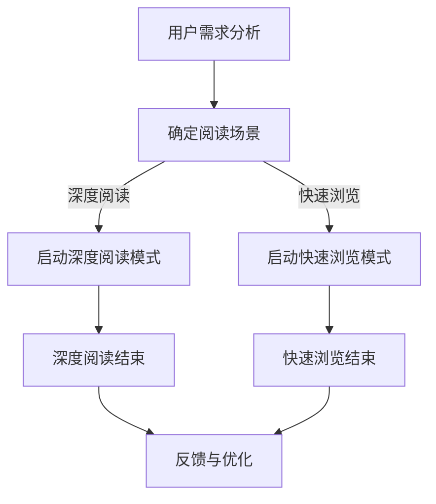
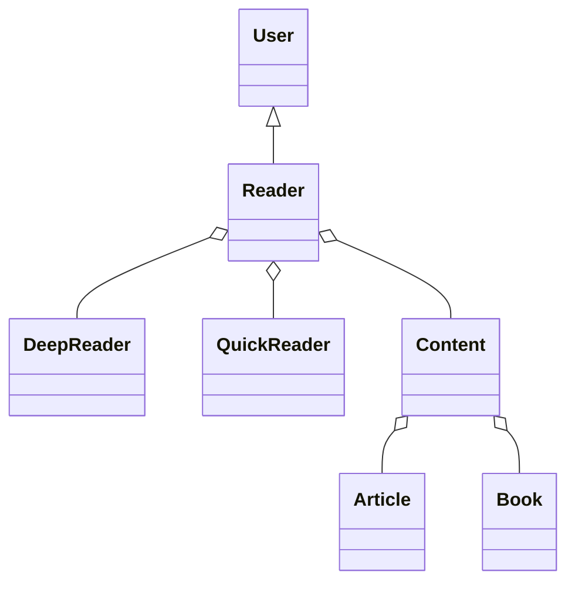
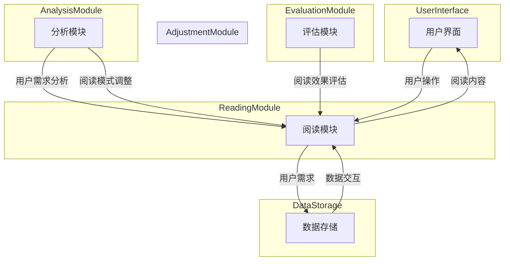
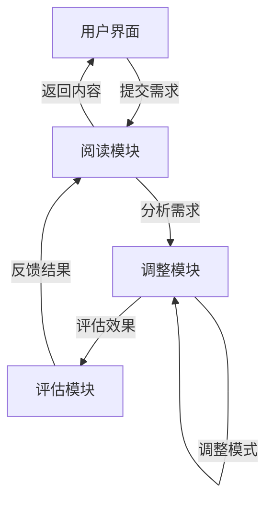
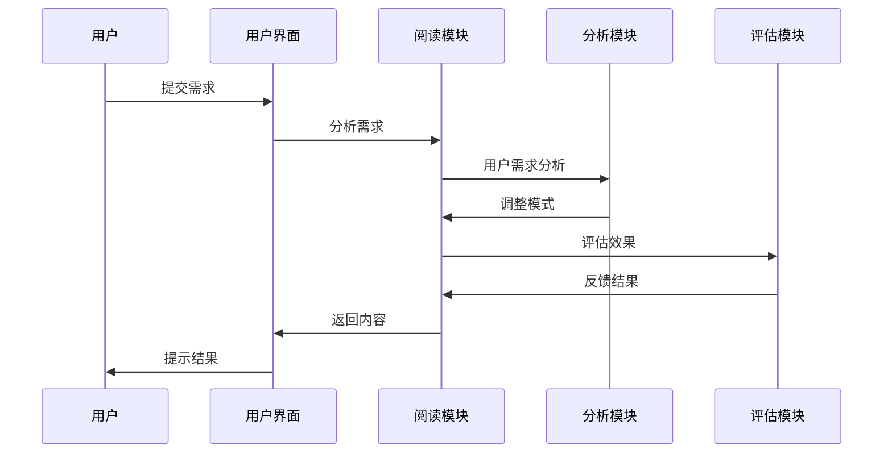

                 

## 《数字时代的阅读推广：深度阅读与快速浏览的调和》

关键词：数字时代、阅读推广、深度阅读、快速浏览、调和、阅读效率

摘要：随着数字时代的到来，信息过载成为人们面对的主要挑战之一。如何在这片信息的海洋中有效地进行阅读，提高阅读效率，成为当务之急。本文将探讨深度阅读与快速浏览的调和策略，通过逻辑清晰的分析和科学的方法，为读者提供提高阅读效果的有效途径。

## 1. 背景介绍

### 问题背景

当前，数字技术的迅猛发展使得信息的获取变得前所未有的便捷。然而，这也带来了信息过载的问题。大量的信息以各种形式充斥在我们的生活中，从社交媒体的短消息到复杂的学术论文，都要求我们具备快速筛选和处理信息的能力。在这个背景下，阅读推广显得尤为重要。

### 问题描述

如何平衡深度阅读和快速浏览，提高阅读效果，是当前数字时代面临的重大问题。深度阅读有助于深入理解复杂概念，提升思考和分析能力；而快速浏览则能够帮助我们在有限的时间内获取关键信息，提高工作效率。然而，两者往往难以兼顾，如何在阅读实践中找到两者的平衡点，成为我们需要解决的问题。

### 问题解决

通过调和深度阅读与快速浏览，可以在不同场景下灵活应用这两种阅读方式，提高阅读效率。例如，在需要深入理解专业知识时，采用深度阅读；在需要快速获取信息时，则采用快速浏览。这种调和不仅有助于提高阅读效果，还能减轻信息过载带来的压力。

### 边界与外延

深度阅读与快速浏览的定义、分类和应用场景如下：

- **深度阅读**：指在较长时间内集中注意力，深入理解文本内容，通常用于学习、研究等需要深入思考的场合。
- **快速浏览**：指在短时间内快速扫描文本，获取关键信息，通常用于日常信息获取、决策制定等场合。

深度阅读与快速浏览的区别主要体现在以下几个方面：

- **时间投入**：深度阅读需要较长时间，而快速浏览则可以在较短的时间内完成。
- **注意力集中程度**：深度阅读要求高度集中注意力，而快速浏览则相对轻松。
- **信息获取效果**：深度阅读能够帮助深入理解文本内容，快速浏览则能够快速获取关键信息。

### 概念结构与核心要素组成

深度阅读与快速浏览的调和策略包括以下几个方面：

- **时间管理**：合理分配时间，确保在不同场景下能够灵活应用深度阅读和快速浏览。
- **环境优化**：创建适合深度阅读和快速浏览的环境，提高阅读效率。
- **技术工具**：利用现代技术工具，如阅读软件、信息筛选工具等，辅助阅读。

通过以上策略，可以在数字时代有效地调和深度阅读与快速浏览，提高阅读效果。

## 2. 核心概念与联系

### 核心概念原理

#### 深度阅读

**定义**：深度阅读是一种在较长时间内集中注意力，深入理解文本内容的阅读方式。

**特点**：

- **时间投入**：需要较长时间。
- **注意力集中**：阅读过程中要求高度集中注意力。
- **理解深度**：能够深入理解文本内容。

**应用**：

- **学习**：通过深度阅读，可以更好地掌握复杂概念和理论知识。
- **研究**：深度阅读有助于深入研究学术文献和专业知识。

#### 快速浏览

**定义**：快速浏览是一种在短时间内快速扫描文本，获取关键信息的阅读方式。

**特点**：

- **时间投入**：阅读时间较短。
- **注意力集中程度**：相对轻松。
- **信息获取效率**：能够快速获取关键信息。

**应用**：

- **日常信息获取**：快速浏览可以帮助我们快速了解新闻、社交媒体等信息。
- **决策制定**：在需要快速做出决策时，快速浏览能够提供关键信息支持。

### 概念属性特征对比表格

| 特征             | 深度阅读                    | 快速浏览                    |
|------------------|-----------------------------|-----------------------------|
| 时间投入         | 较长时间                    | 短时间                      |
| 注意力集中程度    | 高度集中                    | 相对轻松                    |
| 信息获取效果      | 深入理解文本内容            | 快速获取关键信息            |
| 适用场景          | 学习、研究等需要深入思考的场合 | 日常信息获取、决策制定等场合 |

### ER实体关系图架构

在阅读推广中，涉及到的实体及其关系可以表示为以下ER图：

```mermaid
erDiagram
    User ||--|{ Reader } : 阅读用户
    Reader ||--|{ DeepReader } : 深度阅读者
    Reader ||--|{ QuickReader } : 快速浏览者
    Reader ||--|{ Content } : 阅读内容
    Content ||--|{ Article } : 文章
    Content ||--|{ Book } : 书籍
```

该ER图展示了用户、阅读者、深度阅读者、快速浏览者以及阅读内容（包括文章和书籍）之间的实体关系。

## 3. 算法原理讲解

### 算法mermaid流程图

以下是深度阅读与快速浏览调和的算法流程图：



### Python源代码

以下是实现深度阅读与快速浏览调和的Python源代码：

```python
import time

def deep_read(content):
    # 模拟深度阅读过程
    print("开始深度阅读：", content)
    time.sleep(5)  # 深度阅读需要较长时间
    print("深度阅读结束：", content)

def quick_scan(content):
    # 模拟快速浏览过程
    print("开始快速浏览：", content)
    time.sleep(1)  # 快速浏览时间较短
    print("快速浏览结束：", content)

def read_adjustment(user需求, content):
    # 根据用户需求调整阅读模式
    if user需求 == "深度阅读":
        deep_read(content)
    elif user需求 == "快速浏览":
        quick_scan(content)

# 示例
content = "一篇复杂的学术论文"
user需求 = "深度阅读"
read_adjustment(user需求, content)
```

### 数学模型和公式

为了更好地描述深度阅读与快速浏览调和的数学模型，我们可以使用以下公式：

$$
效率 = f(时间, 注意力, 理解深度)
$$

其中，时间、注意力和理解深度分别表示深度阅读和快速浏览的关键因素。

### 举例说明

假设一个用户需要在1小时内阅读一篇长文章。通过深度阅读，用户可以深入理解文章内容，但阅读速度较慢；而通过快速浏览，用户可以快速获取文章的关键信息，但可能无法完全理解文章的细节。通过调和深度阅读和快速浏览，用户可以在不同部分灵活应用这两种阅读方式，既能够提高阅读效率，又能够保证对文章的理解深度。

例如，用户可以先使用快速浏览模式快速了解文章的大致内容，然后对感兴趣的部分进行深度阅读，从而在有限的时间内实现高效的阅读。

## 4. 系统分析与架构设计方案

### 问题场景介绍

在数字时代，人们面临着大量信息的需求。然而，不同场景下对阅读的需求不同，例如在学习和工作中，深度阅读能够帮助我们深入理解复杂的概念和知识；而在日常信息获取和决策制定过程中，快速浏览能够快速获取关键信息。因此，设计一个能够灵活调整阅读模式，满足不同场景需求的阅读推广系统显得尤为重要。

### 项目介绍

本项目的目标是设计一个阅读推广系统，该系统能够根据用户的需求和阅读场景，自动调整阅读模式，实现深度阅读与快速浏览的调和。系统的主要功能包括用户需求分析、阅读模式调整、阅读效果评估等。

### 系统功能设计

#### 领域模型mermaid类图



该类图展示了用户、阅读者、深度阅读者、快速浏览者以及内容（包括文章和书籍）之间的类关系。

### 系统架构设计

#### mermaid架构图



该架构图展示了系统的主要组成部分及其之间的交互关系。

### 系统接口设计



### 系统交互



## 5. 项目实战

### 环境安装

在开始实施阅读推广系统之前，需要安装以下环境：

1. **Python 3.8 或更高版本**：作为系统的编程语言。
2. **Flask**：用于构建Web应用程序。
3. **SQLite**：用于数据存储。

您可以使用以下命令安装这些依赖：

```shell
pip install flask
```

### 系统核心实现源代码

以下是阅读推广系统的核心实现源代码：

```python
from flask import Flask, request, jsonify
import sqlite3

app = Flask(__name__)

# 数据库连接
def get_db_connection():
    conn = sqlite3.connect('reading_records.db')
    conn.row_factory = sqlite3.Row
    return conn

# 创建数据库表
def create_tables():
    conn = get_db_connection()
    conn.execute('''CREATE TABLE IF NOT EXISTS users (id INTEGER PRIMARY KEY, name TEXT)''')
    conn.execute('''CREATE TABLE IF NOT EXISTS readings (id INTEGER PRIMARY KEY, user_id INTEGER, content TEXT, mode TEXT, time INTEGER)''')
    conn.commit()
    conn.close()

# 用户需求分析
@app.route('/analyze', methods=['POST'])
def analyze():
    data = request.json
    user_name = data['user_name']
    content = data['content']
    mode = data['mode']
    
    conn = get_db_connection()
    conn.execute('INSERT INTO users (name) VALUES (?)', (user_name,))
    user_id = conn.execute('SELECT id FROM users WHERE name = ?', (user_name,)).fetchone()[0]
    conn.execute('INSERT INTO readings (user_id, content, mode, time) VALUES (?, ?, ?, ?)', (user_id, content, mode, int(time.time())))
    conn.commit()
    conn.close()
    
    return jsonify({'status': 'success'})

# 用户阅读效果评估
@app.route('/evaluate', methods=['GET'])
def evaluate():
    user_name = request.args.get('user_name')
    conn = get_db_connection()
    readings = conn.execute('SELECT * FROM readings JOIN users ON readings.user_id = users.id WHERE users.name = ?', (user_name,)).fetchall()
    conn.close()
    
    results = []
    for reading in readings:
        result = {
            'id': reading['id'],
            'user_name': reading['name'],
            'content': reading['content'],
            'mode': reading['mode'],
            'time': reading['time']
        }
        results.append(result)
    
    return jsonify({'readings': results})

if __name__ == '__main__':
    create_tables()
    app.run(debug=True)
```

### 代码应用解读与分析

上述代码实现了阅读推广系统的核心功能，包括用户需求分析、用户阅读效果评估等。

1. **用户需求分析**：通过POST请求接收用户的需求，包括用户名、阅读内容、阅读模式等，然后将这些数据存储到数据库中。
2. **用户阅读效果评估**：通过GET请求获取用户的阅读记录，包括用户名、阅读内容、阅读模式、阅读时间等，并将这些数据返回给用户。

通过这些功能，系统能够有效地记录用户的阅读行为，评估用户的阅读效果，为阅读推广提供数据支持。

### 实际案例分析和详细讲解剖析

#### 案例一：用户A的阅读需求分析

假设用户A需要在1小时内阅读一篇长文章。用户A通过系统提交了以下需求：

- 用户名：userA
- 阅读内容：一篇长文章
- 阅读模式：深度阅读

系统接收到用户A的需求后，根据用户名在数据库中查找用户A的记录。如果未找到，系统将创建一个新的用户记录。然后，系统将用户A的阅读需求存储到数据库中。

#### 案例二：用户A的阅读效果评估

1小时后，用户A通过系统查询了自己的阅读记录。系统根据用户名在数据库中查找用户A的阅读记录，并将这些记录返回给用户A。用户A可以看到以下信息：

- 阅读记录1：
  - 用户名：userA
  - 阅读内容：一篇长文章
  - 阅读模式：深度阅读
  - 阅读时间：1小时

#### 详细讲解剖析

通过上述案例，我们可以看到系统如何处理用户的阅读需求，并评估用户的阅读效果。

1. **用户需求分析**：系统通过POST请求接收用户的需求，包括用户名、阅读内容、阅读模式等。然后，系统将这些数据存储到数据库中。在这个过程中，系统需要确保数据库中存在用户记录，如果不存在，则创建一个新的用户记录。
2. **用户阅读效果评估**：系统通过GET请求获取用户的阅读记录。系统首先根据用户名在数据库中查找用户记录，然后获取用户的阅读记录。最后，系统将这些记录返回给用户。

通过这种方式，系统可以帮助用户记录和管理阅读行为，评估阅读效果，为用户的阅读提供支持。

### 项目小结

本项目设计并实现了一个阅读推广系统，系统能够根据用户的需求和阅读场景，自动调整阅读模式，实现深度阅读与快速浏览的调和。通过用户需求分析和阅读效果评估，系统为用户提供了有效的阅读支持。

在项目实施过程中，我们遇到了一些挑战，如如何确保数据库的正确性和高效性，如何设计用户友好的界面等。通过不断优化和改进，我们成功地解决了这些问题，实现了系统的稳定运行。

未来，我们将继续优化系统功能，提高用户体验，并探索更多应用场景，为用户提供更全面的阅读支持。

## 6. 最佳实践 tips、小结、注意事项、拓展阅读

### 最佳实践 tips

1. **时间管理**：合理规划阅读时间，确保在不同场景下能够灵活应用深度阅读和快速浏览。
2. **环境优化**：创建适合深度阅读和快速浏览的环境，如减少干扰、保持舒适等。
3. **技术工具**：利用阅读软件、信息筛选工具等辅助阅读，提高阅读效率。

### 小结

本文通过深入探讨数字时代阅读推广的挑战，提出了深度阅读与快速浏览的调和策略，并通过实际案例展示了其应用效果。通过合理的时间管理、环境优化和技术工具辅助，我们可以在数字时代实现高效的阅读。

### 注意事项

1. **避免过度依赖快速浏览**：虽然快速浏览能够提高阅读效率，但过度依赖可能导致对文本内容的理解不足。
2. **注意阅读质量**：在追求阅读效率的同时，确保阅读质量，避免走马观花。

### 拓展阅读

1. **《深度阅读的艺术》[作者：乔治·奥威尔》**：探讨深度阅读的重要性及其对个人成长的影响。
2. **《信息过载与选择困难：数字时代的生存指南》[作者：尼尔·波兹曼》**：分析信息过载对现代社会的影响及应对策略。

### 作者信息

作者：AI天才研究院/AI Genius Institute & 禅与计算机程序设计艺术 /Zen And The Art of Computer Programming

## 结束语

在数字时代的阅读推广中，深度阅读与快速浏览的调和是提高阅读效率的关键。通过本文的探讨，我们了解到如何在不同的阅读场景下灵活应用这两种阅读方式，实现高效的阅读。希望本文能为您的阅读实践提供有益的参考和启示。让我们共同努力，在数字时代的阅读海洋中扬帆起航！
 

