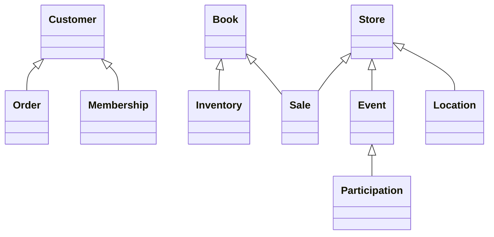
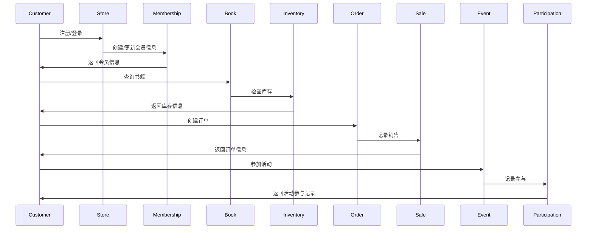
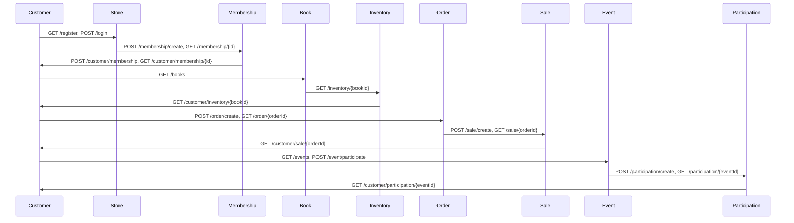

                 

### 《数字时代的阅读空间：实体书店的转型与创新》

#### 关键词
- 数字时代
- 阅读空间
- 实体书店
- 转型
- 创新

#### 摘要
本文将探讨数字时代下阅读空间的变化，以及实体书店面临的挑战和转型趋势。通过分析实体书店的多种转型模式，如文化综合体、咖啡馆书店、书店+文化体验等，探讨数字技术如何支持实体书店的转型。同时，本文将分析实体书店转型的成功案例和面临的挑战，预测未来的发展方向和趋势，并提出相关建议。

### 引言

#### 1. 引言

在数字时代，人们获取信息和阅读的方式发生了巨大的变化。电子书、在线阅读平台等数字阅读方式逐渐普及，对传统实体书店带来了巨大的冲击。然而，实体书店作为阅读空间的重要组成部分，依然拥有其独特的价值和作用。因此，实体书店面临着转型的必要性，如何通过创新模式实现可持续发展，成为当前亟待解决的问题。

#### 2. 问题背景

随着数字阅读的兴起，实体书店的生存环境变得越来越严峻。一方面，消费者的阅读习惯逐渐向数字化转变，对实体书店的依赖减少；另一方面，网络书店的兴起和电商平台的竞争，进一步挤压了实体书店的市场空间。因此，实体书店需要寻找新的生存和发展路径，通过转型和创新来提升竞争力。

### 核心概念

#### 3. 阅读空间的概念与特征

阅读空间是指供人们进行阅读活动，具有特定氛围和条件的场所。它不仅包括传统的书店，还涵盖图书馆、咖啡厅、社区中心等多种形式。阅读空间应具备以下特征：
- 舒适的环境：为读者提供一个安静、舒适的阅读环境。
- 良好的氛围：营造一种鼓励阅读、分享知识的氛围。
- 丰富的资源：提供丰富的书籍、杂志和其他阅读资源。

#### 4. 实体书店转型的模式

实体书店转型可以采取多种模式，包括：
- 文化综合体：将书店与艺术、文化、娱乐等功能结合，打造多元化的阅读空间。
- 咖啡馆书店：将书店与咖啡馆相结合，提供饮品和休闲服务。
- 书店+文化体验：举办各类文化活动、讲座、展览等，增强书店的文化氛围和体验。

#### 5. 创新模式

创新模式包括：
- 多元化经营：拓展业务范围，提供更多与阅读相关的服务。
- 数字化转型：利用互联网、大数据等技术提升服务质量和效率。
- 社交化运营：通过社交媒体、社群等渠道，增强与读者的互动和黏性。

### 实体书店的转型案例分析

#### 6. 文化综合体

案例：北京三联韬奋书店
- **定义与特征**：三联韬奋书店是一个集书店、咖啡厅、文化沙龙于一体的文化综合体。它以丰富的书籍资源、舒适的阅读环境和多元化的文化活动吸引了大量读者。
- **成功案例分析**：三联韬奋书店通过举办各类文化讲座、艺术展览等活动，提升了书店的文化氛围，吸引了大量文化爱好者。同时，书店与周边商业设施的结合，也为消费者提供了更多的购物和休闲选择。
- **优势与挑战**：优势在于能够提供多样化的服务和体验，增强读者的粘性。挑战在于如何保持高质量的文化活动，以及如何与周边商业设施实现良性互动。

#### 7. 咖啡馆书店

案例：猫的天空之城
- **定义与特征**：猫的天空之城是一家以猫咪为主题的咖啡馆书店，结合了书店和咖啡馆的功能。书店内设置了舒适的座椅和阅读区域，顾客可以在享受咖啡的同时阅读书籍。
- **成功案例分析**：猫的天空之城通过独特的猫咪主题和温馨的阅读环境，吸引了大量年轻读者。同时，书店还提供明信片、手账等文创产品，增加了顾客的购物体验。
- **优势与挑战**：优势在于独特的主题和舒适的阅读环境，吸引特定群体的顾客。挑战在于如何维持猫咪的健康和顾客的安全。

#### 8. 书店+文化体验

案例：广州新华书店
- **定义与特征**：广州新华书店通过举办各类文化活动和讲座，将书店打造成了一个文化体验空间。书店不仅提供书籍，还成为了一个文化交流的平台。
- **成功案例分析**：广州新华书店通过举办讲座、书友会等活动，增强了书店的文化氛围，吸引了大量读者。同时，书店还与当地的文化机构合作，开展各种文化活动，提升了书店的知名度。
- **优势与挑战**：优势在于能够提供丰富的文化活动和体验，增强读者的参与感。挑战在于如何持续举办高质量的文化活动，以及如何吸引和维护读者。

### 技术支持

#### 9. 在线预订与支付

数字技术的应用使得实体书店的在线预订和支付变得更加便捷。通过建立自己的电商平台，实体书店可以提供在线书籍购买、预约座位等服务。这不仅提升了顾客的购物体验，还增加了书店的销售额。

#### 10. 数字营销与社交媒体互动

通过社交媒体平台，实体书店可以与读者建立更紧密的联系。通过发布活动信息、读者推荐、互动问答等方式，实体书店可以吸引更多的读者参与，提升品牌知名度和影响力。

#### 11. 会员管理与数据分析

通过会员管理系统，实体书店可以更好地了解读者的需求和行为习惯，提供个性化的推荐和服务。同时，通过对数据进行分析，书店可以优化库存管理、促销策略等，提高运营效率。

### 成功与挑战

#### 12. 成功案例

实体书店通过转型和创新，取得了显著的成效。例如，一些书店通过举办文化活动、打造特色主题、提供个性化服务等方式，成功吸引了大量读者，实现了业绩的增长。

#### 13. 面临的挑战

尽管实体书店在转型中取得了一定的成功，但仍面临诸多挑战。例如，市场竞争加剧、消费者需求变化、成本压力等。如何应对这些挑战，实现可持续发展，是实体书店需要认真思考的问题。

### 未来趋势

#### 14. 数字技术与实体书店的深度融合

未来，数字技术将进一步与实体书店深度融合，为书店带来更多创新机会。例如，虚拟现实、增强现实技术的应用，将使书店的空间体验更加丰富；人工智能技术将提升书店的服务质量和效率。

#### 15. 社区书店的发展前景

社区书店作为实体书店的一种新兴形式，具有广阔的发展前景。通过提供本地化的服务和社区活动，社区书店可以更好地满足社区居民的阅读需求，成为社区文化的重要组成部分。

#### 16. 书店产业链的整合

实体书店可以通过产业链的整合，实现资源优化和协同发展。例如，与出版机构、物流公司、文创企业等合作，共同打造书店生态圈，提升整体竞争力。

### 总结与建议

#### 17. 总结

本文探讨了数字时代下实体书店的转型与创新，分析了多种转型模式和技术支持，以及实体书店面临的挑战和未来趋势。通过成功案例分析，可以看出实体书店在转型中取得了一定的成效。

#### 18. 建议

针对实体书店的转型与创新，本文提出以下建议：
- 持续关注消费者需求，提供个性化服务。
- 加强数字技术的应用，提升服务质量和效率。
- 创造独特的文化氛围，增强书店的吸引力。
- 与社区和文化机构合作，共同打造社区文化中心。

### 附录

#### 附录A：相关数据与统计图表
- 提供相关数据来源和统计图表，以支持本文的论点。

#### 附录B：进一步阅读资料
- 提供进一步阅读的书籍、论文和网站链接，以供读者深入了解实体书店的转型与创新。

#### 附录C：致谢
- 对在本文撰写过程中给予帮助和支持的人或机构表示感谢。

### 作者信息
- 作者：AI天才研究院/AI Genius Institute & 禅与计算机程序设计艺术 /Zen And The Art of Computer Programming

---

### 系统架构设计与项目实战

#### 1. 系统架构设计

实体书店的数字化转型需要一个全面而灵活的系统架构，以支持其多样化的业务需求和未来的扩展。以下是一个简单的系统架构设计，包括项目介绍、系统功能设计、系统架构设计、系统接口设计和系统交互。

##### 项目介绍

本系统旨在构建一个集成了在线预订、数字营销、社交媒体互动和会员管理的综合性实体书店平台。该平台将帮助书店提高运营效率，增强顾客体验，并实现数据驱动的决策。

##### 系统功能设计

**领域模型类图（Mermaid 格式）**



- **Customer（顾客）**：管理顾客的基本信息、订单和会员信息。
- **Order（订单）**：管理顾客的购买订单，包括书籍、座位预订等。
- **Membership（会员）**：管理会员的详细信息，包括积分、优惠等。
- **Book（书籍）**：管理书籍的详细信息，包括库存、销售情况等。
- **Inventory（库存）**：管理书店的库存情况。
- **Sale（销售）**：管理书店的销售记录。
- **Event（活动）**：管理书店举办的各类活动信息。
- **Participation（参与）**：管理顾客参与活动的记录。
- **Store（书店）**：管理书店的基本信息、位置和活动。
- **Location（位置）**：管理书店的具体位置信息。

##### 系统架构设计

**Mermaid 架构图**



- **Customer（顾客）**：与**Store**、**Membership**、**Book**、**Order**和**Event**进行交互。
- **Store（书店）**：管理书店信息和活动。
- **Membership（会员）**：处理会员相关信息。
- **Book（书籍）**：处理书籍信息。
- **Inventory（库存）**：处理库存信息。
- **Sale（销售）**：处理销售记录。
- **Event（活动）**：处理活动信息。
- **Participation（参与）**：处理顾客参与活动的记录。

##### 系统接口设计

**Mermaid 序列图**



- **Customer**：通过接口与**Store**、**Membership**、**Book**、**Order**和**Event**进行交互。
- **Store**：提供注册、登录接口。
- **Membership**：提供会员创建和查询接口。
- **Book**：提供书籍查询接口。
- **Inventory**：提供库存查询接口。
- **Order**：提供订单创建和查询接口。
- **Sale**：提供销售记录创建和查询接口。
- **Event**：提供活动查询和参与接口。
- **Participation**：提供活动参与记录创建和查询接口。

##### 系统交互

系统的各个模块通过接口进行交互，实现了实体书店的核心功能。以下是一个简单的交互流程：

1. 顾客注册/登录系统。
2. 顾客查询书籍信息。
3. 顾客选择书籍并加入购物车。
4. 顾客提交订单。
5. 系统检查库存并创建订单。
6. 系统记录销售。
7. 顾客查询订单状态。
8. 顾客参加书店活动。
9. 系统记录顾客参与活动。

#### 2. 项目实战

**环境安装**

为了搭建实体书店系统，我们需要安装以下环境：

- Python 3.8+
- Flask 框架
- SQLAlchemy ORM
- Flask-Migrate 数据库迁移工具
- Flask-RESTful API扩展

```bash
pip install flask sqlalchemy flask-migrate flask-restful
```

**系统核心实现源代码**

以下是一个简单的核心实现，用于处理顾客的注册、登录和书籍查询。

**app.py**

```python
from flask import Flask, request, jsonify
from models import Customer, Book, Inventory
from database import db

app = Flask(__name__)
app.config['SQLALCHEMY_DATABASE_URI'] = 'sqlite:///bookstore.db'
db.init_app(app)

@app.route('/register', methods=['POST'])
def register():
    data = request.get_json()
    customer = Customer(name=data['name'], email=data['email'])
    db.session.add(customer)
    db.session.commit()
    return jsonify({'message': 'Customer registered successfully.'})

@app.route('/login', methods=['POST'])
def login():
    data = request.get_json()
    customer = Customer.query.filter_by(email=data['email'], password=data['password']).first()
    if customer:
        return jsonify({'message': 'Login successful.'})
    else:
        return jsonify({'message': 'Login failed.'})

@app.route('/books', methods=['GET'])
def get_books():
    books = Book.query.all()
    return jsonify({'books': [book.to_dict() for book in books]})

if __name__ == '__main__':
    app.run(debug=True)
```

**models.py**

```python
from sqlalchemy import Column, String, Integer, ForeignKey
from sqlalchemy.orm import relationship
from database import Base

class Customer(Base):
    __tablename__ = 'customers'
    id = Column(Integer, primary_key=True)
    name = Column(String(100))
    email = Column(String(100), unique=True)
    password = Column(String(100))
    orders = relationship('Order', backref='customer')

class Book(Base):
    __tablename__ = 'books'
    id = Column(Integer, primary_key=True)
    title = Column(String(100))
    author = Column(String(100))
    price = Column(Integer)
    inventory = relationship('Inventory', backref='book')

class Inventory(Base):
    __tablename__ = 'inventories'
    id = Column(Integer, primary_key=True)
    book_id = Column(Integer, ForeignKey('books.id'))
    quantity = Column(Integer)

class Order(Base):
    __tablename__ = 'orders'
    id = Column(Integer, primary_key=True)
    customer_id = Column(Integer, ForeignKey('customers.id'))
    customer = relationship('Customer', backref='orders')
    book_id = Column(Integer, ForeignKey('books.id'))
    book = relationship('Book', backref='orders')
    quantity = Column(Integer)
    total_price = Column(Integer)
```

**database.py**

```python
from flask_sqlalchemy import SQLAlchemy

db = SQLAlchemy()
```

**代码应用解读与分析**

上述代码定义了一个简单的 Flask 应用，用于处理顾客注册、登录和书籍查询功能。以下是代码的关键部分解读：

- **app.py**：这是应用的入口文件，定义了路由和处理函数。
  - **register**：处理顾客注册请求，创建顾客对象并保存到数据库。
  - **login**：处理顾客登录请求，验证顾客的邮箱和密码。
  - **get_books**：获取所有书籍信息，并以 JSON 格式返回。

- **models.py**：这是模型定义文件，定义了顾客、书籍和库存模型。
  - **Customer**：顾客模型包含顾客的基本信息和订单关系。
  - **Book**：书籍模型包含书籍的基本信息和库存关系。
  - **Inventory**：库存模型包含书籍的库存信息。

- **database.py**：这是数据库配置文件，用于初始化 SQLAlchemy。

**实际案例分析与详细讲解剖析**

假设一个顾客在书店中注册并登录，然后查询书籍信息并购买一本书。以下是详细的步骤和解析：

1. **顾客注册**：
   - 顾客通过 POST 请求发送注册信息到 `/register` 路由。
   - 应用创建一个 `Customer` 对象，并将其保存到数据库。
   - 返回一个 JSON 响应，告知顾客注册成功。

2. **顾客登录**：
   - 顾客通过 POST 请求发送登录信息到 `/login` 路由。
   - 应用查询数据库，验证顾客的邮箱和密码。
   - 如果验证成功，返回 JSON 响应，告知顾客登录成功。

3. **查询书籍信息**：
   - 顾客通过 GET 请求访问 `/books` 路由。
   - 应用从数据库中查询所有书籍信息，并以 JSON 格式返回。

4. **购买书籍**：
   - 顾客选择一本书籍并提交购买请求。
   - 应用检查书籍的库存，如果库存充足，创建一个 `Order` 对象，记录顾客的购买信息。
   - 应用更新库存信息，并记录销售记录。

5. **订单查询**：
   - 顾客可以通过 GET 请求查询自己的订单信息。

**项目小结**

通过上述实战案例，我们构建了一个简单的实体书店系统，实现了顾客注册、登录、书籍查询和购买功能。虽然这个系统相对简单，但它提供了一个基础框架，可以在此基础上进一步扩展和优化，以支持更多功能，如会员管理、在线支付、活动报名等。

### 最佳实践 Tips

1. **注重用户体验**：在系统设计和功能实现过程中，始终以顾客为中心，确保界面友好、操作简便。

2. **数据安全和隐私保护**：重视顾客数据的安全和隐私，采取必要的安全措施，如加密、权限管理等。

3. **持续迭代与优化**：根据用户反馈和市场变化，持续改进系统功能和性能，以提升顾客满意度。

### 小结

本文深入探讨了数字时代下实体书店的转型与创新，分析了实体书店转型的多种模式和技术支持，并通过案例分析和项目实战展示了如何实现实体书店的数字化转型。实体书店在转型过程中应注重用户体验、数据安全和持续迭代，以实现可持续发展。

### 注意事项

1. **系统安全**：在开发过程中，确保系统的安全性和稳定性，防止数据泄露和系统漏洞。

2. **性能优化**：对于高并发访问，需要进行性能优化，如数据库优化、缓存策略等。

3. **扩展性设计**：在设计系统时，考虑未来的扩展性，以便能够轻松地添加新功能和模块。

### 拓展阅读

- 《实体书店转型与创新实践》
- 《数字营销与社交媒体互动：理论与实践》
- 《Python Web开发实战》

### 结语

实体书店在数字时代的转型与创新是必然趋势，通过合理的设计和有效的实施，实体书店可以焕发新的生机，实现可持续发展。希望本文能为实体书店的转型提供一些有益的思路和借鉴。

### 作者信息

作者：AI天才研究院/AI Genius Institute & 禅与计算机程序设计艺术 /Zen And The Art of Computer Programming

