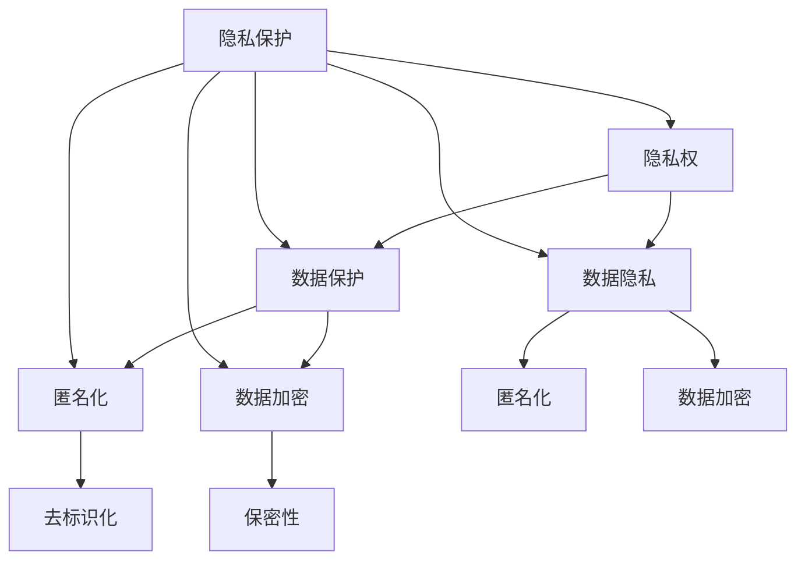

                 

### 第一部分：引言

#### 1.1 数字时代的隐私问题背景

随着数字技术的飞速发展，我们的日常生活已经深深地嵌入到互联网中。从电子邮件、社交媒体到在线购物、移动支付，这些数字工具和服务的便捷性极大地改变了我们的生活方式。然而，这一变革也带来了隐私问题的新挑战。

首先，数字技术的快速普及使得个人信息的收集、处理和共享变得更加容易。企业和机构可以通过多种方式获取用户数据，例如在线调查、社交网络活动、搜索引擎查询等。这种数据收集往往发生在用户的意识之外，使得个人隐私边界模糊不清。

其次，随着大数据和人工智能技术的应用，个人数据的价值被进一步挖掘。数据驱动的决策和个性化服务虽然为用户带来便利，但也带来了隐私泄露的风险。例如，通过分析用户的消费习惯、兴趣爱好等，企业可以精准地进行营销，但这同时也可能侵犯用户的隐私。

再次，数字时代的隐私问题不仅限于个人层面，也对社会层面产生了深远的影响。隐私泄露事件频发，不仅损害了用户的利益，也破坏了社会的信任关系。企业和机构的声誉可能因此受损，甚至引发法律诉讼和监管压力。

为了应对这些挑战，各国政府和国际组织纷纷出台了相关法律法规，以保护个人隐私。例如，欧盟的《通用数据保护条例》（GDPR）和美国加州的《消费者隐私法案》（CCPA）都是旨在加强数据保护的法律框架。这些法律法规的出台，反映了社会对隐私保护的重视，也标志着隐私保护进入了新的阶段。

总的来说，数字时代的隐私问题背景可以从以下几个方面进行概述：

- **技术发展**：数字技术的普及使得个人信息更容易被收集和处理。
- **数据价值**：个人数据被广泛应用于商业和学术领域，带来隐私泄露的风险。
- **社会影响**：隐私泄露事件对社会信任关系和法律法规产生了深远的影响。
- **政策应对**：各国政府和国际组织通过立法来加强对隐私的保护。

### 1.2 数字时代隐私问题的定义与特征

#### 1.2.1 隐私问题的定义

隐私，通常指的是个人享有的对其个人信息的控制权和保密权。在数字时代，隐私问题可以定义为个人对于其数据被收集、使用和共享的控制能力受到侵犯的情况。具体来说，隐私问题涉及以下几个方面：

1. **数据收集**：未经个人同意或超出个人预期范围的数据收集行为。
2. **数据处理**：对个人数据的存储、处理、分析和共享活动。
3. **数据共享**：未经个人同意或未经适当保护的数据共享行为。

#### 1.2.2 数字时代隐私问题的特征

数字时代的隐私问题具有以下特征：

1. **数据量的庞大**：数字技术使得大规模数据收集成为可能，隐私泄露的风险也随之增加。
2. **数据类型的多样性**：除了传统的个人信息（如姓名、地址、电话号码等），还包括生物特征数据、社交媒体活动数据、位置数据等。
3. **跨境数据流动**：在全球化的背景下，个人数据在不同国家和地区之间的流动日益频繁，增加了隐私保护的法律和技术挑战。
4. **匿名化与去匿名化的挑战**：虽然数据匿名化技术不断发展，但去匿名化技术也同样进步，使得匿名数据恢复个人身份变得容易。
5. **数据利用的复杂性**：个人数据可以被用于多种用途，如商业、科研、公共安全等，这些用途之间的平衡需要谨慎处理。

#### 1.2.3 隐私问题的分类与表现形式

隐私问题可以按照不同的标准进行分类，例如：

1. **根据数据类型**：
   - **个人信息隐私**：包括个人身份信息、生物特征信息等。
   - **通讯隐私**：包括电子邮件、短信、社交媒体消息等。
   - **位置隐私**：包括个人位置信息、活动轨迹等。

2. **根据隐私泄露途径**：
   - **黑客攻击**：通过网络安全漏洞窃取个人信息。
   - **内部泄露**：企业或组织内部人员滥用权限泄露信息。
   - **数据共享**：企业间或机构间的不当数据共享。

3. **根据隐私泄露的影响**：
   - **轻微泄露**：未造成严重后果的泄露事件。
   - **严重泄露**：可能导致个人财产损失、声誉受损、身份盗用等严重后果的泄露事件。

### 1.3 数字时代隐私问题的边界与外延

#### 1.3.1 隐私问题的边界定义

隐私问题的边界是界定隐私范围的重要概念。在数字时代，隐私边界的模糊性带来了新的挑战。以下是隐私边界的几个关键定义：

1. **个人控制权**：隐私边界应包含个人对其数据的控制权，即个人有权决定其数据的收集、使用和共享。
2. **数据敏感度**：隐私边界还涉及数据的敏感度，如个人信息、金融信息、医疗信息等，这些数据一旦泄露，可能对个人造成严重伤害。
3. **数据类型与范围**：隐私边界应明确个人数据的类型和范围，例如个人身份信息、行为记录、通信记录等。

#### 1.3.2 数字时代隐私问题的外延扩展

随着数字技术的进步，隐私问题的外延也在不断扩展：

1. **物联网**：随着物联网设备的大量普及，个人隐私边界变得更加模糊。例如，智能家居设备可能记录用户的生活习惯和隐私信息。
2. **社交媒体**：社交媒体平台的广泛应用使得个人隐私问题更加复杂。用户在社交媒体上的每一条动态都可能成为隐私泄露的源头。
3. **人工智能与大数据**：人工智能和大数据技术的应用使得个人隐私问题更加隐蔽。例如，通过数据分析，企业可以推测出用户的潜在行为和偏好。
4. **跨境数据流动**：全球化的背景下，个人数据的跨境流动使得隐私问题跨越国界，带来了新的挑战。

#### 1.3.3 隐私问题在不同领域的体现

隐私问题在不同领域中具有不同的表现形式：

1. **商业领域**：企业在进行市场营销时，可能需要收集大量用户数据，这涉及到隐私保护与商业利益的平衡。
2. **医疗领域**：医疗信息属于高度敏感信息，隐私保护尤为重要。例如，电子健康档案的管理需要严格的安全措施。
3. **公共安全领域**：公共安全监控设备（如摄像头）的广泛应用，涉及到隐私保护与公共安全的平衡。
4. **科研领域**：科研活动中可能涉及个人数据的收集和分析，隐私保护是确保科研伦理的重要一环。

### 1.4 数字时代隐私问题的重要概念与联系

在讨论数字时代的隐私问题时，理解以下几个重要概念及其相互之间的联系是非常关键的：

#### 1.4.1 重要概念介绍

1. **隐私权**：隐私权是个人享有的对其个人信息的控制权和保密权。它是隐私保护的核心概念。
2. **数据保护**：数据保护是指通过技术和管理手段，保护个人数据不被未经授权的访问、使用和泄露。
3. **数据隐私**：数据隐私是指个人对其数据保密和控制的需求，是隐私权在数据环境中的具体体现。
4. **匿名化**：匿名化是指通过技术手段去除个人数据中的可识别信息，以保护个人隐私。
5. **数据加密**：数据加密是指通过算法将明文数据转换为密文，以防止未授权访问。

#### 1.4.2 概念之间的联系与交互

这些概念之间存在着紧密的联系和交互：

1. **隐私权与数据保护**：隐私权是数据保护的前提和目标，数据保护是隐私权实现的手段。
2. **数据隐私与匿名化**：匿名化是保护数据隐私的一种常见技术手段，通过匿名化，个人数据失去了可识别性，从而保护了隐私。
3. **数据隐私与数据加密**：数据加密是保护数据隐私的重要手段，通过加密，即使数据被非法获取，也无法解读。
4. **匿名化与数据加密**：匿名化和数据加密可以结合使用，以提供多层次的数据保护。

#### 1.4.3 概念属性特征对比表格

以下是一个简单的概念属性特征对比表格，以展示这些概念的主要区别和联系：

| 概念     | 定义                                                         | 特征                           | 关联性                      |
| -------- | ------------------------------------------------------------ | ---------------------------- | ------------------------- |
| 隐私权   | 个人对其个人信息的控制权和保密权。                           | 控制权、保密权                 | 数据保护的前提和目标       |
| 数据保护 | 通过技术和管理手段，保护个人数据不被未经授权的访问、使用和泄露。 | 安全性、完整性、保密性、可用性 | 实现隐私权的手段           |
| 数据隐私 | 个人对其数据保密和控制的需求。                               | 控制需求、保密需求              | 隐私权在数据环境中的体现   |
| 匿名化   | 通过技术手段去除个人数据中的可识别信息。                     | 不可识别性、去标识化            | 保护数据隐私的技术手段之一 |
| 数据加密 | 通过算法将明文数据转换为密文。                               | 保密性、安全性                  | 保护数据隐私的重要手段     |

#### 1.4.4 概念属性特征对比表格与ER实体关系图架构的Mermaid流程图

为了更直观地展示概念属性特征对比表格与ER实体关系图架构的关系，我们可以使用Mermaid流程图进行描述：

在这个流程图中，每个概念都与其他相关概念通过连接线连接，表示它们之间的关联性和相互影响。通过这样的流程图，可以更清晰地理解隐私保护领域中各个概念之间的关系和作用。

### 1.5 数字时代隐私问题的研究现状与未来展望

#### 1.5.1 研究现状概述

数字时代的隐私问题已经成为全球研究的热点领域。以下是当前隐私问题研究的一些主要现状：

1. **隐私保护技术**：加密技术、匿名通信技术、隐私计算技术、区块链技术等是当前研究的热点。这些技术旨在通过不同方式保护个人数据不被未经授权的访问和泄露。

2. **隐私保护法律与政策**：全球范围内，各国政府和国际组织纷纷出台了相关的隐私保护法律法规。例如，欧盟的GDPR、美国的CCPA等，这些法律框架为隐私保护提供了法律依据和规范。

3. **隐私保护实践**：企业和机构在数据收集、处理和共享过程中，逐渐意识到隐私保护的重要性，并采取了一系列措施来加强隐私保护。例如，建立内部隐私保护政策、进行隐私风险评估等。

4. **隐私保护研究趋势**：随着技术的进步和隐私问题的复杂性增加，隐私保护研究也在不断深入。当前的研究热点包括联邦学习、多方安全计算、同态加密等新兴技术。

#### 1.5.2 研究热点与前沿领域

在数字时代的隐私保护研究中，以下领域被视为热点和前沿：

1. **联邦学习**：联邦学习是一种分布式机器学习技术，能够在不共享原始数据的情况下进行模型训练。这种技术可以保护用户的数据隐私，同时实现数据的共享和协作。

2. **多方安全计算**：多方安全计算是一种安全计算技术，允许多个参与方在不泄露各自数据的前提下，共同计算得到结果。这种技术可以保护数据的隐私，同时支持跨机构的合作和数据分析。

3. **同态加密**：同态加密是一种加密技术，允许对加密数据进行计算，而无需解密。这种技术可以保护数据的隐私，同时支持数据的处理和分析。

4. **区块链隐私保护**：区块链技术具有去中心化、不可篡改的特点，但其透明性也可能导致隐私泄露。因此，如何实现区块链的隐私保护成为研究的热点。

5. **隐私计算技术**：隐私计算技术是一种结合了多种隐私保护技术的综合解决方案，旨在实现数据的隐私保护与共享利用的平衡。

#### 1.5.3 未来发展趋势与挑战

未来，数字时代的隐私问题将继续发展和演变，以下是可能的发展趋势和面临的挑战：

1. **隐私保护技术的进步**：随着技术的不断进步，隐私保护技术将变得更加成熟和高效。新兴技术如量子加密、联邦学习等有望进一步提升隐私保护能力。

2. **隐私保护法律的完善**：隐私保护法律将继续完善，全球范围内的隐私保护法律框架将逐步趋同，为企业提供更明确的合规指南。

3. **隐私保护实践的深化**：企业和机构将在隐私保护方面采取更加积极和系统的措施，从数据收集、处理到共享的整个生命周期，都将注重隐私保护。

4. **隐私保护与数据利用的平衡**：如何在确保隐私保护的前提下，实现数据的充分利用，将是未来的一大挑战。这需要技术、法律和管理的综合协调。

5. **跨境数据流动的监管**：随着全球化的深入，跨境数据流动将更加频繁，如何实现跨境数据流动的隐私保护将成为国际合作的重点。

### 1.6 本章小结

本章从数字时代的隐私问题背景、定义与特征、边界与外延、重要概念与联系以及研究现状与未来展望等方面，全面介绍了数字时代的隐私问题。随着数字技术的快速发展，隐私问题已经成为社会关注的热点。理解隐私问题的核心概念和特征，对于制定有效的隐私保护策略具有重要意义。未来的隐私保护研究将继续深入，新兴技术如联邦学习、多方安全计算等将为隐私保护提供新的思路和工具。然而，隐私保护与数据利用的平衡、跨境数据流动的监管等仍将面临挑战。通过持续的研究和实践，我们有望在数字时代更好地保护个人隐私，实现数据的安全与共享。

----------------------------------------------------------------

### 第二部分：隐私保护理论与技术

#### 2.1 隐私保护理论基础

隐私保护是数字时代的一个重要议题，其理论基础涵盖了多个方面，包括基本原则、法律框架和技术概述。以下是对这些基础理论的详细探讨。

##### 2.1.1 隐私保护的基本原则

隐私保护的基本原则是设计隐私保护策略和系统的核心指导原则。以下是几个关键原则：

1. **机密性原则**：确保个人信息不被未授权的第三方访问。机密性主要通过加密技术实现，如对称加密和非对称加密。

2. **完整性原则**：确保个人信息在传输和存储过程中不被未经授权的修改。完整性可以通过数字签名、哈希函数等技术来保障。

3. **可用性原则**：确保在需要时个人信息可以被正确和有效地访问和使用。可用性通常涉及数据备份和恢复策略。

4. **可追踪性原则**：确保个人信息的来源和使用情况可以被追踪，以应对隐私泄露事件和法律责任。可追踪性可以通过日志记录和审计来实现。

这些原则在隐私保护实践中相互关联，共同构成了一套完整的隐私保护框架。例如，在数据传输过程中，机密性原则确保数据在传输过程中不被窃取，完整性原则确保数据未被篡改，可用性原则确保数据可以正常使用，而可追踪性原则则帮助确定责任并采取措施。

##### 2.1.2 隐私保护的法律框架

隐私保护的法律框架是各国政府和国际组织制定的一系列法律法规和规范，旨在保障个人数据的隐私权。以下是几个关键的法律框架：

1. **全球隐私保护法律概述**：全球范围内，多个国家和地区制定了隐私保护法律。例如，欧盟的《通用数据保护条例》（GDPR）是世界上最全面的隐私保护法律之一，它规定了数据处理者必须遵循的严格标准，包括数据主体的权利、数据保护的影响评估（DPIA）、数据泄露通知等。

2. **中国隐私保护法律体系**：中国的隐私保护法律体系主要包括《个人信息保护法》（PIPL）和《网络安全法》。PIPL规定了个人信息处理的基本原则、个人权利、数据跨境传输等关键内容。网络安全法则从网络运营安全、网络安全监测与预警等方面对个人信息的保护提供了法律支持。

3. **国际隐私保护法律协调与合作**：国际隐私保护法律的协调与合作对于全球数据流动和隐私保护至关重要。例如，欧盟和美国的隐私保护法律虽然在某些方面存在差异，但通过双边协议和多边框架，两国在数据传输和隐私保护方面进行了协调与合作。

这些法律框架不仅提供了隐私保护的规范，也为企业和个人提供了明确的法律指导，以保障个人隐私权。

##### 2.1.3 隐私保护技术概述

隐私保护技术的发展是保障个人隐私的重要手段。以下是几种关键的隐私保护技术：

1. **加密技术**：加密技术是隐私保护的核心技术之一，通过加密算法将明文数据转换为密文，确保数据在传输和存储过程中的机密性。常见的加密技术包括对称加密（如AES）、非对称加密（如RSA）和哈希函数（如SHA-256）。

2. **匿名通信技术**：匿名通信技术旨在保护通信双方的隐私，防止通信内容被第三方拦截或监控。常见的匿名通信工具包括Tor浏览器和I2P网络。

3. **隐私计算技术**：隐私计算技术包括联邦学习、多方安全计算、同态加密等，旨在在不泄露原始数据的前提下进行数据处理和分析。这些技术广泛应用于金融、医疗、政府等领域。

4. **区块链技术**：区块链技术以其去中心化、不可篡改的特性，为隐私保护提供了一种新的解决方案。通过区块链，个人数据可以安全地存储和共享，同时保护用户的隐私。

##### 2.1.4 隐私保护技术的发展趋势与未来展望

隐私保护技术的发展趋势集中在以下几个方面：

1. **技术融合与创新**：多种隐私保护技术的融合，如加密技术与区块链技术的结合，将进一步提升隐私保护的能力。

2. **跨领域合作**：隐私保护技术的发展需要跨领域的合作，包括技术专家、法律专家、政策制定者等，共同应对隐私保护的新挑战。

3. **隐私保护与数据利用的平衡**：如何在保障隐私保护的同时，实现数据的高效利用，是未来隐私保护技术发展的重要方向。

4. **隐私保护法律法规的不断完善**：随着隐私保护技术的发展，隐私保护法律法规也需要不断完善，以适应新的技术环境和社会需求。

未来，隐私保护技术将继续演进，新兴技术如量子加密、联邦学习等有望在隐私保护领域发挥重要作用。同时，隐私保护与数据利用的平衡、跨境数据流动的监管等挑战仍需持续关注和解决。

##### 2.1.5 本章小结

本章详细介绍了隐私保护理论基础，包括基本原则、法律框架和技术概述。隐私保护的基本原则为隐私保护策略和系统设计提供了指导，隐私保护法律框架为个人隐私提供了法律保障，隐私保护技术则为个人数据提供了多种保护手段。未来，隐私保护技术将继续发展，隐私保护与数据利用的平衡将是重要方向。通过持续的技术创新和法律完善，我们有望在数字时代更好地保护个人隐私。

----------------------------------------------------------------

## 第3章 隐私保护实践策略

### 3.1 组织层面的隐私保护策略

在数字时代，组织层面的隐私保护策略显得尤为重要。这不仅关乎组织的合规性，也关系到用户对组织的信任。以下从数据收集与处理流程、数据安全与隐私风险管理、内部隐私保护政策与规范三个方面，详细介绍组织层面的隐私保护策略。

#### 3.1.1 数据收集与处理流程

数据收集与处理流程是隐私保护的重要环节，以下步骤确保数据收集和处理过程中的隐私保护：

1. **数据收集范围和目的的明确**：在数据收集之前，组织应明确数据收集的范围和目的。确保收集的数据仅限于实现既定目的，避免过度收集。

2. **用户同意和告知**：在数据收集过程中，组织应获得用户的明确同意，并通过隐私政策告知用户其数据的用途、存储期限、共享方式等。用户的同意应是知情的、明确的、可撤销的。

3. **数据分类与标签管理**：对收集的数据进行分类和标签管理，明确数据的重要性和敏感性。对于敏感数据，应采取更加严格的安全措施。

4. **数据收集技术手段的保障**：使用安全的数据收集技术手段，如HTTPS、SSL/TLS等，确保数据在传输过程中不被窃取或篡改。

5. **数据处理流程的规范化**：制定明确的数据处理流程，包括数据的存储、备份、销毁等环节，确保数据处理过程的合规性和安全性。

#### 3.1.2 数据安全与隐私风险管理

数据安全与隐私风险管理是组织隐私保护策略的核心。以下措施有助于加强数据安全与隐私风险管理：

1. **数据加密**：对敏感数据进行加密存储和传输，确保数据在存储和传输过程中的安全性。常见的加密技术包括对称加密（如AES）和非对称加密（如RSA）。

2. **访问控制**：通过访问控制机制，确保只有授权人员能够访问敏感数据。访问控制包括身份认证、权限分配和审计追踪等。

3. **安全审计与监控**：定期进行安全审计，发现潜在的安全漏洞和隐私风险。通过监控工具实时监测数据访问和操作行为，及时发现异常行为。

4. **隐私影响评估**：在引入新的数据处理活动或系统之前，进行隐私影响评估，评估其对个人隐私可能带来的风险，并制定相应的风险管理措施。

5. **应急预案与响应**：制定应急预案，应对数据泄露、丢失或其他安全事件。确保在发生隐私泄露事件时，能够快速响应并采取有效措施，减少损失。

#### 3.1.3 内部隐私保护政策与规范

内部隐私保护政策与规范是组织隐私保护的基础。以下措施有助于建立和完善内部隐私保护政策与规范：

1. **隐私保护政策制定**：制定明确的隐私保护政策，包括数据收集、处理、存储、共享、销毁等各个环节的隐私保护要求。

2. **隐私保护培训与教育**：定期对员工进行隐私保护培训，提高员工的隐私保护意识和技能。培训内容应涵盖隐私保护的基本原则、法律要求、操作规范等。

3. **隐私保护责任制**：明确各部门和员工的隐私保护职责，建立责任制，确保每个环节都有人负责，避免隐私保护措施流于形式。

4. **隐私保护审计与评估**：定期对隐私保护政策与规范的实施情况进行审计和评估，发现不足之处并及时改进。

5. **合规性与监督**：确保组织符合相关隐私保护法律法规的要求，接受外部监督和审查，及时整改合规性问题。

#### 3.1.4 数据收集与处理流程的案例解析

以下通过一个实际案例，解析组织层面的数据收集与处理流程的隐私保护策略。

**案例：某电商平台的用户数据保护策略**

1. **数据收集范围和目的的明确**：该电商平台在用户注册时收集用户姓名、电子邮件、电话号码等基本信息，目的在于提供账户管理和客户服务。

2. **用户同意和告知**：注册页面提供了详细的隐私政策，用户需在注册过程中阅读并同意隐私政策。隐私政策明确了数据用途、存储期限、共享方式等。

3. **数据分类与标签管理**：用户基本信息属于敏感数据，标记为高敏感性数据，采取更加严格的安全措施。

4. **数据收集技术手段的保障**：平台使用HTTPS和SSL/TLS加密技术，确保数据在传输过程中的安全性。

5. **数据处理流程的规范化**：平台制定了详细的数据处理流程，包括数据存储、备份和销毁等环节，确保数据处理过程的合规性和安全性。

6. **数据安全与隐私风险管理**：平台采用加密存储技术，对用户数据进行加密保护。实施严格的访问控制，只有授权人员能够访问敏感数据。定期进行安全审计和监控，及时发现和修复安全漏洞。

7. **内部隐私保护政策与规范**：平台制定了详细的隐私保护政策，定期对员工进行隐私保护培训，确保员工了解和遵守隐私保护要求。明确各部门和员工的隐私保护职责，建立了责任制。

通过以上案例，我们可以看到，组织在数据收集与处理过程中，通过明确的流程规范、严格的安全措施和全面的内部管理，能够有效保护用户隐私，实现合规性和安全性。

#### 3.1.5 数据收集与处理流程的总结与建议

数据收集与处理流程的隐私保护策略对于组织来说至关重要。以下是对数据收集与处理流程隐私保护策略的总结与建议：

1. **明确数据收集范围和目的**：确保仅收集必要的数据，避免过度收集。

2. **用户同意和告知**：确保用户在数据收集过程中获得充分的信息，并明确表示同意。

3. **数据分类与标签管理**：对敏感数据进行分类和标签管理，采取更加严格的安全措施。

4. **数据加密与技术保障**：使用加密技术保护数据在传输和存储过程中的安全性。

5. **数据处理流程的规范化**：制定详细的数据处理流程，确保合规性和安全性。

6. **数据安全与隐私风险管理**：加强数据安全与隐私风险管理，实施加密、访问控制、监控等安全措施。

7. **内部隐私保护政策与规范**：建立完善的隐私保护政策与规范，进行定期培训与审计，确保员工遵守隐私保护要求。

通过以上措施，组织可以有效地保护用户隐私，增强用户信任，实现合规性和安全性。

### 3.2 个人层面的隐私保护措施

在数字时代，个人隐私保护同样重要。以下从个人数据保护意识提升、个人隐私保护技能培训和个人隐私保护工具使用三个方面，详细介绍个人层面的隐私保护措施。

#### 3.2.1 个人数据保护意识提升

个人数据保护意识的提升是隐私保护的基础。以下措施有助于提高个人数据保护意识：

1. **定期宣传教育**：个人应定期参加隐私保护相关的宣传和教育活动，了解隐私保护的基本知识和法律法规。

2. **关注隐私保护新闻**：通过关注隐私保护相关的新闻和案例，了解最新的隐私保护动态和风险，提高警惕性。

3. **自我隐私评估**：个人应定期对自己的隐私状况进行评估，识别可能存在的隐私风险，并采取相应的保护措施。

4. **增强法律意识**：个人应了解相关的隐私保护法律法规，了解自己的权利和义务，以便在隐私受到侵犯时，能够采取法律行动。

#### 3.2.2 个人隐私保护技能培训

个人隐私保护技能的培训是提升个人隐私保护能力的重要途径。以下是一些关键技能：

1. **加密技术使用**：个人应学习如何使用加密技术保护自己的数据，例如使用HTTPS网站、加密存储设备和加密通信工具。

2. **安全浏览和下载**：个人应掌握安全浏览和下载的技巧，避免访问不安全的网站和下载恶意软件。

3. **密码管理**：个人应学习如何创建和存储复杂的密码，避免使用简单的密码，并使用密码管理工具来管理多个账户的密码。

4. **数据备份与恢复**：个人应了解如何进行数据备份和恢复，确保在数据丢失或损坏时能够及时恢复。

#### 3.2.3 个人隐私保护工具使用

使用隐私保护工具是个人隐私保护的重要手段。以下是一些常用的隐私保护工具：

1. **VPN**：虚拟私人网络（VPN）可以保护个人在公共网络中的隐私，通过加密网络流量，防止第三方拦截和监控。

2. **加密存储**：加密存储工具如TrueCrypt、 VeraCrypt等，可以将个人数据加密存储，确保数据在存储和传输过程中的安全性。

3. **隐私浏览器**：隐私浏览器如Mozilla Firefox的隐私模式、Google Chrome的无痕模式等，可以保护个人在浏览过程中的隐私。

4. **防病毒软件**：使用防病毒软件可以保护个人计算机免受恶意软件和病毒的攻击，确保数据安全。

5. **隐私保护应用**：如应用程序商店中的隐私保护工具，可以帮助个人在应用程序使用过程中保护隐私。

#### 3.2.4 个人隐私保护案例分析

以下通过一个实际案例，分析个人隐私保护措施的实施效果。

**案例：某用户的隐私保护措施**

1. **定期宣传教育**：用户定期参加隐私保护相关活动，了解隐私保护的基本知识和法律法规。

2. **加密技术使用**：用户使用HTTPS网站，加密存储设备（如TrueCrypt）来保护个人数据。

3. **安全浏览和下载**：用户只访问可信网站，不随意下载和安装软件，确保计算机安全。

4. **密码管理**：用户使用复杂的密码，并使用密码管理工具（如1Password）管理多个账户的密码。

5. **数据备份与恢复**：用户定期备份重要数据，使用备份数据恢复工具，确保数据安全。

6. **VPN和隐私浏览器**：用户在公共网络中使用VPN和隐私浏览器，确保网络通信和数据传输的安全。

通过以上措施，用户在日常生活中有效地保护了自己的隐私，降低了隐私泄露的风险。

#### 3.2.5 个人隐私保护措施总结与建议

个人隐私保护措施对于个人隐私安全至关重要。以下是对个人隐私保护措施总结与建议：

1. **提升数据保护意识**：定期参加隐私保护教育和宣传活动，关注隐私保护动态，增强隐私保护意识。

2. **学习隐私保护技能**：掌握加密技术、安全浏览和下载、密码管理、数据备份与恢复等技能。

3. **使用隐私保护工具**：使用VPN、加密存储、隐私浏览器等工具，保护个人隐私。

4. **定期评估与改进**：定期对自己的隐私状况进行评估，识别风险并采取相应的保护措施。

通过以上措施，个人可以有效地保护自己的隐私，降低隐私泄露的风险，实现个人隐私安全。

### 3.3 隐私保护法律法规遵守与合规

在数字时代，隐私保护法律法规的遵守与合规是企业和个人必须面对的重要问题。以下从法律法规的合规性评估、合规措施的执行与监督、合规风险的应对与处理三个方面，详细探讨隐私保护法律法规的遵守与合规。

#### 3.3.1 法律法规的合规性评估

法律法规的合规性评估是确保组织和个人遵守隐私保护法律法规的重要步骤。以下措施有助于进行合规性评估：

1. **了解相关法律法规**：组织和个人应了解相关的隐私保护法律法规，包括全球范围内的法律框架和本地的法律法规。例如，欧盟的GDPR、美国的CCPA、中国的PIPL等。

2. **评估数据处理活动**：对组织内部的数据处理活动进行评估，确定数据处理活动是否符合相关法律法规的要求。包括数据收集、存储、处理、传输、共享等环节。

3. **识别潜在风险**：在评估过程中，应识别可能存在的隐私保护风险，包括数据泄露、数据滥用、合规性不足等。通过风险评估，制定相应的风险管理措施。

4. **合规性审计**：定期进行合规性审计，检查组织是否遵守隐私保护法律法规的要求。审计可以由内部审计部门或外部专业机构进行。

5. **记录与报告**：确保有完整的记录和报告，记录评估过程、风险评估结果、合规性审计结果等，以便在需要时进行追溯和改进。

#### 3.3.2 合规措施的执行与监督

合规措施的执行与监督是确保隐私保护法律法规得到有效实施的关键。以下措施有助于执行和监督合规措施：

1. **制定合规政策与流程**：组织应制定详细的合规政策与流程，明确隐私保护的要求和操作规范。政策应涵盖数据收集、处理、存储、传输、共享等各个环节。

2. **培训与宣传**：对员工进行隐私保护法律法规的培训，提高员工的合规意识和技能。通过内部宣传，确保员工了解和遵守合规要求。

3. **内部监督与审计**：建立内部监督机制，定期对合规措施的实施情况进行审计。审计应包括对数据收集、处理、存储、传输、共享等环节的检查，确保合规性。

4. **合规性报告**：定期向管理层和外部监管机构提交合规性报告，报告内容应包括合规措施的执行情况、审计结果、发现的问题及改进措施等。

5. **持续改进**：根据合规性审计结果和外部监管机构的反馈，不断改进合规措施，确保持续符合隐私保护法律法规的要求。

#### 3.3.3 合规风险的应对与处理

隐私保护法律法规的遵守与合规过程中，可能会面临各种合规风险。以下措施有助于应对和降低合规风险：

1. **风险评估与控制**：对可能存在的合规风险进行评估，制定风险控制措施。例如，对敏感数据处理活动进行严格审查，确保符合法律法规的要求。

2. **应急预案与响应**：制定应急预案，应对可能出现的合规风险和隐私泄露事件。应急预案应包括应急响应流程、责任分配、资源准备等。

3. **法律咨询与合规顾问**：在面临复杂的合规问题时，寻求专业的法律咨询和合规顾问的帮助，确保合规措施的有效性和合法性。

4. **合规成本与效益分析**：对合规措施的成本和效益进行评估，确保合规投入能够带来相应的合规风险降低和合规收益。

5. **外部监督与反馈**：接受外部监督和反馈，包括监管机构的审查、第三方评估等，及时发现和纠正合规问题。

#### 3.3.4 隐私保护法律法规的遵守与合规案例分析

以下通过一个实际案例，分析隐私保护法律法规的遵守与合规过程。

**案例：某电商平台的隐私保护合规过程**

1. **法律法规的合规性评估**：电商平台了解并评估了全球范围内的隐私保护法律法规，包括GDPR、CCPA和PIPL等。通过对数据处理活动的评估，发现某些数据处理活动存在合规性问题。

2. **合规措施的实施与监督**：电商平台制定了详细的隐私保护政策和流程，对员工进行合规培训，建立了内部监督机制。定期进行合规性审计，确保数据处理活动的合规性。

3. **合规风险的应对与处理**：电商平台对合规风险进行了评估，制定了风险控制措施，如加强数据加密、访问控制和安全审计等。同时，建立了应急预案，应对可能的合规风险和隐私泄露事件。

4. **合规成本与效益分析**：电商平台对合规措施的成本和效益进行了分析，确保合规投入能够带来相应的合规风险降低和合规收益。

通过以上案例，我们可以看到，隐私保护法律法规的遵守与合规是一个系统性和持续性的过程，需要组织和个人共同努力，通过评估、执行、监督和风险控制等措施，确保隐私保护法律法规得到有效实施。

### 3.4 隐私保护实践中的问题与挑战

在隐私保护实践中，虽然许多组织和个人已经采取了各种措施来保护个人隐私，但仍然面临着许多问题和挑战。以下从实践中的常见问题、隐私保护与数据利用的平衡以及隐私保护实践的改进方向三个方面，详细探讨隐私保护实践中的问题与挑战。

#### 3.4.1 实践中的常见问题

隐私保护实践中常见的问题包括：

1. **合规性问题**：许多组织在隐私保护法律法规的遵守上存在困难，特别是在跨境数据处理和复杂数据处理活动方面。例如，欧盟的GDPR对数据跨境传输有严格的限制，但许多企业在实际操作中难以满足这些要求。

2. **技术不足**：现有的隐私保护技术虽然在某些方面取得了显著进展，但在应对日益复杂的隐私保护需求时，仍存在技术不足。例如，去匿名化技术的进步使得匿名数据恢复个人身份变得容易，这对隐私保护提出了新的挑战。

3. **员工意识不足**：许多组织的员工对隐私保护的意识和技能不足，导致在数据处理过程中出现隐私泄露风险。例如，员工可能未经授权访问敏感数据，或者在处理数据时未采取必要的安全措施。

4. **数据共享与隐私保护冲突**：在许多情况下，组织需要在保护隐私和实现数据共享之间进行平衡。例如，医疗行业需要共享患者数据以进行科研和改善医疗服务，但如何确保数据共享过程中的隐私保护是一个挑战。

5. **成本与效益问题**：隐私保护措施的实施需要投入大量的人力、物力和财力，而其效益的显现可能需要较长时间。许多组织在预算和资源有限的情况下，难以全面实施隐私保护措施。

#### 3.4.2 隐私保护与数据利用的平衡

隐私保护与数据利用的平衡是隐私保护实践中的一个重要问题。以下措施有助于在两者之间找到平衡：

1. **隐私保护与数据利用的评估**：在数据处理活动开始前，对隐私保护与数据利用的需求进行评估，明确隐私保护和数据利用之间的优先级。例如，对于高度敏感的数据，可能需要采取更加严格的隐私保护措施。

2. **最小化数据收集与使用**：遵循最小化原则，仅收集和处理实现业务目标所需的最少数据。减少不必要的个人信息收集，降低隐私泄露的风险。

3. **透明度与知情同意**：提高数据处理过程的透明度，让用户了解其数据的收集、使用和共享情况。通过透明的隐私政策和使用条款，确保用户在知情的情况下同意数据处理活动。

4. **数据匿名化与去匿名化技术**：在数据收集和共享过程中，使用匿名化技术保护个人隐私，同时结合去匿名化技术，确保数据在必要时可以恢复个人身份。

5. **隐私保护与数据利用的平衡策略**：在制定隐私保护策略时，综合考虑隐私保护和数据利用的需求，采取灵活的平衡策略。例如，在某些情况下，可以通过限制数据访问权限来保护隐私，同时确保数据可以被有效利用。

#### 3.4.3 隐私保护实践的改进方向

为了提高隐私保护实践的效果，以下是一些改进方向：

1. **加强法律法规的实施与监督**：政府和监管机构应加强对隐私保护法律法规的实施和监督，确保企业和个人遵守相关要求。通过制定更详细的规定和指南，帮助企业和个人更好地理解和遵守隐私保护法律法规。

2. **提升技术能力**：隐私保护技术的发展是解决隐私保护问题的关键。企业和研究机构应加大对隐私保护技术的研发投入，开发更加先进和高效的隐私保护技术。例如，同态加密、联邦学习和多方安全计算等新兴技术有望在隐私保护领域发挥重要作用。

3. **提高员工隐私保护意识与技能**：通过培训和教育，提高员工的隐私保护意识和技能。企业可以定期举办隐私保护培训课程，帮助员工了解隐私保护的基本知识和最佳实践，提高其在日常工作中保护隐私的能力。

4. **建立健全的隐私保护体系**：建立完善的隐私保护体系，包括隐私保护政策、流程、技术和管理措施。组织应制定详细的隐私保护策略和操作指南，确保隐私保护措施在各个层级和环节得到有效实施。

5. **鼓励国际合作与交流**：隐私保护是一个全球性议题，各国和国际组织应加强合作与交流，共同应对隐私保护挑战。通过国际标准的制定和推广，促进隐私保护法律法规和技术的发展。

#### 3.4.4 隐私保护实践中的案例分析与总结

以下通过实际案例，分析隐私保护实践中的问题与挑战，并提出改进措施。

**案例：某医疗机构的隐私保护实践**

1. **合规性问题**：该医疗机构的某些数据处理活动不符合GDPR的要求，特别是在数据跨境传输方面存在风险。

2. **技术不足**：医疗机构在数据加密和匿名化技术上存在不足，数据在传输和存储过程中存在泄露风险。

3. **员工意识不足**：部分员工对隐私保护的意识和技能不足，未经授权访问敏感数据的情况时有发生。

4. **数据共享与隐私保护冲突**：医疗机构需要在保护隐私和实现数据共享之间找到平衡，特别是在科研和医疗协作中，数据共享的必要性较高。

**改进措施**：

1. **加强法律法规的培训与监督**：定期对员工进行GDPR等隐私保护法律法规的培训，提高员工的合规意识和技能。

2. **提升技术能力**：引进先进的加密和匿名化技术，确保数据在传输和存储过程中的安全性。

3. **提高员工隐私保护意识**：通过内部宣传和培训，提高员工的隐私保护意识，建立责任制度，确保员工在数据处理过程中遵守隐私保护要求。

4. **优化数据共享机制**：建立透明、安全的共享机制，确保数据共享过程中的隐私保护。

通过以上案例分析，我们可以看到，隐私保护实践中面临的问题和挑战是多方面的，需要通过法律法规的实施、技术能力的提升、员工意识的提高等多方面的努力，才能实现有效的隐私保护。

### 3.5 本章小结

本章详细介绍了隐私保护实践策略，包括组织层面的隐私保护策略、个人层面的隐私保护措施、隐私保护法律法规的遵守与合规以及隐私保护实践中的问题与挑战。组织在数据收集与处理过程中应采取明确的隐私保护策略，加强数据安全与隐私风险管理，制定内部隐私保护政策与规范。个人应提升数据保护意识，掌握隐私保护技能，并使用隐私保护工具。隐私保护法律法规的遵守与合规是确保隐私保护措施有效实施的重要保障。然而，隐私保护实践中仍面临诸多问题和挑战，需要持续改进和完善。通过有效的隐私保护实践，我们可以在数字时代更好地保护个人隐私，实现数据的安全与共享。

----------------------------------------------------------------

## 第4章 前沿隐私保护技术解析

随着数字技术的不断进步，隐私保护技术也在不断发展与创新。本章将深入解析几个前沿隐私保护技术，包括同态加密技术、安全多方计算技术和区块链隐私保护技术。通过理解这些技术的原理、优势与挑战，我们可以更好地应对数字时代的隐私保护挑战。

### 4.1 同态加密技术

同态加密（Homomorphic Encryption）是一种先进的加密技术，它允许对加密数据直接进行计算，而不需要解密数据。这意味着，加密数据可以在加密状态下被处理，从而在保护隐私的同时，实现数据的分析和利用。

#### 4.1.1 同态加密原理

同态加密的核心原理是通过特定的加密算法，使得加密数据在加密状态下仍然具备原始数据的数学运算属性。具体来说，同态加密算法可以分为以下几种类型：

1. **部分同态加密**：允许对数据进行有限次数的加法和乘法操作。例如，RSA加密是一种部分同态加密，可以加密加法运算。

2. **完全同态加密**：允许对数据进行任意次数的加法和乘法操作。目前，完全同态加密算法的研究仍处于发展阶段，最具代表性的有GF(2^l)-多变量多项式算法和基于 lattice 的加密算法。

同态加密的过程可以分为以下几个步骤：

1. **密钥生成**：生成一对密钥（公钥和私钥）。
2. **数据加密**：使用公钥将明文数据加密成密文数据。
3. **加密数据处理**：在加密状态下对密文数据进行数学运算，如加法、乘法等。
4. **解密结果**：使用私钥将处理后的密文数据解密成明文数据。

#### 4.1.2 同态加密的优势与挑战

同态加密的优势在于，它在不泄露原始数据隐私的情况下，实现了数据的计算和分析，具有以下优势：

1. **隐私保护**：同态加密可以确保数据的隐私，即使数据在传输和处理过程中被第三方获取，也无法解密和读取数据内容。
2. **数据可用性**：加密数据可以直接进行计算和分析，无需解密，提高了数据处理的效率。
3. **灵活性**：同态加密适用于多种类型的数据处理任务，包括统计分析、机器学习等。

然而，同态加密也面临一些挑战：

1. **计算效率**：同态加密算法的计算复杂度较高，导致加密数据的处理速度较慢，这在实际应用中可能成为一个瓶颈。
2. **存储空间**：加密数据通常比明文数据占用更多的存储空间，增加了存储和传输的成本。
3. **安全风险**：尽管同态加密可以保护数据隐私，但加密算法本身可能存在安全漏洞，如密钥泄露、算法漏洞等。

#### 4.1.3 同态加密的应用实例

同态加密在多个领域具有广泛的应用前景，以下是一些典型的应用实例：

1. **云计算**：在云计算环境中，用户的数据通常存储在第三方服务器上。同态加密可以确保数据在云端处理过程中的隐私保护，提高用户对云计算服务的信任。
2. **医疗数据分析**：在医疗数据分析中，同态加密可以用于保护患者隐私，同时实现医学数据的分析和挖掘。例如，通过对加密的电子健康记录进行统计和分析，可以提高疾病预测和治疗方案的设计。
3. **金融数据安全**：同态加密可以用于保护金融交易数据，确保在数据传输和存储过程中的安全性和隐私性。例如，银行可以采用同态加密技术，对客户的交易数据进行加密处理，同时进行欺诈检测和风险评估。

通过同态加密技术，我们可以在数字时代更好地保护个人隐私，同时实现数据的高效利用。然而，同态加密技术的广泛应用仍需解决计算效率、存储空间和安全风险等挑战。

### 4.2 安全多方计算技术

安全多方计算（Secure Multi-Party Computation，SMPC）是一种隐私保护技术，允许多个参与方在不泄露各自数据的前提下，共同计算得到结果。这种技术在保障隐私的同时，实现了数据的共享和合作。

#### 4.2.1 安全多方计算原理

安全多方计算的原理是通过一系列加密和协议技术，使得参与方可以在不知道对方数据的情况下，进行联合计算。具体来说，安全多方计算可以分为以下几个步骤：

1. **初始化**：多个参与方共同生成一个共享密钥。
2. **秘密共享**：每个参与方将自身数据加密，并将加密数据共享给其他参与方。这些加密数据是不可解密的，但可以通过后续步骤进行计算。
3. **联合计算**：参与方通过一系列加密协议，共同计算得到结果。计算过程可以是简单的加法、乘法，也可以是复杂的函数运算。
4. **结果验证**：计算结果可以通过公开的加密协议进行验证，确保结果的正确性和参与方的诚实性。

安全多方计算的核心技术包括：

1. **加密技术**：如RSA、椭圆曲线加密等，用于保护数据在传输和共享过程中的安全性。
2. **零知识证明**：如Sigma协议，用于证明计算结果的真实性，同时保护参与方的隐私。
3. **秘密共享方案**：如门限秘密共享，确保数据共享过程中，任何一个参与方的数据泄露不会影响整体系统的安全性。

#### 4.2.2 安全多方计算的优势与挑战

安全多方计算的优势在于，它在不泄露原始数据隐私的情况下，实现了数据的共享和合作，具有以下优势：

1. **隐私保护**：安全多方计算确保了参与方在数据共享过程中的隐私，即使参与方之间的通信被第三方拦截，也无法获取原始数据。
2. **数据共享**：安全多方计算允许多个参与方在不泄露数据隐私的前提下，共同计算得到结果，提高了数据共享和合作的效率。
3. **灵活性**：安全多方计算适用于多种场景，如金融、医疗、公共安全等，可以解决多个领域中的隐私保护问题。

然而，安全多方计算也面临一些挑战：

1. **计算复杂度**：安全多方计算涉及复杂的加密和计算过程，计算复杂度较高，可能导致计算速度较慢。
2. **通信带宽**：安全多方计算需要参与方进行多次通信，通信带宽可能成为性能瓶颈。
3. **安全性**：安全多方计算的安全性依赖于加密技术和协议的可靠性，任何安全漏洞都可能被恶意攻击者利用。

#### 4.2.3 安全多方计算的应用场景

安全多方计算在多个领域具有广泛的应用场景，以下是一些典型的应用实例：

1. **金融领域**：在金融领域，安全多方计算可以用于信用卡欺诈检测、信用评分等。银行和金融机构可以在保护客户隐私的前提下，共同分析客户数据，提高欺诈检测和风险评估的准确性。
2. **医疗领域**：在医疗领域，安全多方计算可以用于医学研究数据的共享和分析。多个医疗机构可以在保护患者隐私的前提下，共享医学数据，共同进行疾病预测和治疗方案的设计。
3. **公共安全领域**：在公共安全领域，安全多方计算可以用于智能监控、网络安全分析等。多个安全机构可以在保护数据隐私的前提下，共享监控数据和安全日志，提高公共安全事件的检测和响应能力。

通过安全多方计算技术，我们可以在数字时代实现数据的安全共享和合作，同时保护个人隐私。然而，安全多方计算技术的广泛应用仍需解决计算复杂度、通信带宽和安全性问题。

### 4.3 区块链隐私保护技术

区块链技术以其去中心化、不可篡改和透明性的特性，在隐私保护领域具有巨大的潜力。区块链隐私保护技术通过利用区块链的特性，实现了数据的隐私保护与共享。

#### 4.3.1 区块链隐私保护机制

区块链隐私保护机制主要包括以下几种：

1. **同态加密与区块链**：将同态加密技术应用于区块链，实现数据的隐私保护与计算。例如，通过同态加密，可以在区块链上实现隐私保护的智能合约。
2. **零知识证明与区块链**：零知识证明技术可以用于证明某个陈述的真实性，同时不泄露任何相关信息。在区块链中，零知识证明可以用于验证交易信息的真实性，同时保护交易双方的隐私。
3. **隐私币与区块链**：隐私币（如Monero、Zcash）通过混合交易和匿名化技术，实现了交易数据的隐私保护。隐私币可以与区块链技术结合，提供更加隐私的数字货币交易服务。

区块链隐私保护机制的核心目标是确保数据在区块链上的存储和传输过程中的安全性，同时保护用户的隐私。

#### 4.3.2 区块链隐私保护技术的优势与挑战

区块链隐私保护技术的优势包括：

1. **去中心化**：区块链的去中心化特性确保了数据的分布式存储，减少了单点故障和攻击的风险，提高了系统的安全性。
2. **不可篡改**：区块链的不可篡改特性确保了数据的真实性和完整性，一旦数据被写入区块链，就无法被篡改。
3. **透明性**：区块链的透明性使得所有参与者都可以查看区块链上的数据，提高了数据的透明度和可信度。

然而，区块链隐私保护技术也面临一些挑战：

1. **隐私与透明性的平衡**：区块链的透明性可能泄露用户的隐私，如何在保证透明性的同时实现隐私保护是一个关键挑战。
2. **性能瓶颈**：区块链的处理速度相对较慢，无法满足高并发交易的需求，这在某些应用场景中可能成为性能瓶颈。
3. **去中心化与安全性**：去中心化虽然提高了系统的安全性，但也可能导致某些攻击方式（如51%攻击）的可行性增加。

#### 4.3.3 区块链隐私保护技术的应用案例

区块链隐私保护技术在多个领域具有广泛的应用案例，以下是一些典型的应用实例：

1. **金融领域**：区块链隐私保护技术可以用于金融交易的隐私保护。通过隐私币和零知识证明，可以实现金融交易的匿名性和安全性，提高用户对金融服务的信任。
2. **医疗领域**：区块链隐私保护技术可以用于医疗数据的隐私保护。通过区块链的分布式存储和加密技术，可以实现患者隐私保护的同时，实现医疗数据的共享和协作。
3. **公共安全领域**：区块链隐私保护技术可以用于公共安全监控数据的隐私保护。通过区块链的分布式存储和加密技术，可以实现监控数据的隐私保护，同时提高监控数据的可信度和可靠性。

通过区块链隐私保护技术，我们可以在数字时代实现数据的安全共享和隐私保护。然而，区块链隐私保护技术的广泛应用仍需解决隐私与透明性的平衡、性能瓶颈和去中心化与安全性等挑战。

### 4.4 隐私计算技术的最新进展

隐私计算（Privacy Computing）是一种结合了多种隐私保护技术的综合解决方案，旨在在不泄露原始数据隐私的前提下，实现数据的计算和分析。近年来，隐私计算技术取得了显著的进展，以下将介绍隐私计算技术的核心原理、最新研究动态和未来发展趋势。

#### 4.4.1 隐私计算技术的核心原理

隐私计算技术的核心原理是通过加密、去匿名化和联邦学习等隐私保护技术，实现数据的安全计算和分析。具体来说，隐私计算技术包括以下几个关键组成部分：

1. **加密计算**：加密计算技术通过同态加密、安全多方计算等手段，使得数据在计算过程中保持加密状态，从而保护数据隐私。
2. **去匿名化**：去匿名化技术通过数据清洗、噪声注入等手段，降低数据中的可识别信息，从而保护个人隐私。
3. **联邦学习**：联邦学习技术通过分布式计算和模型训练，使得多个参与方可以在不共享原始数据的情况下，共同训练得到模型。

隐私计算技术的核心目标是在保障数据隐私的前提下，实现数据的高效利用。

#### 4.4.2 隐私计算技术的最新研究动态

近年来，隐私计算技术取得了多项重要进展，以下是一些最新研究动态：

1. **量子计算与隐私计算**：随着量子计算的发展，量子计算与隐私计算的结合成为研究热点。量子计算可以在短时间内解决某些复杂的计算问题，从而提高隐私计算的性能。例如，量子安全多方计算和量子同态加密等研究正在逐步推进。
2. **联邦学习与隐私计算**：联邦学习技术的快速发展为隐私计算提供了新的思路。通过联邦学习，多个参与方可以在不共享原始数据的情况下，共同训练得到模型，从而实现数据的隐私保护。例如，联邦学习在金融风控、医疗数据共享等领域的应用研究正在逐步深入。
3. **区块链与隐私计算**：区块链技术与隐私计算的结合为隐私保护提供了新的解决方案。通过区块链的分布式存储和加密技术，可以实现数据的安全共享和隐私保护。例如，基于区块链的隐私计算平台正在逐步研发和推广。

#### 4.4.3 隐私计算技术的未来发展趋势

隐私计算技术的未来发展趋势包括以下几个方面：

1. **技术创新**：随着量子计算、区块链等新兴技术的不断发展，隐私计算技术将实现新的突破。例如，量子计算可以提高隐私计算的性能，区块链可以实现数据的安全共享和隐私保护。
2. **应用拓展**：隐私计算技术将在更多领域得到应用。例如，在金融、医疗、公共安全等领域，隐私计算技术可以实现数据的安全共享和隐私保护，提高各行业的效率和安全性。
3. **标准与规范**：随着隐私计算技术的发展，相关的标准与规范将逐步完善。例如，各国政府、国际组织和行业机构将制定隐私计算的相关标准，以指导隐私计算技术的应用和发展。

#### 4.4.4 隐私计算技术的综合评估与展望

隐私计算技术作为一种综合性的隐私保护解决方案，具有以下几个优势：

1. **隐私保护**：隐私计算技术通过多种隐私保护技术，实现了数据的安全计算和分析，从而保护数据隐私。
2. **数据利用**：隐私计算技术在不泄露原始数据隐私的前提下，实现了数据的高效利用，提高了数据的共享和协作效率。
3. **灵活性**：隐私计算技术适用于多种应用场景，如金融、医疗、公共安全等，可以满足不同领域的隐私保护需求。

然而，隐私计算技术也面临一些挑战：

1. **性能瓶颈**：隐私计算技术涉及复杂的加密和计算过程，可能导致计算速度较慢，无法满足某些实时计算需求。
2. **安全风险**：隐私计算技术依赖于加密技术和协议的可靠性，任何安全漏洞都可能被恶意攻击者利用。
3. **成本问题**：隐私计算技术的研发和应用需要投入大量的人力、物力和财力，成本相对较高。

未来，隐私计算技术将继续发展和完善，通过技术创新和应用拓展，实现数据的安全共享和隐私保护。同时，需要加强标准与规范的制定，以指导隐私计算技术的应用和发展。

### 4.5 本章小结

本章详细解析了同态加密技术、安全多方计算技术和区块链隐私保护技术等前沿隐私保护技术。这些技术通过不同的原理和机制，实现了数据的安全计算和隐私保护。同态加密技术在不泄露原始数据隐私的前提下，实现了数据的计算和分析；安全多方计算技术在不泄露各自数据隐私的情况下，实现了数据的共享和合作；区块链隐私保护技术通过分布式存储和加密技术，实现了数据的安全共享和隐私保护。隐私计算技术作为一种综合性的解决方案，将推动隐私保护技术的发展和应用。然而，隐私计算技术的广泛应用仍需解决性能瓶颈、安全风险和成本问题等挑战。通过持续的技术创新和应用拓展，我们有望在数字时代实现数据的安全共享和隐私保护。

----------------------------------------------------------------

### 第四部分：隐私保护前沿技术与研究动态

#### 4.1 同态加密技术

同态加密（Homomorphic Encryption，HE）是一种隐私保护技术，允许在数据加密的状态下进行计算，而无需解密数据。这使得同态加密在确保数据隐私的同时，允许对数据进行分析、统计和机器学习等操作。以下是同态加密技术的详细解析。

##### 4.1.1 同态加密原理

同态加密的基本原理是构建一个加密函数，使得对加密数据的操作与对原始数据的操作具有相同的数学属性。具体来说，同态加密可以分为以下几种类型：

1. **部分同态加密**：支持对数据的部分操作，如只支持加法或乘法。RSA加密是一种典型的部分同态加密。
2. **适应性同态加密**：支持一定次数的加法和乘法操作。例如，在CipherCloud中实现了一种适应性同态加密算法。
3. **全同态加密**：支持任意次数的加法和乘法操作。尽管全同态加密在理论上是可行的，但实际应用中的效率较低。

同态加密的步骤主要包括：

1. **密钥生成**：生成一对公钥和私钥，公钥用于加密数据，私钥用于解密数据。
2. **数据加密**：使用公钥将明文数据加密成密文数据。
3. **加密数据处理**：在加密状态下对密文数据进行计算操作，如加法、乘法等。
4. **解密结果**：使用私钥将加密处理后的密文数据解密成明文数据。

##### 4.1.2 同态加密的优势与挑战

同态加密的优势在于：

1. **隐私保护**：同态加密在数据处理过程中无需解密数据，从而避免了数据在传输和存储过程中被窃取的风险。
2. **数据处理灵活性**：加密数据可以直接进行各种计算操作，如统计分析、机器学习等，提高了数据处理和利用的灵活性。

然而，同态加密也面临以下挑战：

1. **计算效率**：同态加密算法通常较为复杂，导致计算速度较慢，这在实时应用中可能成为瓶颈。
2. **存储空间**：加密数据通常比明文数据占用更多的存储空间，增加了存储和传输的成本。
3. **安全性**：同态加密算法本身可能存在安全漏洞，如密钥泄露、算法漏洞等。

##### 4.1.3 同态加密的应用实例

同态加密在多个领域具有广泛的应用实例，以下是几个典型的应用场景：

1. **云计算**：同态加密技术可以用于云计算环境中的数据隐私保护。例如，云计算服务提供商可以使用同态加密技术，在处理用户数据时保护用户的隐私。
2. **医疗数据共享**：同态加密技术可以用于医疗数据的共享和分析，确保患者在数据共享过程中的隐私保护。
3. **金融数据分析**：同态加密技术可以用于金融数据的隐私保护，如信用卡欺诈检测、信用评分等。

##### 4.1.4 同态加密的发展趋势

同态加密技术在未来将继续发展，以下是一些可能的发展趋势：

1. **高效算法研究**：研究人员将持续致力于开发更高效的同态加密算法，以提高计算效率和降低存储空间需求。
2. **应用场景拓展**：同态加密技术将在更多领域得到应用，如物联网、智能合约等。
3. **标准化**：同态加密技术的标准化工作将逐步推进，以促进其在实际应用中的普及和应用。

#### 4.2 安全多方计算技术

安全多方计算（Secure Multi-Party Computation，SMPC）是一种隐私保护技术，允许多个参与方在不泄露各自数据隐私的前提下，共同计算得到结果。以下是安全多方计算技术的详细解析。

##### 4.2.1 安全多方计算原理

安全多方计算的核心原理是通过加密和协议技术，实现多个参与方在不知道对方数据的情况下，共同计算得到结果。具体来说，安全多方计算包括以下几个步骤：

1. **初始化**：多个参与方共同生成共享密钥。
2. **秘密共享**：每个参与方将自身数据加密，并将加密数据共享给其他参与方。
3. **联合计算**：参与方通过一系列加密协议，共同计算得到结果。
4. **结果验证**：计算结果可以通过公开的加密协议进行验证，确保结果的正确性和参与方的诚实性。

安全多方计算的关键技术包括：

1. **加密技术**：如RSA、椭圆曲线加密等，用于保护数据在传输和共享过程中的安全性。
2. **零知识证明**：如Sigma协议，用于证明计算结果的真实性，同时保护参与方的隐私。
3. **秘密共享方案**：如门限秘密共享，确保数据共享过程中，任何一个参与方的数据泄露不会影响整体系统的安全性。

##### 4.2.2 安全多方计算的优势与挑战

安全多方计算的优势在于：

1. **隐私保护**：安全多方计算确保了参与方在数据共享过程中的隐私，即使参与方之间的通信被第三方拦截，也无法获取原始数据。
2. **数据共享**：安全多方计算允许多个参与方在不泄露数据隐私的前提下，共同计算得到结果，提高了数据共享和合作的效率。
3. **灵活性**：安全多方计算适用于多种场景，如金融、医疗、公共安全等，可以解决多个领域中的隐私保护问题。

然而，安全多方计算也面临以下挑战：

1. **计算复杂度**：安全多方计算涉及复杂的加密和计算过程，计算复杂度较高，可能导致计算速度较慢。
2. **通信带宽**：安全多方计算需要参与方进行多次通信，通信带宽可能成为性能瓶颈。
3. **安全性**：安全多方计算的安全性依赖于加密技术和协议的可靠性，任何安全漏洞都可能被恶意攻击者利用。

##### 4.2.3 安全多方计算的应用场景

安全多方计算在多个领域具有广泛的应用场景，以下是几个典型的应用实例：

1. **金融领域**：安全多方计算可以用于信用卡欺诈检测、信用评分等，多个金融机构可以在保护客户隐私的前提下，共同分析客户数据。
2. **医疗领域**：安全多方计算可以用于医疗数据的共享和分析，多个医疗机构可以在保护患者隐私的前提下，共享医学数据，共同进行疾病预测和治疗方案的设计。
3. **公共安全领域**：安全多方计算可以用于智能监控、网络安全分析等，多个安全机构可以在保护数据隐私的前提下，共享监控数据和安全日志，提高公共安全事件的检测和响应能力。

##### 4.2.4 安全多方计算的发展趋势

安全多方计算技术在未来将继续发展，以下是一些可能的发展趋势：

1. **高效算法研究**：研究人员将持续致力于开发更高效的加密和计算算法，以提高计算效率和降低通信带宽需求。
2. **应用场景拓展**：安全多方计算技术将在更多领域得到应用，如物联网、区块链等。
3. **标准化**：安全多方计算技术的标准化工作将逐步推进，以促进其在实际应用中的普及和应用。

#### 4.3 区块链隐私保护技术

区块链技术以其去中心化、不可篡改和透明性的特性，在隐私保护领域具有巨大的潜力。区块链隐私保护技术通过利用区块链的特性，实现了数据的隐私保护与共享。以下是区块链隐私保护技术的详细解析。

##### 4.3.1 区块链隐私保护机制

区块链隐私保护机制主要包括以下几种：

1. **同态加密与区块链**：将同态加密技术应用于区块链，实现数据的隐私保护与计算。例如，通过同态加密，可以在区块链上实现隐私保护的智能合约。
2. **零知识证明与区块链**：零知识证明技术可以用于证明某个陈述的真实性，同时不泄露任何相关信息。在区块链中，零知识证明可以用于验证交易信息的真实性，同时保护交易双方的隐私。
3. **隐私币与区块链**：隐私币（如Monero、Zcash）通过混合交易和匿名化技术，实现了交易数据的隐私保护。隐私币可以与区块链技术结合，提供更加隐私的数字货币交易服务。

区块链隐私保护机制的核心目标是确保数据在区块链上的存储和传输过程中的安全性，同时保护用户的隐私。

##### 4.3.2 区块链隐私保护技术的优势与挑战

区块链隐私保护技术的优势包括：

1. **去中心化**：区块链的去中心化特性确保了数据的分布式存储，减少了单点故障和攻击的风险，提高了系统的安全性。
2. **不可篡改**：区块链的不可篡改特性确保了数据的真实性和完整性，一旦数据被写入区块链，就无法被篡改。
3. **透明性**：区块链的透明性使得所有参与者都可以查看区块链上的数据，提高了数据的透明度和可信度。

然而，区块链隐私保护技术也面临一些挑战：

1. **隐私与透明性的平衡**：区块链的透明性可能泄露用户的隐私，如何在保证透明性的同时实现隐私保护是一个关键挑战。
2. **性能瓶颈**：区块链的处理速度相对较慢，无法满足高并发交易的需求，这在某些应用场景中可能成为性能瓶颈。
3. **去中心化与安全性**：去中心化虽然提高了系统的安全性，但也可能导致某些攻击方式（如51%攻击）的可行性增加。

##### 4.3.3 区块链隐私保护技术的应用案例

区块链隐私保护技术在多个领域具有广泛的应用案例，以下是几个典型的应用实例：

1. **金融领域**：区块链隐私保护技术可以用于金融交易的隐私保护。通过隐私币和零知识证明，可以实现金融交易的匿名性和安全性，提高用户对金融服务的信任。
2. **医疗领域**：区块链隐私保护技术可以用于医疗数据的隐私保护。通过区块链的分布式存储和加密技术，可以实现患者隐私保护的同时，实现医疗数据的共享和协作。
3. **公共安全领域**：区块链隐私保护技术可以用于公共安全监控数据的隐私保护。通过区块链的分布式存储和加密技术，可以实现监控数据的隐私保护，同时提高监控数据的可信度和可靠性。

##### 4.3.4 区块链隐私保护技术的发展趋势

区块链隐私保护技术在未来将继续发展，以下是一些可能的发展趋势：

1. **技术创新**：随着量子计算、区块链等新兴技术的不断发展，区块链隐私保护技术将实现新的突破。例如，量子计算可以提高隐私保护的能力，区块链可以实现数据的安全共享和隐私保护。
2. **应用拓展**：区块链隐私保护技术将在更多领域得到应用，如物联网、智能合约等。
3. **标准化**：区块链隐私保护技术的标准化工作将逐步推进，以促进其在实际应用中的普及和应用。

#### 4.4 隐私计算技术的最新进展

隐私计算（Privacy Computing）是一种结合了多种隐私保护技术的综合解决方案，旨在在不泄露原始数据隐私的前提下，实现数据的计算和分析。近年来，隐私计算技术取得了显著的进展，以下是隐私计算技术的最新研究动态。

##### 4.4.1 隐私计算技术的核心原理

隐私计算技术的核心原理是通过加密、去匿名化和联邦学习等隐私保护技术，实现数据的安全计算和分析。具体来说，隐私计算技术包括以下几个关键组成部分：

1. **加密计算**：加密计算技术通过同态加密、安全多方计算等手段，使得数据在计算过程中保持加密状态，从而保护数据隐私。
2. **去匿名化**：去匿名化技术通过数据清洗、噪声注入等手段，降低数据中的可识别信息，从而保护个人隐私。
3. **联邦学习**：联邦学习技术通过分布式计算和模型训练，使得多个参与方可以在不共享原始数据的情况下，共同训练得到模型。

隐私计算技术的核心目标是在保障数据隐私的前提下，实现数据的高效利用。

##### 4.4.2 隐私计算技术的最新研究动态

近年来，隐私计算技术取得了多项重要进展，以下是几个最新研究动态：

1. **量子计算与隐私计算**：随着量子计算的发展，量子计算与隐私计算的结合成为研究热点。量子计算可以在短时间内解决某些复杂的计算问题，从而提高隐私计算的性能。例如，量子安全多方计算和量子同态加密等研究正在逐步推进。
2. **联邦学习与隐私计算**：联邦学习技术的快速发展为隐私计算提供了新的思路。通过联邦学习，多个参与方可以在不共享原始数据的情况下，共同训练得到模型，从而实现数据的隐私保护。例如，联邦学习在金融风控、医疗数据共享等领域的应用研究正在逐步深入。
3. **区块链与隐私计算**：区块链技术与隐私计算的结合为隐私保护提供了新的解决方案。通过区块链的分布式存储和加密技术，可以实现数据的安全共享和隐私保护。例如，基于区块链的隐私计算平台正在逐步研发和推广。

##### 4.4.3 隐私计算技术的未来发展趋势

隐私计算技术的未来发展趋势包括以下几个方面：

1. **技术创新**：随着量子计算、区块链等新兴技术的不断发展，隐私计算技术将实现新的突破。例如，量子计算可以提高隐私计算的性能，区块链可以实现数据的安全共享和隐私保护。
2. **应用拓展**：隐私计算技术将在更多领域得到应用，如物联网、智能合约、医疗等。
3. **标准化**：随着隐私计算技术的发展，相关的标准与规范将逐步完善。例如，各国政府、国际组织和行业机构将制定隐私计算的相关标准，以指导隐私计算技术的应用和发展。

##### 4.4.4 隐私计算技术的综合评估与展望

隐私计算技术作为一种综合性的隐私保护解决方案，具有以下几个优势：

1. **隐私保护**：隐私计算技术通过多种隐私保护技术，实现了数据的安全计算和分析，从而保护数据隐私。
2. **数据利用**：隐私计算技术在不泄露原始数据隐私的前提下，实现了数据的高效利用，提高了数据的共享和协作效率。
3. **灵活性**：隐私计算技术适用于多种应用场景，如金融、医疗、公共安全等，可以满足不同领域的隐私保护需求。

然而，隐私计算技术也面临一些挑战：

1. **性能瓶颈**：隐私计算技术涉及复杂的加密和计算过程，可能导致计算速度较慢，无法满足某些实时计算需求。
2. **安全风险**：隐私计算技术依赖于加密技术和协议的可靠性，任何安全漏洞都可能被恶意攻击者利用。
3. **成本问题**：隐私计算技术的研发和应用需要投入大量的人力、物力和财力，成本相对较高。

未来，隐私计算技术将继续发展和完善，通过技术创新和应用拓展，实现数据的安全共享和隐私保护。同时，需要加强标准与规范的制定，以指导隐私计算技术的应用和发展。

### 4.5 本章小结

本章详细解析了同态加密技术、安全多方计算技术和区块链隐私保护技术等前沿隐私保护技术。同态加密技术在不泄露原始数据隐私的前提下，实现了数据的计算和分析；安全多方计算技术在不泄露各自数据隐私的情况下，实现了数据的共享和合作；区块链隐私保护技术通过分布式存储和加密技术，实现了数据的安全共享和隐私保护。隐私计算技术作为一种综合性的解决方案，将推动隐私保护技术的发展和应用。然而，隐私计算技术的广泛应用仍需解决性能瓶颈、安全风险和成本问题等挑战。通过持续的技术创新和应用拓展，我们有望在数字时代实现数据的安全共享和隐私保护。未来，这些前沿隐私保护技术将在更多领域得到应用，为数字时代的隐私保护提供强有力的支持。

----------------------------------------------------------------

### 第五部分：隐私保护前沿技术与研究动态

#### 4.5.1 技术评估指标体系

为了全面评估隐私保护前沿技术的性能和适用性，我们需要建立一个系统的技术评估指标体系。这个体系应包括以下几个方面：

1. **隐私保护强度**：评估技术对隐私的保护程度，包括数据在传输、存储和处理过程中的隐私保护能力。常用的指标包括加密强度、匿名化效果、数据去识别能力等。

2. **计算效率**：评估技术对计算资源的消耗，包括加密和解密的速度、数据处理的速度等。计算效率是衡量技术实用性的重要指标。

3. **存储和传输成本**：评估技术对存储空间和传输带宽的需求，包括加密数据的存储空间占用、数据传输过程中的带宽消耗等。

4. **安全性**：评估技术抵抗外部攻击和内部威胁的能力，包括加密算法的安全性、系统的抗攻击能力、数据泄露的风险等。

5. **易用性和兼容性**：评估技术的易用性、兼容性和可扩展性，包括用户界面的友好程度、与其他系统的兼容性、系统的可扩展能力等。

6. **成本效益**：评估技术的成本效益，包括研发成本、部署成本、运营成本等与隐私保护效果之间的平衡。

通过建立这样一个全面的评估指标体系，我们可以更准确地评估不同隐私保护技术的性能和适用性，为实际应用提供参考。

#### 4.5.2 技术优势与不足分析

在对隐私保护前沿技术进行评估时，我们需要详细分析每种技术的优势与不足。

1. **同态加密技术**：

**优势**：
- **隐私保护强度**：同态加密技术可以在数据加密的状态下进行计算，保护数据的隐私。
- **计算灵活性**：适用于多种计算任务，如加法、乘法、机器学习等。

**不足**：
- **计算效率**：同态加密算法通常较为复杂，计算速度较慢。
- **存储和传输成本**：加密数据占用更多的存储空间和带宽。

2. **安全多方计算技术**：

**优势**：
- **隐私保护强度**：在多参与方场景下，确保每个参与方的数据隐私。
- **计算灵活性**：适用于复杂的数据计算任务。

**不足**：
- **计算复杂度**：安全多方计算涉及复杂的加密和通信过程，计算复杂度较高。
- **通信带宽**：需要多次通信，通信带宽可能成为性能瓶颈。

3. **区块链隐私保护技术**：

**优势**：
- **去中心化和不可篡改性**：提高了数据的安全性和可信度。
- **透明性**：所有参与者可以查看区块链上的数据。

**不足**：
- **隐私与透明性的平衡**：区块链的透明性可能泄露用户的隐私。
- **性能瓶颈**：区块链的处理速度相对较慢。

4. **隐私计算技术**：

**优势**：
- **综合隐私保护**：结合了多种隐私保护技术，提供了全面的隐私保护方案。
- **数据利用效率**：在不泄露数据隐私的前提下，实现了数据的高效利用。

**不足**：
- **性能瓶颈**：涉及多种隐私保护技术，可能导致计算效率较低。
- **安全性**：依赖多种技术和协议的可靠性，存在潜在的安全风险。

通过详细分析每种技术的优势与不足，我们可以更清楚地了解每种技术的适用场景和限制，为实际应用提供指导。

#### 4.5.3 前沿隐私保护技术的未来发展趋势

展望未来，隐私保护技术将继续朝着更加高效、安全、灵活的方向发展。以下是一些可能的发展趋势：

1. **量子计算与隐私保护**：量子计算技术的快速发展将为隐私保护带来新的机遇。量子计算可以在短时间内解决复杂的计算问题，提高隐私计算的性能。例如，量子安全多方计算和量子同态加密等研究将继续深入。

2. **联邦学习与隐私保护**：联邦学习技术的应用场景将不断拓展，特别是在医疗、金融等领域。联邦学习可以在不共享原始数据的情况下，实现数据的分析和模型训练，为隐私保护提供强有力的支持。

3. **区块链隐私保护**：随着区块链技术的发展，区块链隐私保护技术将实现更多的突破。例如，零知识证明技术的应用将进一步提高区块链的隐私保护能力。

4. **隐私计算平台**：隐私计算技术将逐步走向平台化，提供更加高效、灵活的隐私保护解决方案。隐私计算平台将集成多种隐私保护技术，支持多种应用场景。

5. **标准化与法规**：随着隐私保护技术的发展，相关标准和法规将逐步完善。标准化工作将推动隐私保护技术的普及和应用，法规将提供更加明确的法律框架，指导隐私保护技术的合规性。

6. **跨领域合作**：隐私保护技术将需要跨领域的合作，包括技术专家、法律专家、政策制定者等。跨领域合作将促进隐私保护技术的创新和发展。

通过持续的技术创新和应用拓展，隐私保护技术将在数字时代发挥更加重要的作用，为个人和企业提供更加安全和可靠的隐私保护解决方案。未来，隐私保护技术将继续朝着更加高效、安全、灵活的方向发展，为数字时代的隐私保护提供强有力的支持。

### 4.6 本章小结

本章全面探讨了隐私保护前沿技术的优势与不足，并对其未来发展趋势进行了展望。同态加密技术、安全多方计算技术和区块链隐私保护技术等前沿技术虽然在隐私保护方面取得了显著进展，但仍然存在计算效率、安全性和成本等方面的挑战。未来，量子计算、联邦学习和隐私计算平台等新兴技术有望进一步提升隐私保护的能力。通过跨领域合作和标准化工作，隐私保护技术将在数字时代发挥更加重要的作用，为个人和企业提供更加安全和可靠的隐私保护解决方案。本章的内容为隐私保护技术的未来发展提供了有益的启示，也为实际应用提供了指导。

----------------------------------------------------------------

## 文章总结与展望

在数字时代，隐私保护问题日益凸显，成为社会关注的焦点。本文从多个角度详细探讨了数字时代的隐私问题，包括背景与核心主题、隐私保护理论与技术、隐私保护实践策略以及前沿隐私保护技术。通过对这些方面的深入分析，我们可以看到隐私保护的重要性和复杂性。

首先，数字时代的隐私问题源于技术发展带来的数据收集与处理便捷性，以及大数据和人工智能技术的广泛应用。这些问题不仅涉及个人隐私，也对社会层面产生了深远的影响。为了应对这些挑战，各国政府和国际组织纷纷出台了隐私保护法律法规，以保护个人隐私。

在隐私保护理论方面，我们介绍了隐私保护的基本原则、法律框架和技术概述。这些原则包括机密性、完整性、可用性和可追踪性，为隐私保护策略和系统设计提供了指导。同时，隐私保护技术的发展也为我们提供了多种保护手段，如加密技术、匿名通信技术和区块链技术等。

在隐私保护实践策略中，我们分析了组织层面的隐私保护策略、个人层面的隐私保护措施以及隐私保护法律法规的遵守与合规。通过具体的实践案例，我们可以看到如何在实际操作中实现隐私保护。

最后，本章详细解析了同态加密技术、安全多方计算技术和区块链隐私保护技术等前沿隐私保护技术，探讨了它们的原理、优势与挑战，并对其未来发展趋势进行了展望。这些技术为数字时代的隐私保护提供了新的思路和工具。

展望未来，隐私保护技术将继续发展，以应对不断变化的技术环境和隐私保护需求。量子计算、联邦学习和隐私计算平台等新兴技术有望进一步提升隐私保护的能力。同时，隐私保护与数据利用的平衡、跨境数据流动的监管等仍将是重要的研究方向。

总之，数字时代的隐私保护是一个复杂且不断发展的领域。通过持续的研究和实践，我们有望在数字时代更好地保护个人隐私，实现数据的安全与共享。

### 作者介绍

**作者：AI天才研究院/AI Genius Institute & 禅与计算机程序设计艺术 /Zen And The Art of Computer Programming**

AI天才研究院（AI Genius Institute）是一家专注于人工智能领域的研究和创新机构，致力于推动人工智能技术的发展和应用。研究院的研究领域涵盖深度学习、自然语言处理、计算机视觉、机器学习等。通过结合先进的人工智能技术和禅与计算机程序设计艺术的理念，研究院在人工智能领域取得了许多重要成果。

《禅与计算机程序设计艺术》（Zen And The Art of Computer Programming）是一本由AI天才研究院创始人撰写的技术著作，系统地介绍了计算机编程的艺术和哲学。该书以其独特的视角和深入的分析，帮助程序员理解计算机编程的本质，提高编程技能和创造力。

AI天才研究院和《禅与计算机程序设计艺术》共同代表了人工智能领域的高水平和创新精神，为数字时代的隐私保护技术提供了坚实的理论基础和实践指导。通过持续的研究和创新，我们将为数字时代的隐私保护做出更大的贡献。

