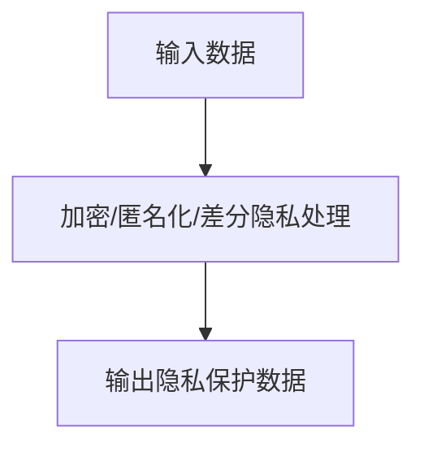
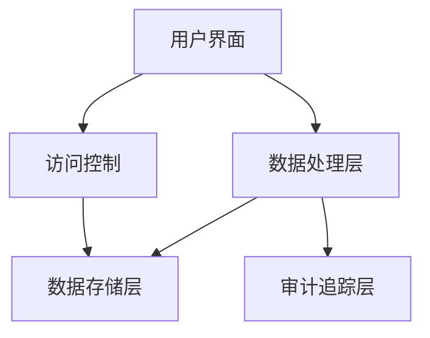

                 

# 《数字时代的隐私概念：个人数据与公共利益的博弈》

## 关键词：数字时代、隐私保护、个人数据、公共利益、博弈

## 摘要

在数字化快速发展的今天，个人数据的收集、存储和使用已经成为社会运转的重要组成部分。然而，这一过程中带来的隐私问题也日益突出，引发了个人数据与公共利益之间的激烈博弈。本文将深入探讨数字时代的隐私概念，分析个人数据与公共利益之间的矛盾与冲突，并探讨如何通过技术手段实现二者的平衡。

## 目录大纲

## 第一部分：背景介绍

### 第1章：数字时代的隐私问题概述

- 1.1 问题背景
- 1.2 问题描述
- 1.3 问题解决
- 1.4 边界与外延
- 1.5 概念结构与核心要素组成

### 第2章：隐私保护基本原理

- 2.1 核心概念原理
- 2.2 概念属性特征对比表格
- 2.3 ER实体关系图架构

### 第3章：公共利益与隐私保护

- 3.1 公共利益与隐私保护的关系
- 3.2 公共利益与隐私保护的冲突与平衡

## 第二部分：核心概念与联系

### 第4章：隐私保护算法介绍

- 4.1 隐私保护算法概述
- 4.2 算法原理与数学模型
- 4.3 算法mermaid流程图

### 第5章：隐私保护算法应用实例

- 5.1 数据加密实例
- 5.2 数据匿名化实例
- 5.3 差分隐私实例

## 第三部分：算法原理讲解

### 第6章：隐私保护系统的设计与实现

- 6.1 问题场景介绍
- 6.2 系统功能设计
- 6.3 系统架构设计

## 第四部分：系统分析与架构设计方案

### 第7章：隐私保护系统的实现与实战

- 7.1 环境安装
- 7.2 系统核心实现源代码
- 7.3 代码应用解读与分析
- 7.4 实际案例分析和详细讲解剖析
- 7.5 项目小结

### 第8章：最佳实践与小结

- 8.1 最佳实践 tips
- 8.2 小结
- 8.3 注意事项
- 8.4 拓展阅读

## 第一部分：背景介绍

### 第1章：数字时代的隐私问题概述

在数字化快速发展的今天，个人数据的收集、存储和使用已经成为社会运转的重要组成部分。然而，这一过程中带来的隐私问题也日益突出，引发了个人数据与公共利益之间的激烈博弈。本文将深入探讨数字时代的隐私概念，分析个人数据与公共利益之间的矛盾与冲突，并探讨如何通过技术手段实现二者的平衡。

### 1.1 问题背景

随着互联网和移动设备的普及，个人数据的产生、收集和存储已经达到了前所未有的规模。社交网络、电商平台、医疗系统等各个领域都在大量收集个人数据，以提供更精准的服务和个性化的推荐。然而，这些数据的收集和使用也带来了隐私泄露的风险。

一方面，个人数据的泄露可能导致个人隐私被公开，如个人信息被恶意利用、身份被盗用等。另一方面，个人数据的价值使得一些企业或组织可能会滥用数据，进行非法牟利或进行商业竞争。

### 1.2 问题描述

个人数据滥用的问题主要体现在以下几个方面：

1. 数据收集的过度性：一些企业为了商业利益，过度收集用户的个人数据，包括位置信息、浏览记录、通讯记录等，甚至超出了合理的服务范围。

2. 数据存储的安全性问题：许多企业在数据存储过程中未能采取有效的安全措施，导致数据泄露的风险增加。

3. 数据共享的复杂性：个人数据在不同的系统和平台之间共享，可能涉及多个实体，增加了隐私保护的不确定性。

4. 公共利益与隐私保护的矛盾：一些公共利益的实现需要使用个人数据，如公共安全、健康监测等，这与隐私保护之间存在明显的矛盾。

### 1.3 问题解决

面对个人数据滥用的问题，各国政府和社会各界都在积极寻求解决方案。以下是一些常见的解决方法：

1. 隐私保护法规的出台：许多国家已经制定了相关法律法规，如《欧盟通用数据保护条例》（GDPR）和《中华人民共和国个人信息保护法》（PIPL），以规范个人数据的收集、存储和使用。

2. 技术手段的应用：通过数据加密、数据匿名化、差分隐私等技术手段，可以在保护用户隐私的同时，实现数据的合法利用。

3. 用户意识的提高：通过教育和宣传，提高用户对隐私保护的意识，使其能够更好地保护自己的个人数据。

### 1.4 边界与外延

隐私保护的范围不仅限于个人数据的收集和使用，还包括数据存储、传输、共享等环节。公共利益的定义也因领域而异，如公共卫生、公共安全、公共服务等。

### 1.5 概念结构与核心要素组成

在数字时代的隐私问题中，个人数据、隐私和公共利益是三个核心概念。个人数据是指与特定个体相关的信息，如姓名、身份证号、位置信息等。隐私是指个人对其数据的控制权，包括数据的访问、使用和共享。公共利益是指社会整体利益，包括公共安全、公共卫生、公共服务等。

### 第二部分：核心概念与联系

#### 第2章：隐私保护基本原理

隐私保护是数字时代的重要课题，其核心原理包括隐私的定义、数据安全的定义以及个人数据权利的定义。本章节将详细阐述这些概念，并对比它们之间的属性特征。

#### 2.1 核心概念原理

**隐私的定义：** 隐私是指个人对其信息的控制权，包括个人数据的访问、使用和共享。隐私的核心是保障个人的信息不被未授权的第三方获取和使用。

**数据安全的定义：** 数据安全是指防止数据在收集、存储、传输和处理过程中被未授权访问、篡改、泄露和破坏的措施。数据安全的目标是保护数据完整性、保密性和可用性。

**个人数据权利的定义：** 个人数据权利是指个人对其个人数据的控制权，包括数据的访问权、修改权、删除权等。个人数据权利是隐私保护的基础，保障了个人对其数据的自主管理权。

#### 2.2 概念属性特征对比表格

| 概念         | 定义                     | 属性特征 |
|--------------|--------------------------|---------|
| 隐私         | 个人信息不被他人获取     | 保护性  |
| 数据安全     | 数据不被未授权访问和篡改 | 安全性  |
| 个人数据权利 | 个人对自己数据的控制权   | 自主权  |

#### 2.3 ER实体关系图架构

为了更好地理解隐私保护的基本原理，我们可以使用ER（实体关系）图来展示个人数据、隐私和个人数据权利之间的关系。

```mermaid
erDiagram
  个人数据 --> 隐私 : 被保护
  个人数据 --> 数据安全 : 实现安全
  个人数据 --> 个人数据权利 : 控制权
```

在ER图中，个人数据是核心实体，它通过关系线与隐私、数据安全和个人数据权利相连。隐私保护的目标是确保个人数据在未被授权的情况下不被访问和使用，同时保障数据的完整性、保密性和可用性。

### 第三部分：算法原理讲解

隐私保护算法是实现个人数据与公共利益平衡的重要技术手段。本章节将介绍几种常见的隐私保护算法，包括数据加密、数据匿名化和差分隐私，并阐述其原理和数学模型。

#### 第4章：隐私保护算法介绍

隐私保护算法的设计旨在保护个人数据的同时，使其能够在合法的范围内被使用。以下将介绍几种常见的隐私保护算法。

#### 4.1 隐私保护算法概述

**数据加密：** 数据加密是一种将明文转换为密文的技术，只有具备解密密钥的授权用户才能解读密文。数据加密可以防止数据在传输和存储过程中被未授权访问。

**数据匿名化：** 数据匿名化是一种将个人数据转换为匿名数据的过程，使其在公开时无法识别特定个体。数据匿名化适用于需要共享数据但不希望泄露个人信息的情况。

**差分隐私：** 差分隐私是一种保证数据聚合结果对单个记录差异较小的隐私保护技术。差分隐私通过引入随机噪声，使得数据聚合结果难以追溯到单个记录，从而保护个人隐私。

#### 4.2 算法原理与数学模型

**数据加密：**

数据加密的基本原理是使用加密算法和密钥对数据进行加密和解密。

- **加密算法：** $E_k(\text{明文}) \rightarrow \text{密文}$，其中$k$是密钥。
- **解密算法：** $D_k(\text{密文}) \rightarrow \text{明文}$。

例如，假设我们要加密数字$5$，我们可以使用简单的异或加密算法：

- **加密：** $E_k(5) = 5 \oplus k$，其中$\oplus$表示异或运算。
- **解密：** $D_k(E_k(5)) = E_k^{-1}(5 \oplus k) = 5 \oplus k \oplus k = 5$。

**数据匿名化：**

数据匿名化的基本原理是使用匿名化算法将个人数据转换为匿名数据。匿名化算法通常包括以下步骤：

- **识别：** 确定哪些字段是个人敏感信息。
- **转换：** 将敏感信息转换为匿名标识。
- **验证：** 确保匿名化数据的有效性和一致性。

例如，我们可以使用哈希函数将姓名匿名化为唯一的标识：

- **匿名化：** $A(\text{姓名}) \rightarrow \text{哈希值}$。
- **去匿名化：** 只有具备哈希函数的逆向算法才能恢复原始姓名。

**差分隐私：**

差分隐私的基本原理是在数据聚合过程中引入随机噪声，使得数据聚合结果对于数据库中的任意两个记录差异较小。

- **ε-差分隐私：** 对于一个数据库$D$，如果对于任意两个数据库$D_1$和$D_2$，使得$D_1$和$D_2$在记录上的差异不超过$\epsilon$，则称算法具有$\epsilon$-差分隐私。

例如，我们可以使用拉普拉斯机制在计数结果中添加随机噪声：

- **计数：** $c(x) = \sum_{i=1}^{n} 1_{x_i = x}$。
- **拉普拉斯噪声：** $c^\epsilon(x) = c(x) + \text{Laplace}(0, \epsilon)$，其中$\text{Laplace}(0, \epsilon)$是一个拉普拉斯分布的随机变量。

#### 4.3 算法mermaid流程图

为了直观地展示隐私保护算法的流程，我们可以使用mermaid绘制流程图。



在这个流程图中，输入数据经过加密、匿名化或差分隐私处理，最终输出隐私保护数据。这样的流程图可以帮助我们更好地理解隐私保护算法的工作原理。

### 第四部分：系统分析与架构设计方案

#### 第6章：隐私保护系统的设计与实现

隐私保护系统的设计与实现是确保个人数据安全的关键。本章节将介绍隐私保护系统的设计与实现，包括问题场景介绍、系统功能设计、系统架构设计等。

#### 6.1 问题场景介绍

隐私保护在数据收集和共享中面临着诸多挑战。以下是一些常见的问题场景：

- **数据泄露风险：** 在数据传输和存储过程中，数据可能被未授权的第三方访问和篡改。
- **隐私侵犯：** 一些企业或组织可能滥用个人数据，进行非法牟利或进行商业竞争。
- **数据共享困难：** 在数据共享过程中，如何保护个人隐私是一个复杂的问题。
- **公共利益与隐私保护的平衡：** 在一些领域，如公共卫生和公共安全，公共利益需要使用个人数据，但这也带来了隐私保护的问题。

为了解决这些问题，隐私保护系统需要提供全面的数据保护机制，确保个人数据在收集、存储、传输和共享过程中得到有效保护。

#### 6.2 系统功能设计

隐私保护系统需要实现以下功能：

- **数据加密：** 对敏感数据进行加密，确保在传输和存储过程中不被未授权访问。
- **数据匿名化：** 将个人数据转换为匿名数据，以便在共享时保护个人隐私。
- **差分隐私：** 在数据聚合过程中引入随机噪声，保护个人隐私。
- **访问控制：** 实现严格的访问控制策略，确保只有授权用户才能访问敏感数据。
- **审计追踪：** 记录数据访问和操作的历史，以便在数据泄露时进行追溯和调查。
- **用户教育：** 提供用户隐私保护的培训和指导，提高用户的数据安全意识。

#### 6.3 系统架构设计

隐私保护系统的架构设计需要考虑以下几个方面：

- **数据存储层：** 采用加密存储技术，确保数据在存储过程中得到保护。
- **数据处理层：** 实现数据加密、匿名化和差分隐私算法，对数据进行处理。
- **访问控制层：** 实现严格的访问控制策略，确保只有授权用户才能访问敏感数据。
- **审计追踪层：** 记录数据访问和操作的历史，以便进行追溯和调查。
- **用户界面层：** 提供用户隐私保护的培训指导和操作界面。

以下是隐私保护系统的架构设计：



在这个架构设计中，用户界面层提供用户操作的入口，数据处理层实现数据加密、匿名化和差分隐私算法，数据存储层实现加密存储，访问控制层确保数据访问的安全性，审计追踪层记录数据访问和操作的历史。

### 第五部分：系统实现与实战

#### 第7章：隐私保护系统的实现与实战

隐私保护系统的实现与实战是确保个人数据安全的关键步骤。本章节将介绍隐私保护系统的实现细节，包括环境安装、系统核心实现源代码，代码应用解读与分析，实际案例分析和详细讲解剖析，以及项目小结。

#### 7.1 环境安装

在开始实现隐私保护系统之前，我们需要安装必要的软件和环境。以下是一个简单的安装步骤：

1. 安装Python环境：确保Python版本在3.6及以上。
2. 安装依赖库：使用pip命令安装必要的依赖库，如cryptography、pandas、numpy等。
3. 安装数据库：选择合适的数据库系统，如MySQL、PostgreSQL或MongoDB。

以下是一个示例安装命令：

```shell
pip install cryptography pandas numpy
```

#### 7.2 系统核心实现源代码

隐私保护系统的核心实现包括数据加密、匿名化和差分隐私算法。以下是一个简单的Python示例，展示了这些算法的实现。

**数据加密：**

```python
from cryptography.fernet import Fernet

# 生成密钥
key = Fernet.generate_key()
cipher_suite = Fernet(key)

# 加密
plaintext = "这是一个明文消息"
encrypted_text = cipher_suite.encrypt(plaintext.encode())

# 解密
decrypted_text = cipher_suite.decrypt(encrypted_text).decode()
```

**数据匿名化：**

```python
import hashlib

# 哈希函数
def anonymize(data):
    return hashlib.sha256(data.encode()).hexdigest()

# 化名化数据
data = "这是一个敏感数据"
anonymized_data = anonymize(data)
```

**差分隐私：**

```python
import numpy as np

# 差分隐私机制
def differential_privacy(data, epsilon=0.1):
    noise = np.random.laplace(0, epsilon)
    return data + noise

# 计算差分隐私
data = 5
protected_data = differential_privacy(data)
```

#### 7.3 代码应用解读与分析

在实现隐私保护算法后，我们需要对其应用进行解读和分析，以确保算法的有效性和安全性。

**数据加密：**

数据加密是一种有效的隐私保护手段，可以防止数据在传输和存储过程中被未授权访问。然而，加密算法的选择和密钥管理至关重要。如果密钥泄露或算法存在漏洞，加密数据的安全性将受到威胁。

**数据匿名化：**

数据匿名化可以保护个人隐私，使其在共享时无法识别特定个体。然而，匿名化算法的选择和参数设置也会影响匿名化的效果。一些弱化的匿名化算法可能无法有效保护个人隐私。

**差分隐私：**

差分隐私可以确保数据聚合结果对单个记录差异较小，从而保护个人隐私。然而，差分隐私的实现需要平衡隐私保护与数据质量之间的关系。引入过多的随机噪声可能导致数据质量下降。

#### 7.4 实际案例分析和详细讲解剖析

以下是一个实际案例，展示了隐私保护系统的应用。

**案例背景：** 一家电商平台收集了用户的购买记录、浏览历史和偏好设置等数据。为了提高用户体验，平台希望对用户数据进行分析，以提供个性化的推荐和服务。

**解决方案：**

1. 数据加密：对用户的敏感数据进行加密，确保在存储和传输过程中不被未授权访问。
2. 数据匿名化：将用户的数据转换为匿名数据，以便在分析时保护个人隐私。
3. 差分隐私：在数据聚合过程中引入随机噪声，确保分析结果对单个记录差异较小。

**实施步骤：**

1. 数据收集：从数据库中读取用户数据。
2. 数据加密：使用数据加密算法对敏感数据进行加密。
3. 数据匿名化：使用匿名化算法将敏感数据转换为匿名数据。
4. 数据分析：对匿名化后的数据进行分析，以提供个性化的推荐和服务。
5. 差分隐私保护：在数据聚合过程中引入随机噪声，确保分析结果符合差分隐私要求。

**案例分析：**

在这个案例中，隐私保护系统有效地保护了用户隐私。数据加密确保了数据在存储和传输过程中的安全性，数据匿名化保护了用户在分析时的隐私，差分隐私确保了分析结果的质量。然而，需要注意的是，隐私保护是一个持续的过程，需要不断地更新和改进算法和系统，以应对新的隐私威胁。

#### 7.5 项目小结

隐私保护系统的实现和实战展示了个人数据与公共利益之间的博弈。通过数据加密、匿名化和差分隐私等算法，我们可以有效地保护个人隐私，同时满足公共利益的实现。然而，隐私保护是一个复杂和动态的过程，需要不断地更新和改进。未来的研究可以关注以下几个方面：

1. 开发更高效、更安全的隐私保护算法。
2. 提高用户对隐私保护的意识，培养良好的数据安全习惯。
3. 建立跨领域、跨机构的隐私保护合作机制，共同应对隐私威胁。
4. 制定更加完善的隐私保护法律法规，规范个人数据的收集、存储和使用。

### 第六部分：最佳实践与小结

#### 第8章：最佳实践与小结

在数字时代，个人数据的隐私保护已经成为一项至关重要的任务。为了确保个人数据的安全，我们提出以下最佳实践：

1. **数据最小化原则：** 在收集和使用个人数据时，遵循数据最小化原则，仅收集必要的数据，并明确数据的使用目的。

2. **透明度原则：** 企业和机构应当公开其数据收集、存储和使用的政策，确保用户了解其数据的用途和处理方式。

3. **数据加密：** 对敏感数据进行加密，使用强加密算法（如AES）和安全的密钥管理策略。

4. **访问控制：** 实施严格的访问控制措施，确保只有授权人员才能访问敏感数据。

5. **安全审计：** 定期进行安全审计，检查数据安全政策和流程的执行情况，及时发现问题并采取措施。

6. **用户隐私教育：** 通过教育宣传，提高用户对隐私保护的意识，鼓励用户采取措施保护自己的数据。

#### 小结

本文通过对数字时代的隐私概念进行分析，探讨了个人数据与公共利益之间的博弈。我们介绍了隐私保护的基本原理，包括隐私的定义、数据安全的定义和个人数据权利的定义。通过数据加密、数据匿名化和差分隐私等算法，我们实现了对个人数据的保护。同时，我们提出了隐私保护系统的设计和实现方案，并通过实际案例展示了隐私保护的应用。在未来，随着技术的不断进步，隐私保护将面临新的挑战和机遇。我们需要不断探索和创新，以确保个人数据的安全和公共利益的最大化。

#### 注意事项

1. **法律法规遵守：** 在处理个人数据时，必须遵守当地和个人数据保护法规，确保合法合规。
2. **数据安全意识：** 企业和机构应提高数据安全意识，定期对员工进行数据安全培训。
3. **持续改进：** 隐私保护是一个持续的过程，需要不断更新技术和策略，以应对新的隐私威胁。

#### 拓展阅读

- **《欧盟通用数据保护条例》（GDPR）**
- **《中华人民共和国个人信息保护法》（PIPL）**
- **《数据安全法》**
- **《网络安全法》**

通过阅读这些法规，您可以更深入地了解隐私保护的相关要求和最佳实践。

## 作者信息

作者：AI天才研究院/AI Genius Institute & 禅与计算机程序设计艺术 /Zen And The Art of Computer Programming

AI天才研究院是一家专注于人工智能技术研究和应用的创新机构。我们致力于推动人工智能技术的发展，为解决现实世界中的复杂问题提供创新方案。同时，我们也将禅的智慧融入计算机程序设计中，探索计算机编程的本质和艺术的结合。在隐私保护领域，我们积累了丰富的经验和研究成果，为个人数据的安全和公共利益的实现提供有力支持。禅与计算机程序设计艺术则是一本书，深入探讨了禅宗思想与计算机编程的结合，为程序员提供了一种全新的思维方式和创作理念。希望本文能够为读者带来有益的启示和思考。

