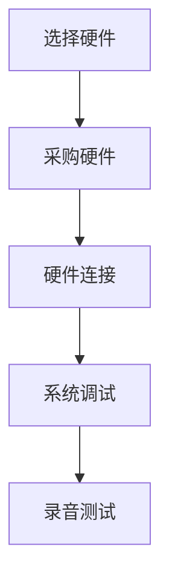
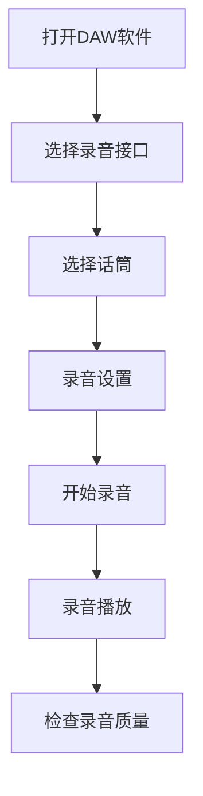

                 

# 数字时代的音乐创作：家庭录音棚的普及

关键词：数字音乐创作、家庭录音棚、数字音频工作站（DAW）、硬件设备、声音处理技术

摘要：随着数字技术的发展，音乐创作的方式发生了翻天覆地的变化。家庭录音棚的普及使得音乐创作不再局限于专业录音棚，普通音乐爱好者也可以在自己的家中进行音乐制作。本文将从背景概述、硬件选择与搭建、DAW使用技巧、声音处理技术等方面，逐步探讨家庭录音棚的普及及其带来的变革。

## 第一部分：背景与概述

### 第1章：数字时代的音乐创作环境

#### 1.1 问题背景

##### 1.1.1 音乐创作的发展历程

音乐创作的历史可以追溯到古代，最初的音乐创作主要通过口口相传，随后逐渐发展成为书面记录。到了19世纪末20世纪初，随着电声技术的出现，音乐创作的方式开始发生重大变革。录音技术的发明使得音乐可以被记录下来，而电声设备的进步使得音乐制作变得更加便捷。然而，这些技术主要仍然被专业录音棚所使用，普通音乐爱好者难以接触。

##### 1.1.2 数字时代对音乐创作的变革

数字时代的到来，特别是计算机和互联网的普及，使得音乐创作变得更加普及和多样化。数字音频工作站（DAW）的出现，使得音乐创作不再依赖于昂贵的硬件设备，普通用户只需一台电脑，就可以进行音乐制作。同时，数字音频处理技术的发展，使得音频编辑、效果制作变得更加简单和高效。

##### 1.1.3 家庭录音棚普及的意义

家庭录音棚的普及，不仅使得音乐创作变得更加便捷，也使得音乐创作的方式变得更加多样。它打破了专业录音棚的限制，让音乐创作不再受时间和地点的限制，人们可以在任何时间、任何地点进行音乐创作。此外，家庭录音棚的普及，也促进了音乐教育和音乐文化的传播，让更多的人能够接触和参与音乐创作。

#### 1.2 核心概念与联系

##### 1.2.1 数字音频工作站（DAW）的定义与功能

数字音频工作站（Digital Audio Workstation，简称DAW）是一种用于录制、编辑和制作数字音频的多功能软件或硬件系统。它提供了从音频录制、编辑、混音到最终音频输出的完整解决方案。DAW的核心功能包括：

- 录音：捕捉声音信号，将其转化为数字数据。
- 编辑：剪辑、裁剪、拼接音频片段。
- 混音：将多个音频轨混合在一起，调整音量和音效。
- 效果处理：应用各种音效和插件，如压缩器、均衡器、混响等。

##### 1.2.2 家庭录音棚的基本组成部分

家庭录音棚的基本组成部分包括：

- 录音设备：包括麦克风、录音接口等，用于捕捉声音。
- 声卡：将模拟信号转换为数字信号，或将数字信号转换为模拟信号。
- 监听设备：包括耳机和音箱，用于监听和调整声音。
- 数字音频工作站（DAW）：用于录制、编辑和制作音乐。

##### 1.2.3 数字音频处理技术

数字音频处理技术是数字音频工作的核心，包括：

- 音频采样：将连续的声音信号转化为离散的数字信号。
- 音频编码：将数字信号压缩编码，以便存储和传输。
- 音频效果：通过各种算法和插件，对音频信号进行加工和处理，如压缩、均衡、混响等。

#### 1.3 家庭录音棚的优势与挑战

##### 1.3.1 家庭录音棚的优势

家庭录音棚的优势包括：

- 灵活性：可以在家中自由创作，不受时间和地点的限制。
- 成本低：无需租用专业录音棚，降低了制作成本。
- 便捷性：随时可以开始创作，无需复杂的准备工作。

##### 1.3.2 家庭录音棚面临的挑战

家庭录音棚面临的挑战包括：

- 音质要求：家庭环境中的噪声可能会影响录音质量。
- 技术门槛：需要掌握一定的音乐制作知识和技能。
- 设备采购：需要投入一定的资金购买硬件设备。

##### 1.3.3 应对策略

针对家庭录音棚面临的挑战，可以采取以下应对策略：

- 优化录音环境：选择安静的环境进行录音，减少外界干扰。
- 学习音乐制作知识：通过学习，提高自己的音乐制作技能。
- 选择合适的设备：根据预算和需求，选择适合自己的硬件设备。

#### 1.4 本章小结

本章概述了数字时代音乐创作环境的变化，介绍了家庭录音棚的普及及其意义。家庭录音棚的普及，使得音乐创作变得更加便捷和多样化，但也带来了一些挑战。了解这些挑战，并采取相应的应对策略，是成功进行家庭录音棚创作的关键。

----------------------------------------------------------------

## 第二部分：硬件选择与搭建

### 第2章：家庭录音棚的硬件设备

#### 2.1 录音设备

##### 2.1.1 话筒的选择与使用

选择合适的话筒对于录音质量至关重要。话筒分为动圈话筒和动铁话筒两种类型，它们各自有不同的性能特点。动圈话筒适用于演唱和乐器录音，而动铁话筒则更适合用于声音捕捉和现场录音。

##### 2.1.1.1 话筒类型与性能对比

| 话筒类型 | 性能特点 | 适用场景 |
| :------: | :------: | :------: |
| 动圈话筒 | 灵敏度较高，声音自然 | 演唱、乐器录音 |
| 动铁话筒 | 频响宽，声音清晰 | 现场录音、声音捕捉 |

##### 2.1.1.2 话筒的放置技巧

正确放置话筒是确保录音质量的重要因素。以下是一些放置技巧：

- 面向声源：话筒应正对声源，以避免声音失真。
- 距离控制：根据录音对象和场景，调整话筒与声源的距离。
- 减少反冲：对于动圈话筒，应避免将其放置在气流的直接路径上，以免产生噪音。

##### 2.1.2 录音接口

录音接口（Audio Interface）是连接话筒和电脑的关键设备，它负责将模拟信号转换为数字信号，或将数字信号转换为模拟信号。

##### 2.1.2.1 录音接口的功能与作用

- 音频信号转换：将话筒捕捉的模拟信号转换为电脑可以处理的数字信号。
- 音频增益：调整输入信号的音量，确保信号不过载。
- 监听功能：提供实时监听，方便录音师调整录音参数。

##### 2.1.2.2 市场上主流录音接口介绍

市场上主流的录音接口品牌包括Focusrite、Alesis、M-Audio等。以下是几种常见的录音接口：

- **Focusrite Scarlett 2i2**：适合初学者和中小型项目，提供了两个输入输出接口，音质优秀。
- **Alesis iO Dock**：集成了声卡、音频接口和音频接口，适合Mac用户。
- **M-Audio M-Track Duo**：提供了两个麦克风/线输入，以及一个耳机输出，适合小型录音棚。

##### 2.2 声卡

声卡（Sound Card）是电脑中用于处理音频信号的硬件设备，它将电脑中的数字音频信号转换为模拟信号，或将模拟信号转换为数字信号。

##### 2.2.1 声卡的作用与分类

- 音频信号处理：负责将数字音频信号转换为模拟信号，以便播放。
- 音频输入输出：提供音频输入和输出接口，用于连接话筒、耳机和音箱。

根据用途和性能，声卡可以分为以下几类：

- 独立声卡：独立于主板，提供高质量的音频处理和更多的输入输出接口。
- 集成声卡：集成在主板上，适合一般家庭使用。

##### 2.2.1.1 独立声卡与集成声卡的对比

| 类型 | 性能特点 | 适用场景 |
| :------: | :------: | :------: |
| 独立声卡 | 音质更优，扩展性强 | 专业音乐制作、音频处理 |
| 集成声卡 | 成本低，方便安装 | 家庭娱乐、一般音乐制作 |

##### 2.2.1.2 市场上主流声卡介绍

市场上主流的声卡品牌包括Creative、Asus、RME等。以下是几种常见的声卡：

- **Creative Sound Blaster X3**：适合游戏和音乐制作，提供了多个输入输出接口，音质优秀。
- **Asus Xonar U5**：适合音乐制作和游戏，提供了高质量的音频处理和低延迟。
- **RME Babyface**：专业级声卡，提供了高质量音频处理和多个输入输出接口，适合专业音乐制作。

##### 2.3 监听设备

监听设备是家庭录音棚的重要组成部分，包括耳机和音箱。

##### 2.3.1 耳机与音箱的选择

选择合适的耳机和音箱对于录音和制作至关重要。

##### 2.3.1.1 耳机的类型与性能对比

| 耳机类型 | 性能特点 | 适用场景 |
| :------: | :------: | :------: |
| 闭壳耳机 | 隔音效果好，适合录音监听 | 录音、音乐制作 |
| 开壳耳机 | 音质更自然，适合现场监听 | 演出、现场监听 |

##### 2.3.1.2 音箱的类型与性能对比

| 音箱类型 | 性能特点 | 适用场景 |
| :------: | :------: | :------: |
| 象声音箱 | 频响宽，适合专业监听 | 录音棚、专业音乐制作 |
| 书架音箱 | 频响适中，音质平衡 | 家庭音乐制作、音响系统 |

##### 2.4 其他辅助设备

除了上述主要设备，还有一些其他辅助设备对于家庭录音棚的制作非常重要。

##### 2.4.1 音频线材的选择

音频线材的质量对于录音和制作至关重要。选择合适的音频线材，可以确保信号传输的稳定性和音质的清晰度。

##### 2.4.1.1 音频线材的种类与性能对比

| 线材类型 | 性能特点 | 适用场景 |
| :------: | :------: | :------: |
| 同轴电缆 | 信号传输稳定，抗干扰能力强 | 高端录音棚、专业音乐制作 |
| 平衡电缆 | 信号传输稳定，抗干扰能力强 | 中小型录音棚、音乐制作 |

##### 2.4.2 混音台

混音台（Console）是录音棚的核心设备之一，它提供了多个输入输出接口，以及各种音效处理功能。

##### 2.4.2.1 混音台的功能与使用方法

混音台的主要功能包括：

- 输入输出：提供多个音频输入输出接口，用于连接各种设备。
- 音量控制：调整每个音频轨的音量。
- 效果处理：应用各种音效处理，如压缩、均衡、混响等。

混音台的使用方法主要包括：

1. 连接设备：将话筒、耳机、音箱等设备连接到混音台的相应接口。
2. 设置音量：根据需要调整每个音频轨的音量。
3. 应用效果：根据需要应用各种音效处理，提升录音质量。

##### 2.5 硬件搭建实战

##### 2.5.1 硬件选择与采购

搭建家庭录音棚需要考虑以下几个方面的硬件选择：

- 话筒：根据录音需求选择适合的动圈或动铁话筒。
- 录音接口：选择具有足够输入输出接口的录音接口，以满足录音需求。
- 声卡：根据预算和需求选择适合的独立声卡或集成声卡。
- 监听设备：选择适合的耳机和音箱，确保录音质量。
- 其他辅助设备：如音频线材、混音台等。

在采购硬件时，可以考虑以下几个渠道：

- 线上购物平台：如京东、天猫等，可以方便地比较价格和查看用户评价。
- 线下实体店：可以选择性价比较高的硬件设备，并且可以现场试听。
- 二手市场：购买二手硬件设备可以降低成本，但需要注意设备的质量和保修问题。

##### 2.5.2 硬件连接与调试

硬件连接是搭建家庭录音棚的重要步骤，以下是一个基本的连接流程：

1. 将话筒连接到录音接口的麦克风输入接口。
2. 将录音接口连接到声卡的输入接口。
3. 将声卡连接到电脑的主板或音频接口。
4. 将耳机和音箱连接到声卡或混音台的输出接口。
5. 打开音频驱动和DAW软件，进行系统调试。

系统调试包括以下内容：

1. 检查录音接口和声卡的驱动是否安装正确。
2. 设置DAW软件的输入输出设备，确保音频信号可以正常传输。
3. 检查音频线材的连接是否牢固，确保信号传输稳定。

##### 2.5.2.1 硬件连接流程

以下是一个硬件连接流程的mermaid流程图：

##### 2.5.2.2 系统调试与测试

系统调试完成后，进行录音测试，检查录音设备的性能和稳定性。以下是一个录音测试的mermaid流程图：

##### 2.6 本章小结

本章介绍了家庭录音棚的硬件设备选择与搭建方法，包括话筒、录音接口、声卡、监听设备和混音台等。通过本章的学习，读者可以了解到家庭录音棚的硬件配置和搭建流程，为后续的音乐制作打下坚实的基础。

----------------------------------------------------------------

## 第3章：数字音频工作站（DAW）使用技巧

### 3.1 DAW概述

##### 3.1.1 DAW的定义与功能

数字音频工作站（Digital Audio Workstation，简称DAW）是一种用于录制、编辑和制作数字音频的多功能软件或硬件系统。它提供了从音频录制、编辑、混音到最终音频输出的完整解决方案。DAW的核心功能包括：

- 录音：捕捉声音信号，将其转化为数字数据。
- 编辑：剪辑、裁剪、拼接音频片段。
- 混音：将多个音频轨混合在一起，调整音量和音效。
- 效果处理：应用各种音效和插件，如压缩器、均衡器、混响等。

##### 3.1.2 常见的DAW软件介绍

市面上有许多优秀的DAW软件，以下是一些常见的DAW软件及其特点：

- **Ableton Live**：适合现场表演和电子音乐制作，具有强大的循环和实时处理功能。
- **Pro Tools**：被广泛应用于专业音乐制作，提供了丰富的音频编辑和效果处理工具。
- **Logic Pro X**：苹果公司开发的DAW软件，适合专业音乐制作和音频后期处理。
- **FL Studio**：适用于电子音乐和beat制作，提供了强大的旋律和节奏创作工具。

### 3.2 基础操作

##### 3.2.1 项目设置与初始化

在进行音乐制作之前，首先需要对DAW软件进行项目设置和初始化。以下是一些关键设置：

- **采样率**：采样率决定了音频的分辨率，常见的采样率有44.1kHz、48kHz等。较高的采样率可以提供更清晰的音频质量，但会增加文件的大小。
- **比特率**：比特率决定了音频信号的精度，常见的比特率有16位、24位等。较高的比特率可以提供更丰富的音频细节，但也会增加文件的大小。
- **项目格式**：项目格式决定了音频文件的组织方式和兼容性，常见的项目格式有AAX、VST等。

##### 3.2.1.1 采样率、比特率与音质的设定

| 采样率（kHz） | 比特率（位） | 音质特点 | 文件大小 |
| :-----------: | :----------: | :------: | :------: |
|    44.1       |      16      |   高质量  |   较大   |
|    48        |      24      |   高质量  |   较大   |
|    96        |      24      |   高质量  |   很大   |

##### 3.2.1.2 音轨的创建与配置

在DAW软件中，音轨是音频数据的基本单元。创建音轨的步骤如下：

1. 打开DAW软件，新建一个项目。
2. 在项目窗口中，点击“新建音轨”按钮。
3. 选择音轨的类型，如音频轨、MIDI轨等。
4. 为音轨设置名称和音色。

##### 3.2.2 基本音频编辑

音频编辑是音乐制作的核心环节，以下是一些基本音频编辑技巧：

- **剪辑**：剪辑音频片段，将其分割成更小的部分，以便进行进一步处理。
- **裁剪**：裁剪音频片段，去除不需要的部分，保持有用的音频内容。
- **拼接**：将多个音频片段拼接在一起，形成完整的音频文件。

##### 3.2.2.1 音频剪辑、裁剪与拼接

以下是一个简单的音频剪辑、裁剪与拼接流程：

1. 打开DAW软件，导入音频文件。
2. 在音轨上选择需要剪辑的音频片段。
3. 点击“剪辑”按钮，将音频片段分割成多个部分。
4. 调整剪辑后的音频片段，裁剪掉不需要的部分。
5. 拼接多个音频片段，形成完整的音频文件。

##### 3.2.2.2 音频处理与效果应用

音频处理和效果应用是提升音频质量的重要手段。以下是一些常用的音频处理效果：

- **压缩器**：压缩器可以平衡音频信号的动态范围，减少过大的音量，同时保持音乐的质感。
- **均衡器**：均衡器可以调整音频信号的频率分布，提升或降低特定频率的音量。
- **混响**：混响可以模拟空间效果，增加音乐的深度和空间感。

##### 3.2.2.3 压缩器、均衡器与混响器的基本使用方法

以下是一个简单的压缩器、均衡器与混响器的使用方法：

1. 打开DAW软件，导入音频文件。
2. 在音轨上添加压缩器、均衡器和混响器插件。
3. 调整压缩器的参数，如阈值、比率、攻击、释放等，以达到平衡动态范围的效果。
4. 调整均衡器的参数，如频率、增益等，以提升或降低特定频率的音量。
5. 调整混响器的参数，如时间、湿度等，以模拟空间效果。

### 3.3 MIDI编程

##### 3.3.1 MIDI概述

MIDI（Musical Instrument Digital Interface）是一种数字接口标准，用于连接计算机和其他音乐设备，如合成器、电子琴等。MIDI数据包含了音乐的音符、音色、力度等信息，但并不包含实际的声音信号。

##### 3.3.1.1 MIDI的基础概念

- **MIDI文件**：MIDI文件是一种包含MIDI数据的文件格式，用于记录和播放音乐。
- **MIDI消息**：MIDI消息是一种数字信号，用于控制音乐设备的操作，如播放音符、改变音色等。
- **MIDI通道**：MIDI通道是一种传输MIDI消息的路径，共有16个通道，每个通道可以独立播放不同的乐器声音。

##### 3.3.1.2 MIDI文件格式与传输

- **MIDI文件格式**：MIDI文件格式包括SMF（Standard MIDI File）和RMI（Real-time MIDI File）两种。SMF是一种存储MIDI数据的文件格式，而RMI是一种实时播放MIDI数据的文件格式。
- **MIDI传输**：MIDI数据可以通过两种方式进行传输：串行传输和并行传输。串行传输使用一个数据线传输所有MIDI消息，而并行传输使用多个数据线分别传输不同的MIDI消息。

##### 3.3.2 MIDI编程基础

MIDI编程是利用计算机软件控制音乐设备的过程。以下是一些MIDI编程的基础知识：

- **MIDI编程工具**：常用的MIDI编程工具包括MIDI键盘、MIDI控制器、MIDI软件等。
- **MIDI编程接口**：MIDI编程接口是一种用于连接计算机和音乐设备的接口，如USB、FireWire等。

##### 3.3.2.1 MIDI音符的生成与控制

- **MIDI音符**：MIDI音符是一种数字信号，用于指示音乐设备的哪个音符需要被播放。
- **MIDI音符控制**：通过MIDI编程，可以生成和发送MIDI音符，控制音乐设备的演奏。

##### 3.3.2.2 MIDI编程工具的使用

以下是一个简单的MIDI编程工具使用示例：

1. 打开MIDI编程软件，如MIDI Touch。
2. 连接MIDI键盘或MIDI控制器到计算机。
3. 在软件中设置MIDI通道和音色。
4. 演奏MIDI键盘，生成MIDI音符。
5. 导出MIDI文件，用于音乐制作或播放。

### 3.4 音效制作与混音

##### 3.4.1 音效制作技巧

音效制作是音乐制作中提升音频质量的重要环节。以下是一些音效制作技巧：

- **回声与混响**：回声和混响可以模拟空间效果，增加音乐的深度和空间感。
- **压缩器**：压缩器可以平衡音频信号的动态范围，减少过大的音量，同时保持音乐的质感。
- **均衡器**：均衡器可以调整音频信号的频率分布，提升或降低特定频率的音量。

##### 3.4.1.1 回声与混响效果的应用

以下是一个简单的回声与混响效果应用示例：

1. 打开DAW软件，导入音频文件。
2. 在音轨上添加回声和混响效果插件。
3. 调整回声和混响的参数，如时间、强度、混响类型等。
4. 监听效果，调整参数以达到满意的效果。

##### 3.4.1.2 压缩器、均衡器与混响器的基本使用方法

以下是一个简单的压缩器、均衡器与混响器的使用方法：

1. 打开DAW软件，导入音频文件。
2. 在音轨上添加压缩器、均衡器和混响器插件。
3. 调整压缩器的参数，如阈值、比率、攻击、释放等。
4. 调整均衡器的参数，如频率、增益等。
5. 调整混响器的参数，如时间、湿度等。

### 3.5 DAW实战

##### 3.5.1 创作案例分享

以下是一些DAW创作案例：

- **案例一：流行歌曲创作**：使用DAW软件录制和编辑人声和乐器音频，进行混音和效果处理，最终制作出完整的流行歌曲。
- **案例二：电子音乐制作**：使用DAW软件和MIDI编程，创作电子音乐，通过实时处理和效果应用，制作出富有创意的电子音乐作品。

##### 3.5.2 DAW使用技巧与问题解答

以下是一些DAW使用技巧和常见问题解答：

- **技巧一：合理分配音轨**：合理分配音轨可以方便后续的编辑和混音，提高制作效率。
- **技巧二：备份项目**：定期备份项目文件，以防止数据丢失。
- **问题解答一：录音质量差**：检查录音设备是否正确连接，录音环境是否安静，调整录音参数以提高录音质量。
- **问题解答二：混音效果不满意**：仔细调整混音参数，如音量、效果等，多听多比较，找到合适的混音效果。

##### 3.6 本章小结

本章介绍了数字音频工作站（DAW）的使用技巧，包括基础操作、MIDI编程、音效制作与混音等。通过本章的学习，读者可以掌握DAW的基本操作和技巧，为音乐创作打下坚实的基础。

----------------------------------------------------------------

## 第4章：声音处理技术

### 4.1 声音处理基础

##### 4.1.1 声音信号的基本特性

声音信号是一种机械波，它通过振动传播。声音信号的基本特性包括：

- **频率**：频率是指声音的振动次数，单位为赫兹（Hz）。频率决定了声音的高低。
- **振幅**：振幅是指声音振动的幅度，决定了声音的强弱。
- **波形**：波形是声音信号的图形表示，可以反映声音的频率、振幅和持续时间。

##### 4.1.1.1 频率、振幅与波形

| 特性 | 定义 | 影响因素 |
| :------: | :------: | :------: |
| 频率 | 声音振动的次数 | 介质、声源 |
| 振幅 | 声音振动的幅度 | 力度、距离 |
| 波形 | 声音信号的图形表示 | 频率、振幅 |

##### 4.1.1.2 声音的数字表示

声音的数字表示是将连续的声音信号转化为离散的数字信号。数字表示的主要步骤包括：

- **采样**：将连续的声音信号在时间上分割成多个小片段，每个片段代表声音信号的一个采样值。
- **量化**：将采样值进行量化，即用固定的数值表示每个采样值，常用的量化位数为16位、24位等。

##### 4.1.1.3 数字音频文件格式

常见的数字音频文件格式包括：

- **WAV**：无损音频格式，支持多种采样率和量化位数，适合专业音频制作。
- **MP3**：有损音频格式，压缩率高，适合音频播放和传输，但音质相对较差。
- **AAC**：有损音频格式，音质优于MP3，压缩率更高，广泛应用于在线音乐播放。

##### 4.1.2 声音信号处理的基本原理

声音信号处理是指通过对声音信号进行加工和处理，来改善声音的质量或实现特定的效果。声音信号处理的基本原理包括：

- **滤波**：通过滤波器对声音信号进行过滤，去除不需要的频率成分。
- **压缩**：通过压缩算法减少声音信号的动态范围，提高声音的清晰度。
- **混响**：模拟空间效果，增加声音的深度和空间感。
- **回声**：模拟声音在空间中的反射效果，增加声音的质感。

##### 4.1.2.1 滤波

滤波是指通过滤波器对声音信号进行过滤，去除不需要的频率成分。滤波的基本原理包括：

- **低通滤波**：去除高频噪声，保留低频信号。
- **高通滤波**：去除低频噪声，保留高频信号。
- **带通滤波**：保留特定频率范围内的信号，去除其他频率成分。

##### 4.1.2.2 压缩

压缩是指通过压缩算法减少声音信号的动态范围，提高声音的清晰度。压缩的基本原理包括：

- **阈值压缩**：设定一个阈值，超过阈值的信号进行压缩，以减少动态范围。
- **比率压缩**：设定一个压缩比率，超过阈值的信号按照比率进行压缩。
- **攻击和释放**：调整压缩器对信号的响应速度，使压缩效果更加自然。

##### 4.1.2.3 混响和回声

混响和回声都是模拟空间效果的技术，用于增加声音的深度和质感。

- **混响**：模拟声音在空间中的反射效果，增加声音的深度和空间感。
- **回声**：模拟声音在空间中的多次反射效果，增加声音的质感。

混响和回声的基本原理包括：

- **时间延迟**：模拟声音反射的时间差，产生空间效果。
- **反射系数**：调整声音反射的强度，影响混响和回声的效果。
- **湿度**：模拟空气中的湿度，影响声音的传播速度和反射效果。

### 4.2 声音信号处理技术

##### 4.2.1 声音信号处理的工具与软件

声音信号处理的工具和软件可以帮助用户进行各种声音处理操作，以下是一些常用的工具和软件：

- **Audacity**：一款开源的音频编辑软件，支持多种音频处理效果，适合初学者使用。
- **Pro Tools**：一款专业的音频制作软件，广泛应用于音乐制作和音频后期处理。
- **FL Studio**：一款专门用于电子音乐制作的软件，提供了丰富的音频处理和效果插件。

##### 4.2.2 常见的声音处理效果

常见的声音处理效果包括：

- **压缩**：减少声音信号的动态范围，提高声音的清晰度。
- **均衡器**：调整声音信号的频率分布，提升或降低特定频率的音量。
- **混响**：模拟空间效果，增加声音的深度和空间感。
- **回声**：模拟声音在空间中的多次反射效果，增加声音的质感。

##### 4.2.2.1 压缩器

压缩器是一种常见的声音处理效果，它通过减少声音信号的动态范围，提高声音的清晰度。压缩器的基本原理包括：

- **阈值**：设定一个阈值，超过阈值的信号进行压缩。
- **比率**：设定一个压缩比率，超过阈值的信号按照比率进行压缩。
- **攻击和释放**：调整压缩器对信号的响应速度，使压缩效果更加自然。

##### 4.2.2.2 均衡器

均衡器是一种调整声音信号频率分布的音频处理效果，它可以通过提升或降低特定频率的音量，来改善声音的音质。均衡器的基本原理包括：

- **频率范围**：调整均衡器的频率范围，以影响特定频率的音量。
- **增益**：调整均衡器的增益，以提升或降低特定频率的音量。
- **Q值**：调整均衡器的Q值，以影响频率范围的选择。

##### 4.2.2.3 混响器

混响器是一种模拟空间效果的音频处理效果，它通过模拟声音在空间中的多次反射效果，增加声音的深度和空间感。混响器的基本原理包括：

- **时间延迟**：模拟声音反射的时间差，产生空间效果。
- **反射系数**：调整声音反射的强度，影响混响的效果。
- **湿度**：模拟空气中的湿度，影响声音的传播速度和反射效果。

##### 4.2.3 实战案例分析

以下是一个简单的声音处理实战案例：

1. **案例背景**：一首人声演唱的流行歌曲，需要对其进行压缩、均衡和混响处理，以提高音质和空间感。
2. **操作步骤**：

   - **压缩处理**：添加压缩器插件，调整阈值、比率和攻击释放参数，以减少动态范围，提高声音的清晰度。
   - **均衡处理**：添加均衡器插件，调整频率、增益和Q值，以改善声音的音质。
   - **混响处理**：添加混响器插件，调整时间延迟、反射系数和湿度参数，以模拟空间效果，增加声音的深度和空间感。

3. **效果对比**：在处理前后，对比声音的变化，评估处理效果，进行调整以达到满意的效果。

##### 4.2.4 本章小结

本章介绍了声音信号处理的基础知识和技术，包括声音信号的基本特性、数字表示、处理原理和常见效果。通过本章的学习，读者可以了解声音信号处理的基本概念和方法，为后续的音乐制作和声音处理工作打下基础。

----------------------------------------------------------------

## 总结与展望

### 5.1 内容回顾

本文从背景与概述、硬件选择与搭建、DAW使用技巧、声音处理技术等方面，全面介绍了家庭录音棚的普及及其在数字音乐创作中的应用。通过本文的阅读，读者可以了解到：

1. **音乐创作的发展历程**：从古代口口相传到现代数字录音技术，音乐创作经历了巨大的变革。
2. **家庭录音棚的优势与挑战**：家庭录音棚的普及带来了便捷性和成本优势，但也面临音质要求和技术门槛的挑战。
3. **硬件设备选择与搭建**：介绍了话筒、录音接口、声卡、监听设备和其他辅助设备的选购和使用方法。
4. **DAW的使用技巧**：从项目设置、基础操作、MIDI编程到音效制作和混音，详细讲解了DAW的使用方法。
5. **声音处理技术**：介绍了声音信号的基本特性、数字表示和处理技术，以及常见的音频处理效果。

### 5.2 未来展望

随着数字技术的不断进步，家庭录音棚在音乐创作中的应用前景将更加广阔。以下是对未来发展的几点展望：

1. **技术进步**：随着硬件和软件技术的不断发展，家庭录音棚的音质和功能将不断提升，进一步降低制作门槛。
2. **创新应用**：家庭录音棚的应用场景将更加丰富，不仅限于音乐制作，还可能拓展到声音设计、音频教育等领域。
3. **社区与交流**：家庭录音棚的普及将促进音乐爱好者和专业人士之间的交流与合作，形成更加活跃的音乐创作社区。
4. **教育与普及**：随着技术的普及，音乐教育将更加便捷，更多人可以参与到音乐创作中来，提高整体音乐素养。

### 5.3 结论

家庭录音棚的普及是数字时代音乐创作的重要趋势，它不仅使得音乐创作更加便捷和多样化，也为音乐教育和文化传播提供了新的契机。通过本文的介绍，希望读者能够对家庭录音棚有更深入的了解，并能够在实际创作中运用所学知识，创造出更多的音乐作品。

----------------------------------------------------------------

## 作者信息

**作者：AI天才研究院/AI Genius Institute & 禅与计算机程序设计艺术 /Zen And The Art of Computer Programming**

AI天才研究院（AI Genius Institute）致力于推动人工智能技术的研究和应用，专注于培养下一代人工智能专家。而《禅与计算机程序设计艺术》（Zen And The Art of Computer Programming）则是一本经典的计算机科学著作，深入探讨了计算机编程的哲学和艺术。本文结合了两者的智慧，旨在为广大音乐爱好者和专业人士提供有深度、有思考、有见解的技术博客文章。希望通过本文的分享，读者能够更好地理解家庭录音棚的技术原理和应用，进一步提升音乐创作的水平。

