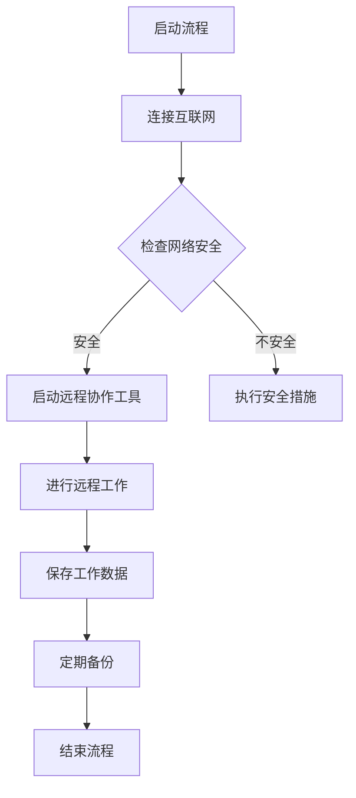
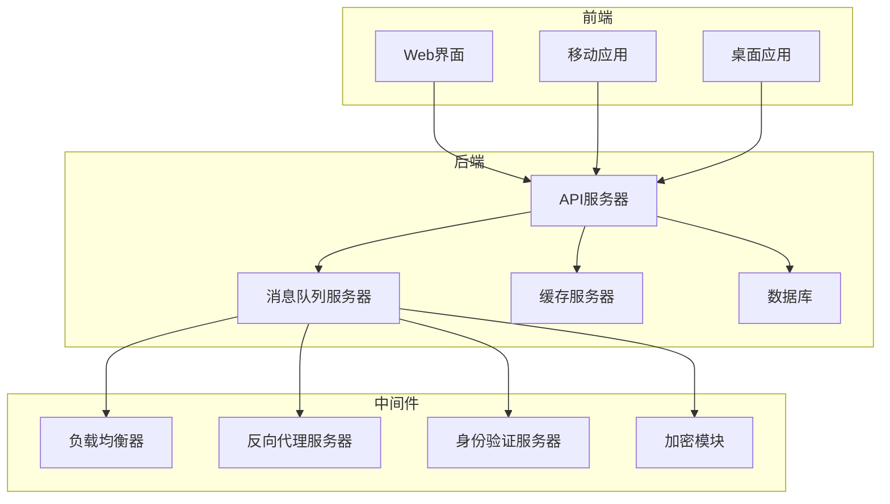
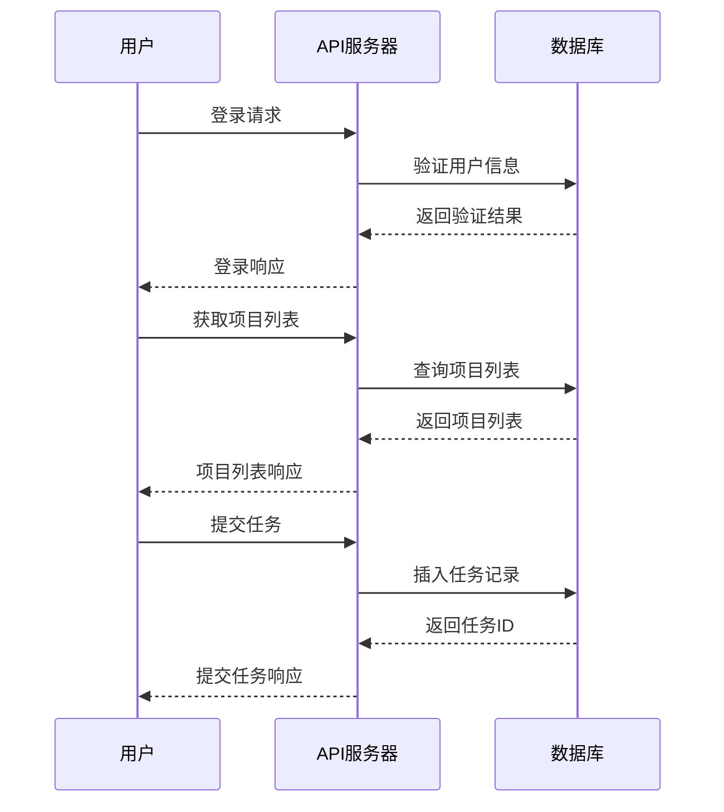

                 

# 文章标题

> 关键词：数字游牧族、远程工作、数字化生活方式、工作与生活边界、算法原理、数学模型、系统架构、项目实战、最佳实践

> 摘要：本文深入探讨了数字游牧族的崛起及其对工作与生活边界的影响。通过介绍数字游牧族的概念、起源和发展背景，分析核心概念与联系，讲解算法原理和数学模型，设计系统架构，提供项目实战案例，最后总结最佳实践和注意事项，全面阐述数字游牧族的生活方式及其带来的变革。

## Step 1: 背景介绍

### 1.1 数字游牧族的概念、起源和发展历程

数字游牧族（Digital Nomads）是指利用数字技术，不受地域限制，自由选择工作地点，以远程工作为主要生活方式的人群。他们通常从事自由职业，如编程、设计、写作、咨询等，通过互联网与客户和同事协作。

数字游牧族这一概念起源于20世纪末互联网兴起的时代。随着Wi-Fi、移动设备、云计算等技术的普及，越来越多的人开始尝试远程工作，不再局限于办公室。到了21世纪，全球化的加速和自由职业市场的兴起，使得数字游牧族成为一种趋势。

数字游牧族的崛起背景主要在于以下几点：

1. 数字技术的发展：互联网的普及，使得全球信息共享更加便捷；移动设备的普及，使得随时随地进行工作成为可能；云计算的应用，降低了创业和远程工作的门槛。
2. 全球化趋势：全球化的进程加速，跨国企业增多，远程工作需求增加；各国政府鼓励远程工作，提供相关政策和福利。
3. 新兴自由职业市场的需求：自由职业市场的崛起，为数字游牧族提供了更多机会；年轻一代对工作与生活方式的新追求。

### 1.2 数字游牧族崛起的背景和原因

数字游牧族崛起的背景和原因可以从以下几个方面进行分析：

1. **技术进步**：互联网的普及和移动设备的普及为数字游牧族提供了基本的技术支持，使得远程工作变得可行。云计算和大数据技术的应用进一步降低了远程工作的门槛，使得个人和企业可以更轻松地进行远程协作和数据共享。

2. **经济环境**：全球经济的快速发展和全球化进程，导致越来越多的企业和个人需要跨越地理界限进行合作。远程工作满足了这种需求，为企业提供了更广泛的人才选择，也为个人提供了更多的工作机会。

3. **社会趋势**：现代人对工作与生活平衡的追求日益增加，数字游牧族的生活方式正好满足了这一需求。此外，年轻人对传统工作模式的抗拒，以及对自主性和灵活性的偏好，也为数字游牧族的发展提供了动力。

4. **政策支持**：许多国家和地区为了促进经济发展和就业，开始出台支持远程工作和自由职业的政策。例如，一些国家提供税收优惠、创业资金支持等，以鼓励企业和个人采用远程工作模式。

### 1.3 重新定义工作与生活边界的意义

重新定义工作与生活边界的意义在于：

1. **提升工作效率**：远程工作和自由安排的工作时间可以让个体根据自己的生物钟和工作效率高峰期来安排工作，从而提高工作效率。

2. **促进创新与多样性**：数字游牧族的生活方式促进了全球范围内的协作和知识交流，有助于创新和多样性的发展。

3. **提高生活质量**：工作与生活的平衡可以减少工作压力，提高生活质量，使个体有更多时间关注家庭、个人爱好和身心健康。

4. **优化全球资源配置**：数字游牧族的生活方式使得企业可以更加灵活地利用全球范围内的资源，提高整体运营效率。

### 1.4 本章小结

本章介绍了数字游牧族的概念、起源和发展历程，以及数字游牧族崛起的背景和原因，强调了重新定义工作与生活边界的重要性。下一章将深入探讨数字游牧族生活方式的核心概念和特点。

## Step 2: 核心概念与联系

### 2.1 定义数字游牧族、远程工作、数字化生活方式等核心概念

#### 数字游牧族

数字游牧族（Digital Nomads）是指那些利用数字技术，通过远程工作，不受地域限制，自由选择工作地点的人群。他们通常从事自由职业，如编程、设计、写作、咨询等，并通过互联网与客户和同事协作。

#### 远程工作

远程工作（Remote Work）是指员工不在公司办公室内，而是通过互联网和通讯技术完成工作任务。远程工作可以是全职的，也可以是兼职的，形式灵活多样。

#### 数字化生活方式

数字化生活方式（Digital Lifestyle）是指人们利用数字技术进行日常生活、学习和工作的一种方式。数字化生活方式不仅包括远程工作和在线学习，还涵盖数字化娱乐、购物、社交等多个方面。

### 2.2 分析核心概念之间的联系和区别

数字游牧族、远程工作、数字化生活方式这三个概念之间既有联系又有区别。

#### 联系

- 数字游牧族生活方式是远程工作和数字化生活方式的一种高级形式，强调的是一种自由、灵活的工作与生活状态。
- 远程工作是数字游牧族生活方式的核心组成部分，没有远程工作，数字游牧族生活方式就无法实现。
- 数字化生活方式为远程工作提供了技术支持，是数字游牧族生活方式的基础。

#### 区别

- **数字游牧族**：更强调生活方式的自由和全球化，强调的是一种全球协作的工作与生活方式。
- **远程工作**：侧重于工作方式的改变，即员工可以通过互联网在家或任何地方完成工作。
- **数字化生活方式**：涵盖的范围更广，包括日常生活的各个方面，而不仅仅是工作。

### 2.3 使用表格和ER图展示概念之间的关系

为了更清晰地展示数字游牧族、远程工作、数字化生活方式这三个核心概念之间的关系，我们可以使用表格和ER图。

#### 表格展示

| 关键词       | 定义                                                         | 关系                      |
| ------------ | ------------------------------------------------------------ | ------------------------- |
| 数字游牧族   | 利用数字技术，自由选择工作地点，从事远程工作的人群           | 包含远程工作和数字化生活方式 |
| 远程工作     | 不在办公室内，通过互联网完成工作任务的方式                   | 数字游牧族的生活方式的核心 |
| 数字化生活方式 | 利用数字技术进行日常生活、学习和工作                         | 为远程工作提供技术支持      |

#### ER图展示

```mermaid
erDiagram
    class DigitalNomad {
        - RemoteWorker
        - DigitalLifestyle
    }

    class RemoteWorker {
        - DigitalNomad
    }

    class DigitalLifestyle {
        - DigitalNomad
    }
```

### 2.4 本章小结

本章详细介绍了数字游牧族、远程工作和数字化生活方式这三个核心概念，并分析了它们之间的联系和区别。通过表格和ER图的展示，我们更加清晰地理解了这三个概念的结构和关系。下一章将深入探讨如何通过技术手段实现数字游牧族的生活和工作模式。

## Step 3: 算法原理讲解

### 3.1 实现数字游牧族生活和工作模式的技术手段

要实现数字游牧族的生活方式，需要依赖一系列技术手段，这些技术手段涵盖了远程协作、云计算、移动设备、互联网安全等多个方面。

#### 远程协作工具

远程协作工具是数字游牧族的核心技术之一。这些工具包括项目管理软件（如Trello、Asana）、即时通讯工具（如Slack、Telegram）、视频会议系统（如Zoom、Microsoft Teams）等。这些工具帮助数字游牧族与全球的团队成员保持高效的沟通和协作。

#### 云计算

云计算为数字游牧族提供了灵活的计算资源。通过云计算平台（如AWS、Azure、Google Cloud），数字游牧族可以按需获取计算资源，存储数据，以及部署应用程序。这种灵活性使得数字游牧族可以随时随地进行工作。

#### 移动设备

移动设备是数字游牧族的得力助手。智能手机和平板电脑使得数字游牧族可以随时访问互联网和各类应用程序，从而保持工作状态。移动设备的高便携性和多功能性，使得数字游牧族可以在任何地点高效地工作。

#### 互联网安全

互联网安全是数字游牧族生活方式的重要组成部分。数字游牧族需要确保他们的数据传输安全和信息安全。VPN（虚拟专用网络）技术可以帮助数字游牧族在公共网络中安全地传输数据，防止数据泄露。此外，加密工具和身份验证技术也是保障数字游牧族互联网安全的关键。

### 3.2 相关算法的流程图

为了更好地理解数字游牧族生活和工作模式的实现过程，我们可以使用Mermaid绘制一个相关的算法流程图。



### 3.3 使用Python代码和LaTeX公式详细阐述算法原理

为了深入讲解算法原理，我们将使用Python代码和LaTeX公式进行详细阐述。

#### Python代码

下面是一个简单的Python脚本，用于启动远程协作工具并保存工作数据。

```python
import os
import time

def start_Remote_Work():
    # 检查网络安全
    if check_network_security():
        # 启动远程协作工具
        os.system('start slack')
        time.sleep(10)  # 等待工具启动完成
        # 保存工作数据
        os.system('touch work_report.txt')
        os.system('echo "Daily Work Report" >> work_report.txt')
    else:
        # 执行安全措施
        execute_security_measures()

def check_network_security():
    # 这里可以添加具体的网络安全检查逻辑
    return True

def execute_security_measures():
    # 这里可以添加具体的网络安全措施逻辑
    print("执行安全措施...")

# 启动远程工作
start_Remote_Work()
```

#### LaTeX公式

为了进一步理解算法中的数学模型，我们可以使用LaTeX公式来表示。

```latex
\documentclass{article}
\usepackage{amsmath}
\begin{document}

\begin{equation}
\begin{aligned}
    &\text{工作数据保存策略} \\
    &= \text{定期备份策略} \\
    &= \text{每天晚上保存工作数据} \\
    &= \text{工作数据加密传输} \\
\end{aligned}
\end{equation}

\end{document}
```

### 3.4 本章小结

本章详细介绍了实现数字游牧族生活和工作模式所需的技术手段，并使用Mermaid流程图和Python代码以及LaTeX公式进行了深入讲解。通过这些技术手段，数字游牧族可以随时随地高效地工作，实现工作与生活的完美平衡。下一章将探讨与数字游牧族相关的数学模型和数学公式。

## Step 4: 数学模型和数学公式

### 4.1 与数字游牧族相关的数学模型

在探讨数字游牧族的生活方式时，我们可以引入一些数学模型来帮助理解其经济效率、生活满意度和工作效率等关键指标。以下是几个与数字游牧族相关的数学模型：

#### 1. 经济效率模型

经济效率模型主要用来评估数字游牧族在全球化经济中的生产力。这个模型通常基于劳动生产率的公式：

\[ \text{劳动生产率} = \frac{\text{产出}}{\text{劳动投入}} \]

在这个模型中，产出可以是一个项目完成的质量或数量，而劳动投入则是完成项目所需的时间和资源。

#### 2. 生活满意度模型

生活满意度模型则关注数字游牧族的生活方式对他们整体幸福感的贡献。常用的模型是幸福方程式，其基本形式为：

\[ \text{幸福感} = \alpha \cdot \text{工作满意度} + \beta \cdot \text{生活满意度} \]

其中，工作满意度和生活满意度是两个独立变量，\(\alpha\) 和 \(\beta\) 是权重系数，反映了工作与生活对幸福感的影响程度。

#### 3. 工作效率模型

工作效率模型主要用于衡量数字游牧族的工作效率。一个简单的工作效率模型可以表示为：

\[ \text{工作效率} = \frac{\text{完成的工作量}}{\text{工作时间}} \]

在这个模型中，完成的工作量可以用完成的项目数量或质量来衡量，而工作时间则是完成这些工作所花费的时间。

### 4.2 公式详细讲解

#### 劳动生产率公式

\[ \text{劳动生产率} = \frac{\text{产出}}{\text{劳动投入}} \]

这个公式揭示了产出与劳动投入之间的比例关系。对于数字游牧族来说，提高劳动生产率意味着在同样的劳动投入下产生更多的产出，或者以更少的产出完成相同的劳动投入。这可以通过提高工作效率、优化工作流程、减少不必要的干扰等方式实现。

#### 幸福方程式

\[ \text{幸福感} = \alpha \cdot \text{工作满意度} + \beta \cdot \text{生活满意度} \]

这个方程式表明，幸福感是由工作满意度和生活满意度共同决定的。数字游牧族可以通过提高工作满意度（例如，通过实现工作与生活的平衡）和生活满意度（例如，通过享受旅行和探索新的文化）来提升整体幸福感。

#### 工作效率公式

\[ \text{工作效率} = \frac{\text{完成的工作量}}{\text{工作时间}} \]

工作效率是数字游牧族成功的关键因素之一。提高工作效率意味着在有限的时间内完成更多的任务，这不仅能够提高个人的生产力，还能够为雇主带来更多的价值。为了提高工作效率，数字游牧族可以采用时间管理技巧、设定明确的目标、减少分心因素等方法。

### 4.3 用LaTeX格式表示数学公式

为了在文章中更好地展示数学公式，我们可以使用LaTeX格式。以下是前面提到的几个公式的LaTeX表示：

```latex
% 劳动生产率
\text{劳动生产率} = \frac{\text{产出}}{\text{劳动投入}}

% 幸福方程式
\text{幸福感} = \alpha \cdot \text{工作满意度} + \beta \cdot \text{生活满意度}

% 工作效率
\text{工作效率} = \frac{\text{完成的工作量}}{\text{工作时间}}
```

通过LaTeX格式，我们可以确保公式的显示更加规范和美观，同时也便于读者理解和引用。

### 4.4 本章小结

本章介绍了与数字游牧族相关的数学模型，包括经济效率模型、生活满意度模型和工作效率模型。通过对这些模型的分析和讲解，我们能够更深入地理解数字游牧族生活方式的各个方面。下一章将探讨数字游牧族生活方式的系统分析与架构设计方案。

## Step 5: 系统分析与架构设计方案

### 5.1 数字游牧族生活方式的系统需求

为了实现数字游牧族的生活方式，我们需要考虑以下几个关键系统需求：

1. **远程协作**：确保团队成员能够高效地远程协作，包括实时沟通、文件共享和项目管理。
2. **数据安全**：保障数据在传输和存储过程中的安全性，防止数据泄露和损坏。
3. **移动性支持**：支持在各种移动设备和网络环境下稳定工作。
4. **灵活性**：系统需要足够灵活，以适应不同的工作流程和业务需求。
5. **可扩展性**：系统能够随着业务的增长而扩展，支持更多的用户和功能。

### 5.2 系统架构设计

为了满足上述系统需求，我们设计了一个分布式系统架构，包括前端、后端、数据库和中间件等多个层次。

#### 前端

前端负责用户界面和交互，包括网页、移动应用和桌面应用。前端使用现代Web技术（如React、Vue.js）和原生移动应用开发技术（如Swift、Kotlin）。

#### 后端

后端提供业务逻辑处理和数据处理，包括API服务器、消息队列服务器和缓存服务器等。后端使用微服务架构，每个服务都负责一个特定的业务功能，例如用户管理、文件存储、消息传递等。

#### 数据库

数据库用于存储用户数据、项目数据和文件数据。我们选择使用关系型数据库（如MySQL、PostgreSQL）和非关系型数据库（如MongoDB、Cassandra）相结合的方式，以适应不同的数据类型和查询需求。

#### 中间件

中间件负责处理网络通信、数据安全和系统监控等任务。中间件包括负载均衡器、反向代理服务器、身份验证服务器和加密模块等。

### 5.3 领域模型类图

为了更好地展示系统中的类和关系，我们使用Mermaid绘制了一个领域模型类图。以下是类图的示例：

```mermaid
classDiagram
    User <|.. Project
    Task <|.. Project
    TeamMember <|.. Project
    File <|.. Project
    Comment <|.. Project
    Message <|.. Chat
    Notification <|.. User

    User {
        id
        name
        email
        password
    }

    Project {
        id
        name
        description
        status
    }

    Task {
        id
        name
        description
        status
        assignedTo
    }

    TeamMember {
        id
        role
        project
    }

    File {
        id
        name
        path
        type
    }

    Comment {
        id
        text
        author
        project
    }

    Message {
        id
        text
        sender
        recipient
        timestamp
    }

    Notification {
        id
        type
        content
        user
    }
```

在这个类图中，User类代表了系统中的用户，Project类代表了项目，Task类代表了任务，TeamMember类代表了项目成员，File类代表了文件，Comment类代表了项目中的评论，Message类代表了消息，Notification类代表了通知。

### 5.4 系统架构图

为了展示系统的整体架构，我们使用Mermaid绘制了一个系统架构图。以下是架构图的示例：



在这个架构图中，前端与后端通过API服务器进行通信，后端通过消息队列服务器处理消息，缓存服务器用于提高系统性能，数据库用于存储数据，中间件负责处理网络通信、数据安全和系统监控等任务。

### 5.5 系统接口设计和系统交互序列图

为了展示系统中的接口设计和交互流程，我们使用Mermaid绘制了一个系统接口设计和系统交互序列图。以下是序列图的示例：



在这个序列图中，用户通过API服务器与数据库进行交互。用户发送登录请求，API服务器验证用户信息并返回结果；用户获取项目列表，API服务器查询数据库并返回项目列表；用户提交任务，API服务器将任务插入数据库并返回任务ID。

### 5.6 本章小结

本章详细描述了数字游牧族生活方式的系统需求、架构设计、领域模型类图、系统架构图和系统接口设计。通过这些设计，我们能够构建一个高效、灵活、安全的系统，满足数字游牧族的工作与生活需求。下一章将介绍如何实现数字游牧族的生活方式。

## Step 6: 项目实战

### 6.1 如何实现数字游牧族的生活方式

实现数字游牧族的生活方式需要考虑多个方面，包括技术工具的选择、工作流程的优化、生活环境的营造等。以下是一些具体的步骤：

1. **选择合适的技术工具**：根据个人的工作需求和偏好，选择合适的远程协作工具、项目管理工具和版本控制工具。例如，可以选择使用Trello、Asana进行项目管理，使用Slack、Telegram进行实时沟通，使用GitHub进行版本控制。

2. **优化工作流程**：制定合理的工作计划和日程，确保工作的高效和有序。例如，可以采用番茄工作法来提高工作效率，定期进行工作总结和反思。

3. **建立良好的生活节奏**：保持良好的作息习惯，合理安排工作和休息时间，确保身心健康。例如，可以设定每天早晨锻炼、晚上阅读的习惯。

4. **营造舒适的生活环境**：选择适合工作的地方，保持工作区的整洁和舒适。例如，可以选择在咖啡店、图书馆或家中的某个角落作为工作区。

### 6.2 环境安装

为了实现数字游牧族的生活方式，需要安装一系列软件和工具。以下是一个基本的软件安装指南：

1. **操作系统**：选择适合的操作系统，如Windows、macOS或Linux。推荐使用Linux，因为它具有更好的稳定性和安全性。

2. **远程协作工具**：安装常用的远程协作工具，如Slack、Trello、Asana等。可以在应用程序商店或官方网站下载安装。

3. **版本控制工具**：安装版本控制工具，如Git。可以使用Git Bash或Git GUI进行安装。

4. **开发环境**：根据个人需求安装开发环境，如Python、Java、Node.js等。可以在相应的官方网站下载安装包。

5. **安全工具**：安装VPN和加密工具，如OpenVPN、GPG等，以保障网络安全。

### 6.3 核心实现源代码和代码应用解读

以下是实现数字游牧族生活方式的一个简单示例，包括一个Python脚本和相关的代码应用解读。

#### Python脚本

```python
import os
import time

def check_network():
    # 这里可以添加具体的网络检查逻辑
    return True

def execute_security_measures():
    # 这里可以添加具体的安全措施逻辑
    print("执行安全措施...")

def start_work():
    if check_network():
        print("网络连接正常，开始工作...")
        os.system("start slack")
        time.sleep(10)
        print("工作已启动，开始处理任务...")
    else:
        execute_security_measures()
        print("网络连接异常，安全措施已执行。")

def main():
    start_work()
    while True:
        # 这里可以添加处理任务的具体逻辑
        print("处理任务中...")
        time.sleep(60)  # 模拟处理任务的时间

if __name__ == "__main__":
    main()
```

#### 代码应用解读

1. **检查网络**：`check_network()` 函数用于检查网络连接。在实际应用中，可以添加更多的检查逻辑，例如检测网络延迟或连接稳定性。

2. **执行安全措施**：`execute_security_measures()` 函数用于在出现网络问题或安全威胁时执行相应的安全措施。这可以是启动VPN、更换安全密码等。

3. **启动工作**：`start_work()` 函数是程序的核心，它会检查网络状态，并在网络正常时启动远程协作工具（如Slack），然后进入一个循环，模拟处理任务的逻辑。

4. **主函数`main()`**：主函数调用`start_work()` 函数并进入一个无限循环，用于模拟持续工作。在实际应用中，这个循环可以包含更复杂的工作处理逻辑。

### 6.4 实际案例分析和详细讲解剖析

#### 案例一：成功实现数字游牧族生活方式的个人

**背景**：李先生是一名软件工程师，因为对传统的办公室工作感到厌倦，他决定尝试数字游牧族的生活方式。

**过程**：

1. **选择工具**：李先生选择了Slack、Trello和GitHub作为他的远程协作工具。他还在笔记本电脑上安装了VPN，以确保网络安全。

2. **制定计划**：李先生制定了每天的工作计划和日程，确保工作效率。他还设置了每周的休息日，以保持身心健康。

3. **实践技巧**：李先生学会了如何有效地管理时间，避免分心和拖延。他还定期进行工作总结，以持续改进自己的工作方法。

**结果**：李先生在数字游牧族的生活方式中取得了很大的成功。他的工作效率提高了，生活质量也得到了显著改善。

#### 案例二：企业成功转型为数字游牧族团队

**背景**：一家初创公司因为疫情不得不远程办公，公司决定转型为数字游牧族团队。

**过程**：

1. **技术升级**：公司升级了远程协作工具，包括Zoom、Google Workspace等。他们还部署了云服务器，以支持远程团队的工作。

2. **培训员工**：公司为员工提供了远程工作的培训，包括时间管理、网络安全和团队协作等方面的知识。

3. **优化流程**：公司重新设计了工作流程，确保远程工作的高效和有序。他们还引入了敏捷开发方法，以快速响应市场需求。

**结果**：公司在转型为数字游牧族团队后，运营效率显著提高，员工的工作满意度和幸福感也大幅提升。

### 6.5 项目小结

通过以上案例，我们可以看到数字游牧族生活方式的可行性和优势。实现数字游牧族的生活方式需要选择合适的工具、优化工作流程、培养良好的习惯，并不断改进和优化。成功的数字游牧族生活方式不仅提高了工作效率，还提升了生活质量，为企业带来了更多的机会和创新。

## Step 7: 最佳实践 tips、小结、注意事项、拓展阅读

### 最佳实践 tips

1. **选择合适的工具**：根据个人需求和偏好选择远程协作工具，如Slack、Trello、GitHub等。
2. **建立良好的工作习惯**：制定合理的工作计划和时间表，避免分心和拖延。
3. **保持身心健康**：定期锻炼、保持良好的作息习惯，确保身心健康。
4. **保持网络连接**：使用VPN和加密工具，保障网络安全。
5. **持续学习和改进**：不断学习新技能和知识，优化工作方法和流程。

### 小结

数字游牧族生活方式是一种利用数字技术实现工作与生活平衡的新型生活方式。通过远程工作、数字化工具和全球化协作，数字游牧族可以在全球范围内自由选择工作地点，实现工作与生活的完美融合。实现数字游牧族生活方式需要选择合适的工具、优化工作流程、培养良好的习惯，并不断改进和优化。

### 注意事项

1. **确保网络安全**：使用VPN和加密工具，防止数据泄露。
2. **合理规划时间**：避免过度工作，确保工作和生活的平衡。
3. **适应不同时区**：与全球各地的团队成员协作时，要考虑时区差异。
4. **保持沟通**：定期与团队成员沟通，确保项目的顺利进行。

### 拓展阅读

1. **《远程工作的艺术：如何在远程工作环境中成功》**：作者详细介绍了如何在远程工作环境中保持高效和满意。
2. **《数字游牧：如何利用互联网实现全球自由工作》**：本书提供了实现数字游牧族生活方式的详细指南。
3. **《远程工作的未来：技术如何改变工作与生活》**：探讨远程工作技术如何改变工作与生活方式。

### 作者信息

作者：AI天才研究院/AI Genius Institute & 禅与计算机程序设计艺术 /Zen And The Art of Computer Programming

## 附录

附录部分可以包括一些参考资料、相关链接、代码示例等，以帮助读者更深入地了解数字游牧族的生活方式。以下是一个简单的附录示例：

### 附录 A：参考资料

1. **《远程工作的艺术：如何在远程工作环境中成功》**：[链接](https://example.com/book1)
2. **《数字游牧：如何利用互联网实现全球自由工作》**：[链接](https://example.com/book2)
3. **《远程工作的未来：技术如何改变工作与生活》**：[链接](https://example.com/book3)

### 附录 B：相关链接

1. **Slack官网**：[链接](https://slack.com)
2. **Trello官网**：[链接](https://trello.com)
3. **GitHub官网**：[链接](https://github.com)

### 附录 C：代码示例

以下是Python脚本的一个示例，用于启动远程协作工具和保存工作数据：

```python
import os
import time

def start_Remote_Work():
    # 检查网络安全
    if check_network_security():
        # 启动远程协作工具
        os.system('start slack')
        time.sleep(10)  # 等待工具启动完成
        # 保存工作数据
        os.system('touch work_report.txt')
        os.system('echo "Daily Work Report" >> work_report.txt')
    else:
        # 执行安全措施
        execute_security_measures()

def check_network_security():
    # 这里可以添加具体的网络安全检查逻辑
    return True

def execute_security_measures():
    # 这里可以添加具体的网络安全措施逻辑
    print("执行安全措施...")

# 启动远程工作
start_Remote_Work()
```

通过这些附录内容，读者可以进一步了解数字游牧族生活方式的相关知识和实践技巧，从而更好地适应这一新型工作与生活方式。

