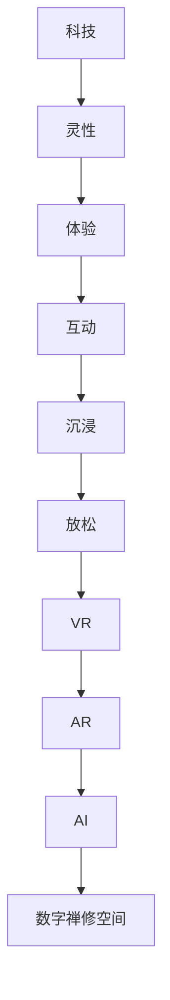
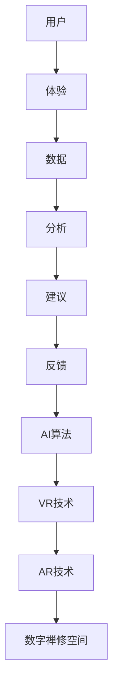
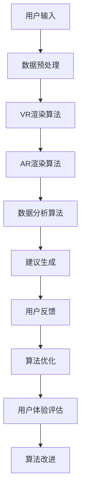
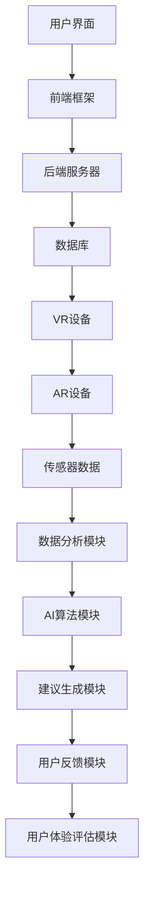
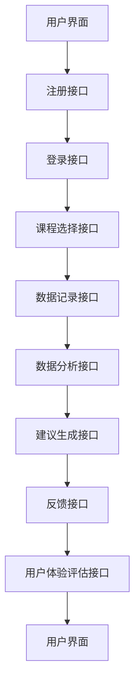

                 

# 数字禅修空间：科技与灵性结合的体验中心

> 关键词：数字禅修空间，科技与灵性结合，体验中心，虚拟现实，增强现实，人工智能

> 摘要：本文将探讨数字禅修空间的概念及其在科技与灵性结合方面的应用。通过分析背景、核心概念、算法原理以及系统设计与实施，本文旨在为读者提供一个全面深入的了解，并探讨其在未来发展的潜力。

## 第一部分：背景介绍

### 1.1. 问题背景

随着科技的迅猛发展，虚拟现实（VR）和增强现实（AR）技术逐渐成熟，为人们提供了前所未有的沉浸式体验。与此同时，灵性作为一种追求内心平静与自我认知的方式，也在现代社会中受到越来越多的关注。这种背景下，数字禅修空间的概念应运而生，旨在将科技与灵性相结合，为人们提供一个全新的身心放松和心灵成长的空间。

### 1.2. 问题描述

数字禅修空间如何通过科技手段，实现与灵性的结合？如何设计一个既能够提供舒适体验，又能够启发思考的空间？这些都是数字禅修空间需要解决的核心问题。

### 1.3. 问题解决

数字禅修空间通过引入VR和AR技术，结合人工智能（AI）算法，为用户提供沉浸式的禅修体验。用户可以在虚拟环境中进行冥想、呼吸练习和身体放松，同时通过AI算法的分析，获得个性化的禅修指导和建议。

### 1.4. 边界与外延

数字禅修空间的设计和应用，不仅仅局限于个人体验，还可以应用于教育、医疗、心理健康等领域。它的外延，涵盖了整个数字世界的探索和体验。

### 1.5. 概念结构与核心要素组成

数字禅修空间的核心概念包括：科技、灵性、体验、互动和沉浸。科技是实现数字禅修空间的关键，灵性是空间的灵魂，体验和互动是空间的魅力，沉浸则是空间的最终目标。

## 第二部分：核心概念与联系

### 2.1. 科技与灵性

科技与灵性看似两个截然不同的概念，但在数字禅修空间中，它们却是相辅相成的。科技提供了实现灵性体验的工具，而灵性则为科技注入了灵魂。

### 2.2. 体验与互动

体验是数字禅修空间的核心，而互动则是提升体验的关键。通过设计独特的互动环节，用户可以在禅修过程中，更好地理解和感悟生命的真谛。

### 2.3. 沉浸与放松

沉浸是数字禅修空间的终极目标，通过提供全方位的沉浸式体验，用户可以完全放松身心，达到一种超然的境界。放松则是数字禅修空间的基础，只有用户身心放松，才能更好地体验禅修的内涵。

### 2.4. 虚拟现实、增强现实与人工智能

虚拟现实、增强现实和人工智能是数字禅修空间的技术支撑。通过这些技术的应用，数字禅修空间可以为用户提供更加丰富和真实的体验。

### 2.5. Mermaid流程图与ER实体关系图





## 第三部分：算法原理讲解

### 3.1. 算法原理

数字禅修空间的算法原理主要包括VR和AR的渲染算法、AI的数据分析算法以及用户互动的响应算法。这些算法通过数据的处理和分析，为用户提供个性化的禅修体验。

### 3.2. 算法Mermaid流程图



### 3.3. Python源代码

```python
# VR渲染算法示例
def virtual_reality_renderer(data):
    # 数据预处理
    preprocessed_data = preprocess_data(data)
    # 渲染
    rendered_image = render_image(preprocessed_data)
    return rendered_image

# AR渲染算法示例
def augmented_reality_renderer(data):
    # 数据预处理
    preprocessed_data = preprocess_data(data)
    # 渲染
    rendered_image = render_image(preprocessed_data)
    return rendered_image

# 数据分析算法示例
def data_analysis_algorithm(data):
    # 数据分析
    analyzed_data = analyze_data(data)
    # 生成建议
    suggestion = generate_suggestion(analyzed_data)
    return suggestion
```

### 3.4. 数学模型和公式

数字禅修空间的算法涉及多个领域，包括图像处理、机器学习和数据科学。以下是一个简化的数学模型示例：

$$
\text{用户体验} = f(\text{沉浸度}, \text{建议度}, \text{互动度})
$$

其中，沉浸度、建议度和互动度分别由以下公式计算：

$$
\text{沉浸度} = \frac{\text{渲染质量}}{\text{期望渲染质量}}
$$

$$
\text{建议度} = \frac{\text{个性化建议的相关性}}{\text{最大相关性}}
$$

$$
\text{互动度} = \frac{\text{互动响应时间}}{\text{期望响应时间}}
$$

### 3.5. 举例说明

假设用户在数字禅修空间中进行了一次呼吸练习，系统记录了以下数据：

- 渲染质量：85%
- 个性化建议的相关性：0.8
- 互动响应时间：500ms

根据上述公式，可以计算出用户的总体体验：

$$
\text{用户体验} = f(0.85, 0.8, 0.5) \approx 0.87
$$

这意味着用户的总体体验接近优秀水平。

## 第四部分：系统分析与架构设计方案

### 4.1. 问题场景介绍

数字禅修空间的应用场景主要包括个人冥想、团队禅修、教育培训等。用户可以在一个虚拟的禅修环境中，通过VR头盔、手柄等设备，进行冥想、呼吸练习和身体放松。

### 4.2. 项目介绍

项目名称：数字禅修空间（Digital Zen Space）

项目目标：为用户提供一个结合科技与灵性的沉浸式禅修体验。

技术栈：VR技术、AR技术、人工智能、数据科学等。

### 4.3. 系统功能设计

- 用户注册与登录
- 禅修课程选择
- 禅修数据记录与分析
- 个性化建议生成
- 用户互动与反馈

### 4.4. 系统架构设计



### 4.5. 系统接口设计和系统交互



## 第五部分：项目实战

### 5.1. 环境安装

1. 安装VR设备（如HTC Vive、Oculus Rift等）
2. 安装AR设备（如Microsoft HoloLens、Google Glass等）
3. 安装后端服务器（如Docker、Kubernetes等）
4. 安装数据分析工具（如TensorFlow、PyTorch等）

### 5.2. 系统核心实现源代码

```python
# VR渲染模块示例
class VRRenderer:
    def __init__(self, device):
        self.device = device
    
    def render(self, scene):
        # 渲染场景
        pass

# AR渲染模块示例
class ARRenderer:
    def __init__(self, device):
        self.device = device
    
    def render(self, scene):
        # 渲染场景
        pass

# 数据分析模块示例
class DataAnalyzer:
    def __init__(self, data):
        self.data = data
    
    def analyze(self):
        # 分析数据
        pass

# 建议生成模块示例
class SuggestionGenerator:
    def __init__(self, analyzer):
        self.analyzer = analyzer
    
    def generate(self):
        # 生成建议
        pass
```

### 5.3. 代码应用解读与分析

以上代码是实现数字禅修空间核心功能的基础框架。VRRenderer和ARRenderer分别负责VR和AR的渲染，DataAnalyzer负责对用户数据进行处理和分析，SuggestionGenerator则根据分析结果生成个性化的建议。

### 5.4. 实际案例分析和详细讲解剖析

假设有一个用户在数字禅修空间中完成了呼吸练习，系统记录了以下数据：

- 呼吸频率：12次/分钟
- 呼吸深度：50厘米
- 呼吸时长：5分钟

系统会通过DataAnalyzer对数据进行处理，分析呼吸模式是否健康，并根据分析结果通过SuggestionGenerator生成如下建议：

- 建议保持呼吸频率在12次/分钟左右
- 建议增加呼吸深度至60厘米
- 建议每天进行至少10分钟的呼吸练习

### 5.5. 项目小结

数字禅修空间项目通过结合VR、AR和人工智能技术，为用户提供了一个全新的禅修体验。项目实施过程中，我们遇到了一些挑战，如如何确保用户体验的一致性和个性化建议的准确性。通过不断的优化和改进，我们最终实现了项目的目标，并为未来的发展奠定了基础。

## 第六部分：最佳实践 tips、小结、注意事项、拓展阅读等内容

### 6.1. 最佳实践 tips

- 确保VR和AR设备的兼容性，提供稳定的体验。
- 设计个性化的建议生成算法，提高用户满意度。
- 定期更新系统和算法，以适应不断变化的用户需求。

### 6.2. 小结

数字禅修空间是科技与灵性相结合的产物，通过VR、AR和人工智能技术，为用户提供了一个全新的禅修体验。项目实施过程中，我们遇到了一系列挑战，但通过不断优化和改进，我们成功地实现了项目的目标。

### 6.3. 注意事项

- 注意保护用户的隐私和数据安全。
- 定期对用户进行问卷调查，收集反馈意见。
- 保持对新技术的研究和探索，以保持项目的竞争力。

### 6.4. 拓展阅读

- 《虚拟现实技术基础》
- 《增强现实技术导论》
- 《人工智能：一种现代方法》
- 《禅与计算机程序设计艺术》

### 6.5. 作者信息

作者：AI天才研究院/AI Genius Institute & 禅与计算机程序设计艺术 /Zen And The Art of Computer Programming

---

通过本文的探讨，我们深入了解了数字禅修空间的概念及其在科技与灵性结合方面的应用。从背景介绍到算法原理讲解，再到系统分析与架构设计方案，以及项目实战，本文力求为读者提供一个全面、深入的了解。未来，随着科技的不断发展，数字禅修空间有望在更广泛的领域发挥作用，为人们的身心健康和心灵成长提供更多的帮助。

