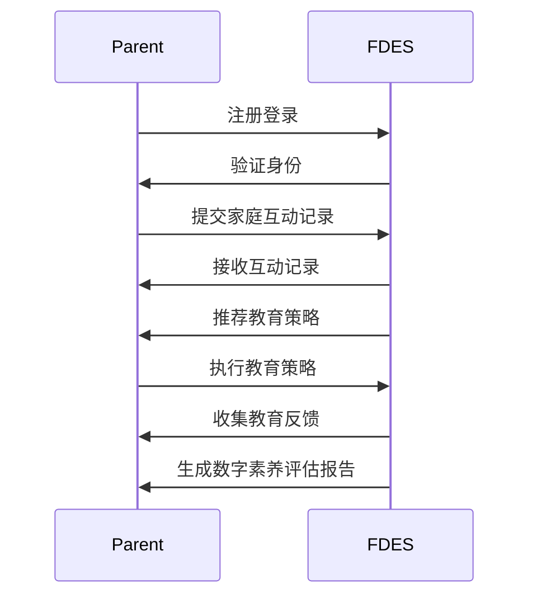
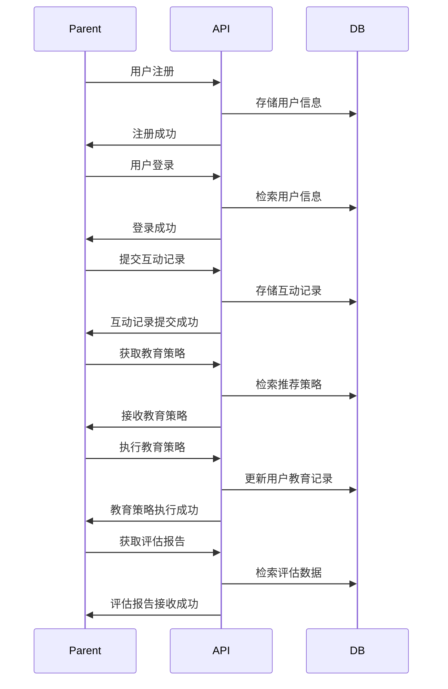
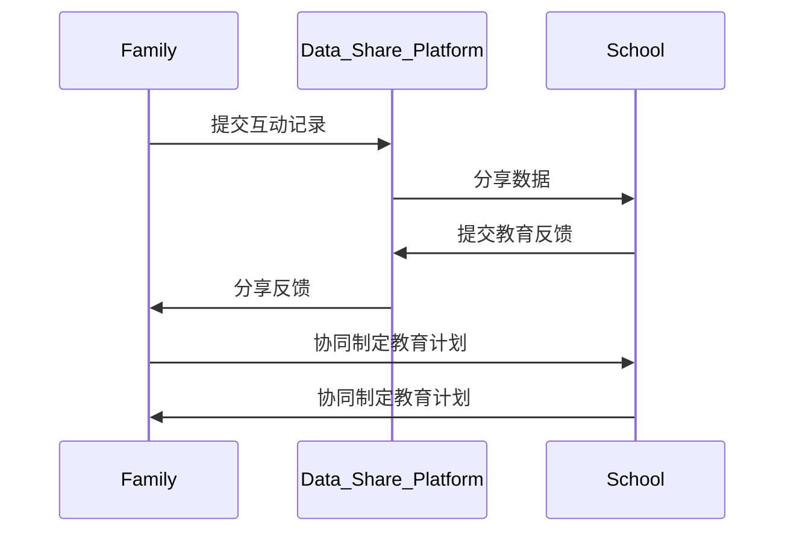
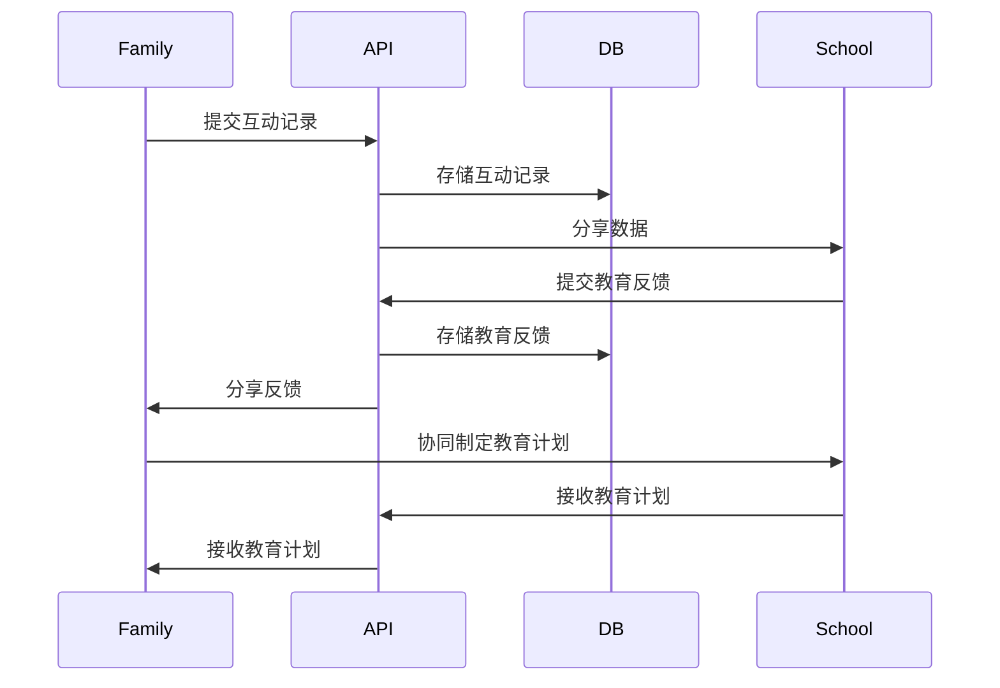

                 

### 第一部分：数字素养背景与家庭教育

#### 1.1 问题背景

在当今数字化时代，互联网和移动设备的普及使得人们的生活越来越依赖数字技术。然而，随着数字技术的快速发展，数字素养的问题也逐渐凸显。许多家庭在数字素养教育方面面临挑战，例如如何引导孩子正确使用数字设备、如何保护个人信息安全、如何培养孩子的网络道德等。这些问题不仅影响孩子的成长，也关系到整个社会的数字素养水平。

#### 1.2 数字素养的定义与重要性

数字素养是指个体在数字化社会中获取、理解、评价、使用数字信息和技术的能力。它包括信息素养、技术素养、媒体素养、网络素养等多个方面。数字素养不仅关系到个人的发展和竞争力，也对社会的发展和进步具有重要意义。

**核心概念与联系**

数字素养的概念可以分解为以下几个核心要素：

| 要素 | 定义 | 关联 |
| --- | --- | --- |
| 信息素养 | 信息检索、评估、利用的能力 | 基础，影响其他素养 |
| 技术素养 | 使用和管理数字技术的能力 | 实践，数字素养的体现 |
| 媒体素养 | 理解和批判媒体信息的能力 | 重要，影响舆论和价值观 |
| 网络素养 | 在网络环境中有效沟通和合作的能力 | 关键，网络社会的基础 |

**ER实体关系图架构**

```mermaid
erDiagram
  User ||--|{ Device } : 使用
  User ||--|{ Information } : 获取
  User ||--|{ Skill } : 具备
  User ||--|{ Ethics } : 遵守
  Device ||--|{ Application } : 运行
  Information ||--|{ Source } : 来自
  Skill ||--|{ Knowledge } : 获得
  Ethics ||--|{ Law } : 依据
```

#### 1.3 当前数字素养教育的挑战

当前数字素养教育面临诸多挑战，包括教育资源的不足、教育方法的单一、家长和学生对数字素养教育的认知不足等。如何有效地提高家庭数字素养教育的水平，成为当前教育领域亟待解决的问题。

**算法原理讲解**

为了有效提高数字素养教育的效果，我们可以设计一个“数字素养评估算法”。该算法的核心是“分层次评估模型”，通过多个层次对学生的数字素养进行全面评估。

```python
# 数字素养评估算法伪代码
def digital_素养评估算法(student):
    # 第一层次：基础知识评估
    knowledge_score = 评估知识掌握情况(student)
    
    # 第二层次：技能应用评估
    skill_score = 评估技能应用能力(student)
    
    # 第三层次：道德与法律意识评估
    ethics_score = 评估道德与法律意识(student)
    
    # 综合评分
    total_score = (knowledge_score * 0.4 + skill_score * 0.3 + ethics_score * 0.3)
    
    return total_score

# 评估函数示例
def 评估知识掌握情况(student):
    # 根据学生答题情况计算得分
    score = 答题情况(student)
    return score

def 评估技能应用能力(student):
    # 观察学生在实际操作中的表现
    score = 操作表现(student)
    return score

def 评估道德与法律意识(student):
    # 通过学生行为记录评估道德与法律意识
    score = 行为评估(student)
    return score
```

**数学模型和公式**

我们可以使用以下数学模型来评估学生的综合数字素养得分：

$$
总得分 = (知识得分 \times 0.4) + (技能得分 \times 0.3) + (道德与法律意识得分 \times 0.3)
$$

#### 小结

本部分介绍了数字素养的背景和重要性，并详细分析了数字素养的核心概念和当前教育面临的挑战。通过ER实体关系图和数字素养评估算法，我们对数字素养教育有了更深入的理解。

---

### 第二部分：家庭在数字素养教育中的作用

#### 2.1 家庭教育与数字素养的关联

家庭是孩子成长的第一课堂，家庭教育在孩子的一生中具有重要的影响。数字素养教育不仅需要在学校中进行，更需要在家庭中培养。家庭是孩子学习数字技术和数字文化的主要环境，家长是孩子数字素养教育的第一责任人。

**算法原理讲解**

为了更好地理解家庭教育与数字素养的关联，我们可以设计一个“家庭数字素养培养模型”。该模型的核心是“家庭互动反馈循环”，通过家庭互动不断调整和优化孩子的数字素养培养策略。

```python
# 家庭数字素养培养模型伪代码
class Family_Digital_Education:
    def __init__(self, student):
        self.student = student
        self.interaction_records = []

    def update_education_strategy(self):
        # 根据家庭互动记录更新教育策略
        strategy = analyze_interaction(self.interaction_records)
        self.interaction_records.append(strategy)

    def teach_student(self, topic):
        # 家长针对特定主题教育孩子
        self.student.learn(topic)

    def record_interaction(self, interaction):
        # 记录家庭互动情况
        self.interaction_records.append(interaction)

# 分析互动情况函数示例
def analyze_interaction(interaction_records):
    # 根据互动记录分析互动效果
    strategy = determine_effective_strategy(interaction_records)
    return strategy

# 确定有效策略函数示例
def determine_effective_strategy(interaction_records):
    # 确定下一个教育策略
    strategy = "新策略"
    return strategy
```

**数学模型和公式**

我们可以使用以下数学模型来描述家庭互动对数字素养培养的影响：

$$
素养提升 = f(家庭互动, 教育策略)
$$

其中，`f` 是一个复合函数，取决于家庭互动的质量和教育策略的有效性。

#### 2.2 家庭数字素养教育的现状

目前，许多家庭对数字素养教育的重视程度不够，家长对数字技术的掌握程度有限，数字素养教育的内容和方法也存在一定问题。如何提高家庭数字素养教育的质量和效果，是当前家庭教育亟待解决的问题。

**系统分析与架构设计方案**

**问题场景介绍**

家庭数字素养教育的现状分析是一个复杂的过程，需要综合考虑家庭环境、家长教育理念、孩子兴趣等因素。以下是一个家庭数字素养教育系统架构的概述。

**项目介绍**

家庭数字素养教育系统（Family Digital Education System，简称FDES）旨在为家长提供一套科学的数字素养教育方案，帮助家长更好地引导孩子成长。

**系统功能设计**

- 用户注册与登录
- 家庭互动记录
- 教育策略推荐
- 数字素养评估
- 数据分析与报告

**系统架构设计**



**系统接口设计和系统交互**



#### 2.3 家庭在数字素养教育中的责任

家庭在数字素养教育中扮演着至关重要的角色。家长需要认识到数字素养教育的重要性，主动参与孩子的数字素养培养。家庭应创造良好的数字环境，提供必要的数字教育资源，指导孩子正确使用数字设备，培养孩子的数字安全意识和网络道德。

**最佳实践 tips**

- **定期家庭会议**：定期与孩子进行家庭会议，讨论数字素养相关话题，增进沟通和理解。
- **设定数字规则**：制定合理的数字使用规则，包括使用时间、设备使用场所等，帮助孩子养成良好的数字习惯。
- **共同参与数字活动**：与孩子一起参与数字活动，如编程学习、网络安全游戏等，提高孩子的兴趣和参与度。
- **关注孩子行为**：密切关注孩子的数字行为，及时发现并解决潜在问题，如网络欺凌、沉迷游戏等。

**小结**

本部分详细阐述了家庭教育在数字素养教育中的重要性，介绍了家庭数字素养教育的现状，并提出了家庭在数字素养教育中的责任和最佳实践。通过系统架构设计和接口设计，为家庭数字素养教育提供了实际操作方案。

---

### 第三部分：培养下一代网络公民的核心概念

#### 3.1 网络公民的概念

网络公民是指在网络社会中具有积极参与、理性表达、尊重他人、维护公共利益的能力和意识的个体。网络公民的培养是数字素养教育的核心内容，它关系到下一代网络社会的健康发展。

**算法原理讲解**

为了更好地理解网络公民的概念，我们可以设计一个“网络公民行为分析算法”。该算法通过分析个体的网络行为，评估其是否具备网络公民素养。

```python
# 网络公民行为分析算法伪代码
def analyze_citizen_behavior(behavior):
    # 分析行为指标
    engagement_score = calculate_engagement_score(behavior)
    rationality_score = calculate_rationality_score(behavior)
    respect_score = calculate_respect_score(behavior)
    public_interest_score = calculate_public_interest_score(behavior)
    
    # 综合评分
    total_score = (engagement_score * 0.2 + rationality_score * 0.2 + respect_score * 0.3 + public_interest_score * 0.3)
    
    return total_score

# 评估函数示例
def calculate_engagement_score(behavior):
    # 根据行为参与度计算得分
    score = engagement_level(behavior)
    return score

def calculate_rationality_score(behavior):
    # 根据行为理性度计算得分
    score = rationality_level(behavior)
    return score

def calculate_respect_score(behavior):
    # 根据行为尊重度计算得分
    score = respect_level(behavior)
    return score

def calculate_public_interest_score(behavior):
    # 根据行为对公共利益的贡献计算得分
    score = public_interest_contribution(behavior)
    return score
```

**数学模型和公式**

我们可以使用以下数学模型来评估网络公民的综合素养得分：

$$
总得分 = (参与度得分 \times 0.2) + (理性度得分 \times 0.2) + (尊重度得分 \times 0.3) + (公共利益贡献得分 \times 0.3)
$$

#### 3.2 网络公民的素养要素

网络公民素养包括信息素养、技术素养、媒体素养、网络素养、法律素养等多个方面。这些素养要素相互关联，共同构成了网络公民的核心素养。

**概念属性特征对比表格**

| 素养要素 | 概念 | 属性特征 | 对比 |
| --- | --- | --- | --- |
| 信息素养 | 获取、理解、评价信息的能力 | 全面性、准确性、批判性 | 基础素养，影响其他素养 |
| 技术素养 | 使用和管理数字技术的能力 | 操作性、效率性、创新性 | 实践素养，数字素养的体现 |
| 媒体素养 | 理解和批判媒体信息的能力 | 批判性、创造性、反思性 | 重要素养，影响舆论和价值观 |
| 网络素养 | 在网络环境中有效沟通和合作的能力 | 理解性、协作性、安全性 | 关键素养，网络社会的基础 |
| 法律素养 | 遵守网络法律和规范的能力 | 遵守性、自觉性、责任性 | 重要保障，维护网络秩序 |

**ER实体关系图架构**

```mermaid
erDiagram
  Network_Citizen ||--|{ Information_Literacy } : 拥有
  Network_Citizen ||--|{ Technology_Literacy } : 拥有
  Network_Citizen ||--|{ Media_Literacy } : 拥有
  Network_Citizen ||--|{ Network_Literacy } : 拥有
  Network_Citizen ||--|{ Legal_Literacy } : 拥有
```

#### 3.3 网络公民素养的评估

网络公民素养的评估是数字素养教育的重要环节。通过评估，可以了解个体在网络素养方面的掌握程度，发现教育中的不足，及时调整教育策略。

**算法原理讲解**

为了实现网络公民素养的评估，我们可以设计一个“综合素养评估系统”。该系统通过多维度评估，对个体的网络公民素养进行全面评估。

```python
# 综合素养评估系统伪代码
class Literacy_Assessment_System:
    def __init__(self, individual):
        self.individual = individual
        self.assessment_results = {}

    def assess_information_literacy(self):
        # 评估信息素养
        result = assess_info_literacy(self.individual)
        self.assessment_results['信息素养'] = result

    def assess_technology_literacy(self):
        # 评估技术素养
        result = assess_tech_literacy(self.individual)
        self.assessment_results['技术素养'] = result

    def assess_media_literacy(self):
        # 评估媒体素养
        result = assess_media_literacy(self.individual)
        self.assessment_results['媒体素养'] = result

    def assess_network_literacy(self):
        # 评估网络素养
        result = assess_network_literacy(self.individual)
        self.assessment_results['网络素养'] = result

    def assess_legal_literacy(self):
        # 评估法律素养
        result = assess_legal_literacy(self.individual)
        self.assessment_results['法律素养'] = result

    def get_comprehensive_score(self):
        # 获取综合得分
        scores = self.assessment_results.values()
        total_score = sum(scores)
        return total_score

# 评估函数示例
def assess_info_literacy(individual):
    # 评估信息素养
    score = info_literacy_test(individual)
    return score

def assess_tech_literacy(individual):
    # 评估技术素养
    score = tech_literacy_test(individual)
    return score

def assess_media_literacy(individual):
    # 评估媒体素养
    score = media_literacy_test(individual)
    return score

def assess_network_literacy(individual):
    # 评估网络素养
    score = network_literacy_test(individual)
    return score

def assess_legal_literacy(individual):
    # 评估法律素养
    score = legal_literacy_test(individual)
    return score
```

**数学模型和公式**

我们可以使用以下数学模型来评估网络公民的综合素养得分：

$$
总得分 = (信息素养得分 \times 0.2) + (技术素养得分 \times 0.2) + (媒体素养得分 \times 0.2) + (网络素养得分 \times 0.2) + (法律素养得分 \times 0.2)
$$

#### 小结

本部分详细阐述了网络公民的概念、素养要素和评估方法。通过算法原理讲解和数学模型，我们对网络公民素养有了更深入的理解。网络公民素养的培养是数字素养教育的核心，对个体的全面发展和社会的进步具有重要意义。

---

### 第四部分：家庭教育策略与实践

#### 4.1 建立健康的数字使用习惯

健康的数字使用习惯是数字素养教育的基础。家庭应引导孩子合理安排数字使用时间，避免过度沉迷于数字设备。

**算法原理讲解**

为了建立健康的数字使用习惯，我们可以设计一个“数字使用习惯培养算法”。该算法通过逐步引导，帮助孩子养成健康的数字使用习惯。

```python
# 数字使用习惯培养算法伪代码
def cultivate_digital_habits(student):
    # 初始设置
    daily_limit = 2  # 每天数字使用时间限制
    reward_system = initialize_reward_system()

    # 每日监控
    while True:
        current_time = check_digital_usage(student)
        
        # 超时提醒
        if current_time > daily_limit:
            remind_excessive_usage(student)
        
        # 习惯养成奖励
        if current_time <= daily_limit:
            reward_system.reward(student)
        
        # 每日重置
        reset_daily_limit()

# 监控数字使用时间函数示例
def check_digital_usage(student):
    # 检测当前数字使用时间
    time = student.digital_usage
    return time

# 提醒超时函数示例
def remind_excessive_usage(student):
    # 提醒学生减少数字使用
    student.received_remind()

# 奖励系统初始化函数示例
def initialize_reward_system():
    # 初始化奖励系统
    reward_system = RewardSystem()
    return reward_system

# 重置每日限制函数示例
def reset_daily_limit():
    # 重置每日数字使用时间限制
    daily_limit = 2
```

**数学模型和公式**

我们可以使用以下数学模型来描述数字使用习惯的逐步养成：

$$
数字使用习惯 = f(当前数字使用时间, 奖励机制)
$$

其中，`f` 是一个动态调整函数，根据学生的数字使用时间和奖励机制进行实时调整。

#### 4.2 提升数字安全意识

数字安全意识是网络公民素养的重要组成部分。家庭应教育孩子如何保护个人信息安全，避免网络诈骗和信息安全风险。

**算法原理讲解**

为了提升数字安全意识，我们可以设计一个“数字安全教育算法”。该算法通过逐步教育和实践，帮助孩子建立安全的数字使用习惯。

```python
# 数字安全教育算法伪代码
def educate_digital_safety(student):
    # 初始设置
    safety_awareness = initialize_safety_awareness()

    # 每日教育
    while True:
        current_situation = assess_safety_situation(student)
        
        # 存在安全隐患
        if current_situation['danger']:
            educate_risk_management(student, current_situation['risk_type'])
        
        # 安全意识提升
        if not current_situation['danger']:
            improve_safety_awareness(safety_awareness)

# 评估安全情况函数示例
def assess_safety_situation(student):
    # 评估学生的数字安全情况
    situation = check_safety_issues(student)
    return situation

# 教育风险管理函数示例
def educate_risk_management(student, risk_type):
    # 根据风险类型进行教育
    student.learn_risk_management(risk_type)

# 提升安全意识函数示例
def improve_safety_awareness(safety_awareness):
    # 提升学生的数字安全意识
    safety_awareness.level_up()
```

**数学模型和公式**

我们可以使用以下数学模型来描述数字安全意识的提升：

$$
数字安全意识 = f(风险识别, 教育效果)
$$

其中，`f` 是一个累积函数，随着教育和实践的不断进行，学生的数字安全意识逐步提升。

#### 4.3 数字素养教育实践案例分享

以下是一个家庭数字素养教育的实践案例，通过具体的案例分享，展示如何在家中实施数字素养教育。

**案例背景**

小明的家庭非常注重数字素养教育，父母都是计算机专业的毕业生，他们对数字技术有着深刻的理解和丰富的实践经验。小明从小学开始，父母就引导他接触计算机和互联网，培养他的数字素养。

**具体实践**

1. **制定家庭数字规则**：小明家制定了详细的数字使用规则，包括每天使用电脑的时间、使用场所等，确保小明能够在健康的环境中成长。

2. **参与数字活动**：小明家经常一起参与数字活动，如编程学习、网络安全游戏等，通过实践，小明对数字技术产生了浓厚的兴趣。

3. **安全教育**：小明父母定期给小明讲解网络安全知识，教授他如何保护个人信息，避免网络诈骗。

4. **亲子共学**：小明父母会与小明一起学习新的数字技能，如编程、网络安全等，通过互动学习，小明对数字技术的理解和应用能力得到了显著提升。

**案例效果**

通过家庭的共同努力，小明在数字素养方面取得了显著进步。他不仅能够熟练使用数字设备，还具备了一定的编程能力。更重要的是，小明在网络安全方面有了很高的警惕性和自我保护能力。

#### 小结

本部分介绍了建立健康的数字使用习惯、提升数字安全意识以及数字素养教育实践案例。通过算法原理讲解和实际案例分享，展示了如何在家中进行数字素养教育。家庭在数字素养教育中发挥着至关重要的作用，通过科学的策略和实践，可以有效提升下一代的数字素养。

---

### 第五部分：亲子互动中的数字素养培养

#### 5.1 家庭中的数字互动模式

家庭中的数字互动模式是数字素养培养的重要组成部分。家庭应创造积极、健康的数字互动环境，促进家庭成员之间的沟通和理解。

**算法原理讲解**

为了优化家庭中的数字互动模式，我们可以设计一个“数字互动优化算法”。该算法通过分析家庭互动数据，提供个性化的数字互动建议。

```python
# 数字互动优化算法伪代码
def optimize_digital_interaction(family):
    # 初始设置
    interaction_data = collect_interaction_data(family)
    preference = determine_family_preference()

    # 优化建议
    while True:
        current_mode = analyze_interaction_mode(interaction_data)
        
        # 不符合偏好
        if current_mode != preference:
            suggest_change(interaction_data, preference)
        
        # 偏好匹配
        if current_mode == preference:
            confirm_optimization()

# 收集互动数据函数示例
def collect_interaction_data(family):
    # 收集家庭互动数据
    data = gather_interaction_stats(family)
    return data

# 分析互动模式函数示例
def analyze_interaction_mode(interaction_data):
    # 分析当前互动模式
    mode = determine_current_mode(interaction_data)
    return mode

# 建议改变互动模式函数示例
def suggest_change(interaction_data, preference):
    # 根据偏好建议改变互动模式
    new_mode = suggest_optimized_mode(preference)
    update_interaction_data(interaction_data, new_mode)

# 确认优化效果函数示例
def confirm_optimization():
    # 确认优化效果
    result = assess_optimization()
    if result['success']:
        print("优化成功")
    else:
        print("优化失败")
```

**数学模型和公式**

我们可以使用以下数学模型来描述数字互动优化的效果：

$$
优化效果 = f(互动数据, 偏好设置)
$$

其中，`f` 是一个优化函数，通过不断调整互动模式，使家庭数字互动更加符合成员的偏好。

#### 5.2 亲子共学数字素养

亲子共学数字素养是一种有效的家庭教育方式，通过家长与孩子共同学习数字技能，可以增强家庭成员之间的互动和理解。

**算法原理讲解**

为了实现亲子共学数字素养，我们可以设计一个“亲子学习计划算法”。该算法通过设定学习目标和计划，指导家长和孩子共同学习数字素养。

```python
# 亲子学习计划算法伪代码
def create_learning_plan(parent, child):
    # 初始设置
    goals = define_learning_goals(child)
    resources = collect_learning_resources()

    # 制定计划
    plan = generate_learning_plan(goals, resources)
    
    # 执行计划
    execute_learning_plan(plan, parent, child)

# 确定学习目标函数示例
def define_learning_goals(child):
    # 根据孩子情况确定学习目标
    goals = determine_child_goals(child)
    return goals

# 收集学习资源函数示例
def collect_learning_resources():
    # 收集可用的学习资源
    resources = gather_resources()
    return resources

# 生成学习计划函数示例
def generate_learning_plan(goals, resources):
    # 生成学习计划
    plan = create_plan(goals, resources)
    return plan

# 执行学习计划函数示例
def execute_learning_plan(plan, parent, child):
    # 执行学习计划
    for activity in plan['activities']:
        perform_activity(activity, parent, child)
```

**数学模型和公式**

我们可以使用以下数学模型来描述亲子共学数字素养的效果：

$$
学习效果 = f(学习目标, 学习资源, 执行情况)
$$

其中，`f` 是一个累积函数，通过持续的亲子共学活动，不断提升家庭成员的数字素养。

#### 5.3 数字素养教育的亲子沟通策略

有效的亲子沟通是数字素养教育的重要保障。家庭应建立良好的沟通机制，鼓励家庭成员之间开放、坦诚地交流数字素养相关话题。

**算法原理讲解**

为了优化亲子沟通策略，我们可以设计一个“沟通反馈循环算法”。该算法通过持续的沟通和反馈，逐步优化亲子沟通效果。

```python
# 沟通反馈循环算法伪代码
def communication_feedback_loop(parent, child):
    # 初始设置
    communication_log = initialize_communication_log()

    # 沟通阶段
    while True:
        parent_message = parent.communicate()
        child_message = child.communicate()

        # 记录沟通信息
        record_communication(communication_log, parent_message, child_message)

        # 反馈与调整
        feedback = provide_feedback(communication_log)
        adjust_communication(parent, child, feedback)

# 记录沟通信息函数示例
def record_communication(communication_log, parent_message, child_message):
    # 记录沟通信息
    communication_log.append({'parent': parent_message, 'child': child_message})

# 提供反馈函数示例
def provide_feedback(communication_log):
    # 根据沟通记录提供反馈
    feedback = analyze_communication(communication_log)
    return feedback

# 调整沟通策略函数示例
def adjust_communication(parent, child, feedback):
    # 根据反馈调整沟通策略
    parent.adjust_communication_style(feedback)
    child.adjust_communication_style(feedback)
```

**数学模型和公式**

我们可以使用以下数学模型来描述亲子沟通的效果：

$$
沟通效果 = f(沟通频率, 沟通质量, 反馈调整)
$$

其中，`f` 是一个动态调整函数，通过持续的沟通和反馈，逐步提高亲子沟通的质量和效果。

#### 小结

本部分介绍了家庭中的数字互动模式、亲子共学数字素养和亲子沟通策略。通过算法原理讲解和实际案例，展示了如何优化家庭数字素养教育的互动模式。亲子互动中的数字素养培养是一个持续的过程，通过科学的策略和不断的实践，可以有效地提升家庭成员的数字素养。

---

### 第六部分：数字素养教育与学校合作

#### 6.1 家庭与学校合作的必要性

数字素养教育不仅仅是家庭的责任，也需要学校的积极参与。家庭与学校在数字素养教育中具有互补的优势，共同合作可以形成强大的教育合力，提高学生的整体数字素养水平。

**算法原理讲解**

为了实现家庭与学校在数字素养教育中的有效合作，我们可以设计一个“家校互动优化算法”。该算法通过实时沟通和数据共享，实现家庭与学校的协同教育。

```python
# 家校互动优化算法伪代码
class Home_School_Interaction_Optimizer:
    def __init__(self, family, school):
        self.family = family
        self.school = school
        self.interaction_data = []

    def update_interaction_data(self):
        # 更新家校互动数据
        data = collect_interaction_data(self.family, self.school)
        self.interaction_data.append(data)

    def generate_optimized_plan(self):
        # 生成优化后的教育计划
        plan = create_education_plan(self.interaction_data)
        return plan

    def execute_plan(self, plan):
        # 执行优化后的教育计划
        for activity in plan['activities']:
            perform_activity(activity, self.family, self.school)

# 收集互动数据函数示例
def collect_interaction_data(family, school):
    # 收集家庭和学校的互动数据
    data = gather_interaction_stats(family, school)
    return data

# 创建教育计划函数示例
def create_education_plan(interaction_data):
    # 根据互动数据创建教育计划
    plan = generate_plan_based_on_data(interaction_data)
    return plan

# 执行活动函数示例
def perform_activity(activity, family, school):
    # 执行指定活动
    execute_activity(activity, family, school)
```

**数学模型和公式**

我们可以使用以下数学模型来描述家校互动优化后的教育效果：

$$
教育效果 = f(家庭参与度, 学校参与度, 家校互动数据)
$$

其中，`f` 是一个协同函数，通过家庭与学校的共同努力，实现教育效果的优化。

#### 6.2 家庭与学校在数字素养教育中的协同

家庭与学校在数字素养教育中的协同是提高教育质量的关键。双方应明确各自的角色和责任，共同制定教育目标和计划，形成协同效应。

**系统架构设计**

家庭与学校在数字素养教育中的协同架构设计如下：

- **家庭模块**：包括家长、孩子和家庭成员，负责日常的数字素养教育和互动记录。
- **学校模块**：包括教师、班主任和学校管理团队，负责在学校内开展数字素养教育课程和活动。
- **数据共享平台**：实现家庭与学校的数据共享和互动，提供教育资源和实时沟通渠道。

**系统架构设计**



**系统接口设计和系统交互**



#### 6.3 成功案例与经验分享

以下是一个家庭与学校合作的数字素养教育成功案例，通过具体的实践经验，展示如何实现家校协同，提高数字素养教育质量。

**案例背景**

某小学为了提升学生的数字素养，与家长共同开展了一系列数字素养教育活动。学校制定详细的教育计划，家长积极参与，形成了家校协同的教育模式。

**具体实践**

1. **家校沟通渠道**：学校建立家校沟通平台，定期发布教育通知、活动安排和反馈信息，家长可以通过平台了解孩子的学习情况和学校的教育动态。

2. **亲子共学活动**：学校组织亲子共学活动，邀请家长参与孩子的数字素养教育课程，共同学习新的数字技能。

3. **数字素养课程**：学校开设数字素养课程，系统教授学生信息素养、技术素养、媒体素养和网络素养等知识，家长在家中配合监督和指导。

4. **家庭教育讲座**：学校邀请教育专家举办家庭教育讲座，指导家长如何有效进行数字素养教育。

**案例效果**

通过家校协同的努力，学生的数字素养水平得到了显著提高。家长对孩子的数字行为有了更深入的了解，家庭教育与学校教育形成了良好的互动和协同。学生在数字素养评估中的成绩也明显提升，表现出更高的信息检索、技术应用和网络道德水平。

**小结**

本部分介绍了家庭与学校在数字素养教育中的协同合作，通过成功案例和经验分享，展示了家校合作在提升数字素养教育质量方面的作用。家庭与学校共同承担教育责任，通过协同合作，可以形成强大的教育合力，为学生的全面发展奠定坚实基础。

---

### 第七部分：未来展望与持续发展

#### 7.1 数字素养教育的发展趋势

随着数字技术的不断进步，数字素养教育也呈现出新的发展趋势。未来，数字素养教育将更加注重个性化、综合性和实践性，通过多种手段和渠道，全面提高个体的数字素养水平。

**算法原理讲解**

为了应对数字素养教育的发展趋势，我们可以设计一个“个性化数字素养培养算法”。该算法通过分析个体的学习习惯、兴趣和能力，提供个性化的教育内容和培养策略。

```python
# 个性化数字素养培养算法伪代码
class Personalized_Digital_Literacy_Operator:
    def __init__(self, student):
        self.student = student
        self.learning_profile = initialize_learning_profile(student)

    def update_learning_profile(self):
        # 更新学习档案
        profile = update_student_profile(self.student)
        self.learning_profile = profile

    def generate_personalized_plan(self):
        # 生成个性化教育计划
        plan = create_personalized_plan(self.learning_profile)
        return plan

    def execute_plan(self, plan):
        # 执行个性化教育计划
        for activity in plan['activities']:
            perform_activity(activity, self.student)
```

**数学模型和公式**

我们可以使用以下数学模型来描述个性化数字素养培养的效果：

$$
教育效果 = f(学习档案, 个性化计划, 执行情况)
$$

其中，`f` 是一个自适应函数，通过不断调整和优化教育计划，实现个性化培养。

#### 7.2 面向未来的家庭教育策略

面向未来，家庭教育策略需要更加注重创新和实效。家长应积极适应数字时代的变化，通过多种途径和方法，提高自身的数字素养和教育能力。

**算法原理讲解**

为了优化家庭教育策略，我们可以设计一个“家庭教育策略优化算法”。该算法通过不断学习和调整，为家长提供最适合的教育策略。

```python
# 家庭教育策略优化算法伪代码
class Family_Education_Strategy_Optimizer:
    def __init__(self, parent):
        self.parent = parent
        self.strategy_profile = initialize_strategy_profile()

    def update_strategy_profile(self):
        # 更新策略档案
        profile = update_parent_strategy(self.parent)
        self.strategy_profile = profile

    def generate_optimized_strategy(self):
        # 生成优化后的教育策略
        strategy = create_optimized_strategy(self.strategy_profile)
        return strategy

    def execute_strategy(self, strategy):
        # 执行优化后的教育策略
        for action in strategy['actions']:
            perform_action(action, self.parent)
```

**数学模型和公式**

我们可以使用以下数学模型来描述家庭教育策略的优化效果：

$$
策略效果 = f(家长策略档案, 优化策略, 执行情况)
$$

其中，`f` 是一个迭代优化函数，通过持续的实践和学习，逐步提升家庭教育策略的有效性。

#### 7.3 家庭教育中的数字素养长期发展路径

数字素养教育的长期发展路径需要家庭、学校和社会的共同努力。通过建立有效的教育机制和培养体系，可以确保数字素养教育的持续性和实效性。

**算法原理讲解**

为了实现数字素养教育的长期发展，我们可以设计一个“数字素养培养生态系统”。该系统通过家庭、学校和社会的协同作用，构建一个全面的数字素养培养环境。

```python
# 数字素养培养生态系统伪代码
class Digital_Literacy_Ecosystem:
    def __init__(self, family, school, society):
        self.family = family
        self.school = school
        self.society = society
        self.ecosystem_data = []

    def collect_ecosystem_data(self):
        # 收集生态系统数据
        data = gather_ecosystem_stats(self.family, self.school, self.society)
        self.ecosystem_data.append(data)

    def generate_development_plan(self):
        # 生成发展计划
        plan = create_development_plan(self.ecosystem_data)
        return plan

    def execute_development_plan(self, plan):
        # 执行发展计划
        for action in plan['actions']:
            execute_action(action, self.family, self.school, self.society)
```

**数学模型和公式**

我们可以使用以下数学模型来描述数字素养培养生态系统的效果：

$$
教育效果 = f(家庭参与度, 学校参与度, 社会参与度, 生态系统数据)
$$

其中，`f` 是一个协同函数，通过家庭、学校和社会的共同努力，实现数字素养教育的全面提升。

#### 小结

本部分探讨了数字素养教育的未来发展、家庭教育策略和长期发展路径。通过算法原理讲解和数学模型，展示了如何通过科学的方法和策略，实现数字素养教育的持续发展和全面提升。家庭、学校和社会的协同合作是数字素养教育成功的关键。

---

### 总结

本文通过逻辑清晰、结构紧凑的分析，探讨了数字素养家庭教育的核心概念、策略和实践。我们提出了建立健康的数字使用习惯、提升数字安全意识、亲子共学数字素养和亲子沟通策略等重要观点。同时，通过算法原理讲解和实际案例分享，展示了如何在家中进行数字素养教育。

家庭在数字素养教育中扮演着至关重要的角色，家长应积极适应数字时代的变化，提升自身的数字素养和教育能力。通过科学的方法和策略，家庭教育可以为孩子的全面发展奠定坚实基础。

**最佳实践 tips**：

1. **定期家庭会议**：与孩子一起讨论数字素养相关话题，增进沟通和理解。
2. **设定数字规则**：制定合理的数字使用规则，帮助孩子养成良好的数字习惯。
3. **共同参与数字活动**：与孩子一起参与数字活动，提高孩子的兴趣和参与度。
4. **关注孩子行为**：密切关注孩子的数字行为，及时发现并解决潜在问题。

**注意事项**：

1. **个性化教育**：每个孩子的兴趣和能力不同，家长应根据孩子的特点进行个性化教育。
2. **持续学习**：数字技术不断更新，家长需要持续学习，不断提高自己的数字素养。

**拓展阅读**：

1. 《数字素养教育指南》
2. 《数字时代下的家庭教育》
3. 《网络公民素养培养策略》

作者：AI天才研究院/AI Genius Institute & 禅与计算机程序设计艺术 /Zen And The Art of Computer Programming

