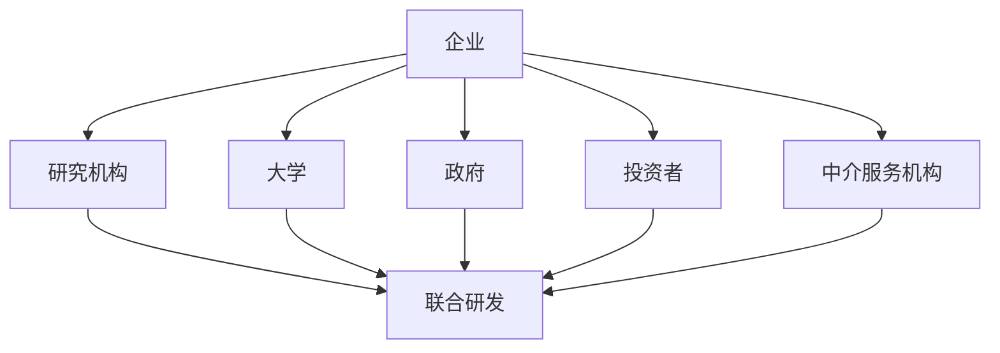
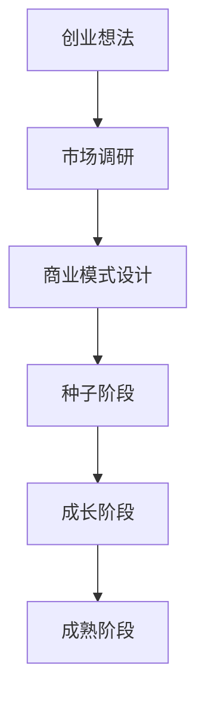

                 

### 文章标题：数字经济中的创新生态系统：创业孵化与产学研合作

#### 关键词：数字经济、创新生态系统、创业孵化、产学研合作

#### 摘要：本文旨在深入探讨数字经济时代下的创新生态系统，特别是创业孵化与产学研合作的重要性与实施策略。通过阐述创新生态系统的核心概念、创业孵化的过程与方法，以及产学研合作的机制与模式，本文提供了对数字经济创新生态系统的全面理解，并提出了具体的应用建议，以促进产业升级和经济发展。

---

### 引言

#### 1.1 数字经济的崛起

随着互联网、大数据、人工智能等技术的飞速发展，全球经济正经历着一场深刻的变革，即数字经济的崛起。数字经济以互联网作为基础设施，通过数字化手段重新定义生产、分配和消费过程，极大地提高了资源配置效率，推动了经济结构优化和产业升级。根据国际数据公司（IDC）的报告，全球数字经济规模已占全球经济总量的40%以上，并且这一比例还在逐年上升。

#### 1.2 创新生态系统的重要性

在数字经济背景下，创新生态系统成为了推动经济增长和社会进步的关键因素。创新生态系统是一个由多个利益相关者（如企业、研究机构、政府、投资者等）组成的复杂网络，通过知识共享、资源整合和协同创新，实现技术突破和商业模式创新。这种生态系统的建立不仅能够加速新技术的应用和商业化，还能激发创业者的创新能力，推动产业创新和创业活动的蓬勃发展。

#### 1.3 创业孵化的角色

创业孵化是创新生态系统的重要组成部分，其目的是通过提供资源、服务和指导，帮助初创企业快速成长。创业孵化不仅包括物理空间的提供，如孵化器、创客空间，还包括政策支持、融资渠道、市场渠道等软性资源的整合。一个成功的创业孵化体系能够为创业者提供全方位的支持，降低创业失败的风险，提高创业成功率。

#### 1.4 产学研合作的必要性

在数字经济时代，科技创新已成为驱动产业升级和国际竞争力提升的关键。产学研合作作为一种有效的创新模式，通过将大学、研究机构和企业的资源、知识和能力整合，实现技术创新和产业应用的双赢。产学研合作不仅能够加速科技成果的转化，还能够培养创新人才，提升企业的创新能力。

### 第一部分：创新生态系统的定义与构建

#### 2.1 创新生态系统的定义

创新生态系统是指由多个主体（包括企业、研究机构、大学、政府、投资者等）组成的复杂网络，通过知识共享、资源整合和协同创新，实现技术突破和商业模式创新的过程。创新生态系统的核心是创新资源的流动和共享，包括知识、信息、资金、人才等。

#### 2.2 创新生态系统的核心要素

- **企业**：作为创新生态系统的主要驱动力，企业通过研发投入和商业模式创新推动技术进步和产业升级。

- **研究机构与大学**：作为知识创新的源头，研究机构和大学通过基础研究和应用研究为产业提供技术支持和创新方案。

- **政府**：政府在创新生态系统中扮演着政策制定者和监管者的角色，通过提供政策支持和资金扶持，推动创新生态系统的建设。

- **投资者**：投资者通过提供资金支持，帮助初创企业快速发展，并促进创新成果的转化。

- **中介服务机构**：如孵化器、创新中心、知识产权服务机构等，为创新生态系统的运行提供平台和资源支持。

#### 2.3 创新生态系统的构建策略

- **加强政策支持**：政府应出台一系列鼓励创新和创业的政策，如税收优惠、资金扶持、知识产权保护等，为创新生态系统的建设提供制度保障。

- **促进资源整合**：通过建立创新创业服务平台，整合政府、企业、研究机构等资源，为创新创业提供全方位的支持。

- **推动产学研合作**：加强大学、研究机构与企业之间的合作，促进科技成果的转化和应用。

- **打造创新创业文化**：营造良好的创新创业氛围，激发创新创业者的热情和创造力。

### 第二部分：创业孵化的过程与方法

#### 3.1 创业孵化的概念

创业孵化是指为初创企业提供资源、服务和指导，帮助其快速成长的过程。创业孵化不仅包括物理空间的提供，如孵化器、创客空间，还包括政策支持、融资渠道、市场渠道等软性资源的整合。

#### 3.2 创业孵化的主要阶段

- **种子阶段**：主要是为初创企业提供创业指导、市场调研、商业模式设计等服务，帮助创业者明确创业方向。

- **成长阶段**：为初创企业提供办公空间、财务顾问、市场营销、人力资源等服务，帮助其快速发展。

- **成熟阶段**：通过投融资支持、市场推广等手段，帮助初创企业实现规模化发展，成为行业中的领军企业。

#### 3.3 创业孵化的方法与工具

- **业务模式画布（Business Model Canvas）**：通过九个关键要素（客户细分、价值主张、渠道、客户关系、收入流、关键资源、关键活动、关键合作伙伴和成本结构），帮助创业者梳理商业模式。

- **精益创业（Lean Startup）**：通过快速迭代和用户反馈，不断优化产品和服务，降低创业风险。

- **客户发展（Customer Development）**：通过市场验证，确保创业项目的市场需求和商业模式可行。

- **加速器（Accelerators）**：提供资金、导师指导、市场资源等，帮助初创企业在短时间内实现快速发展。

#### 3.4 创业孵化的成功案例

- **硅谷孵化器**：如Y Combinator、Techstars等，通过提供资金、导师和资源支持，孵化了众多成功的初创企业。

- **中国创新创业中心**：如清华启迪、北大创业孵化器等，通过整合政府、企业、研究机构等资源，推动创新创业。

### 第三部分：产学研合作的机制与模式

#### 4.1 产学研合作的定义

产学研合作是指大学、研究机构和企业之间的合作，通过资源整合和知识共享，实现技术创新和产业应用的双赢。产学研合作不仅包括技术研发合作，还包括人才培养、资源共享、市场开拓等多个方面。

#### 4.2 产学研合作的机制

- **开放创新**：企业通过开放技术、资源和市场，吸引外部创新资源参与研发，提高创新效率。

- **联合研发**：大学、研究机构和企业共同投入资金和资源，合作进行技术研发。

- **技术转让**：大学、研究机构将研究成果转让给企业，实现技术转化和产业化。

- **人才培养**：大学、研究机构为企业提供人才支持，帮助企业提升创新能力。

#### 4.3 产学研合作的模式

- **产业联盟**：由多个企业、研究机构和大学组成的联盟，通过合作共享资源，实现技术创新。

- **技术转移中心**：专门负责大学、研究机构与企业之间的技术转移和合作。

- **产业孵化器**：为初创企业提供孵化平台，促进产学研合作。

- **人才培养基地**：大学、研究机构为企业提供人才培训，提升企业创新能力。

#### 4.4 产学研合作的挑战与对策

- **挑战**：技术壁垒、知识产权保护、利益分配等问题。

- **对策**：加强政策引导、完善知识产权保护体系、建立公平合理的利益分配机制。

### 第四部分：案例研究

#### 5.1 创新生态系统成功案例

- **硅谷**：作为全球创新生态系统的代表，硅谷通过政府支持、企业创新、大学研究等多方协同，打造了世界级的创新生态系统。

- **深圳**：中国深圳通过建立创新创业中心、推进产学研合作，成为全球创新的重要基地。

#### 5.2 创业孵化成功案例

- **Y Combinator**：通过提供资金、导师和资源支持，孵化了众多成功的初创企业，如Dropbox、Airbnb等。

- **清华启迪**：通过整合政府、企业、研究机构等资源，推动创新创业，成为国内知名的创业孵化平台。

#### 5.3 产学研合作成功案例

- **IBM与MIT**：通过建立联合实验室，开展联合研究，推动技术创新和产业应用。

- **华为与清华**：通过人才培养和产学研合作，共同推进5G技术和产业发展。

### 第五部分：未来展望与建议

#### 6.1 未来发展趋势

- **数字孪生**：通过数字孪生技术，实现虚拟与现实的无缝连接，推动产业升级和创新发展。

- **区块链**：区块链技术的广泛应用，将推动供应链管理、金融、医疗等领域的创新发展。

- **人工智能**：人工智能技术的发展，将进一步推动各行业的智能化升级。

#### 6.2 政策建议

- **完善政策体系**：加强创新政策的引导和支持，优化创新创业环境。

- **强化产学研合作**：推动大学、研究机构和企业之间的深度合作，提升技术创新能力。

- **加强人才培养**：加大人才培养力度，培养具备创新能力的高素质人才。

#### 6.3 企业建议

- **积极创新**：企业应加强技术研发投入，推动商业模式创新。

- **合作共赢**：企业应加强与大学、研究机构的合作，实现技术共享和资源整合。

### 结尾

本文通过对数字经济中的创新生态系统、创业孵化与产学研合作的深入探讨，揭示了其在推动经济发展和社会进步中的重要作用。未来，随着数字经济的不断深入发展，创新生态系统、创业孵化和产学研合作将迎来更加广阔的发展空间。我们呼吁各方共同努力，构建更加完善和创新生态系统，为数字经济的发展贡献力量。

---

### 参考文献

1. 国际数据公司（IDC）. (2022). 全球数字经济规模报告.
2. Y Combinator. (n.d.). Y Combinator官方网站.
3. Techstars. (n.d.). Techstars官方网站.
4. 清华启迪. (n.d.). 清华启迪官方网站.
5. IBM与MIT联合实验室. (n.d.). IBM与MIT联合实验室官方网站.
6. 华为. (n.d.). 华为官方网站.

### 作者信息

作者：AI天才研究院/AI Genius Institute & 禅与计算机程序设计艺术 /Zen And The Art of Computer Programming

---

### 附录

#### A.1 数字经济术语解释

- **数字经济**：以数字化的信息和知识为关键生产要素，以现代信息网络为重要载体，通过信息通信技术手段推动经济社会发展的经济形态。
- **创新生态系统**：由多个利益相关者组成的复杂网络，通过知识共享、资源整合和协同创新，实现技术突破和商业模式创新。
- **创业孵化**：为初创企业提供资源、服务和指导，帮助其快速成长的过程。
- **产学研合作**：大学、研究机构和企业之间的合作，通过资源整合和知识共享，实现技术创新和产业应用的双赢。

#### A.2 创新生态系统核心要素对比表格

| 核心要素 | 定义 | 角色 |
| :----: | :----: | :----: |
| 企业 | 创新生态系统的主要驱动力 | 提供研发投入和商业模式创新 |
| 研究机构与大学 | 知识创新的源头 | 提供技术支持和创新方案 |
| 政府 | 政策制定者和监管者 | 提供政策支持和资金扶持 |
| 投资者 | 提供资金支持 | 促进创新成果的转化 |
| 中介服务机构 | 提供平台和资源支持 | 整合各方资源，推动创新 |

#### A.3 产学研合作模式ER实体关系图

#### A.4 创业孵化流程Mermaid流程图

---

通过上述内容和结构，我们构建了一篇关于数字经济中的创新生态系统、创业孵化与产学研合作的专业技术博客文章。文章内容涵盖了核心概念、过程方法、机制模式、案例研究和未来展望，旨在为读者提供一个全面、深入的解读。同时，通过引用和附录部分，进一步增强了文章的专业性和完整性。希望这篇文章能够为相关领域的研究者和从业者提供有价值的参考和启示。

