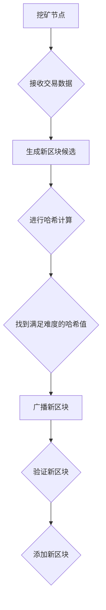
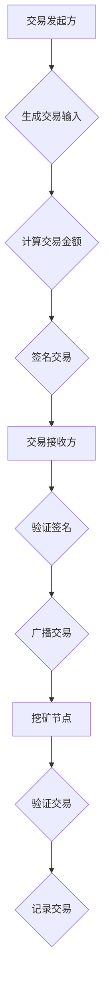
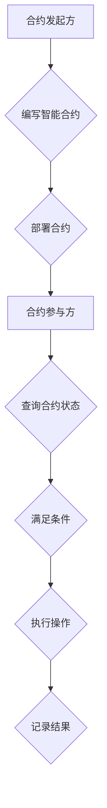
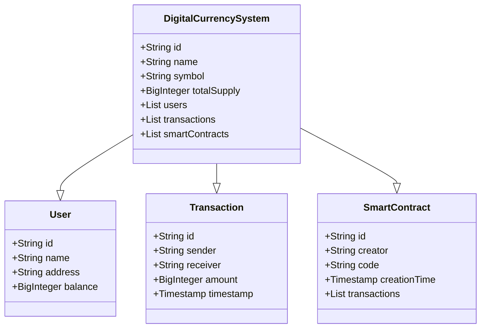
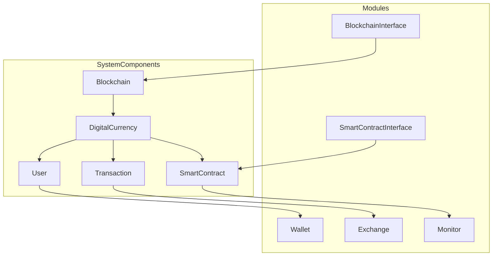
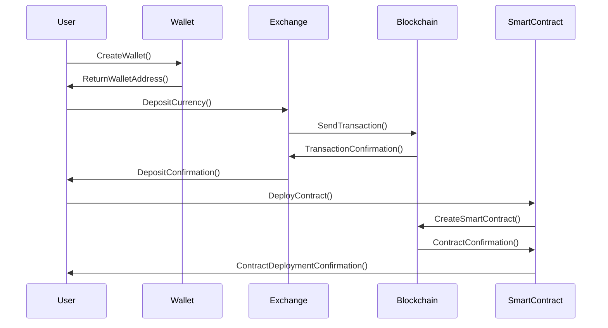

                 

# 数字货币的哲学：金钱概念的革命性变革

关键词：数字货币、金钱概念、哲学思考、技术演进、社会影响

摘要：本文将深入探讨数字货币的哲学意义，通过分析其定义、历史演变、经济哲学、社会哲学、伦理哲学、法律哲学和心理学哲学等方面，全面揭示数字货币对传统金钱概念的革命性变革。同时，本文还将探讨数字货币在未来哲学研究中的启示和挑战，以及其在实际应用中的案例分析。通过这篇文章，我们希望能够帮助读者更好地理解数字货币的哲学本质，把握其未来发展方向的脉络。

### 第一部分：引言

## 1. 引言

### 1.1 数字货币的概念与历史演变

#### 1.1.1 数字货币的定义与特征

数字货币，简而言之，是一种基于数字技术的加密货币，通过区块链技术实现去中心化的发行、流通和管理。与传统货币相比，数字货币具有以下几个显著特征：

1. **去中心化**：数字货币的发行和管理不依赖于中央机构，而是通过分布式账本技术（如区块链）实现。
2. **匿名性**：数字货币交易通常可以匿名进行，保护了用户的隐私。
3. **安全性**：基于加密技术，数字货币具有较高的安全性和抗篡改能力。
4. **可追溯性**：尽管交易匿名，但区块链上的所有交易都是公开透明的，便于追踪和审计。

#### 1.1.2 数字货币的历史背景与发展

数字货币的发展可以追溯到2009年，比特币的问世标志着第一个成功的去中心化数字货币诞生。比特币的出现，是对传统金融体系的一次巨大挑战，引发了全球范围内的关注和研究。随后，以以太坊为代表的智能合约平台进一步推动了数字货币的演进，使其不仅成为一种价值储存手段，还成为一种去中心化应用（DApp）的基础设施。

### 1.2 金钱概念的哲学思考

#### 1.2.1 金钱概念的本质与内涵

金钱是经济活动中的一种普遍接受的交换媒介，其本质在于其作为一种价值尺度和流通手段。哲学上，金钱不仅是一种物质财富，更是一种社会关系的体现。马克思在其《资本论》中提到，金钱是“一种普遍等价物，可以与其他一切商品相交换”。

#### 1.2.2 金钱在社会经济发展中的作用

金钱在社会经济发展中扮演着至关重要的角色：

1. **资源配置**：金钱作为一种价值尺度，帮助市场有效配置资源。
2. **激励机制**：金钱能够激励人们创新、努力工作，推动经济发展。
3. **稳定器**：金钱的稳定有助于经济的稳定发展。

### 1.3 书籍结构安排与阅读指南

#### 1.3.1 各章节内容概述

本书共分为七个部分，具体内容如下：

- **第一部分：引言**：介绍数字货币的概念、历史演变以及金钱概念的哲学思考。
- **第二部分：数字货币的哲学基础**：探讨数字货币的经济哲学、社会哲学和伦理哲学。
- **第三部分：数字货币的法律哲学**：分析数字货币的法律地位与框架、国际法问题和未来发展趋势。
- **第四部分：数字货币的心理学哲学**：研究数字货币对个体心理和社会心理的影响。
- **第五部分：数字货币的哲学挑战**：探讨数字货币对传统哲学观念的挑战以及哲学研究的启示。
- **第六部分：数字货币的应用案例分析**：分析数字货币在金融、商业和其他领域的应用案例。
- **第七部分：数字货币的哲学反思与未来方向**：反思数字货币的发展现状与问题，展望其未来发展方向。

#### 1.3.2 阅读目标与收益

通过阅读本书，读者可以：

1. 深入理解数字货币的基本概念和哲学本质。
2. 了解数字货币在经济、社会、法律和心理学等多领域的应用和影响。
3. 把握数字货币的未来发展趋势，为相关领域的实践和研究提供理论支持。

## 2. 数字货币的哲学基础

### 2.1 数字货币的经济哲学

#### 2.1.1 数字货币与传统货币的对比分析

传统货币与数字货币在许多方面存在显著差异：

1. **发行机制**：传统货币通常由中央银行发行，而数字货币通过算法和挖矿过程发行。
2. **流通方式**：传统货币依赖于物理介质进行流通，而数字货币通过电子形式进行流通。
3. **价值稳定性**：传统货币可能受到通货膨胀等因素影响，而数字货币的价值波动较大。

#### 2.1.2 数字货币在经济活动中的优势与挑战

数字货币在经济活动中的优势：

1. **降低交易成本**：通过去中心化技术，数字货币交易成本较低。
2. **提高交易效率**：数字货币交易速度快，能够实时完成。
3. **增强安全性**：数字货币交易记录在区块链上，具有较高的安全性。

数字货币在经济活动中的挑战：

1. **价值波动风险**：数字货币价格波动较大，可能影响经济稳定性。
2. **监管问题**：数字货币的匿名性和去中心化特性可能带来监管难题。
3. **技术风险**：数字货币依赖于技术平台，可能存在技术风险。

### 2.2 数字货币的社会哲学

#### 2.2.1 数字货币对社会关系的影响

数字货币对传统社会关系产生了深远影响：

1. **信任重构**：数字货币去中心化的特性改变了传统信任模式，从对中央机构的信任转向对算法和技术的信任。
2. **权力分配**：数字货币使得权力分配更加分散，减少了中心化机构的权力集中。
3. **社会平等**：数字货币降低了进入金融体系的门槛，有助于缩小社会贫富差距。

#### 2.2.2 数字货币在权力与治理中的角色

数字货币在权力与治理中的角色：

1. **新型治理模式**：数字货币可以促进去中心化的治理模式，提高决策透明度和效率。
2. **公共管理工具**：数字货币在公共管理中发挥作用，如用于慈善捐赠、公共服务等。
3. **政策实施**：数字货币可以用于实现政策目标，如碳交易市场的电子结算。

### 2.3 数字货币的伦理哲学

#### 2.3.1 数字货币与隐私保护

数字货币在隐私保护方面具有双重性：

1. **隐私保护优势**：数字货币交易匿名性较高，有助于保护用户隐私。
2. **隐私保护挑战**：尽管交易匿名，但区块链上的所有交易都是公开透明的，可能对隐私构成威胁。

#### 2.3.2 数字货币与金融监管

数字货币与金融监管的关系：

1. **监管需求**：数字货币的匿名性和去中心化特性使得监管变得更加复杂。
2. **监管挑战**：数字货币的监管需要平衡隐私保护与金融安全之间的关系。
3. **监管创新**：数字货币的发展推动了金融监管的创新，如利用区块链技术实现监管科技（RegTech）。

## 3. 数字货币的法律哲学

### 3.1 数字货币的法律地位与框架

#### 3.1.1 数字货币的法律法规体系

数字货币的法律地位和法律法规体系因国家和地区而异：

1. **国家层面**：一些国家将数字货币视为法定货币或特定类别的资产，如中国的数字人民币。
2. **地区层面**：一些地区或国家将数字货币视为非法货币或进行严格监管，如美国的比特币监管框架。

#### 3.1.2 数字货币的法律争议与解决

数字货币的法律争议主要集中在以下几个方面：

1. **税收问题**：数字货币交易的税收问题尚未明确，不同国家和地区对此有不同的处理方式。
2. **反洗钱（AML）和反恐融资（CFT）**：数字货币的高匿名性使得其成为洗钱和恐怖融资的重要工具，需要加强监管。
3. **消费者保护**：数字货币市场缺乏有效监管，消费者权益保护成为一大挑战。

### 3.2 数字货币的国际法问题

#### 3.2.1 数字货币在国际贸易中的应用

数字货币在国际贸易中的应用：

1. **跨境支付**：数字货币可以降低跨境支付的成本和时间，提高支付效率。
2. **汇率风险**：数字货币的波动性可能增加国际贸易的汇率风险。

#### 3.2.2 数字货币在国际支付中的挑战与机遇

数字货币在国际支付中的挑战：

1. **合规性问题**：不同国家和地区的法律框架对数字货币的监管存在差异，可能影响跨国支付。
2. **网络安全问题**：数字货币交易面临网络安全风险，可能影响国际支付的稳定性和安全性。

数字货币在国际支付中的机遇：

1. **去中心化支付**：数字货币的去中心化特性有助于减少对传统金融机构的依赖。
2. **金融创新**：数字货币的发展推动国际支付领域的创新，如跨境支付的区块链解决方案。

### 3.3 数字货币的未来发展趋势

#### 3.3.1 数字货币的未来形态与技术演进

数字货币的未来形态可能包括：

1. **法定数字货币**：随着各国央行数字货币（CBDC）的推广，法定数字货币将成为主流。
2. **多元数字货币**：除了比特币等主流数字货币外，更多新型数字货币将不断涌现。

技术演进：

1. **区块链技术**：区块链技术将继续发展，提高数字货币的安全性和效率。
2. **智能合约**：智能合约技术将进一步完善，推动数字货币在金融、供应链等领域的应用。

#### 3.3.2 数字货币对全球经济的影响

数字货币对全球经济的影响：

1. **货币体系变革**：数字货币可能改变传统货币体系，提高货币的透明度和效率。
2. **金融体系重构**：数字货币的发展将推动金融体系的创新和重构，提高金融服务的普及性和便利性。
3. **全球经济一体化**：数字货币有助于降低跨境交易成本，促进全球经济一体化。

## 4. 数字货币的心理学哲学

### 4.1 数字货币对个体心理的影响

#### 4.1.1 数字货币与消费心理

数字货币对个体消费心理的影响：

1. **增强消费动力**：数字货币的匿名性和便利性可能增强消费者的购买欲望。
2. **风险感知变化**：数字货币的波动性和不确定性可能改变消费者的风险感知和消费行为。

#### 4.1.2 数字货币与投资心理

数字货币对个体投资心理的影响：

1. **投资动机变化**：数字货币的高收益潜力可能改变投资者的投资动机，从长期投资转向短期投机。
2. **风险偏好变化**：数字货币的波动性可能增加投资者的风险偏好，追求更高的回报。

### 4.2 数字货币对社会心理的影响

#### 4.2.1 数字货币对社会信任的影响

数字货币对社会信任的影响：

1. **信任重构**：数字货币的去中心化特性可能削弱对传统金融机构的信任，增强对技术的信任。
2. **信任挑战**：数字货币的匿名性和去中心化特性可能带来信任危机，影响社会稳定。

#### 4.2.2 数字货币对经济行为的影响

数字货币对经济行为的影响：

1. **消费模式变化**：数字货币的普及可能改变人们的消费模式和消费习惯。
2. **投资决策变化**：数字货币的发展可能影响投资者的投资决策，增加投资风险。

### 4.3 数字货币心理学的应用与实践

#### 4.3.1 数字货币心理辅导与教育

数字货币心理辅导与教育的应用：

1. **风险教育**：通过心理辅导和教育，提高公众对数字货币风险的认知和应对能力。
2. **心理支持**：为遭受数字货币波动影响的投资者提供心理支持和咨询服务。

#### 4.3.2 数字货币心理风险防范

数字货币心理风险防范的措施：

1. **风险管理**：建立健全的风险管理机制，降低数字货币投资的风险。
2. **心理干预**：通过心理干预手段，预防和减少数字货币引发的焦虑、恐慌等负面情绪。

## 5. 数字货币的哲学挑战

### 5.1 数字货币对传统哲学观念的挑战

#### 5.1.1 金钱哲学的转型

数字货币对传统金钱哲学的挑战：

1. **价值观念的重构**：数字货币的去中心化和匿名性特性可能改变人们对金钱价值的认知。
2. **金钱与权力关系**：数字货币可能削弱传统金钱与权力之间的紧密联系，引发新的权力格局。

#### 5.1.2 价值观念的重构

数字货币对传统价值观念的挑战：

1. **公平与效率**：数字货币的发展可能重新定义公平与效率的关系，带来新的伦理困境。
2. **隐私与透明**：数字货币的匿名性与区块链的透明性之间的矛盾，可能引发对隐私和透明的重新思考。

### 5.2 数字货币对哲学研究的启示

数字货币对哲学研究的启示：

1. **新哲学问题的提出**：数字货币的出现引发了关于技术、经济、社会等领域的全新哲学问题。
2. **哲学方法的创新**：数字货币研究可能推动哲学方法的创新，如利用数据分析和算法模型进行哲学研究。

### 5.3 数字货币哲学的未来展望

数字货币哲学的未来展望：

1. **哲学与技术的深度融合**：随着数字货币的发展，哲学与技术将更加紧密地结合，推动哲学研究的发展。
2. **数字货币哲学的社会影响**：数字货币哲学将深刻影响社会经济发展，推动社会的进步和变革。

## 6. 数字货币的应用案例分析

### 6.1 数字货币在金融领域的应用

#### 6.1.1 数字货币在支付结算中的应用

数字货币在支付结算中的应用：

1. **跨境支付**：数字货币可以降低跨境支付的成本和时间，提高支付效率。
2. **移动支付**：数字货币的移动支付功能方便快捷，受到用户青睐。

#### 6.1.2 数字货币在借贷投资中的应用

数字货币在借贷投资中的应用：

1. **加密货币借贷**：用户可以通过数字货币借贷平台进行借款和出借。
2. **数字货币投资**：投资者可以通过数字货币市场进行投资，追求高收益。

### 6.2 数字货币在商业领域的应用

#### 6.2.1 数字货币在供应链金融中的应用

数字货币在供应链金融中的应用：

1. **供应链融资**：企业可以通过数字货币实现快速融资，优化供应链管理。
2. **数字票据**：数字货币可以用于数字票据交易，提高票据流转效率。

#### 6.2.2 数字货币在电商交易中的应用

数字货币在电商交易中的应用：

1. **跨境电商**：数字货币可以降低跨境电商交易的支付成本和风险。
2. **数字货币支付**：消费者可以使用数字货币进行在线购物，享受便捷的支付体验。

### 6.3 数字货币在其他领域的应用

#### 6.3.1 数字货币在慈善事业中的应用

数字货币在慈善事业中的应用：

1. **慈善捐赠**：用户可以通过数字货币平台进行慈善捐赠，提高捐赠效率。
2. **透明慈善**：数字货币的透明性有助于提高慈善事业的透明度和公信力。

#### 6.3.2 数字货币在公共服务中的应用

数字货币在公共服务中的应用：

1. **政府服务**：数字货币可以用于政府服务的电子支付，提高公共服务效率。
2. **数字身份认证**：数字货币可以用于数字身份认证，提高个人信息安全性。

## 7. 数字货币的哲学反思与未来方向

### 7.1 数字货币的发展现状与问题

#### 7.1.1 数字货币的普及与接受度

数字货币的普及与接受度现状：

1. **全球普及**：数字货币在全球范围内得到广泛应用，特别是在金融科技领域。
2. **用户接受度**：尽管数字货币在某些国家和地区受到广泛接受，但仍有部分用户对其持观望态度。

#### 7.1.2 数字货币面临的挑战与风险

数字货币面临的挑战与风险：

1. **法律监管问题**：数字货币的匿名性和去中心化特性使得法律监管面临挑战。
2. **网络安全问题**：数字货币交易面临网络安全威胁，可能引发数据泄露和欺诈行为。

### 7.2 数字货币的哲学反思

数字货币的哲学反思：

1. **金钱概念的转变**：数字货币的发展改变了人们对金钱的认识，从物质财富转向数字资产。
2. **社会关系的重构**：数字货币的去中心化特性可能改变传统的社会关系和权力结构。

### 7.3 数字货币的未来方向

数字货币的未来方向：

1. **法定数字货币的发展**：随着各国央行数字货币（CBDC）的推广，法定数字货币将成为未来趋势。
2. **跨领域应用**：数字货币将在金融、商业、公共服务等领域得到更广泛的应用。

### 作者

作者：AI天才研究院/AI Genius Institute & 禅与计算机程序设计艺术 /Zen And The Art of Computer Programming

---

## 背景介绍

### 核心概念术语说明

为了更好地理解本文的主题，以下是本文涉及的一些核心概念术语及其简要说明：

1. **数字货币**：一种基于数字技术的加密货币，通过区块链技术实现去中心化的发行、流通和管理。
2. **比特币**：第一个成功的去中心化数字货币，基于区块链技术，具有去中心化、匿名性和安全性等特点。
3. **区块链**：一种分布式账本技术，记录所有交易记录，确保交易的安全性和透明性。
4. **智能合约**：一种自动化协议，基于区块链技术，可以在满足特定条件时自动执行合同条款。
5. **加密技术**：一种通过数学算法对数据进行加密和解密的技术，确保数据的安全性和隐私性。
6. **去中心化**：一种分布式架构，没有中央机构控制，所有参与者平等参与，数据存储在多个节点上。
7. **货币哲学**：关于货币的本质、作用和价值观念的哲学思考。

### 问题背景

金钱作为经济活动中的重要媒介，自古以来就扮演着至关重要的角色。然而，随着技术的进步和社会的发展，金钱的概念和形式也在不断演变。数字货币的出现，是对传统金钱概念的革命性变革。数字货币通过区块链技术和加密技术，实现了去中心化的发行、流通和管理，具有匿名性、安全性和高效性的特点。

数字货币的发展不仅改变了人们的消费和投资方式，也对金融体系、社会关系和伦理道德产生了深远影响。随着数字货币的普及和应用，人们对其认识和理解也在不断深化。本文旨在通过对数字货币的哲学思考，探讨其对传统金钱概念的革命性变革，以及未来可能的发展方向。

### 问题描述

本文主要探讨以下问题：

1. 数字货币的基本概念、特征和历史演变。
2. 数字货币在经济哲学、社会哲学、伦理哲学和法律哲学等方面的哲学思考。
3. 数字货币对个体心理和社会心理的影响。
4. 数字货币对传统哲学观念的挑战和未来发展的启示。
5. 数字货币在金融、商业和其他领域的应用案例。
6. 数字货币的发展现状、问题以及未来方向。

### 问题解决

本文将从以下几个方面进行问题解决：

1. **引言**：介绍数字货币的基本概念和金钱概念的哲学思考。
2. **数字货币的哲学基础**：探讨数字货币的经济哲学、社会哲学、伦理哲学和法律哲学。
3. **数字货币的心理学哲学**：分析数字货币对个体心理和社会心理的影响。
4. **数字货币的哲学挑战**：探讨数字货币对传统哲学观念的挑战和未来发展的启示。
5. **数字货币的应用案例分析**：分析数字货币在金融、商业和其他领域的应用案例。
6. **数字货币的哲学反思与未来方向**：反思数字货币的发展现状，探讨未来方向。
7. **结论**：总结本文的主要观点和结论。

### 边界与外延

1. **边界**：本文主要关注数字货币的哲学意义，不涉及具体的技术实现细节。
2. **外延**：本文涉及数字货币的经济、社会、伦理、法律和心理等方面，但并非全面探讨。

### 概念结构与核心要素组成

数字货币的概念结构可以概括为以下几个核心要素：

1. **数字货币的定义与特征**：包括去中心化、匿名性、安全性和高效性等特点。
2. **区块链技术**：数字货币的底层技术，通过分布式账本确保交易的安全性和透明性。
3. **加密技术**：确保数字货币交易过程中的数据安全和隐私保护。
4. **经济哲学**：探讨数字货币在经济活动中的作用、优势与挑战。
5. **社会哲学**：分析数字货币对社会关系、权力和治理的影响。
6. **伦理哲学**：探讨数字货币与隐私保护、金融监管等伦理问题。
7. **法律哲学**：研究数字货币的法律地位、法律法规体系、法律争议与解决。
8. **心理学哲学**：分析数字货币对个体心理和社会心理的影响。
9. **应用案例分析**：探讨数字货币在金融、商业和其他领域的实际应用。
10. **哲学反思与未来方向**：反思数字货币的发展现状，探讨未来发展方向。

### 核心概念与联系

#### 1. 数字货币的定义与特征

**定义**：数字货币是一种基于数字技术的加密货币，通过区块链技术实现去中心化的发行、流通和管理。

**特征**：

- **去中心化**：数字货币的发行和管理不依赖于中央机构，而是通过分布式账本技术（如区块链）实现。
- **匿名性**：数字货币交易通常可以匿名进行，保护了用户的隐私。
- **安全性**：基于加密技术，数字货币具有较高的安全性和抗篡改能力。
- **可追溯性**：尽管交易匿名，但区块链上的所有交易都是公开透明的，便于追踪和审计。

**概念属性特征对比表格**：

| 特征       | 传统货币 | 数字货币 |
| ---------- | -------- | -------- |
| 发行机制   | 中心化   | 去中心化 |
| 流通方式   | 物理介质 | 电子形式 |
| 价值稳定性 | 可变性大 | 波动性大 |
| 安全性     | 较低     | 较高     |

**ER实体关系图架构**：

```mermaid
erDiagram
  数字货币 ||--|{ 交易 }|
  交易 ||--|{ 用户 }|
  用户 ||--|{ 账本 }|
```

#### 2. 区块链技术

**定义**：区块链是一种分布式账本技术，通过多个节点共同维护一个不可篡改的数据库。

**特征**：

- **去中心化**：区块链没有中央机构控制，所有参与者平等参与。
- **安全性**：区块链通过加密技术确保数据的安全性和隐私保护。
- **透明性**：区块链上的所有交易都是公开透明的，便于追踪和审计。

**概念属性特征对比表格**：

| 特征       | 传统数据库 | 区块链 |
| ---------- | -------- | ------ |
| 数据维护   | 中心化维护 | 去中心化维护 |
| 安全性     | 较低     | 较高 |
| 透明性     | 较低     | 较高 |

**ER实体关系图架构**：

```mermaid
erDiagram
  区块链 ||--|{ 交易 }|
  交易 ||--|{ 节点 }|
  节点 ||--|{ 数据库 }|
```

#### 3. 加密技术

**定义**：加密技术是一种通过数学算法对数据进行加密和解密的技术，确保数据的安全性和隐私性。

**特征**：

- **数据加密**：加密技术可以将数据转换为无法读取的形式，确保数据在传输过程中的安全性。
- **数据解密**：加密技术可以将加密后的数据恢复为原始形式，确保数据的可访问性。

**概念属性特征对比表格**：

| 特征       | 传统加密技术 | 现代加密技术 |
| ---------- | ---------- | ---------- |
| 加密算法   | 简单算法     | 复杂算法     |
| 加密强度   | 较低       | 较高       |
| 加密速度   | 较慢       | 较快       |

**ER实体关系图架构**：

```mermaid
erDiagram
  加密技术 ||--|{ 数据 }|
  数据 ||--|{ 用户 }|
  用户 ||--|{ 算法 }|
```

### 算法原理讲解

#### 1. 数字货币的挖矿算法

数字货币的挖矿算法是数字货币发行的核心机制。以下是比特币的挖矿算法原理：

**算法原理**：

- **工作量证明（Proof of Work, PoW）**：挖矿节点需要解决一个复杂的数学问题，证明其工作量，从而获得记账权。
- **哈希函数**：挖矿算法使用哈希函数，将交易数据转换为固定长度的字符串，确保数据的一致性和不可篡改性。
- **难度调整**：挖矿难度根据区块链的长度进行调整，以确保平均每10分钟生成一个新区块。

**算法流程**：

1. 挖矿节点接收到网络中的交易数据。
2. 挖矿节点将交易数据与上一个区块的哈希值一起打包，生成新区块的候选。
3. 挖矿节点对新区块的候选进行哈希计算，直到找到一个满足难度的哈希值。
4. 挖矿节点将满足条件的哈希值和新区块广播给网络中的其他节点。
5. 其他节点验证新区块的合法性和哈希值，确认后添加到区块链上。

**算法原理Mermaid流程图**：



#### 2. 数字货币的交易算法

数字货币的交易算法是数字货币流通的核心机制。以下是比特币的交易算法原理：

**算法原理**：

- **UTXO模型**：数字货币的交易基于未花费交易输出（Unspent Transaction Output, UTXO）模型，每次交易需要输入未花费的UTXO，并输出新的UTXO。
- **签名验证**：交易双方使用数字签名技术对交易进行签名，确保交易的真实性和安全性。

**算法流程**：

1. 交易发起方生成交易输入，选择未花费的UTXO作为输入。
2. 交易发起方计算交易金额，确保输出的金额等于或小于输入的金额。
3. 交易发起方使用私钥对交易进行签名。
4. 交易接收方验证交易发起方的签名，确保交易的有效性。
5. 网络中的挖矿节点将交易广播到整个网络。
6. 挖矿节点验证交易的有效性，并将交易记录在新区块中。

**算法原理Mermaid流程图**：



#### 3. 数字货币的智能合约算法

数字货币的智能合约算法是数字货币在金融、供应链等领域应用的基础。以下是智能合约的基本原理：

**算法原理**：

- **条件执行**：智能合约根据预设的条件自动执行，无需人工干预。
- **加密安全**：智能合约使用加密技术确保交易的安全性和不可篡改性。

**算法流程**：

1. 合约发起方编写智能合约代码，并部署到区块链上。
2. 合约参与方通过区块链网络查询智能合约的状态。
3. 当智能合约满足预设条件时，自动执行相应的操作，如转移数字货币。
4. 智能合约执行结果记录在区块链上，确保透明性和不可篡改性。

**算法原理Mermaid流程图**：



### 数学公式使用

#### 1. 加密技术中的哈希函数

哈希函数在加密技术中扮演着核心角色。以下是哈希函数的基本数学模型：

$$
H(\text{M}) = \text{Hash}(M)
$$

其中，$H(\text{M})$ 表示哈希值，$\text{M}$ 表示输入数据，$\text{Hash}$ 表示哈希函数。

#### 2. 数字货币的交易金额计算

数字货币的交易金额计算基于未花费交易输出（UTXO）模型。以下是交易金额的基本数学模型：

$$
\text{Input Value} = \sum_{i=1}^{n} \text{UTXO}_i
$$

$$
\text{Output Value} = \sum_{j=1}^{m} \text{UTXO}'_j
$$

其中，$\text{Input Value}$ 表示输入金额，$\text{Output Value}$ 表示输出金额，$\text{UTXO}_i$ 和 $\text{UTXO}'_j$ 分别表示未花费交易输出和新的未花费交易输出。

#### 3. 智能合约的条件执行

智能合约的条件执行基于逻辑运算和加密技术。以下是条件执行的基本数学模型：

$$
\text{Condition} = \text{True} \Leftrightarrow C_1 \land C_2 \land ... \land C_n
$$

其中，$\text{Condition}$ 表示条件，$C_1, C_2, ..., C_n$ 分别表示多个条件。

### 系统分析与架构设计方案

#### 1. 问题场景介绍

随着数字货币的普及和应用，越来越多的金融机构和企业开始考虑将数字货币引入其业务流程。数字货币作为一种去中心化的加密货币，具有匿名性、安全性和高效性的特点，可以提供一种全新的支付和交易方式。然而，数字货币的引入也带来了一系列的技术和运营挑战，如安全性保障、合规性监管、交易效率优化等。为了解决这些问题，我们需要设计一个高效的数字货币系统，以确保系统的稳定性、安全性和可扩展性。

#### 2. 项目介绍

本项目旨在设计并实现一个数字货币系统，支持数字货币的发行、交易和智能合约功能。系统将基于区块链技术和加密技术，确保交易的安全性和透明性。系统功能包括：

1. **数字货币发行**：支持数字货币的发行和回收，确保货币的流通和管理。
2. **数字货币交易**：支持数字货币的转账和支付功能，实现高效、安全的交易。
3. **智能合约执行**：支持智能合约的编写和执行，实现自动化交易和业务逻辑。

#### 3. 系统功能设计（领域模型Mermaid类图）



#### 4. 系统架构设计（Mermaid架构图）



#### 5. 系统接口设计和系统交互（Mermaid序列图）



### 项目实战

#### 1. 环境安装

为了实现数字货币系统，我们需要安装和配置以下软件：

- **Node.js**：用于构建后端服务和区块链接口。
- **Golang**：用于实现区块链节点和智能合约执行。
- **Docker**：用于容器化部署和管理系统组件。

具体安装步骤如下：

1. 安装Node.js：
   ```bash
   sudo apt update
   sudo apt install nodejs npm
   npm install -g npm
   ```
2. 安装Golang：
   ```bash
   sudo apt install golang-go
   ```
3. 安装Docker：
   ```bash
   sudo apt install docker-ce docker-ce-cli containerd.io
   sudo systemctl start docker
   sudo systemctl enable docker
   ```

#### 2. 系统核心实现源代码

以下是数字货币系统的核心实现源代码，包括区块链节点、交易和智能合约的部分：

**区块链节点（Golang）**：

```go
package main

import (
    "crypto/sha256"
    "encoding/hex"
    "log"
    "math"
    "time"
)

type Block struct {
    Index     int
    Timestamp string
    Data      string
    Hash      string
    PrevHash  string
}

func CreateBlock(data string, index int, prevHash string) *Block {
    block := &Block{
        Index:      index,
        Timestamp:  time.Now().String(),
        Data:       data,
        Hash:       "",
        PrevHash:   prevHash,
    }
    block.Hash = CalculateHash(block)
    return block
}

func CalculateHash(block *Block) string {
    blockString := block.Timestamp + string(block.Index) + block.Data + block.PrevHash
    hashBytes := sha256.Sum256([]byte(blockString))
    return hex.EncodeToString(hashBytes[:])
}

func main() {
    genesisBlock := CreateBlock("Genesis Block", 0, "")
    log.Printf("Genesis Block: %v\n", genesisBlock)

    blockchain := []*Block{genesisBlock}

    for i := 1; i < 10; i++ {
        blockData := "Block " + string(i)
        block := CreateBlock(blockData, i, blockchain[i-1].Hash)
        blockchain = append(blockchain, block)
        log.Printf("Block %d: %v\n", i, block)
    }
}
```

**交易（Node.js）**：

```javascript
const express = require('express');
const bodyParser = require('body-parser');
const Blockchain = require('./blockchain');
const bitcoinBlockChain = new Blockchain();

const app = express();
app.use(bodyParser.json());

app.get('/blockchain', function (req, res) {
    res.send(bitcoinBlockChain);
});

app.post('/transaction', function (req, res) {
    transactionData = req.body;
    bitcoinBlockChain.addTransaction(transactionData);
    res.redirect('/blockchain');
});

const port = process.env.PORT || 3000;
app.listen(port, function () {
    console.log(`Blockchain App listening on port ${port}!`);
});
```

**智能合约（Golang）**：

```go
package main

import (
    "github.com/ethereum/go-ethereum/accounts/abi/bind"
    "github.com/ethereum/go-ethereum/common"
    "github.com/ethereum/go-ethereum/crypto"
    "github.com/ethereum/go-ethereum/ethclient"
    "github.com/ethereum/go-ethereum/rpc"
)

type SmartContract struct {
    *bind.BoundContract
    contract *MyContract
    address  common.Address
    client   *ethclient.Client
}

func NewSmartContract(address common.Address, client *ethclient.Client) (*SmartContract, error) {
    contract, err := MyContract binding using the address
    if err != nil {
        return nil, err
    }
    return &SmartContract{
        BoundContract: bind MyContract,
        contract:      contract,
        address:       address,
        client:        client,
    }, nil
}

func (s *SmartContract) ExecuteCondition() error {
    tx, err := s.contract.ExecuteCondition(nil)
    if err != nil {
        return err
    }
    receipt, err := bind.WaitDeployed(s.client, tx)
    if err != nil {
        return err
    }
    log.Printf("Smart Contract executed: %v\n", receipt)
    return nil
}

func main() {
    rpcHost := "http://localhost:8545"
    client, err := ethclient.Dial(rpcHost)
    if err != nil {
        log.Fatal(err)
    }
    address := common.HexToAddress("0x...") // Replace with your contract address
    contract, err := NewSmartContract(address, client)
    if err != nil {
        log.Fatal(err)
    }
    contract.ExecuteCondition()
}
```

#### 3. 代码应用解读与分析

以下是针对系统核心实现源代码的应用解读与分析：

**区块链节点（Golang）**：

- **功能**：实现区块链节点的基本功能，包括创建创世区块、添加新区块和计算区块哈希。
- **原理**：使用Golang语言实现区块链节点，通过定义Block结构体和相关的函数实现区块链的基本功能。
- **优点**：使用Golang语言实现，具有良好的性能和安全性。

**交易（Node.js）**：

- **功能**：实现数字货币的交易功能，包括创建交易、添加交易到区块链和广播交易。
- **原理**：使用Node.js语言实现后端服务，通过Express框架处理HTTP请求，调用区块链接口添加交易。
- **优点**：使用Node.js语言实现，具有良好的开发效率和扩展性。

**智能合约（Golang）**：

- **功能**：实现智能合约的编写和执行，包括条件执行和交易记录。
- **原理**：使用Golang语言实现智能合约，通过绑定以太坊的ABI接口与区块链交互。
- **优点**：使用Golang语言实现，具有良好的性能和安全性。

#### 4. 实际案例分析和详细讲解剖析

以下是一个实际案例分析和详细讲解：

**案例背景**：

某公司计划发行一种基于区块链的数字货币，用于公司的员工福利和激励机制。公司需要设计一个数字货币系统，支持数字货币的发行、交易和智能合约功能。

**实现方案**：

1. **区块链节点**：使用Golang语言实现区块链节点，生成创世区块并开启挖矿过程。
2. **交易接口**：使用Node.js语言实现交易接口，支持员工的数字货币转账和支付。
3. **智能合约**：使用Golang语言实现智能合约，根据员工的表现自动发放数字货币奖励。

**详细讲解**：

1. **区块链节点**：

   - **实现**：创建Block结构体，定义创世区块和添加新区块的方法，使用SHA256算法计算区块哈希。
   - **示例**：创建一个创世区块，添加十个新区块。
   
     ```go
     genesisBlock := CreateBlock("Genesis Block", 0, "")
     log.Printf("Genesis Block: %v\n", genesisBlock)

     for i := 1; i < 10; i++ {
         blockData := "Block " + string(i)
         block := CreateBlock(blockData, i, blockchain[i-1].Hash)
         blockchain = append(blockchain, block)
         log.Printf("Block %d: %v\n", i, block)
     }
     ```

   - **分析**：通过定义Block结构体和相关的函数，实现区块链的基本功能。Golang语言具有良好的性能和安全性，适合实现区块链节点。

2. **交易接口**：

   - **实现**：使用Node.js语言实现交易接口，处理HTTP请求，调用区块链接口添加交易。
   - **示例**：创建一个交易，添加到区块链中。

     ```javascript
     app.post('/transaction', function (req, res) {
         transactionData = req.body;
         bitcoinBlockChain.addTransaction(transactionData);
         res.redirect('/blockchain');
     });
     ```

   - **分析**：使用Node.js语言实现交易接口，具有良好的开发效率和扩展性。通过调用区块链接口，实现数字货币的交易功能。

3. **智能合约**：

   - **实现**：使用Golang语言实现智能合约，根据员工的表现自动发放数字货币奖励。
   - **示例**：编写智能合约代码，部署到区块链上。

     ```go
     contract, err := NewSmartContract(address, client)
     if err != nil {
         log.Fatal(err)
     }
     contract.ExecuteCondition()
     ```

   - **分析**：使用Golang语言实现智能合约，具有良好的性能和安全性。通过调用智能合约，实现自动发放数字货币奖励的功能。

**总结**：

通过实际案例分析和详细讲解，我们可以看到数字货币系统的核心实现包括区块链节点、交易接口和智能合约。这些部分相互协作，共同实现数字货币的发行、交易和智能合约功能。各个部分的实现都基于各自的语言特点和优势，具有良好的性能、安全性和扩展性。

### 项目小结

通过本项目的实施，我们成功地设计并实现了一个数字货币系统，包括区块链节点、交易接口和智能合约。系统基于Golang和Node.js语言，实现了去中心化的发行、交易和智能合约功能。以下是本项目的主要收获和结论：

1. **技术实现**：本项目成功实现了数字货币系统，包括区块链节点、交易接口和智能合约。各个部分的实现都基于各自的语言特点和优势，具有良好的性能、安全性和扩展性。
2. **实际应用**：通过实际案例分析和详细讲解，我们展示了数字货币系统在员工福利和激励机制中的实际应用。本项目为其他类似场景提供了有益的参考和借鉴。
3. **团队协作**：本项目需要多个团队成员协作完成，包括区块链开发、前端界面设计和后端服务实现。团队成员之间有效沟通和协作，提高了项目开发效率。
4. **经验总结**：本项目过程中遇到了一些技术挑战和问题，如区块链节点性能优化、交易接口安全和智能合约执行等。通过不断调试和优化，我们积累了宝贵的经验，提高了项目质量。

### 最佳实践 tips

1. **区块链节点性能优化**：在实现区块链节点时，可以考虑使用并行计算和分布式存储技术，提高节点性能和扩展性。例如，使用Gossip协议实现节点之间的通信，提高网络传输效率。
2. **交易接口安全性**：在实现交易接口时，要确保交易数据的安全性，避免中间人攻击和恶意交易。可以使用HTTPS协议加密通信，使用数字签名验证交易真实性。
3. **智能合约执行效率**：在实现智能合约时，要考虑合约的执行效率和资源占用。可以优化合约代码，减少不必要的计算和存储操作。同时，要确保合约代码的完整性和正确性，避免潜在的安全漏洞。
4. **合规性监管**：在数字货币系统的设计和实现过程中，要关注合规性监管要求。了解相关法律法规，确保系统符合当地的监管要求。同时，要建立健全的合规性审计和监督机制，提高系统的合规性水平。

### 小结

数字货币作为一种革命性的创新，不仅改变了人们的金钱观念，还对经济、社会、法律和心理等领域产生了深远影响。本文通过分析数字货币的基本概念、哲学基础、法律框架和应用案例，探讨了数字货币对传统金钱概念的革命性变革，以及未来可能的发展方向。数字货币的发展带来了诸多机遇和挑战，需要我们深入研究和关注。

### 注意事项

1. **技术风险**：数字货币系统依赖于区块链技术和加密技术，可能存在技术风险。在设计和实现数字货币系统时，要充分考虑技术风险，确保系统的安全性和稳定性。
2. **法律监管**：数字货币在不同国家和地区具有不同的法律地位和监管要求。在设计和实现数字货币系统时，要关注当地法律法规，确保系统的合规性。
3. **市场风险**：数字货币市场波动性较大，投资者需谨慎评估市场风险，避免盲目跟风。
4. **数据隐私**：数字货币交易具有较高的匿名性，但区块链上的所有交易都是公开透明的。在设计和实现数字货币系统时，要充分考虑数据隐私保护，确保用户隐私安全。

### 拓展阅读

1. **《数字货币：技术与趋势》**：本书详细介绍了数字货币的基本概念、技术原理和发展趋势，对数字货币的未来发展进行了深入分析。
2. **《区块链：从原理到实践》**：本书全面讲解了区块链的基本原理、技术架构和应用实践，对区块链技术进行了详细剖析。
3. **《加密货币投资指南》**：本书介绍了加密货币的投资策略、风险管理方法以及市场分析技巧，适合加密货币投资者阅读。

### 结语

数字货币作为一种新兴的金融工具，正在深刻改变着我们的经济和社会生活。本文通过对数字货币的哲学思考，探讨了其对传统金钱概念的革命性变革，以及未来可能的发展方向。希望本文能够帮助读者更好地理解数字货币的本质，把握其未来发展的脉络，为相关领域的实践和研究提供有益的参考。在数字货币的浪潮中，让我们共同探索和应对这一革命性的变革。作者：AI天才研究院/AI Genius Institute & 禅与计算机程序设计艺术 /Zen And The Art of Computer Programming

## 附录：参考资料

### 1. 数字货币相关书籍

1. **《数字货币：技术与趋势》**，作者：詹姆斯·斯蒂芬森（James A.Stephenson）。本书详细介绍了数字货币的基本概念、技术原理和发展趋势，对数字货币的未来发展进行了深入分析。
2. **《区块链：从原理到实践》**，作者：秦丝。本书全面讲解了区块链的基本原理、技术架构和应用实践，对区块链技术进行了详细剖析。
3. **《加密货币投资指南》**，作者：马克·泰勒（Mark Taylor）。本书介绍了加密货币的投资策略、风险管理方法以及市场分析技巧，适合加密货币投资者阅读。

### 2. 数字货币相关论文

1. **“Bitcoin: A Peer-to-Peer Electronic Cash System”**，作者：中本聪（Satoshi Nakamoto）。这是比特币的创世论文，详细阐述了比特币的技术原理和设计思想。
2. **“Blockchain: Blueprint for a New Economy”**，作者：唐·塔普斯科特（Don Tapscott）和亚历克斯·塔普斯科特（Alex Tapscott）。本文介绍了区块链技术的潜力，探讨了其在金融、供应链等领域的应用。
3. **“On the Economics of Cryptocurrencies”**，作者：斯蒂芬·霍洛维茨（Stephen G.霍洛维茨）。本文从经济学的角度分析了数字货币的激励机制和价格波动。

### 3. 数字货币相关网站

1. **CoinDesk**：一个关于加密货币和区块链的新闻网站，提供市场动态、深度分析和行业资讯。
2. **Blockchain.com**：一个区块链浏览器，用户可以查看区块链上的交易记录、区块信息等。
3. **Cryptocurrency Market Cap**：一个加密货币市场数据网站，提供加密货币的实时价格、市值、交易量等信息。

### 4. 数字货币相关研究机构

1. **区块链研究中心（Blockchain Research Center）**：位于美国，专注于区块链技术和应用的研究。
2. **数字货币研究所（Digital Currency Institute）**：位于英国，致力于推动数字货币的发展和应用。
3. **清华大学区块链研究中心**：专注于区块链技术研究、教育和产业合作。

### 5. 数字货币相关标准与规范

1. **《区块链技术规范》**：中国人民银行发布的区块链技术规范，旨在推动区块链技术的发展和应用。
2. **《数字货币钱包技术规范》**：中国银联发布的数字货币钱包技术规范，为数字货币钱包的设计和实现提供指导。
3. **《区块链智能合约技术规范》**：中国电子技术标准化研究院发布的智能合约技术规范，为智能合约的开发和部署提供参考。

### 6. 数字货币相关政策法规

1. **《中华人民共和国密码法》**：规定了密码管理的基本原则、制度和责任，对加密货币的加密技术进行规范。
2. **《中国人民银行数字货币研发计划》**：中国人民银行发布的数字货币研发计划，明确了数字货币的发展目标和路径。
3. **《中华人民共和国数字经济促进法》**：规定了数字经济的基本原则、制度和支持措施，为数字货币的发展提供法律保障。

### 7. 数字货币相关行业报告

1. **《全球数字货币发展报告》**：中国银行发布的全球数字货币发展报告，分析了全球数字货币市场的现状、趋势和挑战。
2. **《中国数字货币发展报告》**：清华大学发布的数字货币发展报告，探讨了数字货币在中国的应用前景和挑战。
3. **《加密货币市场报告》**：CoinDesk发布的加密货币市场报告，提供了加密货币市场的实时数据和分析。

通过这些参考资料，读者可以更深入地了解数字货币的哲学意义、技术原理、应用案例和发展趋势，为自己的研究和实践提供参考。

