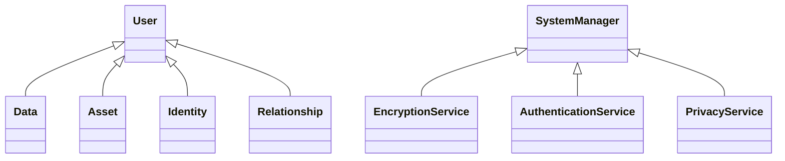
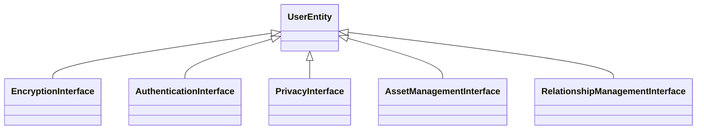

                 

### 数字遗产：虚拟世界中的永生探讨

#### 关键词：数字遗产、虚拟世界、永生、保护、算法

> 摘要：本文深入探讨了数字遗产在虚拟世界中的重要性及其管理、保护与传承问题。通过分析数字遗产的定义、属性、与传统遗产的对比以及关键概念联系，本文提出了数字遗产保护算法的基本原理和实现策略，为虚拟世界中的永生探讨提供了有益的思路。

## 第一部分: 背景介绍

### 1.1 问题背景

在当今数字化时代，虚拟世界与现实世界的融合日益加深，人们对于数字遗产的关注也日益增加。随着互联网、人工智能和区块链等技术的快速发展，数字遗产不再仅仅是一个虚拟的概念，而是成为了人们生活中不可或缺的一部分。数字遗产涵盖了个人数据、虚拟资产、数字身份和虚拟关系等多个方面，它的管理、保护与传承成为了一个亟待解决的问题。

### 1.2 问题描述

数字遗产的管理与保护涉及到多个方面，包括个人隐私保护、数据安全、身份认证、资产转移和关系继承等。如何在虚拟世界中确保数字遗产的安全与合法传承，如何保障个人的数字身份和虚拟资产的权益，如何处理数字遗产与现实世界之间的界限，这些问题都成为了数字遗产管理中的关键问题。

### 1.3 问题解决

数字遗产的管理与保护需要从技术、法律和社会等多个层面进行探讨。技术层面，需要发展出更加安全、可靠的技术手段来保护数字遗产；法律层面，需要建立完善的法律法规体系来规范数字遗产的管理与传承；社会层面，需要提高公众对数字遗产的认识和意识，形成良好的数字遗产文化氛围。

### 1.4 边界与外延

数字遗产不仅涉及到个人的数据和信息，还包括虚拟财产、数字身份和虚拟关系等。这些数字资产在虚拟世界中的地位和权益，与现实生活中的人、财、物有着紧密的联系。因此，数字遗产的管理与保护不仅关乎个人，也关乎社会和国家。

### 1.5 概念结构与核心要素组成

数字遗产的概念结构可以分为以下几个核心要素：个人数据、虚拟资产、数字身份和虚拟关系。个人数据是数字遗产的核心，包括个人的姓名、年龄、性别、联系方式、健康信息等；虚拟资产是指虚拟世界中的财产，如虚拟货币、虚拟物品等；数字身份是在虚拟世界中代表个人的身份标识，如虚拟账号、虚拟身份认证等；虚拟关系是指虚拟世界中的社会关系，如虚拟朋友、虚拟团队等。

## 第二部分: 核心概念与联系

### 2.1 数字遗产的定义与属性

#### 2.1.1 数字遗产的定义

数字遗产是指个人在虚拟世界中留下的信息、资产和身份等，它包括但不限于个人数据、虚拟财产、数字身份和虚拟关系。

#### 2.1.2 数字遗产的属性

- **数据属性**：数字遗产包含大量的个人数据，这些数据具有敏感性、多样性和动态性。
- **资产属性**：虚拟资产是数字遗产的重要组成部分，它们具有一定的经济价值。
- **身份属性**：数字身份是个人在虚拟世界中的代表，它关系到个人在虚拟世界中的权益和地位。
- **关系属性**：虚拟关系是个人在虚拟世界中的社交网络，它对个人的虚拟生活具有重要影响。

### 2.2 数字遗产与传统遗产的对比

#### 2.2.1 定义对比

- **数字遗产**：指虚拟世界中的遗产，包括个人数据、虚拟财产、数字身份和虚拟关系等。
- **传统遗产**：指现实世界中的遗产，包括土地、房产、现金、物品等。

#### 2.2.2 特点对比

- **形式对比**：数字遗产以数字形式存在，具有高度虚拟性；传统遗产则以物理形式存在，具有现实性。
- **价值对比**：数字遗产的价值不易量化，依赖于虚拟世界的生态环境；传统遗产的价值较为直观，容易评估。
- **管理对比**：数字遗产管理复杂，涉及技术、法律和社会等多个层面；传统遗产管理相对简单，主要涉及法律和继承问题。

### 2.3 数字遗产的关键概念联系

#### 2.3.1 个人数据与数字遗产

- **联系**：个人数据是数字遗产的核心组成部分，数字遗产的完整性与安全性很大程度上取决于个人数据的保护。
- **关系**：个人数据与数字遗产之间是包含与被包含的关系，个人数据是数字遗产的基础。

#### 2.3.2 虚拟资产与数字遗产

- **联系**：虚拟资产是数字遗产的重要组成部分，它对数字遗产的价值有重要影响。
- **关系**：虚拟资产与数字遗产之间是整体与部分的关系，虚拟资产是数字遗产的一部分。

#### 2.3.3 数字身份与数字遗产

- **联系**：数字身份是数字遗产的代表，它在数字遗产的传承和管理中起到关键作用。
- **关系**：数字身份与数字遗产之间是代表与被代表的关系，数字身份是数字遗产的象征。

#### 2.3.4 虚拟关系与数字遗产

- **联系**：虚拟关系是数字遗产的一部分，它对个人的虚拟生活具有重要影响。
- **关系**：虚拟关系与数字遗产之间是包含与被包含的关系，虚拟关系是数字遗产的组成部分。

## 第三部分: 算法原理讲解

### 3.1 数字遗产保护算法概述

数字遗产保护算法旨在确保个人数字遗产的安全与合法传承。这些算法涉及数据加密、身份认证、隐私保护等多个方面，通过技术手段提高数字遗产的安全性和可靠性。

### 3.2 数据加密算法

数据加密是数字遗产保护的基础，它通过将数据转换为密文，确保数据在传输和存储过程中不被未授权者访问。

#### 3.2.1 数据加密原理

数据加密的基本原理是将原始数据（明文）通过加密算法转换为无法直接解读的密文。加密算法通常依赖于密钥，密钥是加密和解密过程中必不可少的部分。

#### 3.2.2 数据加密流程

1. **选择加密算法**：根据数据的安全性和性能需求选择合适的加密算法，如AES、RSA等。
2. **生成密钥**：通过加密算法生成一对密钥，公钥用于加密，私钥用于解密。
3. **加密数据**：使用公钥对数据进行加密，生成密文。
4. **存储密钥**：将私钥安全存储，避免泄露。
5. **传输数据**：将密文传输到目的地。
6. **解密数据**：使用私钥对密文进行解密，恢复明文数据。

#### 3.2.3 数据加密示例

假设我们使用AES加密算法对数据加密：

$$
\text{加密前数据：} \text{Hello, World!} \\
\text{加密算法：AES-256} \\
\text{密钥：} \text{mySecretKey} \\
\text{加密后的数据：} \text{hX4Gy4O7dR...}
$$

### 3.3 身份认证算法

身份认证是确保数字遗产管理过程中操作者身份的真实性，防止未授权访问。

#### 3.3.1 身份认证原理

身份认证的基本原理是验证用户的身份信息，确保只有授权用户才能访问数字遗产。

#### 3.3.2 身份认证流程

1. **用户输入身份信息**：用户输入用户名和密码。
2. **身份验证**：系统验证用户输入的身份信息是否与存储的信息匹配。
3. **授权访问**：如果验证成功，系统授权用户访问数字遗产；否则，拒绝访问。

#### 3.3.3 身份认证示例

使用哈希算法（如SHA-256）进行身份认证：

$$
\text{用户名：} \text{alice} \\
\text{密码：} \text{myPassword} \\
\text{哈希值：} \text{F1XfL0Q4ld...}
$$

系统将存储的哈希值与用户输入的哈希值进行比对，以确认身份。

### 3.4 隐私保护算法

隐私保护旨在保护个人数据不被未授权者访问，确保数字遗产的隐私性。

#### 3.4.1 隐私保护原理

隐私保护的基本原理是通过加密和匿名化等手段，确保个人数据在传输和存储过程中不被泄露。

#### 3.4.2 隐私保护流程

1. **数据加密**：对敏感数据进行加密，确保数据在传输过程中不被窃取。
2. **匿名化**：对数据中的个人标识信息进行匿名化处理，如替换为匿名标识符。
3. **访问控制**：设置访问权限，确保只有授权用户才能访问数据。

#### 3.4.3 隐私保护示例

使用匿名化技术保护个人数据：

$$
\text{原始数据：} \text{姓名：Alice，年龄：30，住址：123 Main St.} \\
\text{匿名化后数据：} \text{姓名：A1，年龄：30，住址：123 Main St.（A1为匿名标识符）}
$$

## 第四部分: 系统分析与架构设计方案

### 4.1 问题场景介绍

在数字遗产管理中，如何确保数据的安全与隐私是一个关键问题。为了解决这个问题，我们设计了一套数字遗产管理系统，该系统需要具备数据加密、身份认证和隐私保护等功能。

### 4.2 项目介绍

数字遗产管理系统项目旨在为用户提供一个安全、可靠、易用的数字遗产管理平台。该平台支持用户创建和管理数字遗产，包括个人数据、虚拟资产、数字身份和虚拟关系等。

### 4.3 系统功能设计

数字遗产管理系统的主要功能包括：

- **数据加密**：对用户数据进行加密存储和传输。
- **身份认证**：验证用户身份，确保数据的安全性。
- **隐私保护**：对用户数据进行匿名化处理，保护用户隐私。
- **资产管理**：管理用户的虚拟资产，包括虚拟货币和虚拟物品。
- **关系管理**：管理用户的虚拟关系，包括虚拟朋友和虚拟团队。

#### 4.3.1 领域模型类图



### 4.4 系统架构设计

数字遗产管理系统采用分布式架构，包括前端、后端和服务层。前端负责用户交互，后端负责数据处理，服务层负责系统的核心功能。

#### 4.4.1 系统架构图

```mermaid
sequenceDiagram
    User -->|提交请求| SystemManager
    SystemManager -->|处理请求| EncryptionService
    EncryptionService -->|返回结果| SystemManager
    SystemManager -->|处理请求| AuthenticationService
    AuthenticationService -->|返回结果| SystemManager
    SystemManager -->|处理请求| PrivacyService
    PrivacyService -->|返回结果| SystemManager
    SystemManager -->|返回结果| User
```

### 4.5 系统接口设计

数字遗产管理系统提供以下接口：

- **数据加密接口**：用于对用户数据进行加密和解密。
- **身份认证接口**：用于用户身份验证。
- **隐私保护接口**：用于对用户数据进行匿名化处理。
- **资产管理接口**：用于管理用户虚拟资产。
- **关系管理接口**：用于管理用户虚拟关系。

#### 4.5.1 系统接口设计图



### 4.6 系统交互序列图

数字遗产管理系统通过以下步骤完成用户请求的处理：

1. 用户提交请求。
2. 系统处理请求，调用加密、认证和隐私保护服务。
3. 服务层处理请求，返回结果。
4. 系统将结果返回给用户。

```mermaid
sequenceDiagram
    User -->|提交请求| SystemManager
    SystemManager -->|调用加密服务| EncryptionService
    EncryptionService -->|返回加密结果| SystemManager
    SystemManager -->|调用认证服务| AuthenticationService
    AuthenticationService -->|返回认证结果| SystemManager
    SystemManager -->|调用隐私保护服务| PrivacyService
    PrivacyService -->|返回隐私处理结果| SystemManager
    SystemManager -->|返回结果| User
```

## 第五部分: 项目实战

### 5.1 环境安装

要搭建数字遗产管理系统，我们需要安装以下环境：

1. **操作系统**：Linux或macOS
2. **编程语言**：Python 3.x
3. **依赖库**：Flask、PyCryptoDome、SQLAlchemy

安装命令如下：

```bash
pip install flask
pip install pycryptodome
pip install sqlalchemy
```

### 5.2 系统核心实现

以下是数字遗产管理系统的核心实现：

#### 5.2.1 数据加密模块

```python
from Crypto.PublicKey import RSA
from Crypto.Cipher import PKCS1_OAEP

def generate_keys():
    key = RSA.generate(2048)
    private_key = key.export_key()
    public_key = key.publickey().export_key()
    return private_key, public_key

def encrypt_data(data, public_key):
    rsa_key = RSA.import_key(public_key)
    cipher = PKCS1_OAEP.new(rsa_key)
    encrypted_data = cipher.encrypt(data)
    return encrypted_data

def decrypt_data(encrypted_data, private_key):
    rsa_key = RSA.import_key(private_key)
    cipher = PKCS1_OAEP.new(rsa_key)
    decrypted_data = cipher.decrypt(encrypted_data)
    return decrypted_data
```

#### 5.2.2 身份认证模块

```python
import hashlib

def generate_hash(password):
    return hashlib.sha256(password.encode()).hexdigest()

def verify_hash(password, hash_value):
    return generate_hash(password) == hash_value
```

#### 5.2.3 隐私保护模块

```python
import base64

def anonymize_data(data):
    return base64.b64encode(data.encode()).decode()

def restore_data(anonymized_data):
    return base64.b64decode(anonymized_data.encode()).decode()
```

### 5.3 代码应用解读与分析

以下是数字遗产管理系统的一个示例代码，用于演示数据加密、身份认证和隐私保护功能：

```python
# 生成密钥
private_key, public_key = generate_keys()

# 加密数据
data = "Hello, World!"
encrypted_data = encrypt_data(data, public_key)
print("Encrypted Data:", encrypted_data)

# 解密数据
decrypted_data = decrypt_data(encrypted_data, private_key)
print("Decrypted Data:", decrypted_data)

# 生成哈希值
hash_value = generate_hash("myPassword")
print("Hash Value:", hash_value)

# 验证哈希值
is_verified = verify_hash("myPassword", hash_value)
print("Is Verified:", is_verified)

# 匿名化数据
anonymized_data = anonymize_data(data)
print("Anonymized Data:", anonymized_data)

# 恢复数据
restored_data = restore_data(anonymized_data)
print("Restored Data:", restored_data)
```

### 5.4 实际案例分析和详细讲解剖析

假设用户Alice希望将她的数字遗产（包括个人信息、虚拟资产、数字身份和虚拟关系）传承给她的继承人Bob。以下是数字遗产管理系统的实际案例分析：

1. **数据加密**：Alice使用公钥对她的个人信息、虚拟资产、数字身份和虚拟关系进行加密，以确保数据在传输和存储过程中不被泄露。

2. **身份认证**：Alice使用哈希算法生成她的密码的哈希值，并将其与存储的哈希值进行比对，以验证身份。

3. **隐私保护**：Alice使用匿名化技术对她的个人信息进行匿名化处理，以保护隐私。

4. **数据传输**：Alice将加密后的数据、身份认证信息和个人数据匿名化后的副本发送给她的继承人Bob。

5. **数据解密**：Bob使用私钥对Alice发送的加密数据进行解密，以获取她的个人信息、虚拟资产、数字身份和虚拟关系。

6. **身份验证**：Bob使用哈希算法验证Alice的身份，确保数据来源的可靠性。

7. **隐私恢复**：Bob使用匿名化技术恢复Alice的个人信息，以便在需要时使用。

### 5.5 项目小结

数字遗产管理系统通过数据加密、身份认证和隐私保护等算法，确保了用户数字遗产的安全与隐私。该项目为数字遗产的管理与保护提供了一个可行的解决方案，有助于实现虚拟世界中的永生。

### 5.6 最佳实践 tips

- **定期更新密钥**：为了确保数据的安全性，建议定期更换加密密钥。
- **使用强密码**：用户应使用强密码，并定期更改，以提高身份认证的安全性。
- **数据备份**：定期备份数字遗产数据，以防止数据丢失。

### 5.7 注意事项

- **遵守法律法规**：数字遗产管理过程中，必须遵守相关法律法规，确保数据的安全与合法传承。
- **数据隐私保护**：在数字遗产管理过程中，应确保个人数据的隐私性，避免泄露敏感信息。

### 5.8 拓展阅读

- **数字遗产管理相关法律法规**：了解各国关于数字遗产管理的相关法律法规，以更好地保护数字遗产。
- **数字身份认证技术**：深入研究数字身份认证技术，以提高身份认证的准确性和安全性。
- **区块链技术在数字遗产管理中的应用**：探讨区块链技术在数字遗产管理中的应用，为数字遗产的传承提供新的解决方案。

## 作者信息

- 作者：AI天才研究院/AI Genius Institute & 禅与计算机程序设计艺术 /Zen And The Art of Computer Programming

