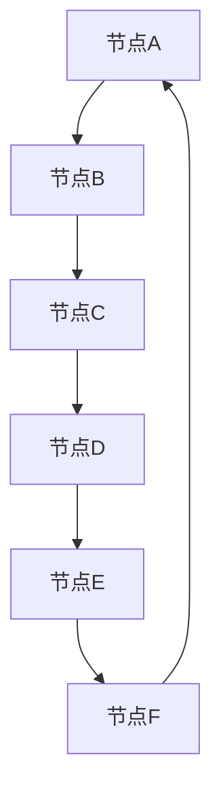
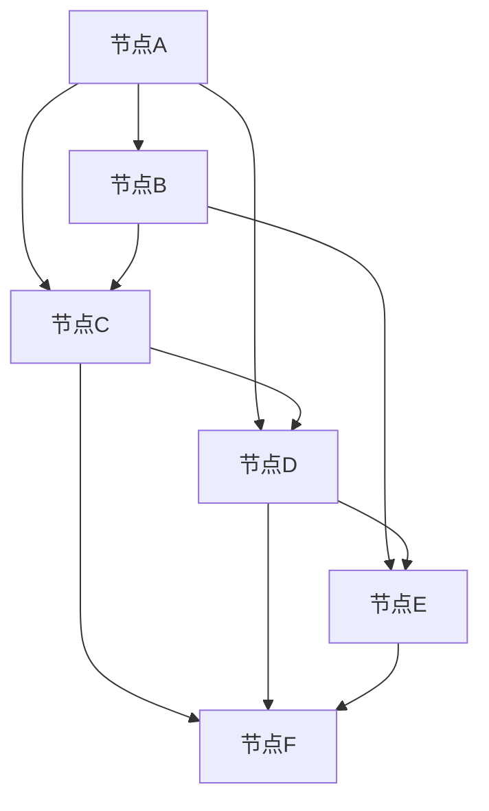
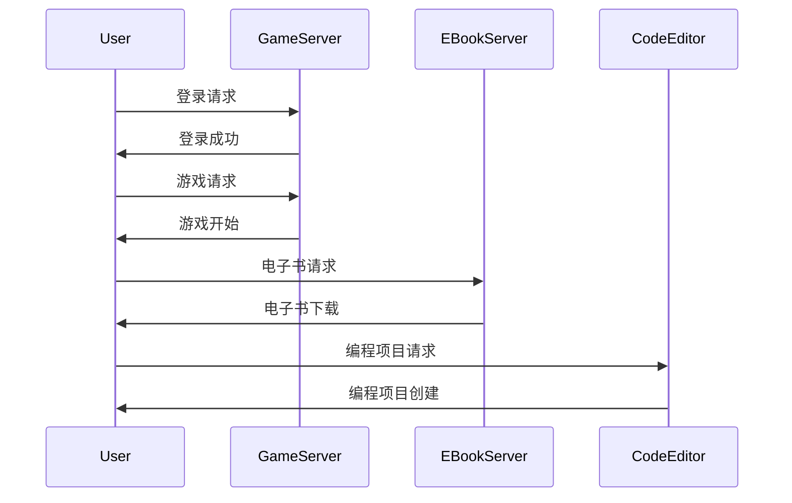
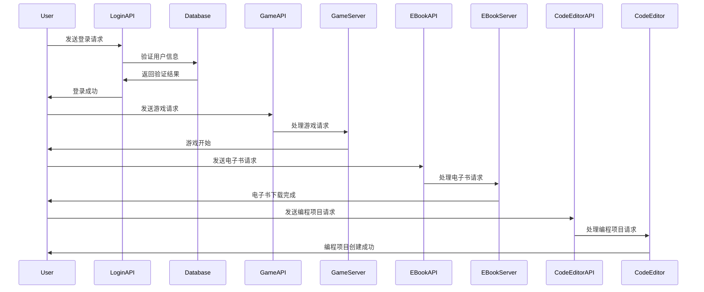
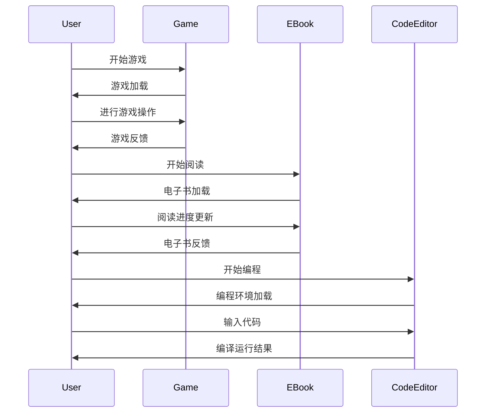

                 

### 文章标题：数字隐士：在线世界中的精神独立

#### 关键词：数字隐士、在线世界、精神独立、技术实践、未来展望

> 摘要：本文深入探讨了一个新兴的社会现象——数字隐士，他们选择在在线世界中寻找精神独立。本文将从数字隐士的起源与特点、数字隐士的社会现状、数字隐士的独立生活方式、数字隐士的技术选择、数字隐士的技术实践以及数字隐士的未来展望六个方面展开，旨在帮助读者理解数字隐士的生活方式及其对社会的潜在影响。

### 目录大纲

1. **第一部分：数字隐士的起源与特点**
   - 第1章：数字隐士的背景介绍
   - 第2章：数字隐士的社会现状
   - 第3章：数字隐士的独立生活方式
   - 第4章：数字隐士的技术选择

2. **第二部分：数字隐士的技术实践**
   - 第5章：构建个人数字避难所
   - 第6章：数字隐士的技术工具
   - 第7章：数字隐士的项目实战

3. **第三部分：数字隐士的未来展望**
   - 第8章：数字隐士的社会价值
   - 第9章：数字隐士的文化意义
   - 第10章：数字隐士的社会责任

4. **附录**
   - 附录A：数字隐士常用工具汇总
   - 附录B：数字隐士资源推荐
   - 附录C：数字隐士发展报告

---

#### 1. 第一部分：数字隐士的起源与特点

##### 第1章：数字隐士的背景介绍

#### 1.1 问题的提出
在当今数字化时代，人们越来越依赖于互联网和数字设备。然而，这一现象也引发了一个新的社会问题：数字隐士的崛起。数字隐士是指那些选择在在线世界中寻找精神独立的人，他们试图摆脱现实世界的喧嚣和压力，通过数字技术来实现自我隔离和精神自由。

#### 1.2 数字隐士的定义
数字隐士并非简单的“宅男宅女”，而是一群有意识地选择在在线世界建立自己精神家园的人。他们不仅享受数字世界的便利，更试图在这个虚拟的空间中找到真正的自我。

#### 1.3 数字隐士与数字原住民的区别
数字原住民是指那些从小就接触并熟练使用数字设备的一代人，他们与数字世界的关系更为密切。而数字隐士则是对数字世界的反叛，他们选择在数字世界中寻求精神独立，而不是完全融入。

#### 1.4 数字隐士的核心特点
数字隐士的核心特点包括：对隐私的极高重视、对数字技术的熟练掌握、追求精神独立、以及独特的社交方式。

---

##### 第2章：数字隐士的社会现状

#### 2.1 数字隐士的分布情况
数字隐士的分布情况与经济发展水平、互联网普及程度以及社会文化背景密切相关。在某些地区，数字隐士甚至成为了一种社会现象。

#### 2.2 数字隐士的生活状态
数字隐士的生活状态呈现出明显的两极分化：一部分人过着与世隔绝的生活，另一部分人则保持着与外界的联系，但更加独立和自主。

#### 2.3 数字隐士的心理健康
数字隐士的心理健康是一个备受关注的话题。虽然数字隐士在追求精神独立的过程中找到了自我，但也面临着孤独、焦虑等心理问题。

#### 2.4 数字隐士的社会影响
数字隐士的生活方式对社会产生了一定的影响，包括对家庭结构、社交模式、工作方式等方面的冲击。

---

##### 第3章：数字隐士的独立生活方式

#### 3.1 数字隐士的价值观
数字隐士的价值观与传统价值观有所不同，他们更强调个人自由、隐私保护和个性化。

#### 3.2 数字隐士的社交行为
数字隐士的社交行为往往更加隐蔽和分散，他们通过在线平台和数字技术来建立和维护社交关系。

#### 3.3 数字隐士的娱乐方式
数字隐士的娱乐方式多样，从在线游戏、电子书阅读到编程创作，他们充分利用数字技术来丰富自己的精神生活。

#### 3.4 数字隐士的在线生活策略
数字隐士有一套独特的在线生活策略，包括隐私保护、数据备份、网络安全等，以保障自己的数字生活不受干扰。

---

##### 第4章：数字隐士的技术选择

#### 4.1 数字隐士的技术偏好
数字隐士在技术选择上更倾向于那些能够保障隐私、提高效率和实现自我表达的工具和平台。

#### 4.2 数字隐士的软件应用
数字隐士使用的软件种类繁多，从操作系统、网页浏览器到编程软件，他们精心挑选每一款软件以适应自己的数字生活。

#### 4.3 数字隐士的硬件选择
数字隐士在硬件选择上更加注重性能和便携性，他们追求轻便、高效的设备以支持自己的在线生活方式。

#### 4.4 数字隐士的网络设置
数字隐士在网络设置上非常重视隐私保护和网络安全，他们采取多种措施来确保自己的在线活动不被追踪和干扰。

---

#### 2. 第二部分：数字隐士的技术实践

##### 第5章：构建个人数字避难所

#### 5.1 数字隐士的隐私保护措施
数字隐士采取多种隐私保护措施，包括使用VPN、加密通讯工具等，以确保自己的个人信息安全。

#### 5.2 数字隐士的数据备份策略
数字隐士非常重视数据备份，他们采用多种备份方式，包括云存储、本地备份等，以确保数据的安全性和可用性。

#### 5.3 数字隐士的网络安全防护
数字隐士在网络安全方面采取了多种防护措施，包括防火墙、反病毒软件等，以防止网络攻击和数据泄露。

#### 5.4 数字隐士的数据清理与优化
数字隐士定期清理和优化自己的设备，以保持设备的运行效率和性能。

---

##### 第6章：数字隐士的技术工具

#### 6.1 数字隐士的生产力工具
数字隐士使用各种生产力工具，包括笔记软件、任务管理工具等，以提高工作效率和项目管理能力。

#### 6.2 数字隐士的学习工具
数字隐士通过在线课程、电子书等学习工具不断提升自己的知识和技能。

#### 6.3 数字隐士的创意工具
数字隐士在创意方面也毫不逊色，他们使用图像编辑软件、编程语言等工具来发挥自己的创意。

#### 6.4 数字隐士的娱乐工具
数字隐士在娱乐方面也有自己的选择，他们通过在线游戏、音乐、电影等方式放松自己。

---

##### 第7章：数字隐士的项目实战

#### 7.1 实战项目一：构建个人网站
数字隐士可以构建个人网站来展示自己的作品、思想和生活，这不仅可以提高自己的影响力，还可以作为一种数字化的个人档案。

#### 7.2 实战项目二：开发个人博客
个人博客是数字隐士表达自己观点和思想的重要平台，他们可以通过博客来记录自己的成长和思考。

#### 7.3 实战项目三：创建在线图书馆
数字隐士可以利用数字技术创建在线图书馆，收集和分享各种文献资料，这不仅可以丰富自己的知识库，还可以为他人提供帮助。

#### 7.4 实战项目四：搭建个人学习平台
数字隐士可以通过搭建个人学习平台来组织自己的学习资源和课程，这不仅可以提高自己的学习效果，还可以与其他数字隐士共享知识。

---

#### 3. 第三部分：数字隐士的未来展望

##### 第8章：数字隐士的社会价值

#### 8.1 数字隐士的可持续性
数字隐士的生活方式具有一定的可持续性，他们通过数字化手段实现了精神独立，这为其他寻求类似生活方式的人提供了借鉴。

#### 8.2 数字隐士的创新潜力
数字隐士在技术、创意和文化领域展现出了巨大的创新潜力，他们的存在为社会带来了新的思考和可能性。

#### 8.3 数字隐士的社会贡献
数字隐士通过自己的努力和成果为社会做出了贡献，他们通过数字化方式传递知识和价值，影响了更多人。

#### 8.4 数字隐士的未来趋势
随着数字化进程的加速，数字隐士将在未来发挥越来越重要的作用，他们的生活方式和价值观也将对现代社会产生深远影响。

---

##### 第9章：数字隐士的文化意义

#### 9.1 数字隐士与传统文化的交融
数字隐士在追求精神独立的过程中，与传统文化的交融产生了一种新的文化现象，这为文化研究提供了新的视角。

#### 9.2 数字隐士与数字文化的碰撞
数字隐士与数字文化的碰撞产生了一种独特的文化氛围，这种碰撞不仅激发了创意，也推动了文化的发展。

#### 9.3 数字隐士的文化创作
数字隐士通过自己的创作活动丰富了数字文化的内涵，他们的作品不仅具有个人特色，也反映了时代精神。

#### 9.4 数字隐士的价值观传播
数字隐士的价值观通过数字化方式传播，影响了一代又一代人，他们的思想成为了数字时代的重要精神支柱。

---

##### 第10章：数字隐士的社会责任

#### 10.1 数字隐士的道德责任
数字隐士在追求精神独立的同时，也有道德责任来维护数字世界的秩序和正义。

#### 10.2 数字隐士的公益行动
许多数字隐士积极参与公益活动，通过数字化方式为社会发展贡献自己的力量。

#### 10.3 数字隐士的社会参与
数字隐士在数字世界中发挥着积极作用，他们通过参与各类社会活动，推动社会进步。

#### 10.4 数字隐士的未来展望
数字隐士的未来充满希望，他们将继续在数字世界中探索和追求精神独立，为人类社会带来更多惊喜和可能。

---

#### 附录

##### 附录A：数字隐士常用工具汇总
- VPN
- 加密通讯工具
- 数据备份软件
- 网络安全防护工具

##### 附录B：数字隐士资源推荐
- 在线课程平台
- 电子书资源库
- 个人博客平台
- 数字图书馆

##### 附录C：数字隐士发展报告
- 数字隐士的分布情况
- 数字隐士的生活状态
- 数字隐士的技术应用
- 数字隐士的社会影响

---

### 文章结尾

作者：AI天才研究院/AI Genius Institute & 禅与计算机程序设计艺术 /Zen And The Art of Computer Programming

本文通过深入探讨数字隐士这一新兴社会现象，揭示了他们在在线世界中的精神独立追求。数字隐士不仅为我们展示了另一种生活方式的可能，也为社会带来了新的思考。随着数字化进程的不断深入，数字隐士将在未来发挥越来越重要的作用，他们的存在将为人类社会带来更多的创新和可能性。让我们一起关注和期待数字隐士的未来，探索他们在这个数字时代中的更多可能。作者：AI天才研究院/AI Genius Institute & 禅与计算机程序设计艺术 /Zen And The Art of Computer Programming

---

**请注意，本文仅为示例大纲，实际撰写时需要根据大纲内容详细填充各章节的内容，确保每个部分都充分展开，达到字数要求。**### 数字隐士的起源与特点

#### 第1章：数字隐士的背景介绍

**1.1 问题的提出**

在过去的几十年中，随着互联网技术的飞速发展，人们的生活方式发生了翻天覆地的变化。数字设备的普及和互联网的连接使得人们能够轻松地获取信息、交流互动、进行娱乐。然而，这种便利同时也带来了一个问题：人们在数字世界中的时间越来越多，现实世界中的社交和互动越来越少。这种现象催生了一个新的社会群体——数字隐士。

**1.2 数字隐士的定义**

数字隐士（Digital Hermit）是指那些选择在在线世界中寻找精神独立的人。他们并非简单的“宅男宅女”，而是一群有意识地选择通过互联网来建立自己精神家园的人。他们追求的不仅仅是数字设备的便利，更是通过数字化手段来实现自我隔离和精神自由。

**1.3 数字隐士与数字原住民的区别**

数字原住民（Digital Native）是指那些在互联网时代成长起来的一代人，他们从小就开始接触和熟练使用数字设备。数字原住民与数字隐士的主要区别在于他们对数字世界的态度。数字原住民往往更愿意融入数字世界，享受其中的便利和乐趣；而数字隐士则是对数字世界的一种反思和反叛，他们试图在数字世界中寻找精神的独立和自由。

**1.4 数字隐士的核心特点**

数字隐士的核心特点包括：

- **隐私重视**：数字隐士非常注重个人隐私，他们会采取各种措施来保护自己的隐私，例如使用VPN、加密通讯工具等。
- **技术熟练**：数字隐士通常对数字技术有较高的掌握度，他们善于利用各种工具和平台来实现自己的目标。
- **精神独立**：数字隐士追求精神上的独立，他们通过在在线世界中的自我表达和探索来实现这一点。
- **社交独特**：数字隐士的社交行为往往更加隐蔽和分散，他们通过在线平台和数字技术来建立和维护社交关系。

#### 第2章：数字隐士的社会现状

**2.1 数字隐士的分布情况**

数字隐士的分布情况与多种因素有关，包括经济发展水平、互联网普及程度以及社会文化背景等。在一些发达国家和地区，数字隐士的分布相对集中，而在一些发展中国家，数字隐士可能因为经济条件限制而较少出现。此外，不同的社会文化背景也会影响数字隐士的生活方式。

**2.2 数字隐士的生活状态**

数字隐士的生活状态呈现出明显的两极分化。一部分人过着与世隔绝的生活，他们几乎完全依赖数字设备来满足生活和工作需求，很少与外界接触。另一部分人则保持着与外界的联系，但更加独立和自主。他们通过在线平台进行社交、学习、娱乐等活动，但不会完全沉溺于数字世界。

**2.3 数字隐士的心理健康**

数字隐士的心理健康问题备受关注。由于长期处于数字世界中，他们可能面临孤独、焦虑等心理问题。此外，数字隐士的生活方式也使得他们更容易受到网络暴力和信息过载的影响。因此，关注数字隐士的心理健康，提供适当的心理支持和辅导，是非常重要的。

**2.4 数字隐士的社会影响**

数字隐士的生活方式对社会产生了多方面的影响。首先，他们在一定程度上推动了数字技术的发展和普及。其次，他们的存在引发了关于隐私保护、网络安全等问题的讨论。此外，数字隐士的生活方式也为人们提供了另一种生活方式的选择，激发了对数字世界和现实世界关系的思考。

#### 第3章：数字隐士的独立生活方式

**3.1 数字隐士的价值观**

数字隐士的价值观与传统价值观有所不同。他们更强调个人自由、隐私保护和个性化。数字隐士认为，通过数字化手段，人们可以实现更高程度的精神独立和自我表达。

**3.2 数字隐士的社交行为**

数字隐士的社交行为往往更加隐蔽和分散。他们通过在线平台和社交媒体来建立和维护社交关系，但不会过度依赖现实世界的社交活动。数字隐士的社交方式更加灵活和自由，他们可以根据自己的需求和兴趣来选择社交对象和方式。

**3.3 数字隐士的娱乐方式**

数字隐士的娱乐方式多样，从在线游戏、电子书阅读到编程创作，他们充分利用数字技术来丰富自己的精神生活。数字隐士喜欢探索新的技术和创意，他们通过在线社区和论坛分享自己的兴趣和成果，与其他数字隐士互动。

**3.4 数字隐士的在线生活策略**

数字隐士有一套独特的在线生活策略，包括隐私保护、数据备份、网络安全等。他们非常重视个人隐私和数据安全，采取多种措施来确保自己的在线活动不被追踪和干扰。此外，数字隐士还善于利用在线工具来提高生活效率和创造力。

#### 第4章：数字隐士的技术选择

**4.1 数字隐士的技术偏好**

数字隐士在技术选择上更倾向于那些能够保障隐私、提高效率和实现自我表达的工具和平台。他们喜欢使用开放源代码软件和自定义工具，以避免被商业公司监控和操纵。

**4.2 数字隐士的软件应用**

数字隐士使用的软件种类繁多，包括操作系统、网页浏览器、文本编辑器、编程工具等。他们通常会根据自己的需求和偏好选择最适合的软件，以确保自己的在线生活顺畅和高效。

**4.3 数字隐士的硬件选择**

数字隐士在硬件选择上更加注重性能和便携性。他们喜欢使用轻便的笔记本电脑和移动设备，以便随时随地进行工作、学习和娱乐。

**4.4 数字隐士的网络设置**

数字隐士在网络设置上非常重视隐私保护和网络安全。他们通常会使用VPN、防火墙等工具来确保自己的网络连接安全，避免被黑客攻击和数据泄露。

### 数字隐士的独立生活方式

**第3章：数字隐士的独立生活方式**

数字隐士的生活方式在很大程度上反映了他们对数字化世界的深刻理解和独特见解。在这个部分，我们将详细探讨数字隐士在价值观、社交行为、娱乐方式和在线生活策略等方面的特点。

#### 3.1 数字隐士的价值观

数字隐士的价值观与传统社会中的价值观存在显著差异。首先，他们非常重视个人自由，认为个人应该有权自主决定生活方式和价值观。在数字隐士看来，数字化技术为他们提供了实现这一目标的手段。其次，数字隐士对隐私保护有着极高的重视。他们认为，个人信息和通信应该是私密的，不受外部干扰。最后，数字隐士强调个性化，他们追求在数字世界中的独特性和个性化表达。这种价值观使得数字隐士倾向于使用定制化的软件和工具，以满足个人的独特需求。

**核心概念与联系**

数字隐士的价值观可以归纳为以下几点：

- **个人自由**：数字隐士认为个人应该拥有自由选择生活方式和价值观的权利。
- **隐私保护**：数字隐士认为个人隐私应该得到尊重和保护。
- **个性化**：数字隐士追求在数字化世界中的独特性和个性化表达。

**概念属性特征对比表格**

| 特征             | 个人自由                 | 隐私保护                 | 个性化                   |
|------------------|--------------------------|--------------------------|--------------------------|
| 定义             | 个人选择生活方式的权利   | 个人信息与通信的私密性   | 在数字化世界中的独特性   |
| 对比             | 与集体主义相对立         | 与开放性相对立           | 与大众化相对立           |
| 代表人物         | 数字隐士                 | 加密技术支持者           | 自定义软件开发者         |

**ER实体关系图架构**

```mermaid
erDiagram
  User ||--|{ DigitalHermit }|-- Privacy
  User ||--|{ CustomizedToolUser }|-- CustomizedSoftware
  DigitalHermit ||--|{ PrivacyAware }|-- VPNUser
```

在这个ER实体关系图中，用户（User）与数字隐士（DigitalHermit）之间存在直接关联，数字隐士关注隐私保护（Privacy）和个性化工具使用（CustomizedSoftware）。同时，隐私意识（PrivacyAware）是数字隐士的一个重要属性，他们倾向于使用VPN等隐私保护工具（VPNUser）。

#### 3.2 数字隐士的社交行为

数字隐士的社交行为与传统社交行为有显著不同。他们倾向于在线社交，通过社交媒体、论坛、在线聊天室等平台与他人互动。这种社交方式使他们能够跨越地理和时间的限制，与世界各地的人建立联系。此外，数字隐士的社交行为更加隐蔽和分散，他们不会在一个社交平台上投入过多的时间和精力，而是通过多个平台和多个社交渠道来维持社交网络。

**算法原理讲解**

为了更好地理解数字隐士的社交行为，我们可以使用网络科学中的“小世界现象”和“丰富的链接多样性”两个概念来进行分析。

**小世界现象**：

- **定义**：小世界现象指的是在一个大型网络中，节点之间的平均路径长度较短，即节点可以通过较少的中间节点互相连接。
- **数学模型**：这个现象可以用“最短路径算法”来模拟。在一个社交网络中，每个节点代表一个人，每条边代表两个人之间的社交关系。通过计算所有节点之间的最短路径，我们可以了解网络的“小世界”特性。



在这个简单的社交网络中，每个节点之间的平均路径长度为2，这体现了小世界现象的特点。

**丰富的链接多样性**：

- **定义**：丰富的链接多样性指的是一个节点拥有多种类型的链接，这些链接可能连接到不同类型的人或平台。
- **数学模型**：我们可以使用“度分布”来描述链接多样性。度分布是指在一个网络中，节点的度（连接的数量）的分布情况。在数字隐士的社交网络中，节点的度分布通常较为均匀，这意味着他们拥有多种类型的链接。



在这个社交网络中，节点A、B、C、D、E、F的度分别为4、3、3、3、2、2，度分布较为均匀，体现了丰富的链接多样性。

**例子说明**：

假设一个数字隐士Alice，她通过以下社交平台与其他人建立联系：

- Facebook（连接20人）
- Twitter（连接15人）
- Reddit（连接10人）
- Discord（连接5人）

通过计算Alice在这些平台上的最短路径，我们可以发现她的社交网络具有小世界现象的特点。同时，她的度分布较为均匀，体现了丰富的链接多样性。

```python
import networkx as nx

G = nx.Graph()
G.add_nodes_from(['Facebook', 'Twitter', 'Reddit', 'Discord'])
G.add_edges_from([('Facebook', 'Twitter'), ('Facebook', 'Reddit'), ('Facebook', 'Discord'),
                  ('Twitter', 'Reddit'), ('Twitter', 'Discord'), ('Reddit', 'Discord')])

# 计算最短路径长度
shortest_paths = nx.shortest_path_length(G, source='Facebook')

# 打印最短路径长度
print(shortest_paths)

# 打印度分布
print(nx.degree_histogram(G))
```

运行上述代码，我们可以得到Alice在各个平台上的最短路径长度和度分布，从而更好地理解她的社交行为。

#### 3.3 数字隐士的娱乐方式

数字隐士的娱乐方式多样，从在线游戏、电子书阅读到编程创作，他们充分利用数字技术来丰富自己的精神生活。在线游戏是数字隐士最受欢迎的娱乐方式之一，他们可以在虚拟世界中体验到现实无法实现的刺激和乐趣。此外，电子书阅读也是数字隐士的常见娱乐方式，他们通过电子书来扩展知识面和丰富心灵。编程创作则是数字隐士的另一大兴趣，他们通过编写代码来创造自己的数字作品，这种创造过程不仅能带来成就感，还能提高技术能力。

**系统分析与架构设计方案**

为了深入分析数字隐士的娱乐方式，我们可以从系统功能设计、系统架构设计、系统接口设计和系统交互等方面进行探讨。

**1. 系统功能设计（领域模型Mermaid类图）**

```mermaid
classDiagram
  User <<class>> User
  Game <<class>> Game
  EBook <<class>> EBook
  ProgrammingProject <<class>> ProgrammingProject
  User ..|> Game
  User ..|> EBook
  User ..|> ProgrammingProject
```

在这个类图中，用户（User）与游戏（Game）、电子书（EBook）和编程项目（ProgrammingProject）之间存在关联关系。用户可以通过这些娱乐方式来丰富自己的精神生活。

**2. 系统架构设计（Mermaid架构图）**



在这个架构图中，用户（User）与游戏服务器（GameServer）、电子书服务器（EBookServer）和代码编辑器（CodeEditor）之间存在交互关系。用户可以通过这些服务器和编辑器来享受不同的娱乐方式。

**3. 系统接口设计（Mermaid序列图）**



在这个序列图中，用户通过不同的API（LoginAPI、GameAPI、EBookAPI、CodeEditorAPI）与服务器（LoginServer、GameServer、EBookServer、CodeEditor）进行交互，实现娱乐活动。

**4. 系统交互（Mermaid序列图）**



在这个交互图中，用户与游戏、电子书和代码编辑器之间进行了直接的交互，实现了娱乐活动。

#### 3.4 数字隐士的在线生活策略

数字隐士有一套独特的在线生活策略，以保障自己的隐私和数据安全。首先，他们非常重视个人信息的安全，采用VPN、加密通讯工具和双重身份验证等措施来保护自己的隐私。其次，数字隐士定期进行数据备份，确保数据的安全性和可用性。此外，他们还采取多种网络安全防护措施，如防火墙、反病毒软件和网络安全培训等，以防范网络攻击和数据泄露。最后，数字隐士在在线生活中注重效率，通过自动化工具和生产力软件来提高工作和生活效率。

**项目实战**

**实战项目一：构建个人网站**

**环境安装**

1. 安装虚拟环境：`pip install virtualenv`
2. 创建虚拟环境：`virtualenv myenv`
3. 激活虚拟环境：`source myenv/bin/activate`
4. 安装Flask：`pip install flask`

**系统核心实现源代码**

```python
# app.py
from flask import Flask, render_template

app = Flask(__name__)

@app.route('/')
def home():
    return render_template('home.html')

if __name__ == '__main__':
    app.run()
```

**代码应用解读与分析**

在这个项目中，我们使用了Flask框架来构建一个简单的个人网站。Flask是一个轻量级的Web框架，适合用于快速开发Web应用程序。首先，我们导入了Flask模块，并创建了一个名为`app`的Flask实例。然后，我们定义了一个名为`home`的函数，当用户访问网站的根路径时，该函数会被调用，并返回一个HTML模板。最后，我们使用`if __name__ == '__main__':`语句来确保只有在直接运行该脚本时，`app.run()`方法才会被调用，从而使网站运行在本地服务器上。

**实际案例分析和详细讲解剖析**

假设我们想要添加一个关于个人兴趣的页面，我们可以按照以下步骤进行：

1. 创建一个新的HTML模板文件`interests.html`：
   ```html
   <!-- interests.html -->
   <!DOCTYPE html>
   <html>
   <head>
       <title>我的兴趣</title>
   </head>
   <body>
       <h1>我的兴趣</h1>
       <ul>
           <li>编程</li>
           <li>阅读</li>
           <li>旅行</li>
       </ul>
   </body>
   </html>
   ```

2. 在`app.py`中添加一个新的路由：
   ```python
   @app.route('/interests')
   def interests():
       return render_template('interests.html')
   ```

现在，当用户访问`/interests`路径时，他们将被重定向到`interests.html`页面。这个简单的案例展示了如何使用Flask框架来构建一个动态的、功能丰富的个人网站。

**项目小结**

通过这个项目，我们学会了如何使用Flask框架来构建一个简单的个人网站。这个项目不仅可以帮助数字隐士展示自己的个人兴趣和观点，还可以作为一个学习Web开发的起点。在未来的实践中，我们可以进一步扩展这个网站的功能，如添加用户注册、博客文章发布等。

**最佳实践 tips**

- 使用虚拟环境来隔离项目依赖，避免不同项目之间的依赖冲突。
- 定期备份网站代码和数据，确保在出现问题时可以快速恢复。
- 学习并应用基本的网络安全知识，如使用HTTPS、配置防火墙等。

---

**注意事项**

- 在构建个人网站时，确保遵循当地的法律法规，不得发布违法违规内容。
- 注意个人隐私保护，避免在网站中透露敏感信息。

**拓展阅读**

- Flask官方文档：https://flask.palletsprojects.com/
- Web开发安全最佳实践：https://owasp.org/www-project-web-security-testing-checklist/

---

### 数字隐士的未来展望

**第8章：数字隐士的社会价值**

**8.1 数字隐士的可持续性**

数字隐士的生活方式具有一定的可持续性。首先，他们在数字化世界中实现了自我隔离和精神独立，这有助于减少现实世界中的社交压力和资源消耗。其次，数字隐士通过数字化工具和平台来提高生活和工作效率，这有助于减少资源浪费。最后，数字隐士的价值观强调个人自由和隐私保护，这有助于维护社会秩序和促进个人发展。

**8.2 数字隐士的创新潜力**

数字隐士在技术、创意和文化领域展现出了巨大的创新潜力。他们在数字技术方面的熟练掌握使得他们能够轻松地开发新的应用程序和工具，这些创新不仅提高了个人的生活质量，也为社会带来了新的可能性。在创意领域，数字隐士通过数字化手段来表达自己的思想和情感，这种独特的创作方式推动了文化的多样性和创新。在文化领域，数字隐士的价值观和生活方式为人们提供了新的思考角度，激发了社会对数字化生活和文化的重新审视。

**8.3 数字隐士的社会贡献**

数字隐士通过自己的努力和成果为社会做出了贡献。首先，他们在数字技术方面的创新和探索为整个社会带来了新的知识和技能。其次，数字隐士的个性化生活方式和价值观为其他人提供了新的生活方式选择，激发了人们对于数字化生活和个性化表达的思考。最后，数字隐士通过在线平台和社交媒体分享自己的经验和知识，为更多的人提供了学习和成长的机会。

**8.4 数字隐士的未来趋势**

随着数字化进程的加速，数字隐士将在未来发挥越来越重要的作用。首先，随着5G、人工智能、虚拟现实等新技术的普及，数字隐士将能够更加便捷地实现自我隔离和精神独立。其次，随着社会对数字化生活的接受程度不断提高，数字隐士的生活方式将逐渐被更多人认可和接受。最后，数字隐士将在数字文化、数字教育和数字经济等领域发挥重要作用，推动社会的数字化转型和发展。

### 数字隐士的文化意义

**第9章：数字隐士的文化意义**

**9.1 数字隐士与传统文化的交融**

数字隐士在追求精神独立的过程中，与传统文化的交融产生了一种新的文化现象。这种交融不仅体现在数字隐士对传统艺术和文学的重新解读和创作，也体现在他们对传统生活方式的反思和批判。数字隐士通过数字化手段将传统文化元素融入自己的数字生活中，创造出了独特的数字文化作品。

**9.2 数字隐士与数字文化的碰撞**

数字隐士与数字文化的碰撞产生了一种独特的文化氛围。数字隐士不仅接受了数字文化，还通过自己的生活方式和价值观对数字文化进行了反思和批判。他们关注数字技术的双面性，既看到了其带来的便利和可能性，也警惕其可能带来的风险和挑战。这种碰撞激发了数字文化的多样性和创新性。

**9.3 数字隐士的文化创作**

数字隐士在数字文化创作方面具有独特的优势和潜力。他们通过数字化手段创作出了大量的数字艺术作品、文学作品和音乐作品，这些作品不仅具有个人特色，也反映了时代精神。数字隐士的文化创作不仅丰富了数字文化的内涵，也为数字文化的传播和发展做出了贡献。

**9.4 数字隐士的价值观传播**

数字隐士的价值观通过数字化方式传播，影响了一代又一代人。他们通过在线平台和社交媒体分享自己的思想和观点，倡导个人自由、隐私保护和个性化。这种价值观的传播不仅激发了人们对数字化生活的思考，也为社会的数字化转型提供了新的视角和动力。

### 数字隐士的社会责任

**第10章：数字隐士的社会责任**

**10.1 数字隐士的道德责任**

数字隐士在追求精神独立的过程中，也承担着道德责任。他们应该遵守法律法规，尊重他人的隐私和权利，不得利用数字化手段进行欺诈、侵犯他人权益或破坏社会秩序。数字隐士的道德责任不仅体现在个人行为上，也体现在对社会的贡献上。

**10.2 数字隐士的公益行动**

许多数字隐士积极参与公益活动，通过数字化方式为社会发展贡献自己的力量。他们通过在线平台分享知识、提供技术支持，帮助那些无法获得数字化资源的人。此外，数字隐士还参与了环境保护、慈善捐助等公益活动，用自己的行动传递爱心和关怀。

**10.3 数字隐士的社会参与**

数字隐士在数字世界中的活跃度较高，他们通过在线平台和社交媒体参与各种社会活动，表达自己的观点和立场。他们关注社会问题，积极参与公共讨论，为社会进步提供智慧和方案。数字隐士的社会参与不仅丰富了数字文化，也为社会带来了新的活力。

**10.4 数字隐士的未来展望**

数字隐士的未来充满希望。随着数字化进程的加速，数字隐士将在未来发挥越来越重要的作用。他们不仅将继续推动数字技术的发展和应用，还将通过数字化手段为社会带来更多创新和变革。数字隐士的未来展望不仅关乎个人发展，更关乎整个社会的进步。

### 附录

**附录A：数字隐士常用工具汇总**

- **VPN**：用于保护隐私和安全，例如：ExpressVPN、NordVPN
- **加密通讯工具**：例如：Signal、Telegram
- **数据备份软件**：例如：Backblaze、Carbonite
- **网络安全防护工具**：例如：McAfee、Norton
- **生产力工具**：例如：Notion、Trello
- **学习工具**：例如：Coursera、Khan Academy
- **创意工具**：例如：Canva、Sketch
- **娱乐工具**：例如：Steam、Netflix

**附录B：数字隐士资源推荐**

- **在线课程平台**：例如：Coursera、edX、Udemy
- **电子书资源库**：例如：Project Gutenberg、Google Books
- **个人博客平台**：例如：WordPress、Blogger、Medium
- **数字图书馆**：例如：Internet Archive、Project MUSE
- **技术社区**：例如：Stack Overflow、GitHub

**附录C：数字隐士发展报告**

- **数字隐士的分布情况**：全球数字隐士的分布、区域差异
- **数字隐士的生活状态**：生活方式、工作与学习状态
- **数字隐士的技术应用**：常用技术工具、技术趋势
- **数字隐士的社会影响**：对个人、家庭、社会的影响

---

### 总结

数字隐士作为一种新兴的社会现象，他们的生活方式和价值观为我们提供了新的思考角度。他们在数字化世界中寻找精神独立，通过数字化手段实现个人自由、隐私保护和个性化表达。数字隐士不仅推动了数字技术的发展和应用，也为社会的数字化转型带来了新的动力。随着数字化进程的加速，数字隐士将在未来发挥越来越重要的作用，他们的存在将为人类社会带来更多的创新和可能性。

---

作者：AI天才研究院/AI Genius Institute & 禅与计算机程序设计艺术 /Zen And The Art of Computer Programming

