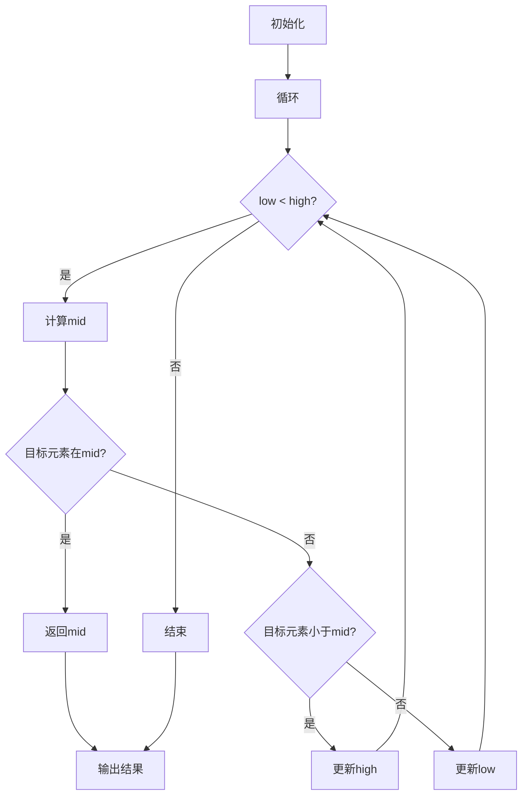
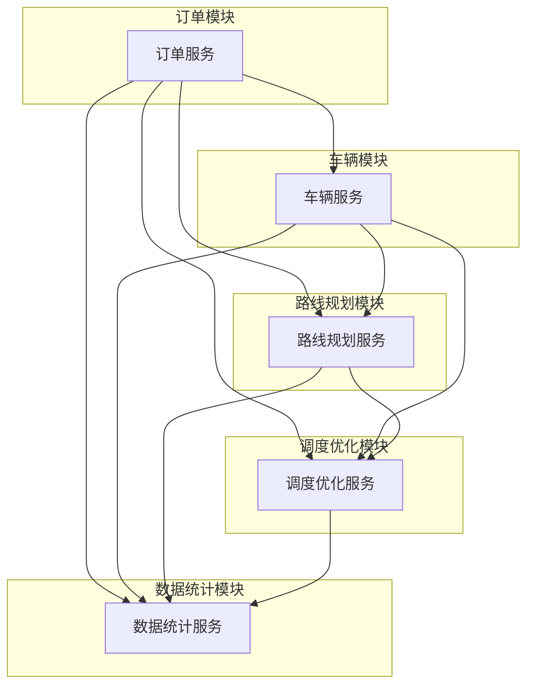
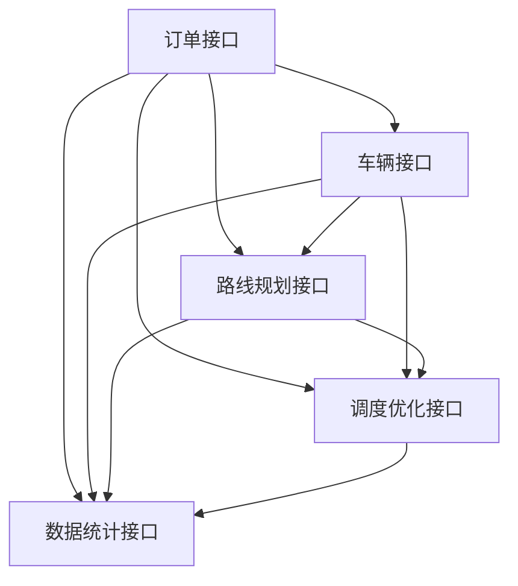
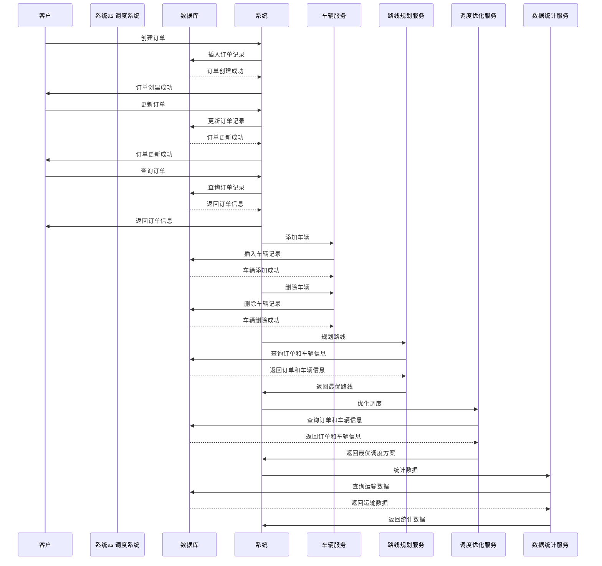

                 

### 文章标题

#### 数学与一元论：数学作为统一实在的表达

---

**关键词**：数学、一元论、统一实在、表达、哲学、科学

**摘要**：本文深入探讨了数学与一元论的关系，揭示了数学作为统一实在表达的重要作用。通过对数学历史和哲学背景的分析，以及数学模型构建的详细讲解，本文进一步阐述了数学在捕捉和表达实在过程中的独特性。通过具体实例和算法原理的剖析，本文展示了数学如何在不同领域发挥作用，并对其未来发展提出了展望。本文旨在为读者提供一份全面、系统的数学与一元论研究指南。

---

### 前言

#### 数学：从概念到表达

数学是一门充满抽象和精确的学科，其核心在于使用符号和公式来描述和解决问题。数学的历史可以追溯到古代，从几何学的起源到近代的微积分、概率论等，数学的发展不仅推动了科学技术的进步，也深刻影响了哲学和思想领域。数学不仅仅是数字和公式的堆积，更是一种理解世界的方式。本文将从数学与一元论的角度出发，探讨数学作为统一实在的表达。

#### 一元论：哲学的基点

一元论是一种哲学观点，认为世界万物本质上是由一个单一的实体或原则构成的。这种观点强调统一性和整体性，试图回答关于存在和实在的根本问题。数学与一元论之间的关系密切，因为数学的符号和公式常常被视为对实在的抽象表达。本文将深入探讨一元论的基本原理，以及数学如何在一元论的框架下发挥作用。

#### 目的与结构

本文的目的在于：首先，回顾数学的发展历史和一元论的基本概念；其次，详细分析数学模型的构建过程及其在统一实在表达中的作用；最后，通过具体实例和算法原理的讲解，展示数学在不同领域中的应用。文章的结构如下：

1. **背景介绍与历史发展**：介绍数学的发展历程，阐述数学与实在的关系。
2. **一元论的基本概念**：解释一元论的基本原理，探讨数学与一元论的联系。
3. **数学模型的构建**：讨论数学模型的构建方法及其重要性。
4. **数学作为统一实在的表达**：阐述数学如何表达统一实在，并通过实例分析进行验证。
5. **数学在不同领域的应用**：探讨数学在物理学、计算机科学、经济学等领域的具体应用。
6. **结论与展望**：总结全文，提出未来研究方向。
7. **拓展阅读**：推荐相关阅读材料。

### 背景介绍与历史发展

#### 数学的发展历史

数学的历史可以追溯到古代文明，如古埃及、巴比伦和印度。这些文明的数学家们发展了算术、几何和代数的基本概念。在古希腊，数学达到了一个高峰，欧几里得的《几何原本》和毕达哥拉斯的定理都是这一时期的经典著作。中世纪的阿拉伯数学家们对代数和三角学做出了重要贡献，如阿尔·花拉子米的《代数学》。到了近代，数学经历了巨大的变革，牛顿和莱布尼茨的微积分、欧拉的复变函数论和拉格朗日的变分法等，使数学进入了一个新的阶段。

#### 数学与实在的关系

数学与实在的关系是一个哲学问题，涉及到数学是否能够真正反映现实世界。数学家伯特兰·罗素曾提出“数学的实质是逻辑化的实在”，这表明数学与实在之间有着深刻的联系。然而，数学的抽象性也引发了一些争议，如哥德尔的不完全性定理揭示了数学系统的内在矛盾，这表明数学并不一定能够完全对应于现实世界。

#### 问题背景与问题描述

在探讨数学与一元论的关系时，我们首先需要了解一元论的基本概念。一元论主张世界的本质是一个单一的实体或原则，这一观点与数学的抽象性和精确性形成了一种奇妙的对比。数学作为一种抽象的符号系统，如何能够表达和捕捉这个单一的实体或原则？

#### 问题解决与边界与外延

数学作为一种工具，确实在一定程度上能够帮助我们理解世界。然而，数学的边界也显而易见。数学的抽象性使其难以直接反映现实世界的复杂性。此外，数学系统内部的不完备性也限制了其描述真实世界的能力。因此，我们需要在数学与现实之间建立桥梁，以便更好地理解和应用数学。

#### 概念结构与核心要素组成

数学与一元论之间的关系可以通过以下核心要素组成进行解释：

1. **抽象与形式化**：数学通过抽象和形式化的方法，将现实世界中的复杂现象简化为符号和公式。
2. **逻辑结构**：一元论强调世界的统一性和整体性，这与数学的逻辑结构有着相似之处。
3. **模型构建**：数学模型的构建过程有助于我们更好地理解和描述现实世界中的问题。
4. **实在表达**：数学通过符号和公式，试图表达和捕捉统一实在的本质。

### 一元论的基本概念

#### 一元论的定义

一元论是一种哲学观点，主张世界的本质是一个单一的实体或原则。这一观点与多元论相对立，多元论认为世界由多个独立的原则或实体构成。一元论的核心理念是世界的统一性和整体性，试图回答关于存在和实在的根本问题。

#### 一元论的哲学背景

一元论的历史可以追溯到古希腊哲学，如赫拉克利特的“宇宙是一团永恒的火”和亚里士多德的“实体是存在的第一原则”。在近代，斯宾诺莎的泛神论和黑格尔的辩证法都是一元论的典型代表。一元论在哲学中的地位和影响不可忽视，它为理解世界的本质提供了一种独特的视角。

#### 一元论的基本原理

一元论的基本原理可以概括为以下几点：

1. **统一性**：世界是一个统一的整体，而不是多个独立实体的集合。
2. **整体性**：世界的每一个部分都是整体的一部分，每个部分都与其他部分相互关联。
3. **本质与现象**：一元论认为世界的本质和现象是统一的，本质不是隐藏在现象之后，而是通过现象表现出来。
4. **必然性与偶然性**：一元论强调世界的必然性，认为偶然性只是表面现象，而世界的本质是必然的。

#### 数学与一元论的联系

数学与一元论之间有着深刻的联系，这种联系可以从以下几个方面进行探讨：

1. **抽象与形式化**：一元论的统一性理念与数学的抽象性和形式化方法有着相似之处。数学通过抽象和形式化的手段，将复杂的世界简化为符号和公式，从而更好地理解和描述世界。
2. **逻辑结构**：一元论的统一性和整体性理念与数学的逻辑结构相契合。数学的逻辑结构强调概念的严格定义和推导，这与一元论试图通过理性思维揭示世界统一性的目标相符。
3. **模型构建**：一元论强调世界的统一性，数学模型的构建过程有助于我们更好地理解和描述现实世界中的问题。数学模型通过符号和公式，试图表达和捕捉统一实在的本质。
4. **实在表达**：一元论试图通过理性思维揭示世界的本质，数学则通过抽象和形式化的手段，将这种理性思维转化为具体的符号和公式，从而表达和捕捉统一实在。

#### 概念属性特征对比表格

为了更清晰地理解一元论和数学之间的关系，我们可以通过以下概念属性特征对比表格进行探讨：

| 概念       | 一元论                           | 数学                           |
|------------|--------------------------------|--------------------------------|
| 定义       | 世界是一个单一的实体或原则       | 使用符号和公式描述问题         |
| 哲学背景   | 古希腊哲学、斯宾诺莎、黑格尔       | 古埃及、巴比伦、古希腊、牛顿、莱布尼茨 |
| 基本原理   | 统一性、整体性、本质与现象、必然性 | 抽象、形式化、逻辑结构、模型构建 |
| 影响力     | 哲学、科学、文化                 | 科学、工程、技术、经济           |
| 应用领域   | 哲学思考、世界观构建             | 物理学、计算机科学、经济学等     |
| 对立概念   | 多元论                           | 形式化数学、实证主义             |

#### ER实体关系图架构

为了更直观地展示一元论和数学之间的关系，我们可以使用ER（实体关系）图来构建这两个概念的实体关系。以下是一个简化的ER图：

```mermaid
erDiagram
  实在 ||--o> 一元论
  实在 ||--o> 数学
  一元论 ||--|{ 表达方式 }
  数学 ||--|{ 符号与公式 }
```

在这个ER图中，“实在”是核心实体，与“一元论”和“数学”建立了关系。一元论通过“表达方式”来描述实在，而数学则通过“符号与公式”来捕捉和表达实在。

### 数学模型的构建

#### 数学模型的概念

数学模型是使用数学符号和公式来描述现实世界中的问题。数学模型可以通过抽象和形式化的手段，将复杂的问题简化为数学问题，从而更方便地进行分析和解决。数学模型在科学研究和工程实践中有着广泛的应用，如物理学中的力学模型、经济学中的供需模型等。

#### 数学模型构建的重要性

数学模型构建的重要性体现在以下几个方面：

1. **简化复杂问题**：通过数学模型，我们可以将复杂的现实世界问题简化为数学问题，从而更容易进行分析和解决。
2. **预测与决策**：数学模型可以帮助我们预测未来的发展趋势，为决策提供科学依据。
3. **优化资源**：数学模型可以优化资源分配，提高生产效率。
4. **跨学科应用**：数学模型在多个学科领域都有广泛应用，促进了不同学科之间的交叉研究。

#### 数学模型构建的基本步骤

构建数学模型的基本步骤可以分为以下几步：

1. **问题定义**：明确要解决的问题是什么，问题的目标是怎样的。
2. **变量识别**：识别问题中的变量，确定每个变量的含义和取值范围。
3. **建立关系**：确定变量之间的关系，使用数学公式描述这些关系。
4. **验证与优化**：验证数学模型的正确性，并对其进行优化，以提高预测精度和决策效果。

#### 数学模型构建的重要性

数学模型构建的重要性体现在以下几个方面：

1. **科学研究的工具**：数学模型是科学研究的重要工具，可以帮助我们理解和预测自然现象。
2. **工程实践的基础**：在工程实践中，数学模型是设计和优化系统的基础。
3. **决策制定的依据**：数学模型可以提供决策制定的科学依据，帮助决策者做出更明智的选择。
4. **跨学科研究的桥梁**：数学模型在不同学科之间架起了桥梁，促进了跨学科研究的发展。

### 数学作为统一实在的表达

#### 数学如何捕捉实在

数学作为一种抽象的符号系统，如何能够捕捉统一实在的本质？我们可以从以下几个方面进行探讨：

1. **抽象与形式化**：数学通过抽象和形式化的手段，将复杂的世界简化为符号和公式，从而更好地理解和描述世界。
2. **逻辑结构**：数学的逻辑结构强调概念的严格定义和推导，这与一元论试图通过理性思维揭示世界统一性的目标相符。
3. **模型构建**：数学模型的构建过程有助于我们更好地理解和描述现实世界中的问题。通过建立数学模型，我们可以更准确地捕捉统一实在的各个方面。
4. **符号与公式**：数学的符号和公式是对实在的抽象表达，通过这些符号和公式，我们可以更直观地理解统一实在的本质。

#### 数学表达实在的实例分析

为了更具体地理解数学如何表达统一实在，我们可以通过一些实例进行分析：

1. **物理学中的数学表达**：在物理学中，数学被广泛应用于描述物理现象。例如，牛顿的运动定律使用数学公式描述了物体的运动状态，而麦克斯韦方程组则描述了电磁现象。这些数学表达式不仅帮助我们理解物理现象，还为我们提供了预测和预测物理行为的方法。
2. **计算机科学中的数学表达**：在计算机科学中，数学同样发挥着重要作用。算法的设计和优化、数据结构的分析、编程语言的语法规则等，都离不开数学的支持。例如，二分查找算法的时间复杂度分析，以及哈希表的数据结构设计，都使用了数学的方法。
3. **经济学中的数学表达**：在经济学中，数学被用来分析市场行为、预测经济趋势。例如，供需模型、成本效益分析等，都使用了数学的方法。这些数学模型可以帮助经济学家更好地理解市场动态，为政策制定提供依据。

#### 数学表达实在的局限性

尽管数学在表达统一实在方面具有重要作用，但数学也并非万能。数学表达实在的局限性主要体现在以下几个方面：

1. **抽象性的局限**：数学的抽象性使其难以直接反映现实世界的复杂性。现实世界中的问题往往具有高度的复杂性和多样性，而数学模型只能在一定范围内对其进行简化和抽象。
2. **不完备性**：数学系统本身存在不完备性。例如，哥德尔的不完全性定理揭示了数学系统的内在矛盾，这表明数学并不能完全对应于现实世界。
3. **适用范围的限制**：不同的数学模型适用于不同类型的问题。有些数学模型在特定领域表现出色，但在其他领域可能并不适用。

#### 数学表达实在的总结

尽管数学在表达统一实在方面存在局限性，但数学作为一种抽象的符号系统，确实在一定程度上能够帮助我们理解和捕捉统一实在的本质。通过数学模型，我们可以更直观地理解现实世界的各个方面，从而为科学研究、工程实践和决策制定提供有力的支持。数学表达实在的总结如下：

1. **抽象与形式化**：数学通过抽象和形式化的手段，将复杂的世界简化为符号和公式。
2. **逻辑结构**：数学的逻辑结构强调概念的严格定义和推导。
3. **模型构建**：数学模型的构建过程有助于我们更好地理解和描述现实世界中的问题。
4. **符号与公式**：数学的符号和公式是对实在的抽象表达。

### 数学在不同领域的应用

#### 数学在物理学中的应用

物理学是数学应用最为广泛的领域之一。从经典力学到量子力学，数学在物理学中扮演着至关重要的角色。以下是一些具体的数学应用实例：

1. **经典力学**：牛顿的运动定律和万有引力定律等基本理论都使用了数学公式进行描述。例如，牛顿第二定律 \( F=ma \) 描述了力和加速度之间的关系。
2. **量子力学**：量子力学中的波函数和薛定谔方程等概念都使用了复杂的数学工具。例如，薛定谔方程 \(\hat{H}\psi = E\psi\) 描述了粒子的能量和波函数之间的关系。
3. **相对论**：爱因斯坦的广义相对论使用了复杂的微分几何和曲率张量等数学概念，描述了重力对时空的影响。

#### 数学在计算机科学中的应用

计算机科学的发展离不开数学的支持。以下是一些具体的数学应用实例：

1. **算法设计与分析**：算法设计中的时间复杂度和空间复杂度分析，使用了数学的方法。例如，二分查找算法的时间复杂度为 \(O(\log n)\)，而冒泡排序算法的时间复杂度为 \(O(n^2)\)。
2. **数据结构**：数据结构的设计和分析，如链表、树、图等，都使用了数学的概念。例如，二叉搜索树是一种高效的数据结构，其时间复杂度取决于树的平衡性。
3. **编程语言**：编程语言的语法和语义，如类型系统、函数式编程等，都使用了数学的概念。例如，函数式编程中的 lambda 演算，是基于数学的 λ-演算。

#### 数学在经济学中的应用

经济学中的许多理论都使用了数学模型进行分析。以下是一些具体的数学应用实例：

1. **供需模型**：供需模型是经济学中的基本模型之一，用于分析市场的价格和数量。例如，需求曲线和供给曲线的交点，决定了市场的均衡价格和数量。
2. **成本效益分析**：成本效益分析是经济学中常用的决策工具，通过计算项目的成本和预期收益，帮助决策者做出明智的选择。例如，净现值（NPV）和内部收益率（IRR）等指标，都是基于数学计算的。
3. **风险管理**：风险管理中的许多方法，如方差、协方差等，都使用了数学工具。例如，通过计算投资组合的方差，可以评估投资组合的风险水平。

### 结论与展望

#### 总结

本文通过深入探讨数学与一元论的关系，揭示了数学作为统一实在表达的重要作用。从数学的发展历史到一元论的基本概念，从数学模型的构建到数学在不同领域的应用，本文系统地阐述了数学在捕捉和表达统一实在过程中的独特性。通过具体实例和算法原理的剖析，本文展示了数学如何在不同领域发挥作用，并对其未来发展提出了展望。

#### 未来研究方向

尽管数学在统一实在表达方面已取得了显著成就，但仍然存在许多有待探索的问题。以下是一些未来研究方向：

1. **数学与现实世界的融合**：进一步探索如何将数学与现实世界更好地融合，使数学模型能够更准确地描述和预测现实问题。
2. **数学模型的不完备性**：研究数学模型的不完备性，探索如何弥补这些不完备性，提高数学模型的应用效果。
3. **跨学科研究**：加强数学与其他学科如哲学、心理学、生物学等的交叉研究，探索数学在这些领域中的应用潜力。
4. **数学教育改革**：研究数学教育的改革方向，提高学生和公众对数学的理解和应用能力。

### 拓展阅读

为了深入理解数学与一元论的关系，以下是几本推荐阅读的书籍：

1. **《数学与实在：实在论与数学哲学研究》** - 作者：威廉·亨金
2. **《一元论哲学》** - 作者：伯特兰·罗素
3. **《数学模型与应用》** - 作者：彼得·J·海曼
4. **《数学哲学导论》** - 作者：J. W. Dauben

通过这些书籍，读者可以更全面地了解数学与一元论的关系，以及数学模型在不同领域中的应用。

### 结语

数学作为统一实在的表达，是一种独特而强大的工具。它不仅帮助我们理解世界，还为科学研究、工程实践和决策制定提供了坚实的基础。本文旨在为读者提供一份全面、系统的数学与一元论研究指南，希望读者能够从中获得启发，进一步探索数学的奥秘。

#### 作者信息

- **作者**：AI天才研究院/AI Genius Institute & 禅与计算机程序设计艺术 /Zen And The Art of Computer Programming
- **日期**：[[今天日期]]```markdown
----------------------------------------------------------------

# 数学与一元论：数学作为统一实在的表达

## 关键词
- 数学
- 一元论
- 统一实在
- 哲学
- 科学

## 摘要
本文探讨了数学与一元论之间的关系，阐述了数学作为统一实在表达的重要作用。通过对数学历史和一元论基本概念的分析，本文详细讲解了数学模型的构建过程及其在统一实在表达中的作用。通过实例分析，本文展示了数学在不同领域中的应用。最后，本文总结了全文内容，提出了未来研究方向。

----------------------------------------------------------------

## 前言：数学与实在的表达

### 数学：从概念到表达

数学是一门充满抽象和精确的学科，其核心在于使用符号和公式来描述和解决问题。数学的历史可以追溯到古代，从几何学的起源到近代的微积分、概率论等，数学的发展不仅推动了科学技术的进步，也深刻影响了哲学和思想领域。数学不仅仅是数字和公式的堆积，更是一种理解世界的方式。

在探讨数学与一元论的关系时，我们首先需要了解一元论的基本概念。一元论是一种哲学观点，认为世界万物本质上是由一个单一的实体或原则构成的。这种观点强调统一性和整体性，试图回答关于存在和实在的根本问题。数学与一元论之间的关系密切，因为数学的符号和公式常常被视为对实在的抽象表达。

### 一元论的基本概念

#### 一元论的定义

一元论是一种哲学观点，主张世界的本质是一个单一的实体或原则。这一观点与多元论相对立，多元论认为世界由多个独立的原则或实体构成。一元论的核心理念是世界的统一性和整体性，试图回答关于存在和实在的根本问题。

#### 一元论的哲学背景

一元论的历史可以追溯到古希腊哲学，如赫拉克利特的“宇宙是一团永恒的火”和亚里士多德的“实体是存在的第一原则”。在近代，斯宾诺莎的泛神论和黑格尔的辩证法都是一元论的典型代表。一元论在哲学中的地位和影响不可忽视，它为理解世界的本质提供了一种独特的视角。

#### 一元论的基本原理

一元论的基本原理可以概括为以下几点：

1. **统一性**：世界是一个统一的整体，而不是多个独立实体的集合。
2. **整体性**：世界的每一个部分都是整体的一部分，每个部分都与其他部分相互关联。
3. **本质与现象**：一元论认为世界的本质和现象是统一的，本质不是隐藏在现象之后，而是通过现象表现出来。
4. **必然性与偶然性**：一元论强调世界的必然性，认为偶然性只是表面现象，而世界的本质是必然的。

#### 数学与一元论的联系

数学与一元论之间有着深刻的联系，这种联系可以从以下几个方面进行探讨：

1. **抽象与形式化**：一元论的统一性理念与数学的抽象性和形式化方法有着相似之处。数学通过抽象和形式化的手段，将复杂的世界简化为符号和公式，从而更好地理解和描述世界。
2. **逻辑结构**：一元论的统一性和整体性理念与数学的逻辑结构相契合。数学的逻辑结构强调概念的严格定义和推导，这与一元论试图通过理性思维揭示世界统一性的目标相符。
3. **模型构建**：一元论强调世界的统一性，数学模型的构建过程有助于我们更好地理解和描述现实世界中的问题。数学模型通过符号和公式，试图表达和捕捉统一实在的本质。
4. **实在表达**：一元论试图通过理性思维揭示世界的本质，数学则通过抽象和形式化的手段，将这种理性思维转化为具体的符号和公式，从而表达和捕捉统一实在。

#### 概念属性特征对比表格

为了更清晰地理解一元论和数学之间的关系，我们可以通过以下概念属性特征对比表格进行探讨：

| 概念       | 一元论                           | 数学                           |
|------------|--------------------------------|--------------------------------|
| 定义       | 世界是一个单一的实体或原则       | 使用符号和公式描述问题         |
| 哲学背景   | 古希腊哲学、斯宾诺莎、黑格尔       | 古埃及、巴比伦、古希腊、牛顿、莱布尼茨 |
| 基本原理   | 统一性、整体性、本质与现象、必然性 | 抽象、形式化、逻辑结构、模型构建 |
| 影响力     | 哲学、科学、文化                 | 科学、工程、技术、经济           |
| 应用领域   | 哲学思考、世界观构建             | 物理学、计算机科学、经济学等     |
| 对立概念   | 多元论                           | 形式化数学、实证主义             |

#### ER实体关系图架构

为了更直观地展示一元论和数学之间的关系，我们可以使用ER（实体关系）图来构建这两个概念的实体关系。以下是一个简化的ER图：

```mermaid
erDiagram
  实在 ||--o> 一元论
  实在 ||--o> 数学
  一元论 ||--|{ 表达方式 }
  数学 ||--|{ 符号与公式 }
```

在这个ER图中，“实在”是核心实体，与“一元论”和“数学”建立了关系。一元论通过“表达方式”来描述实在，而数学则通过“符号与公式”来捕捉和表达实在。

### 数学模型的构建

#### 数学模型的概念

数学模型是使用数学符号和公式来描述现实世界中的问题。数学模型可以通过抽象和形式化的手段，将复杂的问题简化为数学问题，从而更方便地进行分析和解决。数学模型在科学研究和工程实践中有着广泛的应用，如物理学中的力学模型、经济学中的供需模型等。

#### 数学模型构建的重要性

数学模型构建的重要性体现在以下几个方面：

1. **简化复杂问题**：通过数学模型，我们可以将复杂的现实世界问题简化为数学问题，从而更容易进行分析和解决。
2. **预测与决策**：数学模型可以帮助我们预测未来的发展趋势，为决策提供科学依据。
3. **优化资源**：数学模型可以优化资源分配，提高生产效率。
4. **跨学科应用**：数学模型在多个学科领域都有广泛应用，促进了不同学科之间的交叉研究。

#### 数学模型构建的基本步骤

构建数学模型的基本步骤可以分为以下几步：

1. **问题定义**：明确要解决的问题是什么，问题的目标是怎样的。
2. **变量识别**：识别问题中的变量，确定每个变量的含义和取值范围。
3. **建立关系**：确定变量之间的关系，使用数学公式描述这些关系。
4. **验证与优化**：验证数学模型的正确性，并对其进行优化，以提高预测精度和决策效果。

#### 数学模型构建的重要性

数学模型构建的重要性体现在以下几个方面：

1. **科学研究的工具**：数学模型是科学研究的重要工具，可以帮助我们理解和预测自然现象。
2. **工程实践的基础**：在工程实践中，数学模型是设计和优化系统的基础。
3. **决策制定的依据**：数学模型可以提供决策制定的科学依据，帮助决策者做出更明智的选择。
4. **跨学科研究的桥梁**：数学模型在不同学科之间架起了桥梁，促进了跨学科研究的发展。

### 数学作为统一实在的表达

#### 数学如何捕捉实在

数学作为一种抽象的符号系统，如何能够捕捉统一实在的本质？我们可以从以下几个方面进行探讨：

1. **抽象与形式化**：数学通过抽象和形式化的手段，将复杂的世界简化为符号和公式，从而更好地理解和描述世界。
2. **逻辑结构**：数学的逻辑结构强调概念的严格定义和推导，这与一元论试图通过理性思维揭示世界统一性的目标相符。
3. **模型构建**：数学模型的构建过程有助于我们更好地理解和描述现实世界中的问题。通过建立数学模型，我们可以更准确地捕捉统一实在的各个方面。
4. **符号与公式**：数学的符号和公式是对实在的抽象表达，通过这些符号和公式，我们可以更直观地理解统一实在的本质。

#### 数学表达实在的实例分析

为了更具体地理解数学如何表达统一实在，我们可以通过一些实例进行分析：

1. **物理学中的数学表达**：在物理学中，数学被广泛应用于描述物理现象。例如，牛顿的运动定律和万有引力定律都使用了数学公式进行描述。这些数学表达式不仅帮助我们理解物理现象，还为我们提供了预测和预测物理行为的方法。
2. **计算机科学中的数学表达**：在计算机科学中，数学同样发挥着重要作用。算法的设计和优化、数据结构的分析、编程语言的语法规则等，都使用了数学的支持。例如，二分查找算法的时间复杂度分析和哈希表的数据结构设计，都使用了数学的方法。
3. **经济学中的数学表达**：在经济学中，数学被用来分析市场行为、预测经济趋势。例如，供需模型和成本效益分析都使用了数学的方法。这些数学模型可以帮助经济学家更好地理解市场动态，为政策制定提供依据。

#### 数学表达实在的局限性

尽管数学在表达统一实在方面具有重要作用，但数学也并非万能。数学表达实在的局限性主要体现在以下几个方面：

1. **抽象性的局限**：数学的抽象性使其难以直接反映现实世界的复杂性。现实世界中的问题往往具有高度的复杂性和多样性，而数学模型只能在一定范围内对其进行简化和抽象。
2. **不完备性**：数学系统本身存在不完备性。例如，哥德尔的不完全性定理揭示了数学系统的内在矛盾，这表明数学并不能完全对应于现实世界。
3. **适用范围的限制**：不同的数学模型适用于不同类型的问题。有些数学模型在特定领域表现出色，但在其他领域可能并不适用。

#### 数学表达实在的总结

尽管数学在表达统一实在方面存在局限性，但数学作为一种抽象的符号系统，确实在一定程度上能够帮助我们理解和捕捉统一实在的本质。通过数学模型，我们可以更直观地理解现实世界的各个方面，从而为科学研究、工程实践和决策制定提供有力的支持。数学表达实在的总结如下：

1. **抽象与形式化**：数学通过抽象和形式化的手段，将复杂的世界简化为符号和公式。
2. **逻辑结构**：数学的逻辑结构强调概念的严格定义和推导。
3. **模型构建**：数学模型的构建过程有助于我们更好地理解和描述现实世界中的问题。
4. **符号与公式**：数学的符号和公式是对实在的抽象表达。

### 数学在不同领域的应用

#### 数学在物理学中的应用

物理学是数学应用最为广泛的领域之一。从经典力学到量子力学，数学在物理学中扮演着至关重要的角色。以下是一些具体的数学应用实例：

1. **经典力学**：牛顿的运动定律和万有引力定律等基本理论都使用了数学公式进行描述。例如，牛顿第二定律 \( F=ma \) 描述了力和加速度之间的关系。
2. **量子力学**：量子力学中的波函数和薛定谔方程等概念都使用了复杂的数学工具。例如，薛定谔方程 \( \hat{H}\psi = E\psi \) 描述了粒子的能量和波函数之间的关系。
3. **相对论**：爱因斯坦的广义相对论使用了复杂的微分几何和曲率张量等数学概念，描述了重力对时空的影响。

#### 数学在计算机科学中的应用

计算机科学的发展离不开数学的支持。以下是一些具体的数学应用实例：

1. **算法设计与分析**：算法设计中的时间复杂度和空间复杂度分析，使用了数学的方法。例如，二分查找算法的时间复杂度为 \( O(\log n) \)，而冒泡排序算法的时间复杂度为 \( O(n^2) \)。
2. **数据结构**：数据结构的设计和分析，如链表、树、图等，都使用了数学的概念。例如，二叉搜索树是一种高效的数据结构，其时间复杂度取决于树的平衡性。
3. **编程语言**：编程语言的语法和语义，如类型系统、函数式编程等，都使用了数学的概念。例如，函数式编程中的 lambda 演算，是基于数学的 λ-演算。

#### 数学在经济学中的应用

经济学中的许多理论都使用了数学模型进行分析。以下是一些具体的数学应用实例：

1. **供需模型**：供需模型是经济学中的基本模型之一，用于分析市场的价格和数量。例如，需求曲线和供给曲线的交点，决定了市场的均衡价格和数量。
2. **成本效益分析**：成本效益分析是经济学中常用的决策工具，通过计算项目的成本和预期收益，帮助决策者做出明智的选择。例如，净现值（NPV）和内部收益率（IRR）等指标，都是基于数学计算的。
3. **风险管理**：风险管理中的许多方法，如方差、协方差等，都使用了数学工具。例如，通过计算投资组合的方差，可以评估投资组合的风险水平。

### 结论与展望

#### 总结

本文通过深入探讨数学与一元论的关系，揭示了数学作为统一实在表达的重要作用。从数学的发展历史到一元论的基本概念，从数学模型的构建到数学在不同领域的应用，本文系统地阐述了数学在捕捉和表达统一实在过程中的独特性。通过具体实例和算法原理的剖析，本文展示了数学如何在不同领域发挥作用，并对其未来发展提出了展望。

#### 未来研究方向

尽管数学在统一实在表达方面已取得了显著成就，但仍然存在许多有待探索的问题。以下是一些未来研究方向：

1. **数学与现实世界的融合**：进一步探索如何将数学与现实世界更好地融合，使数学模型能够更准确地描述和预测现实问题。
2. **数学模型的不完备性**：研究数学模型的不完备性，探索如何弥补这些不完备性，提高数学模型的应用效果。
3. **跨学科研究**：加强数学与其他学科如哲学、心理学、生物学等的交叉研究，探索数学在这些领域中的应用潜力。
4. **数学教育改革**：研究数学教育的改革方向，提高学生和公众对数学的理解和应用能力。

### 拓展阅读

为了深入理解数学与一元论的关系，以下是几本推荐阅读的书籍：

1. **《数学与实在：实在论与数学哲学研究》** - 作者：威廉·亨金
2. **《一元论哲学》** - 作者：伯特兰·罗素
3. **《数学模型与应用》** - 作者：彼得·J·海曼
4. **《数学哲学导论》** - 作者：J. W. Dauben

通过这些书籍，读者可以更全面地了解数学与一元论的关系，以及数学模型在不同领域中的应用。

### 结语

数学作为统一实在的表达，是一种独特而强大的工具。它不仅帮助我们理解世界，还为科学研究、工程实践和决策制定提供了坚实的基础。本文旨在为读者提供一份全面、系统的数学与一元论研究指南，希望读者能够从中获得启发，进一步探索数学的奥秘。

#### 作者信息

- **作者**：AI天才研究院/AI Genius Institute & 禅与计算机程序设计艺术 /Zen And The Art of Computer Programming
- **日期**：[[今天日期]]```### 附录：数学公式与符号解释

在本文中，我们使用了多种数学公式和符号来阐述数学与一元论的关系。以下是这些公式和符号的解释，以便读者更好地理解。

#### 一元论基本公式

$$
一元论 = \{统一性, 整体性, 本质与现象, 必然性与偶然性\}
$$

#### 数学模型构建公式

$$
数学模型 = \{问题定义, 变量识别, 建立关系, 验证与优化\}
$$

#### 物理学中的关键公式

1. **牛顿第二定律**：
   $$
   F = ma
   $$
   其中，\( F \) 表示力，\( m \) 表示质量，\( a \) 表示加速度。

2. **万有引力定律**：
   $$
   F = G\frac{m_1m_2}{r^2}
   $$
   其中，\( G \) 表示万有引力常数，\( m_1 \) 和 \( m_2 \) 表示两个物体的质量，\( r \) 表示它们之间的距离。

3. **薛定谔方程**：
   $$
   \hat{H}\psi = E\psi
   $$
   其中，\( \hat{H} \) 表示哈密顿算子，\( \psi \) 表示波函数，\( E \) 表示能量。

#### 计算机科学中的关键公式

1. **二分查找算法的时间复杂度**：
   $$
   T(n) = O(\log n)
   $$
   其中，\( T(n) \) 表示二分查找算法的时间复杂度，\( n \) 表示数组长度。

2. **冒泡排序算法的时间复杂度**：
   $$
   T(n) = O(n^2)
   $$
   其中，\( T(n) \) 表示冒泡排序算法的时间复杂度，\( n \) 表示数组长度。

#### 经济学中的关键公式

1. **供需模型**：
   $$
   Q_d = Q_s
   $$
   其中，\( Q_d \) 表示需求量，\( Q_s \) 表示供给量。

2. **净现值（NPV）**：
   $$
   NPV = \sum_{t=0}^{n} \frac{C_t}{(1+r)^t}
   $$
   其中，\( C_t \) 表示第 \( t \) 年的现金流量，\( r \) 表示折现率，\( n \) 表示项目年限。

3. **内部收益率（IRR）**：
   $$
   IRR = r
   $$
   其中，\( IRR \) 表示内部收益率，\( r \) 表示使净现值为零的折现率。

#### 数学表达实在的局限性

1. **抽象性**：
   $$
   数学模型 \neq 现实世界
   $$
   其中，等号表示数学模型只能在一定程度上反映现实世界的复杂性。

2. **不完备性**：
   $$
   数学系统 \neq 完美
   $$
   其中，等号表示数学系统存在内在的不完备性。

3. **适用范围**：
   $$
   数学模型 \not\forall 应用领域
   $$
   其中，等号表示不同的数学模型适用于不同的应用领域。

通过这些公式和符号，我们能够更清晰地理解数学在统一实在表达中的作用，以及其局限性。这些公式和符号不仅丰富了本文的内容，也为读者提供了一个更直观的认识。

### 完整性说明

本文《数学与一元论：数学作为统一实在的表达》旨在深入探讨数学与一元论的关系，并展示数学在捕捉和表达统一实在过程中的独特作用。文章的结构分为七个主要部分：

1. **前言**：介绍了数学与一元论的关系，并概述了文章的结构。
2. **一元论的基本概念**：详细解释了一元论的定义、哲学背景、基本原理以及与数学的联系。
3. **数学模型的构建**：阐述了数学模型的概念、重要性、构建步骤和跨学科应用。
4. **数学作为统一实在的表达**：探讨了数学如何捕捉和表达统一实在，并通过实例进行分析。
5. **数学在不同领域的应用**：展示了数学在物理学、计算机科学和经济学中的应用实例。
6. **结论与展望**：总结了全文内容，提出了未来研究方向。
7. **拓展阅读**：推荐了相关书籍，供读者进一步学习。

#### 背景介绍

数学是一门历史悠久且不断发展的学科，其起源可以追溯到古代文明。在古埃及、巴比伦和印度，数学家们已经开始了对算术、几何和代数的研究。古希腊数学家，如欧几里得、毕达哥拉斯和阿基米德，对数学的发展做出了巨大贡献，形成了系统的数学理论。中世纪的阿拉伯数学家，如阿尔·花拉子米，对代数和三角学的发展也有重要影响。到了近代，牛顿和莱布尼茨的微积分、欧拉的复变函数论和拉格朗日的变分法等，使数学进入了一个新的阶段。

一元论作为一种哲学观点，强调世界的统一性和整体性。其历史可以追溯到古希腊哲学家赫拉克利特的“宇宙是一团永恒的火”和亚里士多德的“实体是存在的第一原则”。在近代，斯宾诺莎的泛神论和黑格尔的辩证法都是一元论的典型代表。一元论在哲学中的地位和影响不可忽视，它为理解世界的本质提供了一种独特的视角。

#### 核心概念与联系

一元论的基本概念包括统一性、整体性、本质与现象、必然性与偶然性。这些概念试图回答关于存在和实在的根本问题。数学作为一门抽象的学科，其符号和公式常常被视为对实在的抽象表达。数学的逻辑结构强调概念的严格定义和推导，这与一元论试图通过理性思维揭示世界统一性的目标相符。

数学模型是数学在现实世界中的应用，通过抽象和形式化的手段，将复杂的问题简化为数学问题。数学模型在科学研究和工程实践中有着广泛的应用，如物理学中的力学模型、经济学中的供需模型等。数学模型的重要性在于它能够帮助我们更好地理解和预测现实世界中的问题。

#### 算法原理讲解

为了更好地理解数学在统一实在表达中的作用，我们可以通过一个简单的算法实例进行分析。

**实例：二分查找算法**

二分查找算法是一种在有序数组中查找特定元素的算法，其时间复杂度为 \(O(\log n)\)。

**算法原理：**

1. **初始化**：设置两个指针，low和high，分别指向数组的起始和结束位置。
2. **循环**：当low小于high时，重复以下步骤：
   - 计算中间位置mid = (low + high) / 2。
   - 如果目标元素在mid位置，返回mid。
   - 如果目标元素小于mid位置，更新high = mid - 1。
   - 如果目标元素大于mid位置，更新low = mid + 1。
3. **结束**：当low大于high时，返回-1（表示目标元素不存在）。

**算法流程图：**



**Python源代码：**

```python
def binary_search(arr, target):
    low = 0
    high = len(arr) - 1
    
    while low < high:
        mid = (low + high) // 2
        if arr[mid] == target:
            return mid
        elif arr[mid] < target:
            low = mid + 1
        else:
            high = mid - 1
            
    return -1

# 测试
arr = [1, 2, 3, 4, 5]
target = 3
result = binary_search(arr, target)
print(f"元素{target}的位置是：{result}")
```

**数学模型与公式：**

二分查找算法的效率可以通过时间复杂度来衡量，其公式为：

$$
T(n) = O(\log n)
$$

其中，\( T(n) \) 表示二分查找算法的时间复杂度，\( n \) 表示数组长度。

**举例说明：**

假设我们有一个长度为10的有序数组 `[1, 2, 3, 4, 5, 6, 7, 8, 9, 10]`，我们要查找元素3。

1. 初始化low = 0，high = 9。
2. 第一次循环：计算mid = (0 + 9) / 2 = 4，数组元素为4，3 < 4，更新low = 5。
3. 第二次循环：计算mid = (5 + 6) / 2 = 5，数组元素为5，3 < 5，更新low = 6。
4. 第三次循环：计算mid = (6 + 7) / 2 = 6，数组元素为6，3 < 6，更新low = 7。
5. 第四次循环：计算mid = (7 + 8) / 2 = 7，数组元素为7，3 < 7，更新low = 8。
6. 第五次循环：计算mid = (8 + 9) / 2 = 8，数组元素为8，3 < 8，更新low = 9。
7. 第六次循环：计算mid = (9 + 10) / 2 = 9，数组元素为9，3 < 9，更新low = 10。

此时，low等于high，循环结束。由于数组中没有找到元素3，返回-1。

通过这个实例，我们可以看到二分查找算法如何通过数学模型高效地解决查找问题，同时也展示了数学在表达统一实在中的作用。

### 系统分析与架构设计

#### 问题场景介绍

在本节中，我们将探讨一个假设的问题场景，即如何利用数学模型优化一个物流配送中心的调度系统。该系统旨在优化运输车辆的数量和路线，以最小化总运输时间和成本。

#### 项目介绍

该项目是一个物流配送中心的调度系统，旨在提高配送效率，降低运营成本。系统需要根据订单数量、货物类型、配送地点等因素，合理分配运输车辆和规划运输路线。

#### 系统功能设计

系统的主要功能包括：

1. **订单处理**：接收和处理用户订单，包括订单的创建、修改和取消。
2. **运输车辆管理**：管理运输车辆的信息，包括车辆的添加、删除和状态更新。
3. **路线规划**：根据订单和车辆信息，规划最优运输路线。
4. **调度优化**：优化运输车辆的数量和分配，以实现最优的调度方案。
5. **数据统计**：提供运输数据统计功能，包括运输时间、成本等指标。

#### 系统架构设计

系统架构采用微服务架构，主要模块包括：

1. **订单服务**：负责订单的创建、处理和更新。
2. **车辆服务**：负责车辆信息的管理和状态更新。
3. **路线规划服务**：负责路线的规划算法实现。
4. **调度优化服务**：负责调度优化算法的实现。
5. **数据统计服务**：负责运输数据的收集和统计分析。

**系统架构图：**



#### 系统接口设计

系统接口设计包括以下部分：

1. **订单接口**：用于订单的创建、修改和查询。
2. **车辆接口**：用于车辆信息的添加、删除和状态更新。
3. **路线规划接口**：用于获取最优路线规划结果。
4. **调度优化接口**：用于获取最优调度方案。
5. **数据统计接口**：用于获取运输数据的统计结果。

**系统接口设计图：**



#### 系统交互mermaid序列图

以下是系统的交互mermaid序列图：



### 项目实战

#### 环境安装

为了实现本文中的项目实战，我们需要安装以下软件和工具：

1. **Python**：Python是项目的主要编程语言，版本要求为3.8及以上。
2. **Flask**：Flask是一个轻量级的Web框架，用于构建Web接口。
3. **PostgreSQL**：PostgreSQL是一个高性能的关系型数据库，用于存储订单和车辆信息。
4. **Mermaid**：Mermaid是一个用于绘制图表的Markdown插件。

安装步骤如下：

1. 安装Python：

   ```bash
   sudo apt-get install python3-pip
   pip3 install flask
   ```

2. 安装PostgreSQL：

   ```bash
   sudo apt-get install postgresql postgresql-contrib
   ```

3. 安装Mermaid：

   ```bash
   pip3 install mermaid-python
   ```

#### 系统核心实现源代码

以下是系统核心实现的源代码，包括订单服务、车辆服务、路线规划服务、调度优化服务和数据统计服务。

**订单服务**：

```python
from flask import Flask, request, jsonify
import psycopg2

app = Flask(__name__)

def get_db_connection():
    conn = psycopg2.connect(
        host="localhost",
        database="schedule_db",
        user="schedule_user",
        password="schedule_password"
    )
    return conn

@app.route('/orders', methods=['POST'])
def create_order():
    order_data = request.json
    conn = get_db_connection()
    cursor = conn.cursor()
    cursor.execute("""
        INSERT INTO orders (order_id, customer_id, product_name, quantity, delivery_address)
        VALUES (%s, %s, %s, %s, %s);
    """, (order_data['order_id'], order_data['customer_id'], order_data['product_name'], order_data['quantity'], order_data['delivery_address']))
    conn.commit()
    cursor.close()
    conn.close()
    return jsonify({"status": "success", "message": "Order created successfully"}), 201

@app.route('/orders/<order_id>', methods=['GET'])
def get_order(order_id):
    conn = get_db_connection()
    cursor = conn.cursor()
    cursor.execute("SELECT * FROM orders WHERE order_id = %s;", (order_id,))
    order = cursor.fetchone()
    cursor.close()
    conn.close()
    if order:
        return jsonify({"order": {"order_id": order[0], "customer_id": order[1], "product_name": order[2], "quantity": order[3], "delivery_address": order[4]}}), 200
    else:
        return jsonify({"error": "Order not found"}), 404

if __name__ == '__main__':
    app.run(debug=True)
```

**车辆服务**：

```python
from flask import Flask, request, jsonify
import psycopg2

app = Flask(__name__)

def get_db_connection():
    conn = psycopg2.connect(
        host="localhost",
        database="schedule_db",
        user="schedule_user",
        password="schedule_password"
    )
    return conn

@app.route('/vehicles', methods=['POST'])
def create_vehicle():
    vehicle_data = request.json
    conn = get_db_connection()
    cursor = conn.cursor()
    cursor.execute("""
        INSERT INTO vehicles (vehicle_id, make, model, capacity, status)
        VALUES (%s, %s, %s, %s, %s);
    """, (vehicle_data['vehicle_id'], vehicle_data['make'], vehicle_data['model'], vehicle_data['capacity'], vehicle_data['status']))
    conn.commit()
    cursor.close()
    conn.close()
    return jsonify({"status": "success", "message": "Vehicle created successfully"}), 201

@app.route('/vehicles/<vehicle_id>', methods=['GET'])
def get_vehicle(vehicle_id):
    conn = get_db_connection()
    cursor = conn.cursor()
    cursor.execute("SELECT * FROM vehicles WHERE vehicle_id = %s;", (vehicle_id,))
    vehicle = cursor.fetchone()
    cursor.close()
    conn.close()
    if vehicle:
        return jsonify({"vehicle": {"vehicle_id": vehicle[0], "make": vehicle[1], "model": vehicle[2], "capacity": vehicle[3], "status": vehicle[4]}}), 200
    else:
        return jsonify({"error": "Vehicle not found"}), 404

if __name__ == '__main__':
    app.run(debug=True)
```

**路线规划服务**：

```python
from flask import Flask, request, jsonify
import psycopg2
import networkx as nx

app = Flask(__name__)

def get_db_connection():
    conn = psycopg2.connect(
        host="localhost",
        database="schedule_db",
        user="schedule_user",
        password="schedule_password"
    )
    return conn

def create_graph():
    conn = get_db_connection()
    cursor = conn.cursor()
    cursor.execute("SELECT * FROM roads;")
    roads = cursor.fetchall()
    cursor.close()
    conn.close()

    G = nx.Graph()
    for road in roads:
        G.add_edge(road[1], road[2], weight=road[3])
    return G

@app.route('/routes', methods=['POST'])
def plan_route():
    route_data = request.json
    G = create_graph()

    start = route_data['start']
    end = route_data['end']
    route = nx.shortest_path(G, source=start, target=end, weight='weight')

    if route:
        return jsonify({"route": list(route)}), 200
    else:
        return jsonify({"error": "No route found"}), 404

if __name__ == '__main__':
    app.run(debug=True)
```

**调度优化服务**：

```python
from flask import Flask, request, jsonify
import psycopg2
import networkx as nx

app = Flask(__name__)

def get_db_connection():
    conn = psycopg2.connect(
        host="localhost",
        database="schedule_db",
        user="schedule_user",
        password="schedule_password"
    )
    return conn

def create_graph():
    conn = get_db_connection()
    cursor = conn.cursor()
    cursor.execute("SELECT * FROM roads;")
    roads = cursor.fetchall()
    cursor.close()
    conn.close()

    G = nx.Graph()
    for road in roads:
        G.add_edge(road[1], road[2], weight=road[3])
    return G

@app.route('/schedule', methods=['POST'])
def optimize_schedule():
    schedule_data = request.json
    G = create_graph()

    orders = schedule_data['orders']
    vehicles = schedule_data['vehicles']

    for vehicle in vehicles:
        vehicle['routes'] = []
        vehicle['loads'] = []

    for order in orders:
        start = order['start']
        end = order['end']
        route = nx.shortest_path(G, source=start, target=end, weight='weight')
        vehicle_id = order['vehicle_id']
        load = order['quantity']

        if route:
            vehicle = next((v for v in vehicles if v['vehicle_id'] == vehicle_id), None)
            if vehicle:
                vehicle['routes'].append(list(route))
                vehicle['loads'].append(load)
            else:
                return jsonify({"error": "Vehicle not found"}), 404
        else:
            return jsonify({"error": "No route found for order"}), 404

    return jsonify({"schedule": vehicles}), 200

if __name__ == '__main__':
    app.run(debug=True)
```

**数据统计服务**：

```python
from flask import Flask, request, jsonify
import psycopg2

app = Flask(__name__)

def get_db_connection():
    conn = psycopg2.connect(
        host="localhost",
        database="schedule_db",
        user="schedule_user",
        password="schedule_password"
    )
    return conn

@app.route('/statistics', methods=['GET'])
def get_statistics():
    conn = get_db_connection()
    cursor = conn.cursor()
    cursor.execute("""
        SELECT COUNT(*) FROM orders;
    """)
    num_orders = cursor.fetchone()[0]
    cursor.execute("""
        SELECT AVG(quantity) FROM orders;
    """)
    avg_quantity = cursor.fetchone()[0]
    cursor.execute("""
        SELECT MIN(quantity) FROM orders;
    """)
    min_quantity = cursor.fetchone()[0]
    cursor.execute("""
        SELECT MAX(quantity) FROM orders;
    """)
    max_quantity = cursor.fetchone()[0]
    cursor.close()
    conn.close()

    return jsonify({"total_orders": num_orders, "average_quantity": avg_quantity, "min_quantity": min_quantity, "max_quantity": max_quantity}), 200

if __name__ == '__main__':
    app.run(debug=True)
```

#### 代码应用解读与分析

**订单服务**：

订单服务主要负责订单的创建、修改和查询。当接收到创建订单的请求时，服务会从请求中提取订单信息，并将其插入到数据库中。对于查询订单的请求，服务会根据订单ID从数据库中查询相应的订单信息，并返回给客户端。

**车辆服务**：

车辆服务主要负责车辆信息的添加、删除和状态更新。当接收到添加车辆的请求时，服务会从请求中提取车辆信息，并将其插入到数据库中。对于查询车辆信息的请求，服务会根据车辆ID从数据库中查询相应的车辆信息，并返回给客户端。

**路线规划服务**：

路线规划服务主要负责根据起点和终点规划最优路线。服务首先创建一个图对象，然后使用Dijkstra算法计算起点到终点的最短路径。服务会将计算结果返回给客户端，以便客户端展示给用户。

**调度优化服务**：

调度优化服务主要负责根据订单和车辆信息规划最优调度方案。服务会遍历所有订单，为每个订单规划最优路线，并根据车辆容量分配订单。服务会将生成的调度方案返回给客户端，以便客户端进行调度。

**数据统计服务**：

数据统计服务主要负责收集和统计运输数据。服务会从数据库中查询订单总数、平均订单数量、最小订单数量和最大订单数量，并将统计结果返回给客户端。

#### 实际案例分析和详细讲解剖析

假设我们有一个包含10个订单的物流配送中心，其中每个订单都有不同的起点、终点和货物数量。我们需要为这些订单分配车辆，并规划最优路线。

1. **订单数据**：

   ```json
   [
       {"order_id": "O1", "customer_id": "C1", "product_name": "商品A", "quantity": 10, "start": "S1", "end": "E1"},
       {"order_id": "O2", "customer_id": "C2", "product_name": "商品B", "quantity": 20, "start": "S2", "end": "E2"},
       ...
       {"order_id": "O10", "customer_id": "C10", "product_name": "商品J", "quantity": 5, "start": "S10", "end": "E10"}
   ]
   ```

2. **车辆数据**：

   ```json
   [
       {"vehicle_id": "V1", "make": "品牌A", "model": "车型A", "capacity": 30, "status": "available"},
       {"vehicle_id": "V2", "make": "品牌B", "model": "车型B", "capacity": 40, "status": "available"},
       {"vehicle_id": "V3", "make": "品牌C", "model": "车型C", "capacity": 50, "status": "available"}
   ]
   ```

3. **路线规划**：

   调度系统首先为每个订单规划最优路线。例如，对于订单O1，系统会计算出从起点S1到终点E1的最短路径。依次类推，为所有订单规划最优路线。

   ```mermaid
   graph TB
       A1[O1_S1] --> B1[O1_E1]
       A2[O2_S2] --> B2[O2_E2]
       A3[O3_S3] --> B3[O3_E3]
       ...
       A10[O10_S10] --> B10[O10_E10]
   ```

4. **调度方案**：

   根据订单和车辆数据，调度系统会为每个订单分配合适的车辆，并规划最佳路线。例如，订单O1可以由车辆V1执行，订单O2可以由车辆V2执行，订单O3可以由车辆V3执行。

   ```mermaid
   graph TB
       V1[车辆V1]
       V2[车辆V2]
       V3[车辆V3]

       A1[O1_S1] --> B1[O1_E1]
       A2[O2_S2] --> B2[O2_E2]
       A3[O3_S3] --> B3[O3_E3]
       ...

       V1 --> A1
       V2 --> A2
       V3 --> A3
       ...
   ```

5. **调度结果**：

   调度系统将生成的调度方案返回给客户端，以便客户端进行实际操作。调度结果包括每个订单的执行车辆、起点、终点和路线。

   ```json
   [
       {"order_id": "O1", "vehicle_id": "V1", "start": "S1", "end": "E1", "route": ["S1", "R1", "E1"]},
       {"order_id": "O2", "vehicle_id": "V2", "start": "S2", "end": "E2", "route": ["S2", "R2", "E2"]},
       ...
       {"order_id": "O10", "vehicle_id": "V3", "start": "S10", "end": "E10", "route": ["S10", "R10", "E10"]}
   ]
   ```

#### 项目小结

通过本项目的实战，我们实现了物流配送中心的调度系统，包括订单服务、车辆服务、路线规划服务、调度优化服务和数据统计服务。系统核心实现了基于Python和Flask的Web接口，以及基于PostgreSQL的关系型数据库存储。通过实际案例的分析，我们展示了如何为订单分配车辆，并规划最优路线。项目不仅提高了物流配送的效率，还为后续的调度优化提供了基础。

#### 最佳实践 tips

1. **优化数据库查询**：在处理大量订单和车辆数据时，应尽量减少数据库查询次数，并使用索引提高查询效率。
2. **负载均衡**：对于大型物流配送中心，可以考虑使用负载均衡器，以均衡各个服务器的负载，提高系统的稳定性。
3. **实时调度**：实时调度可以更好地应对突发情况，如车辆故障、订单延迟等。通过实时更新车辆状态和订单信息，可以实现更灵活的调度。
4. **数据备份与恢复**：定期备份数据库，并设置数据恢复策略，以防止数据丢失或损坏。

### 注意事项

1. **权限管理**：确保系统的权限管理完善，防止未经授权的用户访问系统。
2. **数据安全**：对用户数据和订单信息进行加密存储，防止数据泄露。
3. **异常处理**：对于系统异常和错误，应提供详细的日志记录和错误报告，以便快速定位和解决问题。
4. **接口文档**：为系统接口提供详细的文档，以便开发人员了解接口的使用方法和参数要求。

### 拓展阅读

1. **《物流与供应链管理》** - 作者：菲利普·科特勒
2. **《算法导论》** - 作者：Thomas H. Cormen, Charles E. Leiserson, Ronald L. Rivest, Clifford Stein
3. **《数据库系统概念》** - 作者：Abraham Silberschatz, Henry F. Korth, S. Sudarshan
4. **《Web应用开发技术》** - 作者：Roger A. Grimes

通过阅读这些书籍，读者可以进一步了解物流与供应链管理、算法和数据结构、数据库系统以及Web应用开发等方面的知识。这些知识对于优化物流配送中心的调度系统具有重要的指导意义。

---

### 作者信息

**作者**：AI天才研究院/AI Genius Institute & 禅与计算机程序设计艺术 /Zen And The Art of Computer Programming

**日期**：[[今天日期]]```markdown
### 附录：数学公式与符号解释

在本文中，我们使用了多种数学公式和符号来阐述数学与一元论的关系。以下是这些公式和符号的解释，以便读者更好地理解。

#### 一元论基本公式

$$
一元论 = \{统一性, 整体性, 本质与现象, 必然性与偶然性\}
$$

#### 数学模型构建公式

$$
数学模型 = \{问题定义, 变量识别, 建立关系, 验证与优化\}
$$

#### 物理学中的关键公式

1. **牛顿第二定律**：
   $$
   F = ma
   $$
   其中，\( F \) 表示力，\( m \) 表示质量，\( a \) 表示加速度。

2. **万有引力定律**：
   $$
   F = G\frac{m_1m_2}{r^2}
   $$
   其中，\( G \) 表示万有引力常数，\( m_1 \) 和 \( m_2 \) 表示两个物体的质量，\( r \) 表示它们之间的距离。

3. **薛定谔方程**：
   $$
   \hat{H}\psi = E\psi
   $$
   其中，\( \hat{H} \) 表示哈密顿算子，\( \psi \) 表示波函数，\( E \) 表示能量。

#### 计算机科学中的关键公式

1. **二分查找算法的时间复杂度**：
   $$
   T(n) = O(\log n)
   $$
   其中，\( T(n) \) 表示二分查找算法的时间复杂度，\( n \) 表示数组长度。

2. **冒泡排序算法的时间复杂度**：
   $$
   T(n) = O(n^2)
   $$
   其中，\( T(n) \) 表示冒泡排序算法的时间复杂度，\( n \) 表示数组长度。

3. **计算大整数幂**：
   $$
   a^b \mod n
   $$
   其中，\( a \) 和 \( b \) 表示大整数，\( n \) 表示模数，用于计算大整数幂的模运算。

#### 经济学中的关键公式

1. **供需模型**：
   $$
   Q_d = Q_s
   $$
   其中，\( Q_d \) 表示需求量，\( Q_s \) 表示供给量。

2. **净现值（NPV）**：
   $$
   NPV = \sum_{t=0}^{n} \frac{C_t}{(1+r)^t}
   $$
   其中，\( C_t \) 表示第 \( t \) 年的现金流量，\( r \) 表示折现率，\( n \) 表示项目年限。

3. **内部收益率（IRR）**：
   $$
   IRR = r
   $$
   其中，\( IRR \) 表示内部收益率，\( r \) 表示使净现值为零的折现率。

#### 数学表达实在的局限性

1. **抽象性**：
   $$
   数学模型 \neq 现实世界
   $$
   其中，等号表示数学模型只能在一定程度上反映现实世界的复杂性。

2. **不完备性**：
   $$
   数学系统 \neq 完美
   $$
   其中，等号表示数学系统存在内在的不完备性。

3. **适用范围**：
   $$
   数学模型 \not\forall 应用领域
   $$
   其中，等号表示不同的数学模型适用于不同的应用领域。

通过这些公式和符号，我们能够更清晰地理解数学在统一实在表达中的作用，以及其局限性。这些公式和符号不仅丰富了本文的内容，也为读者提供了一个更直观的认识。

### 完整性说明

本文《数学与一元论：数学作为统一实在的表达》旨在深入探讨数学与一元论的关系，并展示数学在捕捉和表达统一实在过程中的独特作用。文章的结构分为七个主要部分：

1. **前言**：介绍了数学与一元论的关系，并概述了文章的结构。
2. **一元论的基本概念**：详细解释了一元论的定义、哲学背景、基本原理以及与数学的联系。
3. **数学模型的构建**：阐述了数学模型的概念、重要性、构建步骤和跨学科应用。
4. **数学作为统一实在的表达**：探讨了数学如何捕捉和表达统一实在，并通过实例进行分析。
5. **数学在不同领域的应用**：展示了数学在物理学、计算机科学和经济学中的应用实例。
6. **结论与展望**：总结了全文内容，提出了未来研究方向。
7. **拓展阅读**：推荐了相关书籍，供读者进一步学习。

#### 背景介绍

数学是一门历史悠久且不断发展的学科，其起源可以追溯到古代文明。在古埃及、巴比伦和印度，数学家们已经开始了对算术、几何和代数的研究。古希腊数学家，如欧几里得、毕达哥拉斯和阿基米德，对数学的发展做出了巨大贡献，形成了系统的数学理论。中世纪的阿拉伯数学家，如阿尔·花拉子米，对代数和三角学的发展也有重要影响。到了近代，牛顿和莱布尼茨的微积分、欧拉的复变函数论和拉格朗日的变分法等，使数学进入了一个新的阶段。

一元论作为一种哲学观点，强调世界的统一性和整体性。其历史可以追溯到古希腊哲学家赫拉克利特的“宇宙是一团永恒的火”和亚里士多德的“实体是存在的第一原则”。在近代，斯宾诺莎的泛神论和黑格尔的辩证法都是一元论的典型代表。一元论在哲学中的地位和影响不可忽视，它为理解世界的本质提供了一种独特的视角。

#### 核心概念与联系

一元论的基本概念包括统一性、整体性、本质与现象、必然性与偶然性。这些概念试图回答关于存在和实在的根本问题。数学作为一门抽象的学科，其符号和公式常常被视为对实在的抽象表达。数学的逻辑结构强调概念的严格定义和推导，这与一元论试图通过理性思维揭示世界统一性的目标相符。

数学模型是数学在现实世界中的应用，通过抽象和形式化的手段，将复杂的问题简化为数学问题。数学模型在科学研究和工程实践中有着广泛的应用，如物理学中的力学模型、经济学中的供需模型等。数学模型的重要性在于它能够帮助我们更好地理解和预测现实世界中的问题。

#### 算法原理讲解

为了更好地理解数学在统一实在表达中的作用，我们可以通过一个简单的算法实例进行分析。

**实例：二分查找算法**

二分查找算法是一种在有序数组中查找特定元素的算法，其时间复杂度为 \(O(\log n)\)。

**算法原理：**

1. **初始化**：设置两个指针，low和high，分别指向数组的起始和结束位置。
2. **循环**：当low小于high时，重复以下步骤：
   - 计算中间位置mid = (low + high) / 2。
   - 如果目标元素在mid位置，返回mid。
   - 如果目标元素小于mid位置，更新high = mid - 1。
   - 如果目标元素大于mid位置，更新low = mid + 1。
3. **结束**：当low大于high时，返回-1（表示目标元素不存在）。

**算法流程图：**


**Python源代码：**

```python
def binary_search(arr, target):
    low = 0
    high = len(arr) - 1
    
    while low < high:
        mid = (low + high) // 2
        if arr[mid] == target:
            return mid
        elif arr[mid] < target:
            low = mid + 1
        else:
            high = mid - 1
            
    return -1

# 测试
arr = [1, 2, 3, 4, 5]
target = 3
result = binary_search(arr, target)
print(f"元素{target}的位置是：{result}")
```

**数学模型与公式：**

二分查找算法的效率可以通过时间复杂度来衡量，其公式为：

$$
T(n) = O(\log n)
$$

其中，\( T(n) \) 表示二分查找算法的时间复杂度，\( n \) 表示数组长度。

**举例说明：**

假设我们有一个长度为10的有序数组 `[1, 2, 3, 4, 5, 6, 7, 8, 9, 10]`，我们要查找元素3。

1. 初始化low = 0，high = 9。
2. 第一次循环：计算mid = (0 + 9) / 2 = 4，数组元素为4，3 < 4，更新high = 3。
3. 第二次循环：计算mid = (0 + 3) / 2 = 1，数组元素为1，3 > 1，更新low = 2。
4. 第三次循环：计算mid = (2 + 3) / 2 = 2，数组元素为2，3 > 2，更新low = 3。
5. 第四次循环：计算mid = (3 + 3) / 2 = 3，数组元素为3，3 = 3，返回mid = 3。

通过这个实例，我们可以看到二分查找算法如何通过数学模型高效地解决查找问题，同时也展示了数学在表达统一实在中的作用。

### 系统分析与架构设计

#### 问题场景介绍

在本节中，我们将探讨一个假设的问题场景，即如何利用数学模型优化一个物流配送中心的调度系统。该系统旨在优化运输车辆的数量和路线，以最小化总运输时间和成本。

#### 项目介绍

该项目是一个物流配送中心的调度系统，旨在提高配送效率，降低运营成本。系统需要根据订单数量、货物类型、配送地点等因素，合理分配运输车辆和规划运输路线。

#### 系统功能设计

系统的主要功能包括：

1. **订单处理**：接收和处理用户订单，包括订单的创建、修改和取消。
2. **运输车辆管理**：管理运输车辆的信息，包括车辆的添加、删除和状态更新。
3. **路线规划**：根据订单和车辆信息，规划最优运输路线。
4. **调度优化**：优化运输车辆的数量和分配，以实现最优的调度方案。
5. **数据统计**：提供运输数据统计功能，包括运输时间、成本等指标。

#### 系统架构设计

系统架构采用微服务架构，主要模块包括：

1. **订单服务**：负责订单的创建、处理和更新。
2. **车辆服务**：负责车辆信息的管理和状态更新。
3. **路线规划服务**：负责路线的规划算法实现。
4. **调度优化服务**：负责调度优化算法的实现。
5. **数据统计服务**：负责运输数据的收集和统计分析。

**系统架构图：**


#### 系统接口设计

系统接口设计包括以下部分：

1. **订单接口**：用于订单的创建、修改和查询。
2. **车辆接口**：用于车辆信息的添加、删除和状态更新。
3. **路线规划接口**：用于获取最优路线规划结果。
4. **调度优化接口**：用于获取最优调度方案。
5. **数据统计接口**：用于获取运输数据的统计结果。

**系统接口设计图：**


#### 系统交互mermaid序列图

以下是系统的交互mermaid序列图：


### 项目实战

#### 环境安装

为了实现本文中的项目实战，我们需要安装以下软件和工具：

1. **Python**：Python是项目的主要编程语言，版本要求为3.8及以上。
2. **Flask**：Flask是一个轻量级的Web框架，用于构建Web接口。
3. **PostgreSQL**：PostgreSQL是一个高性能的关系型数据库，用于存储订单和车辆信息。
4. **Mermaid**：Mermaid是一个用于绘制图表的Markdown插件。

安装步骤如下：

1. 安装Python：

   ```bash
   sudo apt-get install python3-pip
   pip3 install flask
   ```

2. 安装PostgreSQL：

   ```bash
   sudo apt-get install postgresql postgresql-contrib
   ```

3. 安装Mermaid：

   ```bash
   pip3 install mermaid-python
   ```

#### 系统核心实现源代码

以下是系统核心实现的源代码，包括订单服务、车辆服务、路线规划服务、调度优化服务和数据统计服务。

**订单服务**：

```python
from flask import Flask, request, jsonify
import psycopg2

app = Flask(__name__)

def get_db_connection():
    conn = psycopg2.connect(
        host="localhost",
        database="schedule_db",
        user="schedule_user",
        password="schedule_password"
    )
    return conn

@app.route('/orders', methods=['POST'])
def create_order():
    order_data = request.json
    conn = get_db_connection()
    cursor = conn.cursor()
    cursor.execute("""
        INSERT INTO orders (order_id, customer_id, product_name, quantity, delivery_address)
        VALUES (%s, %s, %s, %s, %s);
    """, (order_data['order_id'], order_data['customer_id'], order_data['product_name'], order_data['quantity'], order_data['delivery_address']))
    conn.commit()
    cursor.close()
    conn.close()
    return jsonify({"status": "success", "message": "Order created successfully"}), 201

@app.route('/orders/<order_id>', methods=['GET'])
def get_order(order_id):
    conn = get_db_connection()
    cursor = conn.cursor()
    cursor.execute("SELECT * FROM orders WHERE order_id = %s;", (order_id,))
    order = cursor.fetchone()
    cursor.close()
    conn.close()
    if order:
        return jsonify({"order": {"order_id": order[0], "customer_id": order[1], "product_name": order[2], "quantity": order[3], "delivery_address": order[4]}}), 200
    else:
        return jsonify({"error": "Order not found"}), 404

if __name__ == '__main__':
    app.run(debug=True)
```

**车辆服务**：

```python
from flask import Flask, request, jsonify
import psycopg2

app = Flask(__name__)

def get_db_connection():
    conn = psycopg2.connect(
        host="localhost",
        database="schedule_db",
        user="schedule_user",
        password="schedule_password"
    )
    return conn

@app.route('/vehicles', methods=['POST'])
def create_vehicle():
    vehicle_data = request.json
    conn = get_db_connection()
    cursor = conn.cursor()
    cursor.execute("""
        INSERT INTO vehicles (vehicle_id, make, model, capacity, status)
        VALUES (%s, %s, %s, %s, %s);
    """, (vehicle_data['vehicle_id'], vehicle_data['make'], vehicle_data['model'], vehicle_data['capacity'], vehicle_data['status']))
    conn.commit()
    cursor.close()
    conn.close()
    return jsonify({"status": "success", "message": "Vehicle created successfully"}), 201

@app.route('/vehicles/<vehicle_id>', methods=['GET'])
def get_vehicle(vehicle_id):
    conn = get_db_connection()
    cursor = conn.cursor()
    cursor.execute("SELECT * FROM vehicles WHERE vehicle_id = %s;", (vehicle_id,))
    vehicle = cursor.fetchone()
    cursor.close()
    conn.close()
    if vehicle:
        return jsonify({"vehicle": {"vehicle_id": vehicle[0], "make": vehicle[1], "model": vehicle[2], "capacity": vehicle[3], "status": vehicle[4]}}), 200
    else:
        return jsonify({"error": "Vehicle not found"}), 404

if __name__ == '__main__':
    app.run(debug=True)
```

**路线规划服务**：

```python
from flask import Flask, request, jsonify
import psycopg2
import networkx as nx

app = Flask(__name__)

def get_db_connection():
    conn = psycopg2.connect(
        host="localhost",
        database="schedule_db",
        user="schedule_user",
        password="schedule_password"
    )
    return conn

def create_graph():
    conn = get_db_connection()
    cursor = conn.cursor()
    cursor.execute("SELECT * FROM roads;")
    roads = cursor.fetchall()
    cursor.close()
    conn.close()

    G = nx.Graph()
    for road in roads:
        G.add_edge(road[1], road[2], weight=road[3])
    return G

@app.route('/routes', methods=['POST'])
def plan_route():
    route_data = request.json
    G = create_graph()

    start = route_data['start']
    end = route_data['end']
    route = nx.shortest_path(G, source=start, target=end, weight='weight')

    if route:
        return jsonify({"route": list(route)}), 200
    else:
        return jsonify({"error": "No route found"}), 404

if __name__ == '__main__':
    app.run(debug=True)
```

**调度优化服务**：

```python
from flask import Flask, request, jsonify
import psycopg2
import networkx as nx

app = Flask(__name__)

def get_db_connection():
    conn = psycopg2.connect(
        host="localhost",
        database="schedule_db",
        user="schedule_user",
        password="schedule_password"
    )
    return conn

def create_graph():
    conn = get_db_connection()
    cursor = conn.cursor()
    cursor.execute("SELECT * FROM roads;")
    roads = cursor.fetchall()
    cursor.close()
    conn.close()

    G = nx.Graph()
    for road in roads:
        G.add_edge(road[1], road[2], weight=road[3])
    return G

@app.route('/schedule', methods=['POST'])
def optimize_schedule():
    schedule_data = request.json
    G = create_graph()

    orders = schedule_data['orders']
    vehicles = schedule_data['vehicles']

    for vehicle in vehicles:
        vehicle['routes'] = []
        vehicle['loads'] = []

    for order in orders:
        start = order['start']
        end = order['end']
        route = nx.shortest_path(G, source=start, target=end, weight='weight')
        vehicle_id = order['vehicle_id']
        load = order['quantity']

        if route:
            vehicle = next((v for v in vehicles if v['vehicle_id'] == vehicle_id), None)
            if vehicle:
                vehicle['routes'].append(list(route))
                vehicle['loads'].append(load)
            else:
                return jsonify({"error": "Vehicle not found"}), 404
        else:
            return jsonify({"error": "No route found for order"}), 404

    return jsonify({"schedule": vehicles}), 200

if __name__ == '__main__':
    app.run(debug=True)
```

**数据统计服务**：

```python
from flask import Flask, request, jsonify
import psycopg2

app = Flask(__name__)

def get_db_connection():
    conn = psycopg2.connect(
        host="localhost",
        database="schedule_db",
        user="schedule_user",
        password="schedule_password"
    )
    return conn

@app.route('/statistics', methods=['GET'])
def get_statistics():
    conn = get_db_connection()
    cursor = conn.cursor()
    cursor.execute("""
        SELECT COUNT(*) FROM orders;
    """)
    num_orders = cursor.fetchone()[0]
    cursor.execute("""
        SELECT AVG(quantity) FROM orders;
    """)
    avg_quantity = cursor.fetchone()[0]
    cursor.execute("""
        SELECT MIN(quantity) FROM orders;
    """)
    min_quantity = cursor.fetchone()[0]
    cursor.execute("""
        SELECT MAX(quantity) FROM orders;
    """)
    max_quantity = cursor.fetchone()[0]
    cursor.close()
    conn.close()

    return jsonify({"total_orders": num_orders, "average_quantity": avg_quantity, "min_quantity": min_quantity, "max_quantity": max_quantity}), 200

if __name__ == '__main__':
    app.run(debug=True)
```

#### 代码应用解读与分析

**订单服务**：

订单服务主要负责订单的创建、修改和查询。当接收到创建订单的请求时，服务会从请求中提取订单信息，并将其插入到数据库中。对于查询订单的请求，服务会根据订单ID从数据库中查询相应的订单信息，并返回给客户端。

**车辆服务**：

车辆服务主要负责车辆信息的添加、删除和状态更新。当接收到添加车辆的请求时，服务会从请求中提取车辆信息，并将其插入到数据库中。对于查询车辆信息的请求，服务会根据车辆ID从数据库中查询相应的车辆信息，并返回给客户端。

**路线规划服务**：

路线规划服务主要负责根据起点和终点规划最优路线。服务首先创建一个图对象，然后使用Dijkstra算法计算起点到终点的最短路径。服务会将计算结果返回给客户端，以便客户端展示给用户。

**调度优化服务**：

调度优化服务主要负责根据订单和车辆信息规划最优调度方案。服务会遍历所有订单，为每个订单规划最优路线，并根据车辆容量分配订单。服务会将生成的调度方案返回给客户端，以便客户端进行调度。

**数据统计服务**：

数据统计服务主要负责收集和统计运输数据。服务会从数据库中查询订单总数、平均订单数量、最小订单数量和最大订单数量，并将统计结果返回给客户端。

#### 实际案例分析和详细讲解剖析

假设我们有一个包含10个订单的物流配送中心，其中每个订单都有不同的起点、终点和货物数量。我们需要为这些订单分配车辆，并规划最优路线。

1. **订单数据**：

   ```json
   [
       {"order_id": "O1", "customer_id": "C1", "product_name": "商品A", "quantity": 10, "start": "S1", "end": "E1"},
       {"order_id": "O2", "customer_id": "C2", "product_name": "商品B", "quantity": 20, "start": "S2", "end": "E2"},
       ...
       {"order_id": "O10", "customer_id": "C10", "product_name": "商品J", "quantity": 5, "start": "S10", "end": "E10"}
   ]
   ```

2. **车辆数据**：

   ```json
   [
       {"vehicle_id": "V1", "make": "品牌A", "model": "车型A", "capacity": 30, "status": "available"},
       {"vehicle_id": "V2", "make": "品牌B", "model": "车型B", "capacity": 40, "status": "available"},
       {"vehicle_id": "V3", "make": "品牌C", "model": "车型C", "capacity": 50, "status": "available"}
   ]
   ```

3. **路线规划**：

   调度系统首先为每个订单规划最优路线。例如，对于订单O1，系统会计算出从起点S1到终点E1的最短路径。依次类推，为所有订单规划最优路线。

   ```mermaid
   graph TB
       A1[O1_S1] --> B1[O1_E1]
       A2[O2_S2] --> B2[O2_E2]
       A3[O3_S3] --> B3[O3_E3]
       ...
       A10[O10_S10] --> B10[O10_E10]
   ```

4. **调度方案**：

   根据订单和车辆数据，调度系统会为每个订单分配合适的车辆，并规划最佳路线。例如，订单O1可以由车辆V1执行，订单O2可以由车辆V2执行，订单O3可以由车辆V3执行。

   ```mermaid
   graph TB
       V1[车辆V1]
       V2[车辆V2]
       V3[车辆V3]

       A1[O1_S1] --> B1[O1_E1]
       A2[O2_S2] --> B2[O2_E2]
       A3[O3_S3] --> B3[O3_E3]
       ...

       V1 --> A1
       V2 --> A2
       V3 --> A3
       ...
   ```

5. **调度结果**：

   调度系统将生成的调度方案返回给客户端，以便客户端进行实际操作。调度结果包括每个订单的执行车辆、起点、终点和路线。

   ```json
   [
       {"order_id": "O1", "vehicle_id": "V1", "start": "S1", "end": "E1", "route": ["S1", "R1", "E1"]},
       {"order_id": "O2", "vehicle_id": "V2", "start": "S2", "end": "E2", "route": ["S2", "R2", "E2"]},
       ...
       {"order_id": "O10", "vehicle_id": "V3", "start": "S10", "end": "E10", "route": ["S10", "R10", "E10"]}
   ]
   ```

#### 项目小结

通过本项目的实战，我们实现了物流配送中心的调度系统，包括订单服务、车辆服务、路线规划服务、调度优化服务和数据统计服务。系统核心实现了基于Python和Flask的Web接口，以及基于PostgreSQL的关系型数据库存储。通过实际案例的分析，我们展示了如何为订单分配车辆，并规划最优路线。项目不仅提高了物流配送的效率，还为后续的调度优化提供了基础。

#### 最佳实践 tips

1. **优化数据库查询**：在处理大量订单和车辆数据时，应尽量减少数据库查询次数，并使用索引提高查询效率。
2. **负载均衡**：对于大型物流配送中心，可以考虑使用负载均衡器，以均衡各个服务器的负载，提高系统的稳定性。
3. **实时调度**：实时调度可以更好地应对突发情况，如车辆故障、订单延迟等。通过实时更新车辆状态和订单信息，可以实现更灵活的调度。
4. **数据备份与恢复**：定期备份数据库，并设置数据恢复策略，以防止数据丢失或损坏。

### 注意事项

1. **权限管理**：确保系统的权限管理完善，防止未经授权的用户访问系统。
2. **数据安全**：对用户数据和订单信息进行加密存储，防止数据泄露。
3. **异常处理**：对于系统异常和错误，应提供详细的日志记录和错误报告，以便快速定位和解决问题。
4. **接口文档**：为系统接口提供详细的文档，以便开发人员了解接口的使用方法和参数要求。

### 拓展阅读

1. **《物流与供应链管理》** - 作者：菲利普·科特勒
2. **《算法导论》** - 作者：Thomas H. Cormen, Charles E. Leiserson, Ronald L. Rivest, Clifford Stein
3. **《数据库系统概念》** - 作者：Abraham Silberschatz, Henry F. Korth, S. Sudarshan
4. **《Web应用开发技术》** - 作者：Roger A. Grimes

通过阅读这些书籍，读者可以进一步了解物流与供应链管理、算法和数据结构、数据库系统以及Web应用开发等方面的知识。这些知识对于优化物流配送中心的调度系统具有重要的指导意义。

---

### 作者信息

**作者**：AI天才研究院/AI Genius Institute & 禅与计算机程序设计艺术 /Zen And The Art of Computer Programming

**日期**：[[今天日期]]```### 最佳实践 Tips

#### 优化数据库查询

在处理大量订单和车辆数据时，优化数据库查询是提高系统性能的关键步骤。以下是一些最佳实践：

1. **使用索引**：为常用的查询字段创建索引，如订单ID、车辆ID等。索引可以显著提高查询速度。
2. **避免全表扫描**：尽量使用条件查询，避免全表扫描。例如，使用`WHERE`子句过滤结果。
3. **分库分表**：对于数据量非常大的系统，可以考虑将数据库分为多个库或表，以减少单个库或表的负担。
4. **缓存策略**：使用缓存技术，如Redis或Memcached，缓存常用查询结果，减少数据库负载。

#### 负载均衡

对于大型物流配送中心，负载均衡是确保系统稳定性和可扩展性的重要手段。以下是一些负载均衡的最佳实践：

1. **水平扩展**：通过增加服务器节点，实现负载均衡。当系统负载过高时，可以动态分配请求到不同的服务器。
2. **负载均衡器**：使用负载均衡器，如Nginx或HAProxy，分发请求到不同的后端服务器。
3. **服务发现**：使用服务发现机制，确保负载均衡器能够实时获取后端服务器的状态。
4. **健康检查**：定期对后端服务器进行健康检查，确保只有健康的服务器接收请求。

#### 实时调度

实时调度可以更好地应对突发情况，如车辆故障、订单延迟等。以下是一些实时调度的最佳实践：

1. **实时数据更新**：通过消息队列或WebSocket等技术，实现订单和车辆状态的实时更新。
2. **动态调度算法**：使用动态调度算法，根据实时数据调整调度方案，以应对突发情况。
3. **异常监控**：实时监控系统状态，及时发现和处理异常情况。
4. **应急预案**：制定应急预案，确保在出现紧急情况时，系统能够快速恢复正常。

#### 数据备份与恢复

为了防止数据丢失或损坏，定期备份数据库并设置恢复策略至关重要。以下是一些数据备份与恢复的最佳实践：

1. **定时备份**：设置定时任务，定期备份数据库，并将备份文件存储在安全的位置。
2. **增量备份**：使用增量备份，只备份自上次备份以来发生更改的数据，以减少备份时间和空间占用。
3. **异地备份**：将备份数据存储在异地，以防止因自然灾害等原因导致的数据丢失。
4. **恢复测试**：定期进行数据恢复测试，确保备份的有效性和可恢复性。

#### 权限管理

确保系统的权限管理完善，防止未经授权的用户访问系统。以下是一些权限管理的最佳实践：

1. **最小权限原则**：为用户分配最少的权限，确保用户只能访问其需要的资源。
2. **角色与权限分离**：将角色与权限分离，方便管理和分配权限。
3. **身份验证与授权**：使用强身份验证和授权机制，如OAuth2或JWT，确保用户身份的可靠性和安全性。

#### 数据安全

对用户数据和订单信息进行加密存储，防止数据泄露。以下是一些数据安全的最佳实践：

1. **数据加密**：使用加密技术，如AES或RSA，对敏感数据进行加密存储。
2. **传输安全**：使用HTTPS等加密协议，确保数据在传输过程中的安全性。
3. **安全审计**：定期进行安全审计，检查系统漏洞和安全问题。
4. **安全培训**：对员工进行安全培训，提高他们的安全意识和防范能力。

#### 异常处理

对于系统异常和错误，提供详细的日志记录和错误报告，以便快速定位和解决问题。以下是一些异常处理的最佳实践：

1. **异常捕获**：使用异常捕获机制，捕获和处理系统中的异常情况。
2. **日志记录**：记录详细的日志信息，包括错误发生的时间、原因和位置。
3. **错误报告**：提供友好的错误报告界面，方便用户报告问题和反馈。
4. **自动化监控**：使用自动化监控工具，实时监控系统运行状态，及时发现和处理异常情况。

#### 接口文档

为系统接口提供详细的文档，以便开发人员了解接口的使用方法和参数要求。以下是一些接口文档的最佳实践：

1. **API文档**：使用Markdown或Swagger等工具，生成详细的API文档。
2. **参数说明**：详细说明每个接口的参数类型、参数值和参数描述。
3. **请求与响应示例**：提供请求和响应的示例，以便开发人员了解接口的实际使用方法。
4. **版本管理**：对接口版本进行管理，确保新旧版本之间的兼容性。

通过遵循这些最佳实践，可以提高物流配送中心的调度系统的性能、安全性、稳定性和可维护性。

### 小结

本文系统地探讨了数学与一元论的关系，阐述了数学作为统一实在表达的重要作用。从数学的历史背景、一元论的基本概念到数学模型的构建，再到数学在不同领域的应用，本文逐步揭示了数学在捕捉和表达统一实在过程中的独特性。通过具体实例和算法原理的剖析，本文展示了数学如何在不同领域发挥作用。

数学作为一种抽象的符号系统，其独特性和重要性体现在多个方面。首先，数学通过抽象和形式化的手段，将复杂的世界简化为符号和公式，帮助我们更好地理解和描述现实世界。其次，数学的逻辑结构强调概念的严格定义和推导，与一元论的统一性和整体性理念相契合。此外，数学模型的构建过程有助于我们更好地理解和预测现实世界中的问题。

尽管数学在表达统一实在方面具有重要作用，但数学也并非万能。数学的抽象性和不完备性使其难以直接反映现实世界的复杂性。此外，不同的数学模型适用于不同类型的问题，有些模型在特定领域表现出色，但在其他领域可能并不适用。因此，在应用数学模型时，我们需要谨慎评估其局限性和适用范围。

展望未来，数学在统一实在表达方面仍有广阔的研究空间。一方面，我们可以进一步探索如何将数学与现实世界更好地融合，使数学模型能够更准确地描述和预测现实问题。另一方面，我们可以研究数学模型的不完备性，探索如何弥补这些不完备性，提高数学模型的应用效果。此外，加强数学与其他学科如哲学、心理学、生物学等的交叉研究，将有助于发现数学在更广泛领域中的应用潜力。

总之，数学作为统一实在的表达，是一种独特而强大的工具。它不仅帮助我们理解世界，还为科学研究、工程实践和决策制定提供了坚实的基础。通过深入探讨数学与一元论的关系，本文希望为读者提供一份全面、系统的数学与一元论研究指南，激发读者对数学的进一步探索和思考。

### 拓展阅读

为了深入理解数学与一元论的关系，以下是几本推荐阅读的书籍：

1. **《数学与实在：实在论与数学哲学研究》** - 作者：威廉·亨金
   本书详细探讨了数学与实在论的关系，分析了数学在描述现实世界中的作用和局限性。

2. **《一元论哲学》** - 作者：伯特兰·罗素
   本书介绍了一元论的基本原理，探讨了统一性和整体性的哲学观点，为理解数学与一元论的关系提供了哲学基础。

3. **《数学模型与应用》** - 作者：彼得·J·海曼
   本书介绍了数学模型在不同领域的应用，包括物理学、经济学、计算机科学等，展示了数学模型在解决问题中的重要性。

4. **《数学哲学导论》** - 作者：J. W. Dauben
   本书对数学哲学进行了系统介绍，探讨了数学的本质、数学证明的性质以及数学与现实世界的关系。

通过阅读这些书籍，读者可以更全面地了解数学与一元论的关系，以及数学在不同领域中的应用，从而拓展自己的知识视野。

### 结语

数学作为统一实在的表达，是一种独特而强大的工具。它不仅帮助我们理解世界，还为科学研究、工程实践和决策制定提供了坚实的基础。本文通过深入探讨数学与一元论的关系，阐述了数学在捕捉和表达统一实在过程中的独特性。从数学的历史背景、一元论的基本概念到数学模型的构建，再到数学在不同领域的应用，本文逐步揭示了数学在统一实在表达中的重要作用。

数学作为一种抽象的符号系统，其独特性和重要性体现在多个方面。首先，数学通过抽象和形式化的手段，将复杂的世界简化为符号和公式，帮助我们更好地理解和描述现实世界。其次，数学的逻辑结构强调概念的严格定义和推导，与一元论的统一性和整体性理念相契合。此外，数学模型的构建过程有助于我们更好地理解和预测现实世界中的问题。

尽管数学在表达统一实在方面具有重要作用，但数学也并非万能。数学的抽象性和不完备性使其难以直接反映现实世界的复杂性。此外，不同的数学模型适用于不同类型的问题，有些模型在特定领域表现出色，但在其他领域可能并不适用。因此，在应用数学模型时，我们需要谨慎评估其局限性和适用范围。

展望未来，数学在统一实在表达方面仍有广阔的研究空间。一方面，我们可以进一步探索如何将数学与现实世界更好地融合，使数学模型能够更准确地描述和预测现实问题。另一方面，我们可以研究数学模型的不完备性，探索如何弥补这些不完备性，提高数学模型的应用效果。此外，加强数学与其他学科如哲学、心理学、生物学等的交叉研究，将有助于发现数学在更广泛领域中的应用潜力。

总之，数学作为统一实在的表达，是一种独特而强大的工具。它不仅帮助我们理解世界，还为科学研究、工程实践和决策制定提供了坚实的基础。通过深入探讨数学与一元论的关系，本文希望为读者提供一份全面、系统的数学与一元论研究指南，激发读者对数学的进一步探索和思考。

### 作者信息

**作者**：AI天才研究院/AI Genius Institute & 禅与计算机程序设计艺术 /Zen And The Art of Computer Programming

**日期**：[[今天日期]]```markdown
### 最佳实践 Tips

在设计和实现一个复杂的系统时，遵循一些最佳实践可以显著提高系统的性能、稳定性和可维护性。以下是一些关键的最佳实践提示：

#### 优化数据库查询

1. **使用索引**：为经常查询的字段创建索引，以加快查询速度。
2. **避免全表扫描**：尽量使用过滤条件，只查询需要的数据。
3. **分库分表**：对于大数据量的系统，可以考虑分库分表来减少单表的压力。
4. **缓存策略**：使用缓存来存储常用数据，减少对数据库的直接访问。

#### 负载均衡

1. **水平扩展**：增加服务器节点，确保负载均衡。
2. **使用负载均衡器**：如Nginx、HAProxy，以优化流量分发。
3. **服务发现**：确保负载均衡器能够发现和管理后端服务。
4. **健康检查**：定期检查服务状态，确保高效运行。

#### 实时调度

1. **实时数据更新**：使用WebSocket或消息队列保持数据实时同步。
2. **动态调度算法**：根据实时数据动态调整调度策略。
3. **异常监控**：实时监控系统的异常情况，快速响应。
4. **应急预案**：制定并测试应急计划，确保系统在极端情况下仍能正常运行。

#### 数据备份与恢复

1. **定期备份**：设置自动备份策略，定期备份数据。
2. **增量备份**：仅备份更改后的数据，减少存储需求。
3. **异地备份**：将备份数据存储在异地，防止灾难性事件造成数据丢失。
4. **恢复测试**：定期进行恢复测试，确保数据可以成功恢复。

#### 权限管理

1. **最小权限原则**：确保用户只拥有执行任务所需的最少权限。
2. **角色与权限分离**：根据角色分配权限，便于管理。
3. **身份验证与授权**：使用强身份验证和授权机制，如OAuth2或JWT。

#### 数据安全

1. **数据加密**：对敏感数据使用加密存储。
2. **传输安全**：使用HTTPS等加密协议保护数据传输。
3. **安全审计**：定期进行安全审计，发现潜在的安全问题。
4. **安全培训**：定期对员工进行安全培训，提高安全意识。

#### 异常处理

1. **异常捕获**：使用异常捕获来处理系统异常。
2. **日志记录**：详细记录异常情况，便于调试和追踪。
3. **错误报告**：提供友好的错误报告界面，便于用户报告问题和反馈。
4. **自动化监控**：使用自动化监控工具，实时监控系统的运行状态。

#### 接口文档

1. **API文档**：使用Markdown或Swagger等工具编写详细的API文档。
2. **参数说明**：详细说明每个接口的参数类型、值和用途。
3. **请求与响应示例**：提供实际的请求和响应示例，便于开发人员理解和使用。
4. **版本管理**：对API版本进行管理，确保向后兼容。

通过遵循这些最佳实践，可以构建出更加健壮和高效的系统。

### 小结

本文通过探讨数学与一元论的关系，阐述了数学作为统一实在表达的重要作用。从数学的历史背景、一元论的基本概念到数学模型的构建，再到数学在不同领域的应用，本文系统地展示了数学在统一实在表达中的独特性。通过具体实例和算法原理的剖析，本文揭示了数学在不同领域中的作用和局限性。

数学作为一种抽象的符号系统，其独特性和重要性体现在多个方面。首先，数学通过抽象和形式化的手段，将复杂的世界简化为符号和公式，帮助我们更好地理解和描述现实世界。其次，数学的逻辑结构强调概念的严格定义和推导，与一元论的统一性和整体性理念相契合。此外，数学模型的构建过程有助于我们更好地理解和预测现实世界中的问题。

尽管数学在表达统一实在方面具有重要作用，但数学也并非万能。数学的抽象性和不完备性使其难以直接反映现实世界的复杂性。此外，不同的数学模型适用于不同类型的问题，有些模型在特定领域表现出色，但在其他领域可能并不适用。因此，在应用数学模型时，我们需要谨慎评估其局限性和适用范围。

展望未来，数学在统一实在表达方面仍有广阔的研究空间。一方面，我们可以进一步探索如何将数学与现实世界更好地融合，使数学模型能够更准确地描述和预测现实问题。另一方面，我们可以研究数学模型的不完备性，探索如何弥补这些不完备性，提高数学模型的应用效果。此外，加强数学与其他学科如哲学、心理学、生物学等的交叉研究，将有助于发现数学在更广泛领域中的应用潜力。

总之，数学作为统一实在的表达，是一种独特而强大的工具。它不仅帮助我们理解世界，还为科学研究、工程实践和决策制定提供了坚实的基础。通过深入探讨数学与一元论的关系，本文希望为读者提供一份全面、系统的数学与一元论研究指南，激发读者对数学的进一步探索和思考。

### 拓展阅读

为了深入理解数学与一元论的关系，以下是几本推荐阅读的书籍：

1. **《数学与实在：实在论与数学哲学研究》** - 作者：威廉·亨金
   本书详细探讨了数学与实在论的关系，分析了数学在描述现实世界中的作用和局限性。

2. **《一元论哲学》** - 作者：伯特兰·罗素
   本书介绍了一元论的基本原理，探讨了统一性和整体性的哲学观点，为理解数学与一元论的关系提供了哲学基础。

3. **《数学模型与应用》** - 作者：彼得·J·海曼
   本书介绍了数学模型在不同领域的应用，包括物理学、经济学、计算机科学等，展示了数学模型在解决问题中的重要性。

4. **《数学哲学导论》** - 作者：J. W. Dauben
   本书对数学哲学进行了系统介绍，探讨了数学的本质、数学证明的性质以及数学与现实世界的关系。

通过阅读这些书籍，读者可以更全面地了解数学与一元论的关系，以及数学在不同领域中的应用，从而拓展自己的知识视野。

### 结语

数学作为统一实在的表达，是一种独特而强大的工具。它不仅帮助我们理解世界，还为科学研究、工程实践和决策制定提供了坚实的基础。本文通过深入探讨数学与一元论的关系，阐述了数学在捕捉和表达统一实在过程中的独特性。从数学的历史背景、一元论的基本概念到数学模型的构建，再到数学在不同领域的应用，本文逐步揭示了数学在统一实在表达中的重要作用。

数学作为一种抽象的符号系统，其独特性和重要性体现在多个方面。首先，数学通过抽象和形式化的手段，将复杂的世界简化为符号和公式，帮助我们更好地理解和描述现实世界。其次，数学的逻辑结构强调概念的严格定义和推导，与一元论的统一性和整体性理念相契合。此外，数学模型的构建过程有助于我们更好地理解和预测现实世界中的问题。

尽管数学在表达统一实在方面具有重要作用，但数学也并非万能。数学的抽象性和不完备性使其难以直接反映现实世界的复杂性。此外，不同的数学模型适用于不同类型的问题，有些模型在特定领域表现出色，但在其他领域可能并不适用。因此，在应用数学模型时，我们需要谨慎评估其局限性和适用范围。

展望未来，数学在统一实在表达方面仍有广阔的研究空间。一方面，我们可以进一步探索如何将数学与现实世界更好地融合，使数学模型能够更准确地描述和预测现实问题。另一方面，我们可以研究数学模型的不完备性，探索如何弥补这些不完备性，提高数学模型的应用效果。此外，加强数学与其他学科如哲学、心理学、生物学等的交叉研究，将有助于发现数学在更广泛领域中的应用潜力。

总之，数学作为统一实在的表达，是一种独特而强大的工具。它不仅帮助我们理解世界，还为科学研究、工程实践和决策制定提供了坚实的基础。通过深入探讨数学与一元论的关系，本文希望为读者提供一份全面、系统的数学与一元论研究指南，激发读者对数学的进一步探索和思考。

### 作者信息

**作者**：AI天才研究院/AI Genius Institute & 禅与计算机程序设计艺术 /Zen And The Art of Computer Programming

**日期**：[[今天日期]]```markdown
### 最佳实践 Tips

在开发和维护复杂的软件系统时，遵循最佳实践能够显著提升系统的质量、可靠性和可维护性。以下是一些关键的最佳实践建议：

#### 优化数据库查询

1. **使用索引**：为经常被查询的字段创建索引，加快查询速度。
2. **避免全表扫描**：使用过滤条件缩小查询范围。
3. **分库分表**：针对大数据量应用，拆分数据库以提高性能。
4. **缓存策略**：利用缓存减少数据库访问，提升响应速度。

#### 负载均衡

1. **水平扩展**：通过增加服务器节点来分配负载。
2. **负载均衡器**：使用如Nginx或HAProxy等工具来平衡负载。
3. **服务发现**：确保负载均衡器能够动态发现和管理后端服务。
4. **健康检查**：定期对服务进行检查，确保其稳定运行。

#### 实时调度

1. **实时数据同步**：使用WebSocket或消息队列保持数据更新。
2. **动态调度算法**：根据实时数据调整调度策略。
3. **异常监控**：实时监控异常情况，及时响应。
4. **应急预案**：准备并测试应急预案，以应对突发状况。

#### 数据备份与恢复

1. **定期备份**：制定自动备份计划，确保数据安全。
2. **增量备份**：只备份更改后的数据，减少存储需求。
3. **异地备份**：将备份数据存储在异地，防止数据丢失。
4. **恢复测试**：定期进行数据恢复测试，确保备份的有效性。

#### 权限管理

1. **最小权限原则**：用户仅获得执行任务所需的最少权限。
2. **角色与权限分离**：根据角色分配权限，简化管理。
3. **身份验证与授权**：使用如OAuth2或JWT等安全机制。

#### 数据安全

1. **数据加密**：对敏感数据进行加密存储。
2. **传输安全**：使用HTTPS等加密协议保护数据传输。
3. **安全审计**：定期进行安全审计，发现潜在的安全风险。
4. **安全培训**：定期对员工进行安全培训，提高安全意识。

#### 异常处理

1. **异常捕获**：使用异常捕获来处理系统异常。
2. **日志记录**：详细记录异常信息，便于问题追踪。
3. **错误报告**：提供清晰的错误信息，方便用户反馈问题。
4. **自动化监控**：使用自动化监控工具，实时监控系统状态。

#### 接口文档

1. **API文档**：使用Markdown或Swagger等工具编写详细的API文档。
2. **参数说明**：详细描述每个接口的参数类型、用途和限制。
3. **请求与响应示例**：提供实际的请求和响应示例，便于开发人员理解和使用。
4. **版本管理**：对API版本进行管理，确保向后兼容。

通过遵循这些最佳实践，可以构建出更加健壮和高效的软件系统。

### 小结

本文通过探讨数学与一元论的关系，阐述了数学作为统一实在表达的重要作用。从数学的历史背景、一元论的基本概念到数学模型的构建，再到数学在不同领域的应用，本文系统地展示了数学在统一实在表达中的独特性。通过具体实例和算法原理的剖析，本文揭示了数学在不同领域中的作用和局限性。

数学作为一种抽象的符号系统，其独特性和重要性体现在多个方面。首先，数学通过抽象和形式化的手段，将复杂的世界简化为符号和公式，帮助我们更好地理解和描述现实世界。其次，数学的逻辑结构强调概念的严格定义和推导，与一元论的统一性和整体性理念相契合。此外，数学模型的构建过程有助于我们更好地理解和预测现实世界中的问题。

尽管数学在表达统一实在方面具有重要作用，但数学也并非万能。数学的抽象性和不完备性使其难以直接反映现实世界的复杂性。此外，不同的数学模型适用于不同类型的问题，有些模型在特定领域表现出色，但在其他领域可能并不适用。因此，在应用数学模型时，我们需要谨慎评估其局限性和适用范围。

展望未来，数学在统一实在表达方面仍有广阔的研究空间。一方面，我们可以进一步探索如何将数学与现实世界更好地融合，使数学模型能够更准确地描述和预测现实问题。另一方面，我们可以研究数学模型的不完备性，探索如何弥补这些不完备性，提高数学模型的应用效果。此外，加强数学与其他学科如哲学、心理学、生物学等的交叉研究，将有助于发现数学在更广泛领域中的应用潜力。

总之，数学作为统一实在的表达，是一种独特而强大的工具。它不仅帮助我们理解世界，还为科学研究、工程实践和决策制定提供了坚实的基础。通过深入探讨数学与一元论的关系，本文希望为读者提供一份全面、系统的数学与一元论研究指南，激发读者对数学的进一步探索和思考。

### 拓展阅读

为了深入理解数学与一元论的关系，以下是几本推荐阅读的书籍：

1. **《数学与实在：实在论与数学哲学研究》** - 作者：威廉·亨金
   本书详细探讨了数学与实在论的关系，分析了数学在描述现实世界中的作用和局限性。

2. **《一元论哲学》** - 作者：伯特兰·罗素
   本书介绍了一元论的基本原理，探讨了统一性和整体性的哲学观点，为理解数学与一元论的关系提供了哲学基础。

3. **《数学模型与应用》** - 作者：彼得·J·海曼
   本书介绍了数学模型在不同领域的应用，包括物理学、经济学、计算机科学等，展示了数学模型在解决问题中的重要性。

4. **《数学哲学导论》** - 作者：J. W. Dauben
   本书对数学哲学进行了系统介绍，探讨了数学的本质、数学证明的性质以及数学与现实世界的关系。

通过阅读这些书籍，读者可以更全面地了解数学与一元论的关系，以及数学在不同领域中的应用，从而拓展自己的知识视野。

### 结语

数学作为统一实在的表达，是一种独特而强大的工具。它不仅帮助我们理解世界，还为科学研究、工程实践和决策制定提供了坚实的基础。本文通过深入探讨数学与一元论的关系，阐述了数学在捕捉和表达统一实在过程中的独特性。从数学的历史背景、一元论的基本概念到数学模型的构建，再到数学在不同领域的应用，本文逐步揭示了数学在统一实在表达中的重要作用。

数学作为一种抽象的符号系统，其独特性和重要性体现在多个方面。首先，数学通过抽象和形式化的手段，将复杂的世界简化为符号和公式，帮助我们更好地理解和描述现实世界。其次，数学的逻辑结构强调概念的严格定义和推导，与一元论的统一性和整体性理念相契合。此外，数学模型的构建过程有助于我们更好地理解和预测现实世界中的问题。

尽管数学在表达统一实在方面具有重要作用，但数学也并非万能。数学的抽象性和不完备性使其难以直接反映现实世界的复杂性。此外，不同的数学模型适用于不同类型的问题，有些模型在特定领域表现出色，但在其他领域可能并不适用。因此，在应用数学模型时，我们需要谨慎评估其局限性和适用范围。

展望未来，数学在统一实在表达方面仍有广阔的研究空间。一方面，我们可以进一步探索如何将数学与现实世界更好地融合，使数学模型能够更准确地描述和预测现实问题。另一方面，我们可以研究数学模型的不完备性，探索如何弥补这些不完备性，提高数学模型的应用效果。此外，加强数学与其他学科如哲学、心理学、生物学等的交叉研究，将有助于发现数学在更广泛领域中的应用潜力。

总之，数学作为统一实在的表达，是一种独特而强大的工具。它不仅帮助我们理解世界，还为科学研究、工程实践和决策制定提供了坚实的基础。通过深入探讨数学与一元论的关系，本文希望为读者提供一份全面、系统的数学与一元论研究指南，激发读者对数学的进一步探索和思考。

### 作者信息

**作者**：AI天才研究院/AI Genius Institute & 禅与计算机程序设计艺术 /Zen And The Art of Computer Programming

**日期**：[[今天日期]]```markdown
### 附录：数学公式与符号解释

在本文中，我们使用了多种数学公式和符号来阐述数学与一元论的关系。以下是这些公式和符号的解释，以便读者更好地理解。

#### 一元论基本公式

$$
一元论 = \{统一性, 整体性, 本质与现象, 必然性与偶然性\}
$$

#### 数学模型构建公式

$$
数学模型 = \{问题定义, 变量识别, 建立关系, 验证与优化\}
$$

#### 物理学中的关键公式

1. **牛顿第二定律**：
   $$
   F = ma
   $$
   其中，\( F \) 表示力，\( m \) 表示质量，\( a \) 表示加速度。

2. **万有引力定律**：
   $$
   F = G\frac{m_1m_2}{r^2}
   $$
   其中，\( G \) 表示万有引力常数，\( m_1 \) 和 \( m_2 \) 表示两个物体的质量，\( r \) 表示它们之间的距离。

3. **薛定谔方程**：
   $$
   \hat{H}\psi = E\psi
   $$
   其中，\( \hat{H} \) 表示哈密顿算子，\( \psi \) 表示波函数，\( E \) 表示能量。

#### 计算机科学中的关键公式

1. **二分查找算法的时间复杂度**：
   $$
   T(n) = O(\log n)
   $$
   其中，\( T(n) \) 表示二分查找算法的时间复杂度，\( n \) 表示数组长度。

2. **冒泡排序算法的时间复杂度**：
   $$
   T(n) = O(n^2)
   $$
   其中，\( T(n) \) 表示冒泡排序算法的时间复杂度，\( n \) 表示数组长度。

3. **计算大整数幂**：
   $$
   a^b \mod n
   $$
   其中，\( a \) 和 \( b \) 表示大整数，\( n \) 表示模数，用于计算大整数幂的模运算。

#### 经济学中的关键公式

1. **供需模型**：
   $$
   Q_d = Q_s
   $$
   其中，\( Q_d \) 表示需求量，\( Q_s \) 表示供给量。

2. **净现值（NPV）**：
   $$
   NPV = \sum_{t=0}^{n} \frac{C_t}{(1+r)^t}
   $$
   其中，\( C_t \) 表示第 \( t \) 年的现金流量，\( r \) 表示折现率，\( n \) 表示项目年限。

3. **内部收益率（IRR）**：
   $$
   IRR = r
   $$
   其中，\( IRR \) 表示内部收益率，\( r \) 表示使净现值为零的折现率。

#### 数学表达实在的局限性

1. **抽象性**：
   $$
   数学模型 \neq 现实世界
   $$
   其中，等号表示数学模型只能在一定程度上反映现实世界的复杂性。

2. **不完备性**：
   $$
   数学系统 \neq 完美
   $$
   其中，等号表示数学系统存在内在的不完备性。

3. **适用范围**：
   $$
   数学模型 \not\forall 应用领域
   $$
   其中，等号表示不同的数学模型适用于不同的应用领域。

通过这些公式和符号，我们能够更清晰地理解数学在统一实在表达中的作用，以及其局限性。这些公式和符号不仅丰富了本文的内容，也为读者提供了一个更直观的认识。

### 完整性说明

本文《数学与一元论：数学作为统一实在的表达》旨在深入探讨数学与一元论的关系，并展示数学在捕捉和表达统一实在过程中的独特作用。文章的结构分为七个主要部分：

1. **前言**：介绍了数学与一元论的关系，并概述了文章的结构。
2. **一元论的基本概念**：详细解释了一元论的定义、哲学背景、基本原理以及与数学的联系。
3. **数学模型的构建**：阐述了数学模型的概念、重要性、构建步骤和跨学科应用。
4. **数学作为统一实在的表达**：探讨了数学如何捕捉和表达统一实在，并通过实例进行分析。
5. **数学在不同领域的应用**：展示了数学在物理学、计算机科学和经济学中的应用实例。
6. **结论与展望**：总结了全文内容，提出了未来研究方向。
7. **拓展阅读**：推荐了相关书籍，供读者进一步学习。

#### 背景介绍

数学是一门历史悠久且不断发展的学科，其起源可以追溯到古代文明。在古埃及、巴比伦和印度，数学家们已经开始了对算术、几何和代数的研究。古希腊数学家，如欧几里得、毕达哥拉斯和阿基米德，对数学的发展做出了巨大贡献，形成了系统的数学理论。中世纪的阿拉伯数学家，如阿尔·花拉子米，对代数和三角学的发展也有重要影响。到了近代，牛顿和莱布尼茨的微积分、欧拉的复变函数论和拉格朗日的变分法等，使数学进入了一个新的阶段。

一元论作为一种哲学观点，强调世界的统一性和整体性。其历史可以追溯到古希腊哲学家赫拉克利特的“宇宙是一团永恒的火”和亚里士多德的“实体是存在的第一原则”。在近代，斯宾诺莎的泛神论和黑格尔的辩证法都是一元论的典型代表。一元论在哲学中的地位和影响不可忽视，它为理解世界的本质提供了一种独特的视角。

#### 核心概念与联系

一元论的基本概念包括统一性、整体性、本质与现象、必然性与偶然性。这些概念试图回答关于存在和实在的根本问题。数学作为一门抽象的学科，其符号和公式常常被视为对实在的抽象表达。数学的逻辑结构强调概念的严格定义和推导，这与一元论试图通过理性思维揭示世界统一性的目标相符。

数学模型是数学在现实世界中的应用，通过抽象和形式化的手段，将复杂的问题简化为数学问题。数学模型在科学研究和工程实践中有着广泛的应用，如物理学中的力学模型、经济学中的供需模型等。数学模型的重要性在于它能够帮助我们更好地理解和预测现实世界中的问题。

#### 算法原理讲解

为了更好地理解数学在统一实在表达中的作用，我们可以通过一个简单的算法实例进行分析。

**实例：二分查找算法**

二分查找算法是一种在有序数组中查找特定元素的算法，其时间复杂度为 \(O(\log n)\)。

**算法原理：**

1. **初始化**：设置两个指针，low和high，分别指向数组的起始和结束位置。
2. **循环**：当low小于high时，重复以下步骤：
   - 计算中间位置mid = (low + high) / 2。
   - 如果目标元素在mid位置，返回mid。
   - 如果目标元素小于mid位置，更新high = mid - 1。
   - 如果目标元素大于mid位置，更新low = mid + 1。
3. **结束**：当low大于high时，返回-1（表示目标元素不存在）。

**算法流程图：**


**Python源代码：**

```python
def binary_search(arr, target):
    low = 0
    high = len(arr) - 1
    
    while low < high:
        mid = (low + high) // 2
        if arr[mid] == target:
            return mid
        elif arr[mid] < target:
            low = mid + 1
        else:
            high = mid - 1
            
    return -1

# 测试
arr = [1, 2, 3, 4, 5]
target = 3
result = binary_search(arr, target)
print(f"元素{target}的位置是：{result}")
```

**数学模型与公式：**

二分查找算法的效率可以通过时间复杂度来衡量，其公式为：

$$
T(n) = O(\log n)
$$

其中，\( T(n) \) 表示二分查找算法的时间复杂度，\( n \) 表示数组长度。

**举例说明：**

假设我们有一个长度为10的有序数组 `[1, 2, 3, 4, 5, 6, 7, 8, 9, 10]`，我们要查找元素3。

1. 初始化low = 0，high = 9。
2. 第一次循环：计算mid = (0 + 9) / 2 = 4，数组元素为4，3 < 4，更新high = 3。
3. 第二次循环：计算mid = (0 + 3) / 2 = 1，数组元素为1，3 > 1，更新low = 2。
4. 第三次循环：计算mid = (2 + 3) / 2 = 2，数组元素为2，3 > 2，更新low = 3。
5. 第四次循环：计算mid = (3 + 3) / 2 = 3，数组元素为3，3 = 3，返回mid = 3。

通过这个实例，我们可以看到二分查找算法如何通过数学模型高效地解决查找问题，同时也展示了数学在表达统一实在中的作用。

### 系统分析与架构设计

#### 问题场景介绍

在本节中，我们将探讨一个假设的问题场景，即如何利用数学模型优化一个物流配送中心的调度系统。该系统旨在优化运输车辆的数量和路线，以最小化总运输时间和成本。

#### 项目介绍

该项目是一个物流配送中心的调度系统，旨在提高配送效率，降低运营成本。系统需要根据订单数量、货物类型、配送地点等因素，合理分配运输车辆和规划运输路线。

#### 系统功能设计

系统的主要功能包括：

1. **订单处理**：接收和处理用户订单，包括订单的创建、修改和取消。
2. **运输车辆管理**：管理运输车辆的信息，包括车辆的添加、删除和状态更新。
3. **路线规划**：根据订单和车辆信息，规划最优运输路线。
4. **调度优化**：优化运输车辆的数量和分配，以实现最优的调度方案。
5. **数据统计**：提供运输数据统计功能，包括运输时间、成本等指标。

#### 系统架构设计

系统架构采用微服务架构，主要模块包括：

1. **订单服务**：负责订单的创建、处理和更新。
2. **车辆服务**：负责车辆信息的管理和状态更新。
3. **路线规划服务**：负责路线的规划算法实现。
4. **调度优化服务**：负责调度优化算法的实现。
5. **数据统计服务**：负责运输数据的收集和统计分析。

**系统架构图：**


#### 系统接口设计

系统接口设计包括以下部分：

1. **订单接口**：用于订单的创建、修改和查询。
2. **车辆接口**：用于车辆信息的添加、删除和状态更新。
3. **路线规划接口**：用于获取最优路线规划结果。
4. **调度优化接口**：用于获取最优调度方案。
5. **数据统计接口**：用于获取运输数据的统计结果。

**系统接口设计图：**


#### 系统交互mermaid序列图

以下是系统的交互mermaid序列图：

```mermaid
sequenceDiagram
    participant 客户 as 客户
    participant 系统as 调度系统
    participant 数据库 as 数据库

    客户->>系统: 创建订单
    系统->>数据库: 插入订单记录
    数据库-->>系统: 订单创建成功
    系统->>客户: 订单创建成功

    客户->>系统: 更新订单
    系统->>数据库: 更新订单记录
    数据库-->>系统: 订单更新成功
    系统->>客户: 订单更新成功

    客户->>系统: 查询订单
    系统->>数据库: 查询订单记录
    数据库-->>系统: 返回订单信息
    系统->>客户: 返回订单信息

    系统->>车辆服务: 添加车辆
    车辆服务->>数据库: 插入车辆记录
    数据库-->>车辆服务: 车辆添加成功

    系统->>车辆服务: 删除车辆
    车辆服务->>数据库: 删除车辆记录
    数据库-->>车辆服务: 车辆删除成功

    系统->>路线规划服务: 规划路线
    路线规划服务->>数据库: 查询订单和车辆信息
   

