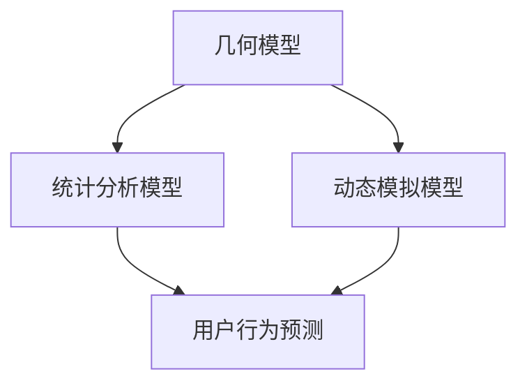
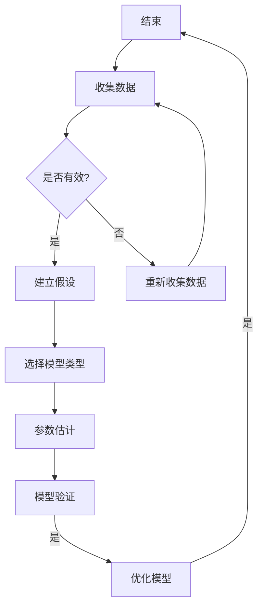
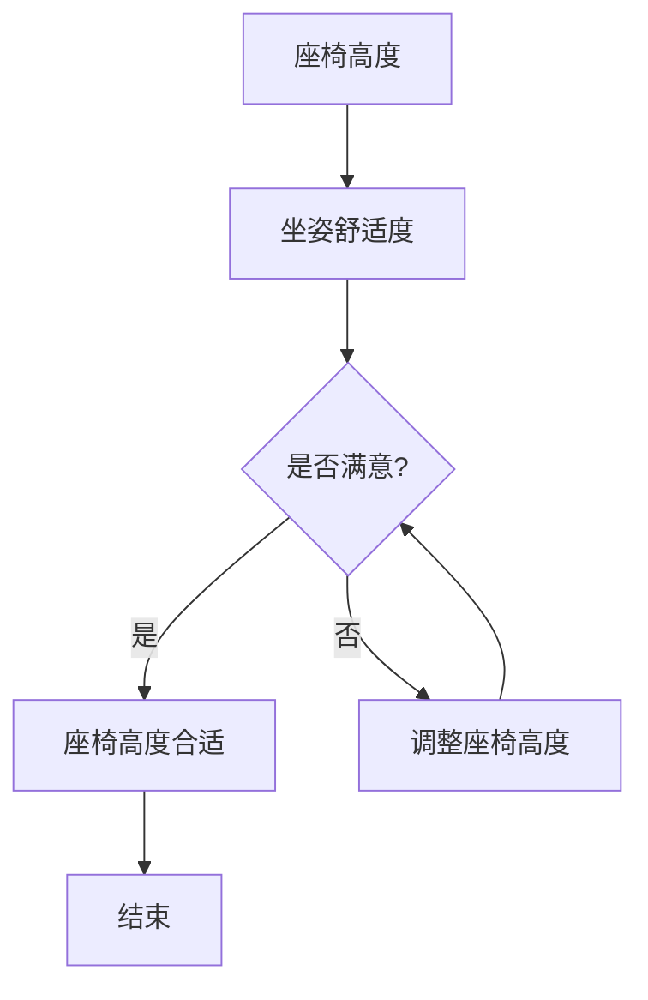
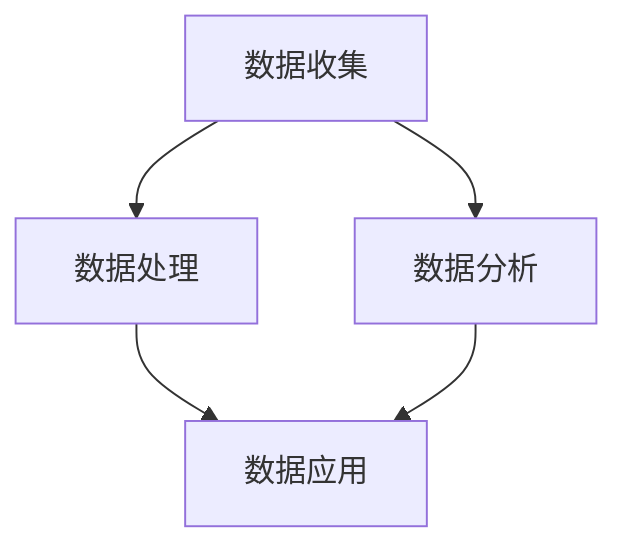
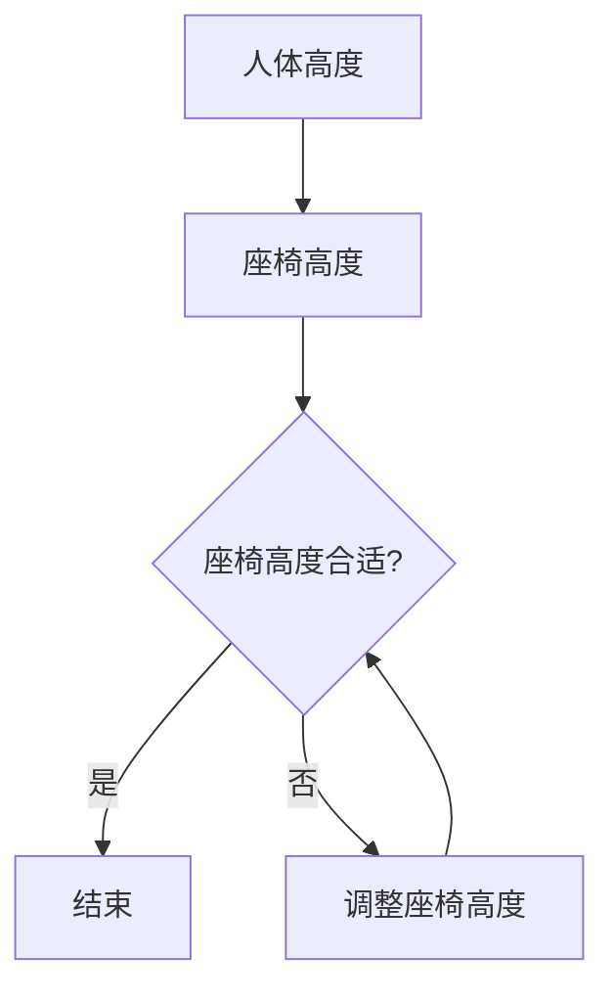

                 

### 数学与产品设计的人体工程学应用

关键词：数学、人体工程学、产品设计、设计优化、案例分析

摘要：本文旨在探讨数学在人体工程学中的应用，以及如何通过人体工程学原理优化产品设计。我们将逐步分析数学模型在人体工程学中的构建与验证，并通过实际案例展示如何将数学与人体工程学相结合，提高产品设计质量。

----------------------------------------------------------------

# 引言

## 1.1 背景介绍

### 1.1.1 设计与人体工程学的结合

设计是创造和改进产品的过程，而人体工程学（Ergonomics）则关注如何使产品适应人的生理和心理需求。随着科技的发展，人体工程学在产品设计中的应用越来越广泛，旨在提高产品的易用性、舒适性和效率。

### 1.1.2 数学在人体工程学中的应用

数学作为一种工具，为人体工程学提供了精确的数据分析和模型构建方法。从几何学、统计学到微积分，数学在人体工程学的各个领域都有广泛应用。

### 1.1.3 书籍的目的与读者对象

本书旨在为从事产品设计、人体工程学研究和实践的读者提供一本全面、系统的指南。无论是新手还是专业人士，都能从中获得有价值的信息和实用的技巧。

## 1.2 核心概念

### 1.2.1 人体工程学的基本原则

人体工程学的基本原则包括适应性、舒适性和效率。适应性意味着产品应能够适应不同用户的需求；舒适性是指产品在使用过程中应减少用户的疲劳和不适；效率则强调产品的操作简便性和工作效率。

### 1.2.2 数学建模的基本方法

数学建模是利用数学方法描述现实世界问题的一种方法。常见的数学建模方法包括几何建模、统计分析建模和动态模拟建模。

### 1.2.3 设计与人体工程学的联系与差异

设计与人体工程学的联系在于它们共同的目标是创造更好的产品。然而，设计更侧重于产品的外观和功能，而人体工程学则更关注产品的使用体验和人体适应性。

## 1.3 内容结构

### 1.3.1 书籍的结构安排

本书分为六个部分，从数学基础、人体工程学原理到实际案例分析，全面系统地介绍了数学与人体工程学在产品设计中的应用。

### 1.3.2 每章节的主要内容和目标

每章节都将详细讲解数学与人体工程学在产品设计中的具体应用，并通过案例分析和实践指导帮助读者理解并掌握相关知识。

### 1.3.3 读者如何利用本书

读者可以通过逐步阅读每个章节，深入了解数学与人体工程学的基本概念、应用方法和实际案例。同时，本书提供的实践指导和建议将有助于读者在实际工作中更好地应用所学知识。

---

# 数学基础

## 2.1 数学原理

### 2.1.1 几何学在人体工程学中的应用

几何学在人体工程学中的应用主要包括人体尺寸测量、空间布局和形状设计等方面。例如，通过几何学可以准确测量人体各部位的尺寸，从而设计出更加符合人体特征的产品。

### 2.1.2 统计学在人体数据分析中的应用

统计学在人体工程学中的应用主要体现在数据收集、分析和解释方面。通过统计学方法，我们可以更好地了解用户的生理和心理特征，为产品设计提供依据。

### 2.1.3 微积分在动态模拟中的应用

微积分在人体工程学中的动态模拟方面有着重要应用。通过微积分，我们可以模拟人体在各种动态环境下的行为和反应，从而优化产品设计。

## 2.2 数学模型

### 2.2.1 常见的数学模型及其在人体工程学中的应用

常见的数学模型包括几何模型、统计分析模型和动态模拟模型。几何模型主要用于人体尺寸和空间布局设计；统计分析模型用于数据分析和用户行为预测；动态模拟模型则用于模拟人体在不同环境下的动态反应。

### 2.2.2 数学模型的构建方法

构建数学模型通常包括以下步骤：定义问题、收集数据、建立假设、选择模型类型、参数估计和模型验证。

### 2.2.3 数学模型的验证与优化

数学模型的验证主要通过对比模型预测结果与实际数据，评估模型的准确性。模型的优化则通过调整模型参数和结构，提高模型的预测能力。

---

## 2.3 Mermaid 图解

### 2.3.1 数学模型的关系图

我们可以使用Mermaid绘制数学模型的关系图，直观地展示各模型之间的联系和作用。以下是一个简单的例子：

### 2.3.2 Mermaid 流程图的绘制

Mermaid流程图可以用于描述数学模型的构建和验证过程。以下是一个简单的例子：

### 2.3.3 Mermaid 图在数学模型中的应用实例

以下是一个使用Mermaid绘制的简单几何模型，用于描述人体坐姿与座椅高度的关系：

---

# 人体工程学原理与应用

## 3.1 基本原理

### 3.1.1 人体生理学基础

人体生理学基础包括人体尺寸、人体动作和人体疲劳等方面。了解这些基本原理有助于我们更好地设计出符合人体特征的产品。

### 3.1.2 人机交互原则

人机交互原则是指设计产品时应遵循的一系列原则，如易用性、可控性和反馈性等。这些原则有助于提高产品的用户体验。

### 3.1.3 工作环境设计

工作环境设计包括照明、通风、噪声控制等方面。一个良好的工作环境可以减少用户的疲劳和不适，提高工作效率。

## 3.2 应用实例

### 3.2.1 常见产品的人体工程学设计

常见产品如办公椅、电脑键盘和显示器等，都涉及人体工程学设计。以下是一些设计实例：

- **办公椅**：座椅高度、宽度、角度等参数应与人体尺寸相匹配，以提供舒适的坐姿。
- **电脑键盘**：键盘布局应考虑到用户的习惯和手指长度，以提高打字效率和舒适性。
- **显示器**：显示器高度和角度应与用户的视线保持一致，以减少眼睛疲劳。

### 3.2.2 人体工程学在办公室设计中的应用

办公室设计应考虑到人体工程学原理，以提供一个舒适、高效的工作环境。以下是一些设计建议：

- **办公桌椅**：选择符合人体尺寸的办公桌椅，确保用户在使用过程中保持正确的坐姿。
- **工作区域布局**：合理规划工作区域，确保用户在操作电脑、文件柜等设备时不需要过度弯腰或扭动身体。
- **照明与通风**：确保工作区域有足够的照明和通风，以减少用户的疲劳和不适。

### 3.2.3 人体工程学在工业设计中的应用

工业设计中也广泛应用人体工程学原理，以提高生产效率和安全性。以下是一些设计实例：

- **工业机器人**：设计机器人的动作范围和速度，使其与人类操作者的动作协调一致，减少碰撞和伤害风险。
- **自动化生产线**：设计合理的生产线布局，确保操作者在作业过程中不需要长时间弯腰或站立，以减少疲劳和工伤。

## 3.3 实际案例分析

### 3.3.1 案例一：某公司办公椅设计优化

某公司通过对员工进行人体测量，分析了不同身高用户的座椅高度、宽度、角度等参数。基于这些数据，公司对办公椅进行了优化设计，提高了员工的舒适度和工作效率。

### 3.3.2 案例二：某汽车内饰设计改进

某汽车公司通过调查用户对内饰舒适度的反馈，发现座椅材质、座椅角度和驾驶姿势等方面存在问题。公司据此对内饰进行了改进，提高了用户的驾驶体验。

### 3.3.3 案例三：某智能家居产品设计

某智能家居产品公司在设计智能灯泡时，通过用户调研和人体工程学分析，发现用户在操作灯泡时存在一些不便。公司据此对产品设计进行了优化，提高了产品的易用性。

---

# 数学在人体工程学分析中的应用

## 4.1 数据收集与处理

### 4.1.1 数据收集方法

数据收集方法包括问卷调查、人体测量和实验观察等。通过这些方法，我们可以收集到关于用户生理和心理特征的大量数据。

### 4.1.2 数据处理与分析工具

数据处理和分析工具包括Excel、SPSS和Python等。这些工具可以帮助我们整理、分析和可视化数据，为产品设计提供有力支持。

### 4.1.3 数据的可视化表示

数据可视化可以帮助我们更直观地了解用户特征和产品设计效果。常用的可视化工具包括图表、地图和热力图等。

## 4.2 数学建模

### 4.2.1 建模步骤与技巧

数学建模通常包括以下步骤：定义问题、收集数据、建立假设、选择模型类型、参数估计和模型验证。

### 4.2.2 人体参数建模

人体参数建模是数学建模中的重要组成部分。通过建立人体参数模型，我们可以模拟和分析人体在各种环境下的行为和反应。

### 4.2.3 动作与应力分析建模

动作与应力分析建模旨在分析人体在操作产品时的动态行为和生理负荷。通过这种建模，我们可以优化产品设计，提高用户的使用体验。

## 4.3 Mermaid 图解

### 4.3.1 数据流图

数据流图可以用于描述数据收集、处理和应用的整个过程。以下是一个简单的例子：

### 4.3.2 算法流程图

算法流程图可以用于描述数学建模过程中的关键步骤和逻辑关系。以下是一个简单的例子：

### 4.3.3 Mermaid 图在人体工程学分析中的应用

以下是一个使用Mermaid绘制的简单人体参数建模示例，描述了人体高度与座椅高度的关系：

---

# 优化与设计方法

## 5.1 设计优化基础

### 5.1.1 优化问题的基本概念

优化问题是指在一定约束条件下，寻找一个最优解的过程。设计优化旨在提高产品的性能、舒适性和效率。

### 5.1.2 目标函数与约束条件

目标函数是优化问题的核心，用于衡量产品的性能。约束条件则是限制优化过程的条件，确保设计方案的可行性和实用性。

### 5.1.3 优化算法的选择

优化算法包括线性优化、非线性优化和多目标优化等。选择合适的优化算法对于解决设计优化问题至关重要。

## 5.2 数学优化方法

### 5.2.1 线性优化

线性优化是指目标函数和约束条件都是线性的优化问题。线性优化方法包括单纯形法、梯度下降法和拉格朗日乘数法等。

### 5.2.2 非线性优化

非线性优化是指目标函数和约束条件至少有一个是非线性的优化问题。非线性优化方法包括牛顿法、拟牛顿法和变分法等。

### 5.2.3 多目标优化

多目标优化是指同时优化多个目标函数的优化问题。多目标优化方法包括加权法、Pareto优法和目标规划法等。

## 5.3 设计实现

### 5.3.1 设计流程

设计流程包括需求分析、概念设计、详细设计和测试验证等阶段。每个阶段都需要充分考虑人体工程学和数学优化方法。

### 5.3.2 设计工具的应用

设计工具如CAD、SolidWorks和MATLAB等在优化设计过程中发挥着重要作用。这些工具可以帮助我们快速构建数学模型，进行优化分析和仿真模拟。

### 5.3.3 设计案例实践

以下是一个设计案例实践，描述了如何通过数学优化方法优化办公椅设计：

- **需求分析**：确定办公椅的设计需求和目标，如舒适度、稳定性和外观等。

- **概念设计**：根据需求分析，设计出初步的办公椅方案。

- **详细设计**：通过数学优化方法，对办公椅的各项参数进行优化，如座椅高度、宽度、角度等。

- **测试验证**：对优化后的办公椅进行测试验证，确保其性能符合设计要求。

---

# 案例研究与实践经验

## 6.1 案例研究

### 6.1.1 案例一：某公司办公椅设计优化

某公司通过对员工进行人体测量，分析了不同身高用户的座椅高度、宽度、角度等参数。基于这些数据，公司对办公椅进行了优化设计，提高了员工的舒适度和工作效率。

### 6.1.2 案例二：某汽车内饰设计改进

某汽车公司通过调查用户对内饰舒适度的反馈，发现座椅材质、座椅角度和驾驶姿势等方面存在问题。公司据此对内饰进行了改进，提高了用户的驾驶体验。

### 6.1.3 案例三：某智能家居产品设计

某智能家居产品公司在设计智能灯泡时，通过用户调研和人体工程学分析，发现用户在操作灯泡时存在一些不便。公司据此对产品设计进行了优化，提高了产品的易用性。

## 6.2 最佳实践

### 6.2.1 设计经验总结

设计过程中，应充分考虑人体工程学和数学优化方法。通过人体测量、用户调研和数据分析，找出设计中的问题，并加以优化。

### 6.2.2 设计过程中的常见问题与解决方案

设计过程中常见的问题包括座椅高度不合适、座椅角度不当和操作不便等。针对这些问题，可以采取以下解决方案：

- **座椅高度不合适**：通过人体测量，确定合适的座椅高度。
- **座椅角度不当**：调整座椅角度，使其符合人体生理结构。
- **操作不便**：优化产品布局，提高操作的便捷性和舒适性。

### 6.2.3 未来设计趋势展望

随着科技的不断发展，人体工程学和数学优化方法在产品设计中的应用将更加广泛。未来设计趋势包括：

- **个性化设计**：根据用户个性化需求，定制化设计产品。
- **智能化设计**：利用人工智能技术，实现产品的自适应优化。
- **绿色设计**：注重环保和可持续发展，设计出更加绿色、环保的产品。

## 6.3 小结

本文从数学与人体工程学的角度，探讨了其在产品设计中的应用。通过实际案例分析和实践经验总结，我们发现数学与人体工程学的结合能够显著提高产品设计的质量和用户体验。未来，随着科技的进步，这一领域将不断拓展，为产品设计带来更多创新和发展。

---

# 作者信息

作者：AI天才研究院/AI Genius Institute & 禅与计算机程序设计艺术 /Zen And The Art of Computer Programming

