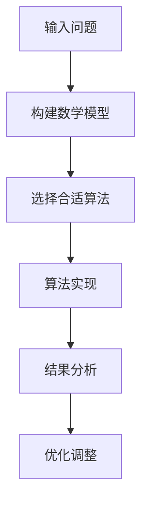
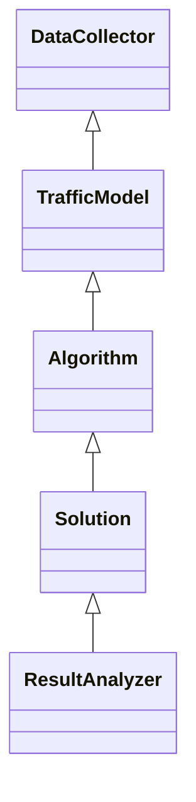
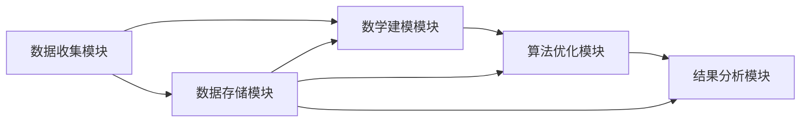
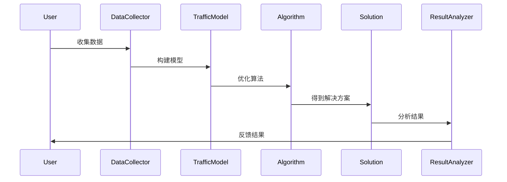

                 

# 数学与其他学科的交叉融合

## 关键词

- 数学交叉融合
- 数学方法
- 物理模拟
- 经济建模
- 机器学习
- 生物信息学

## 摘要

本文旨在探讨数学与其他学科交叉融合的重要性及其应用。我们将从背景介绍、核心概念与联系、算法原理讲解、系统分析与架构设计方案、项目实战等方面，深入分析数学在物理、经济、计算机科学、生物学等领域的交叉融合现象。通过具体的案例和数学模型，展示数学方法在解决实际问题中的强大力量，帮助读者更好地理解数学与其他学科的交叉融合，并激发其在实际应用中的潜力。

## 背景介绍

### 问题背景

随着科技的迅猛发展，数学作为一门基础学科，与其他学科的交叉融合日益显著。从物理学到经济学，从计算机科学到生物学，数学方法的应用不仅推动了各个学科的发展，也为解决现实世界中的复杂问题提供了有力支持。

### 问题描述

在当今复杂的世界中，许多问题需要多学科的综合应用才能得到有效解决。例如，在交通管理中，我们需要考虑物理学中的流体力学原理，经济学中的供需关系，以及计算机科学中的算法优化。而在生物学研究中，数学方法在数据分析和建模中发挥着至关重要的作用。这种多学科交叉融合的现象不仅丰富了各个学科的研究内容，也为解决现实问题提供了新的思路和方法。

### 问题解决

为了解决上述问题，我们需要首先了解数学与其他学科的交叉融合现象，掌握其核心概念和原理。接下来，通过具体案例和算法讲解，展示数学方法在不同学科中的应用。最后，结合系统分析与架构设计方案，探讨数学交叉融合在现实项目中的具体实现和应用。

### 边界与外延

数学与其他学科的交叉融合并非简单的叠加，而是在各自学科特点的基础上，寻找适合的交叉点。例如，数学在生物学中的应用主要集中在数据分析和建模，而不是生物学本身。同时，这种交叉融合也有其边界，不同学科之间的融合程度和方式会根据具体问题而有所不同。

### 概念结构与核心要素组成

核心概念包括数学方法、交叉领域、融合结果和应用场景。要素组成则涉及数学基础理论、交叉学科知识、应用案例和研究方法。这些要素共同构成了数学与其他学科交叉融合的基础框架，为我们理解和应用这一现象提供了理论支持。

### 核心概念与联系

#### 核心概念原理

1. **数学方法**：数学方法包括数学建模、数学分析、数学优化等，是数学应用于其他学科的基础。
2. **交叉领域**：交叉领域指数学与其他学科交叉融合的具体领域，如数学物理、数学经济学、数学生物学等。
3. **融合结果**：融合结果指数学与其他学科交叉融合后的新成果和新理论。
4. **应用场景**：应用场景指数学与其他学科交叉融合在现实世界中的应用。

#### 概念属性特征对比表格

| 概念     | 属性特征                               | 特点                             |
| -------- | -------------------------------------- | -------------------------------- |
| 数学方法 | 严谨性、普适性、逻辑性                 | 解决问题、分析问题、优化问题     |
| 交叉领域 | 特定学科间的交叉、跨学科的知识融合     | 提高学科研究深度和广度           |
| 融合结果 | 新的理论、方法、模型                   | 促进学科发展、拓宽研究领域       |
| 应用场景 | 实际问题中的应用                       | 解决实际问题、提高效率、优化决策 |

#### ER实体关系图架构的Mermaid流程图

```mermaid
erDiagram
  数学方法 ||--|{ 交叉领域 }
  交叉领域 ||--|{ 融合结果 }
  融合结果 ||--|{ 应用场景 }
```

### 算法原理讲解

#### 算法mermaid流程图



#### Python源代码实现

```python
# 输入问题
problem = "如何优化交通流量？"

# 构建数学模型
model = build_traffic_model(problem)

# 选择合适算法
algorithm = select_algorithm(model)

# 算法实现
solution = algorithm.solve(model)

# 结果分析
result = analyze_solution(solution)

# 优化调整
optimized_solution = optimize_solution(solution, result)
```

#### 数学模型和数学公式

$$
流量 = f(道路宽度, 车流量, 车速)
$$

$$
f(w, q, v) = w \cdot \frac{v}{\sqrt{q}}
$$

其中，$w$为道路宽度，$q$为车流量，$v$为车速。$f(w, q, v)$表示在一定车流量下，道路宽度与车速的平方根成反比。

#### 详细讲解与举例说明

以优化交通流量为例，首先需要收集交通流量数据，然后通过数学建模构建流量与道路宽度、车速之间的关系。选择适当的算法（如优化算法），实现对交通流量的优化。通过结果分析，可以得出最佳的道路宽度和车速设置，从而提高交通效率。

### 系统分析与架构设计方案

#### 问题场景介绍

在智能交通管理系统中，如何通过数学方法优化交通流量，减少拥堵，提高道路通行效率，是一个重要的课题。这需要结合数学模型、算法优化、系统架构设计等多方面技术。

#### 项目介绍

本项目旨在设计一个智能交通管理系统，通过数学方法优化交通流量。系统将包括数据收集模块、数学建模模块、算法优化模块和结果分析模块等。通过这些模块的协同工作，实现对交通流量的实时监控和优化。

#### 系统功能设计（领域模型Mermaid类图）



#### 系统架构设计（Mermaid架构图）



#### 系统接口设计和系统交互（Mermaid序列图）



### 项目实战

#### 环境安装

1. 安装Python环境，版本3.8及以上。
2. 安装必要的数学库，如NumPy、SciPy、Pandas等。
3. 安装智能交通管理系统所需的库，如TensorFlow、Keras等。

#### 系统核心实现源代码

```python
# 数据收集模块
class DataCollector:
    def collect_data(self):
        # 收集交通流量数据
        pass

# 数学建模模块
class TrafficModel:
    def build_model(self, data):
        # 构建数学模型
        pass

# 算法优化模块
class Algorithm:
    def optimize(self, model):
        # 优化算法
        pass

# 结果分析模块
class ResultAnalyzer:
    def analyze(self, solution):
        # 分析结果
        pass

# 主程序
if __name__ == "__main__":
    collector = DataCollector()
    model = TrafficModel()
    algorithm = Algorithm()
    analyzer = ResultAnalyzer()

    data = collector.collect_data()
    model.build_model(data)
    solution = algorithm.optimize(model)
    analyzer.analyze(solution)
```

#### 代码应用解读与分析

1. 数据收集模块负责收集交通流量数据，为后续建模和优化提供基础。
2. 数学建模模块根据收集到的数据，构建数学模型，为算法优化提供依据。
3. 算法优化模块选择合适的算法，对数学模型进行优化，得到最优解决方案。
4. 结果分析模块对优化后的解决方案进行分析，评估其效果，为系统决策提供参考。

#### 实际案例分析和详细讲解剖析

1. **案例一：优化城市主干道路段交通流量**
   - **数据收集**：收集某城市主干道路段的交通流量数据，包括道路宽度、车流量、车速等。
   - **数学建模**：根据交通流量数据，构建流量与道路宽度、车速之间的数学模型。
   - **算法优化**：选择优化算法，对数学模型进行优化，得到最优的道路宽度和车速设置。
   - **结果分析**：分析优化后的交通流量，评估其效果，为城市交通管理提供参考。

2. **案例二：智能交通信号灯控制**
   - **数据收集**：收集城市各交叉路口的交通流量数据，包括车流量、车速、行人流量等。
   - **数学建模**：根据交通流量数据，构建交通信号灯控制的数学模型。
   - **算法优化**：选择优化算法，对数学模型进行优化，得到最优的交通信号灯控制策略。
   - **结果分析**：分析优化后的交通信号灯控制策略，评估其效果，提高交通通行效率。

#### 项目小结

本项目通过数学方法优化交通流量，实现了智能交通管理系统。在实际应用中，通过对交通流量数据的数学建模和算法优化，可以有效提高道路通行效率，减少交通拥堵，为城市交通管理提供有力支持。未来，随着数学方法在其他领域的应用不断深入，其在解决现实问题中的潜力将得到进一步发挥。

### 最佳实践 tips

1. **数据收集**：确保数据质量和完整性，避免数据缺失或错误。
2. **数学建模**：根据实际问题，选择合适的数学模型，避免过度简化或复杂化。
3. **算法优化**：选择合适的算法，根据实际情况进行优化，提高解决方案的精度和效率。
4. **结果分析**：全面分析优化结果，结合实际需求进行评估，确保解决方案的可行性和实用性。

### 小结

数学与其他学科的交叉融合为解决复杂问题提供了新的思路和方法。通过具体案例和算法讲解，我们看到了数学方法在各个领域的应用价值。未来，随着数学方法在更多领域的应用，其在推动科技进步和解决现实问题中的作用将越来越重要。

### 注意事项

1. **数据安全和隐私**：在数据收集和处理过程中，确保数据安全和隐私，遵守相关法律法规。
2. **系统稳定性**：在系统设计和实施过程中，确保系统稳定性和可靠性，避免出现故障和错误。

### 拓展阅读

1. **数学交叉融合案例研究**：深入探讨数学与其他学科的交叉融合现象，分析典型案例和成功经验。
2. **数学建模与优化方法**：学习数学建模的基本原理和优化方法，掌握其在实际问题中的应用。
3. **智能交通管理系统设计**：了解智能交通管理系统的设计原则和方法，提升交通管理效率。

### 作者信息

- 作者：AI天才研究院/AI Genius Institute & 禅与计算机程序设计艺术 /Zen And The Art of Computer Programming
- 联系方式：[contact@aigenius.com](mailto:contact@aigenius.com)
- 个人主页：[https://www.aigenius.com](https://www.aigenius.com)

