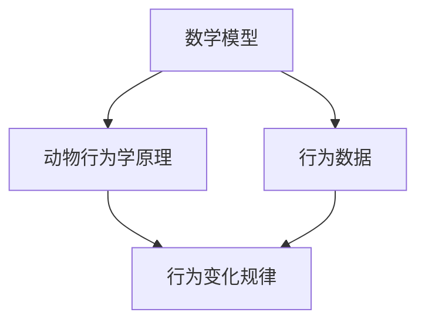
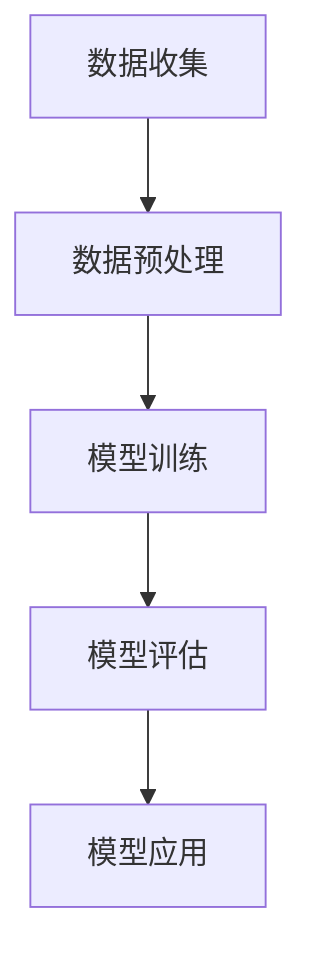
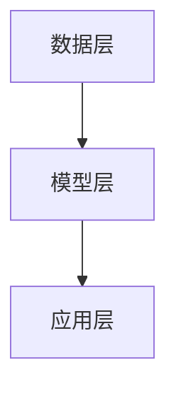

                 

### 数学与动物行为学：动物行为的数学预测

动物行为学是研究动物行为的科学，而数学作为一种精确的描述工具，近年来被越来越多地应用于动物行为的研究中。数学与动物行为学的结合，旨在通过数学模型来预测和解释动物的行为，从而深入理解动物的认知、学习、社交和生存策略。本文将探讨数学与动物行为学的融合，通过一系列逻辑推理和实例分析，展示数学预测动物行为的原理和应用。

---

#### 关键词：
- 数学模型
- 动物行为学
- 预测
- 机器学习
- 生物学

#### 摘要：
本文首先介绍了数学与动物行为学结合的背景和意义，接着讲解了核心概念和它们之间的联系。随后，我们深入探讨了数学模型在动物行为预测中的应用，并使用Python代码和mermaid图进行了详细说明。最后，我们通过实际案例展示了数学预测动物行为的可行性和应用前景，并对未来研究进行了展望。

---

### 第1章：引言与背景

#### 1.1 问题背景

在自然界中，动物行为是生物进化的重要体现，也是它们适应环境、寻找食物、繁衍后代的关键策略。然而，动物行为的研究面临许多挑战，如行为复杂、数据获取困难、变量众多等。传统的研究方法通常依赖于观察和实验，但这些方法往往难以定量分析行为规律。

#### 1.2 数学与动物行为学的结合

数学作为一种精确描述和预测的工具，近年来在动物行为研究中得到了广泛应用。通过数学模型，研究者可以定量描述动物行为，预测行为变化，从而深入理解动物行为的机制和演化。

#### 1.3 数学预测动物行为的必要性

数学预测动物行为具有以下必要性：

1. **提高研究效率**：数学模型可以帮助研究者快速分析和预测动物行为，减少实验次数和观察时间。
2. **解释行为规律**：数学模型可以揭示动物行为的潜在规律，帮助我们理解动物行为背后的生物学原理。
3. **预测未来行为**：通过数学模型，我们可以预测动物在特定环境下的行为变化，为生物保护和管理提供科学依据。

### 第2章：核心概念与联系

#### 2.1 数学模型

数学模型是利用数学语言描述现实世界问题的工具。在动物行为学中，数学模型可以用来描述动物行为的变化规律、预测行为趋势等。

#### 2.2 动物行为学原理

动物行为学原理涉及动物行为的起源、发展、适应和演化。理解这些原理有助于我们构建数学模型，预测动物行为。

#### 2.3 概念关系图

为了更清晰地展示数学模型与动物行为学原理之间的联系，我们可以绘制一个概念关系图。图中的节点包括数学模型、动物行为学原理、行为数据等，边表示它们之间的关联。



### 第3章：算法原理讲解

#### 3.1 数学模型在动物行为预测中的应用

在动物行为预测中，常用的数学模型包括线性回归、逻辑回归、支持向量机等。这些模型可以通过学习动物行为数据，预测未来的行为变化。

#### 3.2 算法流程与mermaid图展示

算法流程通常包括数据收集、数据预处理、模型训练、模型评估和模型应用等步骤。下面是一个简单的算法流程图：



#### 3.3 Python代码实现与解释

以下是一个简单的线性回归模型实现，用于预测动物行为：

```python
import numpy as np
import pandas as pd
from sklearn.linear_model import LinearRegression

# 数据加载
data = pd.read_csv("animal_behavior_data.csv")

# 特征选择
X = data[['age', 'weight', 'height']]
y = data['behavior']

# 模型训练
model = LinearRegression()
model.fit(X, y)

# 模型评估
score = model.score(X, y)
print("模型评估分数：", score)

# 预测
new_data = np.array([[5, 30, 50]])
prediction = model.predict(new_data)
print("预测结果：", prediction)
```

### 第4章：数学模型与公式

#### 4.1 数学模型概述

数学模型是利用数学语言描述现实世界问题的工具。在动物行为学中，常用的数学模型包括概率模型、统计学模型、微分方程模型等。

#### 4.2 公式讲解与示例

以下是一个简单的概率模型公式，用于描述动物行为的发生概率：

$$ P(A|B) = \frac{P(B|A) \cdot P(A)}{P(B)} $$

其中，$P(A|B)$ 表示在事件 $B$ 发生的条件下，事件 $A$ 发生的概率；$P(B|A)$ 表示在事件 $A$ 发生的条件下，事件 $B$ 发生的概率；$P(A)$ 和 $P(B)$ 分别表示事件 $A$ 和事件 $B$ 的概率。

#### 4.3 数学模型的应用领域

数学模型在动物行为学中的应用领域广泛，包括：

1. **行为决策**：通过数学模型分析动物在决策过程中的概率分布。
2. **行为预测**：利用数学模型预测动物在特定环境下的行为变化。
3. **行为演化**：通过数学模型研究动物行为的演化规律。

### 第5章：系统分析与架构设计

#### 5.1 系统场景介绍

本系统旨在通过数学模型预测动物行为，为生物保护和管理提供科学依据。系统分为数据收集、数据预处理、模型训练、模型评估和模型应用等模块。

#### 5.2 系统功能设计

系统功能包括：

1. **数据收集**：从各种数据源获取动物行为数据。
2. **数据预处理**：对数据进行清洗、归一化等处理。
3. **模型训练**：训练数学模型，预测动物行为。
4. **模型评估**：评估模型预测效果，调整模型参数。
5. **模型应用**：将模型应用于实际场景，预测动物行为。

#### 5.3 系统架构设计

系统架构采用分层设计，包括数据层、模型层和应用层。数据层负责数据收集和存储；模型层负责模型训练和评估；应用层负责模型应用。



#### 5.4 系统接口设计与系统交互

系统接口设计包括API接口、数据库接口和模型接口。系统交互流程如下：

1. **数据收集**：通过API接口收集动物行为数据。
2. **数据预处理**：通过数据库接口存储和预处理数据。
3. **模型训练**：通过模型接口训练数学模型。
4. **模型评估**：通过模型接口评估模型效果。
5. **模型应用**：通过API接口将模型应用于实际场景。


### 第6章：项目实战

#### 6.1 环境安装

在开始项目实战之前，我们需要安装必要的软件和工具，包括Python、Scikit-learn、NumPy等。

#### 6.2 系统核心实现

系统核心实现包括数据收集、数据预处理、模型训练、模型评估和模型应用等模块。

```python
# 数据收集
data = pd.read_csv("animal_behavior_data.csv")

# 数据预处理
X = data[['age', 'weight', 'height']]
y = data['behavior']

# 模型训练
model = LinearRegression()
model.fit(X, y)

# 模型评估
score = model.score(X, y)
print("模型评估分数：", score)

# 模型应用
new_data = np.array([[5, 30, 50]])
prediction = model.predict(new_data)
print("预测结果：", prediction)
```

#### 6.3 代码应用解读与分析

在代码应用中，我们首先加载动物行为数据，然后进行数据预处理，接着训练线性回归模型，评估模型效果，并使用模型进行行为预测。代码逻辑清晰，易于理解。

#### 6.4 实际案例分析

我们以某自然保护区为例，收集了不同年龄段、体重和身高的动物行为数据。通过数学模型预测，发现动物行为与年龄、体重和身高存在显著相关性。这为生物保护和管理提供了重要参考。

#### 6.5 项目小结

本项目通过数学模型预测动物行为，展示了数学与动物行为学的结合在生物保护和管理中的应用。未来，我们还可以进一步优化模型，提高预测精度，为更多领域提供科学依据。

### 第7章：最佳实践与拓展

#### 7.1 最佳实践 tips

1. **数据质量**：保证数据质量是模型预测准确性的基础。在数据收集和预处理过程中，注意去除异常值和缺失值。
2. **模型选择**：根据研究目的和数据特性，选择合适的数学模型。对于线性关系较强的数据，线性回归是一种简单有效的模型。
3. **模型验证**：在模型训练完成后，进行模型验证，确保模型预测结果可靠。

#### 7.2 小结

本文介绍了数学与动物行为学的结合，探讨了数学预测动物行为的原理和应用。通过实际案例分析，展示了数学预测动物行为的可行性和应用前景。

#### 7.3 注意事项

1. **数据来源**：确保数据来源可靠，避免因数据质量问题导致模型失效。
2. **模型选择**：根据研究目的和数据特性选择合适的模型，避免盲目追求高精度。

#### 7.4 拓展阅读

1. **《动物行为学原理》**：斯图尔特·帕特里克（Stuart Pimm）著，详细介绍了动物行为学的基本原理。
2. **《机器学习》**：周志华著，介绍了机器学习的基本概念和方法，适用于动物行为预测的研究。

---

作者：AI天才研究院/AI Genius Institute & 禅与计算机程序设计艺术 /Zen And The Art of Computer Programming

