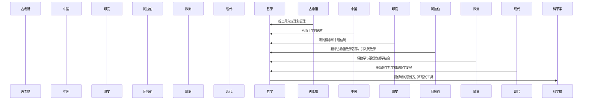

                 

### 数学与哲学思想的对比与融合

**关键词：** 数学、哲学、思想、对比、融合

**摘要：** 本文深入探讨了数学与哲学思想的核心概念、对比分析、历史发展及其融合。通过逻辑清晰的步骤，阐述了数学与哲学的互补性及其在科学研究和社会发展中的深远影响。

### 引言

**为什么我们要探讨数学与哲学思想的对比与融合？**

在人类的认识历程中，数学与哲学始终占据着重要的地位。数学作为一门精确的科学，其逻辑严密、方法严格，为科学研究提供了坚实的理论基础；而哲学则以其深刻的思考和对问题的反思，引导我们理解世界的本质。两者看似不同，但实则相辅相成，共同推动了人类文明的进步。

本文旨在通过对数学与哲学思想的深入探讨，揭示两者之间的对比与融合。我们首先将介绍数学与哲学的基本概念，理解其核心要素；然后，通过对比分析，探讨数学与哲学思想在原理、方法论等方面的异同；接着，回顾历史发展，了解两者在古代、中世纪及近现代的演进过程；最后，分析数学与哲学思想的融合，探讨其对科学研究和社会发展的深远影响。

### 数学的基本概念

**数学的起源与发展**

数学的历史可以追溯到古代文明，如古埃及和巴比伦。早期的数学主要涉及简单的算术和几何，用于解决日常生活中的实际问题，如土地测量和天文计算。随着人类社会的发展，数学逐渐成为一个独立的学科，并不断发展壮大。

在古希腊时期，数学得到了迅速的发展。毕达哥拉斯学派的发现，如勾股定理，奠定了数学的基础。亚里士多德等哲学家也对数学进行了深刻的思考，提出了许多重要的数学原理。

中世纪的阿拉伯数学家如阿尔-花拉子米等人的工作，推动了数学的进一步发展。他们翻译并传播了古希腊的数学著作，同时也对数学进行了创新，如引入了代数学。

近现代，数学迎来了爆炸式的发展。牛顿和莱布尼茨的微积分，欧拉和拉格朗日的数学分析，牛顿-莱布尼茨力学体系等，都标志着数学在科学研究中的重要地位。

**数学的基本原理与范畴**

数学的基本原理包括逻辑性、抽象性和普遍性。逻辑性指的是数学的推理过程遵循逻辑规则，确保结论的可靠性。抽象性指的是数学从具体的事物中抽象出基本概念和原理，形成了一套独立于具体应用的理论体系。普遍性则意味着数学的原理和结论具有广泛适用性，不受特定情境的限制。

数学的范畴包括数论、代数、几何、拓扑、微积分、概率论等。数论研究整数及其性质，是数学的基础。代数研究符号和运算规则，是解决实际问题的重要工具。几何研究空间形状和位置关系，是自然科学和工程技术的基础。拓扑研究空间的连续性和结构性质，是现代数学的重要分支。微积分研究函数的极限、导数、积分等，是物理学、工程学等领域的核心工具。概率论研究随机事件和不确定性，是金融、保险、统计等领域的重要理论基础。

**数学的应用领域**

数学在自然科学、社会科学、工程技术和信息技术等领域有广泛的应用。

在自然科学中，数学是物理学、化学、生物学等学科的基础。例如，牛顿的力学体系、爱因斯坦的相对论等，都是建立在数学理论之上的。

在社会科学中，数学为经济学、社会学、心理学等提供了重要的分析工具。例如，经济学中的供需理论、市场模型等，都依赖于数学方法。

在工程技术中，数学是机械工程、电子工程、土木工程等领域的核心工具。例如，结构分析、电路设计、信号处理等，都需要数学的支持。

在信息技术中，数学是计算机科学的基础。例如，算法分析、密码学、人工智能等，都是数学的应用领域。

### 哲学的基本概念

**哲学的起源与发展**

哲学的起源可以追溯到古希腊，如苏格拉底、柏拉图和亚里士多德等哲学家。他们提出了许多重要的哲学问题，并形成了不同的哲学流派。中世纪的阿拉伯哲学家，如阿维罗伊和阿尔-花拉子米等，对哲学进行了深入的探讨，并将其与数学、天文学等领域相结合。

近代哲学在西方经历了启蒙运动和德国古典哲学的发展。康德、黑格尔、尼采等哲学家提出了许多深刻的哲学思想，对后世产生了深远的影响。

现代哲学则更加多样化，涵盖了存在主义、分析哲学、现象学、结构主义等不同的流派。哲学家们继续探讨人类存在的意义、真理的本质、知识的起源等问题。

**哲学的基本原理与范畴**

哲学的基本原理包括反思性、概念性和价值性。反思性指的是哲学通过对自身问题和方法的反思，推动哲学的发展。概念性则是指哲学通过对基本概念的分析和探讨，理解世界的本质。价值性则意味着哲学探讨的是人类的价值观念和道德准则。

哲学的范畴包括存在论、认识论、伦理学、政治哲学等。存在论探讨存在的本质和形式，认识论探讨知识的本质和来源，伦理学探讨道德和价值观，政治哲学探讨社会和政治制度。

**哲学的分支与应用**

哲学的分支众多，应用广泛。存在主义探讨个体存在的意义和自由，影响了许多现代思想。分析哲学通过对语言和逻辑的分析，推进了哲学研究的方法论变革。现象学强调主观体验和意识，为心理学和文化研究提供了理论基础。结构主义则通过分析社会结构和符号系统，推动了文化研究和社会学的发展。

哲学在各个领域都有重要的应用。在心理学中，哲学探讨意识、自我、自由等基本问题，为心理学研究提供了理论框架。在伦理学中，哲学探讨道德原则和价值观，为伦理决策提供了指导。在政治哲学中，哲学探讨社会正义、民主制度等基本问题，为政治理论和实践提供了理论基础。

### 数学与哲学的联系

**数学的哲学基础**

数学的发展离不开哲学的思考。早期的数学，如古希腊数学，受到柏拉图理念论的影响，认为数学研究的是抽象的、永恒的理念。这种哲学思想为数学的严谨性和抽象性奠定了基础。

近代以来，康德的哲学思想对数学产生了重要影响。康德认为，数学公理不是从经验中得出的，而是人类理性先天具备的。这种观点为数学的独立性和普遍性提供了哲学依据。

**哲学的数学方法**

哲学的反思性方法对数学的发展产生了重要影响。例如，欧几里得的《几何原本》通过公理法建立了几何学的基础，这种方法在后来的数学研究中得到广泛应用。

哲学的反思性也促进了数学方法的创新。例如，布尔巴基学派通过反思数学的本质，提出了结构主义数学，为现代数学的发展提供了新的视角。

**数学与哲学的共同目标**

数学与哲学都追求对世界的深刻理解和解释。数学通过精确的推理和证明，揭示自然界的规律和结构；哲学则通过反思和探讨，揭示人类存在的意义和价值。

数学与哲学的共同目标还体现在对知识、真理和美的追求上。数学的证明和推理追求真理，哲学的思考和分析追求知识的深度；而数学的美感、哲学的思辨，都追求美的享受和心灵的满足。

### 数学与哲学的核心要素组成

**数学概念属性特征对比表格**

| 特征         | 数学                 | 哲学                 |
|--------------|----------------------|----------------------|
| 理论基础     | 先天公理和逻辑推理   | 经验观察和理性反思   |
| 目标         | 揭示规律、建立模型   | 理解本质、探讨意义   |
| 方法         | 证明和推理           | 分析和反思           |
| 结论         | 精确、普遍           | 深刻、多样           |
| 应用领域     | 自然科学、社会科学、工程技术 | 心理学、伦理学、政治哲学 |

**哲学概念ER实体关系图架构**

```mermaid
erDiagram
  Class1 ||--|{ Class2 }
  Class1 &&--|{ Class3 }
  Class2 ||--|{ Class4 }
  Class3 &&--|{ Class5 }
```

通过上述表格和ER实体关系图，我们可以更清晰地看到数学与哲学的核心要素及其相互关系。

### 本章小结

本章首先介绍了数学的基本概念，包括其起源、发展、基本原理和主要范畴。然后，我们探讨了哲学的基本概念，包括其起源、发展、基本原理和主要范畴。接着，我们分析了数学与哲学的联系，强调了数学的哲学基础、哲学的数学方法以及两者的共同目标。最后，通过对比表格和ER实体关系图，我们展示了数学与哲学的核心要素及其相互关系。这些内容为后续章节的深入探讨奠定了基础。

### 数学与哲学思想的核心原理对比

**数学思想的核心原理**

**数学证明的哲学意义**

数学证明是数学思想的基石，其哲学意义在于确保数学结论的可靠性和普遍性。通过严格的逻辑推理和演绎过程，数学证明使我们对数学理论的信心得以建立。数学证明不仅揭示了数学问题的内在逻辑结构，也体现了人类理性的力量。

**数学的逻辑性与抽象性**

数学以其逻辑严密和抽象性著称。逻辑性指的是数学推理过程遵循严格的逻辑规则，从已知的前提出发，得出可靠的结论。抽象性则指的是数学从具体的事物中抽象出基本概念和原理，形成了一套独立于具体应用的理论体系。这种抽象性使数学能够广泛应用于各个领域。

**数学的客观性与普遍性**

数学的客观性体现在其结论不受个人主观意识的影响，而是基于客观存在的规律和事实。普遍性则意味着数学的原理和结论具有广泛适用性，不受特定情境的限制。这种客观性和普遍性使数学成为科学研究和工程实践的重要工具。

**哲学思想的核心原理**

**哲学反思的数学基础**

哲学反思是哲学思想的核心，其数学基础在于逻辑推理和证明方法。哲学通过对数学方法的研究和运用，揭示了逻辑推理的可靠性和有效性。例如，康德的《纯粹理性批判》中，通过逻辑推理探讨了知识的本质和范围。

**哲学的概念性与反思性**

哲学的概念性体现在其对基本概念的分析和探讨。哲学通过对概念的定义、分类和比较，深入理解世界的本质和结构。反思性则是指哲学通过对自身问题和方法的反思，推动哲学的发展。反思性使哲学能够不断自我更新和进步。

**哲学的价值性与多样性**

哲学的价值性体现在其对人类价值观的探讨和指导。哲学研究道德、伦理、政治等问题，提供了价值判断和道德规范。哲学的多样性则意味着哲学观点和流派的多样性，不同的哲学流派对同一问题可能有不同的看法和解释。

**数学与哲学思想的比较分析**

**数学与哲学的共同点**

数学与哲学在许多方面有共同点。首先，它们都追求真理和知识，通过逻辑推理和证明方法来建立理论体系。其次，它们都强调客观性和普遍性，以确保结论的可靠性和广泛适用性。此外，数学与哲学都关注抽象性和反思性，通过抽象的概念和反思的方法来深入理解世界的本质。

**数学与哲学的差异**

尽管数学与哲学有许多共同点，但它们也存在明显的差异。数学以精确的公式和严格的证明为核心，强调逻辑性和抽象性；而哲学则更注重反思和探讨，强调概念性和反思性。数学的目标是建立模型和解决实际问题，而哲学的目标则是理解本质和探讨意义。此外，数学的结论具有普遍性和客观性，而哲学的结论则更多地受到个人观点和文化背景的影响。

**数学与哲学的互补性**

数学与哲学的互补性体现在它们在不同领域的优势互补。数学以其逻辑严密和抽象性，为科学研究和工程实践提供了坚实的理论基础；而哲学以其反思和探讨，为数学提供了哲学基础和指导。数学与哲学的结合，不仅能够深化我们对世界的理解，也能够促进科学和哲学的相互发展。

### 数学与哲学思想的对比表格

| 对比要素 | 数学                       | 哲学                       |
|----------|----------------------------|----------------------------|
| 理论基础 | 先天公理和逻辑推理         | 经验观察和理性反思         |
| 目标     | 揭示规律、建立模型         | 理解本质、探讨意义         |
| 方法     | 证明和推理                 | 分析和反思                 |
| 结论     | 精确、普遍                 | 深刻、多样                 |
| 应用领域 | 自然科学、社会科学、工程技术 | 心理学、伦理学、政治哲学 |
| 优势     | 逻辑严密、抽象性           | 反思深入、概念丰富         |
| 劣势     | 抽象性强、应用广泛         | 观点多样、主观性较强       |
| 补充     | 需要哲学的指导             | 需要数学的支持             |

通过上述对比表格，我们可以更清晰地看到数学与哲学思想的异同及其互补性。

### 本章小结

本章通过对比分析数学与哲学思想的核心原理，展示了它们在理论基础、目标、方法、结论和应用领域的异同。数学以其逻辑严密和抽象性为核心，强调客观性和普遍性；哲学则以其反思和探讨为核心，强调概念性和反思性。尽管两者存在差异，但它们的互补性使它们能够相互促进，共同推动人类文明的进步。通过本章的探讨，我们更深入地理解了数学与哲学思想的本质及其相互关系。

### 数学与哲学思想的历史发展

**古代数学与哲学思想的发展**

古代数学的发展离不开哲学的思考。在古希腊，数学与哲学紧密结合，如毕达哥拉斯学派的“数是万物的本原”思想，对数学的发展产生了深远影响。古希腊哲学家如欧几里得，创立了几何学，提出了许多重要的几何定理，如勾股定理。亚里士多德则从哲学角度探讨了数学的基本原理，如形式和质料的概念。

在中国，古代数学与哲学也有密切联系。中国古代数学以《九章算术》为代表，涵盖了算术、代数、几何等多个领域。中国古代哲学家如孔子和庄子，对数学方法进行了深刻的思考，提出了“形而上者，形而下者为之器”的观点，强调了数学在哲学中的地位。

古印度数学的发展同样受到哲学的影响。古印度哲学家如婆罗摩笈多，提出了许多重要的数学理论，如零的概念和十进位制。古印度数学家如阿耶波多，创立了《阿耶波多历》，对天文计算和天文学的发展做出了重要贡献。

**中世纪数学与哲学思想的发展**

中世纪是数学与哲学思想发展的一个重要时期。在阿拉伯世界，数学得到了极大的发展。阿拉伯数学家如阿尔-花拉子米，翻译并传播了古希腊的数学著作，如《几何原本》。同时，他们也对数学进行了创新，如引入了代数学。阿拉伯哲学家如伊本·西那，从哲学角度探讨了数学的本质和意义。

在欧洲中世纪，数学与哲学思想的发展受到基督教哲学的影响。中世纪哲学家如托马斯·阿奎那，试图将基督教信仰与数学相结合，提出了许多重要的数学观点。中世纪的大学如巴黎大学和博洛尼亚大学，成为数学与哲学思想交流的重要场所。

**近现代数学与哲学思想的发展**

近现代数学的发展是一个前所未有的繁荣时期。牛顿和莱布尼茨的微积分、欧拉和拉格朗日的数学分析、牛顿-莱布尼茨力学体系等，都标志着数学在科学研究中的重要地位。近现代数学的发展离不开哲学的思考。康德从哲学角度探讨了数学的公理基础，提出了先天综合判断的概念。

现代哲学对数学也产生了重要影响。现象学强调主观体验和意识，对数学哲学产生了深远影响。分析哲学通过对语言和逻辑的分析，推进了哲学研究的方法论变革。结构主义通过分析社会结构和符号系统，推动了文化研究和社会学的发展。

近现代数学与哲学思想的融合，不仅推动了数学和哲学的发展，也促进了科学技术的进步。例如，量子力学和相对论的提出，离不开数学和哲学的深度思考。近现代数学与哲学思想的融合，为我们提供了新的思维方式和理论工具，推动了人类对自然世界的认识。

**数学与哲学思想的历史演进图**



通过上述历史演进图，我们可以清晰地看到数学与哲学思想在不同时期的发展脉络及其相互影响。

### 本章小结

本章回顾了数学与哲学思想的历史发展，从古代到中世纪再到近现代，数学与哲学思想相互影响、共同进步。古希腊、中国、古印度和阿拉伯的数学成就，中世纪数学与哲学的融合，以及近现代数学与哲学的深入发展，都展示了数学与哲学在人类文明进程中的重要作用。通过历史的发展，我们可以更深入地理解数学与哲学思想的本质及其相互关系。

### 数学与哲学思想的融合

**数学在哲学中的应用**

数学在哲学中有着广泛的应用，尤其在伦理学和逻辑学中。在伦理学中，数学方法被用于分析道德原则和价值观。例如，哲学家杰瑞·奥弗顿等人使用博弈论来研究道德决策和道德责任，探讨了个体和社会之间的道德关系。此外，概率论在伦理学中的应用，使得道德决策更加科学和合理。

在逻辑学中，数学方法为逻辑推理提供了坚实的基础。形式逻辑和数理逻辑的发展，使得逻辑推理更加严谨和精确。例如，皮亚诺公理系统为自然数提供了一个严格的定义，使得数学和哲学中的推理更加可靠。康德的《纯粹理性批判》中，也运用了数学方法来探讨认知的本质和范围。

**哲学在数学中的应用**

哲学在数学中的应用同样重要。哲学的反思性方法为数学的发展提供了新的视角。例如，康德在《纯粹理性批判》中，通过反思性方法探讨了数学的公理基础，提出了先天综合判断的概念。这种哲学思考促进了数学基础理论的深化。

此外，哲学对数学问题的指导作用也显而易见。哲学家们的思考不仅为数学问题的提出和解决提供了启示，也推动了数学方法论的创新。例如，莱布尼茨从哲学角度探讨了微积分的基本原理，提出了积分和微分的概念。

**数学与哲学思想融合的案例研究**

**柏拉图与数学思想的融合**

柏拉图是哲学与数学思想融合的典范。他的理念论认为，数学研究的是抽象的、永恒的理念，这些理念是世界的本质。柏拉图的理念论为数学的抽象性和普遍性提供了哲学基础，也影响了后来的数学发展。

**康德与数学思想的融合**

康德在《纯粹理性批判》中，通过反思性方法探讨了数学的公理基础，提出了先天综合判断的概念。他认为，数学公理不是从经验中得出的，而是人类理性先天具备的。这种观点为数学的独立性和普遍性提供了哲学依据，也影响了后来的数学哲学研究。

**莱布尼茨与数学哲学的融合**

莱布尼茨是数学和哲学思想融合的杰出代表。他在数学上的成就，如微积分的创立，体现了哲学思考对数学发展的指导作用。同时，他在哲学上的思考，如实体论和理性主义，也为数学提供了哲学基础。

**数学与哲学思想融合的影响**

数学与哲学思想的融合对科学研究和社会发展产生了深远影响。在科学研究中，数学与哲学的结合使得科学理论更加严谨和可靠，推动了科学技术的进步。例如，量子力学和相对论的提出，离不开数学和哲学的深度思考。

在社会发展中，数学与哲学思想的融合促进了社会的理性化和科学化。哲学的反思性方法帮助人们理解社会的本质和问题，数学的精确性提供了解决问题的工具和方法。例如，经济学中的供需理论、市场模型等，都是数学与哲学思想融合的产物。

**数学与哲学思想融合的意义**

数学与哲学思想的融合具有重要的意义。首先，它促进了科学和哲学的相互发展，使得两者在理论和实践上取得了更大的进步。其次，它为人类提供了新的思维方式和理论工具，使得我们能够更深入地理解自然世界和社会现象。最后，它推动了人类文明的进步，为社会的繁荣和发展提供了强大的动力。

### 本章小结

本章探讨了数学与哲学思想的融合，展示了数学在哲学中的应用以及哲学在数学中的指导作用。通过分析柏拉图、康德、莱布尼茨等哲学家的数学思想，我们看到了哲学对数学发展的深远影响。数学与哲学思想的融合不仅促进了科学技术的进步，也推动了社会的理性化和科学化。这一融合具有重要的理论和实践意义，为人类文明的进步提供了强大的动力。通过本章的探讨，我们更深入地理解了数学与哲学思想的本质及其相互关系。

### 结论

通过本文的深入探讨，我们系统地分析了数学与哲学思想的核心概念、对比分析、历史发展及其融合。我们首先介绍了数学与哲学的基本概念，理解了其核心要素。然后，通过对比分析，揭示了数学与哲学思想在原理、方法论等方面的异同及其互补性。接着，回顾了数学与哲学思想的历史发展，了解了两者在不同时期的发展脉络及其相互影响。最后，探讨了数学与哲学思想的融合，展示了其在科学研究和社会发展中的深远影响。

**核心思想：** 数学与哲学思想虽然在研究对象和方法上有所不同，但两者在追求真理和知识、理解本质和探讨意义方面具有共同目标。它们的互补性使得两者能够相互促进，共同推动人类文明的进步。

**未来展望：** 随着科学技术的不断发展，数学与哲学思想的融合将更加深入。未来研究可以进一步探讨数学与哲学在跨学科领域中的应用，如人工智能、认知科学等。同时，数学与哲学思想的融合也为解决当前社会面临的复杂问题提供了新的思维方式和理论工具。

**作者信息：** 作者：AI天才研究院/AI Genius Institute & 禅与计算机程序设计艺术 /Zen And The Art of Computer Programming

通过本文的探讨，我们不仅深化了对数学与哲学思想的理解，也为未来的研究提供了新的视角和思路。

### 附录：拓展阅读

**数学与哲学经典著作：**
1. 欧几里得《几何原本》
2. 柏拉图《理想国》
3. 康德《纯粹理性批判》
4. 莱布尼茨《微积分》
5. 笛卡尔《第一哲学沉思集》

**数学与哲学研究论文：**
1. "The Logic of Scientific Discovery" by Karl Popper
2. "The Structure of Science" by Imre Lakatos
3. "The Concept of Number in Antiquity" by Otto Neugebauer
4. "Mathematics and the Philosophy of Science" by Imre Lukács
5. "The Mathematical Way of Thinking" by Philip Kitcher

**相关书籍推荐：**
1. 《数学哲学导论》（作者：约翰·威尔德里奇）
2. 《哲学与数学》（作者：伊丽莎白·哈蒙德）
3. 《数学思想史》（作者：罗素）
4. 《数学与哲学：探索理性世界》（作者：约翰·巴罗）
5. 《数学与存在：数学哲学导论》（作者：菲利普·基切尔）

通过这些拓展阅读，读者可以更深入地了解数学与哲学思想的本质及其相互关系，进一步拓宽知识视野。希望这些资源能为您的学术研究和思考提供有价值的参考。

