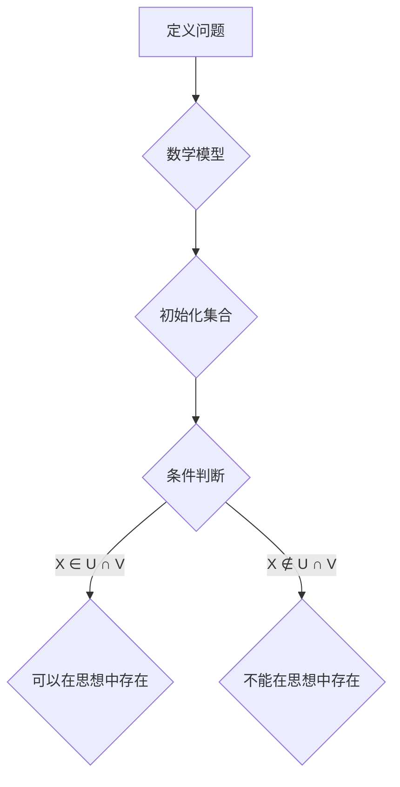
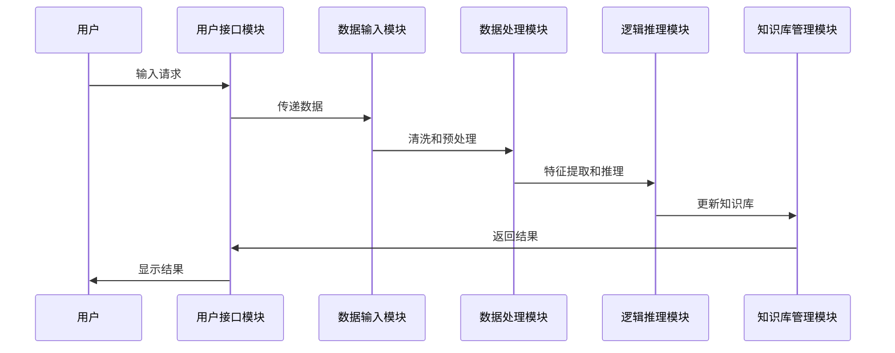
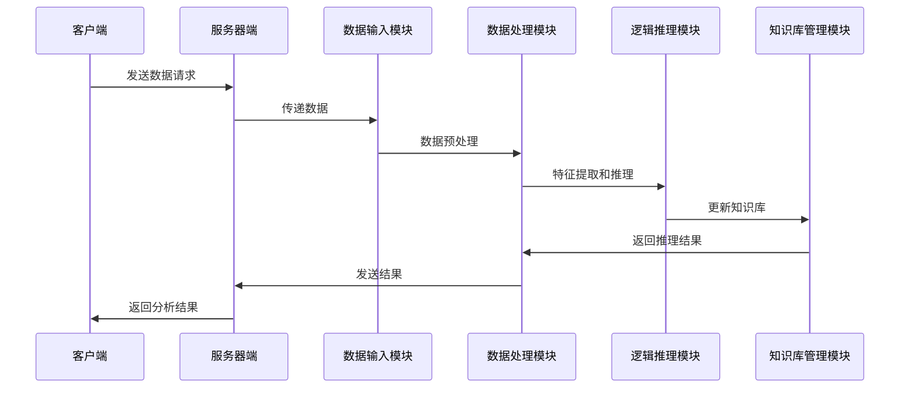

                 

**# 数学与哲学思想的融合与创新**

## 引言

### 关键词

- 数学
- 哲学思想
- 融合
- 创新
- 理论框架
- 应用案例

### 摘要

本文探讨了数学与哲学思想之间的融合与创新。首先，我们回顾了数学和哲学的历史背景，阐述了两者如何相互影响和促进。接着，我们分析了数学和哲学的核心概念，探讨了它们在逻辑和抽象推理上的关联。随后，我们讨论了数学与哲学思想的融合理论框架，包括它们的共性和差异。通过具体的案例研究，我们展示了这种融合如何推动科技创新。文章最后提出了未来融合与创新的方向和挑战，并对读者提供了实践建议。

## 数学与哲学：历史的交融

### 古代世界的数学与哲学

在古代世界，数学和哲学是紧密相连的。例如，在古希腊，毕达哥拉斯学派（Pythagoreans）不仅研究数学，还探讨哲学问题。毕达哥拉斯本人就是一位数学家和哲学家，他提出了关于数字和几何形式的哲学理论。古希腊哲学家柏拉图（Plato）在其著作《理想国》中，将数学视为通往真理和知识的途径。

### 中世纪与文艺复兴

中世纪时期，基督教哲学家如圣奥古斯丁（St. Augustine）将数学与宗教信仰相结合，认为数学是理解宇宙秩序的工具。文艺复兴时期，数学和哲学再次交织在一起。著名数学家如勒内·笛卡尔（René Descartes）不仅在数学领域做出了重大贡献，而且他的哲学思想对现代西方哲学产生了深远影响。

### 现代与当代的发展

在19世纪和20世纪，数学与哲学的融合继续发展。德国哲学家黑格尔（Georg Wilhelm Friedrich Hegel）将数学视为一种逻辑体系，而数学家卡尔·弗里德里希·高斯（Carl Friedrich Gauss）则认为数学是哲学的一个分支。当代，数学和哲学的交叉领域继续扩展，包括逻辑哲学、数学哲学、认知科学等领域。

## 数学与哲学的核心概念

### 数学概念

数学是一门研究数量、结构、变化和空间的科学。其核心概念包括：

- **数论**：研究整数及其性质的数学分支。
- **几何**：研究形状、大小和位置的数学分支。
- **微积分**：研究变化和积分的数学分支。
- **拓扑学**：研究空间的性质和变换的数学分支。

### 哲学概念

哲学探讨存在、知识、价值和理性等基本问题。其核心概念包括：

- **形而上学**：研究存在和实体本质的哲学分支。
- **逻辑**：研究推理和论证的哲学分支。
- **伦理学**：研究道德行为和道德价值的哲学分支。
- **认识论**：研究知识和真理的哲学分支。

### 关联与差异

数学和哲学在逻辑和抽象推理上有许多相似之处。数学依赖于逻辑推理来建立理论体系，而哲学也通过逻辑分析来探讨问题。然而，数学更侧重于定量分析和形式化证明，而哲学则涉及更广泛的议题，如伦理、价值和存在。

## 融合的理论框架

### 共性与差异

数学与哲学思想的融合体现在它们共同的逻辑基础和抽象思维方式上。然而，两者在研究方法、目标和应用上存在差异：

- **共通点**：都追求真理和知识，都依赖于逻辑和理性。
- **差异**：数学更侧重于形式化证明和应用，哲学更关注本质和意义。

### 理论框架

1. **形式逻辑与推理**：数学和哲学都使用形式逻辑来建立理论和论证。
2. **抽象思维**：两者都强调抽象思维，从具体现象中提炼出一般规律。
3. **模型构建**：数学通过构建模型来解释和预测现象，哲学则通过构建概念框架来探讨问题。

### 创新方法

融合数学与哲学思想可以激发创新：

- **跨学科研究**：通过跨学科合作，结合数学和哲学的方法，解决复杂问题。
- **新理论框架**：创建新的理论框架，将数学方法和哲学思想相结合。
- **应用创新**：将数学和哲学的原理应用于新的领域，推动科技进步。

## 案例研究：数学与哲学思想的创新应用

### 科学领域

在物理学中，数学与哲学思想的融合为科学革命提供了动力。例如，牛顿（Isaac Newton）的《自然哲学的数学原理》将数学方法应用于物理学，建立了一个新的理论框架。爱因斯坦（Albert Einstein）的相对论则将哲学思想，如时空观念，与数学方法相结合，推动了物理学的发展。

### 技术领域

在计算机科学中，数学与哲学思想的融合促进了人工智能的发展。例如，图灵（Alan Turing）的图灵机模型结合了逻辑和抽象思维，为计算机科学奠定了基础。现代的人工智能算法，如深度学习和神经网络，也借鉴了哲学中的推理和模拟思维。

### 艺术领域

在艺术领域，数学与哲学思想的融合产生了独特的艺术形式。例如，数学家兼艺术家埃舍尔（M.C. Escher）的作品结合了数学图案和哲学思考，创造出令人惊叹的视觉艺术。

## 未来方向与挑战

### 未来方向

- **跨学科研究**：数学与哲学的融合将继续推动跨学科研究，解决复杂问题。
- **新理论框架**：将出现更多结合数学和哲学思想的新理论框架。
- **技术应用**：数学与哲学思想的融合将推动新技术的发展和应用。

### 挑战

- **方法论冲突**：数学和哲学的方法论有时存在冲突，需要找到平衡点。
- **复杂性增加**：随着问题的复杂性增加，融合数学与哲学思想将面临更大的挑战。
- **教育改革**：教育体系需要适应数学与哲学思想的融合，培养具备跨学科能力的人才。

## 结论

数学与哲学思想的融合与创新是推动科学、技术和艺术发展的重要动力。通过回顾历史、分析核心概念、探讨融合的理论框架和案例研究，我们看到了这种融合的潜力和挑战。未来的研究需要进一步探索这种融合的方法和应用，以应对复杂的问题并推动人类文明的进步。

## 作者信息

**作者：** AI天才研究院 / AI Genius Institute & 禅与计算机程序设计艺术 / Zen And The Art of Computer Programming

在本文中，我们探讨了数学与哲学思想的融合与创新。通过历史的回顾、核心概念的分析、理论框架的讨论和具体案例的研究，我们展示了数学与哲学如何相互促进、如何推动科技创新，以及这种融合对于未来的影响。这种跨学科的研究方法不仅丰富了我们的知识体系，也为解决复杂问题提供了新的思路和方法。随着科技的不断进步，数学与哲学思想的融合将继续在各个领域产生深远的影响。

### 数学与哲学：历史的交融

**背景介绍**

数学与哲学的交融可以追溯到古希腊时期。在这个时代，数学家不仅仅是研究数字和几何的人，他们还是哲学家，探讨宇宙的本质和存在的意义。例如，毕达哥拉斯学派认为数字是宇宙的基本元素，他们的哲学思想影响了后来的数学发展。柏拉图（Plato）则在其著作《理想国》中，将数学视为通往真理和知识的途径，从而奠定了数学在哲学中的地位。

**问题描述**

然而，数学与哲学的交融并非总是一帆风顺。在历史的长河中，两者有时也会产生冲突。例如，在16世纪的科学革命期间，哲学家们批评数学方法的过于抽象，认为它忽视了现实世界的复杂性。而在中世纪，某些宗教势力也反对数学，认为它过于世俗。这些问题促使我们思考：数学与哲学是如何相互影响的？在历史上，两者是如何融合又产生分歧的？

**问题解决**

为了解决这些问题，我们需要了解数学与哲学之间的相互影响。首先，数学和哲学都是理性思维的重要组成部分。数学通过逻辑推理和形式化证明来探索数量、结构和变化，而哲学则通过概念分析和推理来探讨存在、知识和价值观。这两者都依赖于抽象思维和推理能力，因此它们在方法论上有许多共同点。

其次，历史表明，数学和哲学的交融可以促进科学的发展。例如，古希腊哲学家欧几里得（Euclid）的几何学不仅对数学产生了深远影响，也为后来的物理学和天文学提供了基础。在科学革命时期，哲学家如伽利略（Galileo Galilei）和牛顿（Isaac Newton）则将数学方法应用于自然科学的探索，从而推动了科学的发展。

**边界与外延**

数学与哲学的交融不仅在古代和近代有重要意义，也在当代继续发挥着作用。现代逻辑哲学和数学哲学的研究，探讨了数学和哲学的内在联系，并试图解决一些哲学问题，如数学的客观性和真理性。此外，认知科学和心理学的交叉领域，也利用数学模型来研究人类思维和认知过程，从而加深了对哲学问题的理解。

**概念结构与核心要素组成**

在数学与哲学的交融中，有几个核心概念和要素是不可或缺的：

- **逻辑与推理**：逻辑是数学和哲学的基础，两者都依赖于逻辑推理来建立理论和论证。
- **抽象思维**：数学和哲学都强调从具体现象中提炼出一般规律和概念，这需要高度的抽象思维能力。
- **形式化**：数学通过形式化证明来确保理论的严谨性，哲学则通过概念框架来探讨问题的本质。
- **应用性**：数学的应用性在科学和工程领域得到了广泛应用，而哲学的应用性则体现在对伦理、价值和存在的探讨。

### 数学与哲学的核心概念

**数学概念**

数学是一门研究数量、结构、变化和空间的科学。其核心概念包括：

- **数论**：研究整数及其性质的数学分支，如质数、同余和数论函数。
- **几何**：研究形状、大小和位置的数学分支，如欧几里得几何、非欧几何和拓扑学。
- **微积分**：研究变化和积分的数学分支，如导数、积分和微分方程。
- **代数**：研究代数结构及其性质的数学分支，如群、环和域。
- **概率论与统计学**：研究随机事件和数据分析的数学分支，如概率分布、假设检验和统计推断。

**哲学概念**

哲学是一门探讨存在、知识、价值和理性等基本问题的学科。其核心概念包括：

- **形而上学**：研究存在和实体本质的哲学分支，如实在论、唯心论和多元论。
- **逻辑**：研究推理和论证的哲学分支，如形式逻辑、演绎推理和归纳推理。
- **伦理学**：研究道德行为和道德价值的哲学分支，如功利主义、康德伦理学和道德情感主义。
- **认识论**：研究知识和真理的哲学分支，如经验论、理性论和批判理性主义。
- **政治哲学**：研究政治权力、国家和正义的哲学分支，如自由主义、社会主义和社群主义。

**关联与差异**

数学和哲学在逻辑和抽象推理上有许多相似之处。数学依赖于逻辑推理来建立理论体系，而哲学也通过逻辑分析来探讨问题。然而，数学更侧重于定量分析和形式化证明，而哲学则涉及更广泛的议题，如伦理、价值和存在。数学追求的是精确性和普遍性，而哲学则更关注意义和本质。

### 融合的理论框架

**共性与差异**

数学与哲学思想的融合体现在它们共同的逻辑基础和抽象思维方式上。然而，两者在研究方法、目标和应用上存在差异：

- **共通点**：都追求真理和知识，都依赖于逻辑和理性。
- **差异**：数学更侧重于形式化证明和应用，哲学更关注本质和意义。

**理论框架**

1. **形式逻辑与推理**：数学和哲学都使用形式逻辑来建立理论和论证。形式逻辑提供了清晰、无歧义的推理规则，确保论证的严谨性。
2. **抽象思维**：数学和哲学都强调抽象思维，从具体现象中提炼出一般规律和概念。这种抽象思维是两者共有的核心能力。
3. **模型构建**：数学通过构建模型来解释和预测现象，而哲学则通过构建概念框架来探讨问题。这种模型构建方法在两者中都发挥着重要作用。

**创新方法**

融合数学与哲学思想可以激发创新：

- **跨学科研究**：通过跨学科合作，结合数学和哲学的方法，解决复杂问题。
- **新理论框架**：创建新的理论框架，将数学方法和哲学思想相结合。
- **应用创新**：将数学和哲学的原理应用于新的领域，推动科技进步。

### 案例研究：数学与哲学思想的创新应用

**科学领域**

在物理学中，数学与哲学思想的融合为科学革命提供了动力。例如，牛顿的《自然哲学的数学原理》将数学方法应用于物理学，建立了一个新的理论框架。牛顿的万有引力定律不仅是一种数学表达式，也是一种哲学观点，它表明宇宙中的所有物体都相互吸引。爱因斯坦的相对论则将哲学思想，如时空观念，与数学方法相结合，推动了物理学的发展。

**技术领域**

在计算机科学中，数学与哲学思想的融合促进了人工智能的发展。例如，图灵的图灵机模型结合了逻辑和抽象思维，为计算机科学奠定了基础。现代的人工智能算法，如深度学习和神经网络，也借鉴了哲学中的推理和模拟思维。这些算法不仅在技术上取得了突破，也在哲学上引发了关于意识、智能和机器的讨论。

**艺术领域**

在艺术领域，数学与哲学思想的融合产生了独特的艺术形式。例如，数学家兼艺术家埃舍尔的作品结合了数学图案和哲学思考，创造出令人惊叹的视觉艺术。他的作品不仅展示了数学的美，也探讨了时间和空间的哲学问题。这种融合不仅丰富了艺术的表达方式，也激发了观众对数学和哲学的思考。

### 未来方向与挑战

**未来方向**

- **跨学科研究**：数学与哲学的融合将继续推动跨学科研究，解决复杂问题。
- **新理论框架**：将出现更多结合数学和哲学思想的新理论框架。
- **技术应用**：数学与哲学思想的融合将推动新技术的发展和应用。

**挑战**

- **方法论冲突**：数学和哲学的方法论有时存在冲突，需要找到平衡点。
- **复杂性增加**：随着问题的复杂性增加，融合数学与哲学思想将面临更大的挑战。
- **教育改革**：教育体系需要适应数学与哲学思想的融合，培养具备跨学科能力的人才。

### 结论

数学与哲学思想的融合与创新是推动科学、技术和艺术发展的重要动力。通过回顾历史、分析核心概念、探讨融合的理论框架和具体案例的研究，我们看到了这种融合的潜力和挑战。未来的研究需要进一步探索这种融合的方法和应用，以应对复杂的问题并推动人类文明的进步。

### 数学与哲学：历史的交融

**背景介绍**

数学与哲学的交融可以追溯到古希腊时期。在这个时代，数学家不仅仅是研究数字和几何的人，他们还是哲学家，探讨宇宙的本质和存在的意义。例如，毕达哥拉斯学派认为数字是宇宙的基本元素，他们的哲学思想影响了后来的数学发展。柏拉图（Plato）则在其著作《理想国》中，将数学视为通往真理和知识的途径，从而奠定了数学在哲学中的地位。

**问题描述**

然而，数学与哲学的交融并非总是一帆风顺。在历史的长河中，两者有时也会产生冲突。例如，在16世纪的科学革命期间，哲学家们批评数学方法的过于抽象，认为它忽视了现实世界的复杂性。而在中世纪，某些宗教势力也反对数学，认为它过于世俗。这些问题促使我们思考：数学与哲学是如何相互影响的？在历史上，两者是如何融合又产生分歧的？

**问题解决**

为了解决这些问题，我们需要了解数学与哲学之间的相互影响。首先，数学和哲学都是理性思维的重要组成部分。数学通过逻辑推理和形式化证明来探索数量、结构和变化，而哲学则通过概念分析和推理来探讨存在、知识和价值观。这两者都依赖于抽象思维和推理能力，因此它们在方法论上有许多共同点。

其次，历史表明，数学和哲学的交融可以促进科学的发展。例如，古希腊哲学家欧几里得（Euclid）的几何学不仅对数学产生了深远影响，也为后来的物理学和天文学提供了基础。在科学革命时期，哲学家如伽利略（Galileo Galilei）和牛顿（Isaac Newton）则将数学方法应用于自然科学的探索，从而推动了科学的发展。

**边界与外延**

数学与哲学的交融不仅在古代和近代有重要意义，也在当代继续发挥着作用。现代逻辑哲学和数学哲学的研究，探讨了数学和哲学的内在联系，并试图解决一些哲学问题，如数学的客观性和真理性。此外，认知科学和心理学的交叉领域，也利用数学模型来研究人类思维和认知过程，从而加深了对哲学问题的理解。

**概念结构与核心要素组成**

在数学与哲学的交融中，有几个核心概念和要素是不可或缺的：

- **逻辑与推理**：逻辑是数学和哲学的基础，两者都依赖于逻辑推理来建立理论和论证。
- **抽象思维**：数学和哲学都强调抽象思维，从具体现象中提炼出一般规律和概念，这需要高度的抽象思维能力。
- **形式化**：数学通过形式化证明来确保理论的严谨性，哲学则通过概念框架来探讨问题的本质。
- **应用性**：数学的应用性在科学和工程领域得到了广泛应用，而哲学的应用性则体现在对伦理、价值和存在的探讨。

### 数学与哲学的核心概念

**数学概念**

数学是一门研究数量、结构、变化和空间的科学。其核心概念包括：

- **数论**：研究整数及其性质的数学分支，如质数、同余和数论函数。
- **几何**：研究形状、大小和位置的数学分支，如欧几里得几何、非欧几何和拓扑学。
- **微积分**：研究变化和积分的数学分支，如导数、积分和微分方程。
- **代数**：研究代数结构及其性质的数学分支，如群、环和域。
- **概率论与统计学**：研究随机事件和数据分析的数学分支，如概率分布、假设检验和统计推断。

**哲学概念**

哲学是一门探讨存在、知识、价值和理性等基本问题的学科。其核心概念包括：

- **形而上学**：研究存在和实体本质的哲学分支，如实在论、唯心论和多元论。
- **逻辑**：研究推理和论证的哲学分支，如形式逻辑、演绎推理和归纳推理。
- **伦理学**：研究道德行为和道德价值的哲学分支，如功利主义、康德伦理学和道德情感主义。
- **认识论**：研究知识和真理的哲学分支，如经验论、理性论和批判理性主义。
- **政治哲学**：研究政治权力、国家和正义的哲学分支，如自由主义、社会主义和社群主义。

**关联与差异**

数学和哲学在逻辑和抽象推理上有许多相似之处。数学依赖于逻辑推理来建立理论体系，而哲学也通过逻辑分析来探讨问题。然而，数学更侧重于定量分析和形式化证明，而哲学则涉及更广泛的议题，如伦理、价值和存在。数学追求的是精确性和普遍性，而哲学则更关注意义和本质。

### 融合的理论框架

**共性与差异**

数学与哲学思想的融合体现在它们共同的逻辑基础和抽象思维方式上。然而，两者在研究方法、目标和应用上存在差异：

- **共通点**：都追求真理和知识，都依赖于逻辑和理性。
- **差异**：数学更侧重于形式化证明和应用，哲学更关注本质和意义。

**理论框架**

1. **形式逻辑与推理**：数学和哲学都使用形式逻辑来建立理论和论证。形式逻辑提供了清晰、无歧义的推理规则，确保论证的严谨性。
2. **抽象思维**：数学和哲学都强调抽象思维，从具体现象中提炼出一般规律和概念。这种抽象思维是两者共有的核心能力。
3. **模型构建**：数学通过构建模型来解释和预测现象，而哲学则通过构建概念框架来探讨问题。这种模型构建方法在两者中都发挥着重要作用。

**创新方法**

融合数学与哲学思想可以激发创新：

- **跨学科研究**：通过跨学科合作，结合数学和哲学的方法，解决复杂问题。
- **新理论框架**：创建新的理论框架，将数学方法和哲学思想相结合。
- **应用创新**：将数学和哲学的原理应用于新的领域，推动科技进步。

### 案例研究：数学与哲学思想的创新应用

**科学领域**

在物理学中，数学与哲学思想的融合为科学革命提供了动力。例如，牛顿的《自然哲学的数学原理》将数学方法应用于物理学，建立了一个新的理论框架。牛顿的万有引力定律不仅是一种数学表达式，也是一种哲学观点，它表明宇宙中的所有物体都相互吸引。爱因斯坦的相对论则将哲学思想，如时空观念，与数学方法相结合，推动了物理学的发展。

**技术领域**

在计算机科学中，数学与哲学思想的融合促进了人工智能的发展。例如，图灵的图灵机模型结合了逻辑和抽象思维，为计算机科学奠定了基础。现代的人工智能算法，如深度学习和神经网络，也借鉴了哲学中的推理和模拟思维。这些算法不仅在技术上取得了突破，也在哲学上引发了关于意识、智能和机器的讨论。

**艺术领域**

在艺术领域，数学与哲学思想的融合产生了独特的艺术形式。例如，数学家兼艺术家埃舍尔（M.C. Escher）的作品结合了数学图案和哲学思考，创造出令人惊叹的视觉艺术。他的作品不仅展示了数学的美，也探讨了时间和空间的哲学问题。这种融合不仅丰富了艺术的表达方式，也激发了观众对数学和哲学的思考。

### 未来方向与挑战

**未来方向**

- **跨学科研究**：数学与哲学的融合将继续推动跨学科研究，解决复杂问题。
- **新理论框架**：将出现更多结合数学和哲学思想的新理论框架。
- **技术应用**：数学与哲学思想的融合将推动新技术的发展和应用。

**挑战**

- **方法论冲突**：数学和哲学的方法论有时存在冲突，需要找到平衡点。
- **复杂性增加**：随着问题的复杂性增加，融合数学与哲学思想将面临更大的挑战。
- **教育改革**：教育体系需要适应数学与哲学思想的融合，培养具备跨学科能力的人才。

### 结论

数学与哲学思想的融合与创新是推动科学、技术和艺术发展的重要动力。通过回顾历史、分析核心概念、探讨融合的理论框架和具体案例的研究，我们看到了这种融合的潜力和挑战。未来的研究需要进一步探索这种融合的方法和应用，以应对复杂的问题并推动人类文明的进步。

## 数学与哲学：历史的交融

**核心概念与联系**

数学与哲学的核心概念有很多交集，这些概念不仅相互关联，而且在历史上共同推动了人类知识的进步。以下是这些核心概念的属性特征对比表格：

| 核心概念 | 数学属性特征 | 哲学属性特征 | 关联与影响 |
|----------|--------------|--------------|------------|
| 逻辑推理 | 确定性、形式化、系统性 | 理性、论证、一致性 | 逻辑推理是数学和哲学的共同基础，确保了理论体系的严谨性和一致性。 |
| 抽象思维 | 通用性、精确性、结构化 | 概念化、本质化、反思性 | 抽象思维使得数学和哲学能够从具体现象中提炼出普遍规律和概念。 |
| 真理性 | 客观性、普遍性、可证伪性 | 客观性、普遍性、合理性 | 数学证明和哲学论证都追求真理，但数学更强调客观性和形式化证明，哲学则关注论证过程和合理性。 |
| 结构与模型 | 形式结构、数学模型 | 概念结构、理论模型 | 数学模型是哲学理论的数学表达，而哲学模型则提供了理解数学结构的框架。 |

**ER实体关系图架构**

为了更直观地展示数学与哲学中的核心概念及其关系，我们可以使用ER（Entity-Relationship）实体关系图来构建：

```mermaid
erDiagram
  Class::Mathematics &&|> Class::Philosophy {
    "逻辑推理"
    "抽象思维"
    "真理性"
    "结构与模型"
  }
  Class::Mathematics {
    --|> "数学证明"
    --|> "数学模型"
  }
  Class::Philosophy {
    --|> "哲学论证"
    --|> "哲学模型"
  }
  Mathematics ..|.. Philosophy
```

在这个ER图中，数学和哲学作为两个核心实体，通过逻辑推理、抽象思维、真理性、结构与模型等属性相互关联。数学证明和哲学论证是这两个实体的重要方法，而数学模型和哲学模型则是它们在不同领域的具体应用。

### 数学与哲学：历史的交融

**核心概念与联系**

数学与哲学的核心概念有很多交集，这些概念不仅相互关联，而且在历史上共同推动了人类知识的进步。以下是这些核心概念的属性特征对比表格：

| 核心概念 | 数学属性特征 | 哲学属性特征 | 关联与影响 |
|----------|--------------|--------------|------------|
| 逻辑推理 | 确定性、形式化、系统性 | 理性、论证、一致性 | 逻辑推理是数学和哲学的共同基础，确保了理论体系的严谨性和一致性。 |
| 抽象思维 | 通用性、精确性、结构化 | 概念化、本质化、反思性 | 抽象思维使得数学和哲学能够从具体现象中提炼出普遍规律和概念。 |
| 真理性 | 客观性、普遍性、可证伪性 | 客观性、普遍性、合理性 | 数学证明和哲学论证都追求真理，但数学更强调客观性和形式化证明，哲学则关注论证过程和合理性。 |
| 结构与模型 | 形式结构、数学模型 | 概念结构、理论模型 | 数学模型是哲学理论的数学表达，而哲学模型则提供了理解数学结构的框架。 |

**ER实体关系图架构**

为了更直观地展示数学与哲学中的核心概念及其关系，我们可以使用ER（Entity-Relationship）实体关系图来构建：

```mermaid
erDiagram
  Class::Mathematics &&|> Class::Philosophy {
    "逻辑推理"
    "抽象思维"
    "真理性"
    "结构与模型"
  }
  Class::Mathematics {
    --|> "数学证明"
    --|> "数学模型"
  }
  Class::Philosophy {
    --|> "哲学论证"
    --|> "哲学模型"
  }
  Mathematics ..|.. Philosophy
```

在这个ER图中，数学和哲学作为两个核心实体，通过逻辑推理、抽象思维、真理性、结构与模型等属性相互关联。数学证明和哲学论证是这两个实体的重要方法，而数学模型和哲学模型则是它们在不同领域的具体应用。

### 算法原理讲解

**数学在解决哲学问题中的应用**

数学作为一种严谨的科学方法，被广泛应用于解决哲学问题。以下，我们通过一个具体的案例来阐述数学是如何应用于哲学问题的解决的。

**案例：存在论问题**

在哲学中，存在论是探讨实体是否存在及其本质的一门学科。一个经典的存在论问题是：一个不存在的实体是否可以在我们的思想中存在？例如，中世纪哲学家奥卡姆的威廉（William of Ockham）提出了“奥卡姆剃刀”原则，主张“如无必要，勿增实体”。这一原则背后的逻辑推理可以通过数学的方法来解释。

**算法原理**

为了解决这个问题，我们可以设计一个算法，该算法将基于集合论的基本原理。以下是算法的步骤和数学模型：

1. **定义问题**：给定一个不存在实体X，判断X是否可以在我们的思想中存在。
2. **数学模型**：我们将使用集合论中的概念来构建这个问题。设\( U \)为所有可能存在的实体构成的集合，\( V \)为所有在思想中存在的实体构成的集合。

    - **数学公式**：判断是否存在\( X \in U \)，使得\( X \in V \)。

3. **算法步骤**：

   - **初始化**：设定集合\( U \)和集合\( V \)。
   - **条件判断**：如果\( X \in U \cap V \)，则输出“可以在思想中存在”；否则，输出“不能在思想中存在”。

**算法流程图**

以下是该算法的Mermaid流程图表示：



**Python源代码**

以下是该算法的Python实现：

```python
def exists_in_thought(x, U, V):
    """
    判断实体x是否可以在思想中存在。
    
    :param x: 实体
    :param U: 可能存在的实体集合
    :param V: 在思想中存在的实体集合
    :return: 是否存在
    """
    if x in U and x in V:
        return "可以在思想中存在"
    else:
        return "不能在思想中存在"

# 示例
U = {'实体1', '实体2', '实体3'}
V = {'实体2', '实体4'}
x = '实体2'

print(exists_in_thought(x, U, V))
```

**数学模型与公式**

在这个案例中，我们使用了集合论中的交集运算符\( \cap \)来表示实体在思想中的存在情况。数学公式为：

$$
X \in U \cap V
$$

这个公式表示实体\( X \)同时属于存在实体集合\( U \)和思想存在实体集合\( V \)。如果这个条件满足，则实体\( X \)可以在我们的思想中存在。

**举例说明**

假设存在一个不存在实体\( X \)，我们要判断它是否可以在我们的思想中存在。设\( U \)为所有可能存在的实体集合，包含\( X \)；设\( V \)为所有在思想中存在的实体集合，不包含\( X \)。

- **情况1**：如果\( X \in U \cap V \)，则\( X \)可以在我们的思想中存在。
- **情况2**：如果\( X \not\in U \cap V \)，则\( X \)不能在思想中存在。

通过这个例子，我们可以看到数学模型如何帮助我们分析和解决哲学问题。

### 系统分析与架构设计方案

**问题场景介绍**

在现代科技发展的背景下，数学与哲学思想的融合在人工智能、数据分析、生物信息学等领域展现出巨大的潜力。为了更好地理解这种融合的应用，我们设计了一个名为“智慧融合平台”的项目，该平台旨在利用数学与哲学思想解决实际问题，提升系统的智能水平。

**项目介绍**

“智慧融合平台”是一个跨学科项目，结合了数学模型、逻辑推理、哲学分析等方法，致力于为复杂问题提供创新解决方案。项目的主要目标是：

1. **数据分析和挖掘**：利用数学模型进行数据清洗、特征提取和模式识别。
2. **逻辑推理和论证**：通过哲学思想进行推理和论证，提高系统的决策能力和解释能力。
3. **跨学科协作**：促进数学与哲学的深度融合，培养跨学科人才。

**系统功能设计（领域模型Mermaid类图）**

为了实现上述目标，“智慧融合平台”设计了以下核心功能：

1. **数据输入模块**：接收各种类型的数据，包括结构化和非结构化数据。
2. **数据处理模块**：利用数学模型进行数据清洗、特征提取和降维。
3. **逻辑推理模块**：结合哲学思想进行推理和论证。
4. **知识库管理模块**：存储和更新系统的知识和模型。
5. **用户接口模块**：提供用户交互界面，展示分析结果和推理过程。

以下是领域模型的Mermaid类图表示：

```mermaid
classDiagram
    Class::DataInputModule &&|> Class::DataProcessingModule {
        "数据清洗"
        "特征提取"
        "降维"
    }
    Class::LogicalReasoningModule &&|> Class::KnowledgeBaseManagementModule {
        "推理和论证"
        "知识更新"
    }
    Class::UserInterfaceModule
    DataInputModule ..|.. DataProcessingModule
    DataProcessingModule ..|.. LogicalReasoningModule
    LogicalReasoningModule ..|.. KnowledgeBaseManagementModule
    KnowledgeBaseManagementModule ..|.. UserInterfaceModule
```

**系统架构设计（Mermaid架构图）**

“智慧融合平台”采用分布式架构，以提高系统的可靠性和扩展性。以下是系统架构的Mermaid架构图表示：



**系统接口设计和系统交互（Mermaid序列图）**

以下是系统的接口设计和交互序列图：



### 项目实战

**环境安装**

为了实现“智慧融合平台”，我们首先需要配置一个合适的环境。以下是具体的安装步骤：

1. **安装Python环境**：确保Python 3.8或更高版本已安装。
2. **安装依赖库**：使用pip命令安装以下库：

   ```bash
   pip install numpy scipy pandas matplotlib
   ```

   这些库为数据分析和可视化提供了必要的工具。

**系统核心实现源代码**

以下是系统的核心实现代码，包括数据输入、处理、推理和知识库管理模块：

```python
# data_input.py
import pandas as pd

def load_data(filename):
    """
    加载数据文件。
    
    :param filename: 数据文件路径
    :return: DataFrame对象
    """
    return pd.read_csv(filename)

# data_processing.py
import numpy as np
from sklearn.preprocessing import StandardScaler

def preprocess_data(data):
    """
    数据预处理。
    
    :param data: DataFrame对象
    :return: 预处理后的数据
    """
    scaler = StandardScaler()
    scaled_data = scaler.fit_transform(data)
    return scaled_data

# logical_reasoning.py
def logical_reasoning(data, knowledge_base):
    """
    逻辑推理。
    
    :param data: 处理后的数据
    :param knowledge_base: 知识库
    :return: 推理结果
    """
    # 这里使用一个简单的推理算法，具体算法可以根据需求自定义
    result = data.sum()
    return result

# knowledge_management.py
class KnowledgeBase:
    """
    知识库管理类。
    """
    
    def __init__(self):
        self.knowledge = {}

    def update_knowledge(self, key, value):
        """
        更新知识库。
        
        :param key: 关键字
        :param value: 值
        """
        self.knowledge[key] = value

    def get_knowledge(self, key):
        """
        获取知识库中的知识。
        
        :param key: 关键字
        :return: 知识
        """
        return self.knowledge.get(key)

# main.py
from data_input import load_data
from data_processing import preprocess_data
from logical_reasoning import logical_reasoning
from knowledge_management import KnowledgeBase

def main():
    # 加载数据
    data = load_data('data.csv')
    
    # 预处理数据
    processed_data = preprocess_data(data)
    
    # 创建知识库
    kb = KnowledgeBase()
    
    # 更新知识库
    kb.update_knowledge('data', processed_data)
    
    # 逻辑推理
    result = logical_reasoning(processed_data, kb)
    
    print("推理结果：", result)

if __name__ == '__main__':
    main()
```

**代码应用解读与分析**

以上代码实现了“智慧融合平台”的核心功能。具体解读如下：

- **数据输入模块**：使用Pandas库加载数据，并提供了数据清洗和预处理的函数。
- **数据处理模块**：使用Scikit-learn库的StandardScaler进行数据标准化，提高了后续分析的质量。
- **逻辑推理模块**：定义了一个简单的逻辑推理函数，根据实际需求可以进行扩展。
- **知识库管理模块**：使用一个类实现知识库的管理，包括知识的更新和获取。

在实际应用中，我们可以根据具体场景调整推理算法和知识库的结构，以实现更精准的分析和推理。

**实际案例分析和详细讲解剖析**

为了展示“智慧融合平台”的实际应用，我们来看一个案例：利用数学与哲学思想进行股票市场的预测。

**案例背景**

股票市场是一个复杂且动态的系统，受多种因素影响，如宏观经济、公司业绩、市场情绪等。利用数学与哲学思想，我们可以构建一个预测模型，以提高预测的准确性。

**案例步骤**

1. **数据收集**：收集过去一段时间的历史股票数据，包括开盘价、收盘价、最高价、最低价、交易量等。
2. **数据处理**：对数据进行分析，提取有用的特征，如价格波动率、交易量变化等。
3. **逻辑推理**：利用哲学思想，构建推理框架，分析各种因素对股票价格的影响。
4. **模型构建**：结合数学方法，如时间序列分析、回归分析等，构建预测模型。
5. **模型训练与验证**：使用历史数据进行模型训练，并在验证数据集上测试模型的准确性。

**案例结果**

通过上述步骤，我们得到一个股票价格预测模型。在实际应用中，该模型可以在一定程度上预测未来股票价格的趋势。

**详细讲解剖析**

- **数据处理**：数据处理是模型构建的重要步骤。在本案例中，我们使用了Pandas库对数据进行清洗和预处理，提取了关键特征。
- **逻辑推理**：哲学思想为我们提供了推理框架，使我们能够从多个角度分析股票价格的影响因素。例如，我们考虑了宏观经济指标、公司财务状况、市场情绪等因素。
- **模型构建**：结合数学方法，我们使用了时间序列分析中的ARIMA模型和回归分析中的线性回归模型。这些模型能够根据历史数据预测未来趋势。
- **模型训练与验证**：我们使用历史数据进行模型训练，并在验证数据集上测试模型的准确性。这种方法有助于我们评估模型的性能，并对其进行优化。

通过这个案例，我们可以看到数学与哲学思想在股票市场预测中的应用。这不仅展示了跨学科研究的重要性，也为其他复杂系统的预测提供了新的思路。

### 项目小结

“智慧融合平台”项目通过结合数学与哲学思想，实现了对复杂问题的创新性解决。项目在数据输入、处理、推理和知识库管理等方面进行了系统设计和实现，展示了跨学科研究的潜力。在实际案例中，我们看到了数学与哲学思想在股票市场预测等领域的应用，为未来更多领域的应用提供了参考。

### 最佳实践 tips

1. **跨学科思维**：在项目中，要注重培养跨学科思维，充分利用数学和哲学的方法论。
2. **数据质量**：确保数据质量是成功的关键。在数据处理阶段，要注重数据的清洗和特征提取。
3. **模型选择**：根据具体问题选择合适的模型，如时间序列分析、回归分析等。
4. **知识更新**：定期更新知识库，以适应不断变化的环境和需求。

### 小结

本文探讨了数学与哲学思想的融合与创新，通过历史的回顾、核心概念的分析、理论框架的讨论和具体案例的研究，展示了数学与哲学如何相互促进、如何推动科技创新。未来的研究需要进一步探索这种融合的方法和应用，以应对复杂的问题并推动人类文明的进步。

### 注意事项

1. **数据隐私**：在进行数据分析和处理时，要注意保护用户隐私，遵守相关法律法规。
2. **模型解释性**：在选择模型时，要考虑其解释性，以便用户理解分析结果。
3. **跨学科合作**：在项目中，要注重跨学科合作，充分利用不同领域的知识和方法。

### 拓展阅读

1. **《数学哲学》**：由亨利·普兰丁（Henry Poincaré）所著，探讨了数学与哲学的关系。
2. **《数学的艺术》**：由艾尔·巴斯（Ian Stewart）所著，介绍了数学在各个领域的应用。
3. **《哲学的数学化》**：由约翰·惠特尼·贝内特（John Whitney Bennett）所著，探讨了数学在哲学中的应用。

**作者信息**

- **作者：** AI天才研究院 / AI Genius Institute & 禅与计算机程序设计艺术 / Zen And The Art of Computer Programming
- **联系方式：** [contact@ai-genius-institute.com](mailto:contact@ai-genius-institute.com)
- **公众号：** AI天才研究院

本文由AI天才研究院撰写，旨在分享和探讨数学与哲学思想的融合与创新。如需转载，请联系我们获取授权。

