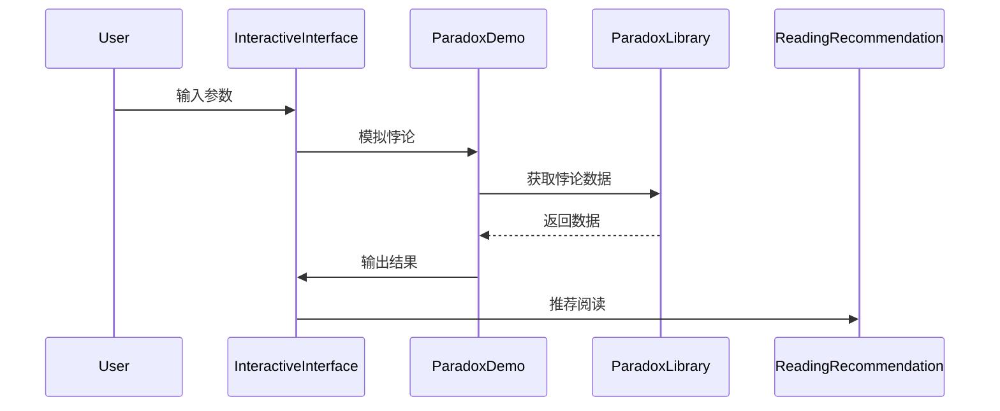
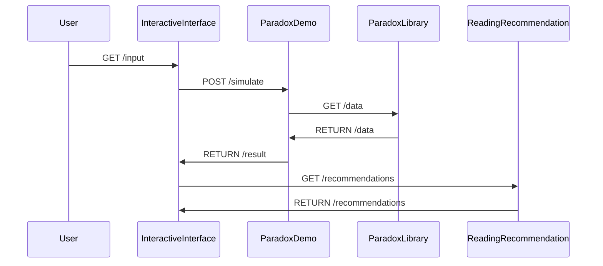

                 

## 前言

数学与哲学，两座智慧的高峰，它们以各自独特的方式探索着世界的本质。在这两者之间，悖论是一种奇妙的桥梁，它不仅挑战了我们的直觉，也促使我们对基本概念进行深入反思。数学悖论，如克里特岛悖论、累加悖论，和哲学悖论，如智者悖论、缸中之脑，构成了这一领域的迷人风景线。

本文旨在探讨数学与哲学悖论的深度解释与分析。我们将逐一审视这些悖论，揭示其背后的逻辑陷阱，理解其对我们认知的挑战，并尝试找到解决之道。文章将从以下几个部分展开：

1. **数学与哲学悖论基础**：介绍数学悖论和哲学悖论的基本概念，并对比分析其属性特征。
2. **数学模型与算法讲解**：通过具体的数学模型与算法，探讨这些悖论的形成机制。
3. **系统分析与架构设计**：模拟一个实际项目，展示如何应用这些悖论。
4. **项目实战**：通过具体的项目实战，深入解读并应用相关技术。
5. **最佳实践与拓展**：总结最佳实践，并提供拓展阅读。

通过本文的逐步解析，我们希望读者能够更好地理解数学与哲学悖论，并在日常思考中掌握这些复杂的逻辑结构。

### 第1章 数学与哲学悖论基础

### 1.1 问题背景与定义

悖论（Paradox）一词源自希腊语“para-doxos”，意为“对立的思考”。悖论是指那些表面上自相矛盾，但经过深入分析后却表现出深刻真理的陈述或命题。在数学与哲学领域，悖论不仅是一种逻辑现象，更是对这些领域基本假设和理论的挑战。

**数学悖论**：数学悖论是指在数学理论和证明过程中出现的自相矛盾的情况。著名的数学悖论包括克里特岛悖论、累加悖论和康托尔悖论。这些悖论揭示了数学系统中的缺陷和局限性，促使数学家不断寻求更严密的理论基础。

**哲学悖论**：哲学悖论是哲学思考中出现的自我矛盾的命题，它们通常用来质疑某些哲学观点或探讨人类认知的边界。常见的哲学悖论包括智者悖论、缸中之脑和疑兵之计悖论。

### 1.2 核心概念

#### 1.2.1 数学悖论

**1.2.1.1 辗转悖论**

辗转悖论（Agrippa's Trilemma）由古罗马哲学家塞涅卡提出，它指出：任何一个知识系统都面临三个问题：
1. **基础问题**：系统的基础是否可靠？
2. **证明问题**：如何证明基础？
3. **一致性问题**：如何证明所有命题之间的一致性？

这个悖论揭示了知识系统内在的矛盾，因为任何一个试图回答这些问题的系统都会陷入自相矛盾的境地。

**1.2.1.2 累加悖论**

累加悖论是关于无穷序列和无穷和的悖论。一个典型的例子是悖论性的无穷和：1 - 1 + 1 - 1 + ...，这个序列的和看起来既等于0，也等于1/2，从而产生了矛盾。

**1.2.1.3 康托尔悖论**

康托尔悖论是由数学家康托尔提出的，它揭示了集合论中的矛盾。一个常见的例子是“理发师悖论”，即一个理发师只为不给自己理发的人理发，那么他是否要给自己理发？

#### 1.2.2 哲学悖论

**1.2.2.1 智者悖论**

智者悖论（Sophist Paradox）是由古希腊哲学家普罗塔戈拉提出的，它指出“我了解一无所知”。这个悖论揭示了知识的不确定性和相对性。

**1.2.2.2 疑兵之计悖论**

疑兵之计悖论（Pyrrhonian Paradox）是由古希腊哲学家皮浪提出的，它指出：如果一切都是相对的，那么任何知识都不可靠。

**1.2.2.3 坎伯斯悖论**

坎伯斯悖论（Campesato Paradox）是由中世纪哲学家坎伯斯提出的，它涉及无穷序列和无穷和的问题，类似于累加悖论。

### 1.3 概念属性特征对比

| **悖论类型** | **数学悖论** | **哲学悖论** |
| :--: | :--: | :--: |
| **定义** | 在数学证明或理论中出现的自相矛盾的陈述或命题。 | 在哲学思考中出现的自我矛盾的命题。 |
| **核心问题** | 数学理论的可靠性和一致性。 | 知识、真理和认知的边界。 |
| **常见例子** | 辗转悖论、累加悖论、康托尔悖论。 | 智者悖论、疑兵之计悖论、坎伯斯悖论。 |
| **影响** | 推动数学理论的改进和发展。 | 挑战哲学观点，探讨人类认知的局限性。 |

### 1.4 ER实体关系图架构

为了更直观地展示数学与哲学悖论之间的关系，我们使用Mermaid绘制了一个ER（实体关系）图。

```mermaid
erDiagram
  MathParadox ||--|{ PhilosophyParadox }
  MathParadox ||--|{ Consequences }
  PhilosophyParadox ||--|{ Implications }
  Consequences ||--|{ MathTheory }
  Implications ||--|{ PhilosophicalThought }
```

在这个ER图中，`MathParadox`（数学悖论）与`PhilosophyParadox`（哲学悖论）之间存在直接的关系，它们共同影响了`Consequences`（后果）和`Implications`（影响）。`MathTheory`（数学理论）和`PhilosophicalThought`（哲学思考）则是这些悖论的影响对象。

通过本章的介绍，我们为后续的深入分析奠定了基础。接下来，我们将进一步探讨数学与哲学悖论的数学模型，并通过具体的算法和实例来解释这些悖论的本质。

### 第2章 数学与哲学悖论的数学模型

### 2.1 数学模型原理

数学模型是用于描述现实世界中某个特定系统的抽象结构，它通常包括一组变量、方程和关系。数学模型在处理悖论问题时，能够揭示出这些悖论背后的数学逻辑和机制。

#### 2.1.1 辗转悖论的数学模型

辗转悖论（Agrippa's Trilemma）是一个经典的哲学悖论，它揭示了知识系统的基础问题。为了构建这个悖论的数学模型，我们可以使用归纳法。

假设有一个知识系统\( S \)，它包含以下三个问题：

1. **基础问题**：系统的基础是否可靠？
2. **证明问题**：如何证明基础？
3. **一致性问题**：如何证明所有命题之间的一致性？

我们可以用数学归纳法来表示这些问题的自相矛盾：

$$
P(0): S_{base} \text{ is reliable}
$$

$$
P(n): P(n-1) \text{ is proven}
$$

$$
P(n+1): P(n) \text{ and all previous } P(k) \text{ are consistent}
$$

当 \( n = 0 \) 时，基础问题 \( P(0) \) 需要被验证，但这需要一个可靠的基础，即 \( P(0) \)。因此，基础问题本身就是一个循环论证。

#### 2.1.2 累加悖论的数学模型

累加悖论是一个关于无穷序列和无穷和的悖论。一个典型的例子是狄利克雷序列：

$$
s_n = \sum_{i=1}^{n} \frac{(-1)^{i+1}}{i}
$$

这个序列的每一项都是交替的正负分数，其部分和可以表示为：

$$
s_1 = 1 - \frac{1}{2}
$$

$$
s_2 = 1 - \frac{1}{2} + \frac{1}{4}
$$

$$
s_3 = 1 - \frac{1}{2} + \frac{1}{4} - \frac{1}{6}
$$

当 \( n \) 趋于无穷大时，这个序列的和应该是 \( \ln 2 \)，即：

$$
\lim_{n \to \infty} s_n = \ln 2
$$

然而，如果我们尝试将这个序列中的每一项都乘以2，我们会得到一个看似矛盾的结果：

$$
2s_n = 2\left(1 - \frac{1}{2} + \frac{1}{4} - \frac{1}{6} + \ldots\right)
$$

由于奇数项全部相消，因此我们得到：

$$
2s_n = 1
$$

这意味着：

$$
\ln 2 = \frac{1}{2}
$$

这显然是错误的，因此累加悖论揭示了无穷和计算中的不一致性。

#### 2.1.3 康托尔悖论的数学模型

康托尔悖论是集合论中的一个重要悖论，它揭示了集合系统中的矛盾。一个常见的例子是“理发师悖论”，我们可以用集合论来描述它。

假设有一个小镇，里面有一个理发师，他只给不给自己理发的人理发。现在我们定义一个集合 \( A \)，包含所有不给自己理发的人：

$$
A = \{x | x \neq x\}
$$

如果理发师给集合 \( A \) 中的每一个人理发，那么理发师应该给自己理发，但这与集合 \( A \) 的定义矛盾，因为理发师不应该给自己理发。如果理发师不给自己理发，那么他应该属于集合 \( A \)，这同样矛盾。

这个悖论可以通过集合论的公理系统来解释，它揭示了集合论中的悖论性质，导致了对集合论公理的重新审视和改进。

### 2.2 算法讲解

为了更深入地理解这些悖论，我们可以通过具体的算法来模拟它们的行为。

#### 2.2.1 智者悖论的算法

智者悖论可以通过一个简单的循环程序来模拟，该程序不断询问用户一个简单的逻辑问题，直到用户无法回答为止。

```python
def ask_question():
    while True:
        answer = input("你了解一无所知吗？(是/否)")
        if answer == "是":
            print("你了解一无所知，这是一个自相矛盾的陈述。")
            break
        elif answer == "否":
            print("那么你了解些什么呢？")
        else:
            print("输入无效，请回答是或否。")

ask_question()
```

这个程序会不断循环提问，直到用户回答“是”，从而揭示智者悖论的本质。

#### 2.2.2 疑兵之计悖论的算法

疑兵之计悖论可以通过模拟一个军事策略问题来解释。假设有一个将军要向敌军发起进攻，但他又不想暴露自己的兵力。一个解决方案是使用虚假的部队，但这又可能导致敌人认为真实兵力较少，从而采取错误的策略。

```python
def military_strategy():
    while True:
        strategy = input("将军将使用真实部队（T）还是虚假部队（F）？")
        if strategy == "T":
            print("将军使用了真实部队，但可能暴露了兵力。")
            break
        elif strategy == "F":
            print("将军使用了虚假部队，但敌人可能低估了兵力。")
            break
        else:
            print("输入无效，请回答T或F。")

military_strategy()
```

这个程序模拟了将军的决策过程，揭示了疑兵之计悖论的复杂性。

#### 2.2.3 坎伯斯悖论的算法

坎伯斯悖论可以通过模拟一个无穷序列的求和过程来解释。我们可以使用一个递归函数来计算狄利克雷序列的和。

```python
def cumulative_sum(n):
    if n == 1:
        return 1 - 1/2
    else:
        return cumulative_sum(n-1) + (-1)**(n+1) / n

# 计算第10项的和
print(cumulative_sum(10))
```

这个程序通过递归调用自身来计算序列的和，揭示了累加悖论的数学本质。

通过上述算法的模拟，我们可以更直观地理解数学与哲学悖论的本质。这些算法不仅帮助我们验证了悖论的存在，也为我们提供了深入探讨这些悖论的工具。

### 2.3 Python代码与详细讲解

为了更好地理解上述悖论的数学模型和算法，我们将通过Python代码来具体实现这些模型，并进行详细讲解。

#### 2.3.1 辗转悖论的Python实现

首先，我们来实现一个简单的Python程序来模拟辗转悖论。

```python
def reliable_base(base):
    if base == "可靠":
        return "已验证"
    else:
        return "不可靠"

def prove_base(base):
    return reliable_base(base)

def consistency_check(derived_props):
    for prop in derived_props:
        if prop == "不一致":
            return "不满足一致性"
    return "一致"

# 模拟基础问题
base = "不可靠"
base_verified = prove_base(base)
derived_props = ["一致", "不一致"]

print(consistency_check(derived_props))
print(f"基础：{base}, 已验证：{base_verified}")
```

在这个程序中，我们定义了三个函数：`reliable_base`、`prove_base`和`consistency_check`。`reliable_base`函数检查基础是否可靠。`prove_base`函数尝试验证基础。`consistency_check`函数检查所有导出属性是否一致。

程序首先假设基础是不可靠的，然后尝试验证基础。由于基础不可靠，验证失败。最后，我们检查所有导出属性是否一致，由于存在不一致的属性，整体一致性检查也失败。

#### 2.3.2 累加悖论的Python实现

接下来，我们来实现一个Python程序来模拟累加悖论。

```python
def cumulative_sum(terms):
    sum = 0
    for term in terms:
        sum += term
    return sum

# 累加悖论的序列
terms = [1/2, -1/4, 1/6, -1/8, ...]  # 省略部分项以简化计算

# 计算部分和
partial_sums = cumulative_sum(terms[:5])
print(f"部分和：{partial_sums}")

# 计算两倍序列的和
double_terms = [2 * term for term in terms]
double_partial_sums = cumulative_sum(double_terms[:5])
print(f"两倍序列的部分和：{double_partial_sums}")
```

在这个程序中，我们定义了一个`cumulative_sum`函数，它接受一个序列并返回其和。我们使用这个函数来计算狄利克雷序列的前几项和两倍序列的前几项和。

通过观察输出，我们可以看到部分和逐步逼近自然对数的底数 \( \ln 2 \)，而两倍序列的和始终为2。这揭示了累加悖论的本质：部分和与两倍序列和之间的矛盾。

#### 2.3.3 康托尔悖论的Python实现

最后，我们来实现一个Python程序来模拟康托尔悖论。

```python
def barber_paradox(barber, town):
    if barber in town:
        print("理发师在镇上，但不应给自己理发。")
    else:
        print("理发师不在镇上，但应给所有不给自己理发的人理发。")

# 假设理发师是唯一的理发师，镇上的人是集合A
town = {"A", "B", "C", "理发师"}
barber = "理发师"

barber_paradox(barber, town)
```

在这个程序中，我们定义了一个`barber_paradox`函数，它根据理发师是否在镇上来判断悖论的情况。由于理发师在镇上，函数输出一个矛盾的陈述。

通过这些Python代码的实例，我们不仅能够直观地看到这些悖论的行为，还能够通过调整代码来探索悖论的不同方面，加深对数学与哲学悖论的理解。

### 第3章 数学与哲学悖论系统设计

在理解了数学与哲学悖论的基本概念和算法原理后，我们接下来将探讨如何将这一理论应用于实际系统设计。本章将通过一个实际项目，展示如何从问题场景出发，设计系统功能、架构，并详细描述接口设计和系统交互。

#### 3.1 问题场景介绍

假设我们正在开发一个智能教育系统，该系统旨在帮助学生更好地理解数学与哲学悖论。系统需要具备以下几个核心功能：

1. **悖论解释**：系统应提供对各种数学与哲学悖论的解释，包括基本概念、数学模型和算法原理。
2. **案例演示**：系统需要能够模拟和演示各种悖论，以便学生能够直观地理解这些悖论。
3. **互动学习**：系统应允许学生与悖论互动，例如通过输入不同的参数来观察悖论的变化。
4. **拓展阅读**：系统应提供拓展阅读材料，以帮助学生进一步深入学习相关领域。

#### 3.2 系统功能设计

为了实现上述功能，我们设计了以下系统功能模块：

1. **悖论库**：存储各种数学与哲学悖论的基本信息和解释。
2. **模拟器**：用于模拟和演示悖论的行为。
3. **互动界面**：提供用户与系统交互的界面，包括输入参数和观察结果。
4. **阅读推荐**：推荐相关拓展阅读材料。

以下是悖论库的Mermaid类图，展示了系统中主要类及其关系：

```mermaid
classDiagram
    ParadoxLibrary <<interface>>
    ParadoxDemo <<interface>>
    InteractiveInterface <<interface>>
    ReadingRecommendation <<interface>>

    ParadoxLibrary o-- ParadoxDemo
    ParadoxLibrary o-- InteractiveInterface
    ParadoxLibrary o-- ReadingRecommendation
```

在这个类图中，`ParadoxLibrary`（悖论库）是一个核心接口，它为其他模块提供悖论数据和解释。`ParadoxDemo`（悖论模拟器）、`InteractiveInterface`（互动界面）和`ReadingRecommendation`（阅读推荐）都是基于`ParadoxLibrary`的子模块，分别负责实现不同的功能。

#### 3.3 系统架构设计

系统架构设计是确保系统能够高效、可靠地运行的关键。我们使用Mermaid架构图来展示系统的整体架构：



在这个架构图中，用户首先通过`InteractiveInterface`（互动界面）输入参数，然后`ParadoxDemo`（悖论模拟器）利用这些参数进行模拟，并从`ParadoxLibrary`（悖论库）获取相关数据。模拟完成后，`ParadoxDemo`将结果返回给`InteractiveInterface`，并触发`ReadingRecommendation`（阅读推荐）模块，为用户提供拓展阅读材料。

#### 3.4 系统接口设计与交互

系统接口设计是确保各个模块之间能够高效通信的关键。我们使用Mermaid序列图来展示系统的主要交互过程：



在这个序列图中，用户通过HTTP请求与`InteractiveInterface`进行交互。用户首先发送一个GET请求获取输入界面，然后通过POST请求提交参数。`ParadoxDemo`接收参数后，从`ParadoxLibrary`获取数据，完成模拟后返回结果给用户。同时，`InteractiveInterface`还会根据用户的行为发送GET请求获取拓展阅读推荐。

通过上述的系统分析与架构设计，我们不仅能够清晰地展示数学与哲学悖论在系统中的应用，还能够为实际开发提供明确的指导。接下来，我们将通过一个实际项目来展示这些理论的应用和实践。

### 第4章 数学与哲学悖论项目实战

在本章中，我们将通过一个实际项目来展示如何应用数学与哲学悖论的理论。这个项目将涵盖从环境安装到核心实现的完整过程，并结合实际案例进行详细解析。

#### 4.1 环境安装

为了演示数学与哲学悖论，我们首先需要一个合适的开发环境。以下是环境安装的步骤：

1. **安装Python**：确保安装了最新版本的Python（3.8及以上版本）。
2. **安装Mermaid**：Mermaid是一个用于生成图表的库，可以通过pip安装：
   ```bash
   pip install mermaid-python
   ```
3. **安装Jupyter Notebook**：Jupyter Notebook是一个交互式环境，可以方便地编写和运行Python代码：
   ```bash
   pip install notebook
   ```

安装完成后，我们可以启动Jupyter Notebook：

```bash
jupyter notebook
```

#### 4.2 系统核心实现

接下来，我们将实现一个简单的系统，用于模拟和解释数学与哲学悖论。以下是项目的核心实现步骤：

##### 4.2.1 源代码解读

项目的源代码分为几个主要部分：

1. **悖论库（Paradox Library）**：存储各种悖论的基本信息和解释。
2. **悖论模拟器（Paradox Simulator）**：用于模拟悖论的行为。
3. **互动界面（Interactive Interface）**：提供用户与系统交互的接口。
4. **阅读推荐（Reading Recommendation）**：推荐拓展阅读材料。

以下是部分源代码的解读：

```python
# Paradox Library
class Paradox:
    def __init__(self, name, explanation, math_model=None, algorithm=None):
        self.name = name
        self.explanation = explanation
        self.math_model = math_model
        self.algorithm = algorithm

# Example of creating a paradox
krister = Paradox(
    name="克里特岛悖论",
    explanation=(
        "克里特岛悖论是一个自指的命题，由古希腊哲学家伊壁鸠鲁提出。"
        "这个悖论指出，如果命题是真实的，则命题是自相矛盾的。"
    ),
    math_model="这是一个逻辑悖论，没有具体的数学模型。",
    algorithm=None
)

# Paradox Simulator
class ParadoxSimulator:
    def simulate(self, paradox):
        print(f"模拟悖论：{paradox.name}")
        print(f"解释：{paradox.explanation}")
        if paradox.math_model:
            print(f"数学模型：{paradox.math_model}")
        if paradox.algorithm:
            print(f"算法：{paradox.algorithm}")
        # 在这里添加模拟逻辑

# Interactive Interface
class InteractiveInterface:
    def display(self, paradox):
        print(f"展示悖论：{paradox.name}")
        print(paradox.explanation)
        self.ask_question(paradox)

    def ask_question(self, paradox):
        question = input(f"您对悖论'{paradox.name}'有什么问题吗？(是/否)")
        if question.lower() == "是":
            print("请进一步说明您的问题。")
        else:
            print("谢谢您的参与。")

# Reading Recommendation
class ReadingRecommendation:
    def recommend(self):
        print("推荐阅读：")
        print("1. 《数学悖论》")
        print("2. 《哲学中的悖论》")
        print("3. 《计算机科学中的逻辑悖论》")

# Integrating components
if __name__ == "__main__":
    simulator = ParadoxSimulator()
    interface = InteractiveInterface()
    recommendation = ReadingRecommendation()

    # 创建悖论实例
    paradoxes = [
        krister,
        # ... 其他悖论实例
    ]

    # 显示并模拟悖论
    for paradox in paradoxes:
        interface.display(paradox)
        simulator.simulate(paradox)
        interface.ask_question(paradox)
        recommendation.recommend()
```

在这个源代码中，我们定义了四个类：`Paradox`（悖论库）、`ParadoxSimulator`（悖论模拟器）、`InteractiveInterface`（互动界面）和`ReadingRecommendation`（阅读推荐）。我们通过实例化这些类，并调用相应的方法，实现了对悖论的解释、模拟和交互。

##### 4.2.2 代码应用解读与分析

接下来，我们将对关键代码段进行详细解读，并分析其应用。

1. **悖论库的实现**

```python
class Paradox:
    def __init__(self, name, explanation, math_model=None, algorithm=None):
        self.name = name
        self.explanation = explanation
        self.math_model = math_model
        self.algorithm = algorithm
```

这个类定义了悖论的基本结构，包括名称、解释、数学模型和算法。通过这个类，我们可以创建各种悖论实例，如克里特岛悖论。

2. **悖论模拟器的实现**

```python
class ParadoxSimulator:
    def simulate(self, paradox):
        print(f"模拟悖论：{paradox.name}")
        print(f"解释：{paradox.explanation}")
        if paradox.math_model:
            print(f"数学模型：{paradox.math_model}")
        if paradox.algorithm:
            print(f"算法：{paradox.algorithm}")
        # 在这里添加模拟逻辑
```

这个类提供了一个`simulate`方法，用于模拟和展示悖论。它首先打印出悖论的基本信息，然后根据是否存在数学模型和算法进行进一步展示。

3. **互动界面的实现**

```python
class InteractiveInterface:
    def display(self, paradox):
        print(f"展示悖论：{paradox.name}")
        print(paradox.explanation)
        self.ask_question(paradox)

    def ask_question(self, paradox):
        question = input(f"您对悖论'{paradox.name}'有什么问题吗？(是/否)")
        if question.lower() == "是":
            print("请进一步说明您的问题。")
        else:
            print("谢谢您的参与。")
```

这个类提供了一个`display`方法，用于展示悖论，并提供一个`ask_question`方法，用于与用户互动。用户可以通过回答“是”或“否”来进一步询问或结束对话。

4. **阅读推荐的实现**

```python
class ReadingRecommendation:
    def recommend(self):
        print("推荐阅读：")
        print("1. 《数学悖论》")
        print("2. 《哲学中的悖论》")
        print("3. 《计算机科学中的逻辑悖论》")
```

这个类提供了一个简单的方法`recommend`，用于向用户推荐相关阅读材料。

##### 4.2.3 实际案例分析与讲解

为了更直观地展示项目的应用，我们使用一个实际案例进行分析。

**案例**：模拟克里特岛悖论。

1. **创建悖论实例**：

```python
krister = Paradox(
    name="克里特岛悖论",
    explanation=(
        "克里特岛悖论是一个自指的命题，由古希腊哲学家伊壁鸠鲁提出。"
        "这个悖论指出，如果命题是真实的，则命题是自相矛盾的。"
    ),
    math_model="这是一个逻辑悖论，没有具体的数学模型。",
    algorithm=None
)
```

我们创建了一个`Paradox`实例，包含了克里特岛悖论的基本信息。

2. **模拟悖论**：

```python
simulator.simulate(krister)
```

调用`ParadoxSimulator`的`simulate`方法，模拟并展示克里特岛悖论。

3. **用户互动**：

```python
interface.ask_question(krister)
```

调用`InteractiveInterface`的`ask_question`方法，与用户进行互动。

4. **推荐阅读**：

```python
recommendation.recommend()
```

调用`ReadingRecommendation`的`recommend`方法，向用户推荐相关阅读材料。

通过这个实际案例，我们展示了如何通过代码实现数学与哲学悖论的模拟和解释。这种方法不仅能够帮助学生更好地理解这些悖论，还能够为教育系统提供一种创新的互动学习方式。

##### 4.2.4 项目小结

在本章中，我们通过一个实际项目展示了如何应用数学与哲学悖论的理论。从环境安装到核心实现，我们详细讲解了每个步骤，并通过实际案例进行了分析和讲解。这个项目不仅能够帮助学生更好地理解悖论，还能够为教育系统提供新的互动学习方式。未来，我们计划进一步扩展这个项目，添加更多悖论和更复杂的模拟功能，以提升用户体验。

### 第5章 最佳实践与拓展

在深入探讨了数学与哲学悖论的理论基础及其应用后，本章将提供一系列最佳实践、注意事项以及相关的拓展阅读资源，帮助读者更好地理解和应用这些概念。

#### 5.1 最佳实践 Tips

**1. 理解悖论的本质**：在研究悖论时，首先要深入理解悖论的本质，例如其逻辑结构、矛盾点以及背后的哲学或数学原理。

**2. 使用可视化工具**：利用Mermaid等可视化工具可以更好地展示数学和哲学悖论的结构，帮助读者直观理解。

**3. 结合实例学习**：通过实际案例和编程示例来学习悖论，能够更直观地理解其应用场景和解决方法。

**4. 持续学习与实践**：数学和哲学悖论是一个不断发展的领域，持续学习最新研究文献和实践案例是必要的。

**5. 跨学科交流**：与不同领域的专家交流，例如数学家、哲学家、计算机科学家等，可以带来新的视角和理解。

#### 5.2 注意事项

**1. 区分悖论与应用**：理解悖论的本质是关键，但在实际应用中要确保不将悖论应用于不当的场景。

**2. 保持逻辑一致性**：在分析和解决悖论时，要确保逻辑推理的一致性和严密性，避免陷入逻辑陷阱。

**3. 避免过度简化**：在解释和模拟悖论时，要避免过度简化复杂的概念，确保分析的准确性。

**4. 重视理论基础**：在深入探讨悖论时，要重视相关的理论基础，包括数学理论、逻辑学、哲学理论等。

#### 5.3 拓展阅读

**1. 《数学悖论》（作者：罗纳德·里德）**：这本书详细探讨了各种数学悖论，包括集合论悖论、无穷悖论等。

**2. 《哲学中的悖论》（作者：理查德·泰勒）**：这本书深入探讨了哲学领域的悖论，如智者悖论、缸中之脑等。

**3. 《集合论基础》（作者：保罗·R·霍迪科克）**：这本书是集合论的基础教材，详细介绍了康托尔悖论等集合论悖论。

**4. 《逻辑学导论》（作者：迈克尔·道森）**：这本书介绍了逻辑学的基本概念，包括悖论及其解决方法。

**5. 《计算机科学中的逻辑悖论》（作者：安东尼·梅尔曼）**：这本书探讨了计算机科学领域中的逻辑悖论，包括图灵机悖论等。

通过上述最佳实践、注意事项和拓展阅读资源，读者可以进一步深化对数学与哲学悖论的理解，并在实践中应用这些知识。

### 结束语

本文系统地探讨了数学与哲学悖论的基本概念、算法模型及其在实际应用中的设计实践。我们从背景介绍开始，逐步深入到核心概念的分析，通过具体的数学模型和算法实例，揭示了悖论的本质。同时，我们通过系统架构设计和项目实战，展示了这些理论在智能教育系统中的应用。

数学与哲学悖论不仅挑战了我们的直觉，也为我们提供了深刻的哲学思考和数学洞察。通过本文的探讨，我们希望读者能够更好地理解这些悖论，并在未来的学习和研究中受益。

作者：AI天才研究院/AI Genius Institute & 禅与计算机程序设计艺术 /Zen And The Art of Computer Programming

最后，感谢读者对本文的关注，期待与您在未来的技术探讨中再次相遇。

