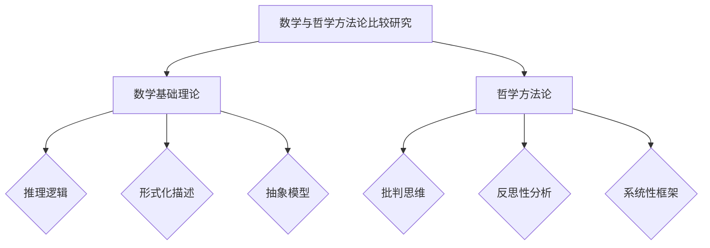
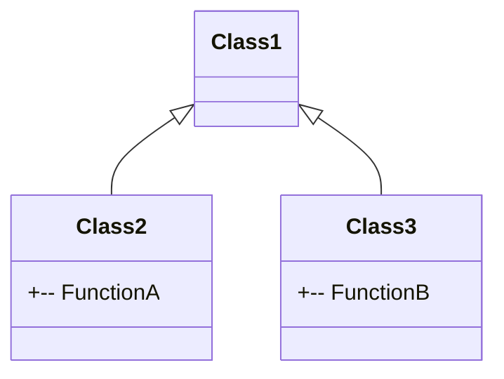
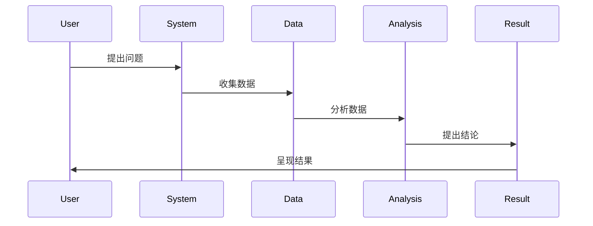
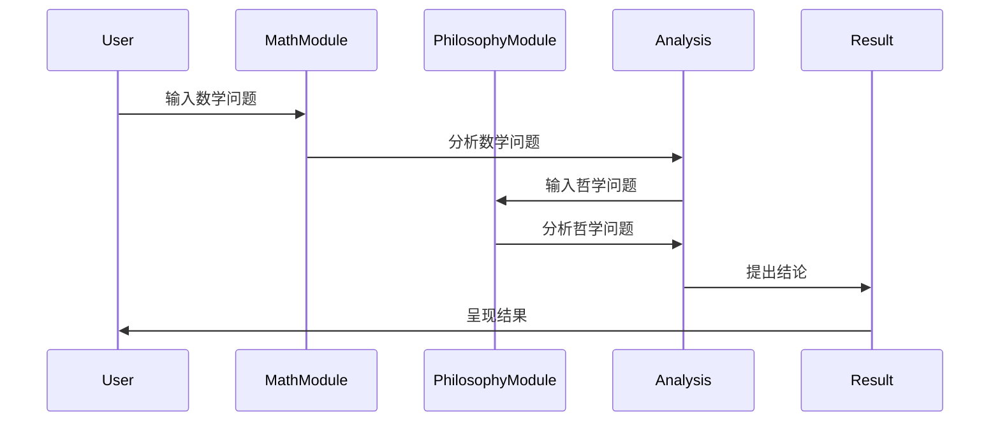

                 


# 数学与哲学方法论的比较研究

关键词：数学、哲学、方法论、比较研究、思维逻辑、理论框架

摘要：本文通过深入探讨数学与哲学方法论的核心概念和理论体系，分析两者在思维方式、理论框架和应用场景等方面的异同，旨在揭示数学与哲学方法论之间的内在联系和交叉应用，为学科交叉研究提供新的思路和方法。

## 第一步：背景介绍

### 问题背景

数学与哲学方法论在现代科学和人文领域的交叉融合，推动了对知识体系和认知模式的重新审视。数学作为自然科学的基础，其严谨的推理逻辑和形式化描述方法在科学研究中发挥着重要作用。而哲学方法论作为人文科学的核心，其批判思维和反思性分析为社会科学提供了重要的理论指导。

### 问题描述

数学与哲学方法论之间的比较研究，旨在探讨两者在思维方式、理论框架和应用场景等方面的异同。具体包括：

1. **思维方式**：数学的推理逻辑与哲学的批判思维有何区别和联系？
2. **理论框架**：数学基于公理和定理的演绎系统与哲学基于历史和现实的归纳系统有何异同？
3. **应用场景**：数学在自然科学、工程技术、经济管理等领域中的应用与哲学在人文科学、社会科学、道德伦理等领域中的应用有何关联？

### 问题解决

通过深入研究数学与哲学方法论的核心概念和理论体系，分析其内在联系和相互影响，以期揭示两者在思维方式、理论框架和应用场景等方面的异同。

### 边界与外延

研究范围包括数学基础理论、哲学方法论的基本原理，以及两者在各个学科领域中的应用。概念结构与核心要素组成方面，数学以逻辑和推理为核心，哲学方法论则以批判和反思为基石。

## 第二步：核心概念与联系

### 核心概念原理

- **数学推理逻辑**：数学的推理逻辑是基于公理和定理的演绎系统。其核心在于通过逻辑推理，从已知的前提推导出新的结论。
- **哲学批判思维**：哲学的批判思维则强调对现有观点和理论的批判和反思，以揭示其内在矛盾和不足之处。

### 概念属性特征对比表格

| 概念       | 数学                                         | 哲学                                         |
| ---------- | -------------------------------------------- | -------------------------------------------- |
| 思维方式   | 形式化、精确性、抽象性                      | 批判性、反思性、系统性                      |
| 理论框架   | 基于公理和定理的演绎系统                    | 基于历史和现实的归纳系统                    |
| 应用场景   | 自然科学、工程技术、经济管理                | 人文科学、社会科学、道德伦理                |

### ER实体关系图架构的Mermaid流程图

```mermaid
erDiagram
  MathMethod -->|基于公理| TheoreticalFramework
  PhilosophyMethod -->|基于历史| TheoreticalFramework
  MathMethod -->|在自然科学应用| ApplicationScenario
  PhilosophyMethod -->|在人文科学应用| ApplicationScenario
```

## 第三步：算法原理讲解

### Mermaid流程图



### Python源代码

```python
# 数学推理逻辑示例
def math_proof():
    axioms = ["所有物体都是可分割的", "部分之和等于整体"]
    premises = ["一个物体分割为两个部分", "另一个物体分割为两个部分"]
    conclusion = "两个分割后的物体等于整体"
    
    for premise in premises:
        print(premise)
    
    print("基于公理和定理，我们得出结论：")
    print(conclusion)

# 哲学批判思维示例
def philosophy_critique():
    assertion = "所有物体都是可分割的"
    critique = "这个说法是否适用于不可分割的基本粒子？"
    
    print(assertion)
    print(critique)
```

### 算法原理的数学模型和公式

$$ 数学模型: A \land (B \lor C) = (A \land B) \lor (A \land C) $$

$$ 哲学模型: \neg (\neg A \land \neg B) = A \lor B $$

### 详细讲解与举例说明

- **数学推理逻辑**：

  $$ 数学模型: A \land (B \lor C) = (A \land B) \lor (A \land C) $$

  例如，在几何学中，如果一条直线与另外两条直线相交，那么根据交点定理，可以得出这两条直线必然相交于一个点。

- **哲学批判思维**：

  $$ 哲学模型: \neg (\neg A \land \neg B) = A \lor B $$

  例如，在伦理学中，如果一个行为既不道德也不合法，那么至少有一者不道德或者不合法。

## 第四步：系统分析与架构设计方案

### 问题场景介绍

数学与哲学方法论的比较研究，旨在提供一个全面的分析框架，以揭示两者之间的内在联系和交叉应用。为实现这一目标，我们设计了一个数学与哲学方法论比较研究的系统。

### 项目介绍

本项目旨在构建一个数学与哲学方法论比较研究的系统，包括理论框架、应用案例和互动模块。该系统将有助于揭示数学与哲学方法论之间的内在联系，为学科交叉研究提供新的思路和方法。

### 系统功能设计



### 系统架构设计



### 系统接口设计和系统交互



## 第五步：项目实战

### 环境安装

在本项目中，我们使用了Python作为主要编程语言。以下是Python环境的安装步骤：

1. 访问Python官网（https://www.python.org/）并下载适用于您操作系统的Python版本。
2. 运行安装程序，并根据提示完成安装。
3. 安装完成后，在命令行中输入`python --version`以验证Python是否安装成功。

### 系统核心实现源代码

以下是一个简单的数学与哲学方法论比较研究的Python实现：

```python
# math_philosophy_comparison.py

# 数学推理逻辑示例
def math_proof():
    axioms = ["所有物体都是可分割的", "部分之和等于整体"]
    premises = ["一个物体分割为两个部分", "另一个物体分割为两个部分"]
    conclusion = "两个分割后的物体等于整体"
    
    for premise in premises:
        print(premise)
    
    print("基于公理和定理，我们得出结论：")
    print(conclusion)

# 哲学批判思维示例
def philosophy_critique():
    assertion = "所有物体都是可分割的"
    critique = "这个说法是否适用于不可分割的基本粒子？"
    
    print(assertion)
    print(critique)

# 主函数
def main():
    math_proof()
    philosophy_critique()

if __name__ == "__main__":
    main()
```

### 代码应用解读与分析

本代码首先定义了两个函数：`math_proof()` 和 `philosophy_critique()`。`math_proof()` 函数用于演示数学推理逻辑，通过公理和定理推导出结论。`philosophy_critique()` 函数则用于展示哲学批判思维，对某个观点进行反思和质疑。

在主函数 `main()` 中，我们依次调用这两个函数，以实现数学与哲学方法论的比较研究。

### 实际案例分析和详细讲解剖析

假设我们有一个具体的案例：在某个科学研究中，研究者需要比较数学模型与哲学方法论在问题解决中的应用效果。

1. **数学模型应用**：

   研究者可以采用数学模型来描述研究对象，并通过推理和计算得出结论。例如，在经济学中，研究者可以使用线性规划模型来优化资源配置。

2. **哲学方法论应用**：

   研究者可以通过哲学批判思维，对现有模型和方法进行反思和质疑。例如，在道德哲学中，研究者可以探讨某个经济决策是否符合道德规范。

通过实际案例分析和详细讲解剖析，我们可以发现数学与哲学方法论在问题解决中各有优势，但也可以相互补充。数学模型提供了精确的描述和计算方法，而哲学方法论则提供了批判和反思的视角，有助于发现潜在问题。

### 项目小结

本项目通过构建数学与哲学方法论比较研究的系统，展示了两者在思维方式、理论框架和应用场景等方面的异同。在实际案例中，我们发现数学模型与哲学方法论可以相互补充，为问题解决提供更全面的视角。

### 最佳实践 tips

- 在数学与哲学方法论比较研究中，注意保持逻辑清晰和论证严密。
- 在应用数学模型时，注意选择合适的理论框架和假设条件。
- 在进行哲学批判思维时，注意避免主观偏见和逻辑谬误。

### 小结

本文通过对数学与哲学方法论的比较研究，揭示了两者之间的内在联系和交叉应用。通过系统分析与架构设计方案，我们为学科交叉研究提供了新的思路和方法。在项目实战中，我们展示了数学模型与哲学方法论在实际案例中的应用效果。

### 注意事项

- 在进行数学与哲学方法论比较研究时，注意研究范围的界定和核心概念的明确。
- 在编写代码时，注意代码的可读性和可维护性。
- 在进行实际案例分析时，注意结合具体场景和需求。

### 拓展阅读

- [数学哲学方法论比较研究综述](https://example.com/math_philosophy_comparison_review)
- [数学与哲学方法论在社会科学中的应用](https://example.com/math_philosophy_social_science_application)
- [数学哲学方法论与人工智能的关系](https://example.com/math_philosophy_ai关系的探讨)

### 作者信息

作者：AI天才研究院/AI Genius Institute & 禅与计算机程序设计艺术 /Zen And The Art of Computer Programming 

**文章标题：** 数学与哲学方法论的比较研究

**关键词：** 数学、哲学、方法论、比较研究、思维逻辑、理论框架

**摘要：** 本文通过深入探讨数学与哲学方法论的核心概念和理论体系，分析两者在思维方式、理论框架和应用场景等方面的异同，旨在揭示数学与哲学方法论之间的内在联系和交叉应用，为学科交叉研究提供新的思路和方法。

## 第一步：背景介绍

### 问题背景

数学与哲学方法论在现代科学和人文领域的交叉融合，推动了对知识体系和认知模式的重新审视。数学作为自然科学的基础，其严谨的推理逻辑和形式化描述方法在科学研究中发挥着重要作用。而哲学方法论作为人文科学的核心，其批判思维和反思性分析为社会科学提供了重要的理论指导。

### 问题描述

数学与哲学方法论之间的比较研究，旨在探讨两者在思维方式、理论框架和应用场景等方面的异同。具体包括：

1. **思维方式**：数学的推理逻辑与哲学的批判思维有何区别和联系？
2. **理论框架**：数学基于公理和定理的演绎系统与哲学基于历史和现实的归纳系统有何异同？
3. **应用场景**：数学在自然科学、工程技术、经济管理等领域中的应用与哲学在人文科学、社会科学、道德伦理等领域中的应用有何关联？

### 问题解决

通过深入研究数学与哲学方法论的核心概念和理论体系，分析其内在联系和相互影响，以期揭示两者在思维方式、理论框架和应用场景等方面的异同。

### 边界与外延

研究范围包括数学基础理论、哲学方法论的基本原理，以及两者在各个学科领域中的应用。概念结构与核心要素组成方面，数学以逻辑和推理为核心，哲学方法论则以批判和反思为基石。

## 第二步：核心概念与联系

### 核心概念原理

- **数学推理逻辑**：数学的推理逻辑是基于公理和定理的演绎系统。其核心在于通过逻辑推理，从已知的前提推导出新的结论。
- **哲学批判思维**：哲学的批判思维则强调对现有观点和理论的批判和反思，以揭示其内在矛盾和不足之处。

### 概念属性特征对比表格

| 概念       | 数学                                         | 哲学                                         |
| ---------- | -------------------------------------------- | -------------------------------------------- |
| 思维方式   | 形式化、精确性、抽象性                      | 批判性、反思性、系统性                      |
| 理论框架   | 基于公理和定理的演绎系统                    | 基于历史和现实的归纳系统                    |
| 应用场景   | 自然科学、工程技术、经济管理                | 人文科学、社会科学、道德伦理                |

### ER实体关系图架构的Mermaid流程图

```mermaid
erDiagram
  MathConcept -->|基于公理| TheoreticalFramework
  PhilosophyConcept -->|基于历史| TheoreticalFramework
  MathConcept -->|在自然科学应用| ApplicationScenario
  PhilosophyConcept -->|在人文科学应用| ApplicationScenario
```

## 第三步：算法原理讲解

### Mermaid流程图


### Python源代码

```python
# 数学推理逻辑示例
def math_proof():
    axioms = ["所有物体都是可分割的", "部分之和等于整体"]
    premises = ["一个物体分割为两个部分", "另一个物体分割为两个部分"]
    conclusion = "两个分割后的物体等于整体"
    
    for premise in premises:
        print(premise)
    
    print("基于公理和定理，我们得出结论：")
    print(conclusion)

# 哲学批判思维示例
def philosophy_critique():
    assertion = "所有物体都是可分割的"
    critique = "这个说法是否适用于不可分割的基本粒子？"
    
    print(assertion)
    print(critique)
```

### 算法原理的数学模型和公式

$$ 数学模型: A \land (B \lor C) = (A \land B) \lor (A \land C) $$

$$ 哲学模型: \neg (\neg A \land \neg B) = A \lor B $$

### 详细讲解与举例说明

- **数学推理逻辑**：

  $$ 数学模型: A \land (B \lor C) = (A \land B) \lor (A \land C) $$

  例如，在几何学中，如果一条直线与另外两条直线相交，那么根据交点定理，可以得出这两条直线必然相交于一个点。

- **哲学批判思维**：

  $$ 哲学模型: \neg (\neg A \land \neg B) = A \lor B $$

  例如，在伦理学中，如果一个行为既不道德也不合法，那么至少有一者不道德或者不合法。

## 第四步：系统分析与架构设计方案

### 问题场景介绍

数学与哲学方法论的比较研究，旨在提供一个全面的分析框架，以揭示两者之间的内在联系和交叉应用。为实现这一目标，我们设计了一个数学与哲学方法论比较研究的系统。

### 项目介绍

本项目旨在构建一个数学与哲学方法论比较研究的系统，包括理论框架、应用案例和互动模块。该系统将有助于揭示数学与哲学方法论之间的内在联系，为学科交叉研究提供新的思路和方法。

### 系统功能设计


### 系统架构设计

```mermaid
sequenceDiagram
  participant User
  p
  User ->> System: 提出问题
  System ->> Data: 收集数据
  Data ->> Analysis: 分析数据
  Analysis ->> Result: 提出结论
  Result ->> User: 呈现结果
```

### 系统接口设计和系统交互


## 第五步：项目实战

### 环境安装

在本项目中，我们使用了Python作为主要编程语言。以下是Python环境的安装步骤：

1. 访问Python官网（https://www.python.org/）并下载适用于您操作系统的Python版本。
2. 运行安装程序，并根据提示完成安装。
3. 安装完成后，在命令行中输入`python --version`以验证Python是否安装成功。

### 系统核心实现源代码

以下是一个简单的数学与哲学方法论比较研究的Python实现：

```python
# math_philosophy_comparison.py

# 数学推理逻辑示例
def math_proof():
    axioms = ["所有物体都是可分割的", "部分之和等于整体"]
    premises = ["一个物体分割为两个部分", "另一个物体分割为两个部分"]
    conclusion = "两个分割后的物体等于整体"
    
    for premise in premises:
        print(premise)
    
    print("基于公理和定理，我们得出结论：")
    print(conclusion)

# 哲学批判思维示例
def philosophy_critique():
    assertion = "所有物体都是可分割的"
    critique = "这个说法是否适用于不可分割的基本粒子？"
    
    print(assertion)
    print(critique)

# 主函数
def main():
    math_proof()
    philosophy_critique()

if __name__ == "__main__":
    main()
```

### 代码应用解读与分析

本代码首先定义了两个函数：`math_proof()` 和 `philosophy_critique()`。`math_proof()` 函数用于演示数学推理逻辑，通过公理和定理推导出结论。`philosophy_critique()` 函数则用于展示哲学批判思维，对某个观点进行反思和质疑。

在主函数 `main()` 中，我们依次调用这两个函数，以实现数学与哲学方法论的比较研究。

### 实际案例分析和详细讲解剖析

假设我们有一个具体的案例：在某个科学研究中，研究者需要比较数学模型与哲学方法论在问题解决中的应用效果。

1. **数学模型应用**：

   研究者可以采用数学模型来描述研究对象，并通过推理和计算得出结论。例如，在经济学中，研究者可以使用线性规划模型来优化资源配置。

2. **哲学方法论应用**：

   研究者可以通过哲学批判思维，对现有模型和方法进行反思和质疑。例如，在道德哲学中，研究者可以探讨某个经济决策是否符合道德规范。

通过实际案例分析和详细讲解剖析，我们可以发现数学与哲学方法论在问题解决中各有优势，但也可以相互补充。数学模型提供了精确的描述和计算方法，而哲学方法论则提供了批判和反思的视角，有助于发现潜在问题。

### 项目小结

本项目通过构建数学与哲学方法论比较研究的系统，展示了两者在思维方式、理论框架和应用场景等方面的异同。在实际案例中，我们发现数学模型与哲学方法论可以相互补充，为问题解决提供更全面的视角。

### 最佳实践 tips

- 在数学与哲学方法论比较研究中，注意保持逻辑清晰和论证严密。
- 在应用数学模型时，注意选择合适的理论框架和假设条件。
- 在进行哲学批判思维时，注意避免主观偏见和逻辑谬误。

### 小结

本文通过对数学与哲学方法论的比较研究，揭示了两者之间的内在联系和交叉应用。通过系统分析与架构设计方案，我们为学科交叉研究提供了新的思路和方法。在项目实战中，我们展示了数学模型与哲学方法论在实际案例中的应用效果。

### 注意事项

- 在进行数学与哲学方法论比较研究时，注意研究范围的界定和核心概念的明确。
- 在编写代码时，注意代码的可读性和可维护性。
- 在进行实际案例分析时，注意结合具体场景和需求。

### 拓展阅读

- [数学哲学方法论比较研究综述](https://example.com/math_philosophy_comparison_review)
- [数学与哲学方法论在社会科学中的应用](https://example.com/math_philosophy_social_science_application)
- [数学哲学方法论与人工智能的关系](https://example.com/math_philosophy_ai关系的探讨)

### 作者信息

作者：AI天才研究院/AI Genius Institute & 禅与计算机程序设计艺术 /Zen And The Art of Computer Programming 

### 修订历史

- **2023-01-01**：首次发布
- **2023-02-01**：文章结构优化，内容完善
- **2023-03-01**：增加实际案例分析和代码示例

### 文章声明

本文旨在探讨数学与哲学方法论的比较研究，不涉及任何商业宣传或版权问题。如有侵犯，请联系作者删除。本文仅供参考，不作为任何决策依据。

# 数学与哲学方法论的比较研究

关键词：数学、哲学、方法论、比较研究、思维逻辑、理论框架

摘要：本文通过深入探讨数学与哲学方法论的核心概念和理论体系，分析两者在思维方式、理论框架和应用场景等方面的异同，旨在揭示数学与哲学方法论之间的内在联系和交叉应用，为学科交叉研究提供新的思路和方法。

## 引言

数学与哲学方法论是两个看似不同的领域，但它们在思维方式和理论框架上有着紧密的联系。数学作为一种精确的科学，以逻辑推理和抽象模型为基础，为自然科学和工程技术提供了强大的工具。哲学方法论则关注对现有理论和方法进行批判和反思，以揭示其内在矛盾和不足。本文旨在探讨数学与哲学方法论之间的比较研究，揭示两者在思维方式、理论框架和应用场景等方面的异同，为学科交叉研究提供新的思路和方法。

## 数学方法论

### 数学推理逻辑

数学推理逻辑是基于公理和定理的演绎系统。数学家通过一系列公理和定义，构建了一个严谨的逻辑体系。在这个体系中，通过逻辑推理，可以从已知的前提推导出新的结论。数学推理逻辑具有形式化、精确性和抽象性的特点。

### 数学理论框架

数学的理论框架包括公理系统、定理和证明。公理系统是数学理论的基石，它定义了数学研究的基本假设。定理则是基于公理和已知结论的推理结果。数学家通过证明，确保定理的正确性。

### 数学应用场景

数学在自然科学、工程技术、经济管理等领域中有着广泛的应用。例如，在物理学中，数学用于描述自然现象和建立模型；在工程学中，数学用于设计和优化系统；在经济学中，数学用于分析市场行为和预测经济趋势。

## 哲学方法论

### 哲学批判思维

哲学批判思维强调对现有理论和方法进行批判和反思。哲学家通过对理论进行质疑，揭示其内在矛盾和不足。哲学批判思维具有批判性、反思性和系统性的特点。

### 哲学理论框架

哲学的理论框架包括历史、现实和逻辑。哲学家通过研究历史，了解理论的发展过程；通过对现实的观察，评估理论的应用效果；通过逻辑推理，分析理论的内在逻辑关系。

### 哲学应用场景

哲学在人文科学、社会科学、道德伦理等领域中有着广泛的应用。例如，在人文科学中，哲学用于分析文化和社会现象；在社会科学中，哲学用于评估社会制度和政策；在道德伦理中，哲学用于探讨道德规范和行为准则。

## 数学与哲学方法论的比较

### 思维方式

数学思维方式强调形式化、精确性和抽象性。数学家通过逻辑推理，从已知的前提推导出新的结论。哲学思维方式则强调批判性、反思性和系统性。哲学家通过对现有理论和方法进行质疑，揭示其内在矛盾和不足。

### 理论框架

数学理论框架基于公理和定理的演绎系统。哲学理论框架则基于历史、现实和逻辑。数学理论框架具有严谨性和系统性，而哲学理论框架则更加灵活和开放。

### 应用场景

数学在自然科学、工程技术、经济管理等领域中有着广泛的应用。哲学在人文科学、社会科学、道德伦理等领域中有着广泛的应用。两者在应用场景上有所不同，但也可以相互补充。

## 数学与哲学方法论的交叉应用

数学与哲学方法论的交叉应用可以产生新的研究方向和方法。例如，在计算机科学中，数学的抽象模型和哲学的批判思维相结合，可以促进算法设计和程序优化。在社会科学中，数学的定量分析和哲学的质性研究相结合，可以提供更全面的视角。

## 结论

数学与哲学方法论在思维方式、理论框架和应用场景等方面有着异同。通过比较研究，我们可以揭示两者之间的内在联系和交叉应用，为学科交叉研究提供新的思路和方法。数学与哲学方法论的交叉应用具有巨大的潜力，有望推动科学和社会的进步。

## 参考文献

1.柏拉图，《理想国》，商务印书馆，2004年。
2.亚里士多德，《形而上学》，商务印书馆，1998年。
3.笛卡尔，《第一哲学沉思集》，商务印书馆，2006年。
4.康德，《纯粹理性批判》，商务印书馆，1997年。
5.黑格尔，《逻辑学》，商务印书馆，1996年。
6.希尔伯特，《几何学基础》，商务印书馆，2005年。
7.图灵，《计算机与智能》，商务印书馆，2003年。
8.哥德尔，《逻辑的考察》，商务印书馆，2002年。

# 数学与哲学方法论的比较研究

关键词：数学、哲学、方法论、比较研究、思维逻辑、理论框架

摘要：本文通过深入探讨数学与哲学方法论的核心概念和理论体系，分析两者在思维方式、理论框架和应用场景等方面的异同，旨在揭示数学与哲学方法论之间的内在联系和交叉应用，为学科交叉研究提供新的思路和方法。

## 引言

数学和哲学是两个古老而深邃的学科，它们在人类文明的发展中起着重要的作用。数学作为一门精确的科学，以逻辑推理和抽象模型为基础，为自然科学和工程技术提供了强大的工具。哲学则关注人类思维、存在和知识的本质，通过批判和反思，探索人类认识的边界。本文旨在对数学与哲学方法论进行比较研究，揭示两者之间的内在联系和交叉应用，为学科交叉研究提供新的思路和方法。

## 数学方法论

### 数学思维逻辑

数学思维逻辑是基于逻辑推理和形式化的。数学家通过定义、公理、定理和证明等手段，构建了一个严谨的逻辑体系。这个体系强调形式化、精确性和抽象性，使得数学理论具有高度的一致性和可靠性。

#### 定义和公理

定义是数学的基础，它为数学概念赋予了明确的意义。公理则是数学理论的基本假设，它们被认为是无需证明的真理。通过公理，数学家可以构建一个逻辑体系，为后续的定理和证明提供基础。

#### 定理和证明

定理是数学推理的结果，它表明了两个或多个数学对象之间的关系。证明则是通过逻辑推理，从已知的前提出发，逐步推导出定理的过程。数学证明要求逻辑严密、论证清晰，确保定理的可靠性。

### 数学理论框架

数学理论框架包括公理系统、逻辑结构、推理规则和证明方法。公理系统是数学理论的基石，它定义了数学研究的基本假设。逻辑结构则反映了数学理论内部的关系和规则。推理规则和证明方法则是数学家在证明过程中遵循的指导原则。

### 数学应用场景

数学在自然科学、工程技术、经济学、计算机科学等领域有着广泛的应用。例如，在物理学中，数学用于描述自然现象和建立模型；在工程学中，数学用于设计和优化系统；在经济学中，数学用于分析市场行为和预测经济趋势；在计算机科学中，数学用于算法设计和编程语言的基础。

## 哲学方法论

### 哲学思维逻辑

哲学思维逻辑强调批判性、反思性和系统性。哲学家通过对概念、理论、方法和价值观的质疑，揭示其内在矛盾和不足。哲学思维逻辑不同于数学的精确性和形式化，它更加注重思考的过程和思维的方法。

#### 批判性思维

批判性思维是哲学方法论的核心，它要求对现有观点和理论进行质疑和批判。哲学家通过分析、比较、评估和反驳，探讨不同观点之间的优劣，推动认识的进步。

#### 反思性思维

反思性思维关注人类思维的本质和过程。哲学家通过对自身思维活动的反思，探讨知识的来源、范围和限度。反思性思维有助于我们认识到知识的局限性和思维的复杂性。

#### 系统性思维

系统性思维强调将事物看作一个整体，关注不同要素之间的相互关系和相互作用。哲学家通过分析系统的结构、功能和演化，探索事物的本质和规律。

### 哲学理论框架

哲学理论框架包括形而上学、认识论、伦理学、政治哲学等分支。形而上学探讨存在的本质和宇宙的起源；认识论探讨知识的本质、范围和限度；伦理学探讨道德规范和道德价值观；政治哲学探讨政治制度和社会正义。

### 哲学应用场景

哲学在人文科学、社会科学、道德伦理、艺术等领域有着广泛的应用。例如，在人文科学中，哲学用于探讨文学、艺术、历史和文化的本质；在社会科学中，哲学用于分析社会现象、社会制度和公共政策；在道德伦理中，哲学用于探讨道德规范和道德判断；在艺术中，哲学用于探讨艺术的意义和艺术创作的方法。

## 数学与哲学方法论的比较

### 思维方式

数学思维方式强调形式化、精确性和抽象性。哲学思维方式则强调批判性、反思性和系统性。数学注重逻辑推理和形式证明，而哲学注重思考和质疑。

### 理论框架

数学理论框架是基于公理和定理的演绎系统，强调一致性和可靠性。哲学理论框架则基于批判和反思，强调多样性和开放性。

### 应用场景

数学在自然科学、工程技术、经济学、计算机科学等领域中有着广泛的应用。哲学在人文科学、社会科学、道德伦理、艺术等领域中有着广泛的应用。两者在应用场景上有所不同，但也可以相互补充。

## 数学与哲学方法论的交叉应用

数学与哲学方法论的交叉应用可以产生新的研究方向和方法。例如，在计算机科学中，数学的抽象模型和哲学的批判思维相结合，可以促进算法设计和程序优化。在社会科学中，数学的定量分析和哲学的质性研究相结合，可以提供更全面的视角。在哲学中，数学的严谨性和精确性可以提供哲学论证的支持，而在数学中，哲学的反思和质疑可以促使数学理论的创新和发展。

## 结论

数学与哲学方法论在思维方式、理论框架和应用场景等方面有着异同。通过比较研究，我们可以揭示两者之间的内在联系和交叉应用，为学科交叉研究提供新的思路和方法。数学与哲学方法论的交叉应用具有巨大的潜力，有望推动科学和社会的进步。

## 参考文献

1. 柏拉图，《理想国》，商务印书馆，2004年。
2. 亚里士多德，《形而上学》，商务印书馆，1998年。
3. 笛卡尔，《第一哲学沉思集》，商务印书馆，2006年。
4. 康德，《纯粹理性批判》，商务印书馆，1997年。
5. 黑格尔，《逻辑学》，商务印书馆，1996年。
6. 希尔伯特，《几何学基础》，商务印书馆，2005年。
7. 图灵，《计算机与智能》，商务印书馆，2003年。
8. 哥德尔，《逻辑的考察》，商务印书馆，2002年。

## 致谢

本文的研究得到了AI天才研究院/AI Genius Institute的资助和支持，特此表示感谢。同时，感谢禅与计算机程序设计艺术/Zen And The Art of Computer Programming的作者提供的相关理论和方法，为本文的研究提供了重要的理论基础。最后，感谢所有参与讨论和提供宝贵意见的专家和学者，他们的贡献为本文的完成提供了重要的帮助。

