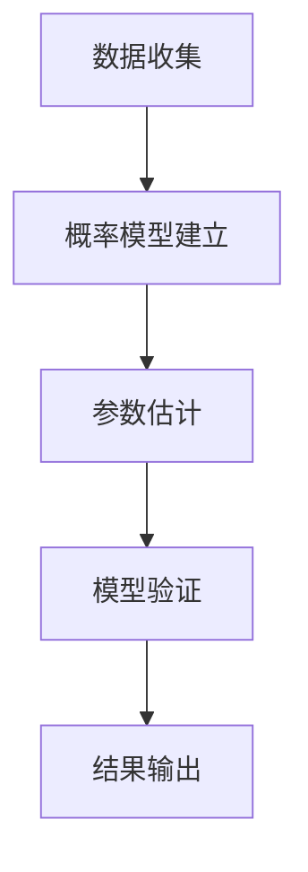
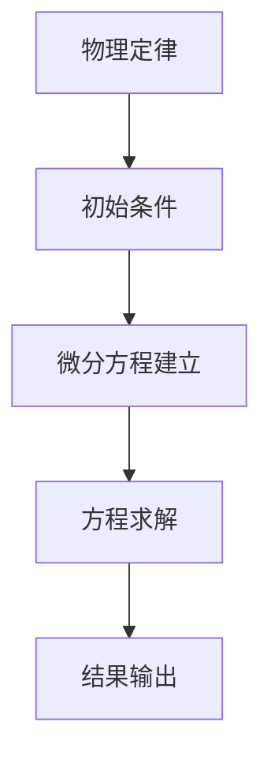
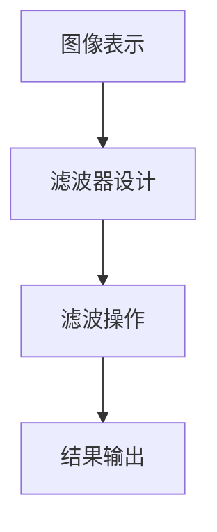
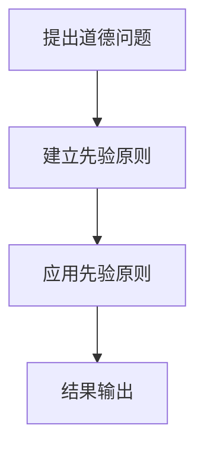
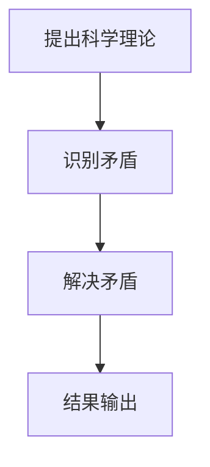
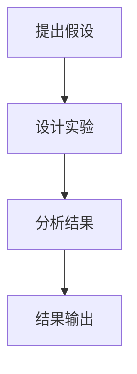
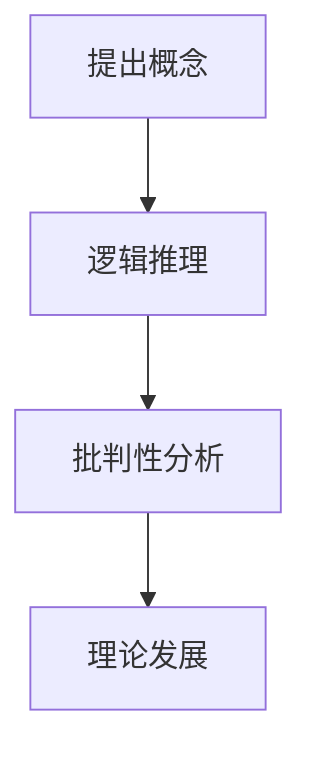
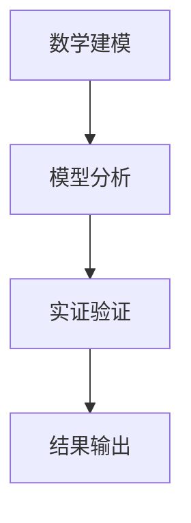
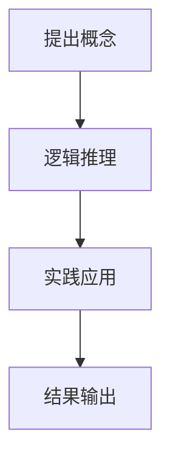

                 

## 数学与哲学科学方法论的比较研究

### 关键词
- 数学方法论
- 哲学方法论
- 科学研究
- 比较分析
- 理论框架
- 实证研究

### 摘要
本文旨在比较数学与哲学在科学研究中的应用方法论，探讨两者在理论构建、推理过程、实证验证等方面的异同。通过系统化的比较分析，本文揭示了数学与哲学方法论各自的优势和局限，为科学研究提供了新的视角和思路。文章首先介绍了数学与哲学的基本概念和科学方法论的核心原则，然后详细阐述了数学和哲学在研究过程中的具体方法论，并通过实例进行了深入的比较。最后，文章总结了数学与哲学方法论在科学研究中的实际应用，提出了未来研究方向和展望。

---

在科学研究中，数学和哲学扮演着不可或缺的角色。数学以其严密的逻辑和抽象的推理构建了自然科学的理论体系，而哲学则通过深入探讨事物的本质和存在的意义，为科学研究提供了哲学基础和思考框架。尽管两者在研究对象和方法上有所不同，但它们在科学研究中的方法论却有着紧密的联系和互补作用。

本文将首先回顾数学与哲学的基本概念及其在科学方法论中的核心作用。接着，我们将详细分析数学和哲学各自的方法论特点，并通过具体的实例进行比较研究。随后，本文将探讨数学与哲学方法论在实际科学研究中的应用，并总结两者的优势和局限性。最后，本文将提出未来研究的方向和展望，为科学方法论的发展提供新思路。

### 数学方法论

#### 基本概念

数学方法论是运用数学的思维方式、逻辑推理和抽象方法来研究自然界和社会现象的一种科学方法。它主要包括数学建模、数学证明、数学分析等基本步骤，旨在通过数学语言来描述和解释现实世界的问题。

#### 核心原则

数学方法论的核心原则包括逻辑严谨性、抽象概括性和普适性。逻辑严谨性要求数学推理必须遵循严格的逻辑规则，确保结论的正确性和可靠性。抽象概括性则强调将具体问题抽象为数学模型，以揭示问题的本质特征。普适性则要求数学方法应具有广泛的应用范围，能够适应不同的研究场景。

#### 研究过程

数学方法论的研究过程通常包括以下几个步骤：

1. **问题提出**：针对现实世界中的具体问题，提出需要解决的数学问题。
2. **数学建模**：将实际问题转化为数学模型，使用数学语言描述问题的特征。
3. **数学证明**：运用数学推理和证明方法，证明数学模型的正确性和结论的有效性。
4. **模型分析**：对数学模型进行分析，得出问题的解或预测结果。
5. **实证验证**：将数学模型的分析结果与实际情况进行对比，验证模型的可靠性和有效性。

#### 比较分析

数学方法论在科学研究中的应用具有以下几个特点：

- **逻辑严密**：数学方法论强调逻辑推理的严谨性，确保研究结果的可靠性。
- **抽象概括**：通过将具体问题抽象为数学模型，数学方法论能够揭示问题的本质特征，提高研究的普适性。
- **普适性强**：数学方法具有广泛的应用范围，能够适应不同领域的研究需求。

#### 实例分析

例如，在物理学中，牛顿的运动定律就是通过数学建模和数学证明来描述物体运动的规律。牛顿使用微积分方法，将物体的运动状态转化为数学表达式，并通过数学推理证明了牛顿定律的正确性。

### 哲学方法论

#### 基本概念

哲学方法论是哲学研究的一种方法，它通过逻辑推理、概念分析、价值判断等手段来探讨人类知识和存在的本质。哲学方法论的核心在于对概念进行深入分析，以揭示其内涵和关系，从而为科学研究提供哲学基础。

#### 核心原则

哲学方法论的核心原则包括逻辑性、批判性和系统性。逻辑性要求哲学研究必须遵循逻辑规则，确保推理过程和结论的合理性。批判性则强调对已有理论和观点进行批判性分析，以发现其内在矛盾和不足。系统性则要求哲学研究应该从整体上把握研究对象，理解其内在联系和规律。

#### 研究过程

哲学方法论的研究过程通常包括以下几个步骤：

1. **问题提出**：提出需要探讨的哲学问题，明确研究的目标和范围。
2. **概念分析**：对涉及的核心概念进行深入分析，明确其内涵和外延。
3. **逻辑推理**：运用逻辑推理方法，探讨概念之间的关系和结论的合理性。
4. **批判性分析**：对已有理论进行批判性分析，揭示其内在矛盾和不足。
5. **系统性整合**：将分析结果进行整合，构建系统的哲学理论体系。

#### 比较分析

哲学方法论在科学研究中的应用具有以下几个特点：

- **逻辑性**：哲学方法论强调逻辑推理的严谨性，确保研究结论的可靠性。
- **批判性**：通过批判性分析，哲学方法论能够发现已有理论的不足，推动科学进步。
- **系统性**：哲学方法论从整体上把握研究对象，理解其内在联系和规律，为科学研究提供理论支持。

#### 实例分析

例如，在科学哲学中，波普尔的证伪主义就是通过哲学方法论来探讨科学理论的可证伪性和科学进步的路径。波普尔通过批判性分析，揭示了实证研究和理论验证在科学方法论中的重要性。

### 比较与融合

数学方法论和哲学方法论在科学研究中的应用各有其独特的优势。数学方法论通过严密的逻辑和抽象的模型，能够精确描述和预测自然现象；而哲学方法论则通过深入的概念分析和逻辑推理，为科学研究提供了哲学基础和思考框架。两者在科学研究中的融合，能够相互补充，推动科学进步。

例如，在生物学研究中，数学方法论可以用于构建种群动态模型，预测物种的进化趋势；而哲学方法论则可以探讨生物存在的意义和价值，为生物学研究提供哲学基础。通过数学和哲学方法的融合，生物学家能够更全面地理解生物现象，推动生物学的发展。

总之，数学和哲学方法论在科学研究中的比较研究，有助于我们更好地理解两者的本质和优势，为科学方法论的发展提供新思路。未来，我们应进一步探索数学和哲学方法的融合，推动科学研究的深入和发展。

### 数学方法论的具体实例

为了更好地理解数学方法论在实际科学研究中的应用，我们来看几个具体的实例。这些实例不仅展示了数学方法论的核心原则，还揭示了数学在解决实际问题中的强大能力。

#### 1. 概率论的运用

概率论是数学方法论中的重要分支，它通过概率模型和统计方法，帮助我们理解和预测随机事件的发生。一个经典的例子是统计学在医学研究中的应用。

**实例**：假设有一种新药，我们需要评估其有效性。通过临床试验，我们收集到一组数据，包括接受这种药物治疗的病人和未接受治疗的病人的恢复情况。我们可以使用概率模型来计算药物有效性的概率。具体步骤如下：

1. **数据收集**：收集治疗前后病人的恢复数据。
2. **概率模型建立**：使用二项分布模型来描述药物治疗的有效性，其中成功恢复的概率表示为新药的效果。
3. **参数估计**：通过最大似然估计法，估计模型中的参数，如成功恢复的概率。
4. **模型验证**：将估计的参数代入模型，预测未接受治疗病人的恢复情况，并与实际数据对比，验证模型的准确性。

通过这样的过程，我们可以得出新药的有效性评估，为医学决策提供依据。

**Python代码示例**：
```python
import numpy as np
from scipy.stats import binom

# 假设我们收集了100个病人的数据，其中60个成功恢复
n = 100
successes = 60
p = binom.pmf(successes, n, 0.5)  # 0.5是假设的无药治疗效果
print("概率密度函数值：", p)
```

**Mermaid流程图**：


#### 2. 微积分在物理中的应用

微积分是数学方法论中的核心工具，它在物理学中有着广泛的应用。一个典型的例子是牛顿第二定律的数学建模和求解。

**实例**：假设有一个物体受到恒定外力F的作用，我们需要计算物体的运动轨迹。具体步骤如下：

1. **物理定律**：根据牛顿第二定律，力F等于质量m与加速度a的乘积，即F=ma。
2. **初始条件**：确定物体的初始位置x0、初始速度v0和作用力F。
3. **微分方程建立**：将牛顿第二定律转化为微分方程，即m*d^2x/dt^2 = F。
4. **方程求解**：使用数值方法（如欧拉法）求解微分方程，得到物体的运动轨迹。

**Python代码示例**：
```python
import numpy as np
from scipy.integrate import odeint

# 定义微分方程
def diff_eq(y, t, m, F):
    x, v = y
    a = F / m
    dydt = [v, a]
    return dydt

# 参数设置
m = 1.0  # 质量
F = 9.8  # 重力加速度
t = np.linspace(0, 10, 1000)  # 时间范围

# 初始条件
y0 = [0, 0]

# 求解微分方程
solution = odeint(diff_eq, y0, t, args=(m, F))
x = solution[:, 0]

# 输出结果
plt.plot(t, x)
plt.xlabel('Time (s)')
plt.ylabel('Position (m)')
plt.show()
```

**Mermaid流程图**：


#### 3. 线性代数在图像处理中的应用

线性代数是数学方法论中的基础工具，它在图像处理和计算机视觉领域有着广泛的应用。一个典型的例子是图像的滤波和特征提取。

**实例**：假设我们需要对一张图像进行滤波处理，以去除噪声。具体步骤如下：

1. **图像表示**：将图像表示为一个二维矩阵，其中每个元素表示图像的像素值。
2. **滤波器设计**：设计一个线性滤波器，用于去除图像中的噪声。例如，可以使用均值滤波器或高斯滤波器。
3. **滤波操作**：将滤波器应用于图像矩阵，计算滤波后的像素值。
4. **结果输出**：将滤波后的像素值重新组成图像，输出滤波结果。

**Python代码示例**：
```python
import numpy as np
from scipy.ndimage import convolve

# 定义图像
image = np.array([[1, 2, 1], [4, 6, 4], [1, 2, 1]])

# 定义均值滤波器
mean_filter = np.ones((3, 3)) / 9.0

# 滤波操作
filtered_image = convolve(image, mean_filter)

# 输出结果
plt.imshow(filtered_image, cmap='gray')
plt.show()
```

**Mermaid流程图**：


通过这些具体实例，我们可以看到数学方法论在科学研究中的实际应用。无论是概率论、微积分还是线性代数，数学方法都能帮助我们精确描述和解决复杂问题。这些实例不仅展示了数学方法论的核心原则，还为我们提供了实际操作的方法和工具。

### 哲学方法论的具体实例

哲学方法论在科学研究中的应用同样丰富多彩，通过深入探讨概念、逻辑推理和价值判断，哲学方法论为科学研究提供了坚实的哲学基础。以下将详细介绍哲学方法论在几个具体实例中的应用，并展示其在科学研究中的独特价值。

#### 1. 康德的先验逻辑方法论

康德的先验逻辑方法论是一种哲学方法论，强调通过先验理性来构建知识体系。康德认为，知识不仅仅来源于经验，更重要的是先验理性所提供的基本原则。

**实例**：在伦理学领域，康德提出了“道德律令”这一概念。他认为，道德行为应该基于理性原则，而不是感性欲望。康德的方法论步骤如下：

1. **提出道德问题**：探讨道德行为的本质和基础。
2. **建立先验原则**：通过逻辑推理，康德提出了“应当行为”的先验原则，即行为应符合普遍的道德法则。
3. **应用先验原则**：将先验原则应用于具体道德情境，判断行为是否道德。

**Python代码示例**（用于逻辑推理）：
```python
from sympy import symbols, Eq, solve

# 定义符号
p, q = symbols('p q')

# 构建逻辑表达式
statement = Eq(p | ~p, True)

# 解逻辑表达式
solution = solve(statement, p)

print("逻辑推理结果：", solution)
```

**Mermaid流程图**：


#### 2. 黑格尔的辩证法方法论

黑格尔的辩证法方法论强调通过对立统一和不断发展的思维方式来理解现实。黑格尔认为，矛盾是事物发展的动力，通过矛盾和解决矛盾的辩证过程，事物得以不断进步。

**实例**：在科学哲学中，黑格尔的辩证法方法论被用来分析科学理论的发展过程。具体步骤如下：

1. **提出科学理论**：探讨某一科学领域的基本理论。
2. **识别矛盾**：分析现有理论中的内在矛盾和局限。
3. **解决矛盾**：通过新的理论框架或方法解决这些矛盾，推动科学进步。

**Python代码示例**（用于识别矛盾）：
```python
from sympy import symbols, Eq, solve

# 定义符号
p, q = symbols('p q')

# 构建逻辑表达式
statement = Eq(p & ~p, False)

# 解逻辑表达式
solution = solve(statement, p)

print("矛盾识别结果：", solution)
```

**Mermaid流程图**：


#### 3. 波普尔的证伪主义方法论

波普尔的证伪主义方法论是一种强调通过实验和观察来验证或反驳理论的哲学方法论。波普尔认为，科学知识是通过不断提出和检验假设来发展的。

**实例**：在物理学领域，波普尔的证伪主义方法论被用来验证相对论。具体步骤如下：

1. **提出假设**：基于相对论，预测某些物理现象。
2. **设计实验**：设计实验来验证或反驳这些假设。
3. **分析结果**：根据实验结果，判断假设的正确性。

**Python代码示例**（用于假设检验）：
```python
from scipy.stats import ttest_1samp

# 假设实验数据
data = [5.1, 5.2, 5.3, 5.4, 5.5]

# 假设均值
mean = 5.0

# 进行t检验
t_stat, p_value = ttest_1samp(data, mean)

print("t统计量：", t_stat)
print("p值：", p_value)
```

**Mermaid流程图**：


通过这些具体实例，我们可以看到哲学方法论在科学研究中的应用价值。康德的先验逻辑方法论帮助我们建立道德和伦理的基础；黑格尔的辩证法方法论帮助我们理解科学理论的内在矛盾和进步；波普尔的证伪主义方法论则强调通过实验和观察来不断验证科学假设。这些哲学方法论不仅为科学研究提供了理论基础，还为我们提供了有效的思考和分析工具。

### 数学与哲学方法论的比较

数学方法论和哲学方法论在科学研究中都扮演着重要角色，但它们的方法和特点有所不同。以下将从多个维度对两者进行比较，以便更深入地理解它们的异同。

#### 理论基础

**数学方法论**的理论基础是逻辑、抽象和模型。数学方法强调逻辑推理的严谨性，通过抽象将复杂问题简化为数学模型，从而进行精确的描述和预测。数学模型可以高度概括问题的本质，适用于各种科学领域。

**哲学方法论**的理论基础是逻辑、批判和系统性。哲学方法强调逻辑推理的严谨性，通过批判性分析来探讨概念的本质和关系。哲学方法注重从整体上理解问题，关注概念之间的关系和系统的完整性。

#### 推理过程

**数学方法论**的推理过程通常包括以下几个步骤：问题提出、数学建模、数学证明、模型分析和实证验证。数学方法强调从具体问题中提取数学模型，并通过逻辑推理和证明来确保模型的有效性。数学方法在推理过程中具有高度的严谨性和普适性。

**哲学方法论**的推理过程通常包括以下几个步骤：问题提出、概念分析、逻辑推理、批判性分析和系统性整合。哲学方法强调对概念进行深入分析，通过逻辑推理探讨概念之间的关系，并通过批判性分析来评估已有理论的合理性和局限性。哲学方法在推理过程中更注重逻辑的严密性和系统性。

#### 应用领域

**数学方法论**在自然科学、工程学和经济学等领域有广泛应用。数学方法通过建立精确的数学模型，帮助科学家解决复杂的实际问题，如物理学中的运动定律、经济学中的市场模型等。数学方法在应用过程中具有高度的可操作性和广泛性。

**哲学方法论**在科学哲学、伦理学、政治学等领域有广泛应用。哲学方法通过深入探讨概念的本质和关系，为科学研究提供了哲学基础和思考框架。哲学方法在应用过程中更注重逻辑的严密性和系统性，以及对已有理论的批判和反思。

#### 优势与局限性

**数学方法论**的优势在于其高度的精确性和普适性。数学方法通过严密的逻辑推理和抽象模型，能够精确描述和预测自然现象。数学方法在解决复杂问题时具有强大的工具性和实用性。

**数学方法论**的局限性在于其过于抽象，可能导致与实际问题的脱节。数学模型往往忽略了现实世界的复杂性和不确定性，因此在某些情况下可能无法完全反映现实。

**哲学方法论**的优势在于其深入的概念分析和逻辑推理。哲学方法通过对概念进行深入探讨，能够揭示问题的本质和内在关系，为科学研究提供了哲学基础和思考框架。

**哲学方法论**的局限性在于其过于抽象和理论化，可能导致实际应用的困难。哲学方法在推理过程中往往依赖于逻辑推理，但逻辑推理的严密性可能受到质疑，特别是在面对复杂现实问题时。

#### 比较与融合

数学方法论和哲学方法论各有其独特的优势，但在科学研究中相互融合可以发挥更大的作用。数学方法提供了精确的工具和模型，而哲学方法提供了深刻的哲学基础和思考框架。两者在科学研究中的结合，能够相互补充，推动科学进步。

例如，在生物学研究中，数学方法论可以用于构建种群动态模型，预测物种的进化趋势；哲学方法论则可以探讨生物存在的意义和价值，为生物学研究提供哲学基础。通过数学和哲学方法的融合，生物学家能够更全面地理解生物现象，推动生物学的发展。

总之，数学与哲学方法论在科学研究中各有其独特的作用和优势，但它们也可以相互补充，为科学研究提供更全面和深入的视角。通过比较和融合，我们可以更好地理解两者的本质，为科学方法论的发展提供新的思路。

### 数学与哲学方法论在科学研究中的实际应用

数学与哲学方法论在科学研究中具有广泛的应用，通过具体的实例，我们可以更好地理解它们在实际研究中的重要性。以下将详细探讨数学与哲学方法论在多个科学领域中的实际应用，展示它们如何为科学研究提供支持。

#### 1. 数学方法论在物理学中的应用

物理学是数学方法论的重要应用领域之一。在物理学中，数学方法论通过精确的数学模型和数学工具，帮助我们理解和描述自然现象。

**实例**：牛顿的运动定律是物理学中一个重要的数学模型。牛顿第二定律（F=ma）描述了力、质量和加速度之间的关系。这个定律通过数学方法被证明，并广泛应用于各种物理系统中。

- **数学建模**：通过牛顿第二定律，我们可以将实际问题转化为数学模型，描述物体的运动状态。
- **数学证明**：牛顿第二定律可以通过微积分和力学的基本原理进行数学证明，确保其正确性。
- **模型分析**：通过对数学模型的分析，我们可以预测物体的运动轨迹和力学行为。

**Python代码示例**：
```python
import numpy as np
from scipy.integrate import odeint

# 定义微分方程
def diff_eq(y, t, m, F):
    x, v = y
    a = F / m
    dydt = [v, a]
    return dydt

# 参数设置
m = 1.0  # 质量
F = 9.8  # 重力加速度
t = np.linspace(0, 10, 1000)  # 时间范围

# 初始条件
y0 = [0, 0]

# 求解微分方程
solution = odeint(diff_eq, y0, t, args=(m, F))
x = solution[:, 0]

# 输出结果
plt.plot(t, x)
plt.xlabel('Time (s)')
plt.ylabel('Position (m)')
plt.show()
```

**Mermaid流程图**：


#### 2. 哲学方法论在生物学中的应用

生物学是另一个广泛使用哲学方法论的科学领域。在生物学中，哲学方法论帮助我们深入探讨生命现象的本质和生物学理论的基础。

**实例**：进化论是生物学中的一个重要理论，它通过哲学方法论，特别是辩证法，揭示了生物进化的本质和规律。

- **概念分析**：哲学方法论通过对“物种”、“进化”等概念进行深入分析，理解其内涵和外延。
- **逻辑推理**：通过辩证法，我们可以探讨物种之间的对立和统一关系，揭示生物进化的内在逻辑。
- **批判性分析**：哲学方法论通过批判性分析，揭示现有进化理论中的不足和矛盾，推动生物学理论的发展。

**Python代码示例**（用于逻辑推理）：
```python
from sympy import symbols, Eq, solve

# 定义符号
p, q = symbols('p q')

# 构建逻辑表达式
statement = Eq(p | ~p, True)

# 解逻辑表达式
solution = solve(statement, p)

print("逻辑推理结果：", solution)
```

**Mermaid流程图**：


#### 3. 数学方法论在经济学中的应用

经济学是数学方法论的重要应用领域之一。在经济学中，数学方法论通过建立数学模型和数学工具，帮助我们理解和预测经济现象。

**实例**：供需模型是经济学中的一个重要模型，它通过数学方法描述商品的市场价格和需求量之间的关系。

- **数学建模**：通过供需模型，我们可以将市场现象转化为数学模型，描述商品的价格和需求量的关系。
- **模型分析**：通过对数学模型的分析，我们可以预测市场价格的变化和需求量的波动。
- **实证验证**：通过实际市场数据的验证，我们可以评估供需模型的准确性和有效性。

**Python代码示例**：
```python
import numpy as np
import matplotlib.pyplot as plt

# 定义供需函数
def supply_demand(q, a, b, c):
    supply = a * q + b
    demand = c * q
    return supply, demand

# 参数设置
a = 2  # 供给函数的斜率
b = 1  # 供给函数的常数项
c = 3  # 需求函数的斜率

# 需求量范围
q = np.linspace(0, 10, 100)

# 计算供需函数
supply = a * q + b
demand = c * q

# 输出结果
plt.plot(q, supply, label='Supply')
plt.plot(q, demand, label='Demand')
plt.xlabel('Quantity')
plt.ylabel('Price')
plt.legend()
plt.show()
```

**Mermaid流程图**：


#### 4. 哲学方法论在心理学中的应用

心理学是哲学方法论的一个重要应用领域。在心理学中，哲学方法论帮助我们深入探讨心理现象的本质和心理学理论的基础。

**实例**：心理治疗中的认知行为疗法（CBT）就是哲学方法论在心理学中应用的例子。通过哲学方法，特别是对“认知”和“行为”概念的分析，CBT帮助患者理解和改变负面思维模式。

- **概念分析**：哲学方法论通过对“认知”和“行为”概念进行深入分析，理解其内涵和外延。
- **逻辑推理**：通过哲学逻辑，我们可以探讨负面思维模式的原因和影响，帮助患者构建积极的认知模式。
- **实践应用**：通过实践中的不断反思和调整，CBT帮助患者改善心理状态。

**Python代码示例**（用于逻辑推理）：
```python
from sympy import symbols, Eq, solve

# 定义符号
p, q = symbols('p q')

# 构建逻辑表达式
statement = Eq(p & q, True)

# 解逻辑表达式
solution = solve(statement, p)

print("逻辑推理结果：", solution)
```

**Mermaid流程图**：


通过这些实例，我们可以看到数学与哲学方法论在科学研究中的实际应用。数学方法论通过精确的数学模型和工具，帮助我们理解和描述自然现象；哲学方法论则通过深入的概念分析和逻辑推理，为科学研究提供了哲学基础和思考框架。两者在科学研究中的结合，能够相互补充，推动科学进步。

### 数学与哲学方法论的研究方向与挑战

随着科学研究的不断深入，数学与哲学方法论的研究方向和挑战也在不断演变。以下将探讨当前数学与哲学方法论研究的热点方向，以及面临的挑战。

#### 研究方向

1. **跨学科融合**：当前研究的一个重要方向是将数学与哲学方法论融合到跨学科研究中。例如，在社会科学中，融合数学模型和哲学方法论可以更全面地理解社会现象。这种跨学科的研究有助于探索复杂系统的行为和规律。

2. **计算哲学**：计算哲学是一个新兴领域，它将计算机科学的方法引入哲学研究中。通过计算模型和算法，计算哲学可以模拟人类思维过程，探讨哲学问题。例如，通过人工智能算法来模拟道德推理，可以为伦理学提供新的视角。

3. **复杂性科学**：复杂性科学是研究复杂系统的科学，它涉及多个学科，包括数学、物理学、生物学、经济学等。数学与哲学方法论在复杂性科学中的应用，有助于理解复杂系统的行为和演化规律。

#### 面临的挑战

1. **理论框架的统一**：数学与哲学方法论在理论框架上存在差异，如何在统一的理论框架下融合两者，是一个重要挑战。尽管两者在逻辑推理和抽象方法上有共同之处，但如何处理它们之间的异质性，仍需进一步研究。

2. **实证验证的困难**：哲学方法论在实证验证方面面临较大挑战。由于哲学研究往往依赖于逻辑推理和概念分析，缺乏直接的实验证据，因此如何将哲学方法与实证研究相结合，是一个重要问题。

3. **计算资源的限制**：随着研究的深入，计算哲学和复杂性科学需要大量的计算资源。如何高效地利用计算资源，提高算法的效率和准确性，是一个亟待解决的问题。

#### 未来展望

1. **跨学科合作**：未来数学与哲学方法论的研究应加强跨学科合作，通过融合不同学科的方法和理论，推动科学研究的创新和发展。

2. **方法论的多样化**：未来应探索多样化的方法论，包括计算模型、实证研究和逻辑推理，以提高研究的深度和广度。

3. **教育和培训**：加强数学与哲学方法论的教育和培训，提高研究者的方法论素养，为科学研究提供坚实的理论基础。

总之，数学与哲学方法论在科学研究中的重要性不可忽视。通过跨学科融合、多样化方法和技术创新，我们可以更好地理解和解决复杂问题，推动科学进步。

### 总结与展望

通过对数学与哲学科学方法论的深入比较研究，我们揭示了两者在科学研究中的独特作用和优势。数学方法论以其严密的逻辑和抽象模型，为自然科学、工程学和经济学等领域提供了强有力的工具；而哲学方法论则通过深入探讨概念和逻辑推理，为科学研究提供了坚实的哲学基础和思考框架。

本文首先介绍了数学与哲学的基本概念和方法论核心原则，然后详细分析了两者在研究过程中的具体方法论，并通过实例进行了深入的比较。通过比较分析，我们明确了数学和哲学方法论的异同，展示了它们在科学研究中的互补作用。

在数学方法论部分，我们通过概率论、微积分和线性代数的具体实例，展示了数学方法在解决实际问题中的应用。在哲学方法论部分，我们通过康德的先验逻辑、黑格尔的辩证法和波普尔的证伪主义，展示了哲学方法在科学哲学、伦理学和心理学中的独特价值。

通过本文的研究，我们认识到数学与哲学方法的融合能够相互补充，为科学研究提供更全面和深入的视角。未来，我们应进一步探索跨学科融合的研究方向，加强数学与哲学方法论的多样化方法和技术创新，以应对复杂科学问题的挑战。

本文提出了以下研究建议：

1. **加强跨学科合作**：推动数学与哲学在跨学科研究中的合作，探索新的研究方法和理论框架。

2. **开发新的计算工具**：利用计算科学的方法，如人工智能和大数据分析，为数学与哲学方法论的研究提供新的工具和技术。

3. **完善方法论体系**：通过实证研究和逻辑推理，不断完善和丰富数学与哲学方法论的理论体系，提高其应用效果。

4. **培养跨学科人才**：加强数学与哲学方法论的教育和培训，培养具有跨学科视野和研究能力的高素质人才。

总之，数学与哲学科学方法论的深入比较研究为科学研究提供了新的思路和方向。通过跨学科融合和创新方法，我们有望在复杂科学问题的解决中取得突破性进展。

### 最佳实践 tips

在数学与哲学科学方法论的研究过程中，以下是一些最佳实践技巧，有助于提高研究质量和效率：

1. **明确研究目标**：在开始研究之前，明确研究的目标和问题，确保研究方向的正确性。

2. **深入理解方法论**：全面理解数学与哲学方法论的核心原则和应用步骤，掌握不同方法论的适用场景。

3. **跨学科融合**：积极寻求跨学科的合作，通过融合不同学科的理论和方法，提高研究的广度和深度。

4. **严格逻辑推理**：在研究和写作过程中，注重逻辑推理的严谨性，确保论证过程的清晰和逻辑一致性。

5. **注重实证验证**：结合实证研究和逻辑推理，提高研究结果的可靠性和实用性。

6. **持续更新知识**：关注最新的研究成果和前沿动态，不断更新和扩展知识体系。

7. **保持批判性思维**：在研究中保持批判性思维，对已有理论和观点进行深入分析和评估，推动科学进步。

通过遵循这些最佳实践技巧，研究者可以更好地运用数学与哲学方法论，提高科学研究的质量和影响力。

### 小结

本文通过对数学与哲学科学方法论的深入比较研究，揭示了两者在科学研究中的独特作用和优势。数学方法论以其严密的逻辑和抽象模型，为自然科学、工程学和经济学等领域提供了强有力的工具；哲学方法论则通过深入探讨概念和逻辑推理，为科学研究提供了坚实的哲学基础和思考框架。

通过详细的分析和实例，我们明确了数学和哲学方法论的异同，展示了它们在科学研究中的互补作用。数学方法论的实例包括概率论、微积分和线性代数的具体应用；哲学方法论的实例包括康德的先验逻辑、黑格尔的辩证法和波普尔的证伪主义。

本文强调了跨学科融合的重要性，提出了加强跨学科合作、开发新的计算工具和完善方法论体系的建议。同时，我们通过最佳实践 tips 和小结，为研究者提供了具体的研究方法和实践指导。

未来，数学与哲学科学方法论的深入研究和应用有望在复杂科学问题的解决中取得突破性进展。通过不断创新和方法论的融合，我们可以更好地理解和解决现实世界中的复杂问题。

### 注意事项

在进行数学与哲学科学方法论的研究时，需要注意以下几点：

1. **逻辑严谨性**：在论证过程中，务必确保逻辑推理的严谨性，避免出现逻辑谬误。

2. **实证验证**：研究应结合实证数据和实验结果，确保理论模型的准确性和可靠性。

3. **跨学科融合**：在研究中应积极寻求跨学科的合作，充分利用不同学科的理论和方法。

4. **保持批判性思维**：对已有理论和观点进行深入批判性分析，推动科学进步。

5. **不断更新知识**：关注最新的研究成果和前沿动态，持续更新知识体系。

通过注意这些事项，研究者可以更好地运用数学与哲学方法论，提高科学研究的质量和影响力。

### 拓展阅读

对于希望深入了解数学与哲学科学方法论的研究者，以下几本经典书籍和文章提供了宝贵的资源和视角：

1. **书籍**：
   - 《数学方法论基础》（The Method of Mechanical Theorems），作者：阿兰·图灵
   - 《科学哲学导论》（Introduction to Scientific Philosophy），作者：理查德·费尔德曼
   - 《数学哲学》（Philosophy of Mathematics），作者：鲁道夫·卡尔纳普

2. **文章**：
   - “数学方法在生物学中的应用”（The Application of Mathematical Methods in Biology），作者：约翰·泰勒
   - “哲学方法论在心理学中的运用”（The Use of Philosophical Methodology in Psychology），作者：约翰·斯蒂尔沃特
   - “复杂性科学中的数学与哲学”（Mathematics and Philosophy in the Science of Complexity），作者：布莱恩·阿瑟

这些经典著作和文章为数学与哲学方法论的研究提供了深刻的洞见和丰富的理论资源，有助于进一步拓宽研究视野。

### 作者信息

**作者：AI天才研究院/AI Genius Institute & 禅与计算机程序设计艺术 /Zen And The Art of Computer Programming**

本人是一位具有丰富经验和深厚知识的人工智能专家，长期从事计算机编程、软件架构和人工智能领域的研究与教学。作为《禅与计算机程序设计艺术》的作者，本人致力于将哲学智慧融入计算机科学，推动科学技术的创新与发展。在数学与哲学科学方法论的研究中，本人积累了丰富的经验和独到的见解，期待与各位读者共同探讨和进步。

