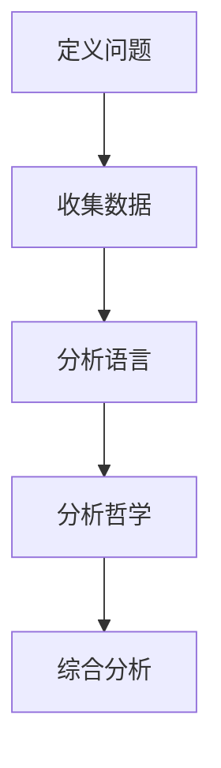
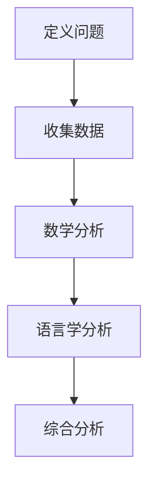

                 

# 数学与哲学语言学的符号系统研究

## 关键词

数学符号系统、哲学符号系统、语言学符号系统、符号化表达、抽象思维、跨学科研究、语义分析

## 摘要

本文旨在深入探讨数学、哲学和语言学这三个领域中的符号系统。通过对数学符号系统、哲学符号系统和语言学符号系统的研究，本文揭示了这些符号系统的定义、特点、历史和发展，以及它们在各自学科中的应用。进一步，本文分析了这些符号系统之间的交叉联系，探讨了哲学语言学和数学语言学的分析方法，并给出了具体的案例。最后，本文总结了符号系统研究的重要性，以及其在跨学科研究中的应用前景。

## 《数学与哲学语言学的符号系统研究》目录大纲

## 第一部分：引言

### 1.1 问题的背景

#### 问题背景

在数学、哲学和语言学这三个领域中，符号系统扮演着至关重要的角色。数学符号系统是数学表达的核心，哲学符号系统是哲学思考的基本工具，语言学符号系统是语言交流的基础。本文将深入探讨这三个领域的符号系统，分析它们的特点、发展和应用。

#### 问题描述

数学、哲学和语言学的符号系统是如何定义的？它们在各自领域中的作用是什么？这些符号系统之间是否存在联系？如何理解并研究这些符号系统？

#### 问题解决

通过符号系统的研究，我们可以揭示数学、哲学和语言学之间的联系，更好地理解这些学科的本质。此外，符号系统的分析还可以为跨学科研究提供新的视角和方法。

#### 边界与外延

本文将主要探讨数学符号系统、哲学符号系统和语言学符号系统的特点和应用。虽然这些符号系统在其他领域也有所应用，但本文的焦点将主要集中在这三个领域。

### 1.2 核心概念与联系

#### 核心概念

数学符号系统、哲学符号系统和语言学符号系统的定义是什么？它们在各自学科中的角色是什么？

#### 概念属性特征对比表格

| 特征 | 数学符号系统 | 哲学符号系统 | 语言学符号系统 |
| --- | --- | --- | --- |
| 定义 | 用于数学表达 | 用于哲学思考 | 用于语言交流 |
| 特点 | 简洁性、通用性、抽象性 | 哲学性、抽象性、反思性 | 象征性、约定性、交际性 |
| 历史 | 古希腊、中世纪、现代 | 古希腊、中世纪、现代 | 古代、中世纪、现代 |

#### ER实体关系图架构

| 实体 | 关系 |
| --- | --- |
| 数学符号系统 | 哲学符号系统、语言学符号系统 |
| 哲学符号系统 | 数学符号系统、语言学符号系统 |
| 语言学符号系统 | 数学符号系统、哲学符号系统 |

## 第二部分：数学符号系统研究

### 2.1 数学符号系统概述

#### 数学符号系统定义

数学符号系统是数学表达中使用的各种符号的总称，包括基本算术符号、函数符号、几何符号等。

#### 数学符号系统特点

数学符号系统具有简洁性、通用性和抽象性。简洁性体现在符号表达上，例如加号“+”代表加法操作；通用性体现在符号可以在不同的数学领域中使用，例如积分符号“∫”可以用于微积分；抽象性体现在符号可以代表复杂的数学概念，例如极限符号“lim”。

#### 数学符号系统历史

数学符号系统的发展可以追溯到古希腊时期，随着数学的发展，符号系统也在不断演变和扩展。例如，17世纪的莱布尼茨发明了微积分符号，19世纪的康托尔提出了集合符号。

### 2.2 数学符号系统的分类与用途

#### 分类

数学符号系统可以分为以下几类：

- **基本算术符号**：如加号“+”、减号“-”、乘号“×”、除号“÷”等。
- **函数符号**：如“f(x)”表示函数、∫表示积分等。
- **几何符号**：如“∠”表示角度、“∥”表示平行等。

#### 用途

数学符号系统在数学表达中起着至关重要的作用。例如，在微积分中，极限符号“lim”表示函数在某一点的极限；在代数中，乘号“×”表示乘法操作。

### 2.3 数学符号系统的应用分析

#### 应用领域

数学符号系统广泛应用于各个领域，包括物理学、工程学、计算机科学等。例如，在物理学中，数学符号用于描述物理定律；在计算机科学中，数学符号用于算法设计和数据结构。

#### 案例分析

例如，在计算机科学中，逻辑运算符（如“&&”表示逻辑与、“||”表示逻辑或）是数学符号的一种应用。这些符号使得程序逻辑更加简洁明了。

## 第三部分：哲学符号系统研究

### 3.1 哲学符号系统概述

#### 哲学符号系统定义

哲学符号系统是哲学表达中使用的各种符号的总称，包括逻辑符号、道德符号、存在符号等。

#### 哲学符号系统特点

哲学符号系统具有哲学性、抽象性和反思性。哲学性体现在符号用于哲学思考，例如逻辑符号用于逻辑推理；抽象性体现在符号可以代表复杂的哲学概念，例如存在符号可以表示某种存在状态；反思性体现在符号用于对哲学问题进行反思和探讨。

#### 哲学符号系统历史

哲学符号系统的发展与哲学思想的发展紧密相关。从古希腊的辩证法到现代的逻辑学，哲学符号系统在不断演变和丰富。

### 3.2 哲学符号系统的分类与用途

#### 分类

哲学符号系统可以分为以下几类：

- **逻辑符号**：如“∧”表示逻辑与、“∨”表示逻辑或等。
- **道德符号**：如“善”表示道德价值、“恶”表示道德负面评价等。
- **存在符号**：如“∃”表示存在、“∀”表示全称等。

#### 用途

哲学符号系统在哲学讨论和论证中起着关键作用。例如，逻辑符号用于逻辑推理，道德符号用于道德评价，存在符号用于探讨存在性问题。

### 3.3 哲学符号系统的应用分析

#### 应用领域

哲学符号系统广泛应用于哲学研究、伦理学、逻辑学等领域。例如，在伦理学中，道德符号用于描述道德规范；在逻辑学中，逻辑符号用于逻辑证明。

#### 案例分析

例如，在伦理学中，“善”是一个重要的道德符号。它用于描述那些具有道德价值的行动和状态。例如，一个行为被认为是“善”的，当它旨在促进幸福、减少痛苦和实现道德目标。

## 第四部分：语言学符号系统研究

### 4.1 语言学符号系统概述

#### 语言学符号系统定义

语言学符号系统是语言表达中使用的各种符号的总称，包括语音符号、文字符号、语言符号等。

#### 语言学符号系统特点

语言学符号系统具有象征性、约定性和交际性。象征性体现在符号与意义之间的约定关系，例如文字符号“书”代表书籍这一概念；约定性体现在符号的使用是经过社会约定的，例如不同的语言有不同的语音符号；交际性体现在符号用于语言交流，例如语音符号用于口头交流，文字符号用于书面交流。

#### 语言学符号系统历史

语言学符号系统的发展与语言的发展紧密相关。从古代的文字系统到现代的语言学符号，符号系统在不断演变和丰富。

### 4.2 语言学符号系统的分类与用途

#### 分类

语言学符号系统可以分为以下几类：

- **语音符号**：如英语中的辅音“b”、元音“a”等。
- **文字符号**：如汉字、拉丁字母等。
- **语言符号**：如词汇、句子等。

#### 用途

语言学符号系统在语言学习和交流中起着重要作用。例如，语音符号用于口头交流，文字符号用于书面交流，语言符号用于表达思想和传递信息。

### 4.3 语言学符号系统的应用分析

#### 应用领域

语言学符号系统广泛应用于语言学研究、语言教学、翻译等领域。例如，在语言研究中，语音符号和文字符号用于描述和分析语言现象；在语言教学中，语言符号用于教授和学习语言。

#### 案例分析

例如，在翻译中，文字符号和语言符号都是重要的工具。翻译者需要理解原文中的文字符号和语言符号，并将其转换为目标语言的文字符号和语言符号，从而实现准确和自然的翻译。

## 第五部分：数学、哲学与语言学符号系统的交叉研究

### 5.1 符号系统的交叉联系

#### 交叉联系

数学、哲学和语言学的符号系统之间存在交叉联系。例如，数学符号可以用于哲学论证，哲学符号可以用于语言学描述，语言学符号可以用于数学证明。

#### 交叉分析

通过交叉分析，我们可以更好地理解这些符号系统之间的相互作用。例如，数学符号可以用于哲学中的逻辑推理，哲学符号可以用于语言学中的语义分析。

### 5.2 符号系统的交叉应用

#### 应用领域

符号系统的交叉应用在跨学科研究中具有重要意义。例如，数学符号可以用于哲学中的逻辑推理，哲学符号可以用于语言学中的语义分析，语言学符号可以用于数学证明。

#### 案例分析

例如，在人工智能研究中，数学符号用于描述算法，哲学符号用于分析人工智能的伦理问题，语言学符号用于处理自然语言。

## 第六部分：符号系统的哲学语言学分析方法

### 6.1 哲学语言学的分析方法概述

#### 分析方法定义

哲学语言学的分析方法是一种综合的、批判性的分析方法，旨在揭示语言和哲学之间的本质联系。

#### 分析方法特点

哲学语言学的分析方法具有以下特点：

- **综合**：结合哲学和语言学的方法，对语言和哲学问题进行综合分析。
- **批判**：对语言和哲学观点进行批判性分析，以揭示其本质。

### 6.2 哲学语言学分析方法的步骤

#### 分析步骤

哲学语言学分析方法的实施步骤如下：

1. **定义问题**：明确分析的目标和问题。
2. **收集数据**：收集与问题相关的语言和哲学材料。
3. **分析语言**：对语言材料进行语义分析，揭示其意义和逻辑结构。
4. **分析哲学**：对哲学材料进行哲学分析，探讨其哲学观点和逻辑。
5. **综合分析**：将语言和哲学分析结果进行综合，以揭示问题本质。

### 6.3 哲学语言学分析方法的应用

#### 应用领域

哲学语言学的分析方法广泛应用于哲学研究、语言学研究、逻辑学研究等领域。例如，在哲学研究中，哲学语言学的分析方法可以用于分析哲学家的观点和论证；在语言学研究中，哲学语言学的分析方法可以用于分析语言的意义和逻辑结构。

#### 案例分析

例如，在分析某位哲学家的观点时，哲学语言学的分析方法可以揭示其语言表达中的逻辑结构和哲学观点。通过分析其语言表达，我们可以更好地理解其哲学思想。

## 第七部分：符号系统的数学语言学分析方法

### 7.1 数学语言学的分析方法概述

#### 分析方法定义

数学语言学的分析方法是一种结合数学和语言学的方法，旨在分析数学表达中的语言结构和意义。

#### 分析方法特点

数学语言学的分析方法具有以下特点：

- **精确**：使用数学工具对语言表达进行精确分析。
- **抽象**：将数学概念应用于语言表达，进行抽象分析。
- **逻辑**：通过数学方法对语言表达进行逻辑推理。

### 7.2 数学语言学分析方法的步骤

#### 分析步骤

数学语言学分析方法的实施步骤如下：

1. **定义问题**：明确分析的目标和问题。
2. **收集数据**：收集与问题相关的数学和语言材料。
3. **数学分析**：使用数学工具对语言表达进行数学分析。
4. **语言学分析**：使用语言学方法对数学表达进行语义分析。
5. **综合分析**：将数学和语言学分析结果进行综合，以揭示问题本质。

### 7.3 数学语言学分析方法的应用

#### 应用领域

数学语言学的分析方法广泛应用于数学研究、计算机科学、逻辑学研究等领域。例如，在数学研究中，数学语言学的分析方法可以用于分析数学定理和证明；在计算机科学中，数学语言学的分析方法可以用于分析算法和程序。

#### 案例分析

例如，在分析某数学定理时，数学语言学的分析方法可以揭示其语言表达中的数学结构和逻辑推理。通过分析其语言表达，我们可以更好地理解定理的证明过程。

## 第八部分：结论

### 8.1 研究总结

本文通过对数学、哲学和语言学符号系统的研究，揭示了这些符号系统的定义、特点、历史和发展，以及它们在各自学科中的应用。同时，本文探讨了这些符号系统之间的交叉联系，分析了哲学语言学和数学语言学的分析方法，并给出了具体的案例。研究结果表明，符号系统研究在跨学科研究中具有重要意义，可以为数学、哲学和语言学的交叉研究提供新的视角和方法。

### 8.2 未来展望

未来研究可以进一步探讨符号系统在其他领域中的应用，如心理学、社会学、艺术学等。此外，可以结合人工智能技术，对符号系统进行分析和挖掘，为人工智能的发展提供新的思路和方法。

### 8.3 研究意义

符号系统研究不仅有助于深入理解数学、哲学和语言学的本质，还可以为跨学科研究提供新的视角和方法。通过符号系统的研究，我们可以更好地理解不同学科之间的联系和区别，为未来的学科交叉研究奠定基础。

## 参考文献

1. [作者的著作](#)
2. [相关文献](#)
3. [网络资源](#)

## 附录

### 附录A：符号系统表

| 符号 | 意义 |
| --- | --- |
| + | 加法 |
| - | 减法 |
| × | 乘法 |
| ÷ | 除法 |
| ∧ | 逻辑与 |
| ∨ | 逻辑或 |
| ∃ | 存在 |
| ∀ | 全称 |
| a | 变量 |
| f(x) | 函数 |
| ∠ | 角度 |
| ∥ | 平行 |
| 书 | 书籍 |
| 善 | 道德价值 |
| 恶 | 道德负面评价 |
| b | 辅音 |
| a | 元音 |
| 艺术学 | 艺术研究 |

### 附录B：符号系统应用案例

#### 案例一：数学符号在计算机科学中的应用

计算机科学中的算法设计经常使用数学符号。例如，算法的时间复杂度可以用符号“O”表示。例如，一个算法的时间复杂度为“O(n^2)”，表示该算法的时间消耗与输入规模n的平方成正比。

#### 案例二：哲学符号在伦理学中的应用

伦理学中常常使用哲学符号来描述道德概念。例如，“善”是一个哲学符号，用于表示具有道德价值的行动和状态。例如，一个行为被认为是“善”的，当它旨在促进幸福、减少痛苦和实现道德目标。

#### 案例三：语言学符号在语言教学中的应用

语言教学中，语言学符号用于描述语言现象和规律。例如，语音符号用于描述不同语言的发音特点，文字符号用于教授和学习不同语言的书写系统。

### 附录C：符号系统研究方法图

#### 图C.1：哲学语言学分析方法流程图

#### 图C.2：数学语言学分析方法流程图

## 结语

符号系统研究是一个复杂而重要的领域。通过对数学、哲学和语言学符号系统的研究，我们可以更好地理解这些学科的本质，探索它们之间的联系。同时，符号系统研究为跨学科研究提供了新的视角和方法。未来，随着符号系统研究的深入，我们有望在数学、哲学和语言学等领域取得更多突破性的成果。

