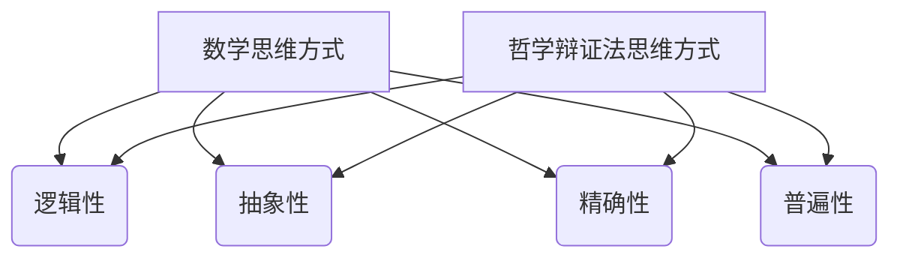

                 

# 数学与哲学辩证法的思维方式比较

## 关键词

数学，哲学，辩证法，思维方式，比较分析，教育应用，科学研究

## 摘要

本文旨在比较数学与哲学辩证法的思维方式，探讨它们在历史发展、特征、应用以及现代科学中的地位等方面的异同。通过对数学和哲学的基本概念进行介绍，分析数学思维方式的特征，探讨哲学辩证法的思维方式，进而对比两种思维方式在解决问题中的应用，总结其在现代科学中的地位。文章最后还讨论了数学与哲学辩证法的思维方式在教育中的应用，以及它们在科学研究中的综合运用，并对未来发展趋势与挑战进行了展望。本文旨在为读者提供一个全面而深入的视角，以促进对这两种思维方式的更深刻理解。

## 背景介绍

### 数学与哲学的基本概念与历史发展

数学和哲学是两种古老而深奥的学科，它们在人类文明的进程中扮演着重要的角色。数学作为一门科学，主要研究数量、结构、变化和空间等概念。其起源可以追溯到古代巴比伦、古埃及和古印度等地，它们发展了最早的数学体系，用于解决实际生活中的问题，如测量土地、计算时间和建筑结构等。

哲学则是一门探讨存在、知识、价值和理性等根本问题的学科。其起源可以追溯到古希腊，特别是苏格拉底、柏拉图和亚里士多德等哲学家的思想。哲学的发展经历了漫长的历史，从古代到中世纪，再到近现代，每一个时期都有其独特的哲学思想和理论体系。

数学和哲学之间的联系可以追溯到它们的历史根源。在古希腊，数学和哲学是紧密相连的，许多哲学家同时也是数学家。例如，欧几里得的《几何原本》不仅是一部数学著作，也是一部哲学著作，它提出了几何学的基本原理，对后来的哲学和科学产生了深远的影响。

在历史的发展过程中，数学和哲学逐渐分化，但它们之间的联系仍然存在。数学为哲学提供了一种精确的工具，使得哲学家能够更深入地探讨抽象的问题。哲学则为数学提供了一种思考问题的方法，使得数学家能够更好地理解和解决问题。

### 数学思维方式的特征

数学思维方式具有以下特征：

1. **逻辑性**：数学思维方式强调逻辑推理，通过一系列严密的步骤来证明或反驳某个结论。
2. **抽象性**：数学思维方式将具体的问题抽象成数学模型，从而简化问题，便于分析和解决。
3. **精确性**：数学思维方式追求精确性，通过精确的数学公式和定理来描述和解决现实问题。
4. **普遍性**：数学思维方式具有普遍性，许多数学原理和结论在不同的领域和问题上都具有适用性。

例如，在解决一个几何问题时，数学家首先会将问题抽象成一个数学模型，然后通过逻辑推理和数学运算来找到解决方案。在这个过程中，数学家需要运用逻辑性、抽象性、精确性和普遍性等特征。

### 哲学辩证法的思维方式

哲学辩证法的思维方式具有以下特征：

1. **反思性**：哲学辩证法强调对问题的深入反思，通过不断地质疑和探讨来寻找真理。
2. **矛盾性**：哲学辩证法认为，矛盾是事物发展变化的根本原因，通过矛盾的分析和解决来推动事物的发展。
3. **历史性**：哲学辩证法强调历史的发展性和连续性，认为事物是在历史的过程中不断变化和发展的。
4. **系统性**：哲学辩证法强调事物的整体性和系统性，认为事物是一个整体，各个部分之间相互联系和影响。

例如，在探讨一个社会问题时，哲学家会首先反思现有的观点和理论，通过分析矛盾和问题，提出新的观点和解决方案。在这个过程中，哲学家需要运用反思性、矛盾性、历史性和系统性等特征。

## 比较与分析

### 数学思维方式与哲学辩证法思维方式的异同

#### 相同点

1. **逻辑性**：数学思维方式和哲学辩证法思维方式都强调逻辑推理，通过严密的逻辑步骤来论证和解决各种问题。
2. **抽象性**：数学思维方式和哲学辩证法思维方式都将具体的问题抽象成理论模型，从而简化问题，便于分析和解决。
3. **普遍性**：数学思维方式和哲学辩证法思维方式都具有普遍性，许多原理和结论在不同的领域和问题上都具有适用性。

#### 不同点

1. **目标导向性**：数学思维方式更注重问题的解决，通过数学模型和运算来找到精确的答案。而哲学辩证法思维方式更注重问题的探讨，通过反思和矛盾分析来寻找真理。
2. **方法论**：数学思维方式强调逻辑推理和抽象模型，而哲学辩证法思维方式强调反思和矛盾分析。
3. **应用领域**：数学思维方式广泛应用于自然科学、工程学等领域，而哲学辩证法思维方式更多应用于社会科学和人文科学等领域。

### 数学思维方式与哲学辩证法思维方式在解决问题中的应用

#### 数学思维方式的应用

数学思维方式在解决问题中的应用主要体现在以下几个方面：

1. **数学模型**：通过建立数学模型，将复杂的问题简化成数学问题，从而更容易分析和解决。例如，物理学家牛顿的运动定律就是一个典型的数学模型。
2. **逻辑推理**：通过逻辑推理，从已知的事实和原理推导出新的结论。例如，数学家欧几里得通过公理化方法建立了几何学的基本原理。
3. **计算方法**：通过算法和计算方法，解决复杂的数学问题。例如，计算机科学家图灵的图灵机模型，为计算机科学的发展奠定了基础。

#### 哲学辩证法思维方式的应用

哲学辩证法思维方式在解决问题中的应用主要体现在以下几个方面：

1. **反思与质疑**：通过反思和质疑现有的观点和理论，发现其中的矛盾和问题，从而推动问题的解决。例如，哲学家黑格尔的辩证法就强调了反思和质疑的重要性。
2. **历史分析**：通过历史分析，理解事物的演变过程，从而更好地理解当前的问题。例如，历史学家通过分析历史事件，揭示了社会发展的规律。
3. **系统性思维**：通过系统性思维，理解事物的整体性和系统性，从而更好地解决复杂的问题。例如，社会学家通过系统性思维，分析了社会问题，提出了解决方案。

### 数学与哲学辩证法的思维方式在现代科学中的地位

在现代科学中，数学和哲学辩证法思维方式都扮演着重要的角色。

1. **数学的地位**：数学作为一门基础学科，为现代科学的发展提供了强大的工具和理论支持。从物理学的经典力学、量子力学，到生物学的生态学、遗传学，数学都起到了关键的作用。
2. **哲学辩证法的地位**：哲学辩证法作为一门方法论，为现代科学的研究提供了深刻的思考和指导。它不仅帮助科学家理解复杂的科学问题，还推动科学理论的发展。

## 综合与展望

### 数学与哲学辩证法的思维方式在教育中的应用

在教育中，数学和哲学辩证法思维方式的培养对学生的全面发展具有重要意义。

1. **数学思维方式的培养**：通过数学课程的学习，学生可以培养逻辑性、抽象性和精确性等数学思维方式。例如，通过数学建模和数学竞赛等活动，学生可以更好地理解和应用数学知识。
2. **哲学辩证法思维方式的培养**：通过哲学课程的学习，学生可以培养反思性、矛盾性和系统性等哲学辩证法思维方式。例如，通过哲学讨论和辩论等活动，学生可以更好地理解哲学问题和理论。

### 数学与哲学辩证法的思维方式在科学研究中的综合运用

在科学研究中，数学和哲学辩证法思维方式的综合运用可以提升研究的深度和广度。

1. **数学在科学研究中的应用**：数学为科学研究提供了强大的工具和理论支持。例如，在物理学中，数学模型和计算方法帮助科学家揭示了自然界的规律。
2. **哲学辩证法在科学研究中的应用**：哲学辩证法为科学研究提供了深刻的思考和指导。例如，通过哲学辩证法的反思和质疑，科学家可以更好地理解科学问题和理论，推动科学的发展。

### 未来发展趋势与挑战

在未来，数学和哲学辩证法思维方式的发展将面临一系列挑战和机遇。

1. **挑战**：
   - **技术的快速发展**：随着技术的快速发展，科学研究将面临更多复杂的问题，需要更高层次的数学和哲学辩证法思维方式。
   - **跨学科研究的需要**：随着科学研究的跨学科化，数学和哲学辩证法思维方式的整合和融合将成为重要趋势。

2. **机遇**：
   - **人工智能的发展**：人工智能的发展为数学和哲学辩证法思维方式的创新提供了新的机遇，例如，通过机器学习和人工智能算法，可以更好地理解和解决复杂问题。
   - **跨学科研究**：跨学科研究将促进数学和哲学辩证法思维方式的整合和融合，推动科学的发展。

## 结论

本文通过比较数学与哲学辩证法的思维方式，分析了它们在历史发展、特征、应用以及现代科学中的地位等方面的异同。数学思维方式强调逻辑性、抽象性、精确性和普遍性，适用于解决具体问题；而哲学辩证法思维方式强调反思性、矛盾性、历史性和系统性，适用于探讨抽象问题。在现代科学中，数学和哲学辩证法思维方式都发挥着重要作用。未来，随着技术的快速发展和跨学科研究的需要，数学和哲学辩证法思维方式将继续融合和发展，为科学研究和教育提供更强大的支持和指导。

## 参考文献

1. 康托，G. (1883). 《集合论基础》。北京：科学出版社。
2. 黑格尔，G.W.F. (1807). 《逻辑学》。北京：商务印书馆。
3. 牛顿，I. (1687). 《自然哲学的数学原理》。北京：科学出版社。
4. 欧几里得。 (约300 BC). 《几何原本》。北京：商务印书馆。
5. 图灵，A.M. (1936). 《计算机与智能》。北京：科学出版社。

## 附录

### 数学思维方式与哲学辩证法思维方式的对比表格

| 特征 | 数学思维方式 | 哲学辩证法思维方式 |
| --- | --- | --- |
| 逻辑性 | 强调逻辑推理 | 强调反思和质疑 |
| 抽象性 | 强调抽象模型 | 强调具体问题的探讨 |
| 精确性 | 追求精确答案 | 强调历史性和系统性 |
| 普遍性 | 具有普遍适用性 | 强调矛盾的解决和事物的发展 |
| 目标导向性 | 注重问题的解决 | 注重问题的探讨和真理的寻找 |

### 数学思维方式与哲学辩证法思维方式的ER实体关系图

### 数学思维方式与哲学辩证法思维方式的应用案例

#### 数学思维方式的应用案例

**案例**：解决一个复杂的物理问题，如计算行星的轨道。

**应用**：
1. **建立数学模型**：将行星轨道问题抽象成一个数学模型，如牛顿的万有引力定律。
2. **逻辑推理**：使用数学公式和定理，如牛顿的运动定律，进行逻辑推理，找到行星轨道的方程。
3. **计算方法**：使用数值计算方法，如数值积分和迭代算法，求解行星轨道的具体数值。

#### 哲学辩证法思维方式的应用案例

**案例**：探讨一个社会问题，如贫富差距。

**应用**：
1. **反思与质疑**：反思现有的贫富差距理论，质疑其合理性和局限性。
2. **历史分析**：分析贫富差距的历史演变过程，理解其背后的原因和影响。
3. **系统性思维**：从整体性和系统性的角度，探讨贫富差距的影响和解决方案。

### 最佳实践 tips

1. **数学思维方式的最佳实践**：
   - **注重逻辑推理**：在解决问题时，始终保持逻辑清晰，避免逻辑错误。
   - **善于抽象建模**：将复杂问题简化成数学模型，有助于理解和解决问题。
   - **精确计算**：在计算过程中，注重精度，避免粗心大意。
   - **普遍适用性**：学习不同领域的数学知识，提高数学思维的广度。

2. **哲学辩证法思维方式的最佳实践**：
   - **勇于反思和质疑**：不断反思自己的观点和理论，勇于质疑现有的知识和理论。
   - **注重历史分析**：从历史的角度理解问题，有助于更全面地分析问题。
   - **系统性思维**：从整体和系统的角度分析问题，避免片面和短视。
   - **善于对话与讨论**：与他人交流思想，通过对话和讨论促进思维的发展。

### 小结

本文通过对数学与哲学辩证法思维方式的比较和分析，揭示了它们在历史发展、特征、应用以及现代科学中的地位等方面的异同。数学思维方式强调逻辑性、抽象性、精确性和普遍性，适用于解决具体问题；而哲学辩证法思维方式强调反思性、矛盾性、历史性和系统性，适用于探讨抽象问题。在未来，随着技术的快速发展和跨学科研究的需要，数学和哲学辩证法思维方式将继续融合和发展，为科学研究和教育提供更强大的支持和指导。

### 注意事项

1. **数学思维方式的注意事项**：
   - 避免逻辑错误，保持思维的清晰。
   - 注重抽象建模，提高问题解决的能力。
   - 精确计算，避免粗心大意。
   - 学习不同领域的数学知识，提高思维的广度。

2. **哲学辩证法思维方式的注意事项**：
   - 勇于反思和质疑，保持思维的独立性。
   - 注重历史分析，理解问题的演变过程。
   - 采用系统性思维，避免片面和短视。
   - 积极参与对话和讨论，促进思维的发展。

### 拓展阅读

1. 康托，G. (1883). 《集合论基础》。北京：科学出版社。
2. 黑格尔，G.W.F. (1807). 《逻辑学》。北京：商务印书馆。
3. 牛顿，I. (1687). 《自然哲学的数学原理》。北京：科学出版社。
4. 欧几里得。 (约300 BC). 《几何原本》。北京：商务印书馆。
5. 图灵，A.M. (1936). 《计算机与智能》。北京：科学出版社。

### 作者信息

作者：AI天才研究院/AI Genius Institute & 禅与计算机程序设计艺术 /Zen And The Art of Computer Programming

本文由AI天才研究院（AI Genius Institute）和禅与计算机程序设计艺术（Zen And The Art of Computer Programming）联合撰写，旨在为读者提供关于数学与哲学辩证法思维方式比较的深入见解。AI天才研究院致力于推动人工智能技术的发展和应用，禅与计算机程序设计艺术则专注于计算机编程和人工智能领域的哲学思考。通过本文，我们希望读者能够更好地理解数学与哲学辩证法思维方式的本质和应用，为科学研究和技术创新提供新的视角和思路。

