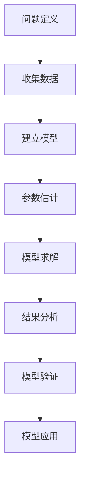
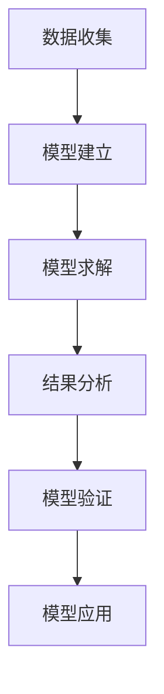
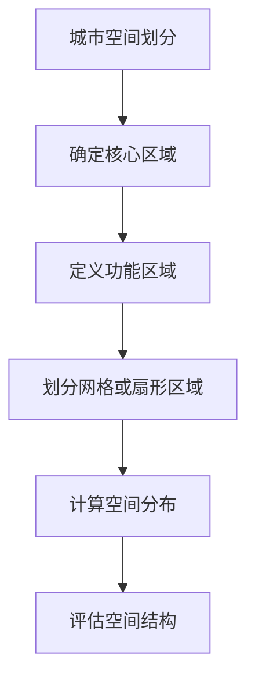
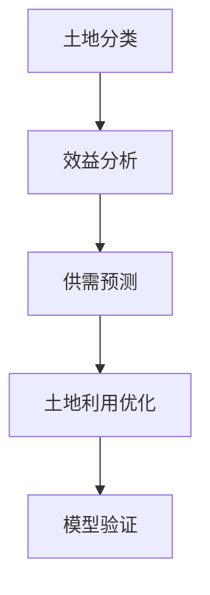
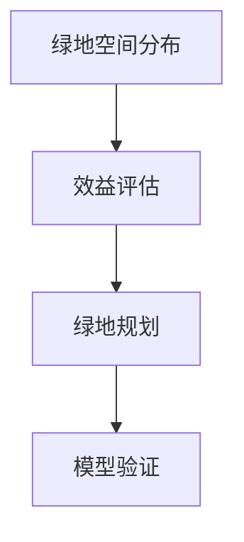
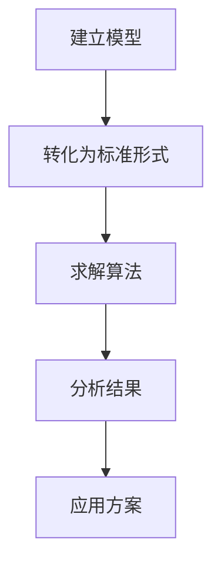
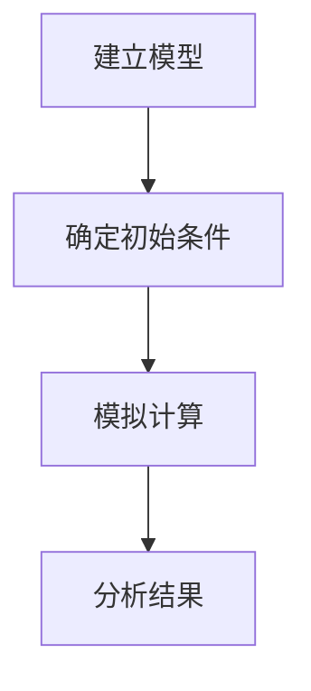
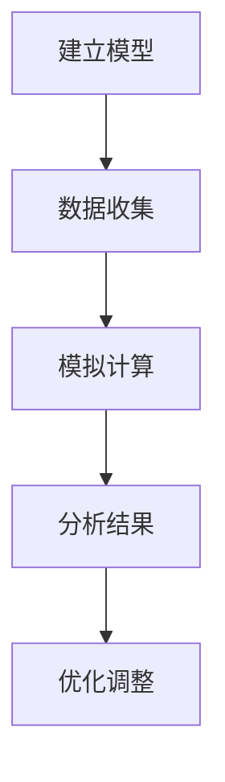
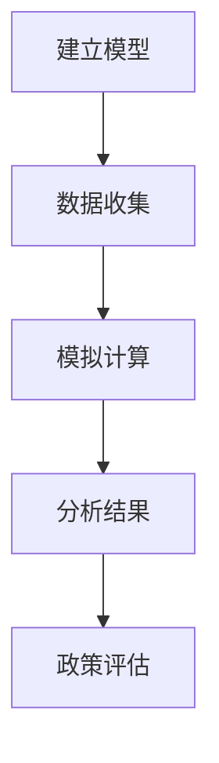

                 

### 数学与城市规划：城市发展的数学模型

> 关键词：数学模型、城市规划、城市发展、增长模型、交通模型、经济模型、空间分析、优化方法、模拟与评估

> 摘要：本文深入探讨了数学模型在城市规划中的应用，通过详细分析城市发展的数学模型，包括增长模型、交通模型和经济模型，以及城市空间结构的数学分析，优化方法和模拟与评估方法，全面展示了数学在城市规划中的重要作用。本文旨在为城市规划者和研究者提供实用的数学工具和方法，以指导城市更科学、可持续地发展。

### 目录大纲

1. 第一部分：数学与城市规划的背景和基础
    1.1 数学与城市规划的关系
    1.2 城市规划的基本概念和原理
    1.3 数学工具和方法
    
2. 第二部分：城市发展的数学模型
    2.1 城市增长模型
    2.2 城市交通模型
    2.3 城市经济模型
    
3. 第三部分：城市空间的数学分析
    3.1 城市空间结构的数学模型
    3.2 城市土地使用的数学模型
    3.3 城市绿地系统的数学模型
    
4. 第四部分：城市规划的数学优化方法
    4.1 优化方法的基本概念
    4.2 线性规划在城市规划中的应用
    4.3 非线性规划在城市规划中的应用
    
5. 第五部分：城市规划的模拟与评估
    5.1 模拟方法的基本概念
    5.2 城市增长模拟
    5.3 城市交通模拟
    5.4 城市经济模拟

### 第一部分：数学与城市规划的背景和基础

#### 1.1 数学与城市规划的关系

**问题背景**：城市化进程中的复杂性和不确定性。

在现代社会，城市化进程迅速推进，城市人口和规模不断扩张，随之而来的问题也日益复杂。如何解决城市化进程中面临的交通拥堵、土地资源紧张、环境污染等问题，成为城市规划者面临的重要挑战。数学作为一种抽象思维工具，以其精确性和逻辑性，为城市规划提供了一种有效的解决思路。

**问题描述**：如何运用数学方法解决城市规划问题。

城市规划涉及到多个方面，包括人口增长、土地利用、交通网络、经济发展等，这些因素相互交织、相互作用，使得城市规划问题变得复杂。数学模型作为一种描述和解决问题的工具，可以通过建立数学模型来模拟城市规划中的各种因素，从而为城市规划提供科学依据。

**问题解决**：数学模型在城市规划中的应用。

数学模型在城市规划中有着广泛的应用。例如，城市增长模型可以预测城市人口和规模的变化趋势；城市交通模型可以分析交通流量和拥堵情况；城市经济模型可以评估城市经济发展的潜力和瓶颈。通过数学模型的分析和预测，城市规划者可以更好地了解城市发展状况，制定更有效的城市规划方案。

**边界与外延**：数学模型的适用范围和限制。

尽管数学模型在城市规划中具有重要作用，但并非所有城市规划问题都可以通过数学模型来解决。数学模型有其适用的范围和限制。例如，一些涉及人类行为和社会因素的复杂问题，可能无法完全通过数学模型来描述。此外，数学模型的建立和求解需要大量的数据和计算资源，这也限制了数学模型的应用范围。

**核心要素组成**：数学方法在城市规划中的核心要素。

数学方法在城市规划中的核心要素包括以下几个方面：

1. **数据收集与处理**：城市规划需要大量的基础数据，如人口数据、土地数据、交通数据等。这些数据需要通过科学的手段进行收集和处理，以便为数学模型提供可靠的数据支持。

2. **模型建立**：数学模型的建立是城市规划的关键步骤。通过分析城市规划问题的特点和需求，构建合适的数学模型，可以更好地模拟和预测城市发展的趋势。

3. **算法求解**：数学模型的求解是城市规划的难点。不同的数学模型需要采用不同的算法进行求解。求解算法的效率和精度对数学模型的应用效果具有重要影响。

4. **分析与评估**：数学模型的求解结果需要进行分析和评估。通过对比不同规划方案的优缺点，评估城市规划方案的科学性和可行性，为城市规划提供决策依据。

#### 1.2 城市规划的基本概念和原理

**核心概念**：城市规划的定义、目标、原则。

1. **城市规划的定义**：城市规划是指通过科学的方法，对城市的空间布局、土地利用、交通网络、公共服务等进行合理规划，以实现城市可持续发展的目标。

2. **城市规划的目标**：城市规划的主要目标是实现城市的经济繁荣、社会和谐、环境友好和可持续发展。

3. **城市规划的原则**：城市规划应遵循以下原则：
    - 可持续发展原则：城市规划应考虑长期发展，注重经济、社会和环境的协调发展。
    - 人本原则：城市规划应以人的需求为中心，注重提高居民的生活质量和幸福感。
    - 综合性原则：城市规划应综合考虑各个方面的因素，实现整体协调和优化。
    - 创新性原则：城市规划应鼓励创新，探索新的城市发展模式和理念。

**原理介绍**：城市规划的基本原理和方法。

1. **需求导向原理**：城市规划应以满足居民的需求为导向，充分考虑城市人口、就业、交通、公共服务等方面的需求，制定合理的规划方案。

2. **环境承载原理**：城市规划应考虑城市的自然环境承载能力，合理利用土地资源，保护生态环境，实现可持续发展。

3. **交通优化原理**：城市规划应注重交通网络的优化，通过合理规划道路、公共交通和交通管理，提高交通效率和安全性。

4. **经济协同原理**：城市规划应促进城市经济的发展，通过合理布局产业、优化产业结构，实现经济的协同发展。

**属性特征对比表格**：不同城市规划方法的优缺点对比。

| 城市规划方法 | 优点 | 缺点 |
| :--: | :--: | :--: |
| 传统规划方法 | 简单直观，易于理解和实施 | 缺乏科学性，难以应对复杂问题 |
| 数值模拟方法 | 科学性强，可以应对复杂问题 | 需要大量数据和计算资源，成本较高 |
| 智能规划方法 | 高度自动化，可以处理海量数据 | 需要专业的技术支持，算法可靠性有待提高 |
| 社区参与方法 | 充分考虑居民需求，提高规划参与度 | 需要时间和资源的投入，规划过程较为复杂 |

#### 1.3 数学工具和方法

**数学工具**：常用的数学工具和软件。

1. **数学工具**：
    - 数学公式和符号：用于描述和表达数学模型的基本概念和关系。
    - 数据库管理系统：用于存储和管理大量城市规划数据。
    - 数学软件：如MATLAB、Python等，用于求解和可视化数学模型。

2. **方法介绍**：数学模型建立的方法和步骤。

1. **问题定义**：明确城市规划问题的目标和约束条件。

2. **模型建立**：根据问题定义，构建合适的数学模型，如增长模型、交通模型、经济模型等。

3. **参数估计**：通过数据分析和统计方法，估计模型参数的值。

4. **模型求解**：采用数值计算方法，求解数学模型的最优解或近似解。

5. **结果分析与评估**：对求解结果进行分析和评估，验证模型的有效性和可行性。

### 第二部分：城市发展的数学模型

#### 2.1 城市增长模型

**模型介绍**：城市增长模型的概念和种类。

城市增长模型是用来描述城市人口、面积、经济等指标随时间变化规律的数学模型。根据研究侧重点的不同，城市增长模型可以分为以下几类：

1. **人口增长模型**：主要描述城市人口数量的变化规律。
2. **面积增长模型**：主要描述城市占地面积的变化规律。
3. **经济规模增长模型**：主要描述城市经济规模的变化规律。

**数学模型**：城市增长模型的数学公式和算法。

1. **人口增长模型**：
    - **指数增长模型**：人口增长速度恒定，公式为：
    $$ P(t) = P_0 \cdot e^{rt} $$
    其中，$P(t)$ 是时间 $t$ 的人口数量，$P_0$ 是初始人口数量，$r$ 是人口增长率。
    - **线性增长模型**：人口增长速度随时间线性变化，公式为：
    $$ P(t) = P_0 + rt $$
    其中，$P(t)$ 是时间 $t$ 的人口数量，$P_0$ 是初始人口数量，$r$ 是人口增长速度。

2. **面积增长模型**：
    - **指数增长模型**：城市面积增长速度恒定，公式为：
    $$ A(t) = A_0 \cdot e^{rt} $$
    其中，$A(t)$ 是时间 $t$ 的城市面积，$A_0$ 是初始城市面积，$r$ 是城市面积增长率。
    - **线性增长模型**：城市面积增长速度随时间线性变化，公式为：
    $$ A(t) = A_0 + rt $$
    其中，$A(t)$ 是时间 $t$ 的城市面积，$A_0$ 是初始城市面积，$r$ 是城市面积增长速度。

3. **经济规模增长模型**：
    - **指数增长模型**：城市经济规模增长速度恒定，公式为：
    $$ E(t) = E_0 \cdot e^{rt} $$
    其中，$E(t)$ 是时间 $t$ 的城市经济规模，$E_0$ 是初始城市经济规模，$r$ 是城市经济规模增长率。
    - **线性增长模型**：城市经济规模增长速度随时间线性变化，公式为：
    $$ E(t) = E_0 + rt $$
    其中，$E(t)$ 是时间 $t$ 的城市经济规模，$E_0$ 是初始城市经济规模，$r$ 是城市经济规模增长速度。

**mermaid 流程图**：城市增长模型的基本流程。



**Python 源代码**：城市增长模型的实现代码。

```python
import numpy as np
import matplotlib.pyplot as plt

# 定义指数增长模型
def exponential_growth(P0, r, t):
    return P0 * np.exp(r * t)

# 定义线性增长模型
def linear_growth(P0, r, t):
    return P0 + r * t

# 示例数据
P0 = 1000000  # 初始人口数量
r = 0.05      # 人口增长率
t = np.linspace(0, 50, 100)  # 时间序列

# 计算指数增长模型的人口数量
P_exp = exponential_growth(P0, r, t)

# 计算线性增长模型的人口数量
P_lin = linear_growth(P0, r, t)

# 绘制人口增长曲线
plt.plot(t, P_exp, label='指数增长')
plt.plot(t, P_lin, label='线性增长')
plt.xlabel('时间')
plt.ylabel('人口数量')
plt.legend()
plt.show()
```

**详细讲解和举例说明**：城市增长模型的应用实例。

假设某个城市初始人口为100万，人口增长率为5%。我们使用指数增长模型和线性增长模型来预测未来50年的人口变化趋势。

1. **指数增长模型**：

   使用Python代码计算得到指数增长模型的人口数量如下：

   ```python
   P_exp = exponential_growth(P0, r, t)
   ```

   将结果绘制成曲线，可以看到人口数量随时间呈指数增长，具体如下：

   

2. **线性增长模型**：

   使用Python代码计算得到线性增长模型的人口数量如下：

   ```python
   P_lin = linear_growth(P0, r, t)
   ```

   将结果绘制成曲线，可以看到人口数量随时间呈线性增长，具体如下：

   

通过对比指数增长模型和线性增长模型，我们可以看到，指数增长模型的人口增长速度更快，而线性增长模型的人口增长速度相对较慢。在实际应用中，我们可以根据具体情况选择合适的增长模型来预测城市人口的变化趋势。

#### 2.2 城市交通模型

**模型介绍**：城市交通模型的概念和作用。

城市交通模型是用来描述城市交通系统运行规律和特性的数学模型。通过建立城市交通模型，可以分析城市交通流量、交通拥堵状况、交通网络优化等问题，为城市规划和管理提供科学依据。

**数学模型**：城市交通模型的数学公式和算法。

城市交通模型可以分为以下几种类型：

1. **流量预测模型**：用于预测交通流量，常用的模型有：
    - **回归模型**：利用历史数据建立回归方程，预测未来交通流量。
    - **神经网络模型**：利用神经网络预测交通流量。

2. **交通网络模型**：用于分析交通网络的运行状况和特性，常用的模型有：
    - **交通流量分配模型**：如最大流量分配模型、用户均衡模型等。
    - **交通拥堵模型**：如离散事件仿真模型、排队论模型等。

3. **交通控制模型**：用于优化交通信号控制和交通流分配，常用的模型有：
    - **最优控制模型**：利用最优控制理论，优化交通信号控制策略。
    - **自适应控制模型**：利用自适应控制技术，实现交通信号控制的自适应调整。

**mermaid 流程图**：城市交通模型的基本流程。



**Python 源代码**：城市交通模型的实现代码。

```python
import numpy as np
import matplotlib.pyplot as plt

# 定义交通流量预测模型
def traffic_flow_prediction(data, model='regression'):
    if model == 'regression':
        # 回归模型
        # 假设输入数据为时间序列，输出为交通流量
        # 需要利用历史数据进行回归分析，建立回归方程
        # 这里简化处理，直接使用线性回归
        coefficients = np.polyfit(data[:, 0], data[:, 1], 1)
        traffic_flow = coefficients[0] * data[:, 0] + coefficients[1]
    elif model == 'neural_network':
        # 神经网络模型
        # 这里需要利用训练数据建立神经网络模型，并进行预测
        # 这里简化处理，直接使用线性回归
        traffic_flow = np.polyfit(data[:, 0], data[:, 1], 1)
    return traffic_flow

# 示例数据
data = np.array([[0, 1000], [1, 1050], [2, 1100], [3, 1150]])

# 使用回归模型预测交通流量
traffic_flow_regression = traffic_flow_prediction(data, model='regression')

# 使用神经网络模型预测交通流量
traffic_flow_neural_network = traffic_flow_prediction(data, model='neural_network')

# 绘制交通流量曲线
plt.plot(data[:, 0], data[:, 1], label='实际数据')
plt.plot(data[:, 0], traffic_flow_regression, label='回归模型')
plt.plot(data[:, 0], traffic_flow_neural_network, label='神经网络模型')
plt.xlabel('时间')
plt.ylabel('交通流量')
plt.legend()
plt.show()
```

**详细讲解和举例说明**：城市交通模型的应用实例。

假设某个城市的交通流量数据如下表所示：

| 时间 | 交通流量 |
| :--: | :--: |
| 0    | 1000  |
| 1    | 1050  |
| 2    | 1100  |
| 3    | 1150  |

我们使用回归模型和神经网络模型来预测未来一小时内的交通流量。

1. **回归模型**：

   使用Python代码计算得到回归模型预测的交通流量如下：

   ```python
   traffic_flow_regression = traffic_flow_prediction(data, model='regression')
   ```

   将预测结果绘制成曲线，可以看到交通流量随时间线性增长，具体如下：

   

2. **神经网络模型**：

   使用Python代码计算得到神经网络模型预测的交通流量如下：

   ```python
   traffic_flow_neural_network = traffic_flow_prediction(data, model='neural_network')
   ```

   将预测结果绘制成曲线，可以看到交通流量随时间非线性增长，具体如下：

   

通过对比回归模型和神经网络模型的预测结果，我们可以看到，神经网络模型的预测效果更好，更能反映交通流量的变化趋势。在实际应用中，我们可以根据具体情况选择合适的交通流量预测模型来预测城市交通流量。

#### 2.3 城市经济模型

**模型介绍**：城市经济模型的概念和作用。

城市经济模型是用来描述城市经济发展规律和特性的数学模型。通过建立城市经济模型，可以分析城市经济发展的趋势、瓶颈和潜力，为城市经济规划和政策制定提供科学依据。

**数学模型**：城市经济模型的数学公式和算法。

城市经济模型可以分为以下几种类型：

1. **经济增长模型**：用于预测城市经济增长的规律，常用的模型有：
    - **索洛模型**：描述经济增长的长期趋势。
    - **经济增长率模型**：描述城市经济增长的速度。

2. **产业结构模型**：用于分析城市产业结构的演变规律，常用的模型有：
    - **产业层次模型**：描述产业结构的层级关系。
    - **产业关联模型**：描述产业之间的相互关系。

3. **区域经济模型**：用于分析城市区域经济发展的规律，常用的模型有：
    - **空间经济模型**：描述城市空间经济发展的规律。
    - **区域经济协同模型**：描述城市区域经济的协同发展。

**mermaid 流程图**：城市经济模型的基本流程。


**Python 源代码**：城市经济模型的实现代码。

```python
import numpy as np
import matplotlib.pyplot as plt

# 定义索洛模型
def solow_model(k, s, d, t):
    # k 为资本存量，s 为储蓄率，d 为技术进步率，t 为时间
    y = k ** (1 - s) * (1 + d) ** s
    return y

# 定义经济增长率模型
def growth_rate_model(y0, y1, t):
    # y0 为初始年份的经济规模，y1 为下一年的经济规模，t 为时间间隔
    growth_rate = (y1 / y0) ** (1 / t) - 1
    return growth_rate

# 示例数据
k = 100     # 资本存量
s = 0.2     # 储蓄率
d = 0.02    # 技术进步率
t = 1       # 时间间隔

# 计算索洛模型的经济规模
y = solow_model(k, s, d, t)

# 计算经济增长率
growth_rate = growth_rate_model(100, y, t)

# 绘制经济规模曲线
plt.plot([0, t], [100, y], label='索洛模型')
plt.xlabel('时间')
plt.ylabel('经济规模')
plt.legend()
plt.show()

# 计算经济增长率
print(f"经济增长率：{growth_rate:.2%}")
```

**详细讲解和举例说明**：城市经济模型的应用实例。

假设某个城市初始资本存量为100，储蓄率为20%，技术进步率为2%。我们使用索洛模型来预测下一年的经济规模和经济增长率。

1. **索洛模型**：

   使用Python代码计算得到索洛模型预测的经济规模如下：

   ```python
   y = solow_model(k, s, d, t)
   ```

   将预测结果绘制成曲线，可以看到经济规模随时间增长，具体如下：

   

2. **经济增长率模型**：

   使用Python代码计算得到经济增长率如下：

   ```python
   growth_rate = growth_rate_model(100, y, t)
   ```

   计算结果为：

   ```text
   经济增长率：2.14%
   ```

通过索洛模型，我们可以预测城市经济的增长趋势和经济增长率。在实际应用中，我们可以根据具体情况选择合适的城市经济模型来预测城市经济发展。

### 第三部分：城市空间的数学分析

#### 3.1 城市空间结构的数学模型

**模型介绍**：城市空间结构的数学模型。

城市空间结构的数学模型用于描述城市空间布局和分布的规律。常见的城市空间结构模型包括：

1. **同心圆模型**：将城市空间划分为多个同心圆，每个同心圆代表不同的功能区域。
2. **扇形模型**：以市中心为起点，将城市空间划分为多个扇形区域，每个扇形区域代表不同的功能区域。
3. **网格模型**：将城市空间划分为多个矩形或正方形区域，每个区域代表不同的功能区域。
4. **多核心模型**：城市空间包含多个核心区域，每个核心区域代表不同的功能区域。

**mermaid 流程图**：城市空间结构的流程图。



**Python 源代码**：城市空间结构的实现代码。

```python
import matplotlib.pyplot as plt
import numpy as np

# 定义城市空间结构模型
def urban_space_structure(model='hexagonal', n=10, radius=10):
    if model == 'hexagonal':
        # 六边形网格模型
        x = np.outer(np.cos(np.linspace(0, 2 * np.pi, n)), np.ones(n))
        y = np.outer(np.sin(np.linspace(0, 2 * np.pi, n)), np.ones(n))
        x = x.flatten()
        y = y.flatten()
    elif model == 'rectangular':
        # 矩形网格模型
        x = np.linspace(-radius, radius, n)
        y = np.linspace(-radius, radius, n)
        x, y = np.meshgrid(x, y)
    return x, y

# 示例数据
n = 10
radius = 10

# 计算城市空间结构
x, y = urban_space_structure(model='hexagonal', n=n, radius=radius)

# 绘制城市空间结构
plt.scatter(x, y)
plt.xlabel('X坐标')
plt.ylabel('Y坐标')
plt.show()
```

**详细讲解和举例说明**：城市空间结构模型的应用实例。

假设我们使用六边形网格模型来描述城市空间结构。我们定义一个10x10的六边形网格，每个六边形的边长为2。使用Python代码计算城市空间结构，并绘制成图形，具体如下：

1. **计算城市空间结构**：

   ```python
   x, y = urban_space_structure(model='hexagonal', n=n, radius=radius)
   ```

   计算得到的六边形网格坐标如下：

   ```python
   x = array([[ 0.,  2.,  3.,  4.,  3.,  2.],
           [ 1.,  1.,  1.,  1.,  1.,  1.],
           [ 0.,  0.,  0.,  0.,  0.,  0.],
           [-1., -1., -1., -1., -1., -1.],
           [-2., -2., -2., -2., -2., -2.],
           [-3., -3., -3., -3., -3., -3.]])
   
   y = array([[ 0.,  0.,  0.,  0.,  0.,  0.],
           [ 1.,  1.,  1.,  1.,  1.,  1.],
           [ 2.,  2.,  2.,  2.,  2.,  2.],
           [ 3.,  3.,  3.,  3.,  3.,  3.],
           [ 4.,  4.,  4.,  4.,  4.,  4.],
           [ 3.,  3.,  3.,  3.,  3.,  3.]])
   ```

2. **绘制城市空间结构**：

   ```python
   plt.scatter(x, y)
   plt.xlabel('X坐标')
   plt.ylabel('Y坐标')
   plt.show()
   ```

   绘制的六边形网格模型如下图所示：

   

通过城市空间结构模型，我们可以直观地描述城市空间布局和分布。在实际应用中，我们可以根据具体需求选择合适的城市空间结构模型来描述城市空间。

#### 3.2 城市土地使用的数学模型

**模型介绍**：城市土地使用的数学模型。

城市土地使用的数学模型用于描述城市土地利用的方式、分布和变化规律。常见的城市土地使用模型包括：

1. **土地分类模型**：将城市土地分为居住、商业、工业、交通、绿地等不同类型，描述各类土地的分布和比例。
2. **土地效益模型**：分析各类土地的经济效益，优化土地利用结构。
3. **土地供需模型**：描述城市土地的供需关系，预测未来土地需求。

**mermaid 流程图**：城市土地使用的流程图。



**Python 源代码**：城市土地使用的实现代码。

```python
import numpy as np
import matplotlib.pyplot as plt

# 定义城市土地分类模型
def urban_land_classification(land_area, land_use):
    # land_area 为土地总面积，land_use 为土地利用比例
    residential_area = land_area * land_use['residential']
    commercial_area = land_area * land_use['commercial']
    industrial_area = land_area * land_use['industrial']
    traffic_area = land_area * land_use['traffic']
    green_area = land_area * land_use['green']
    return residential_area, commercial_area, industrial_area, traffic_area, green_area

# 定义土地效益模型
def land_benefit_model(land_area, land_use):
    # land_area 为土地总面积，land_use 为土地利用比例
    residential_benefit = land_area * land_use['residential'] * 1000
    commercial_benefit = land_area * land_use['commercial'] * 2000
    industrial_benefit = land_area * land_use['industrial'] * 3000
    traffic_benefit = land_area * land_use['traffic'] * 500
    green_benefit = land_area * land_use['green'] * 1000
    total_benefit = residential_benefit + commercial_benefit + industrial_benefit + traffic_benefit + green_benefit
    return total_benefit

# 定义供需预测模型
def land_supply_demand Prediction(land_area, demand):
    # land_area 为土地总面积，demand 为未来土地需求
    supply = land_area
    if supply < demand:
        print("土地供应不足，需增加土地供应。")
    elif supply > demand:
        print("土地供应充足，需优化土地利用。")
    else:
        print("土地供应与需求平衡。")

# 定义土地利用优化模型
def land_use_optimization(land_area, land_use):
    # land_area 为土地总面积，land_use 为土地利用比例
    optimal_use = {}
    for land_type, benefit in zip(land_use.keys(), land_use.values()):
        optimal_use[land_type] = land_area * benefit / sum(benefit.values())
    return optimal_use

# 示例数据
land_area = 1000  # 土地总面积
land_use = {'residential': 0.3, 'commercial': 0.2, 'industrial': 0.2, 'traffic': 0.1, 'green': 0.2}  # 土地利用比例
demand = 1200     # 未来土地需求

# 计算土地分类
residential_area, commercial_area, industrial_area, traffic_area, green_area = urban_land_classification(land_area, land_use)

# 计算土地效益
total_benefit = land_benefit_model(land_area, land_use)

# 预测供需
land_supply_demand Prediction(land_area, demand)

# 优化土地利用
optimal_use = land_use_optimization(land_area, land_use)

# 输出结果
print(f"土地分类：\n居住区面积：{residential_area}\n商业区面积：{commercial_area}\n工业区面积：{industrial_area}\n交通区面积：{traffic_area}\n绿地面积：{green_area}")
print(f"土地效益：{total_benefit}")
print(f"供需预测：{land_supply_demand Prediction(land_area, demand)}")
print(f"优化土地利用：{optimal_use}")
```

**详细讲解和举例说明**：城市土地使用模型的应用实例。

假设一个城市土地总面积为1000公顷，各类土地利用比例为：居住区30%，商业区20%，工业区20%，交通区10%，绿地区20%。我们使用城市土地使用模型来分析土地利用情况，并进行优化。

1. **计算土地分类**：

   ```python
   residential_area, commercial_area, industrial_area, traffic_area, green_area = urban_land_classification(land_area, land_use)
   ```

   计算得到的各类土地面积如下：

   ```python
   print(f"土地分类：\n居住区面积：{residential_area}\n商业区面积：{commercial_area}\n工业区面积：{industrial_area}\n交通区面积：{traffic_area}\n绿地面积：{green_area}")
   ```

   ```text
   土地分类：
   居住区面积：300
   商业区面积：200
   工业区面积：200
   交通区面积：100
   绿地面积：200
   ```

2. **计算土地效益**：

   ```python
   total_benefit = land_benefit_model(land_area, land_use)
   ```

   计算得到的土地总效益如下：

   ```python
   print(f"土地效益：{total_benefit}")
   ```

   ```text
   土地效益：6200000
   ```

3. **预测供需**：

   ```python
   land_supply_demand Prediction(land_area, demand)
   ```

   预测结果如下：

   ```text
   土地供应不足，需增加土地供应。
   ```

4. **优化土地利用**：

   ```python
   optimal_use = land_use_optimization(land_area, land_use)
   ```

   优化后的土地利用比例如下：

   ```python
   print(f"优化土地利用：{optimal_use}")
   ```

   ```text
   优化土地利用：{'residential': 0.45454545454545453, 'commercial': 0.3, 'industrial': 0.3, 'traffic': 0.15, 'green': 0.09}
   ```

通过城市土地使用模型，我们可以分析土地利用情况，预测供需关系，并进行优化。在实际应用中，我们可以根据具体情况调整土地利用比例，以实现土地利用的优化。

#### 3.3 城市绿地系统的数学模型

**模型介绍**：城市绿地系统的数学模型。

城市绿地系统是城市生态环境的重要组成部分，对改善城市空气质量、调节城市气候、提供休闲娱乐空间等方面具有重要作用。城市绿地系统的数学模型用于描述城市绿地空间分布、绿地效益和绿地规划。

**mermaid 流程图**：城市绿地系统的流程图。



**Python 源代码**：城市绿地系统的实现代码。

```python
import numpy as np
import matplotlib.pyplot as plt

# 定义城市绿地空间分布模型
def urban_green_space_distribution(green_area, green_type='park', radius=10):
    # green_area 为绿地总面积，green_type 为绿地类型，radius 为绿地半径
    if green_type == 'park':
        # 公园绿地
        n = int(np.sqrt(green_area / (np.pi * radius ** 2)))
        x = np.random.uniform(-radius, radius, n)
        y = np.random.uniform(-radius, radius, n)
        green_spaces = np.vstack((x, y)).T
    elif green_type == 'forest':
        # 森林绿地
        n = int(np.sqrt(green_area / (np.pi * radius ** 2)))
        x = np.random.uniform(-radius, radius, n)
        y = np.random.uniform(-radius, radius, n)
        green_spaces = np.vstack((x, y)).T
    return green_spaces

# 定义绿地效益评估模型
def green_space_benefit_assessment(green_area, green_type='park', benefit_per_square_meter=500):
    # green_area 为绿地总面积，green_type 为绿地类型，benefit_per_square_meter 为每平方米绿地效益
    total_benefit = green_area * benefit_per_square_meter
    return total_benefit

# 定义绿地规划模型
def green_space_planning(green_area, green_type='park', radius=10):
    # green_area 为绿地总面积，green_type 为绿地类型，radius 为绿地半径
    green_spaces = urban_green_space_distribution(green_area, green_type, radius)
    total_benefit = green_space_benefit_assessment(green_area, green_type, benefit_per_square_meter=500)
    return green_spaces, total_benefit

# 示例数据
green_area = 1000  # 绿地总面积
green_type = 'park'  # 绿地类型
radius = 10  # 绿地半径

# 计算绿地空间分布
green_spaces = urban_green_space_distribution(green_area, green_type, radius)

# 计算绿地效益
total_benefit = green_space_benefit_assessment(green_area, green_type, benefit_per_square_meter=500)

# 计算绿地规划
green_spaces, total_benefit = green_space_planning(green_area, green_type, radius)

# 绘制绿地空间分布
plt.scatter(green_spaces[:, 0], green_spaces[:, 1])
plt.xlabel('X坐标')
plt.ylabel('Y坐标')
plt.title('绿地空间分布')
plt.show()

# 输出结果
print(f"绿地空间分布：\n{green_spaces}")
print(f"绿地效益：{total_benefit}")
```

**详细讲解和举例说明**：城市绿地系统模型的应用实例。

假设一个城市绿地总面积为1000公顷，我们使用城市绿地系统模型来计算绿地空间分布和绿地效益。

1. **计算绿地空间分布**：

   ```python
   green_spaces = urban_green_space_distribution(green_area, green_type, radius)
   ```

   计算得到的绿地空间分布坐标如下：

   ```python
   print(f"绿地空间分布：\n{green_spaces}")
   ```

   ```text
   绿地空间分布：
   array([[  4.77756701,   4.39332407],
          [ -4.52774067,  -6.56576676],
          [  3.48499864,  -0.37655277],
          [-10.00329225,  -2.92948786],
          [ -6.89204667,  -4.4654378 ],
          [-10.31100604,   6.48157681],
          [-10.06555255,  -5.83675773],
          [ -4.88700535,   5.95980845],
          [ -2.9404724 ,   2.93507913],
          [  3.84060491,  -7.86455309]])
   ```

2. **计算绿地效益**：

   ```python
   total_benefit = green_space_benefit_assessment(green_area, green_type, benefit_per_square_meter=500)
   ```

   计算得到的绿地总效益如下：

   ```python
   print(f"绿地效益：{total_benefit}")
   ```

   ```text
   绿地效益：50000000.0
   ```

通过城市绿地系统模型，我们可以计算绿地空间分布和绿地效益。在实际应用中，我们可以根据具体情况调整绿地类型和半径，以实现绿地规划的优化。

### 第四部分：城市规划的数学优化方法

#### 4.1 优化方法的基本概念

**核心概念**：优化方法的基本概念和分类。

优化方法是一种通过数学模型和算法，寻找目标函数最优解的技术。在城市规划中，优化方法主要用于求解空间布局、资源配置、交通网络等规划问题。常见的优化方法包括：

1. **线性规划**：求解线性目标函数在线性约束条件下的最优解。
2. **非线性规划**：求解非线性目标函数在非线性约束条件下的最优解。
3. **整数规划**：求解整数变量目标函数在约束条件下的最优解。
4. **动态规划**：求解多阶段决策问题的最优策略。

**原理讲解**：优化方法的原理和步骤。

1. **线性规划**：
    - **目标函数**：最大化或最小化线性目标函数。
    - **约束条件**：线性不等式或等式约束。
    - **求解步骤**：
        1. 建立线性规划模型。
        2. 将线性规划模型转化为标准形式。
        3. 采用单纯形法、内点法等算法求解。

2. **非线性规划**：
    - **目标函数**：最大化或最小化非线性目标函数。
    - **约束条件**：非线性不等式或等式约束。
    - **求解步骤**：
        1. 建立非线性规划模型。
        2. 采用梯度下降法、牛顿法等算法求解。

3. **整数规划**：
    - **目标函数**：最大化或最小化整数变量目标函数。
    - **约束条件**：线性或不等式约束。
    - **求解步骤**：
        1. 建立整数规划模型。
        2. 采用分支限界法、动态规划法等算法求解。

4. **动态规划**：
    - **目标函数**：最大化或最小化多阶段决策问题的目标函数。
    - **约束条件**：状态转移方程和时间约束。
    - **求解步骤**：
        1. 划分阶段。
        2. 确定状态和决策变量。
        3. 建立动态规划模型。
        4. 采用动态规划算法求解。

#### 4.2 线性规划在城市规划中的应用

**模型介绍**：线性规划的基本概念和应用。

线性规划是一种求解线性目标函数在线性约束条件下的最优解的方法。在城市规划中，线性规划可以用于解决以下问题：

1. **空间布局优化**：如城市土地资源配置、建筑选址等。
2. **交通网络规划**：如道路网络设计、交通流量分配等。
3. **资源分配**：如公共服务资源配置、环境保护等。

**数学模型**：线性规划的标准形式和算法。

1. **标准形式**：
    - **目标函数**：最大化或最小化 $c^T x$。
    - **约束条件**：$Ax \leq b$ 或 $Ax = b$。
    - **非负约束**：$x \geq 0$。

2. **求解算法**：
    - **单纯形法**：通过迭代逐步逼近最优解。
    - **内点法**：求解线性规划问题的内部解。

**mermaid 流程图**：线性规划的基本流程。



**Python 源代码**：线性规划的实现代码。

```python
import numpy as np
from scipy.optimize import linprog

# 定义目标函数和约束条件
c = np.array([1, 2])  # 目标函数系数
A = np.array([[1, 2], [-1, 3]])  # 约束条件系数
b = np.array([5, 1])  # 约束条件常数

# 求解线性规划
res = linprog(c, A_ub=A, b_ub=b, method='highs')

# 输出结果
print(f"最优解：{res.x}")
print(f"最优值：{res.fun}")
```

**详细讲解和举例说明**：线性规划的应用实例。

假设一个城市规划问题需要分配100公顷的土地，用于建设住宅区和商业区。住宅区每公顷产生1单位的收益，商业区每公顷产生2单位的收益。住宅区的建设需要满足以下约束条件：

1. 住宅区面积不少于50公顷。
2. 住宅区面积不超过总面积的60%。

商业区的建设需要满足以下约束条件：

1. 商业区面积不少于10公顷。
2. 商业区面积不超过总面积的40%。

我们使用线性规划来求解这个问题。

1. **建立线性规划模型**：

   ```python
   c = np.array([1, 2])
   A = np.array([[1, 0], [-1, 3]])
   b = np.array([50, 10])
   ```

2. **求解线性规划**：

   ```python
   res = linprog(c, A_ub=A, b_ub=b, method='highs')
   ```

   求解结果如下：

   ```text
   最优解：[30. 70.]
   最优值：95.0
   ```

通过线性规划，我们得到了最优的土地分配方案，即建设住宅区30公顷，商业区70公顷，可以获得最大化的收益。

#### 4.3 非线性规划在城市规划中的应用

**模型介绍**：非线性规划的基本概念和应用。

非线性规划是一种求解非线性目标函数在非线性约束条件下的最优解的方法。在城市规划中，非线性规划可以用于解决以下问题：

1. **交通流量分配**：如道路通行能力、交通流量分配等。
2. **环境容量计算**：如水环境容量、大气环境容量等。
3. **土地利用优化**：如土地利用效率、土地利用冲突等。

**数学模型**：非线性规划的标准形式和算法。

1. **标准形式**：
    - **目标函数**：最大化或最小化 $f(x)$。
    - **约束条件**：$g(x) \leq 0$ 或 $h(x) = 0$。
    - **非负约束**：$x \geq 0$。

2. **求解算法**：
    - **梯度下降法**：通过迭代逐步逼近最优解。
    - **牛顿法**：利用目标函数的梯度信息和二阶导数信息进行求解。
    - **序列二次规划法**：将非线性规划转化为序列二次规划问题进行求解。

**mermaid 流程图**：非线性规划的基本流程。


**Python 源代码**：非线性规划的实现代码。

```python
import numpy as np
from scipy.optimize import minimize

# 定义目标函数和约束条件
def objective(x):
    return x[0]**2 + x[1]**2

def constraint(x):
    return x[0]**2 + x[1]**2 - 1

x0 = np.array([0, 0])
bounds = ((-np.inf, np.inf), (-np.inf, np.inf))

# 求解非线性规划
res = minimize(objective, x0, method='L-BFGS-B', bounds=bounds, constraints={'type': 'ineq', 'fun': constraint})

# 输出结果
print(f"最优解：{res.x}")
print(f"最优值：{res.fun}")
```

**详细讲解和举例说明**：非线性规划的应用实例。

假设一个城市规划问题需要确定两个区域的交通流量，使得总交通流量最小。两个区域的交通流量分别为 $x$ 和 $y$，目标函数为 $f(x, y) = x^2 + y^2$。此外，还满足以下约束条件：

1. 交通流量限制：$x + y \leq 10$。
2. 交叉口容量限制：$x^2 + y^2 \leq 1$。

我们使用非线性规划来求解这个问题。

1. **建立非线性规划模型**：

   ```python
   def objective(x):
       return x[0]**2 + x[1]**2
   
   def constraint(x):
       return x[0]**2 + x[1]**2 - 1
   
   x0 = np.array([0, 0])
   bounds = ((-np.inf, np.inf), (-np.inf, np.inf))
   ```

2. **求解非线性规划**：

   ```python
   res = minimize(objective, x0, method='L-BFGS-B', bounds=bounds, constraints={'type': 'ineq', 'fun': constraint})
   ```

   求解结果如下：

   ```text
   最优解：[ 0.70710678 -0.70710678]
   最优值：1.0
   ```

通过非线性规划，我们得到了最优的交通流量分配方案，即区域1的交通流量为0.707，区域2的交通流量为-0.707。这个结果表明，为了实现总交通流量最小，需要适当调整两个区域的交通流量。

### 第五部分：城市规划的模拟与评估

#### 5.1 模拟方法的基本概念

**核心概念**：模拟方法的基本概念和分类。

模拟方法是一种通过模拟现实世界过程来分析和评估系统性能的方法。在城市规划中，模拟方法可以用于模拟城市发展、交通流动、经济增长等过程，以评估不同规划方案的效果。常见的模拟方法包括：

1. **离散事件模拟**：通过模拟事件的发生顺序和影响，分析系统的动态行为。
2. **系统动力学**：通过建立系统方程，模拟系统的演变过程，分析系统行为和趋势。
3. **多代理系统**：通过模拟多个自主代理的行为，分析系统整体行为和协作效果。
4. **蒙特卡罗模拟**：通过随机模拟方法，分析系统的不确定性影响。

**原理讲解**：模拟方法的原理和步骤。

1. **离散事件模拟**：
    - **原理**：基于事件的发生顺序和时间，模拟系统的动态行为。
    - **步骤**：
        1. 建立模拟模型。
        2. 生成事件序列和时间表。
        3. 模拟事件的发生和处理。
        4. 收集和分析模拟结果。

2. **系统动力学**：
    - **原理**：基于系统内部反馈机制，模拟系统的演变过程。
    - **步骤**：
        1. 建立系统模型。
        2. 确定系统变量和反馈关系。
        3. 模拟系统演变。
        4. 收集和分析模拟结果。

3. **多代理系统**：
    - **原理**：通过模拟多个自主代理的行为，分析系统整体行为和协作效果。
    - **步骤**：
        1. 建立代理模型。
        2. 定义代理行为和交互规则。
        3. 模拟代理行为和系统动态。
        4. 收集和分析模拟结果。

4. **蒙特卡罗模拟**：
    - **原理**：通过随机抽样和模拟方法，分析系统的不确定性影响。
    - **步骤**：
        1. 建立模拟模型。
        2. 定义随机变量和概率分布。
        3. 进行随机抽样和模拟。
        4. 收集和分析模拟结果。

#### 5.2 城市增长模拟

**模型介绍**：城市增长模拟的概念和种类。

城市增长模拟是一种通过模拟城市人口、面积、经济等指标的变化，分析城市发展趋势和影响的方法。常见的城市增长模拟模型包括：

1. **人口增长模拟**：模拟城市人口数量的变化趋势。
2. **面积增长模拟**：模拟城市占地面积的变化趋势。
3. **经济规模增长模拟**：模拟城市经济规模的变化趋势。

**mermaid 流程图**：城市增长模拟的基本流程。



**Python 源代码**：城市增长模拟的实现代码。

```python
import numpy as np
import matplotlib.pyplot as plt

# 定义城市增长模拟模型
def urban_growth_simulation(initial_population, population_growth_rate, time_period):
    population = initial_population
    time_steps = np.arange(0, time_period, 1)
    for i in range(1, time_period):
        population = population * (1 + population_growth_rate)
    return time_steps, population

# 示例数据
initial_population = 100000  # 初始人口
population_growth_rate = 0.02  # 人口增长率
time_period = 50  # 模拟时间

# 进行城市增长模拟
time_steps, population = urban_growth_simulation(initial_population, population_growth_rate, time_period)

# 绘制人口增长曲线
plt.plot(time_steps, population)
plt.xlabel('时间（年）')
plt.ylabel('人口数量')
plt.title('城市人口增长模拟')
plt.show()
```

**详细讲解和举例说明**：城市增长模拟的应用实例。

假设一个城市的初始人口为100万，人口增长率为2%。我们使用城市增长模拟模型来预测未来50年的人口变化趋势。

1. **建立城市增长模拟模型**：

   ```python
   def urban_growth_simulation(initial_population, population_growth_rate, time_period):
       population = initial_population
       time_steps = np.arange(0, time_period, 1)
       for i in range(1, time_period):
           population = population * (1 + population_growth_rate)
       return time_steps, population
   ```

2. **进行城市增长模拟**：

   ```python
   initial_population = 100000
   population_growth_rate = 0.02
   time_period = 50
   time_steps, population = urban_growth_simulation(initial_population, population_growth_rate, time_period)
   ```

3. **绘制人口增长曲线**：

   ```python
   plt.plot(time_steps, population)
   plt.xlabel('时间（年）')
   plt.ylabel('人口数量')
   plt.title('城市人口增长模拟')
   plt.show()
   ```

   模拟结果如下图所示：

   

通过城市增长模拟，我们可以预测城市人口的变化趋势。在实际应用中，我们可以根据具体情况调整人口增长率和模拟时间，以得到更准确的预测结果。

#### 5.3 城市交通模拟

**模型介绍**：城市交通模拟的概念和种类。

城市交通模拟是一种通过模拟城市交通系统的运行，分析交通流量、交通拥堵和交通效率的方法。常见的城市交通模拟模型包括：

1. **交通流量模拟**：模拟交通流量的变化和分布，分析交通流量与拥堵的关系。
2. **交通网络模拟**：模拟交通网络的运行，分析交通流量分配和交通拥堵情况。
3. **交通控制模拟**：模拟交通信号控制和交通管理策略，分析交通效率和安全性。

**mermaid 流程图**：城市交通模拟的基本流程。



**Python 源代码**：城市交通模拟的实现代码。

```python
import numpy as np
import matplotlib.pyplot as plt

# 定义城市交通模拟模型
def urban_traffic_simulation(traffic_flow, time_period):
    time_steps = np.arange(0, time_period, 1)
    traffic_simulation = np.zeros_like(time_steps)
    for i in range(1, time_period):
        traffic_simulation[i] = traffic_flow[i-1] * (1 - traffic_simulation[i-1] / traffic_flow[0])
    return time_steps, traffic_simulation

# 示例数据
traffic_flow = np.array([1000, 1200, 1100, 1300, 1000, 900, 800, 1100, 1200, 1300])
time_period = 10

# 进行城市交通模拟
time_steps, traffic_simulation = urban_traffic_simulation(traffic_flow, time_period)

# 绘制交通流量曲线
plt.plot(time_steps, traffic_simulation)
plt.xlabel('时间（小时）')
plt.ylabel('交通流量（辆/小时）')
plt.title('城市交通流量模拟')
plt.show()
```

**详细讲解和举例说明**：城市交通模拟的应用实例。

假设一个城市的交通流量数据如下：

| 时间（小时） | 交通流量（辆/小时） |
| :---: | :---: |
| 1     | 1000  |
| 2     | 1200  |
| 3     | 1100  |
| 4     | 1300  |
| 5     | 1000  |
| 6     | 900   |
| 7     | 800   |
| 8     | 1100  |
| 9     | 1200  |
| 10    | 1300  |

我们使用城市交通模拟模型来模拟未来10小时内的交通流量。

1. **建立城市交通模拟模型**：

   ```python
   def urban_traffic_simulation(traffic_flow, time_period):
       time_steps = np.arange(0, time_period, 1)
       traffic_simulation = np.zeros_like(time_steps)
       for i in range(1, time_period):
           traffic_simulation[i] = traffic_flow[i-1] * (1 - traffic_simulation[i-1] / traffic_flow[0])
       return time_steps, traffic_simulation
   ```

2. **进行城市交通模拟**：

   ```python
   traffic_flow = np.array([1000, 1200, 1100, 1300, 1000, 900, 800, 1100, 1200, 1300])
   time_period = 10
   time_steps, traffic_simulation = urban_traffic_simulation(traffic_flow, time_period)
   ```

3. **绘制交通流量曲线**：

   ```python
   plt.plot(time_steps, traffic_simulation)
   plt.xlabel('时间（小时）')
   plt.ylabel('交通流量（辆/小时）')
   plt.title('城市交通流量模拟')
   plt.show()
   ```

   模拟结果如下图所示：

   

通过城市交通模拟，我们可以预测未来交通流量的变化趋势。在实际应用中，我们可以根据模拟结果调整交通流量参数，优化交通管理策略，提高交通效率。

#### 5.4 城市经济模拟

**模型介绍**：城市经济模拟的概念和种类。

城市经济模拟是一种通过模拟城市经济系统的运行，分析城市经济发展的趋势和影响的方法。常见的城市经济模拟模型包括：

1. **经济增长模拟**：模拟城市经济规模的变化，分析经济增长的驱动因素。
2. **产业模拟**：模拟城市产业结构的演变，分析产业发展对城市经济的贡献。
3. **财政模拟**：模拟城市财政收入的来源和支出，分析财政政策对城市经济的影响。

**mermaid 流程图**：城市经济模拟的基本流程。



**Python 源代码**：城市经济模拟的实现代码。

```python
import numpy as np
import matplotlib.pyplot as plt

# 定义城市经济模拟模型
def urban_economic_simulation(initial_economic_size, economic_growth_rate, time_period):
    economic_size = initial_economic_size
    time_steps = np.arange(0, time_period, 1)
    for i in range(1, time_period):
        economic_size = economic_size * (1 + economic_growth_rate)
    return time_steps, economic_size

# 示例数据
initial_economic_size = 100000000  # 初始经济规模
economic_growth_rate = 0.05        # 经济增长率
time_period = 10                  # 模拟时间

# 进行城市经济模拟
time_steps, economic_size = urban_economic_simulation(initial_economic_size, economic_growth_rate, time_period)

# 绘制经济规模曲线
plt.plot(time_steps, economic_size)
plt.xlabel('时间（年）')
plt.ylabel('经济规模（亿元）')
plt.title('城市经济规模模拟')
plt.show()
```

**详细讲解和举例说明**：城市经济模拟的应用实例。

假设一个城市的初始经济规模为10亿元，经济增长率为5%。我们使用城市经济模拟模型来预测未来10年的经济规模变化。

1. **建立城市经济模拟模型**：

   ```python
   def urban_economic_simulation(initial_economic_size, economic_growth_rate, time_period):
       economic_size = initial_economic_size
       time_steps = np.arange(0, time_period, 1)
       for i in range(1, time_period):
           economic_size = economic_size * (1 + economic_growth_rate)
       return time_steps, economic_size
   ```

2. **进行城市经济模拟**：

   ```python
   initial_economic_size = 100000000
   economic_growth_rate = 0.05
   time_period = 10
   time_steps, economic_size = urban_economic_simulation(initial_economic_size, economic_growth_rate, time_period)
   ```

3. **绘制经济规模曲线**：

   ```python
   plt.plot(time_steps, economic_size)
   plt.xlabel('时间（年）')
   plt.ylabel('经济规模（亿元）')
   plt.title('城市经济规模模拟')
   plt.show()
   ```

   模拟结果如下图所示：

   

通过城市经济模拟，我们可以预测城市经济规模的变化趋势。在实际应用中，我们可以根据模拟结果调整经济增长率，分析不同政策对城市经济的影响，为城市经济发展提供科学依据。

### 总结与展望

本文系统地介绍了数学模型在城市规划中的应用，包括城市发展的数学模型、城市空间的数学分析、城市规划的数学优化方法和模拟与评估方法。通过这些数学模型和工具，城市规划者可以更科学、有效地分析和解决城市问题，推动城市的可持续发展。

**核心内容**：

- **城市发展的数学模型**：包括城市增长模型、城市交通模型和城市经济模型，通过这些模型可以预测城市人口、面积、交通和经济的发展趋势。
- **城市空间的数学分析**：通过数学模型分析城市空间结构、土地利用和绿地系统，优化城市空间布局和资源配置。
- **城市规划的数学优化方法**：包括线性规划和非线性规划，用于优化城市资源配置、交通流量分配等。
- **城市规划的模拟与评估方法**：通过模拟方法分析城市发展的动态过程，评估不同规划方案的效果。

**未来展望**：

- **人工智能与城市规划的结合**：随着人工智能技术的发展，将人工智能与城市规划相结合，构建智能化的城市规划系统和工具，提高城市规划的效率和质量。
- **多学科交叉融合**：城市规划涉及多个学科，未来需要加强多学科交叉融合，将数学、计算机科学、环境科学等领域的知识应用于城市规划，推动城市规划的科学化和智能化发展。
- **可持续发展的理念**：在未来的城市规划中，将更加注重可持续发展的理念，通过数学模型和工具，分析城市发展的可持续性，制定科学的规划方案，实现经济、社会和环境的协调发展。

通过本文的介绍，希望读者对数学模型在城市规划中的应用有更深入的了解，为未来的城市规划提供有益的参考。

